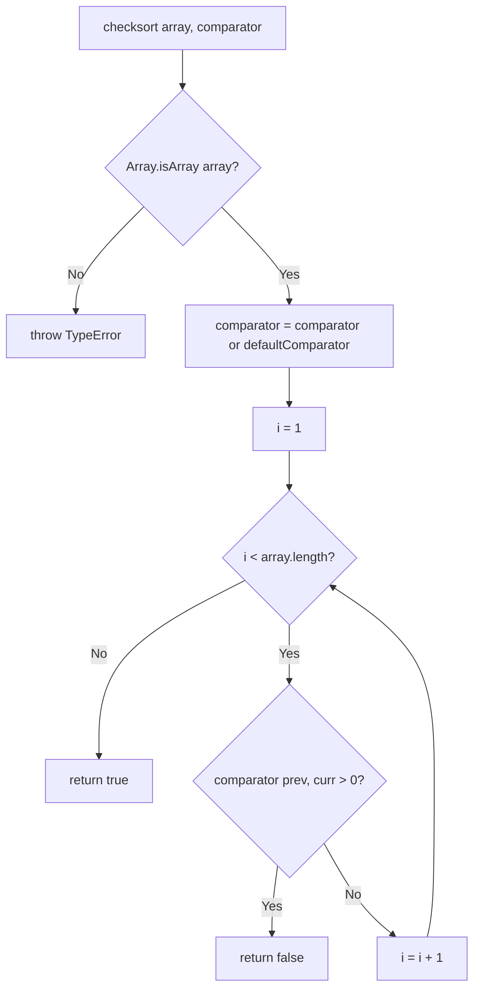
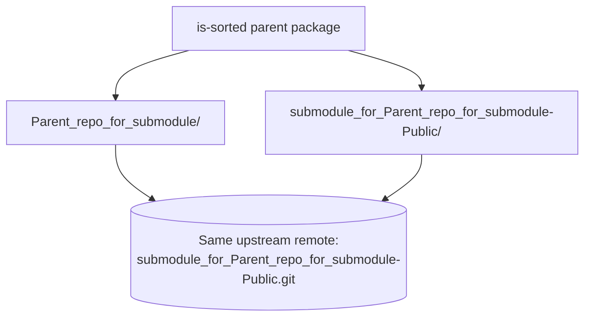

# is-sorted
[](https://www.npmjs.org/package/is-sorted)
[](https://github.com/feross/standard)

A small module to check if an Array is sorted.

## Overview

`is-sorted` is a compact module to check if an Array is sorted (Source: `package.json:L4`). At version `1.0.5` (Source: `package.json:L3`) it exposes a single function that walks an array once and reports whether every adjacent pair is in order, using either a caller-supplied comparator or a numeric-ascending default (Source: `index.js:L1-L7`).

The package has **zero runtime dependencies** — its only development dependencies are `standard` and `tape` (Source: `package.json:L30-L33`). It ships a CommonJS entry point (`main: index.js`) together with a bundled TypeScript declaration (`types: index.d.ts`) (Source: `package.json:L5-L6`), so it works out of the box in both JavaScript and TypeScript projects. It is authored by Daniel Cousens and distributed under the MIT license (Source: `package.json:L28-L29`).

## Installation

Install from npm:

```bash
npm install is-sorted
```

**Supported Node.js runtimes.** The package is continuously tested against Node.js `14.x`, `16.x`, and `18.x` (Source: `.github/workflows/tests.yml:L16`), with the lint job running on `18.x` (Source: `.github/workflows/tests.yml:L34`). Node `14.x` is therefore the lowest tested version and `18.x` the highest supported. The package does not declare an `engines` field, so no runtime version is enforced at install time.

## Build & Run

There is **no build step** — the module is plain CommonJS and requires no transpilation or bundling. The following npm scripts are available (Source: `package.json:L7-L9`):

| Command | Description |
|---------|-------------|
| `npm test` | Runs the `tape` test suite `tape test/*.js` (Source: `package.json:L9`). |
| `npm run standard` | Runs JavaScript Standard Style linting (Source: `package.json:L8`). |

## API Reference

The package exports a single function. Its internal name is `checksort`; when consumed it is typically imported under the alias `sorted` (`const sorted = require('is-sorted')`).

```
checksort<T = any>(array: T[], comparator?: (a: T, b: T) => number): boolean
```

(Source: `index.js:L49`, `index.d.ts:L21`)

### Parameters

| Parameter | Type | Required | Description |
|-----------|------|----------|-------------|
| `array` | `T[]` | Yes | The array to test for sortedness. |
| `comparator` | `(a: T, b: T) => number` | No | Optional ordering function; returns a negative number, zero, or a positive number when `a` is respectively less than, equal to, or greater than `b`. Defaults to numeric ascending order (`a - b`) (Source: `index.js:L17-L19`, `index.js:L52`). |

### Type parameter

- `T` — the element type of the array under test; defaults to `any` (Source: `index.d.ts:L21`).

### Returns

`boolean` — `true` if the array is sorted under `comparator`, otherwise `false`. The scan walks each adjacent pair and short-circuits to `false` on the first pair for which `comparator(previous, current) > 0` (Source: `index.js:L56-L60`).

### Throws

`TypeError` — with the message `Expected Array, got <type>` when `array` is not an Array (Source: `index.js:L51`).

### Edge cases

- Empty arrays (`[]`) and single-element arrays (`[1]`) are trivially sorted and return `true`.
- Adjacent duplicate values are considered sorted — the comparison is non-strict (`<=`) — so `[1, 1, 3, 4, 5]` returns `true`.

> The description, parameters, return type, and thrown error above are kept synchronized with the JSDoc in `index.js` and the TSDoc in `index.d.ts`, so the typed contract remains authoritative.

## Usage Examples

The canonical example below is preserved verbatim from the original README: it demonstrates the default ascending check and a custom (descending) comparator. A behavior matrix covering additional edge cases — every row verified against the test fixtures — follows it.

## Example
``` javascript
const sorted = require('is-sorted')

console.log(sorted([1, 2, 3]))
// => true

console.log(sorted([3, 1, 2]))
// => false

// supports custom comparators
console.log(sorted([3, 2, 1], function (a, b) { return b - a }))
// => true
```

**Behavior matrix.** Every row below is verified against the test fixtures (Source: `test/fixtures.json:L1-L53`); the descending comparator is `function (a, b) { return b - a }` (Source: `test/index.js:L15`).

| Input | Comparator | Result |
|-------|-----------|--------|
| `[]` | default | `true` |
| `[1]` | default | `true` |
| `[1, 2, 3, 4, 5]` | default | `true` |
| `[1, 1, 3, 4, 5]` | default (duplicates) | `true` |
| `[1, 1.5, 3, 4, 5]` | default (floats) | `true` |
| `[1, 5, 2, 3, 4]` | default (unsorted) | `false` |
| `[5, 4, 3, 2, 1]` | `(a, b) => b - a` (descending) | `true` |
| `[5, 4, 3, 1, 2]` | descending (unsorted) | `false` |

The same cases as runnable code:

```javascript
const sorted = require('is-sorted')
const descending = (a, b) => b - a

sorted([])                          // => true  (empty is trivially sorted)
sorted([1])                         // => true  (single element)
sorted([1, 2, 3, 4, 5])             // => true
sorted([1, 1, 3, 4, 5])             // => true  (adjacent duplicates allowed)
sorted([1, 1.5, 3, 4, 5])           // => true  (floats)
sorted([1, 5, 2, 3, 4])             // => false (unsorted)
sorted([5, 4, 3, 2, 1], descending) // => true
sorted([5, 4, 3, 1, 2], descending) // => false (unsorted for descending)
```

## Deployment / Publishing

**Consume as a dependency.** Add the package to a project with `npm install is-sorted`, then load it with `require('is-sorted')` in CommonJS or `import sorted = require('is-sorted')` in TypeScript.

**Publish to npm.** The package is published to the npm registry as `is-sorted` at version `1.0.5` (Source: `package.json:L2-L3`) via `npm publish`. Its repository, issue tracker, and homepage all point to `https://github.com/dcousens/is-sorted` (Source: `package.json:L11-L18`).

There is **no separate documentation-site deployment** — this documentation ships inside the repository and renders on GitHub, including the Mermaid diagrams below.

## Project Structure

The repository declares two Git submodule mount points alongside the package source (Source: `.gitmodules:L1-L6`):

```
is-sorted/
├── index.js                 # CommonJS implementation (checksort)
├── index.d.ts               # TypeScript declaration
├── package.json             # Package manifest (v1.0.5)
├── README.md                # This file
├── LICENSE                  # MIT license
├── .gitmodules              # Declares the two submodule mounts
├── test/
│   ├── index.js             # tape test runner
│   └── fixtures.json        # table-driven test cases
├── .github/workflows/
│   └── tests.yml            # CI: Node 14/16/18 test + lint
├── Parent_repo_for_submodule/                        # submodule mount 1 (.gitignore templates)
└── submodule_for_Parent_repo_for_submodule-Public/   # submodule mount 2 (.gitignore templates)
```

## Submodule Context

This repository declares **two** Git submodule mount points — `Parent_repo_for_submodule/` and `submodule_for_Parent_repo_for_submodule-Public/` — that both point at the **same** upstream remote, `https://github.com/lakshya-blitzy/submodule_for_Parent_repo_for_submodule-Public.git` (Source: `.gitmodules:L1-L6`). Each mount is pinned independently by the parent repository.

Both submodules are supplemental collections of `.gitignore` templates. They are **not** required to install or use `is-sorted` — the package's `main` and `types` fields designate its entry point (`index.js`) and TypeScript declaration (`index.d.ts`) (Source: `package.json:L5-L6`), and the package declares no runtime dependencies, only the development dependencies `standard` and `tape` (Source: `package.json:L30-L33`). Initialize or update the submodules from the repository root with:

```bash
git submodule update --init --recursive
```

## Diagrams

**`checksort` control flow** (Source: `index.js:L49-L60`):



**Repository and submodule topology** (Source: `.gitmodules:L1-L6`):



## LICENSE [MIT](LICENSE)
