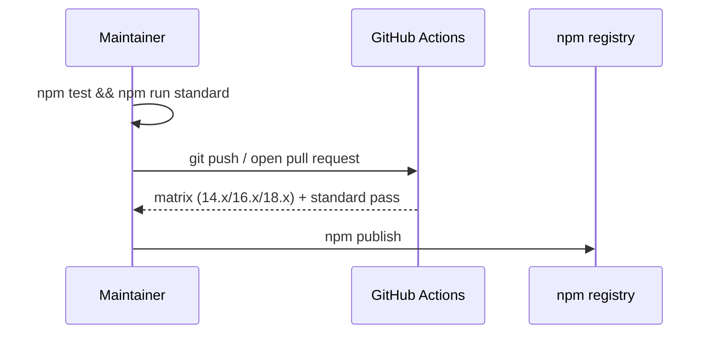

# is-sorted
[](https://www.npmjs.org/package/is-sorted)
[](https://github.com/feross/standard)

A compact module to check if an Array is sorted.

Zero runtime dependencies, a single exported function, and first-class
TypeScript types. Empty and single-element arrays are treated as sorted, and a
custom comparator lets you check any ordering you like.
(Source: package.json:L4; index.js:L51-L59)

## Table of Contents

- [Installation](#installation)
- [Usage](#usage)
- [API](#api)
- [How It Works](#how-it-works)
- [Development](#development)
- [Publishing](#publishing)
- [Git Submodules](#git-submodules)
- [License](#license-mit)

## Installation

Install from the npm registry:

``` bash
npm install is-sorted
```

**Prerequisites:** Node.js `>= 14` is the supported floor, and the package runs
on any modern Node.js release. The continuous-integration matrix exercises the
package on Node `14.x`, `16.x`, and `18.x`
(Source: .github/workflows/tests.yml:L16). No `engines` field is declared, so
the version is a recommendation rather than an enforced constraint
(Source: package.json). The package has **zero runtime dependencies**
(Source: package.json).

> **Security note:** the historical CI-matrix versions (`14.x`, `16.x`, `18.x`)
> are **end-of-life** and no longer receive security updates. For production use,
> run a currently-supported Node.js LTS release — Node `22` or `24` as of July
> 2026 — and consult the official
> [Node.js release schedule](https://nodejs.org/en/about/previous-releases) for
> the authoritative, always-current list. Because `>= 14` is only a floor, those
> supported LTS lines are already covered.

## Usage

`is-sorted` exports a single function. Because consumers `require('is-sorted')`,
the examples below name it `sorted`.

``` javascript
const sorted = require('is-sorted')

// Default comparator — ascending numeric order (Source: index.js:L26-L27,L53)
console.log(sorted([1, 2, 3]))
// => true

console.log(sorted([3, 1, 2]))
// => false

// supports custom comparators (descending) (Source: test/index.js:L17)
console.log(sorted([3, 2, 1], function (a, b) { return b - a }))
// => true

// Edge cases: empty and single-element arrays are trivially sorted
// (Source: test/fixtures.json)
console.log(sorted([]))
// => true

console.log(sorted([1]))
// => true
```

TypeScript is supported out of the box via the bundled declarations
(Source: index.d.ts:L16-L18). Use the `import ... = require(...)` form because
the module uses `export = checksort`:

``` typescript
import sorted = require('is-sorted')

sorted([1, 2, 3]) // => true
sorted([3, 2, 1], (a, b) => b - a) // => true
```

## API

### `checksort(array[, comparator]) => boolean`

The default export. Returns `true` when `array` is sorted according to
`comparator`, otherwise `false` (Source: index.js:L51-L59).

| Parameter | Type | Required | Description |
|-----------|------|----------|-------------|
| `array` | `Array` | Yes | The array to test for sortedness. |
| `comparator` | `(a, b) => number` | No | Ordering function; defaults to ascending numeric order (`a - b`). |

- **Returns:** `boolean` — `true` when every adjacent pair is in order,
  otherwise `false` (Source: index.js:L55-L59).
- **Throws:** `TypeError` with the message
  `'Expected Array, got ' + typeof array` when `array` is not an Array
  (Source: index.js:L52; asserted by test/index.js:L34-L39).
- **Default comparator:** when `comparator` is omitted, ascending numeric order
  (`a - b`) is used (Source: index.js:L26-L27,L53). The comparator follows the
  same contract as the callback passed to `Array.prototype.sort`: it returns a
  negative number if `a` should precede `b`, a positive number if `a` should
  follow `b`, or `0` when the pair is already in order.
- **Complexity:** `O(n)` time (a single linear pass) and `O(1)` extra space
  (Source: index.js:L55-L56).

Passing a non-Array throws immediately:

``` javascript
const sorted = require('is-sorted')

sorted('not an array')
// => throws TypeError: Expected Array, got string
```

**TypeScript signature** (Source: index.d.ts:L16):

``` typescript
declare function checksort<T = any> (array: T[], comparator?: (a: T, b: T) => number): boolean
```

## How It Works

`checksort` validates its input and then makes one left-to-right pass over the
array (Source: index.js:L51-L59):

1. **Validate the input.** If `array` is not an Array, throw
   `TypeError('Expected Array, got ' + typeof array)` (Source: index.js:L52).
2. **Choose the comparator.** When no `comparator` is supplied, fall back to the
   private `defaultComparator`, which implements ascending numeric order
   (`a - b`) (Source: index.js:L26-L27,L53).
3. **Scan adjacent pairs.** Starting at index `1`, compare each element with its
   predecessor: `comparator(array[i - 1], array[i])`
   (Source: index.js:L55-L56).
4. **Short-circuit on disorder.** If the comparator returns a value greater than
   `0`, the pair is out of order, so return `false` immediately
   (Source: index.js:L56).
5. **Otherwise it is sorted.** If the loop completes without finding an
   out-of-order pair, return `true`. Empty and single-element arrays never enter
   the loop and are therefore trivially sorted (Source: index.js:L55-L59).


## Development

Work on the package from source (Source: package.json:L7-L9; test/index.js):

``` bash
git clone https://github.com/dcousens/is-sorted.git
cd is-sorted
npm install

npm test          # runs "tape test/*.js" — 13 assertions
npm run standard  # JavaScript Standard Style lint
```

- `npm test` runs the [tape](https://github.com/ljharb/tape) suite, which is
  driven by the fixtures in `test/fixtures.json` plus a `TypeError` assertion
  (Source: package.json:L9; test/index.js:L1-L39).
- `npm run standard` runs [Standard Style](https://github.com/standard/standard);
  the code (including its JSDoc) must stay lint-clean (Source: package.json:L8).

## Publishing

There is **no build or compilation step** — the JavaScript is published exactly
as authored. `index.js` is the package entry point (`main`) and `index.d.ts`
ships the TypeScript type declarations (`types`)
(Source: package.json:L5-L6).

### Package contents

⚠️ **Before a real release, add a publish allowlist.** `package.json` declares
**no `files` field** and the repository has **no `.npmignore`**
(Source: package.json). As a result, `npm publish` (and `npm pack`) currently
bundle **every tracked file** in the working tree — including the two vendored
Git-submodule template trees, the `test/` fixtures, the `.github/` workflow, and
`.gitmodules` (Source: .gitmodules). On the current tree `npm pack --dry-run`
reports **641 entries** (~400 KB unpacked), the vast majority of which are
unintended submodule template files rather than the shipped module.

To publish only the intended artifacts, add an npm allowlist before the next
release — either a `files` field in `package.json`:

``` json
"files": ["index.js", "index.d.ts"]
```

or an equivalent root `.npmignore`. npm always additionally includes
`package.json`, `README.md`, and `LICENSE`, so the resulting tarball ships
exactly **five files** — `index.js`, `index.d.ts`, `package.json`, `README.md`,
and `LICENSE` — instead of 641. (Verify with `npm pack --dry-run`.)

Releases are cut **manually** with `npm publish`. There is no release or publish
automation: the CI workflow only runs the test matrix and the linter on pushes
to `main` and on pull requests (Source: .github/workflows/tests.yml:L1-L36).

Recommended pre-publish checklist:

``` bash
npm test           # all assertions pass
npm run standard   # lint is clean
npm pack --dry-run # review the exact file list that will be published
npm version <patch|minor|major>
npm publish
```

Confirming CI is green before publishing is a **recommended practice**, not an
enforced gate — the workflow contains no publish step
(Source: .github/workflows/tests.yml:L1-L36).



## Git Submodules

This repository vendors two Git submodules, declared in `.gitmodules`
(Source: .gitmodules):

- `Parent_repo_for_submodule`
- `submodule_for_Parent_repo_for_submodule-Public`

Both are clones of GitHub's [`.gitignore` template
collection](https://github.com/github/gitignore) — data/templates only, with no
JavaScript source or public API to document.

Fetch the submodules from a clone of **this** repository (the one that declares
`.gitmodules`):

``` bash
# In an existing clone of this repository:
git submodule update --init --recursive

# Or clone this repository with its submodules in one step:
git clone --recurse-submodules <repository-url>
```

**There are no nested submodules.** Recursive inspection finds a single
`.gitmodules`, at the repository root, so the submodule tree is exactly one
level deep (Source: .gitmodules).

## LICENSE [MIT](LICENSE)
