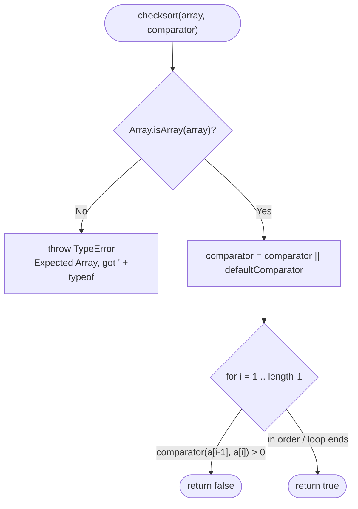
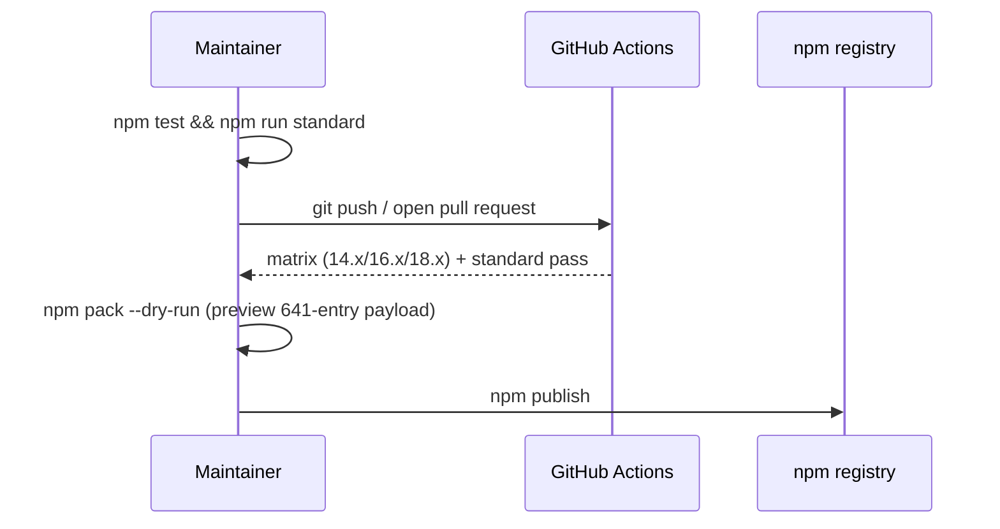

# is-sorted
[](https://www.npmjs.org/package/is-sorted)
[](https://github.com/feross/standard)

A compact module to check if an Array is sorted.

<!-- Description reconciled with the package manifest. Source: package.json (description field) -->

## Table of Contents

- [Installation](#installation)
- [Usage](#usage)
- [API](#api)
- [How It Works](#how-it-works)
- [Development](#development)
- [Publishing](#publishing)
- [Git Submodules](#git-submodules)
- [License](#license-mit)

## Installation

Install the published package from the npm registry:

```bash
npm install is-sorted
```

- **Prerequisites:** Node.js >= 14. The continuous-integration matrix exercises Node.js `14.x`, `16.x`, and `18.x` (Source: .github/workflows/tests.yml:L16), and the lint job is pinned to Node `18.x` (Source: .github/workflows/tests.yml:L34).
- **Zero runtime dependencies.** The package ships no production dependencies — the manifest declares only `standard` and `tape` as `devDependencies` (Source: package.json).

To work from source instead, see [Development](#development) for the `git clone` + `npm install` workflow.

## Usage

`is-sorted` exports a single function. Consumers `require('is-sorted')` and conventionally bind it to the name `sorted` (Source: index.js:L51). By default it checks for ascending numeric order, and it accepts an optional custom comparator with the same contract as `Array.prototype.sort`.

```javascript
const sorted = require('is-sorted')

// Default ascending comparator (Source: index.js:L26-L27,L53)
console.log(sorted([1, 2, 3])) // => true
console.log(sorted([3, 1, 2])) // => false

// Custom comparator — descending (Source: test/index.js:L17)
console.log(sorted([3, 2, 1], function (a, b) { return b - a })) // => true

// Edge cases: empty and single-element arrays are trivially sorted (Source: test/fixtures.json)
console.log(sorted([]))  // => true
console.log(sorted([1])) // => true
```

TypeScript users import the function with the `import ... = require(...)` form, which matches the `export = checksort` declaration (Source: index.d.ts:L16-L18):

```typescript
import sorted = require('is-sorted')

sorted([1, 2, 3]) // => true (Source: index.d.ts:L16-L18)
```

## API

### `checksort(array[, comparator]) => boolean`

Returns `true` when `array` is sorted according to `comparator`, otherwise `false` (Source: index.js:L51-L59). The function is a named function expression assigned directly to `module.exports`, so its name is `checksort` (Source: index.js:L51).

| Parameter | Type | Required | Description |
|-----------|------|----------|-------------|
| `array` | `Array` | Yes | The array to test for sortedness. |
| `comparator` | `(a, b) => number` | No | Ordering function; defaults to ascending numeric `a - b`. |

- **Returns:** `boolean` — `true` if every adjacent pair is in order, `false` on the first out-of-order pair (Source: index.js:L55-L59).
- **Throws:** `TypeError` with the message `'Expected Array, got ' + typeof array` when `array` is not an Array (Source: index.js:L52); this contract is asserted by the test regex `/Expected Array, got string/` (Source: test/index.js:L34-L39).
- **Default comparator:** ascending numeric `a - b`, applied when `comparator` is omitted (Source: index.js:L26-L27,L53). A comparator returns a negative number, zero, or a positive number — the pair is considered out of order only when the result is greater than `0`.
- **Complexity:** O(n) time and O(1) space — a single linear pass over the array with no extra allocation (Source: index.js:L55-L59).
- **TypeScript:** `checksort<T = any>(array: T[], comparator?: (a: T, b: T) => number): boolean` (Source: index.d.ts:L16-L18).

## How It Works

The implementation is a single validation guard followed by one linear scan of adjacent pairs (Source: index.js:L51-L59):

1. **Validation guard.** If the input is not an array (`!Array.isArray(array)`), the function throws `TypeError('Expected Array, got ' + (typeof array))` (Source: index.js:L52).
2. **Default-comparator assignment.** When no comparator is supplied, it falls back to `defaultComparator`, which returns `a - b` for ascending numeric order (Source: index.js:L26-L27,L53).
3. **Single linear pass.** It iterates from index `1` to `length - 1`, comparing each element with its predecessor via `comparator(array[i - 1], array[i])` (Source: index.js:L55-L56).
4. **Early exit on disorder.** If any adjacent pair yields a comparator result greater than `0`, the pair is out of order and the function immediately returns `false` (Source: index.js:L56).
5. **Terminal success.** If the loop completes without finding an out-of-order pair, the array is sorted and the function returns `true` (Source: index.js:L59).



## Development

Clone the repository and run the test and lint suites from source (Source: package.json:L7-L9; test/index.js):

```bash
git clone https://github.com/dcousens/is-sorted.git
cd is-sorted
npm install
npm test          # tape test/*.js — 13 assertions
npm run standard  # JavaScript Standard Style lint
```

- `npm test` runs the [`tape`](https://www.npmjs.com/package/tape) suite (`tape test/*.js`), which reports 13 assertions — 12 fixture-driven cases plus one `TypeError` assertion (Source: package.json:L7-L9; test/index.js; test/fixtures.json).
- `npm run standard` runs the [JavaScript Standard Style](https://github.com/feross/standard) linter and must report no violations (Source: package.json:L7-L9).

## Publishing

Releasing `is-sorted` is a manual `npm publish` — there is **no build step**. The runtime entry point (`main`) is `index.js` and the TypeScript type entry point (`types`) is `index.d.ts` (Source: package.json:L5-L6); these are the files consumers load, but they are **not** the whole published tarball. Because the manifest declares no `files` allowlist and the repository has no `.npmignore`, `npm publish` packs the entire working tree: `npm pack --dry-run` reports **641 entries** — the source and type entry points plus the test suite, `.github`, `.gitmodules`, and 316 files from each of the two vendored submodules (Source: npm pack --dry-run). A release is cut only after the CI workflow is green across the full Node.js matrix and the `standard` lint job (Source: .github/workflows/tests.yml:L1-L36):

1. Run `npm test` and `npm run standard` locally to confirm the tree is green.
2. Push or open a pull request so GitHub Actions validates the `14.x`/`16.x`/`18.x` matrix and the `standard` job (Source: .github/workflows/tests.yml:L1-L36).
3. Run `npm pack --dry-run` to preview the exact tarball contents (currently **641 entries**) before releasing (Source: npm pack --dry-run).
4. Once CI is green, publish with `npm publish`.

> **Note on payload size.** Narrowing the tarball to only the runtime and type entry points would require adding a `files` allowlist (or an `.npmignore`) to `package.json` — a separate packaging decision outside the scope of this documentation update.



## Git Submodules

This project vendors two Git submodules, both declared in `.gitmodules` at the repository root (Source: .gitmodules):

- `Parent_repo_for_submodule`
- `submodule_for_Parent_repo_for_submodule-Public`

Both are clones of a GitHub `.gitignore` template collection, as documented in each submodule's own README (Source: Parent_repo_for_submodule/README.md; submodule_for_Parent_repo_for_submodule-Public/README.md). To fetch them alongside the repository, clone recursively or initialize the submodules in an existing clone:

```bash
git clone --recurse-submodules https://github.com/dcousens/is-sorted.git
# or, in an existing clone:
git submodule update --init --recursive
```

**There are no nested submodules.** Verified by recursive inspection — only one `.gitmodules` exists, at the repository root, and `git submodule status --recursive` reports no submodules within the submodules (Source: recursive `.gitmodules` search; `git submodule status --recursive`).

## LICENSE [MIT](LICENSE)
