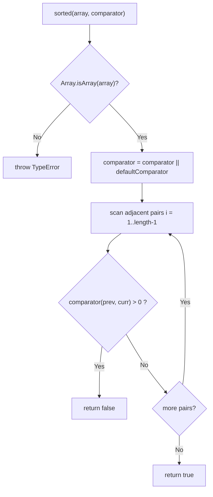

# is-sorted
[](https://www.npmjs.org/package/is-sorted)
[](https://github.com/feross/standard)

A compact module to check if an Array is sorted (Source: package.json).

`is-sorted` exposes a single function that returns `true` when an array is
already in order and `false` otherwise, with support for custom comparators. It
is written in plain JavaScript, has **no runtime dependencies**, and ships with
TypeScript type declarations (Source: package.json `main`, `types`).

## Table of Contents

- [Installation](#installation)
- [Usage](#usage)
- [API](#api)
- [How It Works](#how-it-works)
- [Submodules](#submodules)
- [Deployment / Publishing](#deployment--publishing)
- [Contributing](#contributing)
- [License](#license)

## Installation

Install the package from npm:

```bash
npm install is-sorted
```

`is-sorted` has **no runtime dependencies** and runs on **Node.js 14.x and
later** (Source: package.json; the CI matrix tests Node 14.x/16.x/18.x —
Source: .github/workflows/tests.yml:L1-L37).

### Contributor setup (submodule-aware clone)

This repository composes two Git submodules, so clone it **recursively** to
populate them (Source: .gitmodules:L1-L7):

```bash
git clone --recurse-submodules https://github.com/dcousens/is-sorted.git
cd is-sorted
npm install
```

If you have already cloned the repository without `--recurse-submodules`,
initialize and fetch the submodules afterwards:

```bash
git submodule update --init --recursive
```

## Usage

Import the module and call it with the array you want to check. By default it
checks for **ascending** numeric order (Source: index.js:L5, index.js:L1-L3):

```javascript
const sorted = require('is-sorted')

console.log(sorted([1, 2, 3]))
// => true

console.log(sorted([3, 1, 2]))
// => false
```

To check other orderings, pass a custom `comparator`. For example, a
**descending** comparator returns `b - a` (Source: index.js:L7):

```javascript
const sorted = require('is-sorted')

// supports custom comparators
console.log(sorted([3, 2, 1], function (a, b) { return b - a }))
// => true
```

## API

The package exports a single function. It is imported here as `sorted` and is
named `checksort` internally (Source: index.js:L5):

```javascript
const sorted = require('is-sorted')
```

### `sorted(array[, comparator]) => boolean`

Returns `true` when `array` is sorted according to `comparator`, otherwise
`false` (Source: index.js:L5-L14).

#### Parameters

| Parameter | Type | Required | Default | Description |
|-----------|------|----------|---------|-------------|
| `array` | `Array` | Yes | — | The array to inspect for sortedness (Source: index.js:L5). |
| `comparator` | `(a, b) => number` | No | ascending `a - b` | Comparator returning a negative number when `a` should precede `b`, `0` when the two are equivalent, and a positive number when `a` should follow `b`. Defaults to the built-in ascending numeric comparator (Source: index.js:L1-L3, index.js:L7). |

#### Returns

`boolean` — `true` when every adjacent pair is in order, otherwise `false`
(Source: index.js:L10, index.js:L13).

#### Throws

`TypeError` with the message `Expected Array, got <type>` when `array` is not an
Array, where `<type>` is the runtime `typeof` of the argument (Source:
index.js:L6).

#### Examples

Default ascending check:

```javascript
const sorted = require('is-sorted')

sorted([1, 2, 3]) // => true
sorted([3, 1, 2]) // => false
```

Custom descending comparator:

```javascript
const sorted = require('is-sorted')

sorted([3, 2, 1], function (a, b) { return b - a }) // => true
```

#### Edge cases

The following behaviors are validated by the test fixtures (Source:
test/fixtures.json, test/index.js):

| Input | Comparator | Result |
|-------|------------|--------|
| `[]` | default (ascending) | `true` |
| `[1]` | default (ascending) | `true` |
| `[5]` | default (ascending) | `true` |
| `[1, 5]` | default (ascending) | `true` |
| `[1, 2, 3, 4, 5]` | default (ascending) | `true` |
| `[1, 1, 3, 4, 5]` | default (ascending, duplicates) | `true` |
| `[1, 1.5, 3, 4, 5]` | default (ascending, fractional) | `true` |
| `[1, 2, 3, 4, 6]` | default (ascending) | `true` |
| `[5, 4, 3, 1, 1]` | descending `(a, b) => b - a` | `true` |
| `[5, 4, 3, 2, 1]` | descending `(a, b) => b - a` | `true` |
| `[1, 5, 2, 3, 4]` | default (ascending) | `false` |
| `[5, 4, 3, 1, 2]` | descending `(a, b) => b - a` | `false` |

Empty and single-element arrays are trivially sorted; duplicate and fractional
values are permitted; the default comparator only accepts ascending order, while
a custom comparator can validate any ordering (Source: test/fixtures.json).

### TypeScript

The package bundles type declarations (Source: package.json `types`;
index.d.ts:L1):

```ts
import checksort = require('is-sorted')

checksort([1, 2, 3])                  // => true
checksort([3, 2, 1], (a, b) => b - a) // => true
```

The declared signature is generic over the element type (Source: index.d.ts:L1):

```ts
declare function checksort<T = any> (array: T[], comparator?: (a: T, b: T) => number)
```

## How It Works

`checksort` is a single-pass sortedness check. Step by step (Source:
index.js:L5-L14):

1. **Input validation.** If the argument is not an array (`Array.isArray`
   returns `false`), the function throws a `TypeError` with the message
   `Expected Array, got <type>` (Source: index.js:L6).
2. **Comparator defaulting.** When no `comparator` is supplied, it falls back to
   `defaultComparator`, an ascending numeric comparator that returns `a - b`
   (Source: index.js:L7, index.js:L1-L3).
3. **Adjacent-pair scan.** A single left-to-right loop starts at index `1` and
   compares each element with its predecessor (Source: index.js:L9).
4. **Result.** The scan returns `false` as soon as it finds an out-of-order pair
   — that is, when `comparator(array[i - 1], array[i]) > 0`; if no such pair
   exists, it returns `true` (Source: index.js:L10, index.js:L13).

The algorithm runs in **O(n)** time and uses **O(1)** additional space, and it
**never mutates** the input array — it only reads adjacent elements (Source:
index.js:L9-L13).



## Submodules

This repository declares **two** Git submodule mount points (Source:
.gitmodules:L1-L7):

- `Parent_repo_for_submodule/`
- `submodule_for_Parent_repo_for_submodule-Public/`

Both mount points reference the **same upstream repository** at the same pinned
commit — `https://github.com/lakshya-blitzy/submodule_for_Parent_repo_for_submodule-Public.git`,
a fork of GitHub's collection of `.gitignore` templates (Source:
.gitmodules:L1-L7). This is called out explicitly because the two paths point at
one shared upstream, which can otherwise be confusing.

These submodules are **supplemental template collections** and are **not
required** to consume the `is-sorted` package — the published npm package
contains only the `index.js` implementation and its `index.d.ts` type
declarations (Source: package.json `main`, `types`). They matter only when
working with the full repository.

Initialize or update the submodules with (Source: .gitmodules:L1-L7):

```bash
git submodule update --init --recursive
```

There are **no nested submodules** in this repository (Source: .gitmodules).


## Deployment / Publishing

`is-sorted` is a dependency-free library, so "deployment" means **publishing a
new release to npm** (Source: package.json). Before publishing, run the test and
lint gates locally, bump the version, then publish:

```bash
npm test
npm run standard
npm version <patch|minor|major>
npm publish
```

`npm test` runs the tape suite and `npm run standard` runs the JavaScript
Standard Style linter (Source: package.json `scripts.test`,
`scripts.standard`). `npm version` updates `package.json` and creates a version
commit and tag, after which `npm publish` uploads the package to the npm
registry.

### Continuous integration gates

Every push to `main` and every pull request is guarded by the `Tests` GitHub
Actions workflow (Source: .github/workflows/tests.yml:L1-L37):

- **`unit`** — runs `npm install` then `npm test` on `ubuntu-latest` across
  Node.js **14.x, 16.x, and 18.x** (Source: .github/workflows/tests.yml:L1-L37).
- **`standard`** — runs `npm install` then `npm run standard` on Node.js **18.x**
  (Source: .github/workflows/tests.yml:L1-L37).

Both jobs must pass before a release is cut.

## Contributing

Clone the repository with its submodules, then install dependencies (Source:
.gitmodules:L1-L7):

```bash
git clone --recurse-submodules https://github.com/dcousens/is-sorted.git
cd is-sorted
npm install
```

Run the test suite (tape) and the linter (JavaScript Standard Style) before
opening a pull request (Source: package.json `scripts.test`,
`scripts.standard`):

```bash
npm test
npm run standard
```

Code changes must keep **both** `npm test` and `npm run standard` green — these
are the same gates enforced by CI (Source: .github/workflows/tests.yml:L1-L37).

## License

Released under the [MIT](LICENSE) License (Source: package.json `license`,
LICENSE). Authored by Daniel Cousens (Source: package.json `author`).
