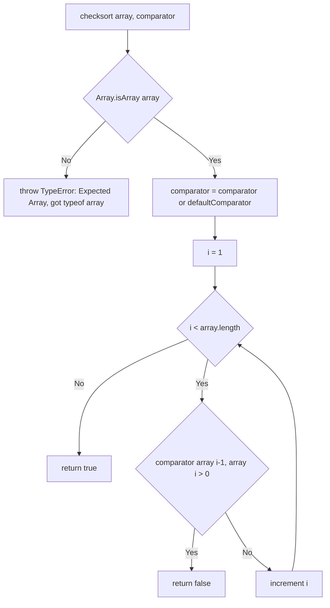
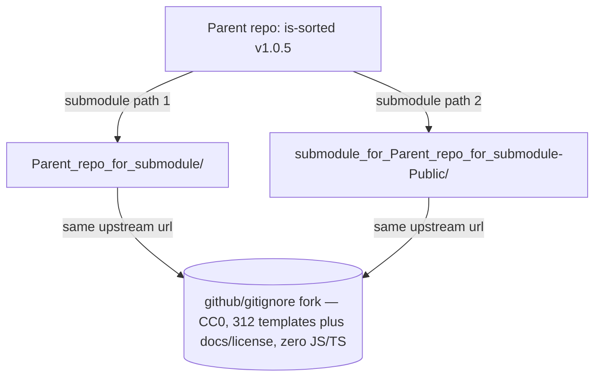

# is-sorted
[](https://www.npmjs.org/package/is-sorted)
[](https://github.com/feross/standard)

A compact module to check if an Array is sorted.

## Table of Contents

- [Features](#features)
- [Installation](#installation)
- [Usage](#usage)
- [API](#api)
- [How It Works](#how-it-works)
- [Testing / Development](#testing--development)
- [Deployment / Publishing](#deployment--publishing)
- [Git Submodules](#git-submodules)
- [LICENSE](#license-mit)

## Features

- **Single-pass `O(n)` scan.** Sortedness is determined with one left-to-right walk over adjacent pairs — no copying, no auxiliary sort. (Source: `index.js:L9-L13`)
- **Zero runtime dependencies.** The package declares only `devDependencies`, so nothing is pulled into your dependency tree at install time. (Source: `package.json:L30-L33`)
- **Optional custom comparator.** Pass any `(a, b) => number` callback following `Array.prototype.sort` semantics; the ascending numeric default is used when you omit it. (Source: `index.js:L7,L10`)
- **Ships TypeScript types.** A bundled ambient declaration (`index.d.ts`) provides IDE hover docs and type checking. (Source: `package.json:L6`)
- **Strict input validation.** Non-Array input throws a `TypeError` instead of silently returning a misleading result. (Source: `index.js:L6`)

## Installation

Install from npm with your package manager of choice:

``` bash
npm install is-sorted
# or
yarn add is-sorted
```

`is-sorted` is tested against **Node.js 14.x, 16.x, and 18.x** in continuous integration. (Source: `.github/workflows/tests.yml:L16`)
It has **zero runtime dependencies**, so installation adds nothing beyond the single module to your tree. (Source: `package.json:L30-L33`)

## Usage

The module exports a single function. Call it with an array to test whether the
array is already sorted in ascending numeric order (the default), or pass a
custom comparator to test any other ordering. The comparator follows the same
contract as the callback given to `Array.prototype.sort`. (Source: `README.md:L7-L20`, `index.js:L5`)

``` javascript
const sorted = require('is-sorted')

console.log(sorted([1, 2, 3]))
// => true

console.log(sorted([3, 1, 2]))
// => false

// supports custom comparators
console.log(sorted([3, 2, 1], function (a, b) { return b - a }))
// => true
```

## API

### `checksort(array[, comparator])` → `boolean`

Checks whether `array` is sorted and returns a boolean. This is the single value
exported by the module (`module.exports = function checksort ...`). (Source: `index.js:L5`; TypeScript: `index.d.ts:L1`)

**Parameters**

| Parameter    | Type                          | Required | Description                                                                                                                                 |
|--------------|-------------------------------|----------|---------------------------------------------------------------------------------------------------------------------------------------------|
| `array`      | `Array`                       | Yes      | The array to test for sortedness.                                                                                                            |
| `comparator` | `Function` — `(a, b) => number` | No       | Optional comparator following `Array.prototype.sort` semantics. Defaults to ascending numeric order `a - b`. (Source: `index.js:L1-L3,L7`) |

The `comparator` returns a negative number when `a` sorts before `b`, zero when
they are equal, and a positive number when `a` sorts after `b`. (Source: `index.js:L1-L3`)

**Returns**

`boolean` — `true` when the array is sorted, otherwise `false`. Empty arrays
(`[]`) and single-element arrays are always considered sorted, because the scan
never finds an out-of-order adjacent pair. (Source: `index.js:L9-L13`; fixtures: `test/fixtures.json:L2-L13`)

**Throws**

`TypeError('Expected Array, got <type>')` when `array` is not an Array — the
`<type>` is the runtime `typeof` of the offending argument. (Source: `index.js:L6`)

### TypeScript

The bundled ambient declaration exposes the following generic signature, which
matches the runtime export exactly (Source: `index.d.ts:L1`):

``` ts
checksort<T = any>(array: T[], comparator?: (a: T, b: T) => number)
```

Because the declaration uses the CommonJS `export = checksort` form
(Source: `index.d.ts:L3`), import it with the `import ... = require(...)` syntax:

``` ts
import checksort = require('is-sorted')

checksort([1, 2, 3]) // => true
```

Or, when `esModuleInterop` is enabled in your `tsconfig.json`, use a default
import instead:

``` ts
import checksort from 'is-sorted'

checksort([1, 2, 3]) // => true
```

### Examples

**1. Default ascending order** — omit the comparator to use ascending numeric
order (Source: `index.js:L1-L3,L7`):

``` javascript
const sorted = require('is-sorted')

sorted([1, 2, 3]) // => true
sorted([1, 5, 2, 3, 4]) // => false
```

**2. Custom descending comparator** — supply `(a, b) => b - a` to test
largest-first ordering (Source: `test/index.js:L5`, `test/fixtures.json:L39-L43`):

``` javascript
const sorted = require('is-sorted')

sorted([5, 4, 3, 2, 1], function (a, b) { return b - a }) // => true
```

**3. Non-Array input throws** — passing anything other than an Array raises a
`TypeError` (Source: `index.js:L6`, `test/index.js:L17-L22`):

``` javascript
const sorted = require('is-sorted')

sorted('foobar')
// => throws TypeError: Expected Array, got string
```

## How It Works

`checksort` neither copies nor sorts the input array; it performs a single
adjacent-pair pass using only constant local loop state (the index `i` and the
cached `length`). The annotated walkthrough below maps each step to its source
line in `index.js` (Source: `index.js:L9-L13`):

1. **Input guard.** `Array.isArray(array)` is checked first; a non-Array argument
   throws `TypeError('Expected Array, got ' + (typeof array))`. (Source: `index.js:L6`)
2. **Comparator defaulting.** `comparator = comparator || defaultComparator`
   substitutes the private default when no comparator is supplied; that default
   is ascending numeric order `a - b`. (Source: `index.js:L7`, `index.js:L1-L3`)
3. **Single adjacent-pair scan.** A single left-to-right loop compares each
   adjacent pair and returns `false` on the first pair where
   `comparator(array[i - 1], array[i]) > 0`. (Source: `index.js:L9-L11`)
4. **Sorted result.** If the loop finds no out-of-order pair, the function
   returns `true`. (Source: `index.js:L13`)

The control flow is summarized below:



## Testing / Development

Run the test suite with:

``` bash
npm test
```

This executes `tape test/*.js` (Source: `package.json:L9`), which runs the
**12 table-driven fixture cases** defined in `test/fixtures.json` plus a
dedicated `throws on non-Array inputs` case. (Source: `test/index.js:L8-L15,L17-L22`, `test/fixtures.json:L1-L53`)

Representative fixtures (Source: `test/fixtures.json:L1-L53`):

| Input                          | Comparator   | Expected |
|--------------------------------|--------------|----------|
| `[]` / `[1]` (empty / single)  | default      | `true`   |
| `[1, 1, 3, 4, 5]` (duplicates) | default      | `true`   |
| `[1, 1.5, 3, 4, 5]` (floats)   | default      | `true`   |
| `[1, 5, 2, 3, 4]` (unsorted)   | default      | `false`  |
| `[5, 4, 3, 2, 1]`              | `descending` | `true`   |

Check code style with:

``` bash
npm run standard
```

This runs `standard` (Source: `package.json:L8`), which enforces the
[`feross/standard`](https://github.com/feross/standard) style: 2-space
indentation, no semicolons, and single quotes. Both `npm test` and
`npm run standard` must stay green — documentation edits are comment/Markdown
only and change no runtime behavior.

## Deployment / Publishing

`is-sorted` is a zero-runtime-dependency **library**, not a service, so
"deployment" here means the **npm publishing workflow** rather than provisioning
servers or infrastructure. (Source: `package.json:L30-L33`)

Publish a new release in three steps:

``` bash
# 1. Bump the version (updates package.json and creates a git tag).
#    Substitute `minor` or `major` for `patch` as appropriate.
npm version patch

# 2. Run the tests and style check locally, and confirm the latest Tests
#    workflow run is green before publishing.
#    Source: .github/workflows/tests.yml:L9-L36
npm test && npm run standard

# 3. Publish to the npm registry
npm publish
```

The repository's CI **Tests** workflow runs on pushes to `main` and on pull
requests (Source: `.github/workflows/tests.yml:L3-L7`); its `unit` job runs
`npm test` across the Node.js 14.x/16.x/18.x matrix and its `standard` job runs
`npm run standard` on Node 18.x (Source: `.github/workflows/tests.yml:L9-L36`).
The workflow defines **no** publish or release job, so it does **not**
automatically gate `npm publish`. Treat a green CI run as a **manual
prerequisite**: before publishing, run `npm test` and `npm run standard`
locally and confirm the latest Tests workflow run is green, then publish
manually.

Consumers integrate the published package via CommonJS `require`, or a default
import in TypeScript (with `esModuleInterop` enabled):

``` javascript
const sorted = require('is-sorted')

console.log(sorted([1, 2, 3])) // => true
```

## Git Submodules

This repository declares **two** Git submodule mount points in `.gitmodules`,
`Parent_repo_for_submodule/` and `submodule_for_Parent_repo_for_submodule-Public/`,
both pointing at the **same** upstream URL
`https://github.com/lakshya-blitzy/submodule_for_Parent_repo_for_submodule-Public.git`.
(Source: `.gitmodules:L1-L6`)

Both submodules are vendored, **CC0-1.0**-licensed clones of the
[`github/gitignore`](https://github.com/github/gitignore) template collection
(distinct from this package's MIT license; Source: `Parent_repo_for_submodule/LICENSE:L1`).
The two mount points are pinned **independently** by the parent repository (rather
than to a single shared, mutable commit ID); run `git submodule status` to see the
commit each path currently tracks (Source: `git submodule status`). Each collection contains **312 `.gitignore`
templates** plus supporting documentation and license metadata — its own
`README.md`, `CONTRIBUTING.md`, `Global/README.md`, `LICENSE`, and `.github/`
files — and **no JavaScript or TypeScript**, so JSDoc is not applicable within
them. There are **no nested submodules** (no nested `.gitmodules`).

Initialize and fetch the submodule working trees with:

``` bash
git submodule update --init --recursive
```

After initialization, see each submodule's own documentation:

- [`Parent_repo_for_submodule/README.md`](Parent_repo_for_submodule/README.md)
- [`submodule_for_Parent_repo_for_submodule-Public/README.md`](submodule_for_Parent_repo_for_submodule-Public/README.md)

The submodule topology is summarized below:



## LICENSE [MIT](LICENSE)
