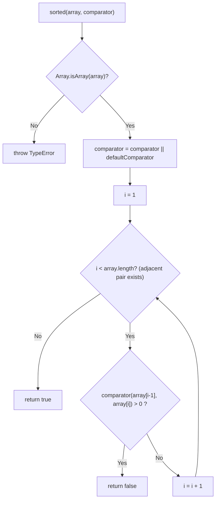
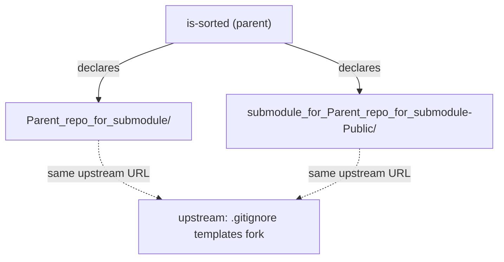

# is-sorted
[](https://www.npmjs.org/package/is-sorted)
[](https://github.com/feross/standard)

A compact module to check if an Array is sorted (Source: package.json).

`is-sorted` exposes a single function that returns `true` when an array is
already in order and `false` otherwise, with support for custom comparators. It
is written in plain JavaScript, has **no runtime dependencies**, and ships with
TypeScript type declarations (Source: package.json:L6 `types`; the package
declares only `devDependencies` — package.json:L30-L33).

## Table of Contents

- [Installation](#installation)
- [Usage](#usage)
- [API](#api)
- [How It Works](#how-it-works)
- [Submodules](#submodules)
- [Deployment / Publishing](#deployment--publishing)
- [Contributing](#contributing)
- [License](#license)

## Installation

Install the package from npm:

```bash
npm install is-sorted
```

`is-sorted` has **no runtime dependencies** (Source: package.json:L30-L33 — only
`devDependencies` are declared). Its GitHub Actions CI matrix tests on **Node.js
14.x, 16.x, and 18.x** (Source: .github/workflows/tests.yml:L10-L16).

### Contributor setup (submodule-aware clone)

The `is-sorted` **npm package** is published from its canonical repository at
<https://github.com/dcousens/is-sorted> (Source: package.json:L11-L14), but that
repository does **not** declare the submodules described here. The
**submodule-composed repository** — the one that declares the two mount points in
`.gitmodules` (Source: .gitmodules:L1-L6) — is hosted separately at
`lakshya-blitzy/Parent_repo_for_submodule`. Clone **that** repository
**recursively**, using `is-sorted` as the target directory, so the submodules are
populated:

```bash
git clone --recurse-submodules https://github.com/lakshya-blitzy/Parent_repo_for_submodule.git is-sorted
cd is-sorted
npm install
```

If you have already cloned the repository without `--recurse-submodules`,
initialize and fetch the submodules afterwards:

```bash
git submodule update --init --recursive
```

## Usage

Import the module and call it with the array you want to check. By default it
checks for **ascending** numeric order (Source: index.js:L42-L51, index.js:L13-L15):

```javascript
const sorted = require('is-sorted')

console.log(sorted([1, 2, 3]))
// => true

console.log(sorted([3, 1, 2]))
// => false
```

To check other orderings, pass a custom `comparator`. For example, a
**descending** comparator returns `b - a` (Source: index.js:L40; test/index.js:L28):

```javascript
const sorted = require('is-sorted')

// supports custom comparators
console.log(sorted([3, 2, 1], function (a, b) { return b - a }))
// => true
```

## API

The package exports a single function. It is imported here as `sorted` and is
named `checksort` internally (Source: index.js:L42):

```javascript
const sorted = require('is-sorted')
```

### `sorted(array[, comparator]) => boolean`

Returns `true` when `array` is sorted according to `comparator`, otherwise
`false` (Source: index.js:L42-L51).

#### Parameters

| Parameter | Type | Required | Default | Description |
|-----------|------|----------|---------|-------------|
| `array` | `Array` | Yes | — | The array to inspect for sortedness (Source: index.js:L42). |
| `comparator` | `(a, b) => number` | No | ascending `a - b` | Comparator returning a negative number when `a` should precede `b`, `0` when the two are equivalent, and a positive number when `a` should follow `b`. Defaults to the built-in ascending numeric comparator (Source: index.js:L13-L15, index.js:L44). |

#### Returns

`boolean` — `true` when every adjacent pair is in order, otherwise `false`
(Source: index.js:L47, index.js:L50).

#### Throws

`TypeError` with the message `Expected Array, got <type>` when `array` is not an
Array, where `<type>` is the runtime `typeof` of the argument (Source:
index.js:L43).

#### Examples

Default ascending check:

```javascript
const sorted = require('is-sorted')

sorted([1, 2, 3]) // => true
sorted([3, 1, 2]) // => false
```

Custom descending comparator:

```javascript
const sorted = require('is-sorted')

sorted([3, 2, 1], function (a, b) { return b - a }) // => true
```

#### Edge cases

The following behaviors are validated by the test fixtures (Source:
test/fixtures.json, test/index.js):

| Input | Comparator | Result |
|-------|------------|--------|
| `[]` | default (ascending) | `true` |
| `[1]` | default (ascending) | `true` |
| `[5]` | default (ascending) | `true` |
| `[1, 5]` | default (ascending) | `true` |
| `[1, 2, 3, 4, 5]` | default (ascending) | `true` |
| `[1, 1, 3, 4, 5]` | default (ascending, duplicates) | `true` |
| `[1, 1.5, 3, 4, 5]` | default (ascending, fractional) | `true` |
| `[1, 2, 3, 4, 6]` | default (ascending) | `true` |
| `[5, 4, 3, 1, 1]` | descending `(a, b) => b - a` | `true` |
| `[5, 4, 3, 2, 1]` | descending `(a, b) => b - a` | `true` |
| `[1, 5, 2, 3, 4]` | default (ascending) | `false` |
| `[5, 4, 3, 1, 2]` | descending `(a, b) => b - a` | `false` |

Empty and single-element arrays are trivially sorted; duplicate and fractional
values are permitted; the default comparator **defines ascending numeric order**,
while a custom comparator can define other orderings (Source: test/fixtures.json).

### TypeScript

The package bundles type declarations (Source: package.json:L6; index.d.ts:L28):

```ts
import checksort = require('is-sorted')

checksort([1, 2, 3])                  // => true
checksort([3, 2, 1], (a, b) => b - a) // => true
```

The declared signature is generic over the element type (Source: index.d.ts:L28):

```ts
declare function checksort<T = any> (array: T[], comparator?: (a: T, b: T) => number)
```

The declaration intentionally carries **no explicit return-type annotation**, so
its statically inferred return type is `any`, even though the runtime value is
always a `boolean` (Source: index.d.ts:L15-L17). Consuming the declaration under
strict TypeScript settings (for example `noImplicitAny` with declaration
checking) may therefore surface a `TS7010` implicit-`any` diagnostic; this
reflects the unchanged, comments-only declaration and does not affect the runtime
result.

## How It Works

`checksort` is a single-pass sortedness check. Step by step (Source:
index.js:L42-L51):

1. **Input validation.** If the argument is not an array (`Array.isArray`
   returns `false`), the function throws a `TypeError` with the message
   `Expected Array, got <type>` (Source: index.js:L43).
2. **Comparator defaulting.** When no `comparator` is supplied, it falls back to
   `defaultComparator`, an ascending numeric comparator that returns `a - b`
   (Source: index.js:L44, index.js:L13-L15).
3. **Adjacent-pair scan.** A single left-to-right loop starts at index `1` and
   compares each element with its predecessor (Source: index.js:L46).
4. **Result.** The scan returns `false` as soon as it finds an out-of-order pair
   — that is, when `comparator(array[i - 1], array[i]) > 0`; if no such pair
   exists, it returns `true` (Source: index.js:L47, index.js:L50).

The algorithm runs in **O(n)** time and uses **O(1)** additional space, and it
**never mutates** the input array — it only reads adjacent elements (Source:
index.js:L46-L50).



## Submodules

This repository declares **two** Git submodule mount points (Source:
.gitmodules:L1-L6):

- [`Parent_repo_for_submodule/`](Parent_repo_for_submodule/)
- [`submodule_for_Parent_repo_for_submodule-Public/`](submodule_for_Parent_repo_for_submodule-Public/)

Both mount points reference the **same upstream repository** URL —
`https://github.com/lakshya-blitzy/submodule_for_Parent_repo_for_submodule-Public.git`,
a fork of GitHub's collection of `.gitignore` templates (Source:
.gitmodules:L1-L6). Each mount is pinned **independently** by the parent
repository; run `git submodule status --recursive` to see the exact commit each
is currently pinned to. This is called out explicitly because the two paths point
at one shared upstream, which can otherwise be confusing.

These submodules are **supplemental template collections** and are **not
required** to consume the `is-sorted` package. The package's `main` and `types`
fields designate its entry point (`index.js`) and type declarations
(`index.d.ts`) (Source: package.json:L5-L6); they identify what a consumer loads,
**not** the exclusive contents of the published tarball. In fact `npm pack
--dry-run` reports that the tarball currently bundles many more files — including
the test suite and both submodule trees (641 entries) — so run it to inspect the
exact contents. These submodules matter mainly when working with the full
repository.

Initialize or update the submodules with (Source: .gitmodules:L1-L6):

```bash
git submodule update --init --recursive
```

There are **no nested submodules** in this repository (Source:
`git submodule status --recursive`, which lists only the two top-level mount
points).



## Deployment / Publishing

`is-sorted` is a dependency-free library, so "deployment" means **publishing a
new release to npm** (Source: package.json:L30-L33 — only `devDependencies` are
declared). Before publishing, run the test and lint gates locally, inspect
exactly what will be published, bump the version, then publish:

```bash
npm test
npm run standard
npm pack --dry-run
npm version patch
npm publish
```

`npm test` runs the tape suite and `npm run standard` runs the JavaScript
Standard Style linter (Source: package.json:L7-L10). `npm pack --dry-run` prints
the list of files that would be included in the published tarball — this
repository currently reports **641 entries** (including the test suite and both
submodule trees), so review that output before publishing. `npm version patch`
bumps the patch version (updating `package.json` and creating a version commit
and tag); use `npm version minor` or `npm version major` for larger releases —
this is standard npm CLI behavior. Finally, `npm publish` uploads the package to
the npm registry.

### Continuous integration gates

Every push to `main` and every pull request is guarded by the `Tests` GitHub
Actions workflow (Source: .github/workflows/tests.yml:L1-L36):

- **`unit`** — runs `npm install` then `npm test` on `ubuntu-latest` across
  Node.js **14.x, 16.x, and 18.x** (Source: .github/workflows/tests.yml:L10-L24).
- **`standard`** — runs `npm install` then `npm run standard` on Node.js **18.x**
  (Source: .github/workflows/tests.yml:L26-L36).

Both jobs must pass before a release is cut.

## Contributing

Clone the **submodule-composed repository** — the one that declares the two
submodule mount points in `.gitmodules` (Source: .gitmodules:L1-L6) — with its
submodules, then install dependencies. The canonical npm package is published from
<https://github.com/dcousens/is-sorted> (Source: package.json:L11-L14); the
submodule-composed repository is hosted separately at
`lakshya-blitzy/Parent_repo_for_submodule` and is cloned with the command below:

```bash
git clone --recurse-submodules https://github.com/lakshya-blitzy/Parent_repo_for_submodule.git is-sorted
cd is-sorted
npm install
```

Run the test suite (tape) and the linter (JavaScript Standard Style) before
opening a pull request (Source: package.json:L7-L10):

```bash
npm test
npm run standard
```

Code changes must keep **both** `npm test` and `npm run standard` green — these
are the same gates enforced by CI (Source: .github/workflows/tests.yml:L1-L36).

## License

Released under the [MIT](LICENSE) License (Source: package.json `license`,
LICENSE). Authored by Daniel Cousens (Source: package.json `author`).
