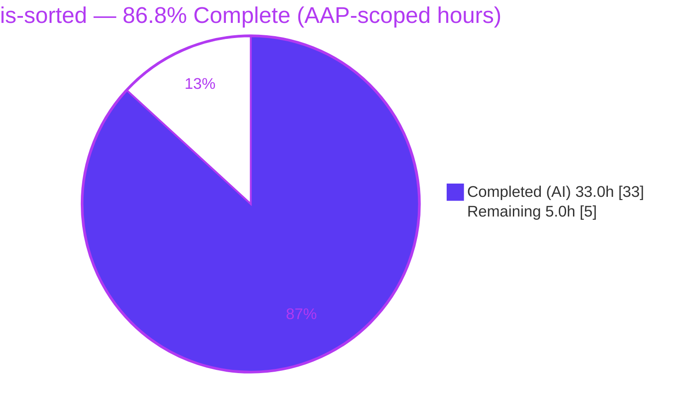
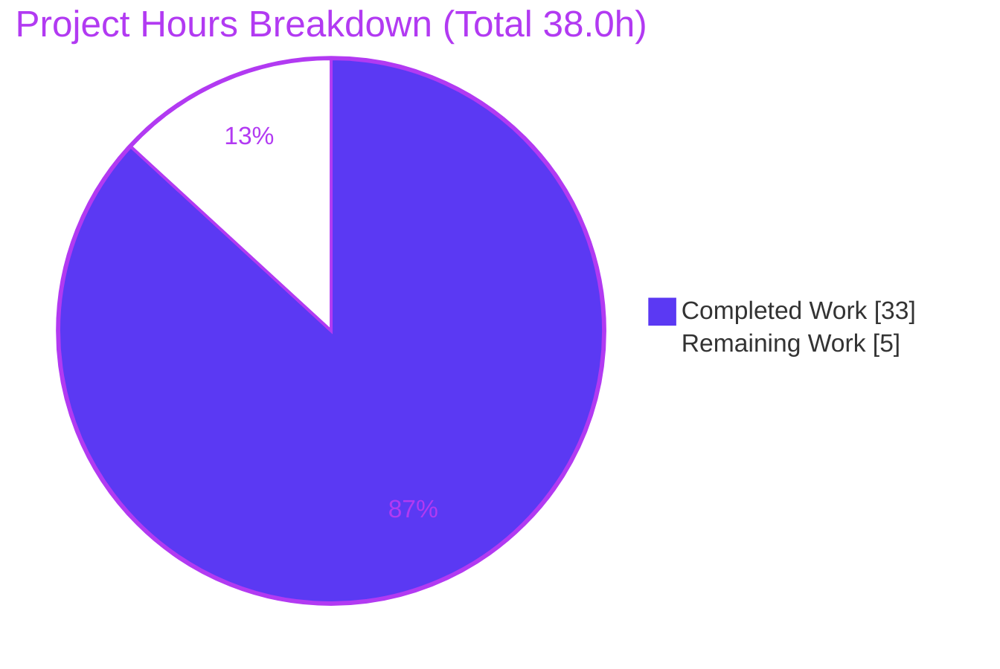
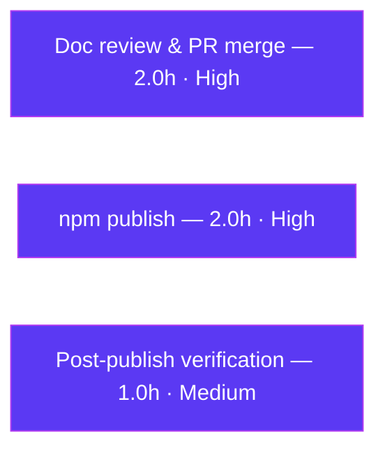

# Blitzy Project Guide — `is-sorted` Documentation Initiative

> Autonomous work delivered by Blitzy agents, measured against the Agent Action Plan (AAP). Branch `blitzy-cb5165d8-f259-4851-8409-6da2c53a0f82` · Parent HEAD `f8df343` · Both submodules HEAD `015e35e`.

---

## 1. Executive Summary

### 1.1 Project Overview

`is-sorted` is a compact, dependency-free npm utility (v1.0.5) that checks whether a JavaScript array is sorted, exposing one public function — `checksort(array, comparator)`. This initiative is **documentation-only**: it adds complete JSDoc/TSDoc to every function and authors a comprehensive README covering setup, API reference, deployment/publishing, and inline code explanations, then propagates contextual documentation across the parent repository **and both Git submodules** per binding user directives. Target users are npm consumers of the library and open-source contributors. The business impact is a professional, discoverable package page and lower contributor-onboarding friction. Technical scope is strictly comments and Markdown — no runtime behavior changes were made or intended.

### 1.2 Completion Status



> Legend — **Completed / AI Work: Dark Blue `#5B39F3`** · Remaining / Not Completed: White `#FFFFFF`.

| Metric | Value |
|--------|-------|
| **Total Hours** | **38.0 h** |
| **Completed Hours (AI + Manual)** | **33.0 h** (33.0 AI + 0.0 Manual) |
| **Remaining Hours** | **5.0 h** |
| **Percent Complete** | **86.8 %** |

Formula: `Completion % = Completed ÷ Total × 100 = 33.0 ÷ 38.0 × 100 = 86.8 %`.

### 1.3 Key Accomplishments

- ✅ **100 % JSDoc coverage** of all named functions — `defaultComparator` (`@private`), the public `checksort` (full `@param`/`@returns`/`@throws`/`@example` block), the test-suite `descending` comparator, plus a `@file` suite description (5 documentation blocks total).
- ✅ **TSDoc block** added to the `index.d.ts` declaration, mirroring the runtime JSDoc and documenting the intentional implicit-any (`TS7010`) behavior.
- ✅ **Comprehensive README** (335 lines, 11 sections, 2 Mermaid diagrams, 14 fenced code examples) delivering all four mandated areas: setup, API reference, deployment guide, and inline code explanations.
- ✅ **All Git submodules documented** — both mount points' `README.md` and `Global/README.md` received `is-sorted` context notes while upstream `.gitignore`-templates content was preserved verbatim; **zero nested submodules** confirmed.
- ✅ **Non-regression proven** — executable code is byte-for-byte identical to the original (comments-only); `npm test` passes **13/13** and `npm run standard` reports **0 violations**.
- ✅ **Clean, committed working tree** across the parent repository and both submodules; no dangling gitlinks.

### 1.4 Critical Unresolved Issues

| Issue | Impact | Owner | ETA |
|-------|--------|-------|-----|
| _None identified_ | No blocker to release or validation. All five production-readiness gates pass; zero failing tests, zero lint violations, zero unresolved errors. | — | — |

### 1.5 Access Issues

| System / Resource | Type of Access | Issue Description | Resolution Status | Owner |
|-------------------|----------------|-------------------|-------------------|-------|
| npm registry (`registry.npmjs.org`) | Publish credentials + 2FA | Publishing the enriched README to npmjs.com requires a maintainer's npm account and one-time-password. Blitzy agents cannot hold or use these credentials. This is the expected human release gate for any library. | Open — human action (see Task HT-2) | Package maintainer |
| GitHub `dcousens/is-sorted` (upstream) | Merge / push rights | Merging the documentation branch to the canonical upstream requires maintainer write access. | Open — human action (see Task HT-1) | Package maintainer |

### 1.6 Recommended Next Steps

1. **[High]** Review the comprehensive README, JSDoc/TSDoc, and submodule context notes for house-style and accuracy, then merge the documentation branch to `main` (Task HT-1).
2. **[High]** Bump the package version (`npm version patch` → `1.0.6`) and run `npm publish` with maintainer credentials so the improved README renders on npmjs.com (Task HT-2).
3. **[Medium]** Verify the published package page renders correctly and run a clean-room install smoke test (Task HT-3).
4. **[Low]** _Optional / outside mandated scope_ — add a `jsdoc` devDependency and `docs` script to generate an HTML API site (Task HT-4).
5. **[Low]** _Optional / outside mandated scope_ — in a separate non-docs PR, add an explicit `: boolean` return type to the `index.d.ts` declaration to eliminate the `TS7010` diagnostic under strict TypeScript (Task HT-5).

---

## 2. Project Hours Breakdown

### 2.1 Completed Work Detail

| Component | Hours | Description |
|-----------|------:|-------------|
| Inline JSDoc / TSDoc authoring (R1) | 6.0 | API-accurate JSDoc on `defaultComparator` (`@private`) and `checksort` (`@param`/`@returns`/`@throws`/`@example`); TSDoc on `index.d.ts`; `descending` comparator + `@file` doc in `test/index.js`. Standard-Style compliant, comments-only. |
| README — API Reference (R3) | 5.0 | `sorted(array[, comparator]) => boolean` signature, parameters table, return, thrown `TypeError`, examples, a 12-row edge-case table, and a TypeScript section documenting the `TS7010` behavior. |
| README — Installation & Setup (R2) | 2.0 | Consumer install (`npm install is-sorted`) plus contributor submodule-aware clone/init instructions. |
| README — Usage & How It Works (R5) | 4.0 | Minimal and custom-comparator usage; annotated 4-step algorithm walkthrough with complexity notes and a Mermaid control-flow diagram. |
| README — Deployment / Publishing + CI (R4) | 2.5 | `npm version` + `npm publish` workflow and the GitHub Actions CI gates (Node 14/16/18 matrix + `standard` lint on 18). |
| README — Scaffolding & Structure | 3.5 | Table of Contents, Submodules section, Contributing, License, submodule-composition Mermaid diagram, and overall prose/structure polish. |
| Submodule documentation (R6) | 3.0 | Context notes in both mount `README.md` (+39 lines each) and both `Global/README.md` (+2 each), upstream content preserved verbatim, cross-cited to `.gitmodules`; nested-submodule scope verified (none). |
| Citation accuracy & cross-doc consistency | 2.5 | Verified every source citation (`package.json`, `.gitmodules`, `index.js`, `index.d.ts`, `test/index.js`, `tests.yml`), confirmed matching parameter names / error message / return type across README + JSDoc + TSDoc, validated TOC anchors and the 641-file `npm pack` claim. |
| Validation & non-regression verification | 4.5 | `npm install`, `npm test` (13/13), `npm run standard` (0 violations), 20/20 runtime example execution, plus iterative review-fix cycles (findings F-A/F-B/M-01/M-02). |
| **Total Completed** | **33.0** | |

### 2.2 Remaining Work Detail

| Category | Hours | Priority |
|----------|------:|----------|
| Maintainer documentation review & PR merge (path-to-production) | 2.0 | High |
| npm publish — version bump, registry auth/2FA, publish, pre-publish pack verification (path-to-production) | 2.0 | High |
| Post-publish verification — npm page render check + clean-room install smoke test | 1.0 | Medium |
| **Total Remaining** | **5.0** | |

> Optional enhancements (HTML `jsdoc` site; explicit TS return type) are **outside mandated AAP scope** and are intentionally **excluded** from the remaining-hours total. They appear as informational tasks HT-4/HT-5 in Section 8.

### 2.3 Hours Reconciliation

- Section 2.1 total (Completed) = **33.0 h**
- Section 2.2 total (Remaining) = **5.0 h**
- 2.1 + 2.2 = **38.0 h** = Total Project Hours (Section 1.2) ✔
- Remaining (5.0 h) is identical in Sections 1.2, 2.2, and 7 ✔

---

## 3. Test Results

All tests below originate from Blitzy's autonomous validation logs for this project and were independently re-executed during this assessment.

| Test Category | Framework | Total Tests | Passed | Failed | Coverage % | Notes |
|---------------|-----------|------------:|-------:|-------:|-----------:|-------|
| Unit | tape 5.10.2 | 13 | 13 | 0 | Not instrumented* | 12 data-driven fixtures (empty, singleton, pairs, ascending, duplicates, fractional, descending ×2, out-of-order ×2) + 1 non-array `TypeError` assertion. |
| Runtime Example Validation | Node.js (manual harness) | 20 | 20 | 0 | n/a | Every documented example (README Usage/API/TypeScript + `index.js`/`index.d.ts` `@example`) and all 12 fixtures reproduce documented outputs; `TypeError` message exact. |
| **Total** | | **33** | **33** | **0** | | 100 % pass rate. |

\* No coverage instrument (`nyc`/`istanbul`) is configured in the package. Coverage is therefore not reported as a percentage; however, **all branches of `checksort`** (validation throw, comparator defaulting, in-order/out-of-order early-exit, empty/singleton short-circuit) are exercised by the fixtures.

**Additional quality gates (non-test, from validation logs):**

- `node --check index.js` and `node --check test/index.js` → syntax OK.
- `npm run standard` → **0 violations** (critical non-regression gate; engine trustworthiness confirmed via a deliberately bad-style scratch file that was correctly flagged and then removed).

---

## 4. Runtime Validation & UI Verification

**Runtime health & API validation** — ✅ Operational | ⚠ Partial | ❌ Failing

- ✅ Module loads and exports the `checksort` function.
- ✅ `npm test` → **13/13** pass (exit 0).
- ✅ `npm run standard` → **0** violations (exit 0).
- ✅ Ascending default: `sorted([1,2,3]) => true`, `sorted([3,1,2]) => false`.
- ✅ Custom comparator: `sorted([3,2,1], (a,b) => b - a) => true`.
- ✅ Edge cases: `sorted([]) => true`, `sorted([5]) => true`.
- ✅ Error path: `sorted('foobar')` throws `TypeError: Expected Array, got string` (message verified exact).
- ✅ Non-mutation guarantee holds (input array only read).
- ✅ Working trees clean across parent + both submodules; recorded gitlinks (`015e35e`) match submodule HEADs.

**UI Verification**

- ⚠ **Not applicable** — `is-sorted` is a headless library with no user interface, no runtime services, and no network ports. The `blitzy/screenshots` and `blitzy/screen_recordings` directories are intentionally empty.

---

## 5. Compliance & Quality Review

Cross-mapping of AAP deliverables (R1–R6) and project constraints to their delivery status. Fixes applied during autonomous validation are noted.

| Deliverable / Benchmark | Requirement | Status | Progress | Notes |
|-------------------------|-------------|:------:|:--------:|-------|
| R1 — JSDoc for all functions | 100 % named-function coverage | ✅ Pass | 100 % | 5 blocks; `@private` on helper; full block on public API. |
| R2 — README setup instructions | Consumer + contributor (submodule-aware) | ✅ Pass | 100 % | `--recurse-submodules` + `submodule update --init --recursive`. |
| R3 — README API documentation | Full `checksort` reference | ✅ Pass | 100 % | Params table, return, throws, examples, 12-row edge-case table, TS section. |
| R4 — README deployment guide | npm publish + CI gates | ✅ Pass | 100 % | Node 14/16/18 matrix + `standard` documented. |
| R5 — README inline explanations | Annotated algorithm walkthrough | ✅ Pass | 100 % | How-It-Works 4-step + complexity + Mermaid flowchart. |
| R6 — All submodules + nested | Every submodule documented; none excluded | ✅ Pass | 100 % | Both mounts + both `Global/` READMEs; upstream preserved; 0 nested (verified). |
| Comments-only non-regression | `npm test` green + `standard` clean | ✅ Pass | 100 % | Executable code byte-identical to original. |
| Citation accuracy | Every technical claim sourced | ✅ Pass | 100 % | Fixed during review cycles (F-A/F-B/M-01/M-02). |
| Cross-document consistency | Param names / error msg / return type aligned | ✅ Pass | 100 % | README ↔ JSDoc ↔ TSDoc verified. |
| Optional — HTML `jsdoc` API site | Not required by AAP | ⬜ Deferred | Optional | Excluded from mandated scope (READMEs render natively). |

**Overall compliance:** all mandated deliverables (R1–R6) and constraints **Pass**. The only deferred item is explicitly optional.

---

## 6. Risk Assessment

| Risk | Category | Severity | Probability | Mitigation | Status |
|------|----------|:--------:|:-----------:|------------|--------|
| T1 — `index.d.ts` `TS7010` implicit-any under strict TypeScript | Technical | Low | Low | Documented as intentional in README TypeScript section; declaration byte-identical to original; runtime always returns `boolean`. Optional explicit `: boolean` fix noted (HT-5). | Documented / Accepted |
| T2 — Comments-only change could regress behavior | Technical | Low | Very Low | Executable code verified byte-identical to base; `npm test` 13/13; `standard` 0 violations. | Mitigated / Verified |
| T3 — Submodule gitlink inconsistency | Technical | Low | Low | Parent gitlinks (`015e35e`) match both submodule HEADs; no dangling gitlink. | Verified |
| S1 — Dependency vulnerabilities | Security | Low | Low | Runtime is dependency-free; only devDeps `standard` + `tape`; validator reported 0 vulnerabilities; comments-only adds no attack surface. Deprecation warnings are dev-only transitive internals of `standard`. | Mitigated |
| S2 — Secret / credential exposure | Security | Low | Low | Documentation-only; no secrets introduced; publish credentials are human-held, never committed. | Clean |
| O1 — Submodules empty without initialization | Operational | Low | Medium | Fully documented (Installation + Submodules + context notes); npm consumers do **not** need submodules. | Documented / Mitigated |
| O2 — npm publish is human-gated | Operational | Medium | High | Requires npm credentials + 2FA; cannot be automated. Documented in Deployment section; tracked as HT-2. | Open (human task) |
| O3 — Documentation drift over time | Operational | Low | Low | AAP mandates cross-doc consistency; future signature changes must update JSDoc + TSDoc + README together. | Accepted (maintenance) |
| I1 — CI matrix compatibility | Integration | Low | Low | CI runs Node 14/16/18 + `standard`; comments-only verified green. (Node 14/16 EOL is pre-existing config, out of scope, unmodified.) | Mitigated / Verified |
| I2 — Submodule upstream linkage confusion | Integration | Low | Low | Both mounts reference the same upstream URL at the same pinned commit; documented explicitly to avoid reader confusion. | Documented |
| I3 — TypeScript consumer integration | Integration | Low | Low | `TS7010` behavior documented; types resolve; runtime value always boolean. | Documented |

**Risk posture:** Low overall. The only non-low item is O2 (npm publish) — the expected, well-understood human release gate.

---

## 7. Visual Project Status



> **Completed = Dark Blue `#5B39F3`**, Remaining = White `#FFFFFF`. "Remaining Work" (5.0 h) equals the Section 1.2 Remaining Hours and the Section 2.2 total.

**Remaining hours by category (Section 2.2):**



| Category | Hours | Priority |
|----------|------:|----------|
| Doc review & PR merge | 2.0 | High |
| npm publish | 2.0 | High |
| Post-publish verification | 1.0 | Medium |
| **Total** | **5.0** | |

---

## 8. Summary & Recommendations

**Achievements.** This documentation-only initiative delivered **100 % of the mandated AAP scope (R1–R6)**. Every named function now carries accurate JSDoc/TSDoc, the README was expanded into a comprehensive 335-line package guide covering all four mandated areas (setup, API, deployment, inline explanations), and contextual documentation was propagated to **both** Git submodules — honoring the user's binding "no submodule excluded" directives — while preserving upstream content verbatim. All changes are comments-and-Markdown only: the executable code is byte-for-byte identical to the original, so `npm test` (13/13) and `npm run standard` (0 violations) remain green.

**Remaining gaps.** The project is **86.8 % complete** (33.0 of 38.0 AAP-scoped hours). The outstanding **5.0 hours** are entirely **human-gated path-to-production** work: maintainer review and merge of the documentation branch, the npm publish (which requires maintainer credentials + 2FA and therefore cannot be automated), and a short post-publish verification.

**Critical path to production.** Review & merge → version bump & `npm publish` → verify the rendered package page. No engineering rework is required.

**Success metrics.** JSDoc coverage 100 %; four mandated README areas 4/4; submodule READMEs contextualized 2/2 (+ 2 `Global/`); nested submodules 0/0; unit tests 13/13; lint violations 0; runtime examples 20/20.

**Production-readiness assessment.** The branch is **production-ready** from an engineering standpoint. The remaining work is standard release ceremony, not defect resolution. Optional enhancements (an HTML `jsdoc` site; an explicit TS return type to silence `TS7010`) are outside the mandated scope and can be scheduled at the maintainer's discretion.

---

## 9. Development Guide

### 9.1 System Prerequisites

| Tool | Version (verified) | Notes |
|------|--------------------|-------|
| Node.js | v22.23.1 on host | Package supports 14.x+; CI validates 14.x / 16.x / 18.x. |
| npm | 11.18.0 | Ships with Node. |
| git | 2.51.0 | Required for submodule-aware clone. |
| git-lfs | 3.7.1 | Benign LFS hooks only; no quality-gate hooks. |

No database, cache, message queue, or server is required — `is-sorted` is a headless, zero-runtime-dependency library.

### 9.2 Environment Setup (submodule-aware)

```bash
# Option A — clone with submodules in one step
git clone --recurse-submodules <repo-url>
cd <repo>

# Option B — after a plain clone, initialize submodules
git submodule update --init --recursive

# Verify both submodule mounts are populated (expect commit 015e35e on both)
git submodule status --recursive
```

> npm **consumers** do not need submodules. Only contributors working on the full repository tree do. A clone without `--recurse-submodules` leaves the submodule directories empty until Option B is run.

### 9.3 Dependency Installation

```bash
npm install
```

Expected: dev dependencies (`standard`, `tape`) install with exit code 0. During validation this added 280 packages and audited 281 with **0 vulnerabilities**. Transitive deprecation warnings from `standard`'s toolchain are non-blocking.

### 9.4 Verification (the exact CI gates)

```bash
# Unit tests — expect "# tests 13 / # pass 13 / # ok"
npm test

# Lint (JavaScript Standard Style) — expect exit 0, no output
npm run standard

# Optional syntax check
node --check index.js && node --check test/index.js
```

### 9.5 Example Usage

```javascript
const sorted = require('is-sorted')

sorted([1, 2, 3])                       // => true
sorted([3, 1, 2])                       // => false
sorted([3, 2, 1], (a, b) => b - a)      // => true  (custom descending comparator)
sorted([])                              // => true  (empty array is trivially sorted)
sorted([5])                             // => true  (single element is trivially sorted)

// Non-array input throws:
try { sorted('foobar') } catch (e) { console.log(e.message) } // "Expected Array, got string"
```

### 9.6 Troubleshooting

- **Submodule directories are empty** → run `git submodule update --init --recursive`.
- **`standard` flags an unrelated style issue** → confirm only comments were changed in code files; executable code must remain byte-identical (comments-only rule).
- **`TS7010` implicit-any under strict TypeScript** → expected and documented (README TypeScript section); the runtime value is always `boolean`. The optional fix (HT-5) is a separate, non-documentation PR.
- **`npm audit` reports `ENOLOCK`** → generate a lockfile first with `npm i --package-lock-only`. The lockfile is intentionally not committed (out of AAP scope; regenerable).

---

## 10. Appendices

### A. Command Reference

| Command | Purpose |
|---------|---------|
| `git clone --recurse-submodules <url>` | Clone parent + both submodules together. |
| `git submodule update --init --recursive` | Initialize/update submodules after a plain clone. |
| `git submodule status --recursive` | Verify submodule commits (expect `015e35e`). |
| `npm install` | Install dev dependencies. |
| `npm test` | Run the tape suite (13 tests). |
| `npm run standard` | Run the JavaScript Standard Style lint gate. |
| `node --check <file>` | Syntax-check a JS file without executing it. |
| `npm version patch && npm publish` | Release workflow (human, requires npm auth). |
| `npm pack --dry-run` | Inspect the files that would ship in the tarball (641 entries). |

### B. Port Reference

Not applicable — `is-sorted` is a headless library with no runtime services or network ports.

### C. Key File Locations

| Path | Role |
|------|------|
| `index.js` | Public API `checksort` + private `defaultComparator` (JSDoc added). |
| `index.d.ts` | TypeScript declaration (TSDoc added). |
| `test/index.js` | Tape test suite (`@file` doc + `descending` comparator JSDoc). |
| `test/fixtures.json` | 12 data-driven test fixtures. |
| `README.md` | Comprehensive package guide (335 lines). |
| `package.json` | Package manifest; `scripts.test`, `scripts.standard`. |
| `.gitmodules` | Declares the two submodule mount points. |
| `.github/workflows/tests.yml` | CI matrix (Node 14/16/18) + `standard` job. |
| `Parent_repo_for_submodule/README.md`, `.../Global/README.md` | Submodule 1 context notes (upstream preserved). |
| `submodule_for_Parent_repo_for_submodule-Public/README.md`, `.../Global/README.md` | Submodule 2 context notes (upstream preserved). |

### D. Technology Versions

| Component | Version |
|-----------|---------|
| Node.js (host) | v22.23.1 |
| Node.js (CI matrix) | 14.x / 16.x / 18.x |
| npm | 11.18.0 |
| git | 2.51.0 |
| git-lfs | 3.7.1 |
| tape (devDependency) | 5.10.2 |
| standard (devDependency) | 17.1.2 |
| Package version | is-sorted 1.0.5 |

### E. Environment Variable Reference

No environment variables are required to build, test, or lint the package. For publishing, the maintainer authenticates interactively via `npm login` (or a CI `NODE_AUTH_TOKEN`/`NPM_TOKEN` if automated publishing is later configured); none is stored in the repository.

### F. Developer Tools Guide

| Tool | Use |
|------|-----|
| `tape` | Minimal TAP-producing test harness; run via `npm test`. |
| `standard` | Zero-config JavaScript Standard Style linter/formatter; run via `npm run standard`. |
| `jsdoc` (optional) | Would generate an HTML API site from the JSDoc blocks (`npx jsdoc index.js -d out`); not currently a dependency. |
| `eslint-plugin-jsdoc` (optional) | Would enforce JSDoc presence/consistency in CI; not currently a dependency. |

### G. Glossary

| Term | Definition |
|------|------------|
| `checksort` | The single public function exported by `is-sorted`; returns `true` if an array is sorted. |
| comparator | A `(a, b) => number` function defining ordering; defaults to ascending numeric (`a - b`). |
| JSDoc | Inline `/** ... */` documentation comments for JavaScript. |
| TSDoc | The equivalent documentation-comment convention applied to the TypeScript declaration. |
| submodule | A Git repository embedded inside another repository at a pinned commit. |
| gitlink | The special tree entry recording a submodule's pinned commit in the parent repo. |
| tape | The TAP test framework used by the suite. |
| standard | JavaScript Standard Style — the enforced lint ruleset. |
| `TS7010` | TypeScript diagnostic for an implicitly-`any` return type; intentional here, documented. |
| fixture | A data-driven test case (`array`, optional `comparator`, `expected`) in `test/fixtures.json`. |

---

*Generated by the Blitzy autonomous assessment agent. Completion percentage reflects AAP-scoped and path-to-production work only.*