# Technical Specification

# 1. Introduction

## 1.1 Executive Summary

### 1.1.1 Project Overview

The `is-sorted` package is a compact, zero-dependency Node.js utility module published to the npm registry at version `1.0.5`. As declared in `package.json`, it presents itself as *"A compact module to check if an Array is sorted."* The entire runtime implementation consists of a single function (`checksort`) exported from `index.js` (14 lines of code), accompanied by a generic TypeScript declaration in `index.d.ts` for typed consumers.

The project is authored and maintained by Daniel Cousens, distributed under the MIT License (Copyright 2015), and hosted at `https://github.com/dcousens/is-sorted`. It is designed for direct consumption as a CommonJS module via `require('is-sorted')`.

### 1.1.2 Core Business Problem

JavaScript developers frequently need to determine whether an array is already in sorted order before performing further operations. Common scenarios include:

- **Early-exit optimizations** in custom sort pipelines, where a full sort can be skipped when input is already ordered.
- **Invariant validation** in data ingestion or transformation routines.
- **Test assertions** verifying the ordered output of algorithms or APIs.
- **Contract enforcement** at module or service boundaries where ordered data is a precondition.

While such a check can be written inline, doing so repeatedly across codebases produces duplication, inconsistent comparator handling, and missed edge cases (such as empty arrays, singletons, and ties). The `is-sorted` package consolidates this check into a single, well-tested, zero-dependency primitive.

### 1.1.3 Key Stakeholders and Users

| Stakeholder Group | Role | Evidence |
|-------------------|------|----------|
| Maintainer | Owns implementation, releases, and issue triage | Daniel Cousens (`package.json` `author`, `LICENSE`) |
| Application Developers | Consume the module via `require('is-sorted')` | `README.md` usage examples |
| TypeScript Consumers | Import the typed signature via the bundled `.d.ts` | `index.d.ts` referenced by `package.json` `types` |
| Issue Reporters / Contributors | File defects, propose changes, run CI on PRs | `package.json` `bugs.url`; `.github/workflows/tests.yml` |

### 1.1.4 Expected Value Proposition

| Value Dimension | Delivered Benefit |
|-----------------|-------------------|
| Footprint | 14 lines of runtime code; zero production dependencies |
| Performance | O(n) single-pass scan with early exit on first violation |
| Flexibility | Accepts any user-supplied comparator with the standard `(a, b) => number` signature |
| Safety | Type-checks input and throws `TypeError` on non-array arguments |
| Portability | CommonJS module verified against Node.js 14.x, 16.x, and 18.x in CI |
| Type Coverage | Ships a generic TypeScript declaration with the package |

## 1.2 System Overview

### 1.2.1 Project Context

#### Business Context and Market Positioning

The package occupies the "micro-utility" tier of the npm ecosystem: a single-purpose, narrowly-scoped function published as a standalone package so it can be composed into larger libraries and applications. The keywords declared in `package.json` — `is-sorted`, `sorting`, `sort`, `sorted`, `array`, `list`, `comparison` — reflect this positioning and aid discoverability through npm search.

#### Current System Limitations

This project is a greenfield utility, not a replacement for or an upgrade of any prior internal system. There is no preceding implementation, migration path, or deprecation context to document. The repository has been stable since its initial 2015 copyright, with version `1.0.5` representing incremental maintenance over a stable public contract.

#### Integration with the Existing Enterprise Landscape

The package integrates with consumer projects exclusively through standard Node.js module-distribution channels. No service endpoints, databases, message buses, or external APIs are involved.

| Integration Surface | Mechanism |
|---------------------|-----------|
| Runtime entry point | `package.json` `main` → `index.js` |
| Type declarations | `package.json` `types` → `index.d.ts` |
| Distribution | npm registry (implied by `package.json` `name` and `version`) |
| Source repository | GitHub at `dcousens/is-sorted` |
| Defect channel | GitHub Issues at `dcousens/is-sorted/issues` |

### 1.2.2 High-Level Description

#### Primary System Capabilities

| Capability | Description | Source |
|------------|-------------|--------|
| Sorted-order detection | Returns `true` if the array is sorted under the active comparator, `false` otherwise | `index.js` |
| Default ascending comparator | When no comparator is supplied, uses `a - b` for numeric ascending order | `index.js` `defaultComparator` |
| Custom comparator support | Accepts any function matching `(a, b) => number`, compatible with `Array.prototype.sort` | `index.js` parameter `comparator` |
| Input type guard | Throws `TypeError('Expected Array, got <type>')` for non-array arguments | `index.js` `Array.isArray` check |
| Generic typing | TypeScript signature `checksort<T = any>(array: T[], comparator?: (a: T, b: T) => number)` | `index.d.ts` |

#### Major System Components

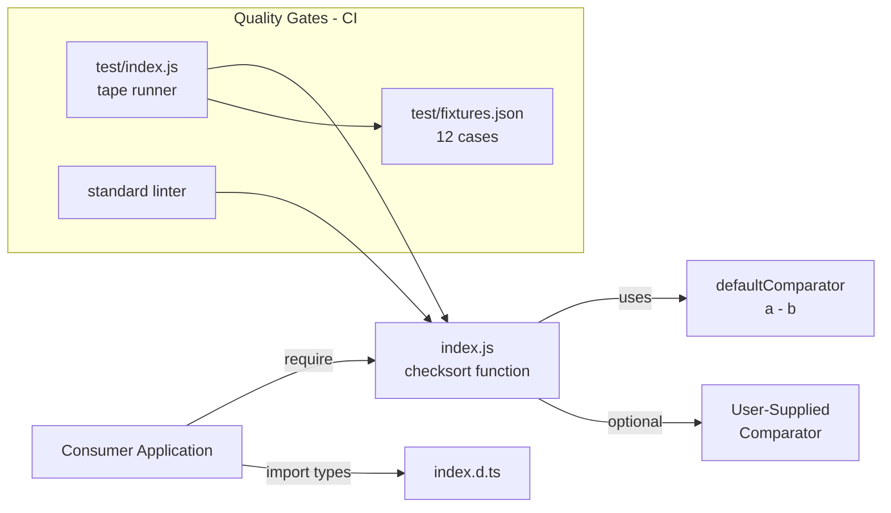

| Component | Path | Purpose |
|-----------|------|---------|
| Implementation | `index.js` | Exports the `checksort` function |
| Type declarations | `index.d.ts` | TypeScript signature for typed consumers |
| Package manifest | `package.json` | npm metadata, scripts, devDependencies |
| User documentation | `README.md` | Tagline and usage examples |
| License | `LICENSE` | MIT License text |
| Test runner | `test/index.js` | tape-based harness |
| Test fixtures | `test/fixtures.json` | 12 table-driven test cases |
| CI pipeline | `.github/workflows/tests.yml` | GitHub Actions unit + lint jobs |

#### Core Technical Approach

The algorithm performs a single linear pass over the input array, comparing each adjacent pair using the active comparator. If any pair is found to be out of order (the comparator returns a positive value for `(array[i - 1], array[i])`), the function returns `false` immediately. If the loop completes without finding a violation, the function returns `true`. Empty arrays and singletons trivially satisfy the predicate because the loop body executes zero times.

Key design choices encoded in `index.js`:

- **CommonJS module system** via `module.exports`, with a matching `export = checksort` in `index.d.ts`.
- **Synchronous execution** — no asynchronous primitives, no Promises, no callbacks.
- **Eager input validation** before any iteration, using `Array.isArray`.
- **Zero allocation** beyond the iteration variable; no intermediate arrays or copies.
- **Comparator contract** matching `Array.prototype.sort`, enabling reuse of existing comparators.

### 1.2.3 Success Criteria

Because the project is a self-contained utility module with no documented business metrics, success criteria are framed in terms of observable, code-evidenced quality gates.

#### Measurable Objectives

| Objective | Measurement | Evidence |
|-----------|-------------|----------|
| Functional correctness | All 12 fixture-driven tape tests pass | `test/index.js`, `test/fixtures.json` |
| Input safety | Throws `TypeError` matching `/Expected Array, got string/` on non-array | `test/index.js` "throws on non-Array inputs" test |
| Cross-version compatibility | Tests pass on Node.js 14.x, 16.x, and 18.x | `.github/workflows/tests.yml` `unit.strategy.matrix.node` |
| Code-style compliance | The `standard` linter reports no violations | `.github/workflows/tests.yml` `standard` job |

#### Critical Success Factors

| Factor | Description |
|--------|-------------|
| Algorithmic simplicity | The 14-line implementation must remain comprehensible and auditable at a glance |
| Backward compatibility | The public signature `checksort(array, comparator?)` and its boolean return contract are stable |
| Dependency hygiene | The package must continue to declare no runtime dependencies |
| CI green status | Both `unit` and `standard` workflow jobs must pass for any push to `main` or pull request |

#### Key Performance Indicators (KPIs)

The repository does not declare formal SLAs, throughput targets, or business KPIs. The following implicit performance characteristics are inherent to the algorithm in `index.js`:

| KPI | Value |
|-----|-------|
| Time complexity | O(n) — single pass over the array |
| Space complexity | O(1) — no auxiliary structures |
| Best-case behavior | O(1) when the first adjacent pair is out of order |
| Trivial cases | Empty array and single-element arrays return `true` in zero comparisons |

## 1.3 Scope

### 1.3.1 In-Scope

#### Core Features and Functionalities

| Feature | Status | Source |
|---------|--------|--------|
| Sorted-order check on a JavaScript `Array` | Must-have | `index.js` `checksort` |
| Default numeric ascending order (`a - b`) | Must-have | `index.js` `defaultComparator` |
| Custom comparator parameter | Must-have | `index.js` `comparator` argument |
| `TypeError` on non-array input | Must-have | `index.js` `Array.isArray` guard |
| Generic TypeScript declaration | Must-have | `index.d.ts` |
| Tape-based unit test suite | Must-have | `test/index.js`, `test/fixtures.json` |
| GitHub Actions CI across multiple Node versions | Must-have | `.github/workflows/tests.yml` |
| `standard` linter enforcement | Must-have | `package.json` `scripts.standard` |

#### Primary User Workflow

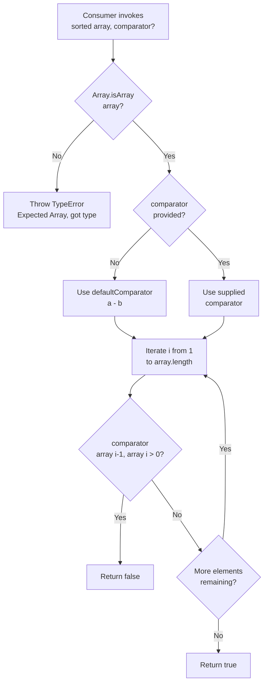

#### Essential Integrations

| Integration | Type | Notes |
|-------------|------|-------|
| Node.js runtime | Host platform | CommonJS module loaded via `require` |
| npm registry | Distribution | Implied by `package.json` `name` and `version` |
| TypeScript toolchains | Type consumption | Via `index.d.ts` declared in `package.json` `types` |
| GitHub Actions | CI orchestration | `actions/checkout@main`, `actions/setup-node@main` |
| tape | Test framework | devDependency `^5.0.0` |
| standard | Lint enforcement | devDependency `*` |

#### Key Technical Requirements

| Requirement | Detail |
|-------------|--------|
| Module system | CommonJS (`module.exports`, `require`) |
| Synchronous API | No Promises, callbacks, or async/await |
| Zero runtime dependencies | `package.json` declares no `dependencies` field |
| Single public export | The `checksort` function |
| Comparator contract | Standard `(a, b) => number` signature |

#### Implementation Boundaries

| Boundary | Scope |
|----------|-------|
| System boundary | A single CommonJS module exporting one function from `index.js` |
| User groups covered | Node.js developers consuming the package via npm, including TypeScript users |
| Geographic / market coverage | Global, via the public npm registry; no localization concerns |
| Data domains included | Any JavaScript `Array` whose elements are comparable by the active comparator |
| Runtime environments | Node.js 14.x, 16.x, and 18.x as validated by CI |
| Distribution surface | Source repository on GitHub; runtime entry `index.js`; type entry `index.d.ts` |

### 1.3.2 Out-of-Scope

#### Explicitly Excluded Features

| Excluded Capability | Rationale / Evidence |
|---------------------|----------------------|
| Sorting arrays | The module only inspects; no mutation or sort algorithm exists in `index.js` |
| Support for non-array iterables (Sets, Maps, generators, typed arrays, array-likes) | `index.js` rejects any input failing `Array.isArray` |
| Asynchronous or streaming API | `index.js` is fully synchronous; no Promise/callback surface exists |
| Diagnostic output (index of first violation, inversion count, sortedness ratio) | Return type is a boolean only |
| Special `NaN` handling | No `NaN`-specific code paths; default `a - b` comparator yields `NaN` for `NaN` inputs |
| Deep / structural equality comparison | The default comparator performs only numeric subtraction; deep comparison must be supplied by the caller |
| Browser bundle, ESM build, or CLI | No such artifacts exist in the repository; only CommonJS is provided |
| Benchmarks or performance harness | Not present in the test directory or build configuration |
| Runtime dependency on third-party packages | `package.json` declares no `dependencies` |

#### Future Phase Considerations

The repository does not document a roadmap, planned features, or deprecation schedule. Versioning under the existing `1.x` line implies a stable public contract; any future expansion would be a separate planning concern outside this specification.

#### Integration Points Not Covered

| Not Covered | Notes |
|-------------|-------|
| Network or RPC interfaces | None — this is an in-process library |
| Persistence layer | None |
| Authentication / authorization | Not applicable to a pure-function utility |
| Telemetry, logging, or metrics emission | The function emits no logs or metrics |
| Configuration files or environment variables | None read by `index.js` |

#### Unsupported Use Cases

- Passing a `Buffer`, `Uint8Array`, or other `TypedArray` directly — these are not `Array` instances and will trigger the `TypeError` guard.
- Verifying order under a comparator that has side effects or is non-deterministic — behavior is undefined in such cases.
- Using the module in environments older than Node.js 14.x — not covered by CI and not represented in the support matrix.

#### Repository Artifacts Outside Module Scope

The repository contains two Git submodule folders, `Parent_repo_for_submodule/` and `submodule_for_Parent_repo_for_submodule-Public/`, both pointing to the same external remote per `.gitmodules`. These checkouts are forks of GitHub's `gitignore` template collection and are **not referenced** by `index.js`, `index.d.ts`, the test suite, the CI workflow, or `package.json`. They do not contribute to the package's runtime behavior or to the published artifact set, and they are therefore considered outside the functional scope of the `is-sorted` module documented by this specification.

## 1.4 References

### 1.4.1 Files Examined

- `package.json` — Package metadata (name, version `1.0.5`, license, author), entry points (`main`, `types`), scripts, and devDependencies (`standard`, `tape`)
- `index.js` — Complete 14-line runtime implementation of the `checksort` function, including `defaultComparator`, `Array.isArray` guard, and linear scan loop
- `index.d.ts` — Generic TypeScript declaration `checksort<T = any>(array: T[], comparator?: (a: T, b: T) => number)`
- `README.md` — Project tagline and three usage examples (ascending default, unsorted negative case, descending custom comparator)
- `LICENSE` — MIT License text, Copyright 2015 Daniel Cousens
- `.gitmodules` — Declaration of two submodule entries pointing to the same external remote (out-of-scope artifacts)
- `test/index.js` — tape-based test runner that iterates `test/fixtures.json` and includes the explicit "throws on non-Array inputs" test
- `test/fixtures.json` — 12 table-driven test cases covering empty arrays, singletons, ascending order, ties, floating-point values, descending order via custom comparator, and unsorted negative cases
- `.github/workflows/tests.yml` — GitHub Actions workflow defining the `unit` job (Node.js 14.x / 16.x / 18.x matrix) and the `standard` lint job (Node.js 18.x)

### 1.4.2 Folders Explored

- `/` — Repository root; top-level inventory of source, configuration, and documentation files
- `test/` — Unit test harness and fixtures
- `.github/workflows/` — GitHub Actions workflow definitions
- `Parent_repo_for_submodule/` — Submodule checkout (out-of-scope; fork of GitHub's `gitignore` templates)
- `submodule_for_Parent_repo_for_submodule-Public/` — Submodule checkout (out-of-scope; identical upstream to the prior entry)

# 2. Product Requirements

This section catalogs the discrete, testable features that constitute the `is-sorted` package, derived directly from the repository inventory documented in section 1.4. Eight features are identified, each grounded in source-code evidence and traceable to specific files. The feature set is deliberately narrow because the package itself is a single-function micro-utility (14 lines of runtime code in `index.js`, zero runtime dependencies) — every feature documented below has corresponding source, test, or configuration evidence in the repository.

## 2.1 FEATURE CATALOG

The catalog is organized into three feature categories: **Core Public API** (F-001, F-002, F-003, F-004), **Type Support** (F-005), and **Quality Assurance** (F-006, F-007, F-008). All eight features are presently implemented and shipping in version `1.0.5` as declared in `package.json`.

### 2.1.1 F-001: Sorted-Order Detection

#### Feature Metadata

| Attribute | Value |
|-----------|-------|
| Unique ID | F-001 |
| Feature Name | Sorted-Order Detection |
| Feature Category | Core Public API |
| Priority Level | Critical |
| Status | Completed |

#### Description

- **Overview**: The single public export of the package — a function `checksort(array, comparator?)` defined in `index.js` (lines 5–14) — returns `true` when every adjacent pair in `array` satisfies the active comparator and `false` on the first violating pair. The implementation is a single-pass linear scan, fully synchronous, with no auxiliary allocation.
- **Business Value**: Consolidates a frequently re-written predicate into a single, well-tested primitive, eliminating duplicated and inconsistent inline implementations across consumer codebases (see section 1.1.2 for the business problem framing).
- **User Benefits**: Enables early-exit optimization in custom sort pipelines, invariant validation in data ingestion routines, test-suite assertions, and module-boundary contract enforcement (see section 1.1.2 for use-case enumeration).
- **Technical Context**: Implemented as a CommonJS export (`module.exports = function checksort (array, comparator)`). Uses index-based iteration `for (let i = 1, length = array.length; i < length; ++i)` and returns immediately on the first inversion. Empty arrays and singletons trivially return `true` because the loop body never executes.

#### Dependencies

| Dependency Type | Detail |
|-----------------|--------|
| Prerequisite Features | F-002 (default comparator fallback), F-004 (input type guard) |
| System Dependencies | Node.js runtime; built-in `Array.isArray` and `TypeError` |
| External Dependencies | None — `package.json` declares no `dependencies` field |
| Integration Requirements | Exposed via `package.json` `main` → `index.js`; consumed by `require('is-sorted')` |

### 2.1.2 F-002: Default Ascending Comparator

#### Feature Metadata

| Attribute | Value |
|-----------|-------|
| Unique ID | F-002 |
| Feature Name | Default Ascending Comparator |
| Feature Category | Core Public API |
| Priority Level | Critical |
| Status | Completed |

#### Description

- **Overview**: A private `defaultComparator(a, b)` returning `a - b`, declared at the top of `index.js` (lines 1–3). It is selected via the fallback expression `comparator = comparator || defaultComparator` on line 7, which engages on any falsy supplied value, not exclusively `undefined`.
- **Business Value**: Provides the most ergonomic default for the dominant call site (numeric ascending arrays), removing boilerplate at every invocation.
- **User Benefits**: Zero-configuration usage for numeric arrays — callers write `checksort([1,2,3])` without supplying a comparator.
- **Technical Context**: Suitable for any value where subtraction yields a meaningful sign (numbers, dates coerced to numbers). Inputs producing `NaN` from subtraction are not specially handled — this is explicitly documented as out-of-scope in section 1.3.2.

#### Dependencies

| Dependency Type | Detail |
|-----------------|--------|
| Prerequisite Features | None — leaf component within the module |
| System Dependencies | JavaScript numeric subtraction operator |
| External Dependencies | None |
| Integration Requirements | Composed by F-001 as the fallback comparator |

### 2.1.3 F-003: Custom Comparator Support

#### Feature Metadata

| Attribute | Value |
|-----------|-------|
| Unique ID | F-003 |
| Feature Name | Custom Comparator Support |
| Feature Category | Core Public API |
| Priority Level | Critical |
| Status | Completed |

#### Description

- **Overview**: The second parameter to `checksort` accepts any user-supplied comparator function matching the standard `(a, b) => number` signature. When provided, it replaces `defaultComparator` for the duration of the call. Evidence: `index.js` line 5 (parameter declaration) and line 10 (`comparator(array[i - 1], array[i])`).
- **Business Value**: Generalizes the predicate to any orderable domain — strings, objects, descending order, lexicographic rules, or locale-aware comparisons — without requiring a separate API.
- **User Benefits**: Direct reuse of comparators already authored for `Array.prototype.sort`; no new mental model to learn.
- **Technical Context**: Contract identical to `Array.prototype.sort` — positive return means `a > b`, zero means equal, negative means `a < b`. The third `README.md` usage example demonstrates a descending comparator `function (a, b) { return b - a }`. Two fixture cases in `test/fixtures.json` (lines 34–43) exercise this path via the `"comparator": "descending"` key.

#### Dependencies

| Dependency Type | Detail |
|-----------------|--------|
| Prerequisite Features | F-001 (the host function that invokes the comparator) |
| System Dependencies | None beyond JavaScript function-call semantics |
| External Dependencies | None |
| Integration Requirements | Caller-supplied; no registration mechanism |

### 2.1.4 F-004: Input Type Validation

#### Feature Metadata

| Attribute | Value |
|-----------|-------|
| Unique ID | F-004 |
| Feature Name | Input Type Validation |
| Feature Category | Core Public API |
| Priority Level | Critical |
| Status | Completed |

#### Description

- **Overview**: Before any iteration, `checksort` checks `Array.isArray(array)` and, on failure, throws `TypeError('Expected Array, got ' + (typeof array))`. Evidence: `index.js` line 6.
- **Business Value**: Surfaces caller mistakes at the call site with a precise, actionable error rather than silently mis-iterating array-likes, typed arrays, iterables, or primitives.
- **User Benefits**: Faster debugging via a deterministic, message-rich exception that names the offending input type.
- **Technical Context**: The guard rejects all non-array inputs — `Set`, `Map`, generators, `TypedArray`, array-likes, and primitives — because none satisfy `Array.isArray`. The first positional test in `test/index.js` (lines 17–22, "throws on non-Array inputs") asserts the regex `/Expected Array, got string/`.

#### Dependencies

| Dependency Type | Detail |
|-----------------|--------|
| Prerequisite Features | None — runs before any other feature logic |
| System Dependencies | Built-in `Array.isArray`, `TypeError`, `typeof` |
| External Dependencies | None |
| Integration Requirements | Invoked unconditionally on entry to F-001 |

### 2.1.5 F-005: TypeScript Type Declarations

#### Feature Metadata

| Attribute | Value |
|-----------|-------|
| Unique ID | F-005 |
| Feature Name | TypeScript Type Declarations |
| Feature Category | Type Support |
| Priority Level | High |
| Status | Completed |

#### Description

- **Overview**: A 3-line ambient declaration in `index.d.ts` provides a generic signature for typed consumers: `declare function checksort<T = any> (array: T[], comparator?: (a: T, b: T) => number)` with `export = checksort`. The declaration is registered via `package.json` `"types": "index.d.ts"`.
- **Business Value**: Makes the package first-class in TypeScript projects without requiring separate `@types/*` packages or community maintenance.
- **User Benefits**: Compile-time checks for array element / comparator type alignment; IDE autocomplete and inline documentation.
- **Technical Context**: The generic default `T = any` permits use without explicit type arguments while still narrowing when callers provide types. The CommonJS-style `export = checksort` mirrors the runtime `module.exports = function checksort(...)`.

#### Dependencies

| Dependency Type | Detail |
|-----------------|--------|
| Prerequisite Features | F-001 (describes its signature), F-003 (defines comparator shape) |
| System Dependencies | TypeScript toolchains used by consumers |
| External Dependencies | None — declaration ships in the package itself |
| Integration Requirements | Wired through `package.json` `types` field |

### 2.1.6 F-006: Automated Test Suite

#### Feature Metadata

| Attribute | Value |
|-----------|-------|
| Unique ID | F-006 |
| Feature Name | Automated Test Suite |
| Feature Category | Quality Assurance |
| Priority Level | High |
| Status | Completed |

#### Description

- **Overview**: A tape-based unit test harness at `test/index.js` iterates a JSON fixture file (`test/fixtures.json`) containing 12 table-driven cases. A separate explicit test asserts the `TypeError` thrown by F-004. Invoked via `package.json` script `"test": "tape test/*.js"`.
- **Business Value**: Provides the executable proof of correctness that underpins the package's stability claim and is re-run on every CI cycle.
- **User Benefits**: Consumers can trust that documented behaviors (empty/singleton handling, ties, floats, descending comparator, error throwing) are continuously verified.
- **Technical Context**: Uses `tape ^5.0.0` (devDependency). The runner declares `t.plan(1)` per subtest and asserts `t.equal(actual, f.expected)`. A local map `comparators = { descending: function (a, b) { return b - a } }` resolves string keys in fixtures to function references.

#### Dependencies

| Dependency Type | Detail |
|-----------------|--------|
| Prerequisite Features | F-001 through F-004 (the behaviors being verified) |
| System Dependencies | Node.js runtime for executing tape |
| External Dependencies | `tape ^5.0.0` (devDependency only — not shipped) |
| Integration Requirements | Invoked by F-007 via `npm test` in CI |

### 2.1.7 F-007: Continuous Integration Pipeline

#### Feature Metadata

| Attribute | Value |
|-----------|-------|
| Unique ID | F-007 |
| Feature Name | Continuous Integration Pipeline |
| Feature Category | Quality Assurance |
| Priority Level | High |
| Status | Completed |

#### Description

- **Overview**: A GitHub Actions workflow named `Tests` defined in `.github/workflows/tests.yml` (37 lines), triggered on push to the `main` branch and on all pull requests. Comprises two parallel jobs: `unit` (Node.js matrix) and `standard` (lint).
- **Business Value**: Enforces every change against the test suite and lint policy automatically, preventing regressions from reaching `main`.
- **User Benefits**: Indirect — consumers benefit from the published versions having passed CI on three supported Node versions.
- **Technical Context**: The `unit` job runs on `ubuntu-latest` with matrix `node-version: [14.x, 16.x, 18.x]` and `fail-fast: false`, executing `actions/checkout@main`, `actions/setup-node@main`, `npm install`, and `npm test`. The `standard` job runs on `ubuntu-latest` with a fixed `node-version: 18.x` (explicitly avoiding `lts/*` to prevent rate limiting) and executes `npm run standard`.

#### Dependencies

| Dependency Type | Detail |
|-----------------|--------|
| Prerequisite Features | F-006 (unit job), F-008 (standard job) |
| System Dependencies | GitHub Actions runner infrastructure (`ubuntu-latest`) |
| External Dependencies | `actions/checkout@main`, `actions/setup-node@main`, npm CLI |
| Integration Requirements | Triggered by repository events (push to main, PRs) |

### 2.1.8 F-008: Code Style Enforcement

#### Feature Metadata

| Attribute | Value |
|-----------|-------|
| Unique ID | F-008 |
| Feature Name | Code Style Enforcement |
| Feature Category | Quality Assurance |
| Priority Level | Medium |
| Status | Completed |

#### Description

- **Overview**: The `standard` linter (JavaScript Standard Style) is wired via `package.json` `"scripts": { "standard": "standard" }` with `"devDependencies": { "standard": "*" }`. Invoked locally via `npm run standard` and in CI via the `standard` job in F-007.
- **Business Value**: Maintains a consistent code style across the codebase without bespoke configuration; the choice of `standard` (zero-config) reflects the package's minimalism.
- **User Benefits**: Indirect — improves long-term maintainability and reviewability of contributions.
- **Technical Context**: `standard` operates with no configuration file present in the repository. Effective scope is the project's JavaScript sources (`index.js` and `test/index.js`).

#### Dependencies

| Dependency Type | Detail |
|-----------------|--------|
| Prerequisite Features | None |
| System Dependencies | Node.js runtime for invoking `standard` CLI |
| External Dependencies | `standard` (devDependency, unpinned `*`) |
| Integration Requirements | Invoked by F-007's `standard` job |

## 2.2 FUNCTIONAL REQUIREMENTS

Each feature is decomposed into atomic, testable requirements with the schema `F-XXX-RQ-YYY`. For each requirement, the summary table presents Description, Priority, and Complexity; subsequent paragraphs enumerate acceptance criteria, technical specifications, and validation rules. Priority follows MoSCoW (Must-Have / Should-Have / Could-Have).

### 2.2.1 F-001 Functional Requirements — Sorted-Order Detection

| Requirement ID | Description | Priority | Complexity |
|----------------|-------------|----------|------------|
| F-001-RQ-001 | Return `true` when every adjacent pair `(array[i-1], array[i])` satisfies `comparator(a,b) <= 0` | Must-Have | Low |
| F-001-RQ-002 | Return `false` on the first adjacent pair where `comparator(a,b) > 0` | Must-Have | Low |
| F-001-RQ-003 | Return `true` for empty arrays `[]` and singletons `[x]` without invoking the comparator | Must-Have | Low |
| F-001-RQ-004 | Treat equal adjacent values (ties) as ordered (i.e., nondecreasing is sorted) | Must-Have | Low |
| F-001-RQ-005 | Execute in O(n) time and O(1) auxiliary space; perform a single linear pass | Must-Have | Low |

**F-001-RQ-001 — Acceptance and Specification**
- *Acceptance Criteria*: Fixtures 4–8 in `test/fixtures.json` (e.g., `[1,2,3,4,5]`, `[1,1,3,4,5]`, `[1,1.5,3,4,5]`, `[1,2,3,4,6]`) all return `true` under the default comparator.
- *Input Parameters*: `array: T[]`, `comparator?: (a: T, b: T) => number`.
- *Output*: Boolean `true`.
- *Performance Criteria*: At most `n−1` comparator invocations.
- *Business Rule*: Sortedness is defined by the contract that no adjacent pair's comparator returns a positive value.

**F-001-RQ-002 — Acceptance and Specification**
- *Acceptance Criteria*: Fixture 11 `[1,5,2,3,4]` returns `false` under the default comparator; fixture 12 `[5,4,3,1,2]` returns `false` under the `descending` comparator.
- *Output*: Boolean `false`; the function returns immediately without scanning the remainder of the array.
- *Performance Criteria*: Early exit on first inversion (`return false` inside the loop).
- *Data Validation*: The comparator must return a numeric value; a strictly positive return is the inversion signal.

**F-001-RQ-003 — Acceptance and Specification**
- *Acceptance Criteria*: Fixtures 1 (`[]`), 2 (`[1]`), and 3 (`[5]`) return `true`.
- *Output*: Boolean `true` after zero comparator invocations.
- *Performance Criteria*: Constant-time for arrays of length 0 or 1 — the loop guard `i < length` fails on entry.
- *Business Rule*: An array with fewer than two elements is vacuously sorted under any comparator.

**F-001-RQ-004 — Acceptance and Specification**
- *Acceptance Criteria*: Fixtures 6 (`[1,1,3,4,5]`) and 9 (`[5,4,3,1,1]` with `descending`) return `true`.
- *Business Rule*: A comparator return of `0` is treated as "in order" because the inversion condition is `> 0`, not `>= 0`.

**F-001-RQ-005 — Acceptance and Specification**
- *Performance Criteria*: Worst-case `O(n)` comparator invocations; best-case `O(1)` when the first pair is inverted; auxiliary space `O(1)`.
- *Technical Constraint*: No allocation of intermediate arrays or copies; iteration uses a single integer index `i` and a cached `length` constant.

### 2.2.2 F-002 Functional Requirements — Default Ascending Comparator

| Requirement ID | Description | Priority | Complexity |
|----------------|-------------|----------|------------|
| F-002-RQ-001 | Provide an internal default comparator returning `a - b` | Must-Have | Low |
| F-002-RQ-002 | Engage the default whenever the supplied `comparator` argument is falsy | Must-Have | Low |

**F-002-RQ-001 — Acceptance and Specification**
- *Acceptance Criteria*: Fixtures 1–8 and 11 (no `comparator` key) use the default and produce the expected outcomes.
- *Input Parameters*: Two arbitrary values `a` and `b`.
- *Output*: A `number` equal to `a - b`.
- *Data Validation*: The default is intended for numerically subtractable values; non-numeric inputs yield `NaN` (out-of-scope per section 1.3.2).

**F-002-RQ-002 — Acceptance and Specification**
- *Acceptance Criteria*: Calling `checksort([1,2,3])` (no second argument) produces `true`; the fallback expression is `comparator = comparator || defaultComparator`.
- *Business Rule*: Any falsy value — `undefined`, `null`, `0`, `''`, `false`, `NaN` — triggers the fallback (consistent with the `||` short-circuit semantic).

### 2.2.3 F-003 Functional Requirements — Custom Comparator Support

| Requirement ID | Description | Priority | Complexity |
|----------------|-------------|----------|------------|
| F-003-RQ-001 | Accept a user-supplied comparator and use it in lieu of the default | Must-Have | Low |
| F-003-RQ-002 | Honor the standard `(a, b) => number` contract identical to `Array.prototype.sort` | Must-Have | Low |
| F-003-RQ-003 | Invoke the comparator on each adjacent pair as `comparator(array[i-1], array[i])` | Must-Have | Low |

**F-003-RQ-001 — Acceptance and Specification**
- *Acceptance Criteria*: Fixtures 9 (`[5,4,3,1,1]`), 10 (`[5,4,3,2,1]`), and 12 (`[5,4,3,1,2]`) all use the `descending` comparator mapped in `test/index.js` to `function (a, b) { return b - a }`.
- *Input Parameters*: A function value passed as the second positional argument to `checksort`.
- *Output*: Behavior of F-001 is unchanged except that ordering is judged by the supplied function.

**F-003-RQ-002 — Acceptance and Specification**
- *Business Rule*: Positive return ⇒ `a > b`; zero ⇒ equal; negative ⇒ `a < b`. This matches `Array.prototype.sort`'s comparator contract.
- *Data Validation*: Callers are responsible for ensuring the comparator returns a numeric value; non-numeric returns yield undefined behavior (declared out-of-scope per section 1.3.2).

**F-003-RQ-003 — Acceptance and Specification**
- *Performance Criteria*: One comparator invocation per adjacent pair in the worst case; arguments are passed in left-to-right index order.
- *Technical Constraint*: The comparator is treated as opaque; side effects within it are not protected against (declared out-of-scope per section 1.3.2).

### 2.2.4 F-004 Functional Requirements — Input Type Validation

| Requirement ID | Description | Priority | Complexity |
|----------------|-------------|----------|------------|
| F-004-RQ-001 | Throw `TypeError` when the first argument is not an `Array` | Must-Have | Low |
| F-004-RQ-002 | Include the offending value's `typeof` in the error message: `Expected Array, got <type>` | Must-Have | Low |
| F-004-RQ-003 | Perform validation before any iteration or comparator invocation | Must-Have | Low |

**F-004-RQ-001 — Acceptance and Specification**
- *Acceptance Criteria*: The "throws on non-Array inputs" test in `test/index.js` (lines 17–22) passes; the assertion is `t.throws(() => sorted('foo'), /Expected Array, got string/)`.
- *Input Parameters*: Any non-array value (string, number, object, `Set`, `Map`, generator, typed array, etc.).
- *Output*: Synchronous throw of a `TypeError` instance.
- *Security Requirement*: Prevents prototype-pollution-style misuse via non-array objects that happen to have a `length` property.

**F-004-RQ-002 — Acceptance and Specification**
- *Acceptance Criteria*: The error message matches the regex `/Expected Array, got string/` when the input is the string `'foo'`.
- *Data Validation*: The `typeof` operator's output (`'string'`, `'number'`, `'object'`, `'function'`, `'boolean'`, `'undefined'`, `'symbol'`, `'bigint'`) is concatenated verbatim into the message.

**F-004-RQ-003 — Acceptance and Specification**
- *Business Rule*: The `Array.isArray` check on `index.js` line 6 executes before the comparator fallback assignment on line 7 and before the loop on line 9.
- *Technical Constraint*: Eager validation ensures no comparator is invoked with a non-array operand under any control flow.

### 2.2.5 F-005 Functional Requirements — TypeScript Type Declarations

| Requirement ID | Description | Priority | Complexity |
|----------------|-------------|----------|------------|
| F-005-RQ-001 | Provide a generic ambient declaration for `checksort` with type parameter `T = any` | Must-Have | Low |
| F-005-RQ-002 | Declare `comparator` as an optional parameter typed `(a: T, b: T) => number` | Must-Have | Low |
| F-005-RQ-003 | Register the declaration file via `package.json` `types` so TypeScript discovers it automatically | Must-Have | Low |

**F-005-RQ-001 — Acceptance and Specification**
- *Acceptance Criteria*: `index.d.ts` declares `function checksort<T = any> (array: T[], ...)`; consumers can call without explicit type arguments.
- *Output*: Compile-time type information; no runtime behavior change.

**F-005-RQ-002 — Acceptance and Specification**
- *Acceptance Criteria*: The `?` suffix on `comparator` in the declaration permits omission; the function type aligns with `Array.prototype.sort`'s comparator parameter.
- *Compliance Requirement*: Must remain backward-compatible with the runtime contract documented for F-003.

**F-005-RQ-003 — Acceptance and Specification**
- *Acceptance Criteria*: `package.json` contains `"types": "index.d.ts"`; TypeScript compilers locate the declaration when resolving `import` or `require` of `'is-sorted'`.
- *Business Rule*: The package ships a single bundled declaration; no external `@types/*` package is required or maintained.

### 2.2.6 F-006 Functional Requirements — Automated Test Suite

| Requirement ID | Description | Priority | Complexity |
|----------------|-------------|----------|------------|
| F-006-RQ-001 | Execute a tape-based runner via `npm test` resolving to `tape test/*.js` | Must-Have | Low |
| F-006-RQ-002 | Iterate all 12 fixtures in `test/fixtures.json` via a `for ... of` loop | Must-Have | Low |
| F-006-RQ-003 | Explicitly assert the `TypeError` thrown by F-004 with the regex `/Expected Array, got string/` | Must-Have | Low |
| F-006-RQ-004 | Map fixture comparator keys (e.g., `"descending"`) to function values via a local lookup table | Should-Have | Low |

**F-006-RQ-001 — Acceptance and Specification**
- *Acceptance Criteria*: Running `npm test` in a clean checkout exits with status `0` and reports all subtests passing.
- *Input Parameters*: None — fixtures are file-resident.
- *Output*: TAP-formatted test output to stdout.

**F-006-RQ-002 — Acceptance and Specification**
- *Acceptance Criteria*: Each of the 12 fixtures (empty, singletons, ascending, ties, floats, descending, negative cases) produces an `t.equal(actual, f.expected)` assertion that passes.
- *Data Requirement*: Fixtures schema = `{ array: any[], comparator?: string, expected: boolean }`.

**F-006-RQ-003 — Acceptance and Specification**
- *Acceptance Criteria*: `t.throws` is invoked with the function reference, and the regex matches the thrown message.
- *Validation Rule*: This test is the cross-feature gate that verifies F-004's error contract is observable to callers.

**F-006-RQ-004 — Acceptance and Specification**
- *Business Rule*: Fixtures are pure JSON and cannot contain function values; the test runner translates a string key to a function via `comparators = { descending: function (a, b) { return b - a } }`.
- *Technical Constraint*: New comparator behaviors require additions to both the fixture key set and the local mapping table.

### 2.2.7 F-007 Functional Requirements — Continuous Integration Pipeline

| Requirement ID | Description | Priority | Complexity |
|----------------|-------------|----------|------------|
| F-007-RQ-001 | Trigger on every `push` to `main` and on every `pull_request` event | Must-Have | Low |
| F-007-RQ-002 | Run unit tests (F-006) against Node.js versions 14.x, 16.x, and 18.x in parallel | Must-Have | Low |
| F-007-RQ-003 | Run the `standard` lint check (F-008) on Node.js 18.x as a separate job | Must-Have | Low |
| F-007-RQ-004 | Apply `fail-fast: false` to the unit matrix so all Node versions report independently | Should-Have | Low |

**F-007-RQ-001 — Acceptance and Specification**
- *Acceptance Criteria*: `.github/workflows/tests.yml` defines `on: { push: { branches: [main] }, pull_request: {} }` (or equivalent).
- *Compliance Requirement*: PRs cannot be merged with red CI checks under standard branch protection rules.

**F-007-RQ-002 — Acceptance and Specification**
- *Acceptance Criteria*: The `unit` job declares `strategy.matrix.node-version: [14.x, 16.x, 18.x]` and runs on `ubuntu-latest`; each matrix cell runs `actions/checkout@main`, `actions/setup-node@main`, `npm install`, `npm test`.
- *Performance Criteria*: Matrix entries execute in parallel; total wall-clock is bounded by the slowest cell.

**F-007-RQ-003 — Acceptance and Specification**
- *Acceptance Criteria*: The `standard` job runs on `ubuntu-latest` with `node-version: 18.x` and executes `npm run standard`.
- *Technical Constraint*: The pinned version `18.x` (rather than `lts/*`) avoids GitHub Actions API rate limiting that has historically affected `lts/*` resolution.

**F-007-RQ-004 — Acceptance and Specification**
- *Acceptance Criteria*: `strategy.fail-fast: false` is set on the `unit` job.
- *Business Rule*: A failure on one Node version must not cancel the other matrix cells, enabling regression triangulation across versions.

### 2.2.8 F-008 Functional Requirements — Code Style Enforcement

| Requirement ID | Description | Priority | Complexity |
|----------------|-------------|----------|------------|
| F-008-RQ-001 | Provide an `npm run standard` script that invokes the `standard` linter | Must-Have | Low |
| F-008-RQ-002 | Apply lint enforcement in CI on every push to `main` and every pull request | Must-Have | Low |

**F-008-RQ-001 — Acceptance and Specification**
- *Acceptance Criteria*: `package.json` declares `"scripts": { "standard": "standard" }` and `"devDependencies": { "standard": "*" }`.
- *Input Parameters*: None — `standard` discovers `.js` files via its built-in conventions.
- *Output*: Process exit code `0` if no violations; non-zero with diagnostic output on violation.

**F-008-RQ-002 — Acceptance and Specification**
- *Acceptance Criteria*: The CI `standard` job (F-007-RQ-003) executes `npm run standard` on every trigger and must pass for merge.
- *Compliance Requirement*: New contributions must conform to JavaScript Standard Style; no project-specific overrides are configured.

## 2.3 FEATURE RELATIONSHIPS

### 2.3.1 Feature Dependencies Map

The eight features form a directed dependency graph centered on F-001 (the public API). Quality-assurance features (F-006, F-007, F-008) sit downstream and verify or enforce the upstream features.

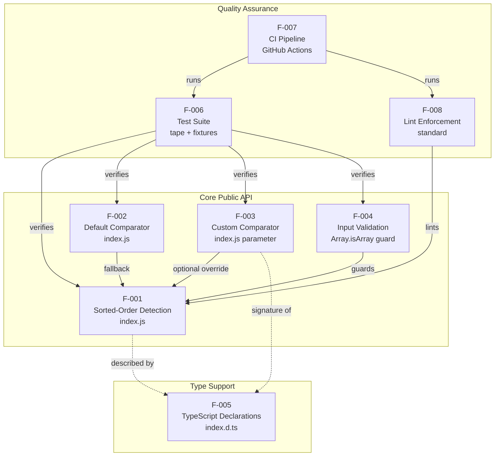

This diagram complements — but does not replace — the component overview in section 1.2.2 and the runtime control-flow flowchart in section 1.3.1, both of which should be consulted alongside this section.

### 2.3.2 Integration Points

| Integration Point | Mechanism | Linked Features |
|-------------------|-----------|-----------------|
| Runtime entry | `package.json` `main` → `index.js` | F-001, F-002, F-003, F-004 |
| Type entry | `package.json` `types` → `index.d.ts` | F-005 |
| Test entry | `package.json` `scripts.test` → `tape test/*.js` | F-006 |
| Lint entry | `package.json` `scripts.standard` → `standard` | F-008 |
| CI workflow | `.github/workflows/tests.yml` | F-007 (orchestrates F-006, F-008) |
| Distribution channel | npm registry (implied by `name`/`version`) | F-001, F-005 |

### 2.3.3 Shared Components and Common Services

| Shared Element | Used By | Description |
|----------------|---------|-------------|
| `defaultComparator` | F-001, F-002 | The private fallback function in `index.js` that F-001 selects when the caller omits or supplies a falsy comparator |
| `checksort` exported function | F-001 (defines), F-005 (declares), F-006 (verifies), F-008 (lints) | The single public export shared across runtime, type, test, and lint layers |
| `package.json` script registry | F-006 (`test`), F-008 (`standard`), F-007 (invokes both) | Local-dev and CI use the same script names so behavior is identical in both environments |
| Node.js runtime | F-001, F-002, F-003, F-004, F-006, F-007 | Common host platform; CI validates against three specific versions |
| GitHub Actions runner image (`ubuntu-latest`) | F-007's `unit` and `standard` jobs | Shared execution environment across both CI jobs |

## 2.4 IMPLEMENTATION CONSIDERATIONS

### 2.4.1 Technical Constraints

| Feature | Constraint |
|---------|-----------|
| F-001 | CommonJS-only (`module.exports`); no ESM, no browser bundle, no CLI |
| F-001 | Fully synchronous; no Promises, callbacks, or async/await primitives |
| F-001 | Index-based iteration (`for (let i = 1; ...)`) — no `for...of` or array-method chains |
| F-002 | Suitable only for numerically subtractable element types; no `NaN` handling |
| F-003 | Comparator must match `Array.prototype.sort` signature; side-effecting comparators yield undefined behavior |
| F-004 | Reject everything not satisfying `Array.isArray` — typed arrays, iterables, and array-likes are all rejected |
| F-005 | Uses `export = checksort` to mirror CommonJS — requires `esModuleInterop` or equivalent in some TypeScript configurations |
| F-006 | Fixtures are JSON; only string-keyed comparators are expressible without code changes |
| F-007 | Pinned to `node-version: 18.x` for the lint job to avoid GitHub Actions API rate limiting on `lts/*` resolution |
| F-008 | `standard` is unpinned (`"standard": "*"` in `devDependencies`), meaning lint rules can shift across installs |

### 2.4.2 Performance Requirements

| Feature | Performance Characteristic |
|---------|---------------------------|
| F-001 | O(n) worst-case time; O(1) best-case on first inversion; O(1) auxiliary space; zero allocations |
| F-002 | Constant-time `a - b` subtraction per invocation |
| F-003 | Caller-defined cost per invocation; baseline framework adds one function-call overhead per pair |
| F-004 | Constant-time `Array.isArray` check before the loop |
| F-006 | Bounded by 12 fixture cases + 1 explicit throw test; sub-second total runtime |
| F-007 | Wall-clock dominated by `npm install` + matrix coordination; functional tests complete in seconds |

### 2.4.3 Scalability Considerations

| Concern | Disposition |
|---------|-------------|
| Input size scaling | Algorithm is linear in `array.length`; no inherent ceiling beyond JavaScript engine array limits |
| Memory footprint | O(1) — independent of input size; no garbage collection pressure introduced |
| Concurrency | Pure function with no shared state; safe under any reentrant or concurrent invocation pattern in single-threaded Node |
| Process replication | Stateless and idempotent; freely usable in worker threads or child processes |
| Test-matrix scaling | Adding Node versions requires only a matrix entry in `.github/workflows/tests.yml` |
| Fixture growth | Adding test cases requires only an append to `test/fixtures.json` (no test-code changes for non-comparator fixtures) |

### 2.4.4 Security Implications

| Concern | Mitigation |
|---------|-----------|
| Prototype pollution via non-array inputs | F-004's `Array.isArray` guard rejects all non-arrays before iteration |
| Dynamic code execution | None — no `eval`, `Function` constructor, or `vm.runIn*` is used |
| Side channels | No timing-sensitive operations beyond comparator dispatch |
| Side effects | F-001 is a pure function on a trusted comparator; emits no logs, no telemetry, performs no I/O |
| Trust boundary | The supplied comparator is treated as trusted code; callers are responsible for vetting it |
| Supply chain | Zero runtime dependencies eliminates transitive-dependency risk for downstream consumers |
| Dev dependencies | `standard "*"` is unpinned, exposing the development environment to upstream lint-rule changes (not the published artifact) |

### 2.4.5 Maintenance Requirements

| Requirement | Rationale |
|-------------|-----------|
| Public signature stability | `checksort(array, comparator?) => boolean` must remain backward-compatible across `1.x` (per section 1.2.3) |
| Lint compliance | The `standard` job must remain green; failures block merges |
| Test coverage | All 12 fixtures plus the throw test must pass on every push (per section 1.2.3 measurable objectives) |
| Multi-version compatibility | Tests must pass on Node.js 14.x, 16.x, and 18.x simultaneously |
| Zero-dependency posture | `package.json` must continue to declare no `dependencies` field (per section 1.2.3 critical success factors) |
| Type alignment | `index.d.ts` must remain synchronized with any `index.js` signature change |
| Documentation parity | `README.md` examples must continue to execute against the published API |

## 2.5 TRACEABILITY MATRIX

### 2.5.1 Feature-to-Source Traceability

| Feature ID | Primary Source | Secondary / Configuration Source |
|------------|---------------|----------------------------------|
| F-001 | `index.js` lines 5–14 | `package.json` `main` |
| F-002 | `index.js` lines 1–3, 7 | — |
| F-003 | `index.js` lines 5, 10 | `README.md` (descending example) |
| F-004 | `index.js` line 6 | — |
| F-005 | `index.d.ts` (entire file) | `package.json` `types` |
| F-006 | `test/index.js`, `test/fixtures.json` | `package.json` `scripts.test`, `devDependencies.tape` |
| F-007 | `.github/workflows/tests.yml` | `package.json` `scripts` |
| F-008 | `package.json` `scripts.standard`, `devDependencies.standard` | `.github/workflows/tests.yml` `standard` job |

### 2.5.2 Requirement-to-Test Traceability

| Requirement ID | Verifying Test Evidence |
|----------------|------------------------|
| F-001-RQ-001 | `test/fixtures.json` cases 4–8 (`expected: true` under default comparator) |
| F-001-RQ-002 | `test/fixtures.json` cases 11 and 12 (`expected: false`) |
| F-001-RQ-003 | `test/fixtures.json` cases 1 (`[]`), 2 (`[1]`), 3 (`[5]`) |
| F-001-RQ-004 | `test/fixtures.json` cases 6 (`[1,1,3,4,5]`), 9 (`[5,4,3,1,1]` descending) |
| F-001-RQ-005 | Algorithmic property — verified by inspection of `index.js` loop structure |
| F-002-RQ-001 | All fixtures without a `comparator` key exercise the default |
| F-002-RQ-002 | `index.js` line 7 (`comparator = comparator || defaultComparator`); no fixture but covered by code inspection |
| F-003-RQ-001 | `test/fixtures.json` cases 9, 10, 12 with `"comparator": "descending"` |
| F-003-RQ-002 | Test-runner `comparators` map in `test/index.js` |
| F-003-RQ-003 | `test/fixtures.json` cases 9 and 12 (correct/incorrect orderings under descending) |
| F-004-RQ-001 | `test/index.js` lines 17–22 ("throws on non-Array inputs") |
| F-004-RQ-002 | `test/index.js` regex assertion `/Expected Array, got string/` |
| F-004-RQ-003 | `index.js` line 6 ordering — verified by inspection |
| F-005-RQ-001 | `index.d.ts` generic declaration (compile-time only, no runtime test) |
| F-005-RQ-002 | `index.d.ts` optional `comparator` parameter |
| F-005-RQ-003 | `package.json` `"types": "index.d.ts"` |
| F-006-RQ-001 | `package.json` `"test": "tape test/*.js"`; CI `unit` job step `npm test` |
| F-006-RQ-002 | `test/index.js` `for ... of fixtures` loop |
| F-006-RQ-003 | `test/index.js` `t.throws` assertion |
| F-006-RQ-004 | `test/index.js` local `comparators = { descending: ... }` table |
| F-007-RQ-001 | `.github/workflows/tests.yml` `on:` trigger declaration |
| F-007-RQ-002 | `.github/workflows/tests.yml` `unit.strategy.matrix.node-version: [14.x, 16.x, 18.x]` |
| F-007-RQ-003 | `.github/workflows/tests.yml` `standard` job with `node-version: 18.x` |
| F-007-RQ-004 | `.github/workflows/tests.yml` `unit.strategy.fail-fast: false` |
| F-008-RQ-001 | `package.json` `"scripts": { "standard": "standard" }` |
| F-008-RQ-002 | `.github/workflows/tests.yml` `standard` job execution on push/PR |

### 2.5.3 Cross-References to Process Flowcharts

| Reference Target | Location | Relationship |
|------------------|---------|--------------|
| Primary user workflow flowchart | Section 1.3.1 | Visualizes the runtime control flow of F-001 + F-002 + F-003 + F-004 in concert |
| Major system components diagram | Section 1.2.2 | Shows the relationship between consumer applications, the entry points, and the quality gates (F-006, F-008) |
| Feature dependency graph | Section 2.3.1 | This section's mermaid diagram — complementary to the two above |

## 2.6 ASSUMPTIONS AND CONSTRAINTS

### 2.6.1 Documented Assumptions

| ID | Assumption | Source |
|----|------------|--------|
| A-001 | Consumers invoke `checksort` from a Node.js environment supporting CommonJS `require` | `package.json` `main`; absence of ESM/browser entries |
| A-002 | Comparators supplied by callers are pure (no observable side effects) and return numeric values | Section 1.3.2 ("Unsupported Use Cases") |
| A-003 | Inputs are runtime `Array` instances; typed arrays and array-likes are intentionally excluded | F-004 guard; section 1.3.2 |
| A-004 | The published artifact set is limited to `index.js`, `index.d.ts`, `package.json`, `README.md`, and `LICENSE` | Repository inventory in section 1.4 |
| A-005 | The two submodule folders in the repository are out-of-scope and have no runtime impact | Section 1.3.2 ("Repository Artifacts Outside Module Scope") |

### 2.6.2 Documented Constraints

| ID | Constraint | Source |
|----|------------|--------|
| C-001 | Public signature `checksort(array, comparator?) => boolean` is stable across `1.x` | Section 1.2.3 "Backward compatibility" |
| C-002 | Package must declare no runtime `dependencies` | Section 1.2.3 "Dependency hygiene" |
| C-003 | CI must remain green on Node 14.x, 16.x, 18.x and on `standard` lint | Section 1.2.3 "CI green status" |
| C-004 | Implementation must remain readable at 14 lines (algorithmic simplicity) | Section 1.2.3 "Algorithmic simplicity" |
| C-005 | No runtime telemetry, logging, configuration files, or environment variables permitted | Section 1.3.2 "Integration Points Not Covered" |

### 2.6.3 Requirement Versioning

All requirements documented here are anchored to package version `1.0.5` as declared in `package.json`. Any change to a Must-Have requirement constitutes a breaking change under semantic versioning and would require a major-version bump. The repository does not currently maintain a CHANGELOG file; release-to-release deltas are tracked via Git tags on the `dcousens/is-sorted` repository.

## 2.7 REFERENCES

### 2.7.1 Files Examined

- `index.js` — Full 14-line CommonJS runtime; basis for F-001, F-002, F-003, F-004
- `index.d.ts` — Generic TypeScript ambient declaration; basis for F-005
- `package.json` — Manifest declaring entry points, scripts, devDependencies, and zero-dependency posture; basis for integration mapping across all features
- `README.md` — Tagline and three usage examples corroborating F-001 and F-003 behaviors
- `LICENSE` — MIT License (Copyright 2015 Daniel Cousens); legal context only
- `test/index.js` — tape-based runner; basis for F-006-RQ-001 through F-006-RQ-004 and verifier for F-001/F-002/F-003/F-004 requirements
- `test/fixtures.json` — 12 table-driven test cases; primary acceptance-criteria evidence for F-001-RQ-001 through F-001-RQ-004 and F-003-RQ-001
- `.github/workflows/tests.yml` — GitHub Actions workflow; basis for F-007 requirements
- `.gitmodules` — Two submodule declarations (out-of-scope per section 1.3.2; included for completeness)

### 2.7.2 Folders Examined

- `/` — Repository root inventory
- `test/` — Test harness and fixtures
- `.github/workflows/` — CI workflow definitions

### 2.7.3 Cross-Referenced Specification Sections

- Section 1.1 (Executive Summary) — Project context, stakeholders, value proposition
- Section 1.2 (System Overview) — Capabilities, components diagram, success criteria
- Section 1.3 (Scope) — In-scope feature roster, primary workflow flowchart, out-of-scope exclusions
- Section 1.4 (References) — Master file/folder inventory

# 3. Technology Stack

## 3.1 Overview and Stack Philosophy

The `is-sorted` package (version `1.0.5`) is a deliberately minimalist Node.js micro-utility whose technology stack is shaped by two overriding architectural principles documented elsewhere in this specification: **algorithmic simplicity** (a 14-line implementation that must remain comprehensible at a glance) and **dependency hygiene** (the package must continue to declare no runtime dependencies). As a result, the stack is intentionally narrow — limited to a single runtime language, a single test framework, a single linter, and a single CI platform.

This section enumerates only the technologies that are actually present in or referenced by the repository. Because the default enterprise technology stack supplied in the prompt assumes a multi-tier cloud application (AWS, Docker, Terraform, Python/Flask, Auth0, MongoDB, React, Langchain, native mobile platforms, etc.), §3.7 explicitly documents which of those defaults are **not applicable** to this project and why, providing negative-space justification grounded in the system's scope boundaries.

The stack composition, at a glance:

| Layer | Technology | Role |
|-------|------------|------|
| Runtime language | JavaScript (ES5-compatible, CommonJS) | Implements the `checksort` function |
| Type system | TypeScript ambient declaration (`.d.ts`) | Provides compile-time signatures for typed consumers |
| Runtime platform | Node.js 14.x / 16.x / 18.x | Host execution environment validated in CI |
| Test framework | tape `^5.0.0` (devDependency) | TAP-producing unit-test runner |
| Lint enforcement | standard `*` (devDependency) | Zero-config code-style linter |
| CI orchestration | GitHub Actions on `ubuntu-latest` | Multi-version test matrix + lint job |
| Distribution registry | npm | Public package distribution |
| Source hosting | GitHub (`dcousens/is-sorted`) | Source control, issue tracking, CI execution |

---

## 3.2 Programming Languages

### 3.2.1 Primary Runtime Language — JavaScript (CommonJS)

| Attribute | Value |
|-----------|-------|
| Language | JavaScript |
| Module system | CommonJS (`module.exports`, `require`) |
| Source file | `index.js` (14 lines) |
| Public symbol | `checksort` |

JavaScript is the sole language used to implement runtime behavior. The implementation in `index.js` exports a single function via `module.exports`, conforming to the CommonJS module system. Per the Technical Constraints catalog, the implementation is restricted to CommonJS-only — there is no ESM build, no browser bundle, and no CLI wrapper. The algorithm uses classical index-based iteration (`for (let i = 1; ...)`) rather than `for...of` or array-method chains, which keeps the function compatible with the broadest range of Node.js runtimes and avoids reliance on iterator-protocol features that would change the supported-runtime floor.

**Selection criteria and justification:**

- **Host language alignment**: The package's purpose is to be consumed by other Node.js libraries; implementing it in JavaScript eliminates any cross-language interop concerns at the consumer boundary.
- **Synchronous semantics**: A purely synchronous JavaScript implementation matches the contract of `Array.prototype.sort` (whose comparator is the canonical signature this function reuses) and avoids the cognitive overhead of asynchronous primitives for an O(n) in-process operation.
- **Zero-allocation discipline**: Plain JavaScript loops with primitive index variables allow the algorithm to maintain O(1) auxiliary space, satisfying the performance characteristics required by the spec.

### 3.2.2 Type-System Language — TypeScript (Ambient Declaration Only)

| Attribute | Value |
|-----------|-------|
| Language | TypeScript |
| Mode | Ambient declaration (`.d.ts`) — no compilation step |
| Source file | `index.d.ts` (3 lines) |
| Declared signature | `checksort<T = any>(array: T[], comparator?: (a: T, b: T) => number): boolean` |
| Export form | `export = checksort` (CommonJS-style export) |

TypeScript is used **exclusively for type metadata**, not for implementation. The `index.d.ts` file is a hand-written ambient declaration referenced from `package.json` via its `types` field. There is no `tsconfig.json` in the repository, no TypeScript compilation step in the build, and no `.ts` source files. The declaration uses the CommonJS-mirroring `export = checksort` form to align with the runtime module's `module.exports` shape.

**Constraint on consumers**: The CommonJS-style `export = checksort` requires `esModuleInterop` (or equivalent) to be enabled in some TypeScript consumer configurations, as documented in the Technical Constraints catalog.

### 3.2.3 Supporting Data and Configuration Languages

| Language | Files | Purpose |
|----------|-------|---------|
| JSON | `package.json`, `test/fixtures.json` | npm manifest; 12 table-driven test fixtures |
| YAML | `.github/workflows/tests.yml` | GitHub Actions workflow definition (37 lines) |

These are not "programming languages" in the implementation sense but are listed because they are first-class artifacts of the stack. The JSON fixtures file constrains test-case authoring to string-keyed comparators expressible without code changes (per the Technical Constraints catalog).

### 3.2.4 Language Selection Constraints

The language choices are bound by several documented constraints:

- **Runtime platform validation**: Source must execute on Node.js 14.x, 16.x, and 18.x as validated by the CI matrix.
- **CommonJS-only module system**: No ES Module syntax (`import` / `export` / `export default`) is permitted in `index.js`; the matching `export = checksort` in `index.d.ts` enforces this at the type layer.
- **No transpilation pipeline**: Because JavaScript source is published directly (no Babel, TypeScript compiler, or bundler), the source code must be written in a syntax that all three supported Node.js versions can execute natively.
- **Lint-rule conformance**: Source must satisfy the `standard` linter's current ruleset; because `standard` is unpinned, the ruleset is effectively whichever version resolves at install time.

---

## 3.3 Frameworks & Libraries

### 3.3.1 Runtime Frameworks and Libraries — Intentionally None

The runtime implementation in `index.js` uses **no runtime framework and no third-party runtime library**. This is a hard architectural constraint (catalogued as constraint C-002: "Package must declare no runtime `dependencies`") and a critical success factor of the project.

The runtime relies exclusively on JavaScript language built-ins:

| Built-in | Used For | Location |
|----------|----------|----------|
| `Array.isArray` | Eager input-type validation | `index.js` input guard |
| `TypeError` | Error class for non-array input | `index.js` `throw new TypeError(...)` |
| `typeof` operator | Constructing the descriptive error message | `index.js` |
| Numeric subtraction (`-`) | Implementing the default ascending comparator (`a - b`) | `index.js` `defaultComparator` |

**Justification for the absence of a framework**: A 14-line pure function whose entire behavior is "iterate adjacent pairs and return a boolean" has no surface area that would benefit from a framework abstraction. Any framework introduction would violate constraint C-002, expand the supply-chain surface for downstream consumers, and undermine the "algorithmic simplicity" critical success factor.

### 3.3.2 Development and Quality-Assurance Libraries

The `devDependencies` block in `package.json` declares exactly two libraries — both are quality-assurance tooling and neither is bundled into the published artifact:

| Library | Version Specifier | Resolved Range | Category | Configuration |
|---------|-------------------|----------------|----------|---------------|
| `tape` | `^5.0.0` | Any `5.x.x` | Test framework (TAP producer) | Invoked via `npm test` → `tape test/*.js` |
| `standard` | `*` | Any version published to npm | Lint enforcement | Invoked via `npm run standard`; zero-config (no config file in repo) |

#### 3.3.2.1 tape (Test Framework)

`tape` is the TAP-producing test runner used by `test/index.js`. The test harness uses tape's `t.plan`, `t.equal`, and `t.throws` assertion methods to validate the 12 fixtures from `test/fixtures.json` plus the explicit `TypeError`-on-non-array test case.

**Justification**: `tape` is an intentionally simple, no-globals, no-magic test framework that aligns with the project's minimalist posture. It produces TAP output that integrates with any CI system without additional reporters and itself has a small, well-understood dependency graph.

**Compatibility**: `tape@^5.x` is validated against Node.js 14.x, 16.x, and 18.x by the CI matrix.

#### 3.3.2.2 standard (Linter)

`standard` is the "JavaScript Standard Style" linter, used to enforce code-style conformance. The repository contains no `.eslintrc*`, no `.prettierrc*`, and no `standard`-specific configuration file — `standard` is consumed as a zero-config tool.

**Justification**: The zero-config nature of `standard` matches the project's preference for minimal configuration surface. It catches stylistic regressions in CI without requiring the maintainer to curate a custom rule set.

**Documented risk (Technical Constraints catalog)**: Because `"standard": "*"` is unpinned, the effective rule set can shift across installations. This is a known development-environment risk; it does **not** affect the published artifact (which contains no lint configuration and no lint output), but it could cause the `standard` CI job to fail unexpectedly when an upstream rule changes.

### 3.3.3 Library Compatibility Requirements

| Library | Compatibility Surface | Validation Mechanism |
|---------|------------------------|----------------------|
| `tape@^5.x` | Node.js 14.x, 16.x, 18.x | `unit` job matrix in `.github/workflows/tests.yml` |
| `standard@*` | Node.js 18.x (only) | `standard` job in `.github/workflows/tests.yml`, pinned to `node-version: 18.x` to avoid the GitHub Actions API rate limit triggered by `lts/*` resolution |

The lint job's Node-version pin to `18.x` is a documented technical constraint and is enforced via an inline comment in the workflow file (`# don't use lts/* to prevent hitting rate-limit`). This is the only place in the repository where a specific Node minor-line is hard-coded rather than matrix-expanded.

---

## 3.4 Open Source Dependencies

### 3.4.1 Runtime Dependency Inventory

| Category | Count | Notes |
|----------|-------|-------|
| `dependencies` | **0** | The `package.json` manifest declares no `dependencies` field at all |
| `peerDependencies` | 0 | Not declared |
| `optionalDependencies` | 0 | Not declared |
| `bundledDependencies` | 0 | Not declared |

This zero-dependency posture is not incidental — it is a binding constraint (C-002) and a critical success factor. Per the Security Implications catalog, "zero runtime dependencies eliminates transitive-dependency risk for downstream consumers."

### 3.4.2 Development Dependency Inventory

| Package | Version Specifier | Registry | Purpose | Pinning Strategy |
|---------|-------------------|----------|---------|------------------|
| `tape` | `^5.0.0` | npm (registry.npmjs.org) | Test framework | Caret — allows any 5.x.x release |
| `standard` | `*` | npm (registry.npmjs.org) | Linter | Wildcard — allows any published version |

### 3.4.3 GitHub Actions Marketplace Actions

The CI workflow references two third-party GitHub Actions. These are consumed at CI execution time only; they are not part of the published artifact and do not appear in `package.json`.

| Action | Reference | Purpose |
|--------|-----------|---------|
| `actions/checkout` | `@main` (mutable branch reference) | Clones the repository into the runner workspace |
| `actions/setup-node` | `@main` (mutable branch reference) | Installs the specified Node.js version into the runner |

**Pinning observation**: Both actions are referenced by `@main` rather than a tagged release (such as `@v4`). This is a current-state observation; either action could change behavior on its next upstream commit to `main` without any change to this repository. Pinning to immutable tags or commit SHAs is the conventional hardening for supply-chain risk in GitHub Actions workflows.

### 3.4.4 Package Registry, Distribution, and Identity

| Attribute | Value | Source |
|-----------|-------|--------|
| Registry | npm (`registry.npmjs.org`) | Implied by `package.json` `name` + `version` |
| Published name | `is-sorted` | `package.json` |
| Published version | `1.0.5` | `package.json` |
| License | MIT (Copyright 2015 Daniel Cousens) | `LICENSE` |
| Source repository | `https://github.com/dcousens/is-sorted` | `package.json` `repository.url`, `homepage` |
| Issue tracker | `https://github.com/dcousens/is-sorted/issues` | `package.json` `bugs.url` |
| Runtime entry point | `index.js` | `package.json` `main` |
| Type entry point | `index.d.ts` | `package.json` `types` |

---

## 3.5 Third-Party Services

### 3.5.1 Active Service Integrations

The system uses a deliberately small set of external services, all of which exist to support source hosting, CI execution, or package distribution — none of which are invoked by the runtime function itself.

| Service | Provider | Role | Evidence |
|---------|----------|------|----------|
| Source hosting | GitHub | Code, issues, pull requests | `package.json` `repository`, `bugs`, `homepage` |
| CI orchestration | GitHub Actions | Test matrix and lint enforcement | `.github/workflows/tests.yml` |
| CI execution environment | GitHub-hosted Ubuntu runners | Job execution host | `runs-on: ubuntu-latest` in workflow |
| Package distribution | npm Registry | Public package retrieval by consumers | Implied by `name` + `version` in `package.json` |
| Badge rendering | shields.io / NPM badge endpoints | README status badges (NPM version, `js-standard-style`) | `README.md` |

#### 3.5.1.1 GitHub Service Topology

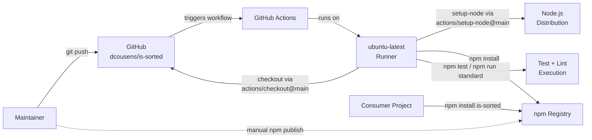

### 3.5.2 Services Deliberately Not Used

The Scope section's "Integration Points Not Covered" subsection enumerates entire categories of third-party services that are explicitly out-of-scope for this project. These are restated here for stack completeness:

| Service Category | Status | Rationale |
|------------------|--------|-----------|
| Cloud platform (e.g., AWS, GCP, Azure) | Not used | "No service endpoints, databases, message buses, or external APIs are involved" |
| Authentication provider (e.g., Auth0) | Not used | "Not applicable to a pure-function utility" |
| Monitoring / APM (e.g., Datadog, New Relic) | Not used | "The function emits no logs or metrics" |
| Telemetry pipelines | Not used | No telemetry, logging, or metrics emission |
| External API integrations | Not used | The function performs no I/O |
| Configuration service / secrets manager | Not used | "No configuration files or environment variables read by `index.js`" |

This negative-space documentation establishes that the absence of these services is a design decision, not an oversight.

---

## 3.6 Databases & Storage

### 3.6.1 Storage Disposition

The `is-sorted` package has **no database, no cache, and no storage layer** of any kind. The Scope section's "Integration Points Not Covered" subsection explicitly classifies the persistence layer as "None," and the System Overview's project-context table states that "no service endpoints, databases, message buses, or external APIs are involved."

The runtime algorithm operates with O(1) auxiliary space — no in-memory data structure is allocated beyond the loop's index variable, and no on-disk or off-host state is ever materialized.

| Storage Category | Status | Notes |
|------------------|--------|-------|
| Primary database (relational or document) | Not applicable | No persistence layer |
| Secondary / replica databases | Not applicable | No persistence layer |
| Cache (in-memory or distributed, e.g., Redis) | Not applicable | Function is pure and stateless |
| Object / blob storage (e.g., S3) | Not applicable | No file or blob output |
| Message queue / event bus | Not applicable | Synchronous in-process call |
| Search index | Not applicable | No queryable corpus |

### 3.6.2 Static Test Data (Not a Database)

The repository ships a single JSON file containing static test data:

| File | Format | Purpose | Loading Mechanism |
|------|--------|---------|-------------------|
| `test/fixtures.json` | JSON array | 12 table-driven test cases | Loaded at test time via `require('./fixtures')` in `test/index.js` |

This file is consumed only during the CI test job (`npm test`). It is not part of the runtime artifact set declared by `package.json`'s entry points (`main`, `types`) and does not function as a database — it is read-only test input embedded alongside the source.

---

## 3.7 Development & Deployment

### 3.7.1 Development Tooling

| Tool | Version / Pinning | Purpose | Invocation |
|------|-------------------|---------|------------|
| Node.js | 14.x / 16.x / 18.x (CI matrix) | Runtime + development host | Installed via `actions/setup-node` in CI; locally provided by developer |
| npm | Bundled with Node.js | Package manager and script runner | `npm install`, `npm test`, `npm run standard` |
| `tape` | `^5.0.0` (devDependency) | Test runner | `tape test/*.js` (per `package.json` `scripts.test`) |
| `standard` | `*` (devDependency) | Linter | `standard` (per `package.json` `scripts.standard`) |
| Git | (Developer-provided) | Source control, submodule management | Repository ships a `.gitmodules` file declaring two out-of-scope submodules |

**Absent tooling — explicit non-inclusions**: A root-folder inventory confirms there is **no** `.eslintrc*`, `.prettierrc*`, `tsconfig.json`, `babel.config.*`, `webpack.config.*`, `rollup.config.*`, `Dockerfile`, `docker-compose.yml`, `Makefile`, or any Terraform (`.tf`) file. This is consistent with the project's minimalist posture: there is no separate ESLint/Prettier (subsumed by `standard`), no TypeScript compilation (`.d.ts` is hand-written), no transpilation, no bundling, no containerization, and no infrastructure-as-code.

### 3.7.2 Build System

There is **no build step**. The source files `index.js` and `index.d.ts` are themselves the published artifacts, as referenced directly by `package.json`'s `main` and `types` fields. The `package.json` `scripts` section declares only `test` and `standard` — no `build`, `compile`, `bundle`, or `prepublish` step is defined.

| Phase | Action | Tool |
|-------|--------|------|
| Source authoring | Edit `index.js`, `index.d.ts` directly | Editor of choice |
| Lint | Run `npm run standard` | `standard` |
| Test | Run `npm test` | `tape` |
| Publish | Run `npm publish` (manual; no automation present) | npm CLI |

### 3.7.3 Containerization

**Not used.** The repository contains no Dockerfile, no `docker-compose.yml`, and no container-related configuration. Because the package is an in-process library consumed via `require`, there is no deployable unit that would benefit from containerization. Per the default technology stack analysis in §3.8, Docker is one of the items not applicable to this project.

### 3.7.4 Infrastructure as Code

**Not used.** The repository contains no Terraform, CloudFormation, Pulumi, Ansible, or equivalent IaC artifacts. Because the package has no service endpoints and no deployment infrastructure (per the System Overview and Scope sections), there is nothing to provision.

### 3.7.5 Continuous Integration Pipeline

The CI/CD pipeline is implemented entirely via a single GitHub Actions workflow file: `.github/workflows/tests.yml`.

#### 3.7.5.1 Trigger Configuration

| Event | Filter |
|-------|--------|
| `push` | `branches: [main]` |
| `pull_request` | (any target branch) |

#### 3.7.5.2 Workflow Jobs

```mermaid
flowchart TD
    Trigger[push to main<br/>or pull_request]
    Trigger --> UnitJob[unit job<br/>ubuntu-latest]
    Trigger --> StdJob[standard job<br/>ubuntu-latest]

    subgraph UnitMatrix[Matrix: fail-fast = false]
        N14[Node 14.x]
        N16[Node 16.x]
        N18[Node 18.x]
    end

    UnitJob --> UnitMatrix
    N14 --> CO1[actions/checkout@main]
    N16 --> CO2[actions/checkout@main]
    N18 --> CO3[actions/checkout@main]
    CO1 --> SN1[actions/setup-node@main]
    CO2 --> SN2[actions/setup-node@main]
    CO3 --> SN3[actions/setup-node@main]
    SN1 --> NPM1[npm install]
    SN2 --> NPM2[npm install]
    SN3 --> NPM3[npm install]
    NPM1 --> Test1[npm test]
    NPM2 --> Test2[npm test]
    NPM3 --> Test3[npm test]

    StdJob --> StdCO[actions/checkout@main]
    StdCO --> StdSN[actions/setup-node@main<br/>node-version: 18.x pinned]
    StdSN --> StdInstall[npm install]
    StdInstall --> StdLint[npm run standard]
```

| Job | Runner | Node Version | Steps | Purpose |
|-----|--------|--------------|-------|---------|
| `unit` | `ubuntu-latest` | Matrix: `14.x`, `16.x`, `18.x` (with `fail-fast: false`) | `actions/checkout@main` → `actions/setup-node@main` → `npm install` → `npm test` | Validates functional correctness across all supported Node.js versions |
| `standard` | `ubuntu-latest` | Pinned to `18.x` | `actions/checkout@main` → `actions/setup-node@main` → `npm install` → `npm run standard` | Enforces code-style conformance via the `standard` linter |

The `fail-fast: false` setting on the matrix ensures that a failure on one Node version does not cancel the others, providing full visibility into per-version failure modes. The `standard` job's pin to `18.x` (rather than `lts/*`) is a documented constraint introduced to avoid GitHub Actions API rate-limit issues when resolving symbolic Node version aliases.

#### 3.7.5.3 Continuous Delivery / Release Automation

**No automated release pipeline exists.** The `.github/workflows/` directory contains only `tests.yml` — there is no separate `release.yml`, `publish.yml`, or equivalent workflow. Publishing to the npm registry is performed manually by the maintainer via `npm publish`, against the `is-sorted` package name reserved on the npm registry under version `1.0.5`. Release-to-release deltas are tracked via Git tags on the upstream repository; the repository does not maintain a `CHANGELOG` file.

### 3.7.6 CI/CD Constraints Summary

The CI configuration directly enforces three of the documented constraints:

| Constraint | Enforcement Mechanism |
|------------|------------------------|
| C-003 — CI must remain green on Node 14.x, 16.x, 18.x and on `standard` lint | The two-job structure of `tests.yml` |
| C-002 — No runtime dependencies | `npm install` step would surface any added `dependencies` field; downstream consumers' lockfiles would also detect changes |
| Multi-version compatibility (per §2.4.5) | `unit` job matrix with `fail-fast: false` |

---

## 3.8 Default Technology Stack Applicability Analysis

The prompt supplied a default enterprise technology stack representing a typical full-stack cloud application. Because `is-sorted` is a single-function micro-utility with no service, persistence, UI, mobile, or AI components, the overwhelming majority of those defaults are not applicable. This subsection documents that mapping explicitly so that future readers understand the negative-space decisions.

| Default Category | Default Choice | Applicable? | Rationale |
|------------------|----------------|-------------|-----------|
| Cloud Platform | AWS | ❌ Not applicable | No service endpoints; no deployment infrastructure (§1.2.1, §1.3.2) |
| Containerization | Docker | ❌ Not applicable | In-process library; no deployable container unit |
| Infrastructure as Code | Terraform | ❌ Not applicable | No infrastructure to provision |
| CI/CD | GitHub Actions | ✅ **Applicable and used** | `.github/workflows/tests.yml` |
| Primary Language | Python | ❌ Not applicable | Project is JavaScript/Node.js |
| Backend Framework | Flask | ❌ Not applicable | No backend service; the package is a library, not a server |
| Authentication | Auth0 | ❌ Not applicable | "Not applicable to a pure-function utility" (§1.3.2) |
| Database | MongoDB | ❌ Not applicable | No persistence layer (§1.3.2) |
| AI Framework | Langchain | ❌ Not applicable | No AI/ML functionality |
| Web Frontend | React + TypeScript | ❌ Not applicable | No UI or frontend artifact |
| CSS Framework | TailwindCSS | ❌ Not applicable | No UI |
| Mobile / Cross-platform | React-Native + TypeScript | ❌ Not applicable | No mobile application |
| iOS Native | Swift | ❌ Not applicable | No native application |
| Android Native | Kotlin | ❌ Not applicable | No native application |
| macOS Native | Objective-C | ❌ Not applicable | No native application |
| Desktop | Electron.js | ❌ Not applicable | No desktop application |

**Net result**: Of the 17 default stack items, exactly **one — GitHub Actions — applies** to this project. This is consistent with the System Overview's framing of `is-sorted` as a "micro-utility tier" npm package whose only integration surface is the standard Node.js module-distribution channel.

---

## 3.9 Version Compatibility Matrix

The following matrix consolidates the validated version constraints for every component of the stack. All entries are anchored to package version `1.0.5` as declared in `package.json`; per the Requirement Versioning policy, any change to a Must-Have requirement constitutes a breaking change under semantic versioning.

| Component | Version | Validation Source | Notes |
|-----------|---------|-------------------|-------|
| `is-sorted` (this package) | `1.0.5` | `package.json` | Anchor version for this specification |
| Node.js | 14.x | CI `unit` job matrix | Floor of validated runtime range |
| Node.js | 16.x | CI `unit` job matrix | |
| Node.js | 18.x | CI `unit` job matrix + `standard` lint job | Lint job is hard-pinned to 18.x |
| `tape` | `^5.0.0` | `package.json` devDependency | Caret-pinned to major 5 |
| `standard` | `*` | `package.json` devDependency | Unpinned (acknowledged development-environment risk) |
| `actions/checkout` | `@main` | `.github/workflows/tests.yml` | Mutable branch reference |
| `actions/setup-node` | `@main` | `.github/workflows/tests.yml` | Mutable branch reference |
| GitHub Actions runner image | `ubuntu-latest` | `.github/workflows/tests.yml` | Resolves to whichever Ubuntu LTS GitHub currently labels "latest" |
| License | MIT | `LICENSE` | Copyright 2015 Daniel Cousens |

---

## 3.10 Integration Requirements Between Stack Components

The stack components are wired together through `package.json` as the single integration hub. The following table documents each integration edge.

| Integration Edge | Mechanism | File-Level Evidence |
|------------------|-----------|---------------------|
| Manifest → Runtime entry | `package.json` `main` field | Points to `index.js` |
| Manifest → Types entry | `package.json` `types` field | Points to `index.d.ts` |
| Types ↔ Runtime | Hand-maintained signature parity | `index.d.ts` declared signature must mirror the actual `index.js` export (per maintenance requirement §2.4.5) |
| Manifest → Test runner | `package.json` `scripts.test` | Invokes `tape test/*.js` |
| Manifest → Linter | `package.json` `scripts.standard` | Invokes `standard` |
| Test runner → Module under test | `require('../')` in `test/index.js` | Loads `index.js` via the package's `main` entry resolution |
| Test runner → Fixtures | `require('./fixtures')` in `test/index.js` | Loads `test/fixtures.json` |
| CI workflow → Manifest scripts | `npm install`, `npm test`, `npm run standard` in `.github/workflows/tests.yml` | Workflow executes the scripts declared in `package.json` |

A change to any of these contracts (e.g., renaming `index.js`, retitling a script, or altering the public signature) propagates through every downstream component, which is why backward compatibility of the public signature (constraint C-001) is a first-class concern of this specification.

---

## 3.11 Security Posture of the Technology Stack

The stack's security characteristics derive directly from its minimalism. The following observations are drawn from the Security Implications catalog:

| Concern | Stack-Level Disposition |
|---------|--------------------------|
| Supply-chain attack via runtime dependencies | Eliminated — zero runtime dependencies |
| Supply-chain attack via development dependencies | Partially mitigated — `tape` is caret-pinned; `standard` is unpinned (development-environment risk only, not bundled into the artifact) |
| Supply-chain attack via CI actions | Acknowledged — `actions/checkout` and `actions/setup-node` are referenced by mutable `@main` rather than immutable tags or commit SHAs |
| Dynamic code execution at runtime | Eliminated — no `eval`, `Function` constructor, or `vm.runIn*` usage anywhere in the source |
| Prototype-pollution exploitation via non-array inputs | Mitigated by the `Array.isArray` eager input guard |
| Trust boundary around caller-supplied comparator | Caller-owned — the comparator is treated as trusted code; the caller is responsible for vetting it |
| Telemetry exfiltration | Not possible — the function emits no logs, no metrics, and performs no I/O |

---

#### References

#### Files Examined

- `package.json` — npm manifest: name `is-sorted`, version `1.0.5`, MIT license, `main`/`types` entries, `scripts` (`test`, `standard`), devDependencies (`tape ^5.0.0`, `standard *`), confirmed absence of any `dependencies` field
- `index.js` — 14-line CommonJS implementation; confirms language (JavaScript), module system (CommonJS via `module.exports`), and reliance only on Node.js built-ins
- `index.d.ts` — 3-line TypeScript ambient declaration with `export = checksort` (CommonJS-style export)
- `README.md` — Usage example confirms CommonJS `require('is-sorted')` consumption model; references npm and `js-standard-style` badges
- `LICENSE` — MIT License, Copyright 2015 Daniel Cousens
- `test/index.js` — tape-based test harness using `tape`, `t.plan`, `t.equal`, `t.throws`; loads module under test via `require('../')` and fixtures via `require('./fixtures')`
- `test/fixtures.json` — 12 table-driven test cases consumed at test time only; not part of the runtime artifact set
- `.github/workflows/tests.yml` — Sole CI workflow file; defines `unit` job (Node 14.x/16.x/18.x matrix with `fail-fast: false`) and `standard` job (pinned to Node 18.x); uses `actions/checkout@main` and `actions/setup-node@main`
- `.gitmodules` — Declares two Git submodules pointing to the same external repository; classified as out-of-scope per assumption A-005

#### Folders Explored

- `/` (repository root) — Top-level inventory: `index.js`, `index.d.ts`, `package.json`, `README.md`, `LICENSE`, `.gitmodules`, two out-of-scope submodule folders, `test/`, `.github/`
- `test/` — Contains `fixtures.json` and `index.js`
- `.github/` — Contains only the `workflows/` subdirectory
- `.github/workflows/` — Contains only `tests.yml`

#### Technical Specification Sections Cross-Referenced

- §1.2 System Overview — Project context, integration surfaces, component inventory, key design choices (CommonJS, synchronous, eager validation, zero allocation), success criteria
- §1.3 Scope — In-scope feature inventory, out-of-scope exclusions (ESM, browser, CLI, dependencies, networking, persistence, auth), integration points not covered
- §2.4 Implementation Considerations — Technical Constraints catalog (CommonJS-only, no async, lint job Node 18.x pin, `standard` unpinned), Security Implications catalog (supply chain, dev dependencies, prototype-pollution mitigation), Maintenance Requirements
- §2.6 Assumptions and Constraints — Assumption A-005 (submodules out-of-scope); constraints C-001 (signature stability), C-002 (no runtime dependencies), C-003 (CI green on Node 14/16/18), C-005 (no telemetry/logging/config)

# 4. Process Flowchart

This section consolidates every process flow exhibited by the `is-sorted` package into a single authoritative reference. Because the package is a **pure, synchronous, zero-dependency CommonJS micro-utility** consisting of a 14-line implementation in `index.js`, the process surface is intentionally narrow and well-bounded. The flows documented here describe (a) the runtime control flow of the exported `checksort` function, (b) the consumer integration path from npm install through invocation, (c) the test-suite execution path under `tape`, and (d) the GitHub Actions CI pipeline. No business process, multi-system orchestration, asynchronous event flow, batch sequence, persistence transaction, or authorization checkpoint exists in this codebase, and Section 4.1.2 explicitly enumerates the workflow categories that are out-of-scope so that future readers do not infer flows that are not present.

The diagrams in this section complement — and are deliberately consistent with — the **Primary User Workflow** flowchart already published in Section 1.3.1, the **Major System Components** diagram in Section 1.2.2, and the **Feature Dependencies Map** in Section 2.3.1. Cross-references appear inline where applicable.

## 4.1 Scope and Methodology

### 4.1.1 Workflow Inventory

The four meaningful process flows exhibited by this repository, together with their primary feature anchors, are enumerated below.

| Workflow ID | Workflow Name | Primary Source | Anchored Features |
|-------------|---------------|----------------|-------------------|
| W-01 | Core Runtime Control Flow (`checksort` invocation) | `index.js` lines 5–14 | F-001, F-002, F-003, F-004 |
| W-02 | Consumer Integration Workflow (install → require → invoke) | `package.json`, `README.md`, `index.d.ts` | F-001, F-005 |
| W-03 | Test Execution Flow (`npm test`) | `test/index.js`, `test/fixtures.json` | F-006 |
| W-04 | Continuous Integration Pipeline Flow | `.github/workflows/tests.yml` | F-007 (orchestrating F-006, F-008) |

A single high-level system workflow (Section 4.1.4) places these four flows in their relative context. Each subsequent subsection (4.2 – 4.5) then drills into one workflow with process steps, decision points, validation rules, and a dedicated Mermaid diagram. Section 4.6 isolates the only error path that exists in the system. Section 4.7 documents the invocation state transition model, and Section 4.8 documents validation, authorization, and compliance checkpoints across all flows.

### 4.1.2 Out-of-Scope Workflow Categories

The Process Flowchart prompt enumerates several workflow categories that are **not represented** in this codebase. Per the explicit exclusions in Section 1.3.2 and the scalability/security dispositions in Section 2.4.3 and 2.4.4, the following categories are formally declared out-of-scope for this section, with no diagrams produced:

| Category | Disposition | Rationale |
|----------|-------------|-----------|
| Cross-service business processes / multi-step user journeys | Not applicable | `is-sorted` is an in-process library, not a service or application |
| External API interactions | Not applicable | Zero runtime dependencies; no network, RPC, or external API calls |
| Event processing flows | Not applicable | No event bus, listener, emitter, or subscription model |
| Batch processing sequences | Not applicable | Function is invoked once per call; no batch driver or scheduler |
| Database / persistence transaction boundaries | Not applicable | No storage layer; no transactions, no commit/rollback semantics |
| Caching workflows | Not applicable | No cache; function is pure with respect to its inputs |
| Authentication / authorization checkpoints | Not applicable | No auth model; library performs no credentialed work |
| Regulatory compliance checks (GDPR, PII, audit logging) | Not applicable | Function processes only the caller's in-memory `Array` and emits no telemetry |
| Retry / backoff / circuit-breaker mechanisms | Not applicable | Function is synchronous; errors are thrown directly to the caller |
| Error notification flows (alerts, paging, dead-letter queues) | Not applicable | `TypeError` is thrown synchronously; no asynchronous notification surface exists |

This explicit enumeration aligns with constraint **C-005** in Section 2.6.2 ("No runtime telemetry, logging, configuration files, or environment variables permitted").

### 4.1.3 Diagram Conventions

To maintain readability across diagrams, the following conventions are used:

| Convention | Meaning |
|------------|---------|
| Stadium shape `([Text])` | Workflow start or terminal endpoint visible to an external actor |
| Rectangle `[Text]` | Internal process step |
| Diamond `{Text}` | Decision point (branching predicate) |
| Slanted parallelogram `[/Text/]` | Throw / return / I/O boundary action |
| Subgraph | Swim lane representing a distinct actor or system boundary |
| Solid arrow `-->` | Synchronous control transfer / data flow |
| Dashed arrow `-.->` | Declarative or descriptive relationship |
| `Y/N` labels on arrows | Decision branch labels (e.g., `true` / `false`, `yes` / `no`) |

All diagrams below are valid Mermaid v9+ syntax.

### 4.1.4 High-Level System Workflow

The top-level interaction model spans four planes: the maintainer's authoring workflow, the CI verification plane, the distribution plane (GitHub + npm registry), and the consumer plane. The runtime control flow (W-01) is encapsulated inside the consumer plane because it executes inside the consumer's Node.js process.

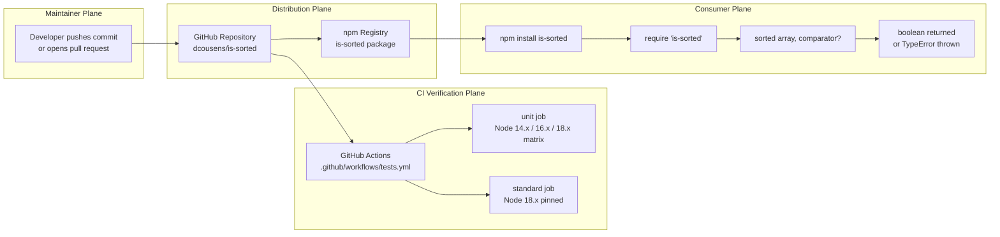

This diagram complements the component diagram in Section 1.2.2 by adding the temporal/operational dimension that the component diagram does not show.

## 4.2 Core Runtime Control Flow (W-01)

The core runtime workflow is the synchronous execution path traversed when a consumer invokes `checksort(array, comparator?)`. It is the workflow with the highest fidelity requirements because it directly implements features **F-001**, **F-002**, **F-003**, and **F-004**.

### 4.2.1 Process Steps and Decision Points

Each step corresponds to a specific line of `index.js`. Steps marked **DECISION** are branching points; all other steps are linear.

| # | Step | Source Evidence | Type |
|---|------|-----------------|------|
| 1 | Function entry: `checksort(array, comparator)` invoked | `index.js` line 5 | Entry |
| 2 | **DECISION**: `Array.isArray(array)` truthy? | `index.js` line 6 | Decision (input validation, F-004) |
| 3 | If false: construct `'Expected Array, got ' + (typeof array)` and `throw new TypeError(...)` | `index.js` line 6 | Throw |
| 4 | **DECISION**: Is the supplied `comparator` truthy? | `index.js` line 7 (`comparator = comparator || defaultComparator`) | Decision (comparator selection) |
| 5 | If falsy (`undefined`, `null`, `0`, `''`, `false`, `NaN`): bind `comparator` to `defaultComparator` (`a - b`) | `index.js` lines 1–3, 7 | Assignment (F-002 fallback) |
| 6 | If truthy: bind `comparator` to the caller's function | `index.js` line 7 | Assignment (F-003 override) |
| 7 | Initialize loop: `i = 1`, capture `length = array.length` | `index.js` line 9 | Loop init |
| 8 | **DECISION**: Loop guard `i < length`? | `index.js` line 9 | Decision (termination) |
| 9 | If true: invoke `comparator(array[i - 1], array[i])` | `index.js` line 10 | Comparison |
| 10 | **DECISION**: Is the comparator result `> 0` (strict inversion)? | `index.js` line 10 | Decision (inversion detection) |
| 11 | If yes: `return false` (early exit) | `index.js` line 10 | Return |
| 12 | If no (ordered or equal): increment `++i` and re-enter step 8 | `index.js` line 9 | Loop continuation |
| 13 | Loop exits when `i >= length` (false at step 8) | `index.js` line 9 | Loop exit |
| 14 | `return true` | `index.js` line 13 | Return |

### 4.2.2 Detailed Runtime Flowchart

The flowchart below depicts every decision and transition listed in Section 4.2.1, organized into two swim lanes that delineate the consumer boundary from the library's internals. The library lane contains the entire `checksort` body; the consumer lane contains only the call site and the three observable outcomes.

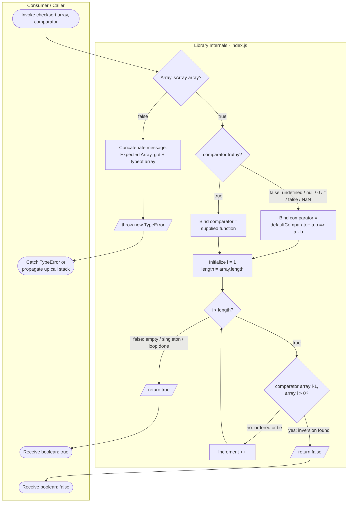

This diagram is a refined, fully-annotated version of the high-level flowchart in Section 1.3.1; the additional detail comprises the swim-lane decomposition, the explicit enumeration of falsy comparator values that route to `defaultComparator`, and the early-exit return path.

### 4.2.3 Validation Rules and Business Logic

Each decision point in Section 4.2.2 encodes a precise business rule that the implementation enforces. These rules constitute the entirety of the input validation surface and are listed in execution order.

| Step | Rule | Behavior |
|------|------|----------|
| Entry | Input validation is **eager** — performed before any iteration begins | Guarantees no partial work occurs on an invalid input |
| Step 2 | First argument **must** be a true `Array` per `Array.isArray` semantics | Excludes typed arrays, `Set`, `Map`, generators, array-likes, and primitives |
| Step 4 | Comparator selection uses **JavaScript `||` short-circuit**, not an explicit `typeof === 'function'` test | Any falsy comparator (incl. `null`, `0`, `''`, `false`, `NaN`) routes to `defaultComparator` |
| Step 5 | Default comparator performs **only** numeric subtraction (`a - b`) | Behavior on non-numeric inputs is whatever JavaScript subtraction yields (`NaN` is possible) |
| Step 6 | Custom comparator is treated as **trusted, opaque code** (no validation of its signature, purity, or determinism) | Caller is responsible for vetting per assumption **A-002** |
| Step 10 | Inversion criterion is strictly `> 0`, **not** `>= 0` | Adjacent equal values (ties) are accepted as ordered (nondecreasing ⇒ sorted) |
| Step 13 | Loop exits only after a full scan with no inversion | Empty arrays and singletons exit immediately with `true` because the loop body executes zero times |

### 4.2.4 Timing and Complexity Profile

The runtime workflow has no formal SLA, since per Section 1.2.3 the repository declares no throughput targets or business KPIs. The implicit timing envelope is captured by the algorithmic complexity bounds documented in Section 2.4.2:

| Characteristic | Bound | Notes |
|----------------|-------|-------|
| Worst-case time | **O(n)** | Single sequential pass; touches each adjacent pair at most once |
| Best-case time | **O(1)** | First-pair inversion triggers immediate early exit |
| Auxiliary space | **O(1)** | No allocations beyond the loop variable `i` |
| Trivial inputs | **O(0)** comparisons | Empty arrays and singletons skip the loop body entirely |
| Comparator dispatch cost | One function call per adjacent pair | Caller-defined; not bounded by the library |

The function is **synchronous and blocking** — control is returned to the caller in the same tick of the event loop, with no scheduling, yielding, or `setImmediate`/`process.nextTick` use.

## 4.3 Consumer Integration Workflow (W-02)

The consumer integration workflow describes the end-to-end journey from the moment a downstream developer chooses to depend on `is-sorted` through the moment they receive a boolean or `TypeError` from `checksort`. It is the only workflow that crosses a true system boundary (npm registry → consumer host).

### 4.3.1 End-to-End Consumer Journey

| # | Phase | Mechanism | Source Evidence |
|---|-------|-----------|-----------------|
| 1 | Declaration | Consumer adds `"is-sorted": "^1.0.5"` to their `package.json` `dependencies` | npm convention; package name from `package.json` `name`/`version` |
| 2 | Resolution & download | `npm install` fetches the tarball from the npm registry | npm registry distribution model |
| 3 | Local materialization | Package is extracted into the consumer's `node_modules/is-sorted/` | npm convention |
| 4 | Entry-point binding (runtime) | `require('is-sorted')` resolves through `package.json` `main` → `index.js` | Section 3.10 integration edge "Manifest → Runtime entry" |
| 5 | Entry-point binding (types, optional) | TypeScript tooling consults `package.json` `types` → `index.d.ts` | Section 3.10 integration edge "Manifest → Types entry"; feature F-005 |
| 6 | Invocation | Consumer calls `sorted(array)` or `sorted(array, comparator)` | `README.md` usage examples (three forms: ascending default, false case, descending custom) |
| 7 | Outcome | Receives `true`, `false`, or catches `TypeError` per Section 4.2 | `index.js` lines 6, 10, 13 |

### 4.3.2 Integration Sequence Diagram

The sequence diagram below traces the actors involved in a representative consumer interaction, including the three call patterns demonstrated in `README.md`.

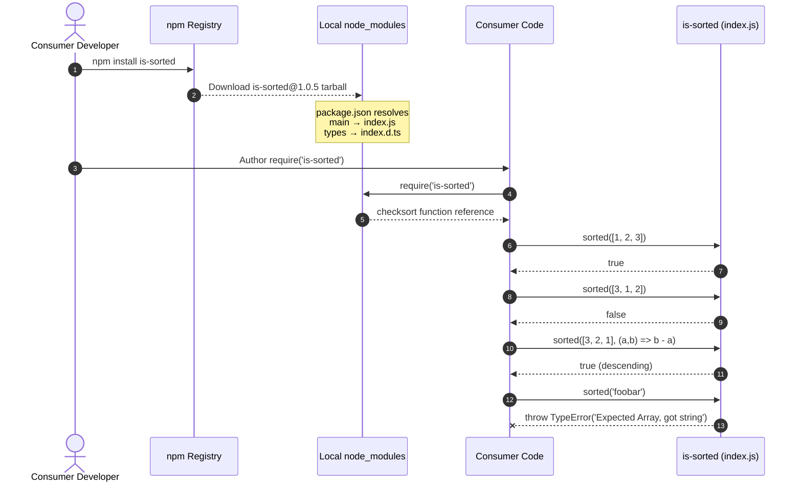

### 4.3.3 TypeScript Consumer Path

TypeScript-typed consumers traverse the same runtime path, but additionally bind the compile-time signature from `index.d.ts` (feature F-005). The declaration uses `export = checksort` (CommonJS-style), which means some TypeScript projects require `esModuleInterop` to be enabled for ergonomic `import sorted from 'is-sorted'` usage — a constraint documented in Section 2.4.1.

| TypeScript Phase | Action |
|------------------|--------|
| Module resolution | `tsc` reads `package.json` `types` and locates `index.d.ts` |
| Signature binding | Imports `checksort<T = any>(array: T[], comparator?: (a: T, b: T) => number): boolean` |
| Type checking | Verifies caller passes `T[]` and (optionally) a comparator with matching `T` |
| Runtime | Identical to the JavaScript path documented in Section 4.2 — `index.d.ts` is erased at compile time |

## 4.4 Test Execution Flow (W-03)

The test execution workflow verifies feature **F-006** (the test suite) and indirectly verifies F-001, F-002, F-003, and F-004 through the 12 fixture cases and one explicit throw assertion enumerated in Section 2.5.2.

### 4.4.1 Test Pipeline Process Steps

| # | Step | Source Evidence |
|---|------|-----------------|
| 1 | `npm test` invoked (locally or from CI) | `package.json` `scripts.test` |
| 2 | npm resolves the script to `tape test/*.js` | `package.json` `scripts.test` value |
| 3 | tape harness loads `test/index.js` (the only file matching the glob) | `package.json` `devDependencies.tape: ^5.0.0` |
| 4 | `test/index.js` loads the module under test via `require('../')` | `test/index.js` line 1; Section 3.10 |
| 5 | `test/index.js` loads fixtures via `require('./fixtures')` | `test/index.js` line 2 |
| 6 | `test/index.js` builds the local comparator lookup map: `{ descending: (a, b) => b - a }` | `test/index.js` lines 4–6 |
| 7 | Iterate 12 fixture cases with `for...of fixtures` | `test/index.js` line 8 |
| 8 | For each fixture: declare `t.plan(1)`, invoke `sorted(f.array, comparators[f.comparator])`, assert `t.equal(actual, f.expected)` | `test/index.js` lines 9–14 |
| 9 | Run the additional throw test: `t.throws(() => sorted('foobar'), /Expected Array, got string/)` | `test/index.js` lines 17–22 |
| 10 | tape emits TAP-format output to stdout and exits with code 0 (all pass) or non-zero (any fail) | tape `^5.0.0` semantics |

### 4.4.2 Test Execution Flowchart

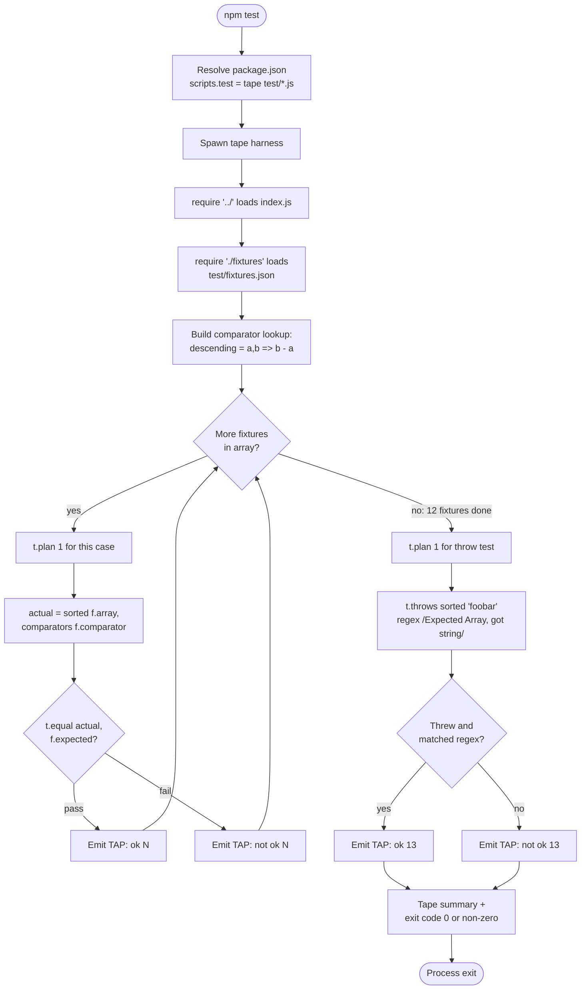

### 4.4.3 Fixture-Driven Validation Rules

The 12 fixtures in `test/fixtures.json` and the single throw test in `test/index.js` together exercise every requirement traced in the Section 2.5.2 traceability matrix. Validation rules enforced at each iteration:

| Rule | Where Enforced |
|------|----------------|
| Each fixture must declare exactly one outcome via `t.plan(1)` | `test/index.js` line 10 |
| `actual` must equal `f.expected` under strict equality (`t.equal`) | `test/index.js` line 13 |
| The throw test must observe a thrown exception whose message matches `/Expected Array, got string/` | `test/index.js` lines 17–22 |
| String-keyed comparators are resolved through a local table; fixtures referencing a key not in the table produce `undefined` (which the library then falls back to `defaultComparator`) | `test/index.js` lines 4–6, 11 |
| Empty arrays, singletons, ties, floats, gaps, and explicit out-of-order cases are all covered (fixtures #1–#12 per the table-driven matrix described in the Section 2.5.2 traceability) | `test/fixtures.json` |

## 4.5 Continuous Integration Pipeline Flow (W-04)

The CI workflow (`.github/workflows/tests.yml`) implements feature **F-007** and orchestrates F-006 (tests) and F-008 (lint) on every push to `main` and every pull request. It is the only multi-job, parallel workflow in the repository.

### 4.5.1 Trigger Events and Job Topology

| Aspect | Value | Source |
|--------|-------|--------|
| Triggering event 1 | `push` to branch `main` | `.github/workflows/tests.yml` lines 3–6 |
| Triggering event 2 | `pull_request` (any branch) | `.github/workflows/tests.yml` line 7 |
| Job 1 — `unit` | Matrix over `node-version: [14.x, 16.x, 18.x]`, `fail-fast: false`, runs `npm install` + `npm test` | `.github/workflows/tests.yml` lines 10–24 |
| Job 2 — `standard` | Single runner pinned to `node-version: 18.x` (per inline comment, to avoid GitHub Actions rate-limit on `lts/*` resolution), runs `npm install` + `npm run standard` | `.github/workflows/tests.yml` lines 26–36 |
| Runner image | `ubuntu-latest` for both jobs | `.github/workflows/tests.yml` lines 11, 27 |
| External actions | `actions/checkout@main`, `actions/setup-node@main` (mutable `@main` refs, not pinned SHAs) | `.github/workflows/tests.yml` lines 17–19, 30–32 |
| Deployment stage | None — CI is verification-only; no `npm publish` step exists | `.github/workflows/tests.yml` (absence of publish step) |

### 4.5.2 CI Pipeline Flowchart

The `unit` and `standard` jobs are dispatched in parallel with no inter-job dependency. Within `unit`, the three matrix cells (Node 14.x, 16.x, 18.x) execute on independent runners, again with no inter-cell dependency because `fail-fast: false` is set.

```mermaid
flowchart TD
    PushEvent([push to main]) --> Workflow[GitHub Actions evaluates<br/>.github/workflows/tests.yml]
    PREvent([pull_request opened/updated<br/>any branch]) --> Workflow

    Workflow --> Dispatch{Parallel<br/>job dispatch}

    Dispatch -->|job: unit| UMatrix[Expand matrix:<br/>node-version 14.x / 16.x / 18.x<br/>fail-fast: false]
    Dispatch -->|job: standard| SBoot[Single runner<br/>node-version 18.x pinned]

    UMatrix --> UCells[Three independent<br/>ubuntu-latest runners]
    UCells --> UStep1[actions/checkout@main]
    UStep1 --> UStep2[actions/setup-node@main<br/>uses matrix.node-version]
    UStep2 --> UStep3[npm install]
    UStep3 --> UStep4[npm test → tape test/*.js]
    UStep4 --> UResult{Cell result}

    SBoot --> SStep1[actions/checkout@main]
    SStep1 --> SStep2[actions/setup-node@main<br/>node-version 18.x]
    SStep2 --> SStep3[npm install]
    SStep3 --> SStep4[npm run standard]
    SStep4 --> SResult{Lint result}

    UResult -->|pass per cell| Status[GitHub aggregates<br/>commit & PR status checks]
    UResult -->|fail per cell:<br/>siblings continue| Status
    SResult -->|pass| Status
    SResult -->|fail| Status
    Status --> EndCI([Workflow complete])
```

### 4.5.3 Matrix Execution and Fail-Open Semantics

The `fail-fast: false` configuration is a deliberate design choice that affects the workflow's failure-reporting semantics:

| Semantic | Behavior |
|----------|----------|
| Cell independence | Each Node version matrix cell completes regardless of sibling outcomes |
| Visibility | A failure on (say) Node 14.x does not mask whether Node 16.x and 18.x also fail or pass; maintainers see the **complete** failure surface in a single workflow run |
| Cross-job independence | The `standard` job's success or failure is independent of `unit`; both must be green for the overall commit/PR status to be green |
| External action drift | `actions/checkout@main` and `actions/setup-node@main` are mutable refs; behavioral changes in those actions can in principle affect workflow outcomes without any change to this repository |
| No retry | There is no built-in retry, backoff, or rerun-on-failure; reruns are manual via the GitHub Actions UI |
| No notification flow | Status is surfaced exclusively through GitHub's built-in commit/PR status check API; no Slack/email/PagerDuty integration is configured |

The CI pipeline's role in the broader maintenance model is documented in Section 2.4.5 ("Multi-version compatibility" and "CI green status" success factors).

## 4.6 Error Handling Flow

This section isolates the single error path that exists in the system: the `TypeError` thrown by feature **F-004**'s input guard. Per Section 2.4.4, the library has **no other failure mode**: there is no async failure path, no I/O failure path, no resource-exhaustion path, no third-party-service failure path.

### 4.6.1 Error Surface and Trigger Conditions

| Error Surface | Trigger | Message Pattern | Recovery |
|---------------|---------|-----------------|----------|
| `TypeError` thrown synchronously from `checksort` | First argument fails `Array.isArray` | `'Expected Array, got ' + (typeof array)` — e.g. `"Expected Array, got string"`, `"Expected Array, got object"`, `"Expected Array, got undefined"` | Caller-side: wrap the call in `try { ... } catch (e) { ... }` and supply a valid `Array`. There is **no** internal retry, fallback, recovery procedure, or notification flow. |

Per the explicit dispositions in Section 4.1.2:

| Mechanism | Status |
|-----------|--------|
| Retry mechanism | **None** — synchronous single-shot |
| Fallback process | **None** beyond the synchronous default-comparator selection in step 4 of the runtime flow (Section 4.2.1), which is not strictly an error fallback |
| Error notification flow | **None** — the error is thrown to the caller, not emitted to an external system |
| Recovery procedure | **None** internal to the library; recovery is the caller's responsibility |

### 4.6.2 Error Path Flowchart

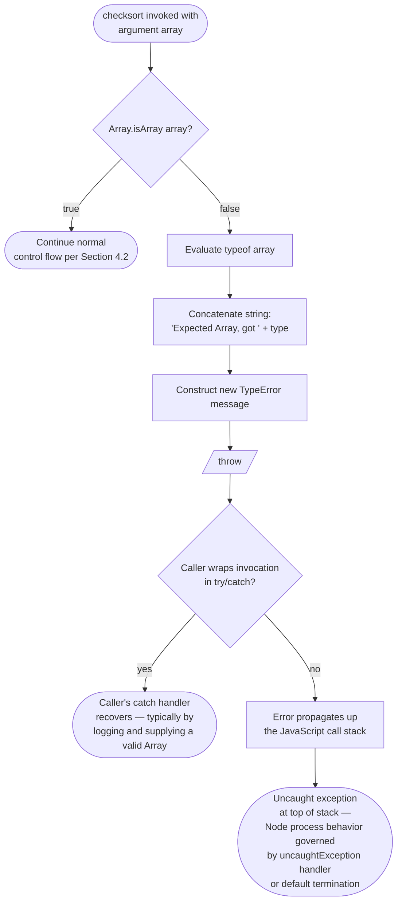

### 4.6.3 Recovery Procedures (Caller-Side Only)

Because the library performs no internal recovery, all recovery responsibility lies with the caller. The recommended caller-side pattern is:

| Step | Action |
|------|--------|
| 1 | Wrap the `sorted(input)` call in `try { ... } catch (e if e instanceof TypeError) { ... }` |
| 2 | In the catch block, coerce or filter the input to ensure it satisfies `Array.isArray` (e.g., via `Array.from(...)` for iterables, or via explicit type checks) |
| 3 | Re-invoke `sorted(...)` with the corrected input, or surface the error through the caller's own error-reporting channel |

No part of this recovery is provided by `is-sorted` itself; it is documented here only for completeness because the prompt asks for recovery procedures.

## 4.7 State Transition Model

### 4.7.1 Statelessness Posture

Per Section 2.4.3, `checksort` is a **pure function with no shared state; safe under any reentrant or concurrent invocation pattern in single-threaded Node**. There is therefore no state machine **between** invocations — every call is a fresh, independent execution that owes nothing to any previous call. The only meaningful state lifecycle is the transient, per-invocation lifecycle traversed during a single function call.

The following data-persistence and caching properties hold (cross-referenced from Sections 2.4.3 and 2.4.4):

| Property | Value |
|----------|-------|
| Data persistence points | **None** — no database, no filesystem write, no IPC, no telemetry |
| Caching layer | **None** — function is recomputed on every call |
| Transaction boundary | **None** — function performs no transactional work |
| Stateful side effects | **None** — no logging, no metrics emission, no I/O |
| Concurrency model | Reentrant-safe by virtue of having no shared mutable state |
| Idempotence | Trivially idempotent — same inputs always produce the same output (modulo non-deterministic comparators supplied by the caller, per assumption A-002) |

### 4.7.2 Invocation Lifecycle State Diagram

The state diagram below captures the **transient** lifecycle of a single `checksort` invocation. It is a faithful transliteration of the runtime control flow in Section 4.2.2 expressed in state-machine notation. There is no persisted state — each invocation begins and ends in the same logical `[*]` (initial/final) state.

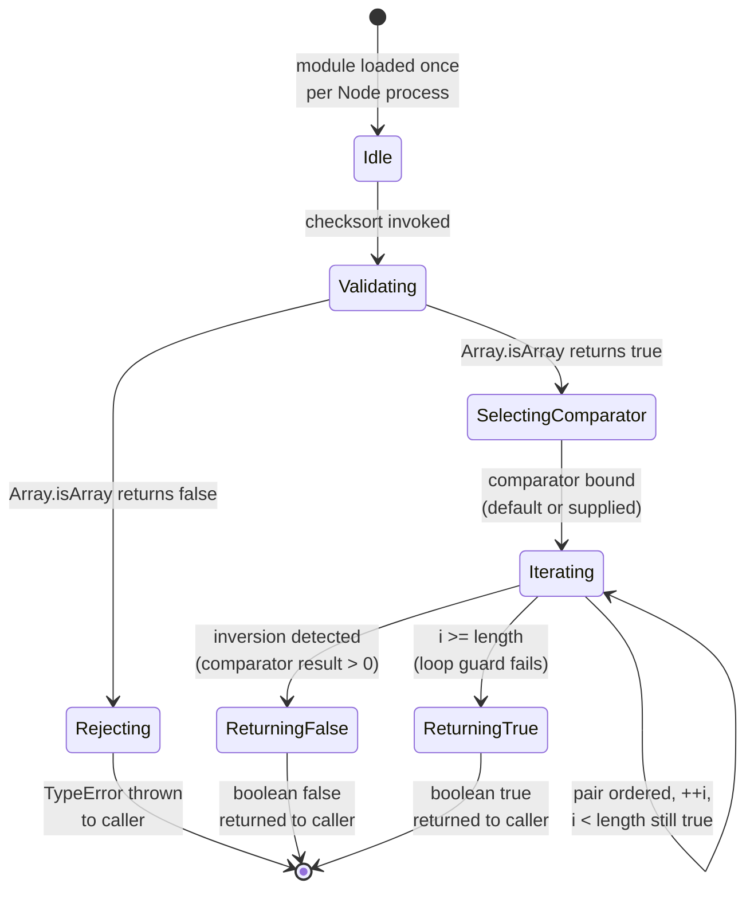

Empty arrays and singletons cause the `Iterating` state's self-loop to never execute; the `LoopGuard` predicate is false on entry, and the state machine transitions directly from `SelectingComparator` to `ReturningTrue`.

### 4.7.3 Concurrency and Reentrancy Guarantees

Because the only writes that occur during execution are to **local variables on the call stack** (`comparator`, `i`, `length`), every invocation of `checksort` operates in its own isolated stack frame. Consequences:

| Guarantee | Implication |
|-----------|-------------|
| Reentrant-safe | A comparator that itself calls `checksort` (directly or transitively) is safe — no global state is observed or mutated |
| Worker-thread safe | The module may be `require`'d independently in `worker_threads` without coordination |
| Child-process safe | Likewise safe in `child_process` forks |
| Single-threaded event-loop safe | No `await` points exist; the function holds the event loop until it returns (which is fast — see Section 4.2.4 for the O(n) bound) |

## 4.8 Validation, Compliance, and Authorization Checkpoints

This section aggregates every validation gate, authorization checkpoint, and compliance check across the four workflows. The aggregation is deliberately short — most rows below report that no checkpoint exists, which is itself the relevant architectural fact.

### 4.8.1 Input Validation Rules

| Rule | Implementation | Workflow | Source |
|------|----------------|----------|--------|
| First argument must be a true `Array` per `Array.isArray` | `if (!Array.isArray(array)) throw new TypeError(...)` | W-01 (runtime) | `index.js` line 6 |
| Excludes typed arrays, `Set`, `Map`, generators, array-likes, primitives | Falls through the `Array.isArray` guard | W-01 (runtime) | `index.js` line 6; assumption **A-003** |
| Comparator (if supplied) is treated as **opaque, trusted code** | No validation that it's a function, returns a number, or is pure | W-01 (runtime) | `index.js` line 10; assumption **A-002** |
| Test fixture format must match the structure expected by `test/index.js` (`array`, `expected`, optional `comparator` key) | Implicit — no schema validator | W-03 (test) | `test/index.js` lines 11–13 |
| Comparator key in fixture must exist in the local `comparators` map (else `undefined` falls back to `defaultComparator`) | Implicit lookup behavior | W-03 (test) | `test/index.js` lines 4–6, 11 |
| CI trigger event must be `push` to `main` or `pull_request` | YAML declaration | W-04 (CI) | `.github/workflows/tests.yml` lines 3–7 |
| CI matrix value must be one of `[14.x, 16.x, 18.x]` | YAML declaration | W-04 (CI) | `.github/workflows/tests.yml` line 15 |

### 4.8.2 Authorization Disposition

| Workflow | Authorization Model |
|----------|---------------------|
| W-01 (runtime) | **None** — pure function, no credentialed work |
| W-02 (consumer integration) | **None** at the package level. `npm install` may require authentication against private registries, but that is governed by the consumer's npm configuration, not by `is-sorted` itself |
| W-03 (test) | **None** — tests run locally with no credentials |
| W-04 (CI) | GitHub's built-in workflow authorization (repository-scoped `GITHUB_TOKEN`); no secrets, no external service authentication, no `npm publish` credentials referenced |

### 4.8.3 Regulatory Compliance Disposition

| Concern | Disposition |
|---------|-------------|
| GDPR / personal data handling | **Not applicable** — function does not retain, log, or transmit any caller data |
| PII storage / audit logging | **Not applicable** — no storage, no logging |
| Cryptographic compliance (FIPS, etc.) | **Not applicable** — no cryptographic operations |
| Export control (encryption, etc.) | **Not applicable** — no controlled algorithms |
| License compliance | MIT License declared in `LICENSE`; consumers must comply with MIT attribution |
| Supply-chain attestation (SLSA, provenance) | Not currently produced; no SBOM or provenance attestation exists in the workflow |

The "Not applicable" entries are not gaps in the documentation — they reflect the deliberate scope of a single-function utility library, consistent with constraint **C-005** in Section 2.6.2.

## 4.9 References

### 4.9.1 Repository Files Examined

- `index.js` — The 14-line runtime implementation. Primary source of truth for W-01 (runtime control flow), the validation rule in Section 4.8.1, the error path in Section 4.6, and the state model in Section 4.7.
- `index.d.ts` — TypeScript ambient declaration. Source for the TypeScript consumer path in Section 4.3.3.
- `package.json` — npm manifest. Source for the integration edges referenced throughout (manifest → `main`, → `types`, → `scripts.test`, → `scripts.standard`), and for the absence of a `dependencies` field.
- `README.md` — Consumer-facing usage examples. Source for the three call patterns shown in the sequence diagram in Section 4.3.2.
- `test/index.js` — tape-based test harness. Source for W-03 (test execution flow) and for the throw test referenced in Section 4.6.1.
- `test/fixtures.json` — 12 table-driven test cases. Referenced for W-03's iteration step and for the validation rules in Section 4.8.1.
- `.github/workflows/tests.yml` — Sole CI workflow. Source for W-04 (CI pipeline), the `unit` matrix, the pinned `standard` job, the trigger events, and the `fail-fast: false` semantics in Section 4.5.3.

### 4.9.2 Repository Folders Explored

- `/` (root) — Top-level inventory for cross-workflow context.
- `test/` — Contains `test/index.js` and `test/fixtures.json`; both used for W-03.
- `.github/workflows/` — Contains `tests.yml`; used for W-04.

### 4.9.3 Technical Specification Sections Cross-Referenced

- Section 1.2.2 — Major System Components diagram; complemented by the high-level workflow in Section 4.1.4.
- Section 1.2.3 — Success criteria and KPIs; cited in Section 4.2.4.
- Section 1.3.1 — Primary User Workflow flowchart; refined and elaborated in Section 4.2.2.
- Section 1.3.2 — Out-of-scope exclusions; cited extensively in Section 4.1.2.
- Section 2.3.1 — Feature Dependencies Map; referenced throughout Section 4 for feature anchoring.
- Section 2.4.1 — Technical Constraints; cited in Section 4.3.3 for the `esModuleInterop` note.
- Section 2.4.2 — Performance Requirements; cited in Section 4.2.4.
- Section 2.4.3 — Scalability Considerations; cited in Section 4.7.1 for the statelessness posture.
- Section 2.4.4 — Security Implications; cited in Sections 4.6 and 4.8.
- Section 2.4.5 — Maintenance Requirements; cited in Section 4.5.3.
- Section 2.5.1 / 2.5.2 — Feature-to-Source and Requirement-to-Test traceability; cited in Section 4.4.3.
- Section 2.5.3 — Cross-References to Process Flowcharts; this entire section (4) is the consolidated process-flow target referenced from that index.
- Section 2.6.1 — Assumptions A-002, A-003, and A-005; cited in Sections 4.2.3, 4.7.3, and 4.8.1.
- Section 2.6.2 — Constraints C-001 through C-005; cited in Sections 4.1.2, 4.8.3.
- Section 3.10 — Integration Requirements Between Stack Components; the integration edges enumerated there underpin the W-02 (consumer) and W-03 (test) flows documented in Sections 4.3 and 4.4.

# 5. System Architecture

## 5.1 HIGH-LEVEL ARCHITECTURE

### 5.1.1 System Overview

#### 5.1.1.1 Architectural Style and Rationale

`is-sorted` is architected as a **single-function CommonJS micro-utility library** distributed through the npm registry. There is no service architecture, no client-server split, no event-driven topology, and no layered or hexagonal decomposition. The entire production surface consists of a 14-line pure function exported from `index.js` via `module.exports`, accompanied by a hand-maintained 3-line TypeScript ambient declaration in `index.d.ts`.

This radical minimalism is a deliberate architectural choice rather than an under-investment. The package occupies the *micro-utility* tier of the npm ecosystem — a single-purpose, narrowly-scoped function published as a standalone package so it can be composed into larger libraries and applications. Consequently, the architectural style is best characterized as:

- **In-process library architecture** — the function executes synchronously in the caller's JavaScript runtime; there is no remote boundary, no marshalling, and no protocol overhead.
- **Pure-function core with eager input validation** — all logic is contained in one stateless function that validates its arguments before performing any iteration.
- **Quality-gates-as-architecture** — because the runtime surface is so small, the non-runtime architectural components (test suite, CI pipeline, lint enforcement) carry an outsized share of the system's overall design intent.

The rationale for this style is captured by the critical success factors and constraints already documented in the specification: algorithmic simplicity (the implementation must remain comprehensible at a glance), dependency hygiene (zero runtime dependencies), backward compatibility of the public signature across `1.x`, and the explicit prohibition of runtime telemetry, logging, configuration files, or environment variables.

#### 5.1.1.2 Key Architectural Principles and Patterns

| Principle | Manifestation |
|-----------|---------------|
| Pure function, no side effects | `checksort` reads only its arguments and returns a boolean; it performs no I/O, no logging, no telemetry |
| Eager input validation | `Array.isArray` guard executes before any iteration; on failure a `TypeError` is thrown synchronously |
| Synchronous, blocking semantics | No Promises, callbacks, or `await` points; control returns to the caller in the same event-loop tick |
| Zero allocation | No intermediate arrays, copies, or auxiliary structures beyond the loop variable |
| Comparator contract parity | The optional `comparator` parameter mirrors `Array.prototype.sort`'s contract, enabling reuse of existing comparators |
| Fail-fast on disorder | First inversion (`comparator(prev, curr) > 0`) returns `false` immediately; no further work is performed |
| Stable public signature | `checksort(array, comparator?) => boolean` is contractually frozen across the `1.x` series |
| Hand-maintained signature parity | `index.d.ts` is manually kept synchronized with the runtime export — no build step generates it |

#### 5.1.1.3 System Boundaries and Major Interfaces

The system has a single conceptual boundary: the npm package itself. There are only three major interfaces, all of which are file-level entry points rather than network protocols:

| Interface | Direction | Defined By |
|-----------|-----------|------------|
| Runtime entry | Consumer process → library | `package.json` `main` field → `index.js` |
| Type-checking entry | TypeScript compiler → declarations | `package.json` `types` field → `index.d.ts` |
| CI workflow entry | GitHub Actions → repository scripts | `.github/workflows/tests.yml` triggering `npm test` and `npm run standard` |

No service endpoints, databases, message buses, or external APIs are involved. The architecture's external surface is intentionally limited to the npm distribution channel for end consumers and the GitHub Actions surface for maintainer feedback.

The following diagram captures the high-level architecture, depicting the maintainer/publisher path, the consumer integration path, and the CI feedback loop in a single view.

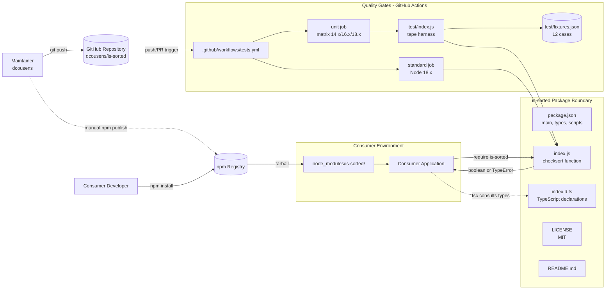

### 5.1.2 Core Components

The system's core components are enumerated below. The "Quality Assurance" components are non-runtime artifacts; they are nonetheless architectural elements because they enforce the runtime contracts.

| Component Name | Primary Responsibility | Key Dependencies |
|----------------|------------------------|------------------|
| `checksort` Runtime (`index.js`) | Synchronously determine whether an array is sorted under a comparator | Node.js built-ins: `Array.isArray`, `TypeError`, `typeof` |
| TypeScript Declarations (`index.d.ts`) | Provide compile-time signature for typed consumers | Hand-maintained parity with `index.js` |
| Package Manifest (`package.json`) | Bind `main` → `index.js`, `types` → `index.d.ts`, declare scripts and devDependencies | npm tooling; `tape ^5.0.0`, `standard *` (dev only) |
| Test Suite (`test/index.js`, `test/fixtures.json`) | Verify F-001 through F-005 against 12 table-driven cases plus one explicit throw assertion | `tape ^5.0.0`; `Array.isArray`; loads module via `require('../')` |
| CI Pipeline (`.github/workflows/tests.yml`) | Orchestrate unit + lint verification on push to `main` and on pull requests | GitHub Actions; `actions/checkout@main`, `actions/setup-node@main`; `ubuntu-latest` runner |
| Lint Configuration (devDep `standard`) | Enforce JavaScript style; lint pinned to Node 18.x in CI | `standard *` devDependency; invoked via `npm run standard` |
| User Documentation (`README.md`) | Communicate tagline, usage examples, badges | None |
| License (`LICENSE`) | MIT license declaration, Copyright 2015 Daniel Cousens | None |

The integration considerations and critical observations for each component are summarized below.

| Component Name | Integration Points | Critical Considerations |
|----------------|--------------------|--------------------------|
| `checksort` Runtime | Sole runtime artifact loaded by consumers via `require('is-sorted')` | Public signature is frozen across `1.x`; 14-line implementation must remain readable |
| TypeScript Declarations | Consumed by TypeScript projects via `package.json` `types` field | Uses `export = checksort`; some consumer projects require `esModuleInterop` |
| Package Manifest | Single integration hub: `main`, `types`, `scripts`, `devDependencies` | Renaming any entry-point file would break consumer resolution |
| Test Suite | Loads module under test via `require('../')`; loads fixtures via `require('./fixtures')` | Fixture format is implicit (no schema validation); the `comparator` key resolves to a string-keyed `comparators` map local to `test/index.js` |
| CI Pipeline | Executes scripts declared in `package.json`; reports status back via GitHub commit/PR check API | `actions/checkout@main` and `actions/setup-node@main` are mutable refs; `fail-fast: false` enables full failure visibility across the matrix |
| Lint Configuration | Invoked by both local developers (`npm run standard`) and CI's `standard` job | `standard "*"` is unpinned; rules can drift across installs |
| User Documentation | Read-only; not loaded by any runtime path | README examples must remain executable against the published API |
| License | Read by humans and SPDX-aware tooling only | MIT attribution required of consumers |

### 5.1.3 Data Flow Description

The system has exactly one runtime data flow and several non-runtime (build- and CI-time) data flows. All flows are documented below in prose to make the absence of more complex patterns (queues, brokers, ETL, streams) architecturally explicit.

#### 5.1.3.1 Primary Runtime Data Flow

The single runtime data flow is the synchronous traversal performed inside `checksort`. The flow originates at the consumer call site, crosses the module boundary into `index.js`, and returns either a boolean or a thrown `TypeError`. Specifically, the consumer passes an array (and optionally a comparator function) by reference; `checksort` validates the array reference with `Array.isArray`, selects between the supplied comparator and the private `defaultComparator` using a `||` short-circuit, then iterates adjacent pairs invoking the comparator until either an inversion is detected (early-exit `false`) or the loop guard fails (`true`). No data is transformed, copied, persisted, or transmitted; the input array reference is read but never mutated, and the only output is a boolean return value or a thrown exception.

#### 5.1.3.2 Integration Patterns and Protocols

The package uses one integration protocol: **CommonJS `require` resolution**. A consumer's `require('is-sorted')` triggers Node's module-resolution algorithm, which consults the package's `package.json` `main` field and loads `index.js`. There is no HTTP, no RPC, no gRPC, no message-queue protocol, no WebSocket, no SSE, and no IPC. The TypeScript declaration path uses TypeScript's module-resolution protocol via the `types` field, but this is a compile-time read with no runtime effect because `.d.ts` files are erased before execution.

#### 5.1.3.3 Data Transformation Points

There are no data transformation points within the library. The input array reference is iterated in-place; no normalization, parsing, serialization, or schema mapping occurs. The only "transformation" is the construction of the `TypeError` message string `'Expected Array, got ' + (typeof array)` at the failure boundary — and even that occurs only on the rejection path.

#### 5.1.3.4 Key Data Stores and Caches

| Concern | Disposition |
|---------|-------------|
| Relational database | Not used — no persistence layer exists |
| Document database | Not used — no persistence layer exists |
| In-memory cache | Not used — the function is recomputed on every call |
| Object storage | Not used — no I/O is performed |
| Message queue | Not used — no asynchronous decoupling exists |
| Search index | Not used — no query surface exists |
| Local filesystem | Read at module-load time only for `index.js`; not used by runtime logic |

#### 5.1.3.5 Non-Runtime Data Flows

Two non-runtime flows complete the picture. First, the **test flow** loads `test/fixtures.json` (12 table-driven cases) into the `tape` harness via `require('./fixtures')`, which iterates each case, invokes `checksort`, and asserts the expected boolean. Second, the **CI flow** is triggered by GitHub on push-to-`main` or pull-request events; GitHub Actions checks out the repository onto an `ubuntu-latest` runner, installs Node (14.x, 16.x, or 18.x depending on matrix cell), runs `npm install`, and then runs `npm test` for unit verification or `npm run standard` for lint verification. Neither flow generates persistent artifacts beyond GitHub's commit/PR status check API.

### 5.1.4 External Integration Points

External integration points are limited to infrastructure-level services — none of them are invoked by the runtime function itself. The package is functionally self-contained at runtime.

| System Name | Integration Type | Data Exchange Pattern |
|-------------|------------------|------------------------|
| GitHub (source hosting) | Source repository + issue tracker | git push/pull over HTTPS |
| GitHub Actions | CI orchestration | Workflow YAML triggered by `push`/`pull_request` events |
| GitHub-hosted Ubuntu runners | CI execution environment | Job execution host (`runs-on: ubuntu-latest`) |
| npm Registry | Package distribution | Package install via `npm install` (HTTPS tarball download) |
| `actions/checkout` | CI workspace setup | Mutable `@main` Git ref consumed at workflow runtime |
| `actions/setup-node` | CI Node.js setup | Mutable `@main` Git ref consumed at workflow runtime |
| shields.io / NPM badge endpoints | README badge rendering | Static image fetch (read-only, decorative) |

The protocol/format and SLA disposition for each integration is captured below.

| System Name | Protocol / Format | SLA Requirements |
|-------------|---------------------|---------------------|
| GitHub (source hosting) | HTTPS + git protocol | None declared in repository |
| GitHub Actions | YAML workflow definition + GitHub Actions API | None declared in repository |
| GitHub-hosted Ubuntu runners | OCI-style ephemeral runner image | None declared; runners are best-effort |
| npm Registry | HTTPS tarball + JSON metadata | None declared; consumer-side concern |
| `actions/checkout` | GitHub Action consumed by `uses:` directive | None — best-effort, mutable ref |
| `actions/setup-node` | GitHub Action consumed by `uses:` directive | None — best-effort, mutable ref |
| Badge endpoints | HTTPS image (SVG/PNG) | None — purely cosmetic |

Per the specification's Success Criteria subsection, the repository does not declare formal SLAs, throughput targets, or business KPIs; all "SLA Requirements" entries above are honest reflections of that disposition. The following service categories are **deliberately not integrated** and their absence is a design decision rather than an oversight: cloud platforms, authentication providers, monitoring/APM tools, telemetry pipelines, external APIs, and configuration/secrets services.

---

## 5.2 COMPONENT DETAILS

### 5.2.1 `checksort` Runtime Implementation

#### 5.2.1.1 Purpose and Responsibilities

The `checksort` function is the sole runtime artifact and the sole public API. Its responsibilities are: (a) validate that the first argument is a true `Array`, throwing a `TypeError` if not; (b) select between a supplied comparator and the private `defaultComparator` (`(a, b) => a - b`); (c) iterate adjacent pairs in a single linear pass; (d) return `false` on the first inversion or `true` if the entire array is non-decreasing under the active comparator.

#### 5.2.1.2 Technologies and Frameworks

- **Language**: JavaScript, ES5-compatible (no `const`, `let`-only at function scope, no arrow functions in exported API)
- **Module system**: CommonJS (`module.exports`)
- **Runtime**: Node.js 14.x, 16.x, 18.x (per CI matrix)
- **Built-ins used**: `Array.isArray`, `TypeError` constructor, `typeof` operator, numeric subtraction
- **Frameworks**: None — no framework dependency exists at runtime

#### 5.2.1.3 Key Interfaces and APIs

The runtime interface consists of a single exported callable:

```
checksort(array: T[], comparator?: (a: T, b: T) => number): boolean
```

The function throws `TypeError('Expected Array, got <typeof array>')` when the first argument fails `Array.isArray`. There are no other public methods, no events, no class instances, no factory functions.

#### 5.2.1.4 Data Persistence Requirements

None. The function is stateless and writes nothing to any persistent medium. The only writes that occur during execution are to local variables on the call stack (`comparator`, `i`, `length`).

#### 5.2.1.5 Scaling Considerations

The component scales linearly in input size with O(n) worst-case time and O(1) auxiliary space. Best-case time is O(1) when the first adjacent pair is out of order (early exit). Empty arrays and singletons exit in zero comparisons. The function is reentrant-safe and worker-thread safe because no shared mutable state exists; the module may be loaded independently in `worker_threads` or `child_process` forks with no coordination overhead.

### 5.2.2 TypeScript Declaration Component

#### 5.2.2.1 Purpose and Responsibilities

`index.d.ts` provides the compile-time signature for TypeScript consumers. It is referenced from `package.json` via the `types` field and is hand-maintained in parity with the runtime export.

#### 5.2.2.2 Technologies and Frameworks

- **Language**: TypeScript ambient declaration syntax
- **Build step**: None — there is no `tsconfig.json` and no transpilation pipeline; the `.d.ts` is the source artifact
- **Generic typing**: `checksort<T = any>(array: T[], comparator?: (a: T, b: T) => number)`

#### 5.2.2.3 Key Interfaces and APIs

The declaration uses CommonJS-mirroring `export = checksort`, which is the canonical pattern for `.d.ts` files describing a single-default-export CommonJS module. Consumer projects may need `esModuleInterop` enabled in their `tsconfig.json` to import the function ergonomically as `import sorted from 'is-sorted'`.

#### 5.2.2.4 Data Persistence Requirements

None — the file is erased at compile time and has no runtime presence.

#### 5.2.2.5 Scaling Considerations

Not applicable — the declaration is a fixed 3-line file with no dynamic behavior.

### 5.2.3 Test Suite Component

#### 5.2.3.1 Purpose and Responsibilities

The test suite verifies F-001 through F-005 against table-driven fixtures plus an explicit throw assertion. It is the executable specification that enforces the runtime contracts in CI and locally.

#### 5.2.3.2 Technologies and Frameworks

- **Test runner**: `tape ^5.0.0` (devDependency)
- **Pattern**: Table-driven via `for...of fixtures` iteration
- **Assertions used**: `t.plan(1)`, `t.equal`, `t.throws`
- **Local comparator map**: `comparators = { descending: function (a, b) { return b - a } }` — string-keyed lookup of named comparators used by fixture cases

#### 5.2.3.3 Key Interfaces and APIs

The harness loads the module under test via `require('../')` (which resolves through the package's `main` entry) and loads fixtures via `require('./fixtures')`. Each fixture has a structure of `{ array, expected, comparator? }`, where the optional `comparator` key is a string referencing the local `comparators` map. The throw assertion explicitly verifies the `TypeError` message via `t.throws(() => sorted('foobar'), /Expected Array, got string/)`.

#### 5.2.3.4 Data Persistence Requirements

None — fixtures are loaded at test time only and are not part of the runtime artifact set.

#### 5.2.3.5 Scaling Considerations

The fixture catalogue currently contains 12 cases covering empty arrays, singletons, ascending sequences, ties, floats, descending sequences (with the custom `descending` comparator), and negative cases. Adding new cases requires only an append to `test/fixtures.json` for fixtures using default or named comparators; fixtures requiring novel comparators also require updating the `comparators` map in `test/index.js`.

### 5.2.4 Continuous Integration Component

#### 5.2.4.1 Purpose and Responsibilities

The CI pipeline (`.github/workflows/tests.yml`) orchestrates unit verification across three Node.js versions and lint verification on a single pinned Node version. It runs on every push to `main` and on every pull request, reporting status back through GitHub's commit/PR check API.

#### 5.2.4.2 Technologies and Frameworks

- **Orchestrator**: GitHub Actions
- **Runner image**: `ubuntu-latest`
- **External actions**: `actions/checkout@main`, `actions/setup-node@main` (both consumed by mutable `@main` ref)
- **Test matrix**: `node-version: [14.x, 16.x, 18.x]` with `fail-fast: false`
- **Lint job**: Pinned to `node-version: 18.x` per inline workflow comment to avoid GitHub Actions API rate-limiting on `lts/*` resolution

#### 5.2.4.3 Key Interfaces and APIs

The workflow invokes only the scripts declared in `package.json`: `npm install`, then either `npm test` (which expands to `tape test/*.js`) or `npm run standard` (which invokes `standard`). There is no `npm publish` step in the workflow; release publication is performed manually by the maintainer outside the CI surface.

#### 5.2.4.4 Data Persistence Requirements

None within the workflow itself. GitHub Actions retains workflow run logs per its retention policy, but those are platform-managed artifacts, not application data.

#### 5.2.4.5 Scaling Considerations

Adding Node versions requires only an entry in the `node-version` matrix array. Because matrix cells run on independent runners with `fail-fast: false`, scaling the matrix has constant cost per cell with no inter-cell coordination overhead.

### 5.2.5 Component Interaction Diagram

The following diagram details the interactions among the runtime, test, and CI components, including the integration edges enumerated in the specification's stack-integration subsection.

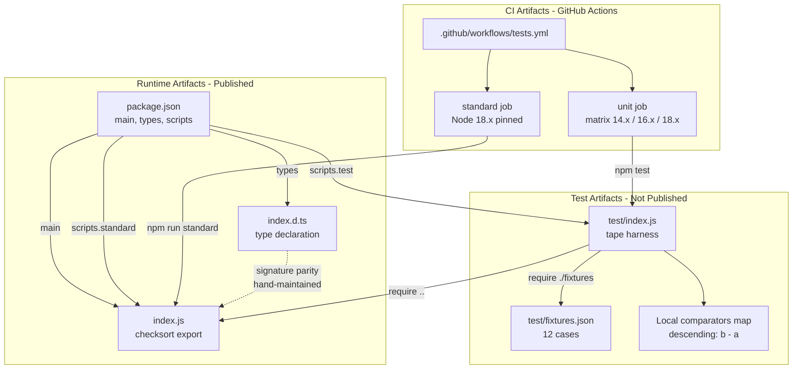

### 5.2.6 Invocation State Transition Diagram

Because the function is purely stateless between invocations, the only meaningful state model is the transient per-invocation lifecycle. The state diagram below captures the lifecycle of a single `checksort` call from entry to return.

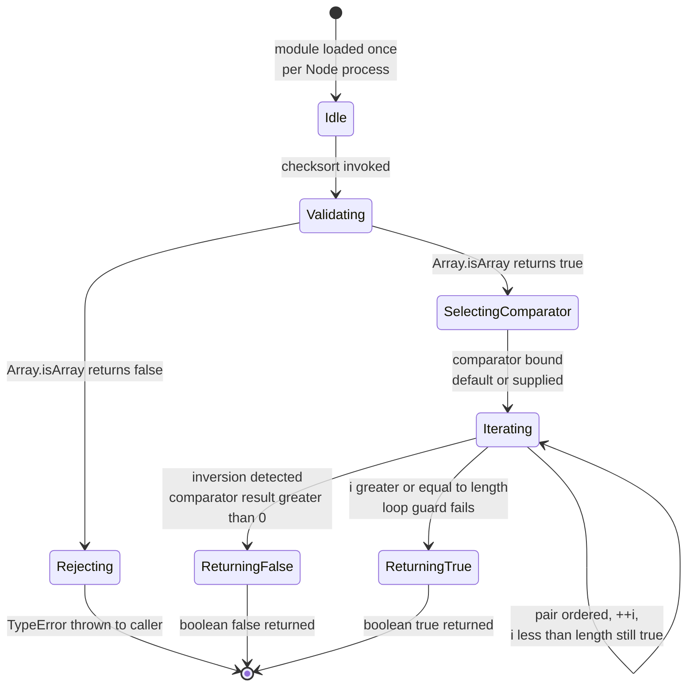

Empty arrays and singletons cause the `Iterating` self-loop to never execute; the loop guard predicate evaluates to false on entry, transitioning directly from `SelectingComparator` to `ReturningTrue`.

### 5.2.7 Consumer Integration Sequence Diagram

The following sequence diagram traces the end-to-end consumer journey from `npm install` through several representative invocations, including the three call patterns demonstrated in `README.md` and the error path.

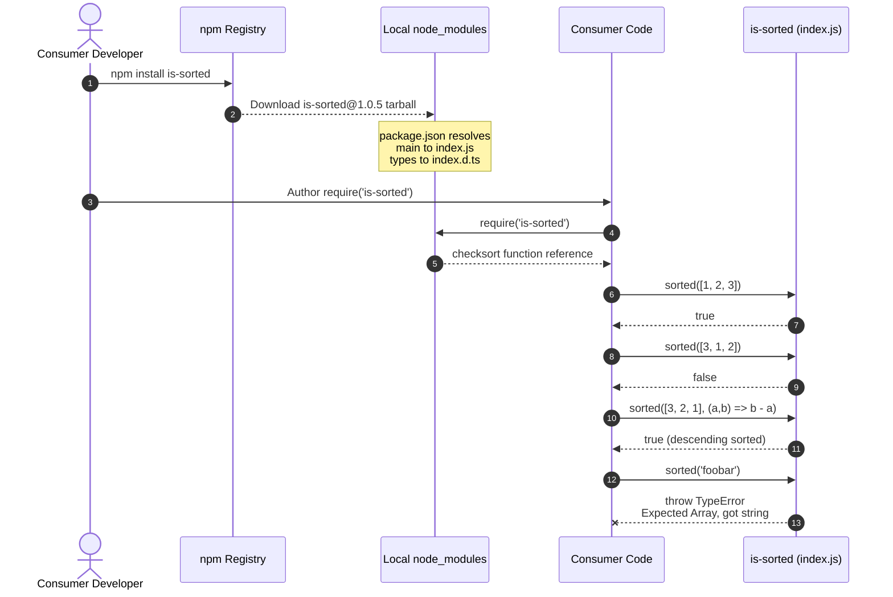

### 5.2.8 CI Pipeline Component Diagram

The CI component dispatches two parallel jobs with no inter-job dependency. The `unit` job further expands into three independent matrix cells.

```mermaid
flowchart TD
    PushEvent([push to main]) --> Workflow[GitHub Actions evaluates<br/>tests.yml]
    PREvent([pull_request<br/>opened or updated]) --> Workflow

    Workflow --> Dispatch{Parallel<br/>job dispatch}

    Dispatch -->|job: unit| UMatrix[Expand matrix<br/>node-version 14.x / 16.x / 18.x<br/>fail-fast: false]
    Dispatch -->|job: standard| SBoot[Single runner<br/>node-version 18.x pinned]

    UMatrix --> UCells[Three independent<br/>ubuntu-latest runners]
    UCells --> UStep1[actions/checkout@main]
    UStep1 --> UStep2[actions/setup-node@main<br/>uses matrix node-version]
    UStep2 --> UStep3[npm install]
    UStep3 --> UStep4[npm test - tape test/*.js]
    UStep4 --> UResult{Cell result}

    SBoot --> SStep1[actions/checkout@main]
    SStep1 --> SStep2[actions/setup-node@main<br/>node-version 18.x]
    SStep2 --> SStep3[npm install]
    SStep3 --> SStep4[npm run standard]
    SStep4 --> SResult{Lint result}

    UResult -->|pass per cell| Status[GitHub aggregates<br/>commit and PR status checks]
    UResult -->|fail per cell<br/>siblings continue| Status
    SResult -->|pass or fail| Status
    Status --> EndCI([Workflow complete])
```

---

## 5.3 TECHNICAL DECISIONS

### 5.3.1 Architecture Style Decisions

The single most consequential architectural decision is the choice of **library architecture over service architecture**. This is paired with several subordinate decisions that together define the system's character.

| Decision | Choice | Rationale |
|----------|--------|-----------|
| Distribution model | npm package (library), not a service | The functionality is a pure computation; no remote boundary is justified |
| Module system | CommonJS only — no ESM, no UMD | Maximizes Node.js compatibility; consumers can re-export under their own module systems |
| Source language | Plain JavaScript, no transpilation | Source equals published artifact; no build pipeline reduces supply-chain surface |
| Type declarations | Hand-written `.d.ts`, no `tsconfig.json` | Avoids a transpilation step while still serving typed consumers |
| Sync vs async | Fully synchronous | Matches `Array.prototype.sort` comparator semantics; no event-loop yielding is needed for an O(n) array scan |
| Iteration pattern | Index-based `for (let i = 1; i < length; ++i)` | Avoids `for...of`/iterator protocol overhead; broadest engine support |
| Comparator fallback | `comparator = comparator || defaultComparator` short-circuit | Simpler than `typeof === 'function'` test; any falsy value routes to default |
| Runtime dependencies | Zero | Eliminates transitive supply-chain risk for downstream consumers |
| Test framework | `tape` (carat-pinned) over `mocha`/`jest`/Node built-in | Minimal API surface; long-stable; fits the table-driven test pattern |
| Lint enforcement | `standard` (unpinned) | Zero-configuration code style; rules ride upstream releases |

Each tradeoff was made in favor of simplicity, predictability, and longevity. The cost of these choices is also explicit: no ESM consumers can `import` the package without interop shims; no browser bundle is shipped; consumers who want streaming or async semantics must wrap `checksort` themselves; and the unpinned `standard` devDependency exposes the development environment (but not the published artifact) to upstream lint-rule changes.

### 5.3.2 Communication Pattern Choices

Only one communication pattern exists: **synchronous in-process function invocation via CommonJS `require`**. All other communication patterns are explicitly not used and their absence is intentional.

| Pattern | Status | Rationale |
|---------|--------|-----------|
| Synchronous function call | **Used** | Sole runtime invocation mechanism |
| HTTP / REST | Not used | No network boundary exists |
| RPC / gRPC | Not used | No service boundary exists |
| Message queue (Kafka, RabbitMQ, SQS) | Not used | No asynchronous decoupling required |
| Event bus / pub-sub | Not used | No event-driven semantics required |
| WebSocket / SSE | Not used | No streaming or push semantics required |
| IPC / named pipes | Not used | No inter-process coordination required |
| GraphQL | Not used | No query/projection surface exists |

### 5.3.3 Data Storage and Caching Strategy

The system's data-storage strategy is the **deliberate absence of any storage**. This is documented as a first-class architectural fact because it constrains the entire design.

| Storage Category | Decision | Rationale |
|-------------------|----------|-----------|
| Relational database | Not used | No domain state to persist |
| Document / NoSQL database | Not used | No domain state to persist |
| Object storage (S3, GCS, Blob) | Not used | No binary artifacts to retain at runtime |
| Distributed cache (Redis, Memcached) | Not used | Function is recomputed on every call; no benefit to caching boolean outputs |
| In-memory cache (LRU, etc.) | Not used | Per-call cost is already O(n); caching keyed by array reference would risk subtle equality bugs |
| Search index | Not used | No query surface exists |
| Message queue / streaming log | Not used | No event history is retained |
| Local filesystem | Read-only at module-load time for `index.js`; no runtime writes | The package is install-time-only on the consumer's filesystem |

The caching strategy is, similarly, the **deliberate absence of caching**. Because the function is pure and inexpensive (O(n) with O(1) overhead per element), introducing a cache would add code complexity without performance benefit — and would create a subtle correctness hazard if the caller mutates the input array between calls.

### 5.3.4 Security Mechanism Selection

The security posture is built on **minimization** rather than active defenses. Because the function performs no I/O, accepts no credentials, parses no untrusted serialized data, and executes no dynamic code, the threat model is correspondingly narrow.

| Concern | Mitigation Selected | Rationale |
|---------|---------------------|-----------|
| Prototype pollution via non-array inputs | `Array.isArray` eager guard rejects all non-arrays before iteration | Industry-standard guard; no false positives on legitimate arrays |
| Dynamic code execution | None used — `eval`, `Function` constructor, `vm.runIn*` are all absent | Eliminates an entire class of vulnerability by construction |
| Side-channel attacks | No timing-sensitive operations beyond comparator dispatch | The comparator's cost is caller-defined; the library introduces no additional timing variance |
| Side effects / data leakage | Pure function emits no logs, no telemetry, no I/O | Telemetry exfiltration is structurally impossible |
| Trust boundary around comparator | Comparator is treated as trusted caller-supplied code | Caller is responsible for vetting per assumption A-002 |
| Supply-chain (runtime) | Zero runtime dependencies | Eliminates transitive-dependency risk entirely |
| Supply-chain (dev) | `tape` caret-pinned; `standard` unpinned | Dev-env risk is acknowledged but does not affect the published artifact |
| Supply-chain (CI actions) | `actions/checkout@main`, `actions/setup-node@main` use mutable refs | Acknowledged risk; would require pinning to commit SHAs to fully mitigate |

### 5.3.5 Architecture Decision Records (ADRs)

The following condensed ADRs capture the most significant architectural decisions in a uniform structure. Each ADR is grounded in the source artifacts cited.

#### 5.3.5.1 ADR-001: Single-File CommonJS Implementation

- **Status**: Accepted (in force since 2015)
- **Context**: The package solves a narrow, well-defined problem (sorted-order detection). The simplest possible implementation is a single function in a single file.
- **Decision**: Implement the entire runtime in `index.js` as a CommonJS module exporting one function via `module.exports`.
- **Consequences**: Source artifact equals published artifact. No build step. Easy audit. Consumer base limited to CommonJS-compatible runtimes (or environments with interop).

#### 5.3.5.2 ADR-002: Zero Runtime Dependencies

- **Status**: Accepted (constraint C-002)
- **Context**: Micro-utility packages with transitive dependencies have historically been vectors for supply-chain incidents in the npm ecosystem.
- **Decision**: Declare no `dependencies` field in `package.json`; rely only on Node.js built-ins (`Array.isArray`, `TypeError`).
- **Consequences**: Downstream consumers inherit zero transitive dependency closure from this package. Cannot adopt third-party utilities even if they would simplify implementation.

#### 5.3.5.3 ADR-003: Synchronous, Blocking Execution

- **Status**: Accepted
- **Context**: The function performs an O(n) array scan. Making it async would introduce Promise overhead and event-loop yielding for no benefit.
- **Decision**: All execution is synchronous; no Promises, callbacks, or async/await primitives.
- **Consequences**: Comparator contract mirrors `Array.prototype.sort`, enabling drop-in comparator reuse. Long arrays will block the event loop for the duration of the scan — but that duration is bounded by the comparator's per-call cost and the array length.

#### 5.3.5.4 ADR-004: Eager Input Validation with `Array.isArray`

- **Status**: Accepted
- **Context**: Accepting iterables or array-likes would expand the function's behavioral surface and complicate the comparator contract.
- **Decision**: Validate the first argument with `Array.isArray` before any iteration; reject everything else (typed arrays, `Set`, `Map`, generators, primitives) with a `TypeError`.
- **Consequences**: Strict contract is easy to reason about and easy to test. Consumers wishing to accept iterables must coerce via `Array.from(...)` themselves.

#### 5.3.5.5 ADR-005: Hand-Maintained TypeScript Declarations

- **Status**: Accepted
- **Context**: Generating `.d.ts` from JavaScript source would require a transpilation step and a build pipeline.
- **Decision**: Hand-maintain `index.d.ts` as a separate source artifact synchronized with the runtime via review discipline.
- **Consequences**: No `tsconfig.json` is needed. Maintenance burden is one extra file edit on any signature change (per maintenance requirement in implementation considerations).

#### 5.3.5.6 ADR-006: Quality Gates as the Sole "Non-Runtime" Architecture

- **Status**: Accepted
- **Context**: With a 14-line runtime, the test suite, CI pipeline, and lint enforcement comprise a disproportionate share of architectural effort.
- **Decision**: Treat `test/`, `.github/workflows/tests.yml`, and the `standard` devDependency as first-class architectural components rather than incidental tooling.
- **Consequences**: The runtime contract is enforced automatically on every push and PR across three Node versions; lint violations block merges.

### 5.3.6 Architectural Decision Tree

The following decision tree captures the reasoning gates that determined which patterns and components were adopted versus rejected. It can be read top-down as a "would adding this concern be justified?" filter.

```mermaid
flowchart TD
    Start([Architectural concern proposed]) --> Q1{Is there a remote<br/>boundary or service?}
    Q1 -->|No| Q2{Is there persistent<br/>domain state?}
    Q1 -->|Yes| Reject1[Reject - this is<br/>an in-process library]

    Q2 -->|No| Q3{Is the function<br/>asynchronous?}
    Q2 -->|Yes| Reject2[Reject - no storage<br/>layer is justified]

    Q3 -->|No| Q4{Does it require<br/>dependencies?}
    Q3 -->|Yes| Reject3[Reject - O(n) array scan<br/>does not justify async]

    Q4 -->|No| Q5{Does it emit telemetry,<br/>logs, or config?}
    Q4 -->|Yes| Reject4[Reject - constraint C-002<br/>no runtime dependencies]

    Q5 -->|No| Q6{Is it covered by<br/>existing tests / CI / lint?}
    Q5 -->|Yes| Reject5[Reject - constraint C-005<br/>no telemetry or config]

    Q6 -->|Yes| Accept([Accept - already in scope])
    Q6 -->|No| Q7{Would adding it expand<br/>the 14-line implementation?}

    Q7 -->|Yes| Reject6[Reject - constraint C-004<br/>readability at 14 lines]
    Q7 -->|No| Consider([Consider - file a PR<br/>preserving C-001 signature stability])
```

---

## 5.4 CROSS-CUTTING CONCERNS

The cross-cutting concerns documented in this section are largely characterized by their **deliberate absence** from the system. Each subsection states the disposition, its rationale, and any caller-side responsibility that flows from the disposition.

### 5.4.1 Monitoring and Observability Approach

**Disposition**: Not applicable at the package level.

The runtime function emits no logs, no metrics, no traces, and no spans. There is no monitoring agent, no APM integration, no Prometheus/StatsD endpoint, and no custom telemetry surface. This is enforced by constraint C-005, which explicitly prohibits "runtime telemetry, logging, configuration files, or environment variables."

The only observability surface that exists is **CI status visibility** through GitHub's commit/PR status check API. When the workflow runs, GitHub aggregates the `unit` (three matrix cells) and `standard` job outcomes into a single commit/PR status. There is no Slack/email/PagerDuty notification flow; reruns are manual via the GitHub Actions UI.

Downstream observability — i.e., whether `checksort` calls are slow, frequent, or returning false unexpectedly in a consumer's application — is the consumer's responsibility. Consumers wishing to monitor the call should wrap it themselves with their preferred telemetry library.

### 5.4.2 Logging and Tracing Strategy

**Disposition**: Not applicable at the package level.

`index.js` contains no logging calls. No log destinations, log levels, log formats, or tracing infrastructure exist. The strategy is to **emit nothing** so that consumers retain complete control over their observability stack and so that no caller data is exfiltrated or persisted.

The only "trace" produced by the function is the JavaScript exception stack trace attached to the `TypeError` when input validation fails. This stack trace is generated by V8/Node automatically and is consumed by whatever error-reporting infrastructure the caller has in place.

### 5.4.3 Error Handling Patterns

#### 5.4.3.1 Error Surface

The library has exactly one error surface: a synchronously-thrown `TypeError` from `checksort` when the first argument fails `Array.isArray`. There is no async failure path, no I/O failure path, no resource-exhaustion path, and no third-party-service failure path.

| Error Surface | Trigger | Message Pattern |
|---------------|---------|-----------------|
| `TypeError` thrown from `checksort` | First argument fails `Array.isArray` | `'Expected Array, got ' + (typeof array)` |

The message embeds the result of the `typeof` operator, producing one of the following concrete messages: `"Expected Array, got string"`, `"Expected Array, got object"`, `"Expected Array, got undefined"`, `"Expected Array, got number"`, `"Expected Array, got boolean"`, `"Expected Array, got function"`, `"Expected Array, got symbol"`, or `"Expected Array, got bigint"`.

#### 5.4.3.2 Error Handling Disposition

| Mechanism | Status |
|-----------|--------|
| Retry | **None** — the function is synchronous and single-shot |
| Fallback | **None** beyond the synchronous default-comparator selection, which is not strictly an error fallback |
| Error notification | **None** — the error is thrown to the caller, not emitted to an external system |
| Internal recovery procedure | **None** — recovery is the caller's responsibility |
| Aggregation / deduplication | **None** — each invocation is independent |

#### 5.4.3.3 Error Handling Flow

The following diagram captures the entire error-handling surface of the system, including the caller-side branches.

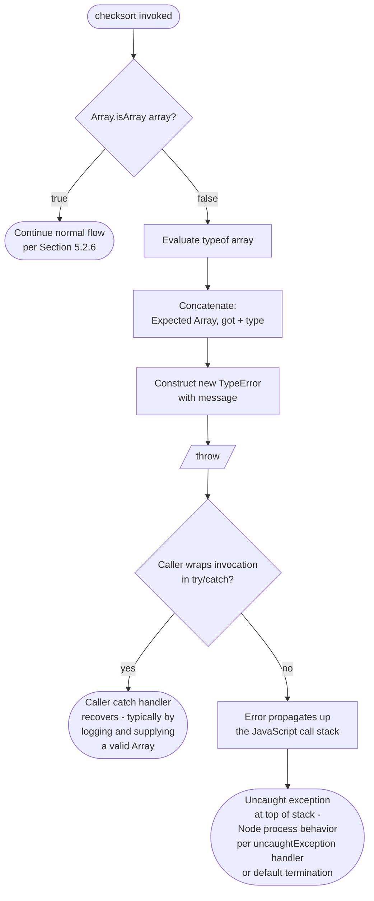

#### 5.4.3.4 Caller-Side Recovery Pattern

Because the library performs no internal recovery, the recommended caller-side pattern is to wrap the call in `try { ... } catch (e) { ... }`, validate `e instanceof TypeError` in the catch block, coerce the input to a true `Array` (e.g., via `Array.from(...)` for iterables, or via explicit type checks), and re-invoke `checksort` with the corrected input. This pattern is not part of `is-sorted` itself but is documented here for completeness.

### 5.4.4 Authentication and Authorization Framework

**Disposition**: Not applicable at the package level.

The library performs no credentialed work and has no notion of identity, principals, sessions, tokens, scopes, or permissions. The authorization disposition for each workflow is summarized below.

| Workflow | Authorization Model |
|----------|---------------------|
| Runtime (`checksort` invocation) | **None** — pure function with no credentialed work |
| Consumer integration (`npm install`) | **None at the package level**; `npm install` may require authentication against private registries, but that is governed by the consumer's npm configuration, not by `is-sorted` |
| Local test execution | **None** — tests run locally with no credentials |
| CI pipeline | GitHub's built-in repository-scoped `GITHUB_TOKEN`; no secrets, no external service authentication, no `npm publish` credentials referenced |

Regulatory compliance dispositions follow from the same minimalism: GDPR/PII handling, FIPS cryptographic compliance, and export control are all **Not applicable** because the function does not retain, log, or transmit any caller data and performs no cryptographic operations. License compliance is governed by the MIT License in the repository's `LICENSE` file (Copyright 2015 Daniel Cousens). Supply-chain attestation (SLSA, SBOM, provenance) is not currently produced by the workflow.

### 5.4.5 Performance Requirements and SLAs

#### 5.4.5.1 Formal SLA Disposition

The repository declares **no formal SLAs, throughput targets, or business KPIs**. The function's performance characteristics are inherent to its algorithm rather than externally negotiated.

#### 5.4.5.2 Inherent Performance Characteristics

| KPI | Value |
|-----|-------|
| Worst-case time complexity | O(n) — single pass over the array |
| Best-case time complexity | O(1) — first-pair inversion triggers immediate early exit |
| Auxiliary space complexity | O(1) — no allocations beyond the loop variable `i` |
| Trivial inputs | Empty arrays and singletons return `true` in zero comparisons |
| Comparator dispatch cost | One function call per adjacent pair; caller-defined cost |
| Synchronous blocking | Function returns in the same event-loop tick as the call |
| Test-suite wall-clock | Bounded by 12 fixture cases + 1 throw test; sub-second total runtime |
| CI wall-clock | Dominated by `npm install` + matrix coordination; functional tests complete in seconds |

#### 5.4.5.3 Performance Considerations for Consumers

Because the function is synchronous, consumers calling `checksort` on very large arrays (millions of elements) inside the main event-loop tick may observe noticeable blocking. The library makes no provision for this case; consumers requiring non-blocking semantics for huge arrays should either chunk the input or wrap the call in a worker thread. The function is reentrant-safe and worker-thread safe, so wrapping is straightforward.

### 5.4.6 Disaster Recovery Procedures

**Disposition**: Not applicable.

The library has no deployable infrastructure, no databases, no persistent state, no in-flight transactions, and no failover surfaces. There is consequently no recovery time objective (RTO), no recovery point objective (RPO), no backup procedure, no failover drill, and no continuity plan. The "disaster recovery" of an in-process library is simply to `require` it again, which Node's module loader will service from `node_modules/` without external coordination.

In the unlikely event that the npm registry serves a corrupted tarball, recovery is the consumer's responsibility (e.g., reinstall, use a registry mirror, or pin to a known-good version). The library has no role in that recovery flow.

---

## 5.5 ARCHITECTURAL ASSUMPTIONS AND DOCUMENTED CONSTRAINTS

The architectural decisions documented above rest on the following assumptions and constraints, restated here for completeness. They are formally enumerated in the Assumptions and Constraints subsection of the Requirements specification.

### 5.5.1 Assumptions

| ID | Assumption |
|----|------------|
| A-001 | Consumers invoke `checksort` from a Node.js environment via CommonJS `require` |
| A-002 | Caller-supplied comparators are pure and return numeric values matching the `Array.prototype.sort` contract |
| A-003 | Inputs are runtime `Array` instances; typed arrays and array-likes are not supported |
| A-004 | The published artifact set consists of `index.js`, `index.d.ts`, `package.json`, `README.md`, and `LICENSE` |
| A-005 | Submodule folders in the repository are out-of-scope for the runtime architecture |

### 5.5.2 Constraints

| ID | Constraint |
|----|------------|
| C-001 | The public signature `checksort(array, comparator?) => boolean` is stable across the `1.x` series |
| C-002 | The package declares zero runtime dependencies |
| C-003 | CI must remain green on Node.js 14.x, 16.x, and 18.x plus the `standard` lint job |
| C-004 | The implementation must remain readable at approximately 14 lines |
| C-005 | No runtime telemetry, logging, configuration files, or environment variables |

---

## 5.6 References

### 5.6.1 Files Examined

- `index.js` — 14-line CommonJS implementation; sole runtime artifact. Defined the entire runtime architecture: validation guard, comparator selection, iteration pattern, return paths.
- `index.d.ts` — 3-line TypeScript ambient declaration with `export = checksort`; defines the typed-consumer integration surface.
- `package.json` — npm manifest. Defines `main` → `index.js`, `types` → `index.d.ts`, `scripts.test`, `scripts.standard`, devDependencies (`tape ^5.0.0`, `standard *`), and the absence of any `dependencies` field.
- `README.md` — User-facing usage examples used in the consumer integration sequence diagram (three call patterns).
- `LICENSE` — MIT License text (Copyright 2015 Daniel Cousens); governs license-compliance disposition.
- `test/index.js` — tape-based test harness. Defined the test component's loading pattern (`require('../')`, `require('./fixtures')`) and the local `comparators` map.
- `test/fixtures.json` — 12 table-driven test cases. Bounded the test-suite scaling discussion.
- `.github/workflows/tests.yml` — GitHub Actions workflow. Defined the CI component: triggers, `unit` matrix job, `standard` lint job, mutable `@main` action refs, `fail-fast: false` semantics.
- `.gitmodules` — Confirmed two out-of-scope submodule entries; supported assumption A-005.

### 5.6.2 Folders Explored

- `/` (repository root) — Top-level inventory of all runtime and quality-gate artifacts.
- `test/` — Test runner and fixtures.
- `.github/` — Contains only `workflows/`.
- `.github/workflows/` — Contains only `tests.yml`.

### 5.6.3 Technical Specification Sections Cross-Referenced

- §1.2 System Overview — Project context, capability inventory, component table, design choices, success criteria, KPI dispositions.
- §1.3 Scope — In-scope/out-of-scope features, integration boundaries.
- §2.3 Feature Relationships — Feature dependencies map, integration points, shared components.
- §2.4 Implementation Considerations — Technical constraints, performance characteristics, scalability, security implications, maintenance requirements.
- §2.6 Assumptions and Constraints — A-001 through A-005 and C-001 through C-005.
- §3.5 Third-Party Services — Active service integrations and services deliberately not used.
- §3.10 Integration Requirements Between Stack Components — `package.json` as the integration hub.
- §3.11 Security Posture of the Technology Stack — Supply chain, dynamic-execution, telemetry posture.
- §4.2 Core Runtime Control Flow (W-01) — Source for the state transition lifecycle and runtime decision points.
- §4.3 Consumer Integration Workflow (W-02) — Source for the consumer integration sequence diagram.
- §4.5 Continuous Integration Pipeline Flow (W-04) — Source for the CI pipeline diagram.
- §4.6 Error Handling Flow — Source for the error-handling flow diagram.
- §4.7 State Transition Model — Source for the invocation state diagram and concurrency guarantees.
- §4.8 Validation, Compliance, and Authorization Checkpoints — Source for the authorization and compliance dispositions.

# 6. SYSTEM COMPONENTS DESIGN

## 6.1 Core Services Architecture

### 6.1.1 Applicability Assessment

**Core Services Architecture is not applicable for this system.**

The `is-sorted` package is a single-function CommonJS micro-utility library distributed through the npm registry. It does not constitute, contain, or interact with a service-oriented architecture in any conventional sense. The entire production surface consists of a 14-line pure function exported from `index.js` via `module.exports`, with zero runtime dependencies and zero network surfaces. There are no microservices, no distributed components, no inter-service boundaries, no remote procedure calls, and no service-discovery infrastructure to document.

This determination is not an oversight or a deferred decision; it is an explicit and foundational architectural choice documented across multiple sections of this specification, most directly in Section 5.1 (High-Level Architecture), Section 5.3 (Technical Decisions), and Section 5.4 (Cross-Cutting Concerns). Per Section 5.3.1, the single most consequential architectural decision is the choice of *library architecture over service architecture*; per Section 5.1.1.1, "There is no service architecture, no client-server split, no event-driven topology, and no layered or hexagonal decomposition."

#### 6.1.1.1 System Classification

The system is classified as an **in-process library** rather than a service. The following table summarizes the foundational properties that disqualify a Core Services Architecture treatment.

| Property | Value | Implication |
|----------|-------|-------------|
| Distribution model | npm package (library), not a service | No deployment, no hosts, no service mesh |
| Runtime boundary | In-process, synchronous function invocation | No remote boundary; no protocol overhead |
| Module system | CommonJS (`module.exports`) | Loaded by Node's resolver from `node_modules/` |
| Runtime dependencies | Zero | No runtime composition with third-party services |
| Public surface | Single function `checksort(array, comparator?) => boolean` | No endpoints, no routes, no message handlers |

#### 6.1.1.2 Rationale for Non-Applicability

The architectural style is described in Section 5.1.1.1 as in-process library architecture in which "the function executes synchronously in the caller's JavaScript runtime; there is no remote boundary, no marshalling, and no protocol overhead." Because there is no remote boundary, no persisted state, no asynchronous decoupling, and no resource pool to coordinate, the concepts that compose a Core Services Architecture — service boundaries, inter-service communication, discovery, load balancing, circuit breakers, auto-scaling, failover — have no referent in this system. They are not absent because they have been deferred; they are absent because the system's problem domain (a synchronous O(n) array scan) does not justify them. ADR-001 (single-file CommonJS implementation), ADR-002 (zero runtime dependencies), and ADR-003 (synchronous, blocking execution), enumerated in Section 5.3.5, codify this position.

#### 6.1.1.3 Conceptual Topology

To make the topology unambiguous, the following diagram depicts the entirety of the system's runtime interaction model. There is one runtime "edge" — the synchronous `require` from a consumer process to the in-process library — and no remote or distributed counterpart.

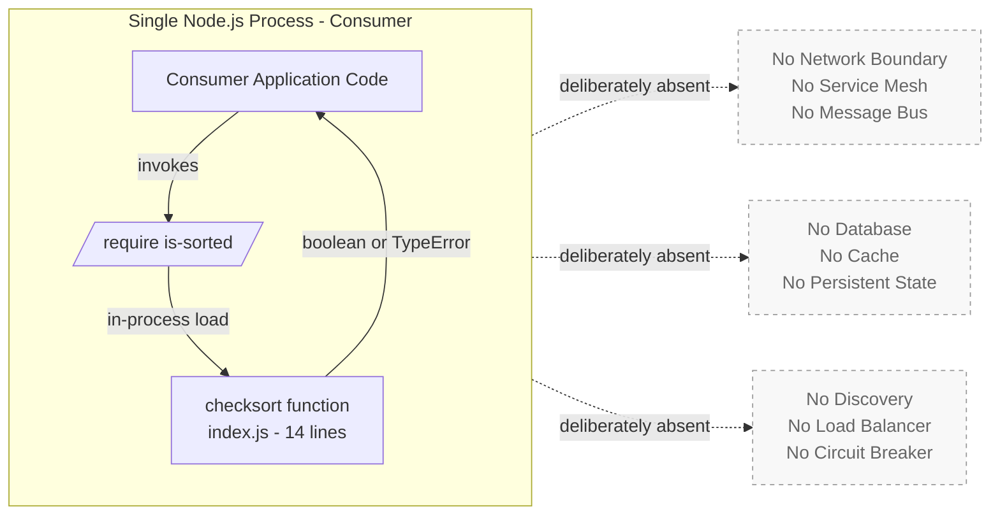

---

### 6.1.2 Service Components — Non-Applicability Analysis

This subsection systematically addresses each Service Components topic enumerated in the section prompt and documents the specific architectural fact that renders the topic non-applicable. The structure preserves the prompt's organization so that downstream readers can confirm each concern has been considered and explicitly dispositioned.

#### 6.1.2.1 Service Boundaries and Responsibilities

There are no service boundaries because the system has no services. Per Section 5.1.1.3, "The system has a single conceptual boundary: the npm package itself," and only three major interfaces exist — all of which are *file-level entry points rather than network protocols*. The interfaces are summarized below.

| Interface | Direction | Defined By |
|-----------|-----------|------------|
| Runtime entry | Consumer process → library function | `package.json` `main` field → `index.js` |
| Type-checking entry | TypeScript compiler → declarations | `package.json` `types` field → `index.d.ts` |
| CI workflow entry | GitHub Actions → repository scripts | `.github/workflows/tests.yml` |

The single responsibility of the runtime artifact is to synchronously determine whether an array is sorted under a comparator. This is a unit of *code*, not a unit of *service*; it does not own a database, expose an endpoint, host a process, or coordinate with peer components.

#### 6.1.2.2 Inter-Service Communication Patterns

No inter-service communication patterns exist. Per Section 5.3.2, "Only one communication pattern exists: synchronous in-process function invocation via CommonJS `require`." Every distributed communication pattern is explicitly not used, with the rationales reproduced from Section 5.3.2 below.

| Pattern | Status | Rationale |
|---------|--------|-----------|
| Synchronous function call | Used (sole) | Sole runtime invocation mechanism |
| HTTP / REST | Not used | No network boundary exists |
| RPC / gRPC | Not used | No service boundary exists |
| Message queue (Kafka, RabbitMQ, SQS) | Not used | No asynchronous decoupling required |

| Pattern | Status | Rationale |
|---------|--------|-----------|
| Event bus / pub-sub | Not used | No event-driven semantics required |
| WebSocket / SSE | Not used | No streaming or push semantics required |
| IPC / named pipes | Not used | No inter-process coordination required |
| GraphQL | Not used | No query/projection surface exists |

The runtime "protocol" is the Node.js CommonJS module-resolution algorithm, which loads `index.js` from `node_modules/is-sorted/` on first `require`. After this load, all interactions are JavaScript function calls within the same V8 heap.

#### 6.1.2.3 Service Discovery Mechanisms

Service discovery is non-applicable. Discovery presupposes a population of network-addressable services that must be located dynamically at runtime; this system contains no such population. The only "discovery" mechanism that exists is Node's static module-resolution algorithm, which locates `index.js` via the `main` field of the package's `package.json` at the consumer's `require('is-sorted')` call site. This resolution is deterministic, single-host, and occurs once per process lifetime. There is no service registry, no DNS-based discovery, no Consul/etcd/ZooKeeper integration, and no environment-variable-driven endpoint configuration — constraint C-005, recorded in Section 5.5, prohibits environment variables at the package level.

#### 6.1.2.4 Load Balancing Strategy

Load balancing is non-applicable. Load balancing presupposes multiple instances of a service across which traffic must be distributed; this system has no instances and no traffic in the network sense. Each consumer process loads its own private copy of the function into its own V8 heap; "parallelism" across consumers is achieved by the operating system scheduling those independent processes, not by any internal balancing logic. Per Section 2.4.3, the function is "stateless and idempotent; freely usable in worker threads or child processes" — but this is a property of the algorithm, not a load-balancing strategy.

#### 6.1.2.5 Circuit Breaker Patterns

Circuit breakers are non-applicable. Circuit breakers protect calling code from cascading failures originating in downstream services. Because `checksort` makes no calls to downstream services — it performs an O(n) array scan against an in-memory array — there is no downstream failure to interrupt. The function's only failure mode is a synchronously-thrown `TypeError` on invalid input, documented in Section 5.4.3.1; this is a deterministic input-validation failure, not a transient infrastructure fault. No backoff, no half-open state, and no failure-rate threshold is meaningful here.

#### 6.1.2.6 Retry and Fallback Mechanisms

Retry and fallback mechanisms are non-applicable inside the library. Per Section 5.4.3.2 (Error Handling Disposition):

| Mechanism | Status |
|-----------|--------|
| Retry | None — the function is synchronous and single-shot |
| Fallback | None beyond the synchronous default-comparator selection |
| Error notification | None — the error is thrown to the caller |
| Internal recovery procedure | None — recovery is the caller's responsibility |

The single "fallback" present in the code is the `comparator = comparator || defaultComparator` short-circuit, which selects the built-in numeric subtraction comparator when the caller does not supply one. This is parameter defaulting, not a resilience pattern; it executes once per invocation and is not triggered by a failure condition. Caller-side recovery (wrapping the invocation in `try/catch` and coercing the input to a true `Array`) is documented as the recommended pattern in Section 5.4.3.4 but lives outside the library's boundary.

#### 6.1.2.7 Service Components Summary

The following diagram visualizes the so-called "service interaction" of this system. It is intentionally minimal to honestly reflect the absent service architecture: the only interaction is a synchronous function call within a single process, with all distributed-system constructs marked explicitly as absent.

```mermaid
flowchart TB
    subgraph Process[Consumer Node.js Process]
        direction LR
        Caller[Consumer call site<br/>e.g., business logic]
        Func[checksort<br/>index.js]
        Caller -->|sync call: array, comparator?| Func
        Func -->|return: boolean| Caller
        Func -->|throw: TypeError| Caller
    end

    subgraph Absent[Patterns Deliberately Absent]
        direction TB
        A1[Service Discovery]
        A2[Load Balancer]
        A3[Circuit Breaker]
        A4[Retry Policy]
        A5[Message Queue]
        A6[RPC / HTTP Endpoint]
    end

    Process -. not used .-> Absent

    classDef present fill:#e6f3ff,stroke:#2a6db0,color:#1a3a5c
    classDef absent fill:#f8f8f8,stroke:#999,stroke-dasharray: 4 4,color:#666
    class Caller,Func present
    class A1,A2,A3,A4,A5,A6 absent
```

---

### 6.1.3 Scalability Design — Non-Applicability Analysis

This subsection addresses the Scalability Design topics enumerated in the section prompt. As established in Section 2.4.3 and Section 5.4.5, the only meaningful notion of "scalability" in this system is *algorithmic scalability with respect to input size*. There is no infrastructure to scale because there is no infrastructure; consequently, horizontal/vertical scaling, auto-scaling triggers, and capacity planning have no operational referent.

#### 6.1.3.1 Horizontal and Vertical Scaling Approach

Infrastructure-level horizontal and vertical scaling are non-applicable. The library is not deployed; it is *installed* into each consumer's `node_modules/` directory via `npm install`. Scaling decisions belong entirely to the consumer's application — `is-sorted` neither participates in nor constrains them. Per Section 2.4.3, the relevant scaling considerations are algorithmic and concurrency-safety properties rather than infrastructure properties.

| Concern | Disposition |
|---------|-------------|
| Input size scaling | Linear in `array.length`; no inherent ceiling beyond JavaScript engine array limits |
| Memory footprint | O(1) — independent of input size; no garbage-collection pressure introduced |
| Concurrency | Pure function with no shared state; safe under any reentrant invocation pattern |
| Process replication | Stateless and idempotent; freely usable in worker threads or child processes |

The function being stateless and reentrant-safe means that when a consumer scales its own application horizontally (adding more Node.js processes or worker threads), each replica receives an independent copy of the function with no coordination requirement — but this is a consequence of purity, not a scaling design contributed by `is-sorted`.

#### 6.1.3.2 Auto-Scaling Triggers and Rules

Auto-scaling is non-applicable. There is no host, no container, no Kubernetes pod, no Lambda concurrency reservation, no autoscaling group, and no metric source against which a trigger could be defined. Per Section 3.8 (Default Technology Stack Applicability Analysis), 16 of 17 default enterprise stack items — including cloud platform, containerization, IaC, orchestration, and message broker — are explicitly "Not applicable" to this project. The single applicable item is GitHub Actions for CI, which does not perform runtime auto-scaling.

#### 6.1.3.3 Resource Allocation Strategy

Resource allocation is non-applicable at the package level. The library allocates only the loop counter variable `i` per invocation, which is constant in space (O(1) per Section 5.4.5.2) and reclaimed by the JavaScript engine's garbage collector when the call returns. There is no thread pool to size, no connection pool to provision, no memory budget to enforce, and no CPU quota to negotiate. Resource governance is entirely the responsibility of the host Node.js process — `is-sorted` consumes whatever the caller's stack frame and array reference already cost.

#### 6.1.3.4 Performance Optimization Techniques

Performance is determined by the algorithm itself. The optimizations present in the code are *inherent* to its construction rather than configurable knobs:

| KPI | Value |
|-----|-------|
| Worst-case time complexity | O(n) — single pass over the array |
| Best-case time complexity | O(1) — first-pair inversion triggers immediate early exit |
| Auxiliary space complexity | O(1) — no allocations beyond the loop variable `i` |
| Synchronous blocking | Function returns in the same event-loop tick as the call |

The deliberate technique choices documented in Section 5.3.1 reinforce this disposition: index-based iteration rather than `for...of` to avoid iterator-protocol overhead, fail-fast on disorder to enable early exit, comparator-fallback via `||` short-circuit to avoid a `typeof` test, and zero allocation to avoid GC pressure. There is no cache to warm, no JIT hint to apply, no batching window to tune, and no pool to pre-size — per Section 5.3.3, the system adopts the *deliberate absence of caching* because the per-call cost is already O(n) with O(1) overhead per element.

For consumers operating on very large arrays, Section 5.4.5.3 notes that the function "is reentrant-safe and worker-thread safe, so wrapping is straightforward" — chunking the input or offloading to a worker thread is a consumer-side performance optimization, not a library design.

#### 6.1.3.5 Capacity Planning Guidelines

Capacity planning is non-applicable at the package level. The repository declares no formal SLAs, throughput targets, or business KPIs (per Section 5.4.5.1). Because there is no host to provision, no peak-load forecast to estimate, and no traffic envelope to model, the customary capacity-planning artifacts (headroom budgets, P50/P99 latency targets, request-per-second ceilings, autoscaling thresholds) have no referent in this system.

The only "capacity" considerations that exist are algorithmic and apply to the consumer's own provisioning. Consumers operating on arrays larger than what the JavaScript engine permits (engine-specific array length limits) must chunk the input themselves; consumers requiring strict latency bounds on multi-million-element arrays should benchmark within their own host process. The library imposes no capacity ceiling beyond what its O(n) time and O(1) space complexity already imply.

#### 6.1.3.6 Scalability Architecture Diagram

The following diagram visualizes the only dimension along which this system scales — input size, within a single process — and contrasts it with the infrastructure-scaling axes that are deliberately absent.

```mermaid
flowchart TB
    subgraph InScope[In Scope: Algorithmic Scaling]
        direction TB
        Input[Input array<br/>length = n]
        Scan[Single-pass scan<br/>O n time, O 1 space]
        Result[Boolean result<br/>or TypeError]
        Input --> Scan --> Result
        Note1[Linear in n<br/>No allocation beyond loop counter<br/>Early exit on first inversion]
        Scan -.- Note1
    end

    subgraph OutOfScope[Out of Scope: Infrastructure Scaling]
        direction TB
        H[Horizontal pod scaling]
        V[Vertical instance sizing]
        AS[Auto-scaling triggers]
        CP[Capacity planning]
        RA[Resource allocation policy]
    end

    subgraph ConsumerOwned[Consumer-Owned Concerns]
        direction TB
        CC1[Worker thread offload<br/>for huge arrays]
        CC2[Chunking large inputs]
        CC3[Backpressure handling]
    end

    InScope -. not provided by is-sorted .-> OutOfScope
    InScope -. caller may implement .-> ConsumerOwned

    classDef inscope fill:#e6f3ff,stroke:#2a6db0,color:#1a3a5c
    classDef outofscope fill:#f8f8f8,stroke:#999,stroke-dasharray: 4 4,color:#666
    classDef consumer fill:#fff7e6,stroke:#b08a2a,color:#5c4a1a
    class Input,Scan,Result,Note1 inscope
    class H,V,AS,CP,RA outofscope
    class CC1,CC2,CC3 consumer
```

---

### 6.1.4 Resilience Patterns — Non-Applicability Analysis

This subsection addresses the Resilience Patterns topics enumerated in the section prompt. The package-level disposition for every distributed resilience pattern is *not applicable*; the rationale follows directly from the absence of state, infrastructure, and remote dependencies established in Sections 5.3.3, 5.4.3, and 5.4.6.

#### 6.1.4.1 Fault Tolerance Mechanisms

Fault tolerance mechanisms in the distributed-systems sense — bulkheads, hedged requests, fallback caches, leader election, quorum reads — are non-applicable. The library has a single, deterministic failure mode: a synchronously-thrown `TypeError` from `checksort` when the first argument fails `Array.isArray`. There is no async failure path, no I/O failure path, no resource-exhaustion path, and no third-party-service failure path (per Section 4.6.1 and Section 5.4.3.1).

| Error Surface | Trigger | Resolution |
|---------------|---------|------------|
| `TypeError` from `checksort` | First argument fails `Array.isArray` | Caller-side `try/catch` and input correction |

Recovery is exclusively caller-side: per Section 5.4.3.4, the recommended pattern is to wrap the invocation in `try/catch`, validate `e instanceof TypeError`, coerce the input to a true `Array` (e.g., via `Array.from(...)`), and re-invoke. This pattern lives in the consumer's code; it is not a library feature.

#### 6.1.4.2 Disaster Recovery Procedures

Disaster recovery is non-applicable. The disposition is quoted directly from Section 5.4.6:

- The library has no deployable infrastructure, no databases, no persistent state, no in-flight transactions, and no failover surfaces.
- There is consequently no recovery time objective (RTO), no recovery point objective (RPO), no backup procedure, no failover drill, and no continuity plan.
- The "disaster recovery" of an in-process library is simply to `require` it again, which Node's module loader will service from `node_modules/` without external coordination.

In the unlikely event that the npm registry serves a corrupted tarball, recovery is the consumer's responsibility — for example, reinstalling, switching to a registry mirror, or pinning to a known-good version. The library has no role in that recovery flow.

#### 6.1.4.3 Data Redundancy Approach

Data redundancy is non-applicable because there is no data to redundantly store. Per Section 5.3.3, the data-storage strategy is the *deliberate absence of any storage*. The function transforms no data, persists no data, replicates no data, and transmits no data; the input array reference is read but never mutated, and the only output is a boolean return value or a thrown exception (Section 5.1.3.1). The following table reproduces the storage disposition from Section 5.3.3.

| Storage Category | Decision |
|-------------------|----------|
| Relational database | Not used — no domain state to persist |
| Document / NoSQL database | Not used — no domain state to persist |
| Object storage (S3, GCS, Blob) | Not used — no binary artifacts to retain at runtime |
| Distributed cache (Redis, Memcached) | Not used |

| Storage Category | Decision |
|-------------------|----------|
| In-memory cache (LRU, etc.) | Not used — function is recomputed on every call |
| Search index | Not used |
| Message queue / streaming log | Not used |
| Local filesystem | Read-only at module-load time; no runtime writes |

#### 6.1.4.4 Failover Configurations

Failover configurations are non-applicable. Failover presupposes a primary/secondary topology with health-checking and traffic redirection; the library has neither a primary nor a secondary nor any health-checkable surface. Once `index.js` is loaded into the consumer process, it remains resident in the V8 module cache for the lifetime of that process. There is no replica to promote, no quorum to assemble, and no health probe to fail. The single conceptual "failover" — if such a term applies — is Node's module loader re-resolving `is-sorted` from `node_modules/` if it is invalidated, which is a normal module-loading event rather than a resilience pattern.

#### 6.1.4.5 Service Degradation Policies

Service degradation policies are non-applicable. Graceful degradation presupposes a service with multiple feature tiers (e.g., serve stale cache on backend failure, disable non-essential features on load spike). The library exposes one function with one behavior; there is no feature to disable, no quality of service to downgrade, and no SLA tier to drop into. The function either completes its O(n) scan and returns a boolean, or it throws `TypeError` on invalid input — these are the only two terminal states (per Section 4.7.1, which records that "there is no state machine between invocations — every call is a fresh, independent execution").

#### 6.1.4.6 Resilience Pattern Implementation Diagram

The following diagram visualizes the actual resilience surface of this system: a single synchronous control flow with one deterministic failure branch and caller-side recovery. All conventional resilience patterns (retry, fallback, circuit breaker, bulkhead, replication, failover) are explicitly absent.

```mermaid
flowchart TD
    Entry([checksort invoked]) --> Validate{Array.isArray array?}
    Validate -->|true| Normal[Iterate adjacent pairs<br/>using comparator]
    Validate -->|false| BuildErr[Construct TypeError<br/>with typeof message]
    BuildErr --> ThrowOp[/throw TypeError/]
    Normal --> ResultOK([Return boolean])
    ThrowOp --> Boundary{Caller wraps<br/>in try/catch?}
    Boundary -->|yes| Recover[Caller coerces input<br/>and may re-invoke]
    Boundary -->|no| Propagate[Error propagates up<br/>JavaScript call stack]
    Propagate --> Terminal([Default Node process behavior<br/>per uncaughtException handler])

    subgraph Absent[Resilience Patterns Deliberately Absent]
        direction TB
        R1[Retry with backoff]
        R2[Circuit breaker]
        R3[Bulkhead isolation]
        R4[Fallback cache]
        R5[Failover to replica]
        R6[Hedged requests]
        R7[Degraded-mode response]
    end

    Entry -. not used .-> Absent

    classDef normal fill:#e6f3ff,stroke:#2a6db0,color:#1a3a5c
    classDef errpath fill:#ffe6e6,stroke:#b02a2a,color:#5c1a1a
    classDef recover fill:#e6ffe6,stroke:#2ab02a,color:#1a5c1a
    classDef absent fill:#f8f8f8,stroke:#999,stroke-dasharray: 4 4,color:#666
    class Normal,ResultOK normal
    class BuildErr,ThrowOp,Propagate,Terminal errpath
    class Recover recover
    class R1,R2,R3,R4,R5,R6,R7 absent
```

---

### 6.1.5 Consolidated Non-Applicability Matrix

The following matrix consolidates every Core Services Architecture topic from the section prompt against the corresponding disposition documented in this specification. Each row provides a single point of reference for downstream readers and audit reviewers.

| Topic | Disposition | Authoritative Reference |
|-------|-------------|-------------------------|
| Service boundaries and responsibilities | Not applicable — single in-process function | Section 5.1.1.3 |
| Inter-service communication patterns | Not applicable — synchronous `require` only | Section 5.3.2 |
| Service discovery mechanisms | Not applicable — Node module resolution only | Section 5.1.1.3 |
| Load balancing strategy | Not applicable — no replicas to balance | Section 2.4.3 |

| Topic | Disposition | Authoritative Reference |
|-------|-------------|-------------------------|
| Circuit breaker patterns | Not applicable — no downstream service calls | Section 5.4.3.2 |
| Retry and fallback mechanisms | Not applicable — synchronous single-shot | Section 5.4.3.2 |
| Horizontal/vertical scaling | Not applicable — no infrastructure to scale | Section 2.4.3 |
| Auto-scaling triggers and rules | Not applicable — no host or container | Section 3.8 |

| Topic | Disposition | Authoritative Reference |
|-------|-------------|-------------------------|
| Resource allocation strategy | Not applicable — O(1) auxiliary space only | Section 5.4.5.2 |
| Performance optimization techniques | Inherent to algorithm (O(n)/O(1)) | Section 5.4.5.2 |
| Capacity planning guidelines | Not applicable — no SLAs declared | Section 5.4.5.1 |
| Fault tolerance mechanisms | Caller-side `try/catch` only | Section 5.4.3 |

| Topic | Disposition | Authoritative Reference |
|-------|-------------|-------------------------|
| Disaster recovery procedures | Not applicable — no infrastructure | Section 5.4.6 |
| Data redundancy approach | Not applicable — no data persisted | Section 5.3.3 |
| Failover configurations | Not applicable — no replicas exist | Section 5.4.6 |
| Service degradation policies | Not applicable — single behavior, single function | Section 4.7.1 |

---

### 6.1.6 Architectural Constraints Reinforcing Non-Applicability

The non-applicability of Core Services Architecture is reinforced by the constraints recorded in Section 5.5. These constraints structurally prevent the introduction of service-oriented patterns without an intentional, breaking departure from the current architecture.

| Constraint ID | Constraint | Effect on Services Architecture |
|---------------|------------|--------------------------------|
| C-001 | `checksort(array, comparator?) => boolean` is stable across `1.x` | Public surface cannot be expanded into a service contract |
| C-002 | Zero runtime dependencies | No service client libraries, brokers, or transport modules can be added |
| C-003 | CI green on Node.js 14.x, 16.x, 18.x plus `standard` lint | Reinforces single-runtime, in-process execution model |
| C-004 | Implementation must remain readable at approximately 14 lines | Precludes embedding distributed-system primitives |
| C-005 | No runtime telemetry, logging, configuration files, or environment variables | Precludes service discovery, dynamic endpoints, and observability hooks |

Taken together, these constraints confirm that the architectural posture is not merely "no services today" but "no services by deliberate, codified design."

---

### 6.1.7 Conclusion

The Core Services Architecture concerns enumerated in the section prompt — service boundaries, inter-service communication, discovery, load balancing, circuit breakers, retry/fallback, horizontal/vertical scaling, auto-scaling, resource allocation, capacity planning, fault tolerance, disaster recovery, data redundancy, failover, and service degradation — have no operational referent in the `is-sorted` system. The package is a single-function, zero-dependency, in-process CommonJS micro-utility. Its architectural design is in-process library architecture, not service architecture; its scaling model is algorithmic (O(n) input size) rather than infrastructural; its resilience model is caller-side `try/catch` rather than distributed-systems patterns; and its data model is the deliberate absence of any state.

Readers seeking the architectural documentation that *does* apply to this system are directed to Section 5.1 (High-Level Architecture), Section 5.2 (Component Details), Section 5.3 (Technical Decisions), Section 5.4 (Cross-Cutting Concerns), and Section 5.5 (Architectural Assumptions and Documented Constraints). Subsequent subsections of Chapter 6 will, where applicable, address remaining design topics; where they are similarly inapplicable, the same disposition-and-rationale pattern used in this section will be followed.

---

### 6.1.8 References

**Files Examined**
- `index.js` — Confirmed the 14-line `checksort` pure function with no I/O, no async, and no service-oriented patterns
- `index.d.ts` — Confirmed 3-line hand-maintained TypeScript ambient declaration (`export = checksort`)
- `package.json` — Confirmed zero runtime dependencies; only `main`, `types`, `scripts`, and `devDependencies` (`tape ^5.0.0`, `standard *`)
- `test/index.js` — Confirmed tape harness loading the module via `require('../')` with no service-test patterns
- `test/fixtures.json` — Confirmed 12 table-driven cases for the unit suite
- `.github/workflows/tests.yml` — Confirmed CI definitions only; no service deployment configuration
- `LICENSE` — MIT License, Copyright 2015 Daniel Cousens
- `README.md` — Confirmed user-facing usage examples consistent with the in-process API

**Folders Examined**
- Repository root — Identified all top-level artifacts and confirmed the absence of service infrastructure folders (no `src/services/`, no `infra/`, no `deploy/`)
- `test/` — Confirmed only `fixtures.json` and `index.js`; no integration- or service-level tests
- `.github/` — Confirmed only `workflows/` subfolder for CI; no deployment manifests or service descriptors

**Technical Specification Sections Cross-Referenced**
- Section 1.1 Executive Summary — Compact zero-dependency Node.js utility module; 14 LOC runtime
- Section 1.2 System Overview — Micro-utility tier; sole capability is sorted-order detection
- Section 1.3 Scope — Explicit out-of-scope items: network/RPC interfaces, persistence layer, auth/authorization
- Section 2.4 Implementation Considerations — Algorithmic scalability table; concurrency-safety properties
- Section 3.8 Default Technology Stack Applicability Analysis — 16 of 17 default stack items "Not applicable"
- Section 4.2 Core Runtime Control Flow (W-01) — Sole synchronous control flow within a single function
- Section 4.6 Error Handling Flow — Single error surface (`TypeError`); no retry/fallback/notification
- Section 4.7 State Transition Model — Stateless function; no state between invocations
- Section 5.1 High-Level Architecture — "Single-function CommonJS micro-utility library"; "no service architecture"
- Section 5.2 Component Details — Each component (runtime, `.d.ts`, test suite, CI); none are services
- Section 5.3 Technical Decisions — "Library architecture over service architecture" as the most consequential decision; explicit table of unused communication patterns; ADR-001 through ADR-006
- Section 5.4 Cross-Cutting Concerns — All distributed concerns marked "Not applicable", with Section 5.4.6 (Disaster Recovery) and Section 5.4.5 (SLAs) most directly supporting non-applicability
- Section 5.5 Architectural Assumptions and Documented Constraints — Constraints C-001 through C-005 reinforcing minimalism and precluding service-oriented additions

## 6.2 Database Design

### 6.2.1 Applicability Determination

**Database Design is not applicable to this system.**

The `is-sorted` package is a single-function, in-process, stateless CommonJS micro-utility library distributed via npm. It performs an O(n) synchronous scan of a caller-supplied `Array` reference and returns a boolean. It exposes no remote boundary, allocates no persistent state, opens no connections, and integrates with no storage technology of any kind. The deliberate absence of a persistence layer is treated by this specification as a first-class architectural fact — not an omission — and is documented as such across multiple sections (§3.6, §5.1, §5.2, §5.3, §5.4, §6.1).

This section accordingly does not document a schema, indexes, partitioning, replication, migrations, retention policies, or query-optimization strategy. Instead, it provides a structured non-applicability disposition for every sub-area requested by the prompt, cross-referencing the authoritative sections that establish the underlying facts, and concludes with the disposition of the sole JSON artifact in the repository (`test/fixtures.json`), which the specification has already determined "does not function as a database" (§3.6.2).

#### 6.2.1.1 Summary Statement

| Question | Answer | Authoritative Source |
|----------|--------|----------------------|
| Does the system have a primary database? | No | §3.6.1 Storage Disposition |
| Does the system have a cache layer? | No | §3.6.1, §5.3.3 |
| Does the system perform any I/O at runtime? | No | §5.2.1.4 |
| Are there persistence dependencies declared? | No | §3.4, ADR-002 (§5.3.5.2) |
| Is any data retained between invocations? | No | §5.3.3, §6.1.4.3 |

#### 6.2.1.2 Why a Database Was Never Adopted

The runtime is a 14-line pure function exported from `index.js`. Its only inputs are an `Array` reference and an optional comparator; its only output is a boolean return value or a thrown `TypeError`. The function transforms no data, persists no data, replicates no data, and transmits no data — as restated verbatim in §6.1.4.3. Introducing a database would contradict the package's identity as a zero-dependency, supply-chain-minimized micro-utility (ADR-002).

---

### 6.2.2 Justification for Non-Applicability

#### 6.2.2.1 System Characteristics That Preclude a Database

The following observable, file-level facts collectively rule out a database design:

| Observation | Source Artifact | Implication |
|-------------|-----------------|-------------|
| No `dependencies` field declared | `package.json` | No DB driver/ORM can be loaded |
| Zero `require()` calls in runtime | `index.js` | No I/O modules are imported |
| Pure synchronous array iteration | `index.js` | No event-loop yield surface for I/O |
| No `fs`, `net`, `http`, or `child_process` usage | `index.js` | No file/network channels exist |
| No environment variables or config files | Repository root | No connection strings can be supplied |
| Output is `boolean` or `TypeError` | `index.d.ts` | No record/row/document is ever returned |

#### 6.2.2.2 Codified Constraints From §5.5.2

Three documented constraints structurally prevent any future introduction of a database without breaking the package's identity:

| Constraint ID | Constraint | Effect on Database Design |
|---------------|------------|---------------------------|
| C-002 | The package declares zero runtime dependencies | No DB driver, ORM, or persistence client can be added |
| C-004 | The implementation must remain readable at ~14 lines | Precludes embedding any persistence logic |
| C-005 | No runtime telemetry, logging, configuration files, or environment variables | Precludes connection strings, credentials, or DB configuration |

#### 6.2.2.3 Governing Architecture Decision Records

| ADR | Title | Relevance to Database Design |
|-----|-------|------------------------------|
| ADR-001 (§5.3.5.1) | Single-File CommonJS Implementation | Source artifact equals published artifact; no build step into which migrations or schema artifacts could be inserted |
| ADR-002 (§5.3.5.2) | Zero Runtime Dependencies | Explicitly forbids adopting third-party modules, including database clients |
| ADR-003 (§5.3.5.3) | Synchronous, Blocking Execution | No Promise/callback machinery; precludes async DB-driver integration patterns |

#### 6.2.2.4 Cross-Section Confirmations

The non-applicability of a database is restated in eight independent locations within this specification, each from a different analytical perspective:

| Section | Statement |
|---------|-----------|
| §1.2.1 Project Context | "No service endpoints, databases, message buses, or external APIs are involved" |
| §1.3.2 Out-of-Scope | Persistence layer listed as "None" |
| §3.6.1 Storage Disposition | "No database, no cache, and no storage layer of any kind" |
| §3.8 Default Stack Applicability | Default database (MongoDB) marked "Not applicable" |
| §5.1.3.4 Key Data Stores and Caches | All eight storage categories marked "Not used" |
| §5.3.3 Data Storage and Caching Strategy | "The deliberate absence of any storage" |
| §5.4.6 Disaster Recovery | "No databases, no persistent state, no in-flight transactions" |
| §6.1.4.3 Data Redundancy Approach | "Data redundancy is non-applicable because there is no data to redundantly store" |

---

### 6.2.3 Topology of Deliberate Absence

The diagram below visualizes the runtime topology in a form consistent with the diagrams used in §6.1. It depicts the in-process call boundary, the caller-owned in-memory `Array` input, the boolean return value, and the categories of storage that are deliberately absent.

```mermaid
flowchart LR
    subgraph CallerProcess["Caller Node.js Process (single address space)"]
        CallerCode[Consumer Application Code]
        Input[/"In-Memory Array Reference<br/>(caller-owned)"/]
        Func["checksort(array, comparator?)<br/>14-line pure function in index.js"]
        Output[/"Boolean Return Value<br/>or Thrown TypeError"/]

        CallerCode -->|passes reference| Input
        Input -->|synchronous call| Func
        Func -->|returns| Output
        Output -->|consumed by| CallerCode
    end

    subgraph DeliberatelyAbsent["Deliberately Absent (per ADR-002, C-002, C-005)"]
        NoDB[(No Primary Database)]
        NoReplica[(No Replica / Standby)]
        NoCache[(No Cache Layer)]
        NoObject[(No Object Storage)]
        NoQueue[(No Message Queue)]
        NoSearch[(No Search Index)]
        NoFS[(No Runtime Filesystem I/O)]
    end

    Func -.->|no connection| NoDB
    Func -.->|no connection| NoReplica
    Func -.->|no connection| NoCache
    Func -.->|no connection| NoObject
    Func -.->|no connection| NoQueue
    Func -.->|no connection| NoSearch
    Func -.->|no connection| NoFS

    classDef absent fill:#f5f5f5,stroke:#999,stroke-dasharray: 5 5,color:#666
    class NoDB,NoReplica,NoCache,NoObject,NoQueue,NoSearch,NoFS absent
```

The dashed lines indicate the structural impossibility of these connections under C-002, C-004, and C-005. No edge in the diagram crosses a process boundary; the entire execution occurs in the caller's address space.

---

### 6.2.4 Schema Design — Non-Applicable

There is no schema because there are no entities. The function operates on an opaque `Array` reference whose element type is determined entirely by the caller and is never introspected by the library beyond pairwise comparator dispatch.

#### 6.2.4.1 Entity Relationships

| Sub-Area | Disposition |
|----------|-------------|
| Entities | None — the library has no domain model |
| Relationships | None — no entities to relate |
| Primary keys | None — no records exist |
| Foreign keys | None — no tables exist |
| Aggregate roots | None — no domain boundaries exist |

#### 6.2.4.2 Data Models and Structures

The only "data structures" present are the caller's `Array` argument (lifetime owned by the caller, untouched by the function) and three local loop variables on the call stack (`comparator`, `i`, `length`) — explicitly enumerated in §5.2.1.4 as the entirety of writes performed during execution. None of these crosses a persistence boundary.

#### 6.2.4.3 Indexing, Partitioning, Replication, and Backup

| Sub-Area | Disposition | Reason |
|----------|-------------|--------|
| Indexing strategy | Not applicable | No queryable corpus exists |
| Partitioning approach | Not applicable | No dataset exists to partition |
| Replication configuration | Not applicable | No primary store exists from which to replicate |
| Backup architecture | Not applicable | No persistent state exists to back up |
| Constraints (CHECK, UNIQUE, NOT NULL) | Not applicable | No tables exist on which to declare constraints |

#### 6.2.4.4 Replication Architecture Diagram

A conventional primary/replica diagram has no referent for this system. The following diagram documents the absence in the same shape that a replication diagram would otherwise take, to make the non-applicability visually unambiguous.

```mermaid
flowchart TD
    Caller["Caller Process<br/>(synchronous invocation)"]
    Func["checksort()<br/>in-process function"]

    Caller -->|in-memory reference| Func
    Func -->|boolean| Caller

    subgraph WouldExistIfThisWereAService["Tier That Would Exist for a Stateful System"]
        Primary[(Primary DB<br/>NOT PRESENT)]
        ReplicaA[(Replica A<br/>NOT PRESENT)]
        ReplicaB[(Replica B<br/>NOT PRESENT)]
        BackupStore[(Backup Store<br/>NOT PRESENT)]
    end

    classDef absent fill:#f5f5f5,stroke:#999,stroke-dasharray: 5 5,color:#666
    class Primary,ReplicaA,ReplicaB,BackupStore absent
```

---

### 6.2.5 Data Management — Non-Applicable

#### 6.2.5.1 Migration and Versioning

| Sub-Area | Disposition |
|----------|-------------|
| Schema migration procedures | Not applicable — no schema to migrate |
| Migration tooling (e.g., Flyway, Liquibase, Knex, Prisma) | Not declared in `package.json`; precluded by C-002 |
| Schema versioning strategy | Not applicable — the only versioning artifact is the npm `version` field (`1.0.5`) which governs the function signature, not a schema |
| Data versioning | Not applicable — no data is retained between invocations |

#### 6.2.5.2 Archival Policies

There is no archival policy because there is no data to archive. The function's output (`true`, `false`, or a thrown `TypeError`) is returned synchronously to the caller and is the caller's responsibility thereafter. The library retains nothing.

#### 6.2.5.3 Data Storage and Retrieval Mechanisms

The system provides no storage and no retrieval mechanisms. The only "retrieval" performed is the synchronous element access `array[i - 1]` and `array[i]` inside the loop, against a caller-owned in-memory `Array`. This is not retrieval in the database sense — it is array indexing within the caller's address space.

#### 6.2.5.4 Caching Policies

§5.3.3 documents the caching strategy as the "deliberate absence of caching." The rationale is reproduced here for completeness:

| Caching Tier | Decision | Documented Rationale |
|--------------|----------|----------------------|
| In-memory cache (LRU, Map-keyed) | Not used | Per-call cost is already O(n) with O(1) overhead; caching keyed by array reference would risk subtle equality bugs |
| Distributed cache (Redis, Memcached) | Not used | Would require a runtime dependency and network I/O, violating C-002 and the in-process architecture |
| Read-through / write-behind cache | Not used | No backing store exists for which the cache could front |
| Result memoization | Not used | A caller mutating the input array between calls would render any memoization unsound |

---

### 6.2.6 Compliance Considerations — Non-Applicable

#### 6.2.6.1 Data Retention Rules

No data is retained. The function is invoked, executes a bounded synchronous loop, and returns. Loop variables are eligible for garbage collection at the moment the function returns. There is no retention policy because there is nothing to retain.

#### 6.2.6.2 Backup and Fault Tolerance Policies

§5.4.6 explicitly states that the library "has no deployable infrastructure, no databases, no persistent state, no in-flight transactions, and no failover surfaces" and that there is "consequently no recovery time objective (RTO), no recovery point objective (RPO), no backup procedure, no failover drill, and no continuity plan." This section incorporates that determination by reference.

| Compliance Sub-Area | Disposition |
|---------------------|-------------|
| Backup schedule | Not applicable — no persistent store |
| RTO / RPO targets | Not applicable — nothing to recover |
| Point-in-time recovery | Not applicable — no transactional log exists |
| Cross-region failover | Not applicable — no region affinity exists |

#### 6.2.6.3 Privacy Controls

The function processes only the caller-supplied in-memory `Array`. No data leaves the caller's address space. No PII pathway exists because no external sink (log, telemetry stream, network call, file write) is present. Privacy obligations such as encryption-at-rest, tokenization, redaction, or right-to-erasure workflows have no referent in this system.

#### 6.2.6.4 Audit Mechanisms

There is no audit log, no change-data-capture stream, and no event sourcing. Constraint C-005 ("No runtime telemetry, logging, configuration files, or environment variables") makes the introduction of an audit trail structurally incompatible with the package's identity.

#### 6.2.6.5 Access Controls

Access control is governed entirely by the JavaScript module system: the function is exported from `index.js` via `module.exports` and is accessible to any code that has loaded the module via `require('is-sorted')`. There are no roles, permissions, ACLs, row-level-security rules, or grants because there is no resource to protect at the persistence layer.

---

### 6.2.7 Performance Optimization — Non-Applicable

#### 6.2.7.1 Query Optimization Patterns

There is no query language, no query planner, no execution-plan caching, and no index-selection logic because there is no database. The function's "execution plan" is a single fixed `for` loop over the input array with eager short-circuit on the first out-of-order pair.

#### 6.2.7.2 Caching Strategy

See §6.2.5.4. No caching tier exists at any layer.

#### 6.2.7.3 Connection Pooling

There are no connections. Constraint C-002 forbids the runtime dependency (e.g., `pg`, `mysql2`, `mongodb`, `ioredis`) that a connection pool would require; constraint C-005 forbids the configuration surface (e.g., connection strings, pool-size environment variables) that a pool would consume.

#### 6.2.7.4 Read/Write Splitting

Not applicable. There is no read path and no write path against a persistence boundary — only an in-process function call and its return value.

#### 6.2.7.5 Batch Processing Approach

The function processes one array per invocation. There is no batch ingestion pipeline, no scheduled job, no message-queue consumer, and no bulk-loader because there is no destination store. Callers wishing to process many arrays simply invoke `checksort` in a loop within their own process.

---

### 6.2.8 Required Diagrams — Disposition

The section prompt requests three diagram categories. Because none has a referent in this system, the following dispositions are documented in lieu of conventional diagrams. The "deliberate absence" diagrams in §6.2.3 and §6.2.4.4 serve as the visual analogues.

| Requested Diagram | Disposition |
|-------------------|-------------|
| Database schema (ERD) | No entities exist; see §6.2.3 topology diagram for the deliberate-absence visualization |
| Data flow diagram | The only data flow is `caller → Array reference → checksort → boolean → caller`; see §6.2.3 |
| Replication architecture | No primary store exists; see §6.2.4.4 for the deliberate-absence visualization |

#### 6.2.8.1 Data Flow Diagram (In-Process, Non-Persistent)

For completeness, the data flow for a single `checksort` invocation is depicted below. No edge in this diagram represents a persistence boundary.

```mermaid
flowchart LR
    A[Caller constructs<br/>Array literal or reference] --> B{Array.isArray<br/>guard}
    B -->|false| E[Throw TypeError]
    B -->|true| C[Resolve comparator<br/>or use a-b default]
    C --> D[Index-based loop<br/>compare i-1 and i]
    D -->|out-of-order pair found| F[Return false]
    D -->|loop completes| G[Return true]

    E -.->|exception propagates<br/>to caller frame| H((Caller))
    F -.->|return value| H
    G -.->|return value| H

    classDef inProcess fill:#e8f4f8,stroke:#0288d1,color:#01579b
    class A,B,C,D,E,F,G,H inProcess
```

All nodes execute within a single Node.js process and a single synchronous call stack. There is no persistence step at any point in the flow.

---

### 6.2.9 Disposition of the Sole JSON Artifact: `test/fixtures.json`

The repository contains exactly one JSON file. §3.6.2 has already determined that this file "does not function as a database." This subsection records that disposition formally so that an auditor reviewing the database-design section finds explicit reasoning for why the file was considered and rejected as a persistence artifact.

#### 6.2.9.1 Artifact Profile

| Attribute | Value |
|-----------|-------|
| Path | `test/fixtures.json` |
| Format | JSON array of test-case objects |
| Cardinality | 12 hard-coded test cases |
| Shape | `{ array, expected, comparator? }` per case |
| Loading mechanism | `require('./fixtures')` from `test/index.js` |
| Loading lifecycle | Test-time only (CI `npm test` job) |
| Mutation | Read-only; never written by any code path |
| Inclusion in published artifact | No — not declared via `package.json` `main` or `types` |

#### 6.2.9.2 Why It Is Not a Database

| Database Characteristic | Status for `test/fixtures.json` |
|-------------------------|--------------------------------|
| Queryable by a query language | No — consumed as a JavaScript array via `require` |
| Indexed for lookup | No — iterated linearly by the test harness |
| Mutated by the runtime | No — runtime code (`index.js`) never reads it |
| Has a schema enforced at write time | No — content is hand-authored |
| Has connections, sessions, or transactions | No — synchronous module load only |
| Persists state across invocations of the consumer | No — the runtime never observes it |

The artifact is correctly classified as static, embedded, table-driven test input — equivalent in role to a fixtures array hard-coded into a test file, materialized as JSON purely for readability.

---

### 6.2.10 Section Conclusion

Database design is not applicable to the `is-sorted` system because the system has no persistence layer, no remote boundary, no runtime dependencies, no configuration surface, and no state that survives the return of its sole exported function. The absence is not incidental — it is enforced by constraints C-002, C-004, and C-005 and codified by ADR-001, ADR-002, and ADR-003. Every prompt-mandated sub-area (schema design, data management, compliance, performance optimization) has been addressed with an explicit non-applicability disposition cross-referenced to the authoritative sections of this specification. The sole JSON artifact in the repository, `test/fixtures.json`, has been profiled and shown to be static test input rather than a database.

For systems that integrate `is-sorted` and do require database design, those concerns belong to the consuming application's specification and are out of scope here per §1.3.

---

### 6.2.11 References

#### 6.2.11.1 Source Files Examined

- `index.js` — Confirmed 14-line synchronous pure function with zero `require()` calls and no I/O surface
- `index.d.ts` — Confirmed type declarations expose only the synchronous boolean-returning function signature
- `package.json` — Confirmed absent `dependencies` field; only `tape` and `standard` declared as `devDependencies`; no database/ORM/storage packages
- `README.md` — Confirmed user-facing description as a "small module to check if an Array is sorted"; usage examples show only synchronous boolean returns
- `test/fixtures.json` — Confirmed 12 static `{ array, expected, comparator? }` test cases consumed only at test time
- `test/index.js` — Confirmed `tape` harness loads fixtures via `require('./fixtures')` at test time only

#### 6.2.11.2 Repository Folders Inspected

- Repository root — Confirmed absence of `db/`, `migrations/`, `models/`, `schema/`, `prisma/`, `sequelize/`, or any equivalent persistence folder
- `test/` — Confirmed contents limited to `fixtures.json` and `index.js`; no integration tests against any database

#### 6.2.11.3 Technical Specification Sections Cross-Referenced

- §1.2 System Overview — Project context confirming no databases involved
- §1.3 Scope — Persistence layer listed as "None" in out-of-scope items
- §3.4 Open Source Dependencies — Confirmed zero runtime dependencies
- §3.6 Databases & Storage — Direct, explicit statement of no database/cache/storage layer; §3.6.2 disposition of `test/fixtures.json`
- §3.8 Default Technology Stack Applicability Analysis — Default database choice marked Not Applicable
- §5.1 High-Level Architecture — In-process library architecture with no remote boundary; §5.1.3.4 enumerates all data-store categories as "Not used"
- §5.2 Component Details — §5.2.1.4 confirms `checksort` runtime data persistence requirements as "None"
- §5.3 Technical Decisions — §5.3.3 "deliberate absence of any storage"; ADR-002 (zero runtime dependencies); ADR-003 (synchronous execution)
- §5.4 Cross-Cutting Concerns — §5.4.6 confirms no DR plan, no RTO, no RPO, no backup procedure
- §5.5 Architectural Assumptions and Documented Constraints — Constraints C-002, C-004, C-005 enumerated and used as the structural prohibitions in this section
- §6.1 Core Services Architecture — §6.1.4.3 Data Redundancy non-applicability; §6.1.7 conclusion "deliberate absence of any state"

## 6.3 Integration Architecture

### 6.3.1 Applicability Determination

**Integration Architecture is not applicable for this system.**

The `is-sorted` package is a single-function, zero-dependency, in-process CommonJS micro-utility library. It exposes no APIs, defines no message-processing surfaces, and integrates with no external systems or services at runtime. The entire production surface consists of a 14-line pure function exported from `index.js` via `module.exports`; the function performs an O(n) synchronous scan of a caller-supplied `Array` reference and returns a boolean (or throws a `TypeError` on invalid input). There is no network boundary, no protocol layer, no broker, no transport, and no gateway across which integration architecture could be exercised.

This determination is not an oversight or a deferred decision; it is the same explicit, foundational architectural choice that drove the analogous non-applicability findings recorded in Section 6.1 (Core Services Architecture) and Section 6.2 (Database Design). Per Section 5.1.3.2, the package "uses one integration protocol: CommonJS `require` resolution," and per Section 5.3.2, "only one communication pattern exists: synchronous in-process function invocation via CommonJS `require`." Every other pattern — HTTP/REST, RPC/gRPC, message queue, event bus, WebSocket, IPC, GraphQL — is explicitly not used and its absence is intentional.

This section accordingly does not document API endpoints, message contracts, broker topologies, or gateway configurations. Instead, it provides a structured non-applicability disposition for every sub-area enumerated in the section prompt (API Design, Message Processing, External Systems), distinguishes the *runtime integration surface* (which is empty) from the *infrastructure integration surface* (which exists only for source hosting, CI execution, and package distribution), cross-references the authoritative sections that establish the underlying facts, and concludes with consolidated matrices and "deliberate absence" diagrams consistent with the visual language used in Sections 6.1 and 6.2.

#### 6.3.1.1 Summary Statement

| Question | Answer | Authoritative Source |
|----------|--------|----------------------|
| Does the system expose an API (HTTP, RPC, GraphQL)? | No | §5.1.3.2, §5.3.2 |
| Does the system process messages, events, or streams? | No | §5.3.2, ADR-003 |
| Does the runtime function invoke any external service? | No | §5.1.4, §5.4.4 |
| Are there any runtime integration dependencies? | No | ADR-002, C-002 |
| Are there *infrastructure-level* integrations? | Yes — source hosting, CI, distribution only | §3.5.1, §5.1.4 |

#### 6.3.1.2 Why Integration Surfaces Were Never Adopted

The runtime is a 14-line pure function whose only inputs are an `Array` reference and an optional comparator, and whose only outputs are a `boolean` return value or a thrown `TypeError`. The function transforms no data, persists no data, replicates no data, and transmits no data — as repeatedly restated across this specification (§5.1.3.1, §6.1.4.3, §6.2.1.2). Introducing an API, broker, gateway, or external-service client would directly contradict the package's identity as a zero-dependency, supply-chain-minimized micro-utility (ADR-002), would expand the public surface beyond the contractually frozen `checksort(array, comparator?) => boolean` signature (C-001), and would require configuration primitives (endpoints, credentials, connection strings) explicitly forbidden by constraint C-005.

#### 6.3.1.3 Scope Distinction: Runtime vs Infrastructure Integration

A precise distinction is essential to this section. The package has **zero runtime integration points** — meaning the executed function in `index.js` makes no outbound calls and receives no inbound messages of any kind. However, the package does have a small number of **infrastructure integration points** that exist solely to support source hosting (GitHub), continuous integration (GitHub Actions), and distribution (npm Registry). These infrastructure integrations are surrounded by the maintainer's workflow and the consumer's `npm install` step; they are not invoked by the published runtime artifact. Section 6.3.5 documents this infrastructure tier explicitly so that the disposition cannot be misread as "the package has zero external touchpoints of any kind."

---

### 6.3.2 Topology of Deliberate Absence

The diagram below visualizes the runtime topology in the same shape used by §6.1.1.3 and §6.2.3. It depicts the single in-process function call that constitutes the system's entire runtime "integration," contrasted with the categories of integration patterns that are deliberately absent under constraints C-002, C-004, and C-005.

```mermaid
flowchart LR
    subgraph CallerProcess["Consumer Node.js Process (single address space)"]
        direction TB
        Caller[Consumer Application Code]
        ReqCall[/require is-sorted/]
        Func["checksort function<br/>index.js - 14 lines"]
        Caller -->|invokes| ReqCall
        ReqCall -->|in-process load| Func
        Func -->|boolean or TypeError| Caller
    end

    subgraph DeliberatelyAbsent["Integration Patterns Deliberately Absent (per ADR-001/002/003, C-002, C-005)"]
        direction TB
        NoREST[No HTTP / REST endpoint]
        NoRPC[No RPC / gRPC service]
        NoGraphQL[No GraphQL resolver]
        NoWS[No WebSocket / SSE channel]
        NoMQ[No Message Queue producer or consumer]
        NoEvents[No Event Bus / pub-sub topic]
        NoIPC[No IPC / named pipe]
        NoGateway[No API Gateway / reverse proxy]
        NoLegacy[No Legacy System Adapter]
    end

    CallerProcess -. structurally absent .-> DeliberatelyAbsent

    classDef present fill:#e6f3ff,stroke:#2a6db0,color:#1a3a5c
    classDef absent fill:#f5f5f5,stroke:#999,stroke-dasharray: 5 5,color:#666
    class Caller,ReqCall,Func present
    class NoREST,NoRPC,NoGraphQL,NoWS,NoMQ,NoEvents,NoIPC,NoGateway,NoLegacy absent
```

The dashed edge denotes the structural impossibility of these integration surfaces under the package's codified constraints. No edge in the diagram crosses a process boundary; the entire execution occurs in the caller's address space, with module loading mediated only by Node's CommonJS resolver.

---

### 6.3.3 API Design — Non-Applicable

This subsection systematically addresses every API Design sub-area enumerated in the section prompt and documents the specific architectural fact that renders the sub-area non-applicable. The structure preserves the prompt's organization so that downstream readers can confirm each concern has been considered and explicitly dispositioned.

#### 6.3.3.1 Protocol Specifications

There are no API protocol specifications because the package exposes no API in the integration-architecture sense. The only "protocol" present is the **Node.js CommonJS module-resolution algorithm**, which is exercised once per consumer process when the consumer evaluates `require('is-sorted')`. The resolver consults `package.json`, follows the `main` field to `index.js`, and binds the exported function reference into the consumer's local scope. After that single in-process load, all subsequent invocations are direct JavaScript function calls within the same V8 heap.

| Protocol Category | Status | Rationale |
|-------------------|--------|-----------|
| HTTP / REST | Not used | No network boundary exists |
| RPC / gRPC | Not used | No service boundary exists |
| GraphQL | Not used | No query/projection surface exists |
| WebSocket / SSE | Not used | No streaming or push semantics required |
| Webhook / callback URL | Not used | No outbound notification surface |
| SOAP / XML-RPC | Not used | No interoperability requirement of this shape |
| CommonJS `require` resolution | **Used (sole)** | Sole runtime invocation mechanism per §5.3.2 |

The "wire format" of the system is therefore not a wire format at all — it is direct JavaScript value passing: the caller passes an `Array` reference and an optional function reference by value into the function's stack frame, and receives a primitive boolean by value (or has a `TypeError` thrown into its frame).

#### 6.3.3.2 Authentication Methods

Authentication is not applicable. Per Section 5.4.4, "the library performs no credentialed work and has no notion of identity, principals, sessions, tokens, scopes, or permissions." The function accepts no credentials parameter, reads no environment variables, parses no headers, and inspects no caller identity. The disposition is summarized below.

| Authentication Mechanism | Status | Rationale |
|--------------------------|--------|-----------|
| API key / bearer token | Not used | No endpoint to authenticate to |
| OAuth 2.0 / OpenID Connect | Not used | No identity flow exists |
| Mutual TLS (mTLS) | Not used | No transport layer exists |
| HMAC request signing | Not used | No request payload to sign |
| Session cookies / JWT | Not used | No stateful or stateless session model |

Constraint C-005 ("No runtime telemetry, logging, configuration files, or environment variables") structurally precludes the introduction of any credential-handling primitive without breaking the package's identity.

#### 6.3.3.3 Authorization Framework

Authorization is not applicable. Per Section 5.4.4, no authorization model exists at the package level for the runtime, and access control is governed entirely by the JavaScript module system — any code that successfully evaluates `require('is-sorted')` has access to the exported function. There are no roles, permissions, ACLs, RBAC matrices, ABAC policies, or scope checks because there is no resource to protect at the integration layer.

| Authorization Concept | Status |
|------------------------|--------|
| Role-based access control (RBAC) | Not used — no roles defined |
| Attribute-based access control (ABAC) | Not used — no policy engine present |
| OAuth scopes | Not used — no resource server exists |
| Row-level / object-level permissions | Not used — no protected resources |
| Policy decision/enforcement points | Not used — no policy surface |

#### 6.3.3.4 Rate Limiting Strategy

Rate limiting is not applicable. Rate limiting presupposes a shared, network-addressable resource whose throughput must be throttled across competing clients; this package has neither a shared resource nor competing network clients. Each consumer process loads its own private copy of the function into its own V8 heap, and each invocation is an O(n) array scan that returns synchronously within the same event-loop tick. There is no traffic to limit, no quota to enforce, no token bucket to size, and no `429 Too Many Requests` response to issue.

| Rate-Limiting Mechanism | Status | Reason |
|-------------------------|--------|--------|
| Token bucket / leaky bucket | Not used | No traffic to shape |
| Per-client quotas | Not used | No notion of client identity |
| Backpressure signalling | Not used | Synchronous return only |
| Concurrency limits | Not used | Function is reentrant-safe (§2.4.3) |

#### 6.3.3.5 Versioning Approach

The only versioning that applies is **npm semantic versioning** of the package itself. The package currently publishes as `1.0.5`; per constraint C-001, the public signature `checksort(array, comparator?) => boolean` is contractually frozen across the entire `1.x` series. There are no URL-path version segments (e.g., `/v1/`, `/v2/`), no `Accept`-header content negotiation, no API version headers, and no breaking-change deprecation windows because there is no API surface to version.

| Versioning Mechanism | Status |
|----------------------|--------|
| Semantic versioning of the package | **Used** — `1.0.5`, signature frozen across `1.x` (C-001) |
| URI path versioning (`/v1/`, `/v2/`) | Not applicable — no URIs |
| Media-type / header versioning | Not applicable — no headers |
| Schema registry versioning | Not applicable — no schemas |
| Backward-compatible field evolution | Not applicable — function signature is the only contract |

Type-declaration parity is governed by ADR-005: `index.d.ts` is hand-maintained in lockstep with the runtime signature, and the integration edge "Types ↔ Runtime" enumerated in §3.10 is enforced by review discipline rather than by a build step.

#### 6.3.3.6 Documentation Standards

The package does not adopt OpenAPI/Swagger, AsyncAPI, gRPC `.proto` IDLs, GraphQL SDL, or any other API description standard, because there is no API to describe. Consumer-facing documentation is limited to:

| Documentation Artifact | Format | Audience |
|------------------------|--------|----------|
| `README.md` | Markdown with usage examples | End-user consumers |
| `index.d.ts` | TypeScript ambient declaration | TypeScript consumers |
| `package.json` | npm manifest fields (`name`, `version`, `main`, `types`) | npm tooling and registries |
| `LICENSE` | MIT license text | Compliance reviewers |

The `README.md` shows three usage patterns (ascending default comparator, the `false` case, and a descending custom comparator) documented as the sequence in §4.3.2. The `index.d.ts` declares the parameterized signature `checksort<T = any>(array: T[], comparator?: (a: T, b: T) => number)` and `export = checksort`, which is the only formal "contract" the package publishes.

#### 6.3.3.7 API Surface Diagram

The following diagram visualizes the entire "API surface" of the system: a single CommonJS module export consumed via Node's module-resolution algorithm, contrasted with the API protocols and surfaces that are deliberately absent.

```mermaid
flowchart TB
    subgraph PresentSurface["Present Surface (sole 'API')"]
        direction LR
        Manifest["package.json<br/>main: index.js<br/>types: index.d.ts"]
        ModuleExport["module.exports = checksort<br/>(array, comparator?) => boolean"]
        TSDecl["index.d.ts<br/>declare function checksort"]
        Manifest --> ModuleExport
        Manifest -.-> TSDecl
        TSDecl -.->|compile-time parity| ModuleExport
    end

    subgraph AbsentSurface["Absent API Surfaces"]
        direction TB
        NoREST[No REST endpoints<br/>no path, no verb, no status code]
        NoRPC[No RPC methods<br/>no service, no stub]
        NoGQL[No GraphQL schema<br/>no resolver, no query/mutation]
        NoWebhook[No webhook receiver<br/>no signed callbacks]
        NoOpenAPI[No OpenAPI / AsyncAPI / .proto<br/>no IDL artifact]
    end

    PresentSurface -. structurally absent .-> AbsentSurface

    classDef present fill:#e6f3ff,stroke:#2a6db0,color:#1a3a5c
    classDef absent fill:#f5f5f5,stroke:#999,stroke-dasharray: 5 5,color:#666
    class Manifest,ModuleExport,TSDecl present
    class NoREST,NoRPC,NoGQL,NoWebhook,NoOpenAPI absent
```

---

### 6.3.4 Message Processing — Non-Applicable

This subsection addresses every Message Processing sub-area enumerated in the section prompt. The package-level disposition for every messaging pattern is *not applicable*; the rationale follows directly from ADR-003 (Synchronous, Blocking Execution) and from the explicit absence of asynchronous primitives in `index.js`.

#### 6.3.4.1 Event Processing Patterns

Event processing patterns are not applicable. The function emits no events, subscribes to no events, dispatches no event handlers, and participates in no event loop beyond the synchronous tick during which it executes. There is no `EventEmitter`, no `Observable`, no `dispatchEvent`, and no callback registry. Per ADR-003, "all execution is synchronous; no Promises, callbacks, or async/await primitives."

| Event-Processing Pattern | Status |
|--------------------------|--------|
| Pub/sub event bus | Not used |
| Event sourcing / CQRS | Not used |
| Observer / listener registry | Not used |
| Reactive streams (RxJS / Most.js) | Not used |
| Saga / process manager | Not used |

#### 6.3.4.2 Message Queue Architecture

There is no message queue architecture. The package does not produce to or consume from Kafka, RabbitMQ, AWS SQS, Azure Service Bus, Google Pub/Sub, Redis Streams, NATS, MQTT brokers, or any other asynchronous messaging system. Constraint C-002 prohibits the runtime dependency (a broker client library) that any such integration would require; constraint C-005 prohibits the configuration surface (connection strings, topic names, credentials) that any such integration would consume.

| Messaging Component | Status | Reason |
|---------------------|--------|--------|
| Broker (Kafka/RabbitMQ/SQS/NATS) | Not used | No async decoupling required (§5.3.2) |
| Producer client | Not used | C-002 forbids broker dependency |
| Consumer client | Not used | C-002 forbids broker dependency |
| Dead-letter queue (DLQ) | Not used | No queue exists from which to dead-letter |
| Exchange / topic / partition routing | Not used | No routing surface |
| Backpressure / flow control | Not used | Synchronous return only |

#### 6.3.4.3 Stream Processing Design

There is no stream processing design. The package processes no streams (Node.js `Readable`/`Writable`/`Transform`, Kafka Streams, Flink, Spark Streaming, RxJS Observables) because it is invoked once per `Array` argument and returns once per invocation. The closest analogue to "streaming" within the implementation is the index-based `for` loop with early exit on first inversion — but this is single-pass in-memory iteration, not a streaming primitive in the integration-architecture sense.

| Streaming Primitive | Status |
|---------------------|--------|
| Node.js stream API (`pipe`, `Readable`, `Transform`) | Not used |
| Reactive streams (Observable, Subject) | Not used |
| Kafka Streams / Flink / Spark Streaming | Not used |
| Server-Sent Events (SSE) | Not used |
| Streaming RPC (gRPC streaming) | Not used |

#### 6.3.4.4 Batch Processing Flows

There is no batch processing flow. As documented in §6.2.7.5, "the function processes one array per invocation. There is no batch ingestion pipeline, no scheduled job, no message-queue consumer, and no bulk-loader because there is no destination store." Consumers wishing to process many arrays simply invoke `checksort` repeatedly within their own loop in their own process; that loop is part of the consumer's application logic and is not an architectural concern of the library.

| Batch-Processing Component | Status |
|----------------------------|--------|
| Scheduled job / cron trigger | Not used |
| ETL pipeline (Airflow, Dagster, etc.) | Not used |
| Bulk ingestion endpoint | Not used |
| Chunked / paged processing within the library | Not used |
| Caller-side batching | Out-of-scope (caller's concern) |

#### 6.3.4.5 Error Handling Strategy

The library has a single, deterministic, synchronous error-handling surface, fully documented in §5.4.3. There is no async failure path, no retry, no fallback, no dead-letter queue, no notification, no error aggregation, no compensation transaction, and no saga rollback — because there is no asynchronous boundary across which any of those mechanisms could operate.

| Error-Handling Concern | Disposition |
|------------------------|-------------|
| Error surface | One synchronous `TypeError` thrown from `checksort` when `Array.isArray` fails |
| Retry policy | None — the function is single-shot and synchronous (§5.4.3.2) |
| Fallback handler | None beyond the synchronous `comparator || defaultComparator` short-circuit |
| Caller-side recovery | `try/catch` around the call, with input coercion (§5.4.3.4) |
| Error propagation | Synchronous throw up the JavaScript call stack |

The message pattern is deterministic: `'Expected Array, got ' + (typeof array)`. The caller-side recovery pattern is the only "error-handling strategy" available — it is documented in §5.4.3.4 but lives entirely outside the library's boundary.

#### 6.3.4.6 Message Flow Diagram

The following diagram visualizes the entire "message flow" of the system: a single synchronous request/response pair within one JavaScript call stack, contrasted with the asynchronous messaging patterns that are deliberately absent.

```mermaid
flowchart TD
    Start([Consumer invocation site]) --> Call["sync function call:<br/>checksort(array, comparator?)"]
    Call --> Guard{Array.isArray<br/>passes?}
    Guard -->|true| Iterate["Index-based loop<br/>compare adjacent pairs"]
    Guard -->|false| Throw["Throw TypeError<br/>'Expected Array, got ' + typeof"]
    Iterate -->|inversion found| RetFalse([Return false])
    Iterate -->|loop completes| RetTrue([Return true])
    Throw --> Caller([Exception propagates<br/>to caller frame])
    RetFalse --> Caller
    RetTrue --> Caller

    subgraph Absent["Asynchronous Messaging Patterns Deliberately Absent"]
        direction TB
        NoPub[No message published to broker]
        NoSub[No subscription / consumer group]
        NoStream[No stream processor stage]
        NoDLQ[No dead-letter queue]
        NoBatch[No batch ingestion]
        NoRetry[No retry / backoff policy]
        NoSaga[No saga / compensation]
    end

    Start -. not used .-> Absent

    classDef sync fill:#e6f3ff,stroke:#2a6db0,color:#1a3a5c
    classDef err fill:#ffe6e6,stroke:#b02a2a,color:#5c1a1a
    classDef absent fill:#f5f5f5,stroke:#999,stroke-dasharray: 5 5,color:#666
    class Call,Guard,Iterate,RetFalse,RetTrue,Caller sync
    class Throw err
    class NoPub,NoSub,NoStream,NoDLQ,NoBatch,NoRetry,NoSaga absent
```

All "messages" in this system are JavaScript values passed by value on a single synchronous call stack. No edge in this diagram crosses a process, network, or async boundary.

---

### 6.3.5 External Systems

This subsection is the only one within Section 6.3 with *partial* applicability — and only at the **infrastructure tier**, not at the runtime tier. The runtime function in `index.js` interacts with zero external systems; however, the maintainer's source-hosting workflow, the CI pipeline, and the public distribution channel involve a small, intentional set of third-party services. This subsection documents that distinction explicitly so that an auditor reviewing the integration architecture finds explicit accounting for both tiers.

#### 6.3.5.1 Runtime-Level External Integrations

At runtime, there are no external integrations of any kind. The function does not invoke an HTTP client, a database driver, a cache client, a message broker, a third-party SaaS API, a feature-flag service, an authentication provider, a configuration service, a secrets manager, or any other external system. This is enforced by ADR-002 (Zero Runtime Dependencies) and constraint C-002.

| Runtime Integration Category | Status |
|-------------------------------|--------|
| Third-party HTTP API client | Not used |
| Database / ORM driver | Not used |
| Cache / KV-store client | Not used |
| Message broker client | Not used |
| Auth / identity provider | Not used |
| Feature-flag / config service | Not used |
| Observability sink (APM, log shipper) | Not used |

#### 6.3.5.2 Third-Party Integration Patterns

At the runtime tier, no third-party integration patterns are exercised — there is no client, no facade, no adapter, no anti-corruption layer, no circuit breaker (per §6.1.2.5), no bulkhead, and no resilience wrapper. At the distribution tier, the package is published to the npm Registry; this is a *passive* third-party integration in the sense that the maintainer publishes a tarball and consumers retrieve it via `npm install`. The library itself does not invoke the registry; the npm CLI does. No bidirectional integration pattern (adapter, mediator, gateway, broker, message bus) is in force.

| Integration Pattern | Tier | Status |
|---------------------|------|--------|
| Adapter / facade / anti-corruption layer | Runtime | Not used |
| Circuit breaker / retry / bulkhead | Runtime | Not used (§6.1.2.5, §6.1.2.6) |
| API gateway / reverse proxy | Runtime | Not used |
| Service-mesh sidecar | Runtime | Not used |
| Passive distribution to npm Registry | Infrastructure | Used (publish-only, by maintainer) |

#### 6.3.5.3 Legacy System Interfaces

There are no legacy system interfaces. The package is a greenfield utility; it does not wrap a legacy API, screen-scrape a legacy UI, transform a legacy data format, or bridge a legacy transport (FTP, SOAP, EDI, CORBA, etc.). The library has no historical predecessor system whose interface must be preserved, and constraint C-001 (signature stability across `1.x`) governs only the public function signature — not any external legacy contract.

| Legacy Interface Type | Status |
|-----------------------|--------|
| SOAP / WS-* wrapping | Not used |
| EDI / X12 / EDIFACT | Not used |
| FTP / SFTP file exchange | Not used |
| Mainframe / CICS / COBOL gateway | Not used |
| Database link / dblink | Not used |
| Screen-scraping or RPA bridge | Not used |

#### 6.3.5.4 API Gateway Configuration

API gateway configuration is not applicable. An API gateway presupposes one or more upstream APIs whose traffic is to be routed, authenticated, rate-limited, transformed, or aggregated; this package exposes no API and therefore has no upstream to front. There is no Kong, no AWS API Gateway, no Azure API Management, no Apigee, no Tyk, no Envoy, no NGINX-as-gateway, and no in-process gateway construct.

| Gateway Capability | Status | Reason |
|--------------------|--------|--------|
| Request routing | Not used | No routes exist |
| Authentication / authorization at edge | Not used | No identity surface |
| Rate limiting / quota enforcement | Not used | No traffic to shape (§6.3.3.4) |
| Request/response transformation | Not used | No messages to transform |
| Aggregation / BFF (backend-for-frontend) | Not used | No upstreams to aggregate |

#### 6.3.5.5 External Service Contracts (Infrastructure Tier)

The following external services exist, but **only at the infrastructure tier** — source hosting, CI, and distribution. None is invoked by the runtime function. The disposition of each is reproduced and amplified from §3.5.1 and §5.1.4.

| Service | Provider | Role |
|---------|----------|------|
| Source hosting | GitHub | Code, issues, pull requests |
| CI orchestration | GitHub Actions | Test matrix + lint enforcement |
| CI execution runner | GitHub-hosted `ubuntu-latest` | Job execution host |
| Package distribution | npm Registry | Public tarball retrieval by consumers |

| Service | Protocol / Format | Contract / SLA |
|---------|---------------------|--------------------|
| Source hosting (GitHub) | HTTPS + git protocol | None declared in repository |
| GitHub Actions | YAML workflow + Actions API | None declared |
| `ubuntu-latest` runner | Ephemeral runner image (best-effort) | None declared |
| npm Registry | HTTPS tarball + JSON metadata | None declared; consumer concern |
| `actions/checkout@main` | GitHub Action consumed by `uses:` directive | Mutable `@main` ref (acknowledged risk) |
| `actions/setup-node@main` | GitHub Action consumed by `uses:` directive | Mutable `@main` ref (acknowledged risk) |
| shields.io / NPM badge endpoints | HTTPS image (SVG/PNG) | Cosmetic; no SLA |

The two GitHub Actions references — `actions/checkout@main` and `actions/setup-node@main` — are noted in §5.3.4 as an acknowledged supply-chain consideration: their use of mutable `@main` refs means the CI workflow inherits the most recent action revision at each run rather than a pinned commit SHA. This is a *CI-time* supply-chain surface, not a runtime integration.

#### 6.3.5.6 Infrastructure Integration Topology

The following diagram visualizes the infrastructure integration topology — i.e., the maintainer workflow, the CI feedback loop, and the consumer distribution path — strictly outside the runtime boundary of the library itself. It is consistent with the GitHub service topology depicted in §3.5.1.1.

```mermaid
flowchart LR
    Maintainer[Maintainer]
    Consumer[Consumer Project]

    subgraph SourceTier["Source Hosting Tier"]
        Repo[(GitHub Repository<br/>dcousens/is-sorted)]
    end

    subgraph CITier["CI Tier (GitHub Actions)"]
        Workflow[".github/workflows/tests.yml"]
        UnitJob["unit job<br/>matrix 14.x/16.x/18.x"]
        StdJob["standard job<br/>Node 18.x"]
        Runner["ubuntu-latest runner"]
        ActionCheckout["actions/checkout@main"]
        ActionNode["actions/setup-node@main"]
    end

    subgraph DistributionTier["Distribution Tier"]
        NpmReg[(npm Registry)]
        Badges["shields.io / NPM badges"]
    end

    Maintainer -->|git push| Repo
    Maintainer -.->|manual npm publish| NpmReg
    Repo -->|push / PR trigger| Workflow
    Workflow --> UnitJob
    Workflow --> StdJob
    UnitJob --> Runner
    StdJob --> Runner
    Runner -->|uses| ActionCheckout
    Runner -->|uses| ActionNode
    Runner -->|npm install / npm test / npm run standard| NpmReg
    Consumer -->|npm install is-sorted| NpmReg
    Repo -.->|README rendering| Badges

    classDef tier fill:#fff7e6,stroke:#b08a2a,color:#5c4a1a
    classDef actor fill:#e6f3ff,stroke:#2a6db0,color:#1a3a5c
    class Maintainer,Consumer actor
```

The runtime function in `index.js` does not appear in this diagram because it does not participate in any of these integrations — it is loaded by the consumer's `require` after the npm-install hop, after which all interactions are in-process JavaScript function calls.

---

### 6.3.6 Consumer Integration Flow (Reusable Sequence)

The section prompt requires a sequence diagram for key integration flows. The single integration flow that this system possesses — a consumer's end-to-end journey from npm dependency declaration through `checksort` invocation — is fully documented in Section 4.3.2 (Consumer Integration Workflow). The sequence is reproduced here for ease of reference. It traces three forms of invocation shown in `README.md`: the ascending-default case (`sorted([1, 2, 3])`), the `false` case (`sorted([3, 1, 2])`), and a descending custom comparator (`sorted([3, 2, 1], (a,b) => b - a)`), plus one rejection case (`sorted('foobar')`).

```mermaid
sequenceDiagram
    autonumber
    actor Dev as Consumer Developer
    participant NPM as npm Registry
    participant FS as Local node_modules
    participant App as Consumer Code
    participant Lib as is-sorted (index.js)

    Dev->>NPM: npm install is-sorted
    NPM-->>FS: Download is-sorted tarball
    Note over FS: package.json resolves<br/>main → index.js<br/>types → index.d.ts

    Dev->>App: Author require('is-sorted')
    App->>FS: require('is-sorted')
    FS-->>App: checksort function reference

    App->>Lib: sorted([1, 2, 3])
    Lib-->>App: true
    App->>Lib: sorted([3, 1, 2])
    Lib-->>App: false
    App->>Lib: sorted([3, 2, 1], (a,b) => b - a)
    Lib-->>App: true (descending)

    App->>Lib: sorted('foobar')
    Lib--xApp: throw TypeError('Expected Array, got string')
```

This is the entirety of the system's "integration flow." No additional sequence diagrams are required because no additional integration boundaries exist. The TypeScript consumer path (documented in §4.3.3) traverses the same runtime sequence with the addition of compile-time signature binding from `index.d.ts`; that compile-time step has no runtime effect because `.d.ts` files are erased before execution.

---

### 6.3.7 Consolidated Non-Applicability Matrix

The following matrix consolidates every Integration Architecture sub-area from the section prompt against the corresponding disposition documented in this specification. Each row provides a single point of reference for downstream readers and audit reviewers.

| Sub-Area | Disposition | Authoritative Reference |
|----------|-------------|-------------------------|
| Protocol specifications | Not applicable — only CommonJS `require` resolution | §5.1.3.2, §5.3.2 |
| Authentication methods | Not applicable — no credentialed work | §5.4.4 |
| Authorization framework | Not applicable — no identity model | §5.4.4 |
| Rate limiting strategy | Not applicable — no traffic to shape | §6.1.2 |

| Sub-Area | Disposition | Authoritative Reference |
|----------|-------------|-------------------------|
| Versioning approach | npm SemVer only; signature frozen across `1.x` | C-001, ADR-005 |
| Documentation standards | README + hand-maintained `.d.ts`; no OpenAPI/AsyncAPI | §5.3.5.5, §4.3.3 |
| Event processing patterns | Not applicable — synchronous function only | ADR-003, §5.3.2 |
| Message queue architecture | Not applicable — no broker, no queue | §5.3.2, §6.2.7.5 |

| Sub-Area | Disposition | Authoritative Reference |
|----------|-------------|-------------------------|
| Stream processing design | Not applicable — no streaming primitives | §5.3.2 |
| Batch processing flows | Not applicable — one array per invocation | §6.2.7.5 |
| Error handling strategy | Single synchronous `TypeError` thrown to caller | §5.4.3 |
| Third-party integration patterns | Runtime: none; Distribution: passive npm publish | §3.5.1, §5.1.4 |

| Sub-Area | Disposition | Authoritative Reference |
|----------|-------------|-------------------------|
| Legacy system interfaces | Not applicable — greenfield utility | §3.5.2 |
| API gateway configuration | Not applicable — no API to front | §5.3.2 |
| External service contracts (runtime) | None — zero runtime integrations | §5.1.4, ADR-002 |
| External service contracts (infrastructure) | GitHub, GitHub Actions, npm Registry, badge endpoints | §3.5.1, §5.1.4 |

---

### 6.3.8 Architectural Constraints Reinforcing Non-Applicability

The non-applicability of Integration Architecture is reinforced by the constraints recorded in Section 5.5. These constraints structurally prevent the introduction of APIs, messaging primitives, or external-service clients without an intentional, breaking departure from the current architecture.

| Constraint ID | Constraint | Effect on Integration Architecture |
|---------------|------------|------------------------------------|
| C-001 | Stable signature `checksort(array, comparator?) => boolean` across `1.x` | Public surface cannot be expanded into API or message contracts |
| C-002 | Zero runtime dependencies | No client libraries, brokers, transports, gateway modules, or SDK clients can be added |
| C-003 | CI green on Node 14.x/16.x/18.x + `standard` lint | Reinforces single-runtime, in-process execution model |
| C-004 | Implementation must remain readable at approximately 14 lines | Precludes embedding API or messaging primitives |
| C-005 | No runtime telemetry, logging, configuration files, or environment variables | Precludes endpoints, dynamic config, observability hooks, credential injection |

The governing ADRs reinforce the same posture from a decision-record perspective:

| ADR | Title | Effect on Integration Architecture |
|-----|-------|------------------------------------|
| ADR-001 (§5.3.5.1) | Single-File CommonJS Implementation | No build pipeline into which API stubs or codegen artifacts could be inserted |
| ADR-002 (§5.3.5.2) | Zero Runtime Dependencies | Explicitly forbids adopting transport, broker, or HTTP-client modules |
| ADR-003 (§5.3.5.3) | Synchronous, Blocking Execution | No Promise/callback machinery; precludes async integration patterns |

Taken together, these constraints and ADRs confirm that the architectural posture is not merely "no integrations today" but "no integrations by deliberate, codified design."

---

### 6.3.9 Section Conclusion

The Integration Architecture concerns enumerated in the section prompt — API design (protocol specifications, authentication, authorization, rate limiting, versioning, documentation standards); message processing (event patterns, message queues, stream processing, batch flows, error handling); and external systems (third-party integration patterns, legacy interfaces, API gateways, external service contracts) — have no operational referent at the runtime tier of the `is-sorted` system. The package is a single-function, zero-dependency, in-process CommonJS micro-utility. Its sole runtime "protocol" is the Node.js CommonJS module-resolution algorithm; its sole communication pattern is synchronous in-process function invocation; its sole error-handling surface is a synchronously-thrown `TypeError`; and its sole consumer-integration mechanism is `require('is-sorted')` followed by direct function invocation.

A small set of *infrastructure-tier* external services do exist — GitHub (source hosting), GitHub Actions and `ubuntu-latest` runners (CI), the `actions/checkout@main` and `actions/setup-node@main` actions (CI workspace setup), the npm Registry (distribution), and badge endpoints (cosmetic). None of these is invoked by the runtime function; they exist to support the maintainer's source workflow, the CI feedback loop, and the consumer's `npm install` step. Section 6.3.5 documents this distinction explicitly.

Readers seeking the architectural documentation that *does* apply to this system are directed to Section 5.1 (High-Level Architecture, including §5.1.3.2 on the sole integration protocol and §5.1.4 on external integration points), Section 5.3 (Technical Decisions, including §5.3.2 on communication patterns), Section 5.4 (Cross-Cutting Concerns, including §5.4.4 on the absence of authentication/authorization), Section 4.3 (Consumer Integration Workflow), and Section 3.5 (Third-Party Services). The non-applicability disposition pattern used in this section mirrors the patterns established in Section 6.1 (Core Services Architecture) and Section 6.2 (Database Design).

---

### 6.3.10 References

#### 6.3.10.1 Source Files Examined

- `index.js` — Confirmed 14-line synchronous pure function; zero `require()` calls; no HTTP/network/IPC/messaging primitives; sole error surface is a synchronously-thrown `TypeError`
- `index.d.ts` — Confirmed 3-line hand-maintained TypeScript ambient declaration with `export = checksort`; no API/messaging contract beyond the function signature
- `package.json` — Confirmed absent `dependencies` field; only `tape` and `standard` declared as `devDependencies`; no transport/broker/HTTP-client packages; `main` and `types` are the sole integration-binding fields
- `README.md` — Confirmed user-facing usage examples are CommonJS-only with synchronous boolean returns; no API documentation, no integration examples, no SDK references
- `test/index.js` — Confirmed `tape` harness loads the module via `require('../')` with no integration-testing surface
- `test/fixtures.json` — 12 static table-driven test cases; not a message contract, not an API schema (per §6.2.9)
- `.github/workflows/tests.yml` — Confirmed sole CI workflow; no deployment, no `npm publish`, no external-service invocations beyond GitHub-hosted runners

#### 6.3.10.2 Repository Folders Inspected

- Repository root — Confirmed absence of `src/`, `api/`, `services/`, `controllers/`, `routes/`, `messages/`, `events/`, `gateways/`, `clients/`, or any equivalent integration-related folder structure
- `.github/` — Contains only `workflows/`; no deployment manifests, no release configurations, no service descriptors
- `.github/workflows/` — Contains only `tests.yml`; no separate publish/release/deployment workflows
- `test/` — Contains only `fixtures.json` and `index.js`; no integration tests, no contract tests, no broker mocks

#### 6.3.10.3 Technical Specification Sections Cross-Referenced

- Section 1.2 System Overview — "No service endpoints, databases, message buses, or external APIs are involved"
- Section 1.3 Scope — Network/RPC interfaces and external API integrations explicitly out-of-scope
- Section 3.5 Third-Party Services — Active infrastructure-tier integrations (GitHub, GitHub Actions, npm Registry, badge endpoints); enumeration of services deliberately not used
- Section 3.8 Default Technology Stack Applicability Analysis — 16 of 17 default enterprise stack items "Not applicable"
- Section 3.10 Integration Requirements Between Stack Components — All integration edges are file-level (`package.json` as hub); no runtime network edges
- Section 4.3 Consumer Integration Workflow (W-02) — Provides the reusable sequence diagram reproduced in §6.3.6
- Section 5.1 High-Level Architecture — In-process library architecture; §5.1.1.3 system boundaries; §5.1.3.2 integration patterns and protocols; §5.1.4 external integration points
- Section 5.3 Technical Decisions — §5.3.2 communication pattern choices (explicit table of unused patterns); ADR-001, ADR-002, ADR-003
- Section 5.4 Cross-Cutting Concerns — §5.4.3 error handling patterns; §5.4.4 authentication and authorization framework explicitly "Not applicable"
- Section 5.5 Architectural Assumptions and Documented Constraints — Constraints C-001 through C-005
- Section 6.1 Core Services Architecture — Established the non-applicability disposition pattern reused in this section
- Section 6.2 Database Design — Established the non-applicability disposition pattern reused in this section

## 6.4 Security Architecture

### 6.4.1 Applicability Determination

**Detailed Security Architecture is not applicable for this system.**

The `is-sorted` package is a 14-line, zero-dependency, in-process, synchronous, pure-function CommonJS micro-utility distributed via the npm registry. The entire runtime surface consists of a single function `checksort(array, comparator?) => boolean` exported from `index.js` via `module.exports`. It has no notion of identity, no notion of resources to authorize against, no credentials to verify, no sessions to maintain, no tokens to issue, no data to protect at rest, no channels to encrypt, no logs to audit, and no infrastructure into which security controls could be deployed.

Per Section 5.4.4, "the library performs no credentialed work and has no notion of identity, principals, sessions, tokens, scopes, or permissions." Per Section 6.3.3.3, "there are no roles, permissions, ACLs, RBAC matrices, ABAC policies, or scope checks because there is no resource to protect at the integration layer." Per Section 4.8.3, GDPR/PII handling, FIPS cryptographic compliance, and export control are all "Not applicable — function does not retain, log, or transmit any caller data" and performs "no cryptographic operations."

This determination is not an oversight or a deferred decision; it is the same explicit, foundational architectural choice that produced the non-applicability findings in Section 6.1 (Core Services Architecture), Section 6.2 (Database Design), and Section 6.3 (Integration Architecture). This section accordingly does not specify an authentication framework, an authorization system, an encryption strategy, a key-management plan, or a compliance-controls catalog. Instead, it provides a structured non-applicability disposition for every sub-area enumerated in the section prompt, enumerates the small set of **standard security practices that ARE followed** by deliberate construction, and concludes with a security control matrix and "deliberate absence" diagrams consistent with the visual language used in the preceding chapters of Section 6.

#### 6.4.1.1 Summary Statement

| Question | Answer | Authoritative Source |
|----------|--------|----------------------|
| Does the system authenticate any principal? | No | §5.4.4, §6.3.3.2 |
| Does the system authorize access to any resource? | No | §5.4.4, §6.3.3.3 |
| Does the system encrypt data at rest or in transit? | No — no data is retained or transmitted | §4.8.3, §6.2.6.3 |
| Does the system maintain an audit log? | No — structurally prohibited by C-005 | §4.8.3, §6.2.6.4 |
| Does the system have any runtime configuration surface for security primitives? | No — C-005 forbids env vars, config files, secrets | §5.5.2 |
| Are standard secure-coding practices observed in the source? | Yes — eager input validation, no dynamic code execution, zero deps | §2.4.4, §3.11 |

#### 6.4.1.2 Why a Security Architecture Was Never Adopted

The runtime is a 14-line pure function whose only inputs are an `Array` reference and an optional comparator and whose only outputs are a `boolean` return value or a synchronously-thrown `TypeError`. The function transforms no data, persists no data, replicates no data, and transmits no data (restated across §5.1.3.1, §6.1.4.3, §6.2.1.2, §6.3.1.2). Introducing an authentication primitive, an authorization model, an encryption layer, a credentials store, or an audit pipeline would require adding runtime dependencies (forbidden by ADR-002 and constraint C-002), expanding the public function signature (forbidden by constraint C-001), introducing configuration files or environment variables (forbidden by constraint C-005), and substantially exceeding the ~14-line readability target (forbidden by constraint C-004).

---

### 6.4.2 Justification for Non-Applicability

#### 6.4.2.1 System Characteristics That Preclude a Security Architecture

The following observable, file-level facts collectively rule out a security architecture in the conventional sense.

| Observation | Source Artifact | Security Implication |
|-------------|-----------------|----------------------|
| No `dependencies` field declared | `package.json` | No crypto, auth, or session library can be loaded |
| Zero `require()` calls in runtime | `index.js` | No I/O modules; no credential stores accessible |
| Pure synchronous array iteration | `index.js` | No event-loop yield for network credential checks |
| No `fs`, `net`, `http`, or `crypto` usage | `index.js` | No file/network/cryptographic channels exist |
| No environment variables or config files | Repository root | No secret/credential injection surface |
| Output is `boolean` or `TypeError` | `index.d.ts` | No identity claim, no token, no session is ever returned |
| No `eval`, `Function` constructor, or `vm.runIn*` | `index.js` | Entire class of code-injection vulnerabilities eliminated by construction (per §2.4.4) |

#### 6.4.2.2 Codified Constraints From §5.5.2

Five documented constraints structurally prevent any future introduction of conventional security primitives without breaking the package's identity.

| Constraint ID | Constraint | Effect on Security Architecture |
|---------------|------------|---------------------------------|
| C-001 | Public signature `checksort(array, comparator?) => boolean` stable across `1.x` | Signature cannot be expanded to carry credentials, tokens, or auth context |
| C-002 | Zero runtime dependencies | Eliminates supply-chain risk; precludes adding any crypto, JWT, OAuth, or session-store library |
| C-003 | CI green on Node 14.x/16.x/18.x + `standard` lint | Reinforces single-runtime, in-process execution; no security middleware tier |
| C-004 | Implementation must remain readable at ~14 lines | Precludes embedding security primitives (validators, signers, encryptors) |
| C-005 | No runtime telemetry, logging, configuration files, or environment variables | Precludes credentials, secrets injection, audit logging, security monitoring |

#### 6.4.2.3 Governing Architecture Decision Records

| ADR | Title | Relevance to Security Architecture |
|-----|-------|------------------------------------|
| ADR-001 (§5.3.5.1) | Single-File CommonJS Implementation | No build step into which sandboxing, code-signing, or SBOM generation could be inserted |
| ADR-002 (§5.3.5.2) | Zero Runtime Dependencies | Explicitly forbids adopting auth, crypto, identity, or session libraries; eliminates transitive supply-chain attack surface |
| ADR-003 (§5.3.5.3) | Synchronous, Blocking Execution | No async machinery; precludes async credential validation, token refresh, or remote authz checks |

#### 6.4.2.4 Cross-Section Confirmations

The non-applicability of a security architecture is restated independently across this specification, each from a different analytical perspective.

| Section | Statement |
|---------|-----------|
| §1.2.1 Project Context | "No service endpoints, databases, message buses, or external APIs are involved" |
| §1.3.2 Out-of-Scope | Authentication/authorization explicitly out of scope |
| §2.4.4 Security Implications | Catalog of concerns with minimization-based mitigations |
| §3.11 Security Posture of the Technology Stack | Direct security catalog enumeration |
| §4.8.2 Authorization Disposition | All workflows marked "None" except CI's `GITHUB_TOKEN` |
| §4.8.3 Regulatory Compliance | GDPR/PII/FIPS/export-control all "Not applicable"; only MIT applies |
| §5.4.4 Authentication and Authorization Framework | "Not applicable at the package level" |
| §6.3.3.2 / §6.3.3.3 | Authentication and authorization framework "Not used" with full sub-tables |

---

### 6.4.3 Topology of Deliberate Absence (Security View)

The diagram below visualizes the security topology in the same shape used by §6.1.1.3, §6.2.3, and §6.3.2. It depicts the single conceptual security zone in which the runtime function executes — the consumer's in-process address space — contrasted with the categories of security perimeters, identity surfaces, and protection mechanisms that are deliberately absent under constraints C-002, C-004, and C-005.

```mermaid
flowchart LR
    subgraph SingleZone["Sole Security Zone: Consumer V8 Address Space"]
        direction TB
        Caller[Consumer Application Code]
        Lib["checksort function<br/>index.js - 14 lines"]
        InputArr[/"In-Memory Array Reference<br/>(caller-owned)"/]
        Output[/"Boolean Return<br/>or Thrown TypeError"/]
        Caller -->|passes reference| InputArr
        InputArr -->|synchronous call| Lib
        Lib -->|returns| Output
        Output -->|consumed by| Caller
    end

    subgraph AbsentZones["Conventional Security Zones Deliberately Absent"]
        direction TB
        NoDMZ[No DMZ / Edge Zone]
        NoInternal[No Internal Network Zone]
        NoData[No Data Tier Zone]
        NoMgmt[No Management Plane]
        NoTrustB[No Trust Boundary Crossing]
    end

    subgraph AbsentIdentity["Identity & Access Surfaces Deliberately Absent"]
        direction TB
        NoIdP[No Identity Provider]
        NoMFA[No MFA Mechanism]
        NoSession[No Session Store]
        NoToken[No Token Endpoint]
        NoVault[No Secrets Vault / KMS]
    end

    subgraph AbsentProtection["Data Protection Surfaces Deliberately Absent"]
        direction TB
        NoTLS[No TLS / mTLS Channel]
        NoCrypto[No At-Rest Encryption]
        NoMask[No Data Masking / Tokenization]
        NoAudit[No Audit Log Pipeline]
        NoWAF[No WAF / IDS / IPS]
    end

    SingleZone -. structurally absent .-> AbsentZones
    SingleZone -. structurally absent .-> AbsentIdentity
    SingleZone -. structurally absent .-> AbsentProtection

    classDef present fill:#e6f3ff,stroke:#2a6db0,color:#1a3a5c
    classDef absent fill:#f5f5f5,stroke:#999,stroke-dasharray: 5 5,color:#666
    class Caller,Lib,InputArr,Output present
    class NoDMZ,NoInternal,NoData,NoMgmt,NoTrustB absent
    class NoIdP,NoMFA,NoSession,NoToken,NoVault absent
    class NoTLS,NoCrypto,NoMask,NoAudit,NoWAF absent
```

No edge in the diagram crosses a process boundary. The function executes entirely within the consumer's V8 address space; conceptually, the "security perimeter" of `is-sorted` is co-extensive with the perimeter of the *consumer's own application process*. The library inherits whatever security posture the consumer's host environment provides and contributes neither additional protections nor additional attack surface beyond the function's input-validation guard.

#### 6.4.3.1 Boundary Inheritance Principle

Because the package has a single security zone that is fully nested inside the consumer's process, all conventional security architecture concerns (perimeter defense, network segmentation, identity federation, secrets rotation, intrusion detection) are **the consumer's responsibility** at the host-application level. The library imposes no additional security obligations on the consumer and supplies no security capabilities to the consumer beyond the input-validation behavior of `Array.isArray`.

---

### 6.4.4 Authentication Framework — Non-Applicable

This subsection systematically addresses every Authentication Framework sub-area enumerated in the section prompt and documents the specific architectural fact that renders the sub-area non-applicable. The structure preserves the prompt's organization so that downstream readers can confirm each concern has been considered and explicitly dispositioned.

#### 6.4.4.1 Identity Management

There is no identity management. The package has no concept of a user, principal, service account, machine identity, or anonymous-but-trackable client. The function does not inspect a caller's identity, does not enforce identity-based behavior, and does not return identity-bearing claims. Identity propagation, federation (SAML, OIDC), directory integration (LDAP, Active Directory), SCIM provisioning, and just-in-time identity creation are all non-applicable.

| Identity Capability | Status | Rationale |
|---------------------|--------|-----------|
| User registry / directory | Not used | No notion of a "user" exists |
| Service-account model | Not used | No callable surface that distinguishes callers |
| Identity federation (SAML/OIDC) | Not used | No federation partner; no IdP integration |
| Directory integration (LDAP/AD) | Not used | No directory consulted at runtime |
| Provisioning / SCIM | Not used | No identity lifecycle exists |

#### 6.4.4.2 Multi-Factor Authentication

Multi-factor authentication is non-applicable because no primary authentication mechanism exists. There is no first factor (password, certificate, key) and consequently no second factor (TOTP, U2F/WebAuthn, push-based MFA, hardware token, SMS OTP). Per §6.3.3.2, "no API key, bearer token, OAuth/OpenID Connect, mTLS, HMAC signing, session cookies, or JWT mechanism" is in use; MFA presupposes one of these as a baseline and therefore has no referent.

| MFA Factor | Status |
|------------|--------|
| First-factor authentication (any type) | Not used — see §6.4.4.1 |
| TOTP (RFC 6238) | Not used |
| WebAuthn / FIDO2 / U2F | Not used |
| Hardware tokens (YubiKey, smart card) | Not used |
| Push-based approval (mobile app) | Not used |
| SMS / email OTP | Not used |

#### 6.4.4.3 Session Management

Session management is non-applicable. Per §6.1.1.1, the runtime boundary is "in-process, synchronous function invocation" with "no remote boundary; no protocol overhead." Per §4.7.1, "there is no state machine between invocations — every call is a fresh, independent execution." Each `checksort` invocation is fully self-contained: it allocates only the loop counter `i` on the call stack, returns synchronously in the same event-loop tick, and releases all state for garbage collection. There is no concept of a session, no session cookie, no session store (Redis, database-backed, in-memory), no idle timeout, no absolute timeout, no session-fixation defense, no session-renewal protocol, and no concurrent-session limit because there is no session.

| Session Concern | Status |
|-----------------|--------|
| Session creation / login flow | Not used — no login exists |
| Session storage (cookie, server-side, JWT) | Not used — no state to persist |
| Idle / absolute timeout | Not used — no session lifetime to manage |
| Session-fixation / session-hijacking defenses | Not used — no session identifier exists |
| Concurrent-session control | Not used — no session entity |

#### 6.4.4.4 Token Handling

Token handling is non-applicable. The function does not issue, verify, validate, refresh, revoke, introspect, blacklist, or rotate tokens. There is no JWT, no opaque bearer token, no PASETO, no SAML assertion, no OAuth access/refresh token, no API key, and no signed cookie. Token-related concerns — signing algorithm selection, key rotation cadence, audience/issuer validation, expiry enforcement, revocation list maintenance, refresh-token rotation — have no operational referent.

| Token Concern | Status |
|---------------|--------|
| Token issuance | Not used — no token is ever generated |
| Token verification (signature, claims) | Not used — no token is ever consumed |
| Token refresh / rotation | Not used — no token lifecycle exists |
| Token revocation / blacklist | Not used — no token to revoke |
| Token introspection endpoint | Not used — no introspection surface |

#### 6.4.4.5 Password Policies

Password policies are non-applicable because no password is ever collected, stored, transmitted, hashed, compared, or rotated by the library. There is no password complexity rule, no password-history check, no maximum-age policy, no compromised-password screening (e.g., HaveIBeenPwned integration), no salting/hashing scheme (bcrypt, Argon2, scrypt, PBKDF2), and no rate limit on authentication attempts.

| Password Concern | Status |
|------------------|--------|
| Password collection / storage | Not used — no credential captured |
| Hashing algorithm (bcrypt/Argon2/scrypt) | Not used — no hash computed |
| Complexity rules / history / aging | Not used — no policy surface |
| Brute-force / credential-stuffing defense | Not used — no authentication surface to attack |
| Password reset / recovery workflow | Not used — no account exists |

#### 6.4.4.6 Authentication Flow Diagram (Deliberate Absence)

A conventional authentication flow diagram has no referent for this system. The following diagram documents the absence in the same shape that an authentication flow would otherwise take, to make the non-applicability visually unambiguous and to identify the single deterministic gate that *is* present at the function entry — the `Array.isArray` input-type guard, which is a **structural-type check, not an authentication check**.

```mermaid
flowchart TD
    Caller([Consumer call site]) --> Invoke["sync invocation:<br/>checksort(array, comparator?)"]
    Invoke --> TypeGuard{"Array.isArray(array)?<br/>(structural type check,<br/>NOT identity check)"}
    TypeGuard -->|true| Continue["Proceed to comparator<br/>resolution and loop"]
    TypeGuard -->|false| RejectErr["Throw TypeError<br/>'Expected Array, got ' + typeof"]
    Continue --> ReturnVal([Return boolean])
    RejectErr --> CallerCatch([Caller try/catch or<br/>uncaught propagation])

    subgraph AbsentAuth["Authentication Steps Deliberately Absent"]
        direction TB
        NoCredPrompt[No credential prompt]
        NoIdPRedirect[No redirect to IdP]
        NoMFAChallenge[No MFA challenge]
        NoTokenIssue[No token issuance]
        NoSessionEst[No session establishment]
        NoCredVerify[No credential verification]
        NoFactorEval[No factor evaluation]
    end

    Invoke -. not used .-> AbsentAuth

    classDef present fill:#e6f3ff,stroke:#2a6db0,color:#1a3a5c
    classDef guard fill:#fff7e6,stroke:#b08a2a,color:#5c4a1a
    classDef err fill:#ffe6e6,stroke:#b02a2a,color:#5c1a1a
    classDef absent fill:#f5f5f5,stroke:#999,stroke-dasharray: 5 5,color:#666
    class Caller,Invoke,Continue,ReturnVal,CallerCatch present
    class TypeGuard guard
    class RejectErr err
    class NoCredPrompt,NoIdPRedirect,NoMFAChallenge,NoTokenIssue,NoSessionEst,NoCredVerify,NoFactorEval absent
```

The single gate present in the flow — the `Array.isArray` check at `index.js` line 6 — is an input-validation guard against prototype-pollution exploitation via non-array inputs (per §2.4.4) and to ensure deterministic algorithmic behavior (per §4.8.1). It does not authenticate the caller, identify the caller, or inspect any credential.

---

### 6.4.5 Authorization System — Non-Applicable

This subsection systematically addresses every Authorization System sub-area enumerated in the section prompt and documents the specific architectural fact that renders the sub-area non-applicable.

#### 6.4.5.1 Role-Based Access Control

RBAC is non-applicable. There are no roles, role hierarchies, role-assignment policies, role-mining procedures, or role-revocation flows because there is no notion of a principal to whom a role could be assigned and no resource against which a role-permission mapping could be enforced. The function exposes one operation (`checksort`), and that operation is invocable by any code in the consumer's process that has successfully evaluated `require('is-sorted')`.

| RBAC Concept | Status |
|--------------|--------|
| Role definition / role catalog | Not used — no role exists |
| Role assignment / membership | Not used — no principals to assign |
| Role hierarchy / inheritance | Not used — no role graph |
| Role-permission mapping | Not used — no permissions enumerated |
| Separation-of-duties enforcement | Not used — no policy surface |

#### 6.4.5.2 Permission Management

Permission management is non-applicable. There is no permission catalog, no permission inheritance, no permission delegation, no permission propagation, no permission caching, and no permission-evaluation engine. The library exposes a single operation that is implicitly invocable by anyone in possession of a module reference — JavaScript module-system semantics constitute the entire access-control model.

| Permission Concern | Status |
|--------------------|--------|
| Permission catalog | Not used — no enumerable permissions exist |
| Permission inheritance | Not used — no permission graph |
| Permission delegation / impersonation | Not used — no caller identity |
| Permission caching / pre-resolution | Not used — no permission lookup |
| Permission audit | Not used — no audit surface (C-005) |

#### 6.4.5.3 Resource Authorization

Resource authorization is non-applicable because the library has no resources to protect. There is no record, document, file, row, column, field, attribute, object, or endpoint that constitutes a protected resource. The only data structure the function reads is the caller-supplied `Array` reference — and that reference is already owned by the caller and lies in the caller's own address space. Resource-level permissions, attribute-based access control (ABAC), and policy-as-code engines (OPA, Cedar, Casbin) have no referent.

| Resource-Authorization Mechanism | Status |
|----------------------------------|--------|
| Row-level / object-level security | Not used — no records exist |
| Field-level redaction / masking | Not used — no fields exist |
| Attribute-based access control (ABAC) | Not used — no attributes evaluated |
| Policy engines (OPA, Cedar, Casbin) | Not used — no policy surface |
| Resource ownership model | Not used — no owned resources |

#### 6.4.5.4 Policy Enforcement Points

Policy Enforcement Points (PEPs), Policy Decision Points (PDPs), Policy Information Points (PIPs), and Policy Administration Points (PAPs) are all non-applicable. The standard XACML reference architecture has no referent in a library that performs no access control. The only enforcement performed by the library is the `Array.isArray` input-type guard, which is a **defensive programming check, not a policy enforcement point** — it enforces input type, not access policy.

| PEP/PDP/PIP/PAP Component | Status |
|---------------------------|--------|
| Policy Enforcement Point (PEP) | Not used — no policy to enforce |
| Policy Decision Point (PDP) | Not used — no decisions to render |
| Policy Information Point (PIP) | Not used — no attributes to source |
| Policy Administration Point (PAP) | Not used — no policies to administer |
| Policy store (Git-backed, DB-backed) | Not used — no policy artifact exists |

#### 6.4.5.5 Audit Logging

Audit logging is structurally prohibited by constraint **C-005** ("No runtime telemetry, logging, configuration files, or environment variables"). The library emits no audit records — no successful-invocation log, no failed-invocation log, no input-validation-failure log, no security-relevant event stream of any kind. Per §5.4.2, "the strategy is to emit nothing so that consumers retain complete control over their observability stack and so that no caller data is exfiltrated or persisted." Per §6.2.6.4, "Constraint C-005 makes the introduction of an audit trail structurally incompatible with the package's identity."

| Audit Mechanism | Status | Reason |
|-----------------|--------|--------|
| Success-event logging | Not used | C-005 prohibits runtime logging |
| Failure-event logging (e.g., TypeError throws) | Not used | C-005 prohibits runtime logging |
| Tamper-evident audit chain | Not used | No audit stream to anchor |
| SIEM / log-shipper integration | Not used | No log source exists |
| Forensic event retention | Not used | No retention surface exists |

The only "evidence" produced by the library for a failed invocation is the standard V8/Node-generated JavaScript exception stack trace attached to the thrown `TypeError`; how that exception is captured, logged, or audited is entirely the consumer's concern.

#### 6.4.5.6 Authorization Flow Diagram (Deliberate Absence)

A conventional authorization flow diagram has no referent for this system. The following diagram documents the absence in the same shape that a PEP/PDP authorization flow would otherwise take, and clarifies that the only gate present at the function entry is a defensive type check rather than a policy decision.

```mermaid
flowchart TD
    Start([Consumer invocation site]) --> CallSite["checksort(array, comparator?)"]
    CallSite --> InputCheck{"Array.isArray check<br/>(defensive guard,<br/>NOT policy decision)"}
    InputCheck -->|true| ProceedExec[Iterate adjacent pairs]
    InputCheck -->|false| ThrowOp[Throw TypeError]
    ProceedExec --> Done([Return boolean])
    ThrowOp --> CallerEnv([Caller stack frame])

    subgraph AbsentPolicy["Policy / Authorization Surfaces Deliberately Absent"]
        direction TB
        NoPEP[No Policy Enforcement Point]
        NoPDP[No Policy Decision Point]
        NoPIP[No Policy Information Point]
        NoPAP[No Policy Administration Point]
        NoRBAC[No RBAC role check]
        NoABAC[No ABAC attribute eval]
        NoScope[No OAuth scope check]
        NoOwn[No resource-ownership lookup]
        NoAuditEmit[No audit event emitted]
    end

    CallSite -. not used .-> AbsentPolicy

    classDef present fill:#e6f3ff,stroke:#2a6db0,color:#1a3a5c
    classDef guard fill:#fff7e6,stroke:#b08a2a,color:#5c4a1a
    classDef err fill:#ffe6e6,stroke:#b02a2a,color:#5c1a1a
    classDef absent fill:#f5f5f5,stroke:#999,stroke-dasharray: 5 5,color:#666
    class Start,CallSite,ProceedExec,Done,CallerEnv present
    class InputCheck guard
    class ThrowOp err
    class NoPEP,NoPDP,NoPIP,NoPAP,NoRBAC,NoABAC,NoScope,NoOwn,NoAuditEmit absent
```

---

### 6.4.6 Data Protection — Non-Applicable

This subsection systematically addresses every Data Protection sub-area enumerated in the section prompt. The library transforms no data, persists no data, replicates no data, and transmits no data; consequently, every data-protection mechanism has no referent.

#### 6.4.6.1 Encryption Standards

Encryption standards are non-applicable. The function performs no cryptographic operations of any kind. There is no encryption-at-rest (because there is no persisted data — see §6.2), no encryption-in-transit (because there is no transmitted data — see §6.3), no application-layer envelope encryption, no field-level encryption, no format-preserving encryption, and no end-to-end encryption. AES-GCM, ChaCha20-Poly1305, RSA-OAEP, ECDH/ECDSA, post-quantum schemes (Kyber, Dilithium), and FIPS 140-2/140-3 validated modules are all out of scope. Per §4.8.3, "Cryptographic compliance (FIPS, etc.) — Not applicable — no cryptographic operations" and "Export control (encryption, etc.) — Not applicable — no controlled algorithms."

| Encryption Concern | Status |
|--------------------|--------|
| At-rest encryption (disk, DB, object store) | Not used — no persistence layer |
| In-transit encryption (TLS, mTLS, QUIC) | Not used — no transport layer |
| Application-layer / envelope encryption | Not used — no data to encrypt |
| Field-level / tokenization | Not used — no fields exist |
| FIPS 140-2/140-3 validated module | Not used — no cryptographic module loaded |

#### 6.4.6.2 Key Management

Key management is non-applicable. There are no symmetric keys, asymmetric keypairs, signing keys, master keys, data-encryption keys (DEKs), key-encryption keys (KEKs), HMAC secrets, or pre-shared keys to manage. There is no key generation, key derivation (HKDF, PBKDF2, Argon2id), key rotation schedule, key escrow, key archival, or key destruction policy. AWS KMS, Azure Key Vault, GCP Cloud KMS, HashiCorp Vault, and HSM-backed key custody have no referent.

| Key-Management Concern | Status |
|------------------------|--------|
| Key generation / derivation | Not used — no keys exist |
| Key rotation cadence | Not used — no key lifecycle |
| KMS / HSM integration | Not used — no key custody requirement |
| Envelope encryption (DEK/KEK pattern) | Not used — no data to wrap |
| Key escrow / archival / destruction | Not used — no key inventory |

#### 6.4.6.3 Data Masking Rules

Data masking, redaction, and tokenization are non-applicable. The function does not classify data (Public/Internal/Confidential/Restricted), does not identify PII fields, does not apply dynamic data masking, does not perform static data masking, and does not produce tokenized representations of sensitive values. Per §6.2.6.3, "no data leaves the caller's address space. No PII pathway exists because no external sink (log, telemetry stream, network call, file write) is present."

| Masking Concern | Status |
|-----------------|--------|
| Data classification scheme | Not used — no data is inspected for class |
| PII identification / discovery | Not used — no PII pathway |
| Dynamic data masking (DDM) | Not used — no rendering surface |
| Static masking (test-data sanitization) | Not used — fixtures are non-sensitive synthetic arrays |
| Tokenization / format-preserving substitution | Not used — no tokenization sink |

#### 6.4.6.4 Secure Communication

Secure communication is non-applicable because the library has no communication channels. Per §6.3.1.1, "the function does not invoke an HTTP client, a database driver, a cache client, a message broker, a third-party SaaS API, a feature-flag service, an authentication provider, a configuration service, a secrets manager, or any other external system." There is no TLS configuration, no certificate handling, no cipher-suite selection, no SNI/ALPN negotiation, no certificate pinning, no certificate-transparency monitoring, and no mTLS authentication.

| Communication-Security Concern | Status |
|--------------------------------|--------|
| TLS / DTLS / QUIC | Not used — no transport layer |
| mTLS / client-certificate auth | Not used — no peer to authenticate |
| Certificate management / rotation | Not used — no certificates issued or consumed |
| Cipher-suite / TLS version policy | Not used — no negotiation surface |
| Certificate pinning / CT monitoring | Not used — no remote endpoints |

#### 6.4.6.5 Compliance Controls

Compliance controls are reproduced from §4.8.3. With the sole exception of MIT license compliance, every regulatory regime is non-applicable because no caller data is retained, logged, transmitted, or cryptographically processed.

| Compliance Regime | Disposition | Authoritative Source |
|-------------------|-------------|----------------------|
| GDPR / personal-data handling | Not applicable — no data retained/logged/transmitted | §4.8.3 |
| PII storage / handling | Not applicable — no storage, no logging | §4.8.3 |
| FIPS 140-2/140-3 cryptographic compliance | Not applicable — no cryptographic operations | §4.8.3 |
| Export control (Wassenaar, EAR, ITAR) | Not applicable — no controlled algorithms | §4.8.3 |
| HIPAA / PCI-DSS / SOC 2 | Not applicable — no regulated data category present | §4.8.3 by extension |
| MIT license attribution | **Applicable** — consumers must comply with MIT terms | `LICENSE`, §4.8.3 |
| SLSA / SBOM / provenance attestation | Not currently produced by the workflow | §4.8.3 |

---

### 6.4.7 Standard Security Practices Followed

While a detailed security architecture is not applicable, a small set of **standard secure-coding and supply-chain practices is observed in the codebase by deliberate construction**. These practices reduce risk through *minimization* rather than through active defenses, and they collectively constitute the library's security posture.

#### 6.4.7.1 Eager Input Validation

The function performs eager input validation as its first executable step. The guard `if (!Array.isArray(array)) throw new TypeError('Expected Array, got ' + (typeof array))` at line 6 of `index.js` rejects all non-array inputs — including typed arrays (`Uint8Array`, `Float64Array`, etc.), iterable collections (`Set`, `Map`), generator objects, plain objects with numeric keys, `arguments` objects, strings, numbers, booleans, `null`, and `undefined` — before any iteration over the input occurs. Per §2.4.4, this guard mitigates **prototype-pollution exploitation via non-array inputs** and produces deterministic, low-information error messages of the form `'Expected Array, got <typeof-result>'` (see the eight enumerated messages in §5.4.3.1).

| Validation Property | Detail |
|---------------------|--------|
| Validation point | `index.js` line 6 (function entry, before any work) |
| Validation mechanism | `Array.isArray` (built-in, spec-compliant identity check) |
| Failure mode | Synchronous `TypeError` throw to caller |
| Information leakage | Minimal — message reveals only the `typeof` of the rejected input |
| Mitigation effect | Eliminates prototype-pollution vectors via non-array inputs |

#### 6.4.7.2 No Dynamic Code Execution

Per §2.4.4 and §3.11, the source contains "no `eval`, `Function` constructor, or `vm.runIn*` usage anywhere in the source." This eliminates an **entire class of code-injection vulnerabilities by construction** rather than by runtime defense. There is no string-to-code path, no template-to-code path, no JSON-to-code path, and no remote-payload-to-code path through which an attacker could achieve code execution by manipulating an input to `checksort`.

| Dynamic-Execution Vector | Presence | Risk |
|--------------------------|----------|------|
| `eval()` | Absent | Eliminated |
| `Function` constructor | Absent | Eliminated |
| `vm.runIn*` family | Absent | Eliminated |
| `require()` of caller-supplied path | Absent | Eliminated |
| Dynamic `import()` | Absent (CommonJS module) | Eliminated |

#### 6.4.7.3 Zero Runtime Dependencies (Supply-Chain Minimization)

Per §3.11 and constraint **C-002**, "Supply-chain attack via runtime dependencies — Eliminated — zero runtime dependencies." The `package.json` declares no `dependencies` field; consequently, there are no `peerDependencies`, no `optionalDependencies`, and no `bundledDependencies`. The total runtime transitive dependency graph of `is-sorted` is the empty set, which eliminates **transitive supply-chain risk entirely for downstream consumers** (per ADR-002, §5.3.5.2). A consumer installing `is-sorted` adds exactly zero additional packages to its `node_modules/` from this dependency.

| Supply-Chain Surface | Status | Effect |
|----------------------|--------|--------|
| Runtime `dependencies` | Empty (none declared) | Zero transitive risk for consumers |
| `peerDependencies` | Empty | No host-package coupling |
| `optionalDependencies` | Empty | No conditional installation surface |
| `bundledDependencies` | Empty | No vendored code |
| Codified by | ADR-002, C-002 | Architectural commitment, not happenstance |

#### 6.4.7.4 Acknowledged Supply-Chain Risks (Development & CI Tier Only)

Per §3.11, two categories of supply-chain risk are acknowledged at the **development and CI tier** — neither affects the published runtime artifact, but both are documented for completeness.

| Acknowledged Risk | Scope | Mitigation Status |
|-------------------|-------|-------------------|
| `tape ^5.0.0` caret-pinned in `devDependencies` | Test-time only; not bundled into published tarball | Caret-pinned — minor-version drift possible |
| `standard *` unpinned in `devDependencies` | Lint-time only; development environment | **Unpinned** — lint rules may shift across installs; acknowledged risk |
| `actions/checkout@main` mutable ref | CI workflow execution only | **Mutable `@main` ref** — would be fully mitigated only by pinning to commit SHA |
| `actions/setup-node@main` mutable ref | CI workflow execution only | **Mutable `@main` ref** — same disposition as above |

The runtime artifact published to the npm registry — `index.js`, `index.d.ts`, `package.json`, `README.md`, `LICENSE` (per assumption A-004) — does not include any of these development or CI dependencies. The risks above are bounded to the maintainer's local development workflow and to CI job execution; they do not propagate to consumers of the package.

#### 6.4.7.5 No Data Exfiltration Surface

Per §3.11, "Telemetry exfiltration — Not possible — the function emits no logs, no metrics, and performs no I/O." Constraint **C-005** structurally prohibits logging, telemetry, configuration files, and environment variables, meaning the runtime artifact has no mechanism by which caller data could be exfiltrated to a third party, written to disk, transmitted over the network, or persisted in any form. This property is enforced by the *absence* of `fs`, `net`, `http`, `https`, `child_process`, and `dgram` imports in `index.js` — none of which appears in any code path.

#### 6.4.7.6 Trust Boundary Around Caller-Supplied Comparator

Per §3.11 and §5.3.4, the optional `comparator` parameter is treated as **trusted caller-supplied code**, and the caller is responsible for vetting it (assumption **A-002**). This is an explicit, documented trust assumption rather than a hidden one: the library does not validate the comparator (does not check `typeof comparator === 'function'`, does not sandbox its invocation, does not catch exceptions thrown by it, does not impose timeouts on it). A consumer passing an adversarial comparator can cause `checksort` to throw an arbitrary error, return an arbitrary boolean, or run indefinitely — but this is a vulnerability *of the consumer's application*, not of `is-sorted`, because the consumer chose to invoke the function with the adversarial argument.

| Trust-Boundary Property | Disposition |
|--------------------------|-------------|
| Comparator type-check | None — comparator is treated as opaque code (per §4.8.1) |
| Comparator sandboxing | None — invoked directly in the caller's V8 isolate |
| Comparator exception isolation | None — exceptions propagate to caller |
| Comparator pureness assumption | Documented as assumption A-002 |
| Caller responsibility | Vetting comparator code is the caller's obligation |

#### 6.4.7.7 License Compliance

The package is distributed under the MIT License (`LICENSE` file, Copyright 2015 Daniel Cousens). MIT is an OSI-approved permissive license requiring only attribution and inclusion of the license text in redistributions. Consumers must comply with MIT attribution terms; no copyleft obligation, source-disclosure obligation, or patent-grant clause beyond what MIT specifies applies. Per §4.8.3, MIT license compliance is the **single applicable compliance obligation** for this package.

| License Property | Detail |
|------------------|--------|
| License | MIT |
| Copyright holder | Daniel Cousens (2015) |
| License file location | `LICENSE` at repository root |
| Consumer obligation | Attribution + inclusion of license text |
| Other compliance regimes | None applicable (per §4.8.3) |

---

### 6.4.8 Security Control Matrix

The following matrix consolidates every Security Architecture sub-area from the section prompt against the corresponding disposition documented in this specification. Each row provides a single point of reference for downstream readers, security reviewers, and compliance auditors.

#### 6.4.8.1 Authentication Framework Matrix

| Sub-Area | Disposition | Authoritative Reference |
|----------|-------------|-------------------------|
| Identity management | Not applicable — no notion of principal/user | §5.4.4, §6.4.4.1 |
| Multi-factor authentication | Not applicable — no primary auth exists | §6.3.3.2, §6.4.4.2 |
| Session management | Not applicable — stateless synchronous function | §4.7.1, §6.4.4.3 |
| Token handling | Not applicable — no tokens issued or consumed | §5.4.4, §6.4.4.4 |
| Password policies | Not applicable — no credentials collected | §5.4.4, §6.4.4.5 |

#### 6.4.8.2 Authorization System Matrix

| Sub-Area | Disposition | Authoritative Reference |
|----------|-------------|-------------------------|
| Role-based access control | Not applicable — no roles or principals | §6.3.3.3, §6.4.5.1 |
| Permission management | Not applicable — no permission catalog | §6.3.3.3, §6.4.5.2 |
| Resource authorization | Not applicable — no protected resources | §6.4.5.3 |
| Policy enforcement points | Not applicable — no policy surface | §6.4.5.4 |
| Audit logging | Not applicable — prohibited by C-005 | §5.4.2, §6.4.5.5 |

#### 6.4.8.3 Data Protection Matrix

| Sub-Area | Disposition | Authoritative Reference |
|----------|-------------|-------------------------|
| Encryption standards | Not applicable — no cryptographic operations | §4.8.3, §6.4.6.1 |
| Key management | Not applicable — no keys to manage | §6.4.6.2 |
| Data masking rules | Not applicable — no data classification | §6.2.6.3, §6.4.6.3 |
| Secure communication | Not applicable — no communication channels | §6.3.1.1, §6.4.6.4 |
| Compliance controls | MIT only; others not applicable | §4.8.3, §6.4.6.5 |

#### 6.4.8.4 Standard Practices-In-Place Matrix

| Standard Practice | Implementation Locus | Effect |
|-------------------|----------------------|--------|
| Eager input validation | `index.js` line 6 (`Array.isArray` guard) | Mitigates prototype-pollution vectors |
| No dynamic code execution | Entire `index.js` source | Eliminates code-injection class of vulnerabilities |
| Zero runtime dependencies | `package.json` (no `dependencies` field) | Eliminates transitive supply-chain risk |
| No data exfiltration surface | `index.js` (no `fs`/`net`/`http` imports) | Caller data cannot leave the V8 isolate via the library |
| Trust-boundary documentation | Assumption A-002 | Caller is explicitly informed of comparator trust model |
| MIT license clarity | `LICENSE` file at root | Unambiguous, OSI-approved permissive license |

---

### 6.4.9 Compliance Requirements

Compliance requirements are reproduced from §4.8.3 and amplified with the package-level disposition for each regulatory regime. The single applicable compliance obligation is MIT license attribution; every other regime is non-applicable because no caller data is retained, logged, transmitted, or cryptographically processed by the runtime artifact.

#### 6.4.9.1 Applicable Compliance Obligations

| Obligation | Source | Requirement |
|------------|--------|-------------|
| MIT license attribution | `LICENSE` (Copyright 2015 Daniel Cousens) | Consumers must include the MIT license text and copyright notice in redistributions |

#### 6.4.9.2 Non-Applicable Compliance Regimes

| Regime | Disposition | Reason |
|--------|-------------|--------|
| GDPR (EU 2016/679) | Not applicable | Function does not retain, log, or transmit any caller data |
| CCPA / CPRA | Not applicable | No personal information processed by the runtime |
| HIPAA | Not applicable | No protected health information processed |
| PCI-DSS | Not applicable | No cardholder data processed |
| SOC 2 (Trust Service Criteria) | Not applicable at library level | Concerns service organizations; library is consumed in-process |
| FIPS 140-2/140-3 | Not applicable | No cryptographic operations performed |
| Export control (Wassenaar, EAR, ITAR) | Not applicable | No controlled cryptographic algorithms implemented |

#### 6.4.9.3 Supply-Chain Provenance Status

| Provenance Artifact | Status | Note |
|---------------------|--------|------|
| SBOM (CycloneDX/SPDX) | Not currently produced | Runtime dependency tree is empty; would yield trivial SBOM |
| SLSA build provenance | Not currently produced | Workflow does not perform `npm publish` |
| Sigstore / cosign signature | Not currently produced | No signing step in CI |
| npm package provenance | Not currently produced | Would require `npm publish --provenance` in CI |

Per §4.8.3, "Supply-chain attestation (SLSA, provenance) — Not currently produced; no SBOM or provenance attestation exists in the workflow." This is documented as a known posture rather than as a defect.

#### 6.4.9.4 Consumer Compliance Responsibilities

Compliance obligations of the *consuming application* are out of scope per §1.3. A consumer integrating `is-sorted` into a regulated environment (e.g., a HIPAA-covered workflow, a PCI-DSS cardholder-data environment, a FedRAMP-authorized system) is responsible for its own assessment, including verifying that `is-sorted`'s zero-cryptography, zero-I/O, zero-dependency posture is compatible with the consumer's applicable controls.

---

### 6.4.10 Required Diagrams — Disposition

The section prompt requires three diagram categories: authentication flow diagrams, authorization flow diagrams, and security zone diagrams. Because none has a conventional referent in this system, the following dispositions are documented. Each diagram has been embedded in the relevant subsection above, in the same "deliberate absence" style established by §6.1, §6.2, and §6.3.

| Required Diagram | Disposition | Location |
|------------------|-------------|----------|
| Authentication flow diagram | Documented as deliberate absence; depicts the sole input-type guard contrasted with absent auth steps | §6.4.4.6 |
| Authorization flow diagram | Documented as deliberate absence; depicts the sole defensive guard contrasted with absent PEP/PDP surfaces | §6.4.5.6 |
| Security zone diagram | Documented as a single zone (consumer V8 address space) contrasted with absent perimeter/identity/protection surfaces | §6.4.3 |

#### 6.4.10.1 Consolidated Security Surface Diagram

For completeness, the following consolidated diagram visualizes the entire runtime security surface of the system in a single view. The only "security control" exercised by the library is the `Array.isArray` input-type guard; every conventional security control is shown as deliberately absent.

```mermaid
flowchart TB
    subgraph RuntimeSurface["Runtime Security Surface (entirely in caller's V8 isolate)"]
        direction LR
        Inbound[/"Caller invokes<br/>checksort(array, comparator?)"/]
        Guard["Sole control:<br/>Array.isArray input-type guard<br/>(index.js line 6)"]
        Path1["true → iterate adjacent pairs"]
        Path2["false → throw TypeError"]
        Outbound[/"Return boolean OR<br/>thrown TypeError"/]
        Inbound --> Guard
        Guard --> Path1
        Guard --> Path2
        Path1 --> Outbound
        Path2 --> Outbound
    end

    subgraph AbsentControls["Conventional Security Controls Deliberately Absent"]
        direction TB
        A1[Authentication / Identity verification]
        A2[Authorization / Policy decision]
        A3[Encryption at rest]
        A4[Encryption in transit]
        A5[Key management / KMS]
        A6[Data masking / tokenization]
        A7[Audit logging / SIEM]
        A8[Secrets management]
        A9[Rate limiting / DoS protection]
        A10[Input sanitization beyond type check]
    end

    subgraph CallerOwned["Caller-Owned Security Responsibilities"]
        direction TB
        C1[Authentication of end users]
        C2[Authorization of operations on caller's data]
        C3[Vetting of caller-supplied comparator - A-002]
        C4[Encryption of caller-owned data]
        C5[Audit logging of caller-level events]
        C6[Capture / handling of TypeError]
    end

    RuntimeSurface -. structurally absent .-> AbsentControls
    RuntimeSurface -. delegated to .-> CallerOwned

    classDef present fill:#e6f3ff,stroke:#2a6db0,color:#1a3a5c
    classDef guard fill:#fff7e6,stroke:#b08a2a,color:#5c4a1a
    classDef absent fill:#f5f5f5,stroke:#999,stroke-dasharray: 5 5,color:#666
    classDef caller fill:#e6ffe6,stroke:#2ab02a,color:#1a5c1a
    class Inbound,Path1,Path2,Outbound present
    class Guard guard
    class A1,A2,A3,A4,A5,A6,A7,A8,A9,A10 absent
    class C1,C2,C3,C4,C5,C6 caller
```

The diagram clarifies the three-way partition of security concerns: (1) the **single control in the library** is the input-type guard; (2) the **conventional controls absent from the library** are absent because the package's identity and constraints preclude them; and (3) the **caller-owned responsibilities** are delegated to the consuming application, which is the appropriate locus for them.

---

### 6.4.11 Architectural Constraints Reinforcing Non-Applicability

The non-applicability of a security architecture is reinforced by the constraints recorded in §5.5.2. These constraints structurally prevent the introduction of authentication, authorization, encryption, or audit primitives without an intentional, breaking departure from the current architecture.

| Constraint ID | Constraint | Effect on Security Architecture |
|---------------|------------|---------------------------------|
| C-001 | Stable signature `checksort(array, comparator?) => boolean` across `1.x` | Cannot add `(credentials, context, policy)` parameters |
| C-002 | Zero runtime dependencies | Cannot add `jsonwebtoken`, `bcrypt`, `node-forge`, `passport`, or equivalent |
| C-003 | CI green on Node 14.x/16.x/18.x + `standard` lint | Reinforces single-runtime, in-process model |
| C-004 | Implementation must remain readable at ~14 lines | Precludes embedding security primitives |
| C-005 | No runtime telemetry, logging, configuration files, or environment variables | Precludes credentials, secrets, audit logs, security telemetry |

The governing ADRs reinforce the same posture from a decision-record perspective:

| ADR | Title | Effect on Security Architecture |
|-----|-------|---------------------------------|
| ADR-001 (§5.3.5.1) | Single-File CommonJS Implementation | No build step for code signing, sandboxing, or SBOM generation |
| ADR-002 (§5.3.5.2) | Zero Runtime Dependencies | Forbids adopting any auth, crypto, identity, or session library |
| ADR-003 (§5.3.5.3) | Synchronous, Blocking Execution | Precludes async credential validation, token refresh, or remote authz checks |

Taken together, these constraints and ADRs confirm that the architectural posture is not merely "no security architecture today" but **"no detailed security architecture by deliberate, codified design — with a deliberate set of minimization-based practices in lieu of active defenses."**

---

### 6.4.12 Section Conclusion

A detailed Security Architecture is not applicable to the `is-sorted` system. The package is a 14-line, zero-dependency, in-process, synchronous, pure-function CommonJS micro-utility whose runtime surface comprises a single exported function and a single defensive input-type guard. It has no notion of identity, no authorization model, no protected resources, no cryptographic operations, no communication channels, no persisted state, no audit pipeline, no configuration surface, and no observability sinks. Every prompt-mandated sub-area — authentication (identity, MFA, session, token, password), authorization (RBAC, permissions, resource auth, PEP, audit), and data protection (encryption, KMS, masking, secure comms, compliance) — has been addressed with an explicit non-applicability disposition cross-referenced to the authoritative sections that establish the underlying facts.

In place of an active security architecture, the package follows a **minimization-based security posture** (per §5.3.4), constituted by: (1) eager input validation via `Array.isArray` at function entry; (2) zero use of dynamic code execution primitives (`eval`, `Function`, `vm.runIn*`); (3) zero runtime dependencies (ADR-002, C-002), eliminating transitive supply-chain risk for consumers; (4) zero I/O surface, making telemetry exfiltration impossible; (5) explicit trust-boundary documentation around the caller-supplied comparator (assumption A-002); and (6) MIT license clarity. Acknowledged risks at the development and CI tier — unpinned `standard` lint dependency, mutable `@main` Action references — are documented in §3.11 and §6.4.7.4 and do not propagate to the published runtime artifact.

The single applicable compliance obligation is **MIT license attribution**; GDPR, HIPAA, PCI-DSS, SOC 2, FIPS 140-2/140-3, and export-control regimes are non-applicable because the function does not process regulated data and performs no cryptographic operations. Supply-chain attestation (SLSA, SBOM, Sigstore, npm provenance) is documented as not currently produced — a known posture, not a defect.

Readers seeking the security-relevant documentation that *does* apply to this system are directed to §2.4.4 (Security Implications catalog), §3.11 (Security Posture of the Technology Stack), §4.8 (Validation, Compliance, and Authorization Checkpoints), §5.3.4 (Security Mechanism Selection — minimization-based posture), and §5.4.4 (Authentication and Authorization Framework). The non-applicability disposition pattern used in this section mirrors the patterns established in §6.1, §6.2, and §6.3.

---

### 6.4.13 References

#### 6.4.13.1 Source Files Examined

- `index.js` — Confirmed 14-line synchronous pure function; `Array.isArray` guard at line 6 (the sole input-validation control); no `eval`, `Function` constructor, or `vm.runIn*` usage; no `fs`, `net`, `http`, or `crypto` imports; `TypeError` message pattern `'Expected Array, got ' + typeof`; comparator short-circuit fallback at line 7
- `index.d.ts` — Confirmed 3-line ambient declaration `declare function checksort<T = any>(array: T[], comparator?: (a: T, b: T) => number)` with `export = checksort`; no credentials, tokens, or auth-context types
- `package.json` — Confirmed name `is-sorted`, version `1.0.5`, MIT license; **no `dependencies` field** (zero runtime supply-chain surface); `devDependencies` limited to `tape ^5.0.0` (caret-pinned) and `standard *` (unpinned); scripts `test` and `standard`
- `LICENSE` — MIT License text, Copyright 2015 Daniel Cousens; the sole applicable compliance instrument
- `README.md` — Confirmed user-facing usage examples contain no credential, token, or security-context parameters; CommonJS-only usage model
- `test/index.js` — Confirmed `tape` harness loads module via `require('../')` with no credential injection; one explicit `t.throws` test validates the `'Expected Array, got string'` error message
- `test/fixtures.json` — Confirmed 12 static `{ array, expected, comparator? }` test cases; non-sensitive synthetic arrays; no PII, no credentials, no secrets
- `.github/workflows/tests.yml` — Confirmed CI uses GitHub-built-in `GITHUB_TOKEN` only (no secrets, no `npm publish` credentials); references `actions/checkout@main` and `actions/setup-node@main` (acknowledged mutable-ref supply-chain risk per §3.11)

#### 6.4.13.2 Repository Folders Inspected

- Repository root — Confirmed absence of `auth/`, `security/`, `crypto/`, `secrets/`, `config/`, `policies/`, `iam/`, or any equivalent security-related folder structure; confirmed absence of `.env`, `.envrc`, `secrets.yml`, or equivalent secrets-bearing files
- `test/` — Contains only `fixtures.json` and `index.js`; no security-testing artifacts, no SAST/DAST configurations, no fuzzing harness
- `.github/` — Contains only `workflows/`; no `CODEOWNERS`, no `SECURITY.md`, no Dependabot configuration, no security policy
- `.github/workflows/` — Contains only `tests.yml`; no `codeql.yml`, no `npm-audit.yml`, no `publish.yml`

#### 6.4.13.3 Technical Specification Sections Cross-Referenced

- §1.2 System Overview — "No service endpoints, databases, message buses, or external APIs are involved"
- §1.3 Scope — Authentication/authorization explicitly out-of-scope items
- §2.4 Implementation Considerations — §2.4.4 Security Implications catalog (prototype-pollution mitigation, no dynamic code execution, supply-chain posture, dev-dependency risk)
- §3.4 Open Source Dependencies — Zero runtime dependencies confirmation
- §3.5 Third-Party Services — Infrastructure-only integrations (GitHub, GitHub Actions, npm Registry)
- §3.11 Security Posture of the Technology Stack — Direct stack-level security catalog (supply chain, dynamic code execution, prototype pollution, trust boundary, telemetry exfiltration)
- §4.7 State Transition Model — Stateless function; no session state between invocations
- §4.8 Validation, Compliance, and Authorization Checkpoints — §4.8.1 input validation rules; §4.8.2 authorization disposition by workflow; §4.8.3 regulatory compliance disposition
- §5.1 High-Level Architecture — In-process library architecture; single conceptual security boundary
- §5.3 Technical Decisions — §5.3.4 Security Mechanism Selection (minimization-based posture); ADR-002 zero runtime dependencies
- §5.4 Cross-Cutting Concerns — §5.4.2 logging strategy (emit nothing); §5.4.3 error handling (single `TypeError` surface); §5.4.4 Authentication and Authorization Framework explicitly "Not applicable"
- §5.5 Architectural Assumptions and Documented Constraints — Assumptions A-001 through A-005 (especially A-002 comparator trust); Constraints C-001 through C-005
- §6.1 Core Services Architecture — Established the non-applicability disposition pattern reused in this section
- §6.2 Database Design — Established the non-applicability disposition pattern; §6.2.6 compliance considerations (privacy controls, audit mechanisms, access controls)
- §6.3 Integration Architecture — §6.3.3.2 authentication methods table; §6.3.3.3 authorization framework table; §6.3.5.1 runtime-level external integrations (none)

## 6.5 Monitoring and Observability

### 6.5.1 Applicability Determination

**Detailed Monitoring Architecture is not applicable for this system.**

The `is-sorted` package is a 14-line, zero-dependency, in-process, synchronous, pure-function CommonJS micro-utility distributed via the npm registry. Its entire runtime surface consists of a single function `checksort(array, comparator?) => boolean` exported from `index.js` via `module.exports`. It has no service to monitor, no process to keep alive, no host to instrument, no database to probe, no network channel to trace, no queue depth to sample, no error budget to enforce, no SLA to honor, no dashboard for which a metric source exists, and no on-call rotation to page.

Per §5.4.1, the package-level disposition is explicit and authoritative: **"The runtime function emits no logs, no metrics, no traces, and no spans. There is no monitoring agent, no APM integration, no Prometheus/StatsD endpoint, and no custom telemetry surface."** This posture is structurally enforced by **constraint C-005** (per §5.5.2): "No runtime telemetry, logging, configuration files, or environment variables." Constraint C-005 makes the introduction of conventional monitoring infrastructure incompatible with the package's identity, not merely deferred.

This determination is the same explicit, foundational architectural choice that produced the non-applicability findings in §6.1 (Core Services Architecture), §6.2 (Database Design), §6.3 (Integration Architecture), and §6.4 (Security Architecture). This section accordingly does not specify a metrics-collection pipeline, a log-aggregation backend, a distributed-tracing topology, an alert-management routing tree, or a dashboard schema. Instead, it provides a structured non-applicability disposition for every sub-area enumerated in the section prompt, enumerates the small set of **basic monitoring practices that ARE followed** by deliberate construction (CI status visibility, TAP-format test output, lint enforcement, inherent algorithmic characteristics), and concludes with a consolidated disposition matrix and "deliberate absence" diagrams consistent with the visual language used in §6.1, §6.2, §6.3, and §6.4.

#### 6.5.1.1 Summary Statement

| Question | Answer | Authoritative Source |
|----------|--------|----------------------|
| Does the runtime emit any metric? | No | §5.4.1, C-005 (§5.5.2) |
| Does the runtime emit any log? | No | §5.4.2, C-005 (§5.5.2) |
| Does the runtime emit any trace or span? | No | §5.4.1, §5.4.2 |
| Are formal SLAs / SLOs / SLIs declared? | No | §5.4.5.1 |
| Are alerts routed to Slack / email / PagerDuty? | No | §4.5 (CI pipeline), §5.4.1 |
| Are health checks implemented? | No — no service to probe | §6.1.4.4 |
| Is any dashboard infrastructure provisioned? | No — GitHub Actions UI is the sole status surface | §5.4.1 |
| Are basic CI-level status checks observed? | Yes — `unit` matrix (Node 14.x/16.x/18.x) + `standard` lint | §4.5, `.github/workflows/tests.yml` |

#### 6.5.1.2 Why a Monitoring Architecture Was Never Adopted

The runtime is a 14-line pure function whose only inputs are an `Array` reference and an optional comparator and whose only outputs are a `boolean` return value or a synchronously-thrown `TypeError`. The function transforms no data, persists no data, replicates no data, and transmits no data; it allocates only the loop counter `i` and returns in the same event-loop tick as the call. Introducing a metrics collector, a log shipper, a tracing SDK, or an APM agent would require adding runtime dependencies (forbidden by ADR-002 and constraint C-002), expanding the function signature with a context/scope parameter (forbidden by constraint C-001), introducing configuration files or environment variables for endpoint addresses, sampling rates, or service names (forbidden by constraint C-005), and substantially exceeding the ~14-line readability target (forbidden by constraint C-004).

Per §5.4.2, the strategy is to **"emit nothing so that consumers retain complete control over their observability stack and so that no caller data is exfiltrated or persisted."** Downstream observability — whether `checksort` calls are slow, frequent, or returning `false` unexpectedly in a consumer's application — is the consumer's responsibility. Consumers wishing to monitor invocation rate, latency distribution, or boolean-outcome ratios should wrap the call themselves with their preferred telemetry library (OpenTelemetry, Datadog APM, New Relic, custom counters, etc.); that wrapping lives in the consumer's code, not in `is-sorted`.

---

### 6.5.2 Justification for Non-Applicability

#### 6.5.2.1 System Characteristics That Preclude Active Monitoring

The following observable, file-level facts collectively rule out a monitoring architecture in the conventional sense.

| Observation | Source Artifact | Monitoring Implication |
|-------------|-----------------|------------------------|
| No `dependencies` field declared | `package.json` | No metrics SDK / log shipper / APM agent can be loaded |
| Zero `require()` calls in runtime | `index.js` | No I/O module available to emit telemetry |
| No `console.log` / `console.error` / `console.warn` | `index.js` | No standard log stream produced |
| No `process.emit` / `process.send` | `index.js` | No process-telemetry surface |
| No `fs`, `net`, `http`, `https`, `dgram` imports | `index.js` | No log file, no UDP statsd, no HTTP collector |
| No `EventEmitter` / event subscription | `index.js` | No metric event source |
| No `setTimeout` / `setInterval` / `setImmediate` | `index.js` | No scheduled sampling loop possible |
| No `performance.now()` / `performance.mark()` | `index.js` | No latency-measurement instrumentation |
| Synchronous, single-shot execution | `index.js` line 8 (for-loop) | No async lifecycle to trace |

#### 6.5.2.2 Codified Constraints From §5.5.2

Five documented constraints structurally prevent any future introduction of conventional monitoring primitives without breaking the package's identity.

| Constraint ID | Constraint | Effect on Monitoring Architecture |
|---------------|------------|----------------------------------|
| C-001 | Public signature `checksort(array, comparator?) => boolean` stable across `1.x` | Signature cannot be expanded to accept a tracer/span/meter argument |
| C-002 | Zero runtime dependencies | Eliminates any path to load `prom-client`, `pino`, `winston`, OpenTelemetry SDK, or APM agent |
| C-003 | CI green on Node 14.x/16.x/18.x + `standard` lint | Reinforces single-runtime model; no monitoring sidecar tier |
| C-004 | Implementation must remain readable at ~14 lines | Precludes embedding instrumentation, sampling, or buffering logic |
| C-005 | No runtime telemetry, logging, configuration files, or environment variables | **Structural prohibition** on the entire monitoring infrastructure category |

#### 6.5.2.3 Governing Architecture Decision Records

| ADR | Title | Relevance to Monitoring Architecture |
|-----|-------|--------------------------------------|
| ADR-001 (§5.3.5.1) | Single-File CommonJS Implementation | No build step into which auto-instrumentation could be inserted |
| ADR-002 (§5.3.5.2) | Zero Runtime Dependencies | Forbids adopting any metrics, logging, or tracing library |
| ADR-003 (§5.3.5.3) | Synchronous, Blocking Execution | No async lifecycle for distributed-trace span creation/closure |

#### 6.5.2.4 Cross-Section Confirmations

The non-applicability of a monitoring architecture is restated independently across this specification, each from a different analytical perspective.

| Section | Statement |
|---------|-----------|
| §1.3.2 Out-of-Scope | "Telemetry, logging, or metrics emission" explicitly excluded |
| §2.4 Implementation Considerations | F-001 emits no logs/telemetry; performance characteristics inherent to algorithm |
| §3.5 Third-Party Services | "Monitoring / APM (Datadog, New Relic) — Not used"; "Telemetry pipelines — Not used" |
| §3.8 Default Stack Applicability | 16 of 17 default enterprise stack items (including APM) marked "Not applicable" |
| §3.11 Security Posture | "Telemetry exfiltration — Not possible — the function emits no logs, no metrics, and performs no I/O" |
| §4.1.2 Out-of-Scope Workflows | "Error notification flows (alerts, paging, dead-letter queues) — Not applicable" |
| §4.5 CI Pipeline | "No notification flow … no Slack/email/PagerDuty integration is configured" |
| §5.4.1 Monitoring Approach | **"Not applicable at the package level"** (most direct restatement) |
| §5.4.5 Performance Requirements | "The repository declares no formal SLAs, throughput targets, or business KPIs" |
| §5.4.6 Disaster Recovery | No RTO, no RPO, no health probe, no failover surface |
| §6.1.4.4 Failover Configurations | "No replica to promote, no quorum to assemble, and no health probe to fail" |
| §6.4.5.5 Audit Logging | Audit logging "structurally prohibited by C-005" |

---

### 6.5.3 Topology of Deliberate Absence (Monitoring View)

The following diagram visualizes the monitoring topology in the same shape used by §6.1.1.3, §6.2.3, §6.3.2, and §6.4.3. It depicts the entire runtime surface — a synchronous in-process function call within the consumer's V8 isolate — contrasted with the categories of monitoring infrastructure, observability sinks, alerting channels, and dashboard tiers that are deliberately absent under constraints C-002, C-004, and C-005.

```mermaid
flowchart LR
    subgraph RuntimeSurface["Runtime Surface (Consumer V8 Isolate)"]
        direction TB
        Caller["Consumer call site"]
        Func["checksort function<br/>index.js - 14 lines"]
        Outcome["Boolean return value<br/>OR thrown TypeError"]
        StackTrace["V8/Node-generated<br/>exception stack<br/>(only on TypeError)"]
        Caller -->|synchronous invocation| Func
        Func -->|returns| Outcome
        Func -. on type-guard failure .-> StackTrace
        StackTrace --> Caller
    end

    subgraph CallerObservability["Consumer-Owned Observability (delegated)"]
        direction TB
        CWrap["Caller-applied wrapper<br/>(if monitoring desired)"]
        CMetrics["Caller's metrics SDK<br/>(Prometheus, StatsD, Datadog)"]
        CLogs["Caller's logger<br/>(pino, winston, bunyan)"]
        CTrace["Caller's tracer<br/>(OpenTelemetry, AWS X-Ray)"]
        CWrap --> CMetrics
        CWrap --> CLogs
        CWrap --> CTrace
    end

    subgraph AbsentInfra["Monitoring Infrastructure Deliberately Absent"]
        direction TB
        NoMetrics["No metrics collector<br/>(Prometheus, StatsD)"]
        NoLogShip["No log shipper<br/>(Fluentd, Logstash, Vector)"]
        NoAPM["No APM agent<br/>(Datadog, New Relic, AppDynamics)"]
        NoTrace["No tracing collector<br/>(Jaeger, Zipkin, Tempo)"]
        NoSIEM["No SIEM forwarding"]
    end

    subgraph AbsentAlerting["Alerting Surfaces Deliberately Absent"]
        direction TB
        NoSlack["No Slack notification"]
        NoEmail["No email notification"]
        NoPager["No PagerDuty integration"]
        NoOpsgenie["No Opsgenie integration"]
        NoWebhook["No webhook fanout"]
    end

    subgraph AbsentDash["Dashboards Deliberately Absent"]
        direction TB
        NoGrafana["No Grafana dashboard"]
        NoKibana["No Kibana dashboard"]
        NoDatadogD["No Datadog dashboard"]
        NoSLOBoard["No SLO/error-budget board"]
    end

    Outcome -. caller may instrument .-> CallerObservability
    RuntimeSurface -. structurally absent .-> AbsentInfra
    RuntimeSurface -. structurally absent .-> AbsentAlerting
    RuntimeSurface -. structurally absent .-> AbsentDash

    classDef present fill:#e6f3ff,stroke:#2a6db0,color:#1a3a5c
    classDef caller fill:#e6ffe6,stroke:#2ab02a,color:#1a5c1a
    classDef absent fill:#f5f5f5,stroke:#999,stroke-dasharray: 5 5,color:#666
    class Caller,Func,Outcome,StackTrace present
    class CWrap,CMetrics,CLogs,CTrace caller
    class NoMetrics,NoLogShip,NoAPM,NoTrace,NoSIEM absent
    class NoSlack,NoEmail,NoPager,NoOpsgenie,NoWebhook absent
    class NoGrafana,NoKibana,NoDatadogD,NoSLOBoard absent
```

No edge in the diagram crosses a process boundary at runtime. The library executes entirely within the consumer's V8 isolate; conceptually, the **"observability perimeter"** of `is-sorted` is co-extensive with the perimeter of the *consumer's own application process*. The library inherits whatever monitoring posture the consumer's host environment provides and contributes neither additional signal nor additional collection surface.

#### 6.5.3.1 Observability Inheritance Principle

Because the package has no observability surface of its own, all conventional monitoring concerns (metrics collection, log aggregation, distributed tracing, alerting, dashboarding) are **the consumer's responsibility** at the host-application level. The library imposes no additional monitoring obligations on the consumer and supplies no monitoring capabilities to the consumer beyond the V8-generated stack trace attached to `TypeError` (which is automatic, not a library feature).

---

### 6.5.4 Monitoring Infrastructure — Non-Applicable

This subsection systematically addresses every Monitoring Infrastructure sub-area enumerated in the section prompt and documents the specific architectural fact that renders the sub-area non-applicable.

#### 6.5.4.1 Metrics Collection

Metrics collection is non-applicable. The runtime emits no counters, no gauges, no histograms, no summaries, and no distributions. There is no Prometheus exposition endpoint, no StatsD client, no OpenMetrics text stream, no Datadog DogStatsD socket, no Cloudwatch Embedded Metric Format output, no Influx line protocol emission, and no OpenTelemetry meter. Per §5.4.1, "no Prometheus/StatsD endpoint" exists and "no custom telemetry surface" is implemented. Per §3.5, "Telemetry pipelines" are explicitly "Not used — No telemetry, logging, or metrics emission."

| Metrics Surface | Status | Rationale |
|-----------------|--------|-----------|
| Counters (invocation count, error count) | Not used | Function emits nothing per C-005 |
| Gauges (queue depth, in-flight) | Not used | No queue, no in-flight state |
| Histograms / summaries (latency) | Not used | No `performance.now()` instrumentation |
| Prometheus / OpenMetrics endpoint | Not used | No HTTP server in the runtime |
| StatsD / DogStatsD socket | Not used | No `dgram` import in `index.js` |

A consumer wanting per-invocation metrics must wrap `checksort` themselves; the recommended pattern is identical to the caller-side recovery pattern documented in §5.4.3.4 — wrap, instrument, observe.

#### 6.5.4.2 Log Aggregation

Log aggregation is non-applicable. Per §5.4.2, **"`index.js` contains no logging calls. No log destinations, log levels, log formats, or tracing infrastructure exist."** The runtime produces no `stdout` or `stderr` output, no structured JSON log line, no syslog frame, no GELF message, and no CloudWatch Logs entry. Because the runtime has no log producer, downstream log aggregation (Fluentd, Logstash, Vector, Fluent Bit) has no source to ingest from and is non-applicable by construction.

| Log-Aggregation Concern | Status | Rationale |
|-------------------------|--------|-----------|
| Log producer in runtime | Absent | No `console.*` or logger import |
| Log shipper / forwarder | Not used | No source to ship from |
| Log storage backend (ELK, Loki, Splunk) | Not used | No log stream to store |
| Log retention policy | Not applicable | No logs produced |

The only artifact that resembles a log in any way is the V8/Node-generated stack trace attached to `TypeError` on input-validation failure (per §5.4.2). Whether and how that stack trace is captured, parsed, and shipped is **entirely the consumer's concern**.

#### 6.5.4.3 Distributed Tracing

Distributed tracing is non-applicable. Distributed tracing presupposes a request that crosses process or service boundaries and carries a propagated trace context (W3C Trace Context, B3, AWS X-Ray header, Datadog headers). The library performs no cross-process operation — its execution is fully contained within a single synchronous call inside the caller's V8 isolate. There is no span to start, no span to end, no parent/child relationship to record, no trace ID to propagate, and no sampling decision to make.

| Tracing Concept | Status | Rationale |
|-----------------|--------|-----------|
| Span creation / closure | Not used | Synchronous single-stack-frame execution |
| Trace context propagation | Not used | No outbound call to propagate to |
| Sampling decision | Not used | No span to sample |
| Trace exporter (OTLP, Jaeger, Zipkin) | Not used | No exporter loaded; C-002 forbids dependency |

Per §5.4.2, **"the only 'trace' produced by the function is the JavaScript exception stack trace attached to the `TypeError` when input validation fails. This stack trace is generated by V8/Node automatically and is consumed by whatever error-reporting infrastructure the caller has in place."** This V8-generated stack is not a distributed trace; it is a single-process call chain that the caller's error-reporting tool (Sentry, Bugsnag, Rollbar, Honeybadger, or none) may choose to capture.

#### 6.5.4.4 Alert Management

Alert management is non-applicable at the package level. The runtime emits no alert events, raises no anomaly signals, and integrates with no alerting platform (PagerDuty, Opsgenie, VictorOps, xMatters, Slack, email, SMS). Per §4.5, the CI pipeline itself has **"no notification flow: Status is surfaced exclusively through GitHub's built-in commit/PR status check API; no Slack/email/PagerDuty integration is configured."**

The only "alert-like" surface that exists is the binary pass/fail status of the CI workflow as rendered in the GitHub commit/PR status check API. This is a polled surface — maintainers observe it by visiting GitHub — not a push notification, not a real-time alert, and not paged to any on-call engineer.

| Alert-Management Concern | Status | Mechanism Available |
|--------------------------|--------|---------------------|
| Push notification (Slack/email) | Not used | None configured in `.github/workflows/tests.yml` |
| Paging system (PagerDuty/Opsgenie) | Not used | No integration |
| Anomaly detection (threshold/ML) | Not used | No metric stream to evaluate |
| Alert deduplication / grouping | Not applicable | No alerts to deduplicate |
| Alert routing rules | Not applicable | No alerts to route |

#### 6.5.4.5 Dashboard Design

Dashboard design is non-applicable. There is no metric source for any dashboard to display, no log source for any log-explorer panel to render, no trace source for any service-map view to construct, and no SLO dataset for any error-budget tile to compute. Grafana, Kibana, Datadog dashboards, New Relic dashboards, CloudWatch dashboards, and Lightstep notebooks all have no referent.

The single "dashboard-like" surface that does exist is the **GitHub Actions workflow run summary** for the `dcousens/is-sorted` repository, accessible only via the GitHub web UI to maintainers and the public (the repository is open source). It displays the binary pass/fail status of the most recent workflow runs, the matrix-cell breakdown of the `unit` job, and the TAP-format test output via the workflow logs pane.

---

### 6.5.5 Observability Patterns — Non-Applicable

This subsection systematically addresses every Observability Patterns sub-area enumerated in the section prompt.

#### 6.5.5.1 Health Checks

Health checks are non-applicable. Health-check endpoints (HTTP `/health`, `/live`, `/ready`, gRPC health protocol, Kubernetes `livenessProbe` / `readinessProbe` / `startupProbe`, Consul check scripts) presuppose a long-lived service to which a probe can be addressed. Per §6.1.4.4, **"once `index.js` is loaded into the consumer process, it remains resident in the V8 module cache for the lifetime of that process. There is no replica to promote, no quorum to assemble, and no health probe to fail."** The library is loaded once and remains a passive function reference in the V8 module cache; "health" of the library is structurally indistinguishable from the health of the host process itself, which is governed by the consumer's own infrastructure.

| Probe Type | Status | Rationale |
|------------|--------|-----------|
| HTTP `/health` / `/live` / `/ready` | Not used | No HTTP server in runtime |
| gRPC health protocol | Not used | No gRPC surface |
| Kubernetes probes | Not used | Not a deployable workload |
| Custom in-process health hook | Not used | No event loop to instrument |

#### 6.5.5.2 Performance Metrics

Performance metrics as a runtime telemetry stream are non-applicable; performance characteristics are instead **inherent to the algorithm** and documented analytically rather than measured operationally. Per §5.4.5.2, the function's performance is characterized as follows.

| KPI | Value | Bound Type | Source |
|-----|-------|-----------|--------|
| Worst-case time | O(n) — single pass over the array | Algorithmic | `index.js` for-loop (line 8) |
| Best-case time | O(1) — first-pair inversion triggers early exit | Algorithmic | `index.js` line 9 (`return false`) |
| Auxiliary space | O(1) — only loop variable `i` allocated | Algorithmic | `index.js` line 8 (`let i`) |
| Trivial inputs | Empty arrays and singletons return `true` | Algorithmic | `index.js` loop bound |
| Comparator dispatch | One function call per adjacent pair | Caller-defined | `index.js` line 9 (`comparator(...)`) |
| Synchronous blocking | Returns in same event-loop tick | Construction | ADR-003 (§5.3.5.3) |
| Test wall-clock | Sub-second total runtime | Empirical | 12 fixtures + 1 throw test |
| CI wall-clock | Dominated by `npm install` + matrix coordination | Empirical | `.github/workflows/tests.yml` |

These values are **derived from the source**, not measured by an instrumentation pipeline. No P50/P95/P99 latency percentile is published because no latency distribution is sampled; no throughput rate is published because no rate is measured. Consumers wanting empirical performance data inside their own host process must benchmark `checksort` themselves with their own representative workloads.

#### 6.5.5.3 Business Metrics

Business metrics are non-applicable. The repository declares no business KPIs, no domain-level success metrics, no funnel events, and no conversion targets. Per §5.4.5.1, **"The repository declares no formal SLAs, throughput targets, or business KPIs."** Per §1.2.3, the system is a generic-purpose utility (sorted-order detection) and does not embody a specific business domain that would have associated KPIs.

| Business-Metric Concern | Status |
|--------------------------|--------|
| Domain-level success metrics | Not declared |
| Funnel / cohort metrics | Not declared |
| Conversion / activation events | Not declared |
| Revenue / cost attribution | Not declared |

The consuming application is the appropriate locus for any business metric that wraps `checksort` calls (e.g., "fraction of incoming arrays found to be already sorted"); such metrics are caller-defined and caller-owned.

#### 6.5.5.4 SLA Monitoring

SLA monitoring is non-applicable. Per §5.4.5.1, **"the repository declares no formal SLAs, throughput targets, or business KPIs."** Without declared SLAs, there are no service level objectives (SLOs) to monitor, no service level indicators (SLIs) to compute, no error budgets to track, no burn-rate alerts to configure, and no quarterly SLO review process to maintain. The disposition is reproduced below for completeness.

| SLA Concern | Declared? | Value |
|-------------|-----------|-------|
| Availability target | No | N/A — in-process library; availability = host process availability |
| Latency target (P50/P95/P99) | No | Inherent: O(n) bounded by input size |
| Throughput target | No | N/A — no rate is published |
| Error-rate target | No | Deterministic — `TypeError` only on invalid input |
| Durability target | No | N/A — no persistence |
| Freshness / recency target | No | N/A — no time-sensitive data |

Section 5.4.5 sets the canonical disposition: performance characteristics are inherent to the algorithm rather than externally negotiated. The single quantitative property that any consumer may rely on is the **O(n) worst-case time / O(1) auxiliary space** bound documented in §5.4.5.2, which is a *guarantee of the algorithm*, not an SLA.

#### 6.5.5.5 Capacity Tracking

Capacity tracking is non-applicable. Per §6.1.3.5, **"there is no host to provision, no peak-load forecast to estimate, and no traffic envelope to model, the customary capacity-planning artifacts (headroom budgets, P50/P99 latency targets, request-per-second ceilings, autoscaling thresholds) have no referent in this system."** The only "capacity" considerations that exist are algorithmic and apply to the consumer's own provisioning: an array larger than what the JavaScript engine permits (engine-specific array length limits) must be chunked by the caller.

| Capacity-Tracking Concern | Status |
|---------------------------|--------|
| Host CPU / memory utilization | Not tracked — no host to instrument |
| Container resource consumption | Not tracked — not a deployable workload |
| Connection pool saturation | Not tracked — no connection pool |
| Queue depth / backlog | Not tracked — no queue |
| Storage utilization | Not tracked — no storage |

---

### 6.5.6 Incident Response — Non-Applicable

This subsection systematically addresses every Incident Response sub-area enumerated in the section prompt.

#### 6.5.6.1 Alert Routing

Alert routing is non-applicable. Because no alerts are emitted (per §6.5.4.4), no routing tree exists. The only "alert-equivalent" surface is the GitHub commit/PR status check that aggregates the results of the `unit` matrix and `standard` jobs into a single binary pass/fail indicator visible in the GitHub UI. The flow is depicted below.

```mermaid
flowchart TD
    Event(["Trigger event:<br/>push to main OR pull_request"]) --> Dispatch["GitHub Actions<br/>workflow dispatch<br/>(.github/workflows/tests.yml)"]
    Dispatch --> ParUnit["Job: unit<br/>(matrix fan-out)"]
    Dispatch --> ParStd["Job: standard<br/>(single runner, Node 18.x)"]

    subgraph UnitMatrix["unit job matrix (fail-fast: false)"]
        direction TB
        U14["Cell: node-version 14.x<br/>steps: checkout → setup-node → npm install → npm test"]
        U16["Cell: node-version 16.x<br/>steps: checkout → setup-node → npm install → npm test"]
        U18["Cell: node-version 18.x<br/>steps: checkout → setup-node → npm install → npm test"]
    end

    ParUnit --> U14
    ParUnit --> U16
    ParUnit --> U18

    U14 --> Status14["Per-cell status<br/>unit (14.x)"]
    U16 --> Status16["Per-cell status<br/>unit (16.x)"]
    U18 --> Status18["Per-cell status<br/>unit (18.x)"]
    ParStd --> StatusStd["standard status"]

    Status14 --> Aggregate{"GitHub aggregates<br/>all check runs"}
    Status16 --> Aggregate
    Status18 --> Aggregate
    StatusStd --> Aggregate

    Aggregate -->|all green| GreenCheck(["Commit/PR status:<br/>GREEN ✓"])
    Aggregate -->|any red| RedCheck(["Commit/PR status:<br/>RED ✗"])

    GreenCheck --> ManualView["Maintainer / contributor<br/>views status in GitHub UI"]
    RedCheck --> ManualView
    ManualView --> ManualAction{"Action?"}
    ManualAction -->|review logs| LogsPane["Workflow run logs pane<br/>(TAP output for unit job;<br/>standard output for lint job)"]
    ManualAction -->|rerun| ManualRerun["Manual rerun via<br/>GitHub Actions UI<br/>(no automated retry)"]
    ManualAction -->|merge or fix| GitMerge["Merge PR or push fix"]

    subgraph AbsentAlertChannels["Push-Alert Channels Deliberately Absent"]
        direction TB
        NoSlackB["No Slack notification"]
        NoEmailB["No email notification"]
        NoPagerB["No PagerDuty paging"]
        NoOpsgenieB["No Opsgenie integration"]
        NoSMS["No SMS / phone alert"]
        NoWebhookB["No outbound webhook"]
    end

    Dispatch -. not configured .-> AbsentAlertChannels

    classDef event fill:#fff7e6,stroke:#b08a2a,color:#5c4a1a
    classDef pipeline fill:#e6f3ff,stroke:#2a6db0,color:#1a3a5c
    classDef green fill:#e6ffe6,stroke:#2ab02a,color:#1a5c1a
    classDef red fill:#ffe6e6,stroke:#b02a2a,color:#5c1a1a
    classDef absent fill:#f5f5f5,stroke:#999,stroke-dasharray: 5 5,color:#666
    class Event event
    class Dispatch,ParUnit,ParStd,U14,U16,U18,Status14,Status16,Status18,StatusStd,Aggregate,LogsPane,ManualRerun,GitMerge,ManualView,ManualAction pipeline
    class GreenCheck green
    class RedCheck red
    class NoSlackB,NoEmailB,NoPagerB,NoOpsgenieB,NoSMS,NoWebhookB absent
```

The diagram makes three properties explicit: (1) **no push notification leaves the GitHub platform** — the entire "alert flow" is GitHub's internal commit/PR status check API; (2) **failure of any matrix cell is independently visible** (because `fail-fast: false` is set, per the workflow file), so a Node-version-specific regression is not masked by faster failures elsewhere; and (3) **all reruns and remediations are manual** — there is no automated retry, exponential backoff, or self-healing logic.

#### 6.5.6.2 Escalation Procedures

Escalation procedures are non-applicable. There is no on-call rotation, no L1/L2/L3 tier model, no follow-the-sun schedule, no escalation policy, and no formal SLA against which an unresponded alert could trip an escalation. Per §1.2.1, the **defect channel is GitHub Issues at `dcousens/is-sorted/issues`**, where reports are triaged manually by the maintainer at the maintainer's discretion. There is no published response-time commitment.

| Escalation Concern | Status |
|--------------------|--------|
| On-call rotation | Not used — single-maintainer OSS project |
| Tiered escalation (L1 → L2 → L3) | Not used — direct maintainer triage |
| Follow-the-sun schedule | Not used |
| Escalation policy automation | Not used — no alerts to escalate |
| Response-time SLA | Not declared — best-effort OSS triage |

#### 6.5.6.3 Runbooks

Runtime runbooks are non-applicable; there is no operational infrastructure for which a runbook could specify diagnostic, mitigation, or recovery steps. The library has no process to restart, no cache to flush, no connection to reset, no replica to promote, and no traffic to drain. The only "runbook-like" guidance documented in this specification is the **caller-side recovery pattern** in §5.4.3.4 — wrap the call in `try/catch`, validate `e instanceof TypeError`, coerce the input to a true `Array`, and re-invoke. This guidance lives in the consumer's code and is not a runtime runbook in the conventional operational sense.

| Runbook Category | Status | Note |
|------------------|--------|------|
| Service-restart runbook | Not applicable | No service to restart |
| Cache-flush runbook | Not applicable | No cache exists |
| Database-failover runbook | Not applicable | No database |
| Capacity-add runbook | Not applicable | No host to scale |
| Caller-side TypeError handling | Documented (§5.4.3.4) | Consumer-owned pattern, not a runtime runbook |

#### 6.5.6.4 Post-Mortem Processes

Formal post-mortem processes are non-applicable. There is no documented post-mortem template, no blameless-review meeting cadence, no five-whys workflow, and no archived incident library. Per §3.7.5.3, **"the repository does not maintain a CHANGELOG file"**; release-to-release behavioral differences are inferred by readers from git tags and commit history. The single causality-tracking artifact that exists is the git commit log itself.

| Post-Mortem Artifact | Status |
|----------------------|--------|
| Post-mortem template / archive | Not maintained |
| Blameless review meeting | Not held — single-maintainer project |
| Five-whys / root-cause-analysis form | Not maintained |
| CHANGELOG file | Not maintained (§3.7.5.3) |
| Incident-history database | Not maintained |

#### 6.5.6.5 Improvement Tracking

Improvement tracking is performed manually through **GitHub Issues and git tags**, not through a formal action-item tracker tied to incident reviews. Per §1.2.1, defects and improvements are reported via GitHub Issues at `dcousens/is-sorted/issues`; resolution is at the maintainer's discretion, and shipped changes are reflected only in the source diff and the published npm version tag.

| Improvement-Tracking Mechanism | Status |
|--------------------------------|--------|
| GitHub Issues backlog | **Used** — manual triage by maintainer |
| Git tags / npm versions | **Used** — versions denote shipped change sets |
| Jira / Linear / Asana | Not used |
| Formal post-incident action items | Not used (no post-mortem process) |
| CHANGELOG entries | Not used (§3.7.5.3) |

---

### 6.5.7 Basic Monitoring Practices Followed

While a detailed monitoring architecture is not applicable, a small set of **basic CI-status-visibility practices is observed by deliberate construction**. These practices reduce risk through *verification at integration time* rather than through *active runtime observability*, and they collectively constitute the project's monitoring posture.

#### 6.5.7.1 GitHub Actions CI Status as the Sole Observability Surface

Per §5.4.1, **"the only observability surface that exists is CI status visibility through GitHub's commit/PR status check API."** The workflow definition `.github/workflows/tests.yml` runs on every `push` to `main` and on every `pull_request`. Two jobs report status:

| Job | Runner | Node Version(s) | Outcome Reported |
|-----|--------|-----------------|------------------|
| `unit` | `ubuntu-latest` | Matrix: 14.x, 16.x, 18.x (fail-fast: false) | Per-cell pass/fail; three independent check entries |
| `standard` | `ubuntu-latest` | Pinned 18.x (per inline workflow comment) | Single pass/fail check |

The matrix `fail-fast: false` setting is deliberate: it ensures that a regression specific to one Node version is not masked by a faster failure in another cell, giving maintainers per-version visibility. Aggregated, all four check entries must be green for the overall commit/PR status to be green.

#### 6.5.7.2 TAP-Format Output from Tape Test Runner

The `unit` job invokes `npm test`, which executes `tape test/*.js` (per `package.json` scripts). Tape emits **TAP (Test Anything Protocol) format** to stdout, providing machine-readable per-assertion outcomes for the 12 fixture-driven test cases plus one explicit `t.throws` test for the `'Expected Array, got string'` `TypeError` message pattern. The TAP stream is captured by the GitHub Actions runner and stored in the workflow run logs; maintainers and contributors view it in the GitHub UI's **Workflow run logs** pane.

| Property | Detail |
|----------|--------|
| Format | TAP (Test Anything Protocol) |
| Producer | `tape ^5.0.0` (devDependency) |
| Coverage | 12 fixture cases + 1 throw assertion |
| Exit code | `0` (pass) or non-zero (fail) — determines job status |
| Viewing surface | GitHub Actions workflow run logs |

#### 6.5.7.3 Standard Lint Enforcement

The `standard` job invokes `npm run standard`, which executes the `standard` linter against the repository source. Any violation of `js-standard-style` rules causes a non-zero exit and a red status on the lint check. Per the workflow comment, the Node version for this job is pinned to `18.x` (instead of `lts/*`) "to prevent hitting rate-limit" — an acknowledged dependency-version stability technique.

| Property | Detail |
|----------|--------|
| Linter | `standard *` (devDependency, unpinned per acknowledged dev-tier risk in §6.4.7.4) |
| Scope | All `.js` files at repository root and under `test/` |
| Failure mode | Non-zero exit → red status on `standard` check |
| Viewing surface | GitHub Actions workflow run logs |

#### 6.5.7.4 Inherent Algorithmic Performance Characteristics

In lieu of runtime performance monitoring, the library publishes a set of **inherent algorithmic guarantees** that are observable through static analysis of `index.js`. These guarantees are documented in §5.4.5.2 and reproduced in §6.5.5.2 above; they substitute for measured performance because they are *guaranteed by the structure of the code*, not by sampling.

#### 6.5.7.5 V8/Node-Generated Exception Stack Trace

When the `Array.isArray` input-validation guard at `index.js` line 6 fails, the library throws a `TypeError` with the message `'Expected Array, got ' + (typeof array)`. The V8 engine automatically attaches a stack trace to this `TypeError` object — this is the **only "trace" the library produces**, and it is produced by the JavaScript engine, not by library instrumentation. The stack trace's eventual handling (capture by Sentry/Bugsnag/Rollbar, emission to `console.error` by an unhandled-rejection handler, or silent swallow in a caller's `try/catch`) is governed entirely by the consumer's error-reporting infrastructure.

The eight enumerated `typeof` results produce eight deterministic error messages: `"Expected Array, got string"`, `"... got object"`, `"... got undefined"`, `"... got number"`, `"... got boolean"`, `"... got function"`, `"... got symbol"`, and `"... got bigint"` (per §5.4.3.1).

#### 6.5.7.6 Sole "Dashboard" Surface — GitHub UI Layout

In lieu of a Grafana/Kibana/Datadog dashboard, the **GitHub Actions and pull-request UI panels** constitute the entire dashboard surface for this project. The conceptual layout of this dashboard is visualized below.

```mermaid
flowchart TB
    subgraph GH["GitHub Web UI — Sole 'Dashboard' Surface"]
        direction TB

        subgraph Panel1["Panel 1: Commit / PR Status Checks (top of PR page)"]
            direction LR
            Chk1["✓/✗ unit (14.x)"]
            Chk2["✓/✗ unit (16.x)"]
            Chk3["✓/✗ unit (18.x)"]
            Chk4["✓/✗ standard"]
        end

        subgraph Panel2["Panel 2: Workflow Run Logs (Actions tab)"]
            direction TB
            Logs1["TAP-format test output<br/>(stdout from tape)"]
            Logs2["standard lint output<br/>(stdout from standard)"]
            Logs3["Step durations (per cell)"]
            Logs4["npm install summary"]
        end

        subgraph Panel3["Panel 3: Repository Release / Tag View"]
            direction TB
            Tags["Git tags = npm versions<br/>(no CHANGELOG file<br/>per §3.7.5.3)"]
            Issues["GitHub Issues backlog<br/>(defect / improvement channel)"]
        end

        subgraph Panel4["Panel 4: README Badges"]
            direction LR
            Badge1["NPM version badge<br/>(shields.io)"]
            Badge2["js-standard-style badge<br/>(shields.io)"]
        end
    end

    subgraph AbsentBoards["Conventional Dashboard Tiers Deliberately Absent"]
        direction TB
        NoG["No Grafana / Prometheus dashboard"]
        NoK["No Kibana / Elasticsearch panel"]
        NoDD["No Datadog / New Relic board"]
        NoSLOview["No SLO / error-budget tile"]
        NoTraceView["No service-map / trace explorer"]
        NoCustomD["No custom React/Vue dashboard"]
    end

    GH -. structurally absent .-> AbsentBoards

    classDef panel fill:#e6f3ff,stroke:#2a6db0,color:#1a3a5c
    classDef absent fill:#f5f5f5,stroke:#999,stroke-dasharray: 5 5,color:#666
    class Chk1,Chk2,Chk3,Chk4,Logs1,Logs2,Logs3,Logs4,Tags,Issues,Badge1,Badge2 panel
    class NoG,NoK,NoDD,NoSLOview,NoTraceView,NoCustomD absent
```

The diagram makes the dashboard layout explicit: **four GitHub-native panels** (status checks, workflow logs, releases/issues, README badges) constitute the entire visibility surface; every conventional dashboarding tier (Grafana, Kibana, Datadog, custom UI) is deliberately absent.

---

### 6.5.8 Alert Threshold Matrix

Because no metric-based alerts exist, the "alert threshold matrix" required by the section prompt enumerates the **CI-level failure triggers** that produce a red status check, along with their thresholds, channels, and required actions. This matrix is the operational analog of a conventional alert-threshold table for this system.

| Trigger Condition | Threshold | Channel | Action |
|-------------------|-----------|---------|--------|
| Any tape assertion fails in `unit` matrix | 1 failed assertion | GitHub commit/PR status (per-cell) | Manual maintainer review of TAP output in workflow logs |
| `standard` lint reports any violation | 1 violation | GitHub commit/PR status (lint check) | Manual fix + push or reject PR |
| Node-version-specific regression | Failure isolated to a single matrix cell (14.x/16.x/18.x) | GitHub commit/PR status (per-cell, enabled by `fail-fast: false`) | Maintainer triage to determine compatibility fix scope |
| `npm install` failure (e.g., registry outage) | Non-zero exit from install step | GitHub commit/PR status (whole job red) | Manual rerun via GitHub Actions UI |
| Runtime `TypeError` from `checksort` in consumer code | N/A — no telemetry | None (consumer's error-reporting handles it) | Consumer responsibility (§5.4.3.4 recovery pattern) |
| Runtime latency anomaly in consumer code | N/A — no telemetry | None | Consumer responsibility (caller-side wrapper) |
| Consumer-reported defect | N/A — manual channel | GitHub Issues `dcousens/is-sorted/issues` | Maintainer triage at discretion |

Three properties of this matrix are noteworthy: (1) **the only "channel" for CI-derived signals is the GitHub commit/PR status check API** — no push notification of any kind is configured; (2) **runtime conditions (TypeError, latency anomaly) have no library-side channel** and are explicitly delegated to the consumer; and (3) **the only human escalation channel for consumer-observed defects is GitHub Issues**, a polled rather than pushed surface.

---

### 6.5.9 SLA Requirements

#### 6.5.9.1 Declared SLAs

**None.** Per §5.4.5.1, the repository declares no formal SLAs. This is a deliberate disposition rather than an omission; the library's value proposition is correctness and minimalism, not a negotiated availability or latency contract.

#### 6.5.9.2 SLA Disposition Matrix

| SLA Concern | Declared? | Effective Value (if any) |
|-------------|-----------|--------------------------|
| Availability (uptime %) | No | N/A — availability of an in-process library equals host process availability |
| Latency P50 / P95 / P99 | No | Bounded by O(n) where n = input array length |
| Throughput (req/sec) | No | Bounded only by host CPU and event-loop scheduling |
| Durability (data loss %) | No | N/A — no persisted data |
| Error rate (% failed requests) | No | Deterministic — `TypeError` iff input fails `Array.isArray`; never spurious |
| Time-to-recovery (MTTR) | No | N/A — no service to recover; consumer-side `try/catch` is synchronous |
| Time-between-failures (MTBF) | No | N/A — failures are input-driven, not random |

#### 6.5.9.3 Effective Quantitative Guarantees (Algorithmic, Not Contractual)

In lieu of contractual SLAs, the library provides the following **algorithmic guarantees** that consumers may rely on; these are properties of the source code rather than negotiated commitments.

| Guarantee | Value | Type | Source |
|-----------|-------|------|--------|
| Time complexity (worst case) | O(n) | Algorithmic | `index.js` for-loop |
| Time complexity (best case) | O(1) | Algorithmic | Early-exit on first inversion |
| Space complexity (auxiliary) | O(1) | Algorithmic | Single loop variable `i` |
| Determinism | 100% — identical input always yields identical output | Construction | Pure function (§4.7.1) |
| Reentrancy / thread safety | Safe under any reentrant invocation pattern | Construction | No shared state (§6.1.3.1) |
| Synchronous return | Returns in same event-loop tick | Construction | ADR-003 (§5.3.5.3) |

These are *unilateral guarantees from the source*, not an SLA. They cannot be violated without changing `index.js`, and any such change would be detected by the existing 12-fixture test suite (subject to the inherent limits of finite test coverage).

---

### 6.5.10 Consolidated Non-Applicability Matrix

The following matrix consolidates every Monitoring and Observability sub-area from the section prompt against the corresponding disposition documented in this specification. Each row provides a single point of reference for downstream readers and operations reviewers.

#### 6.5.10.1 Monitoring Infrastructure Matrix

| Sub-Area | Disposition | Authoritative Reference |
|----------|-------------|-------------------------|
| Metrics collection | Not applicable — no emission per C-005 | §5.4.1, §6.5.4.1 |
| Log aggregation | Not applicable — no log producer per C-005 | §5.4.2, §6.5.4.2 |
| Distributed tracing | Not applicable — synchronous single-process | §5.4.2, §6.5.4.3 |
| Alert management | Not applicable — only GitHub commit/PR status | §4.5, §6.5.4.4 |
| Dashboard design | Not applicable — GitHub UI is sole status surface | §6.5.4.5, §6.5.7.6 |

#### 6.5.10.2 Observability Patterns Matrix

| Sub-Area | Disposition | Authoritative Reference |
|----------|-------------|-------------------------|
| Health checks | Not applicable — no service to probe | §6.1.4.4, §6.5.5.1 |
| Performance metrics | Algorithmic, not telemetric — O(n)/O(1) | §5.4.5.2, §6.5.5.2 |
| Business metrics | Not declared | §5.4.5.1, §6.5.5.3 |
| SLA monitoring | Not applicable — no SLAs declared | §5.4.5.1, §6.5.5.4 |
| Capacity tracking | Not applicable — no host to track | §6.1.3.5, §6.5.5.5 |

#### 6.5.10.3 Incident Response Matrix

| Sub-Area | Disposition | Authoritative Reference |
|----------|-------------|-------------------------|
| Alert routing | Not applicable — no push channels configured | §4.5, §6.5.6.1 |
| Escalation procedures | Manual GitHub Issues triage | §1.2.1, §6.5.6.2 |
| Runbooks | Not applicable as runtime runbooks; caller pattern in §5.4.3.4 | §5.4.3.4, §6.5.6.3 |
| Post-mortem processes | Not maintained — no CHANGELOG, no review meeting | §3.7.5.3, §6.5.6.4 |
| Improvement tracking | Manual via GitHub Issues + git tags | §1.2.1, §6.5.6.5 |

#### 6.5.10.4 Basic Practices In-Place Matrix

| Practice | Locus | Effect |
|----------|-------|--------|
| GitHub Actions CI status | `.github/workflows/tests.yml` | Verification on every push/PR; aggregated commit/PR check |
| Multi-version matrix testing | `unit` job (Node 14.x/16.x/18.x, `fail-fast: false`) | Per-version regression visibility |
| TAP-format test output | `tape` test runner | Machine-readable assertion results in workflow logs |
| Standard lint enforcement | `standard` job (Node 18.x pinned) | Style/correctness gate on every push/PR |
| V8 stack trace on `TypeError` | `index.js` line 6 (`Array.isArray` guard) | Caller's error-reporting tool may capture stack |

---

### 6.5.11 Architectural Constraints Reinforcing Non-Applicability

The non-applicability of a monitoring architecture is reinforced by the constraints recorded in §5.5.2. These constraints structurally prevent the introduction of metrics, logging, tracing, or alerting primitives without an intentional, breaking departure from the current architecture.

| Constraint ID | Constraint | Effect on Monitoring Architecture |
|---------------|------------|-----------------------------------|
| C-001 | Stable signature `checksort(array, comparator?) => boolean` across `1.x` | Cannot add a `(tracer, meter, logger, context)` parameter |
| C-002 | Zero runtime dependencies | Cannot load OpenTelemetry, prom-client, pino, winston, or APM agent |
| C-003 | CI green on Node 14.x/16.x/18.x + `standard` lint | Reinforces single-runtime model; precludes monitoring sidecar |
| C-004 | Implementation must remain readable at ~14 lines | Precludes embedding instrumentation, sampling, or buffering code |
| C-005 | No runtime telemetry, logging, configuration files, or environment variables | **Structural prohibition** on the entire monitoring infrastructure category |

The governing ADRs reinforce the same posture from a decision-record perspective.

| ADR | Title | Effect on Monitoring Architecture |
|-----|-------|-----------------------------------|
| ADR-001 (§5.3.5.1) | Single-File CommonJS Implementation | No build step for auto-instrumentation insertion |
| ADR-002 (§5.3.5.2) | Zero Runtime Dependencies | Forbids adopting any metrics, logging, or tracing library |
| ADR-003 (§5.3.5.3) | Synchronous, Blocking Execution | No async lifecycle for span creation / closure |

Taken together, these constraints and ADRs confirm that the architectural posture is not merely "no monitoring today" but **"no detailed monitoring architecture by deliberate, codified design — with a deliberate set of CI-status-based verification practices in lieu of active runtime observability."**

---

### 6.5.12 Section Conclusion

A detailed Monitoring and Observability architecture is not applicable to the `is-sorted` system. The package is a 14-line, zero-dependency, in-process, synchronous, pure-function CommonJS micro-utility whose runtime surface comprises a single exported function and a single defensive input-type guard. It has no service to monitor, no process to keep alive, no host to instrument, no log to aggregate, no trace to propagate, no metric to collect, no SLA to honor, no health probe to expose, no alert to route, no on-call rotation to page, and no dashboard for which a data source exists. Every prompt-mandated sub-area — monitoring infrastructure (metrics, logs, tracing, alerts, dashboards), observability patterns (health checks, performance metrics, business metrics, SLA monitoring, capacity tracking), and incident response (alert routing, escalation, runbooks, post-mortems, improvement tracking) — has been addressed with an explicit non-applicability disposition cross-referenced to the authoritative sections that establish the underlying facts.

In place of an active monitoring architecture, the project follows a **minimal CI-status-visibility posture** consisting of: (1) GitHub Actions workflow execution on every `push` and `pull_request`, surfacing aggregated pass/fail through the commit/PR status check API; (2) multi-version unit testing across Node 14.x / 16.x / 18.x with `fail-fast: false` for per-version regression visibility; (3) TAP-format test output captured in workflow logs for human and machine inspection; (4) `standard` lint enforcement on a pinned Node 18.x runner; (5) inherent algorithmic guarantees (O(n) worst-case time, O(1) auxiliary space, deterministic boolean/`TypeError` output) as a substitute for measured performance; (6) V8/Node-generated exception stack traces attached to `TypeError`, available for capture by the consumer's error-reporting infrastructure; and (7) GitHub Issues as the manual defect and improvement channel.

The repository declares **no formal SLAs, SLOs, SLIs, error budgets, or business KPIs** (per §5.4.5.1). The "alert threshold matrix" of this system is the set of CI-level failure conditions that produce a red commit/PR status check; the "dashboard" of this system is the GitHub UI's status-check pane, workflow logs pane, releases/tags view, and README badges. No push notification channel (Slack, email, PagerDuty, Opsgenie, SMS, webhook) is configured; reruns and remediations are manual.

Readers seeking the observability-related documentation that *does* apply to this system are directed to §1.2 (System Overview — no service endpoints), §3.5 (Third-Party Services — Monitoring/APM "Not used"), §3.11 (Security Posture — telemetry exfiltration "Not possible"), §4.5 (CI Pipeline Flow — GitHub status only), §4.6 (Error Handling Flow — single `TypeError` surface), §5.4.1 (Monitoring and Observability Approach — "Not applicable at the package level"), §5.4.2 (Logging and Tracing Strategy — "emit nothing"), and §5.4.5 (Performance Requirements and SLAs — algorithmic characteristics in lieu of negotiated SLAs). The non-applicability disposition pattern used in this section mirrors the patterns established in §6.1, §6.2, §6.3, and §6.4.

---

### 6.5.13 References

#### 6.5.13.1 Source Files Examined

- `index.js` — Confirmed the 14-line `checksort` runtime; verified absence of `console.*`, `process.emit`/`process.send`, `fs`/`net`/`http`/`https`/`dgram` imports, `EventEmitter`, `setTimeout`/`setInterval`/`setImmediate`, `performance.now()`/`performance.mark()`; sole "trace" produced is the V8 stack trace attached to `TypeError` from the `Array.isArray` guard at line 6
- `index.d.ts` — Confirmed 3-line ambient declaration with no tracer/meter/logger/context types
- `package.json` — Confirmed no `dependencies`; only `devDependencies: { tape: ^5.0.0, standard: "*" }`; scripts `test` (`tape test/*.js`) and `standard`; no `prepublish`, no monitoring-related script
- `README.md` — Confirmed no documentation of monitoring, observability, telemetry, metrics, logging, or SLAs; only NPM version and `js-standard-style` shields.io badges
- `.github/workflows/tests.yml` — Confirmed two jobs (`unit` matrix 14.x/16.x/18.x with `fail-fast: false`; `standard` pinned to Node 18.x); confirmed absence of notification steps, dashboard-publish steps, alert-webhook steps, or `npm publish` step
- `test/index.js` — Confirmed `tape` harness producing TAP-format output; 12 fixture iterations + 1 `t.throws` assertion for `/Expected Array, got string/`
- `test/fixtures.json` — Confirmed 12 table-driven test cases (`{array, expected, comparator?}` shape); the TAP-output basis for the unit job
- `LICENSE` — MIT License (Copyright 2015 Daniel Cousens); does not establish any monitoring or SLA obligation

#### 6.5.13.2 Repository Folders Inspected

- Repository root — Confirmed absence of `monitoring/`, `observability/`, `metrics/`, `logging/`, `tracing/`, `dashboards/`, `runbooks/`, `alerts/`, or any equivalent monitoring-related folder; absence of `prometheus.yml`, `grafana.json`, `datadog.yaml`, `otel-config.yaml`, or comparable configuration artifacts
- `.github/` — Contains only `workflows/`; no Dependabot configuration, no `SECURITY.md`, no `CODEOWNERS`, no monitoring policy file
- `.github/workflows/` — Contains only `tests.yml`; no separate `monitor.yml`, `alert.yml`, `dashboard.yml`, `publish.yml`, or `release.yml` workflow
- `test/` — Contains only `fixtures.json` and `index.js`; no integration/performance/load-test artifacts that would yield runtime metrics

#### 6.5.13.3 Technical Specification Sections Cross-Referenced

- §1.1 Executive Summary — Confirmed 14-line zero-dependency utility with CI tests on Node 14.x/16.x/18.x
- §1.2 System Overview — "No service endpoints, databases, message buses, or external APIs"; no formal SLAs
- §1.3 Scope — Out-of-scope: "Telemetry, logging, or metrics emission" (zero monitoring surface)
- §2.4 Implementation Considerations — F-001 emits no logs/telemetry; performance characteristics inherent to algorithm
- §2.6 Assumptions and Constraints — C-005 explicitly prohibits "runtime telemetry, logging, configuration files, or environment variables"
- §3.4 Open Source Dependencies — Zero runtime dependencies confirmed; precludes adding monitoring SDKs
- §3.5 Third-Party Services — "Monitoring / APM (Datadog, New Relic) — Not used"; "Telemetry pipelines — Not used"
- §3.8 Default Stack Applicability — 16 of 17 default enterprise stack items "Not applicable"
- §3.11 Security Posture — "Telemetry exfiltration — Not possible — the function emits no logs, no metrics, and performs no I/O"
- §4.1 Scope and Methodology — Explicitly out-of-scope: "Error notification flows (alerts, paging, dead-letter queues)"
- §4.5 Continuous Integration Pipeline Flow — "No notification flow … no Slack/email/PagerDuty integration is configured"; "no built-in retry, backoff, or rerun-on-failure"
- §4.6 Error Handling Flow — Single synchronous `TypeError` surface; "no error notification flow"
- §4.7 State Transition Model — Stateless function; "no logging, no metrics emission, no I/O"
- §4.8 Validation, Compliance, and Authorization Checkpoints — No audit logging; no PII handling
- §5.1 High-Level Architecture — In-process library; "no monitoring/APM tools" deliberately not integrated
- §5.2 Component Details — `checksort` has "no I/O" and "no service-oriented patterns"
- §5.3 Technical Decisions — ADR-001, ADR-002, ADR-003 governing minimalism
- §5.4 Cross-Cutting Concerns — §5.4.1 "Monitoring and Observability Approach: Not applicable at the package level"; §5.4.2 logging strategy = "emit nothing"; §5.4.5 no formal SLAs
- §5.5 Architectural Assumptions and Documented Constraints — Constraints C-001 through C-005, especially C-005 codifying the prohibition on monitoring infrastructure
- §6.1 Core Services Architecture — Established the non-applicability disposition pattern; §6.1.4.4 "no health probe to fail"
- §6.2 Database Design — Same non-applicability pattern (C-005 prohibits audit logging)
- §6.3 Integration Architecture — "Observability sink (APM, log shipper) — Not used"; same pattern
- §6.4 Security Architecture — Same pattern with "Standard Practices Followed" subsection; §6.4.5.5 audit logging "structurally prohibited by C-005"

## 6.6 Testing Strategy

### 6.6.1 Applicability Determination

**A comprehensive Testing Strategy is partially applicable to this system.** A *detailed* Unit Testing strategy is fully documented in §6.6.2, and a detailed CI/CD-integrated Test Automation strategy is documented in §6.6.4. The remaining categories enumerated in the section prompt — Integration Testing, End-to-End Testing, UI Automation, Cross-Browser Testing, Performance/Load Testing, Database Integration Testing, and External Service Mocking — are **not applicable** by deliberate, codified design and are dispositioned accordingly in §6.6.3.

The `is-sorted` package is a 14-line, zero-dependency, in-process, synchronous, pure-function CommonJS micro-utility distributed via the npm registry. Its entire runtime surface consists of a single function `checksort(array, comparator?) => boolean` exported from `index.js` via `module.exports`. There are no services to integrate, no HTTP/REST/gRPC endpoints to exercise, no databases to seed, no message queues to drain, no UI to drive, no browsers in which to render artifacts, and no remote dependencies to mock. Per §6.1.1 (Core Services Architecture is not applicable) and §6.5.1 (Detailed Monitoring Architecture is not applicable), the same fundamental architectural facts that preclude services and monitoring also preclude the conventional Integration/E2E/UI/Performance testing categories. Constraint **C-004** (§5.5.2) limits the implementation to approximately 14 lines and **C-005** prohibits runtime telemetry, logging, configuration files, and environment variables — both of which structurally limit the universe of what can be tested.

This section accordingly organizes its content as follows: (1) a detailed Unit Testing approach reflecting the actual `tape`-based harness; (2) explicit non-applicability dispositions for Integration, E2E, UI/cross-browser, performance, and database integration testing; (3) a detailed Test Automation approach reflecting the actual GitHub Actions workflow; (4) Quality Metrics including coverage approach (no coverage tooling configured), success-rate requirements, and quality gates; (5) Test Environment Architecture covering local developer and CI environments; (6) the mandated Test Execution Flow and Test Data Flow diagrams; (7) Security Testing posture (input-validation testing implemented, SAST/DAST/fuzzing absent); and (8) a consolidated Test Strategy Matrix.

#### 6.6.1.1 Summary Statement

| Question | Answer | Authoritative Source |
|----------|--------|----------------------|
| Is a unit-testing framework configured? | Yes — `tape ^5.0.0` | `package.json` `devDependencies` |
| Is unit-test execution automated in CI? | Yes — GitHub Actions matrix over Node 14.x/16.x/18.x | `.github/workflows/tests.yml` |
| Is a lint check enforced in CI? | Yes — `standard *` on pinned Node 18.x runner | `.github/workflows/tests.yml` |
| Is integration / E2E / UI / performance testing configured? | No — non-applicable; no services, UI, or SLAs | §6.1, §6.5, §3.8 |
| Is code-coverage tooling configured? | No — coverage is inferred via §2.5.2 traceability | `package.json` (no `nyc`/`c8`/`istanbul`) |
| Is mocking / stubbing used? | No — pure function with no I/O has nothing to mock | `index.js`, `test/index.js` |
| Is security testing (SAST/DAST/fuzzing) configured? | No — only the input-validation `t.throws` assertion | §6.4, `.github/workflows/tests.yml` |

#### 6.6.1.2 Sub-Area Applicability Disposition

The following table provides a single point-of-reference for every Testing Strategy sub-area enumerated in the section prompt. Detailed dispositions and rationale follow in the subsequent subsections.

| Sub-Area | Disposition | Reference |
|----------|-------------|-----------|
| Unit Testing | **Applicable** — fully documented | §6.6.2 |
| Integration Testing | Non-applicable — no services to integrate | §6.6.3.1 |
| End-to-End Testing | Non-applicable — no UI, no service flows | §6.6.3.2 |
| UI Automation | Non-applicable — no UI artifact | §6.6.3.3 |

| Sub-Area | Disposition | Reference |
|----------|-------------|-----------|
| Cross-Browser Testing | Non-applicable — no browser bundle | §6.6.3.3 |
| Performance / Load Testing | Non-applicable — algorithmic guarantees only | §6.6.3.4 |
| Database Integration Testing | Non-applicable — no database | §6.6.3.5 |
| External Service Mocking | Non-applicable — no external services | §6.6.3.6 |

| Sub-Area | Disposition | Reference |
|----------|-------------|-----------|
| CI/CD Integration | **Applicable** — GitHub Actions workflow | §6.6.4 |
| Parallel Test Execution | **Applicable** — matrix fan-out | §6.6.4.3 |
| Test Reporting (TAP) | **Applicable** — tape stdout to workflow logs | §6.6.4.4 |
| Flaky Test Management | Non-applicable — deterministic suite | §6.6.4.6 |
| Code Coverage Targets | No tooling — inferred via traceability matrix | §6.6.5.1 |
| Security Testing (SAST/DAST/Fuzzing) | Non-applicable — only input-validation test | §6.6.9 |

---

### 6.6.2 Unit Testing Approach

The unit-test layer is the **sole** active test layer in this system. It is implemented in `test/index.js` (22 lines) and driven by twelve table-driven fixtures stored in `test/fixtures.json` plus one explicit input-validation assertion. The test harness is invoked via `npm test`, which resolves to `tape test/*.js` per `package.json` `scripts.test`. This subsection documents every prompt-mandated aspect of the unit-testing strategy in detail.

#### 6.6.2.1 Testing Frameworks and Tools

The complete tooling inventory for unit testing is enumerated below. Every tool listed is declared as a `devDependency` in `package.json`; no runtime dependency is required for test execution.

| Tool | Version | Role |
|------|---------|------|
| `tape` | `^5.0.0` (caret-pinned) | TAP-producing assertion library and test runner |
| `standard` | `*` (unpinned) | Zero-config "JavaScript Standard Style" linter |
| Node.js | 14.x / 16.x / 18.x | Runtime under which the suite executes (CI matrix) |
| npm | Bundled with Node | Package and script orchestration |

`tape` was selected as the test framework over alternatives such as `mocha`, `jest`, `ava`, or `vitest` for reasons aligned with the project's minimalism (per §5.3 Technical Decisions). The framework introduces no global identifiers, no "magic" describe/it block hierarchy, and no implicit assertion-library coupling; its sole API surface consumed by this project is the constructor invocation `tape('name', t => …)` and the three assertion methods `t.plan`, `t.equal`, and `t.throws`. `tape` produces output in the **TAP (Test Anything Protocol)** format, which is machine-readable, requires no additional reporter dependencies, and integrates with any CI system natively through stdout capture (per §6.5.7.2).

`standard` is consumed as a zero-configuration linter — no `.eslintrc*`, `.prettierrc*`, or `standard`-specific configuration file exists in the repository. The linter is invoked via the `npm run standard` script (defined in `package.json` `scripts.standard`) and operates on the `.js` files at the repository root and under `test/`. Lint enforcement is a sibling concern to unit testing in this project: both are gates that must remain green for any change to `main`.

#### 6.6.2.2 Test Organization Structure

The complete test organization comprises two files under a single top-level `test/` directory. There are no sub-directories, no auxiliary test utilities, and no shared test-helper modules.

```
test/
├── fixtures.json   (12 table-driven test cases)
└── index.js        (tape harness — 22 lines)
```

| Artifact | Type | Purpose |
|----------|------|---------|
| `test/fixtures.json` | Static JSON data | Authoritative catalogue of 12 input/expected/comparator triples |
| `test/index.js` | CommonJS module | Harness that loads fixtures, iterates them through `tape`, and adds one explicit throw assertion |

The `tape test/*.js` glob in `package.json` permits future expansion to additional test files (e.g., `test/regression.js`), but no additional files exist today. The `test/` directory contains no integration-test artifacts, no E2E specs, no benchmarks, no security-testing harnesses, and no fuzzing inputs (per §6.4 Security Architecture).

#### 6.6.2.3 Mocking Strategy

**No mocks, stubs, spies, fakes, or test doubles are used in the test suite.** This is a deliberate architectural choice, not an oversight. The justification rests on three observable facts:

1. **No external dependencies.** The runtime function `checksort` has zero runtime dependencies (per `package.json`). There are no imported modules whose behavior could be substituted.
2. **No I/O surface.** Per §6.5.4.2, `index.js` contains no `console.*`, no `fs`/`net`/`http`/`https`/`dgram` imports, no `EventEmitter`, and no `setTimeout`/`setInterval`. There is no I/O channel to intercept.
3. **Pure function semantics.** Per §4.7.1, the function is purely stateless — every invocation is a fresh, independent execution. There is no shared state, no clock, no random source, and no asynchronous boundary that would benefit from mocking.

The only callable that crosses the function boundary is the optional caller-supplied `comparator` function. In tests, this is provided directly via a local lookup map: `const comparators = { descending: (a, b) => b - a }` (per `test/index.js` lines 4–6). This is straightforward dependency injection at the call site, not mocking. Fixtures referencing a comparator key not present in the map produce `undefined`, which the library then falls back to its `defaultComparator` (per §4.4.3) — exercising the default-comparator path without any test-double machinery.

| Test-Double Category | Status | Rationale |
|----------------------|--------|-----------|
| Function mock (e.g., `sinon.stub`) | Not used | No collaborator to mock |
| HTTP mock (e.g., `nock`) | Not used | No network calls |
| File-system mock (e.g., `mock-fs`) | Not used | No filesystem access |
| Module mock (e.g., `proxyquire`) | Not used | Zero runtime dependencies |
| Time mock (e.g., `sinon.useFakeTimers`) | Not used | No clock dependence |
| Spy / observer | Not used | No side effects to observe |

#### 6.6.2.4 Code Coverage Approach

**No code-coverage tooling is configured** in this repository. There is no `nyc`, `istanbul`, `c8`, or `jest --coverage` configuration, no `.nycrc` file, no `coverage/` output directory, no coverage badge in `README.md`, and no coverage step in `.github/workflows/tests.yml`. The repository search for code-coverage artifacts returned no results.

In lieu of automated coverage instrumentation, coverage is established through the **Requirement-to-Test Traceability Matrix** documented in §2.5.2. Because the production source comprises only 14 lines, every functional requirement (F-001 through F-004) is mappable to one or more specific fixture cases or the throw assertion. The traceability disposition is reproduced below.

| Requirement | Verification Locus | Coverage Type |
|-------------|--------------------|----------------|
| F-001-RQ-001 (returns `true` for sorted) | fixtures #4–#8 | Empirical |
| F-001-RQ-002 (returns `false` for unsorted) | fixtures #11, #12 | Empirical |
| F-001-RQ-003 (empty / singleton → `true`) | fixtures #1, #2, #3 | Empirical |
| F-001-RQ-004 (ties handled) | fixtures #6, #9 | Empirical |

| Requirement | Verification Locus | Coverage Type |
|-------------|--------------------|----------------|
| F-001-RQ-005 (O(n) complexity) | `index.js` for-loop structure | Code inspection |
| F-002-RQ-001 (default comparator) | All fixtures without `comparator` key | Empirical |
| F-002-RQ-002 (comparator fallback via `\|\|`) | `index.js` line 7 | Code inspection |
| F-003-RQ-001 (descending comparator) | fixtures #9, #10, #12 | Empirical |

| Requirement | Verification Locus | Coverage Type |
|-------------|--------------------|----------------|
| F-003-RQ-002 (comparators map) | `test/index.js` lines 4–6 setup | Structural |
| F-003-RQ-003 (correct / incorrect under descending) | fixtures #9, #12 | Empirical |
| F-004-RQ-001 (`TypeError` on non-array) | `t.throws` assertion (line 17–22) | Empirical |
| F-004-RQ-002 (regex-matched error message) | `t.throws(... /Expected Array, got string/)` | Empirical |

The complete suite comprises **12 fixture-driven assertions plus 1 explicit `t.throws` assertion = 13 total assertions** verifying 8 enumerated requirements end-to-end (per §6.5.7.2). Three requirements (F-001-RQ-005 on time complexity, F-002-RQ-002 on the fallback short-circuit, and F-004-RQ-003 on order of operations) are verified through structural code inspection rather than fixture-based execution, consistent with their nature as static algorithmic invariants.

#### 6.6.2.5 Test Naming Conventions

Test names are **programmatically generated from fixture data** rather than hand-authored. The naming pattern guarantees that every test identifier is unambiguous and traceable to its source fixture without requiring duplicate human effort.

| Pattern | Source | Example Output |
|---------|--------|----------------|
| `'returns ' + f.expected + ' for ' + f.array` | `test/index.js` line 9 (template construction) | `"returns true for 1,2,3,4,5"` |
| Same pattern with `false` expectation | Generated from fixture #11 | `"returns false for 1,5,2,3,4"` |
| Same pattern with descending comparator | Generated from fixture #10 | `"returns true for 5,4,3,2,1"` |
| Explicit throw test (hand-named) | `test/index.js` line 17 | `"throws on non-Array inputs"` |

The convention has two notable properties: (1) array contents are coerced to strings via JavaScript's default `Array.prototype.toString`, producing comma-delimited representations such as `1,2,3,4,5`; and (2) the convention is self-documenting — a reader of the TAP output stream can reconstruct each test's intent without consulting the harness source.

#### 6.6.2.6 Test Data Management

All test data is static, in-tree, and version-controlled. There is no test-data generator, no factory library (e.g., `factory-girl`), no fixture loader (e.g., `node-fixtures`), and no external test-data service. The complete schema and current catalogue are documented below.

#### Fixture Schema

Each entry in `test/fixtures.json` conforms to the following shape:

| Field | Type | Required | Description |
|-------|------|----------|-------------|
| `array` | JSON array of numbers | Yes | Input to `sorted()` |
| `expected` | Boolean | Yes | Expected return value |
| `comparator` | String (key into local map) | No | Selects a named comparator in `test/index.js` |

#### Current Fixture Catalogue (12 cases)

| # | Array | Comparator | Expected |
|---|-------|------------|----------|
| 1 | `[]` | (default) | `true` |
| 2 | `[1]` | (default) | `true` |
| 3 | `[5]` | (default) | `true` |
| 4 | `[1, 5]` | (default) | `true` |

| # | Array | Comparator | Expected |
|---|-------|------------|----------|
| 5 | `[1, 2, 3, 4, 5]` | (default) | `true` |
| 6 | `[1, 1, 3, 4, 5]` | (default) | `true` |
| 7 | `[1, 1.5, 3, 4, 5]` | (default) | `true` |
| 8 | `[1, 2, 3, 4, 6]` | (default) | `true` |

| # | Array | Comparator | Expected |
|---|-------|------------|----------|
| 9 | `[5, 4, 3, 1, 1]` | `descending` | `true` |
| 10 | `[5, 4, 3, 2, 1]` | `descending` | `true` |
| 11 | `[1, 5, 2, 3, 4]` | (default) | `false` |
| 12 | `[5, 4, 3, 1, 2]` | `descending` | `false` |

#### Sensitivity Classification

The fixture catalogue contains **only synthetic numeric arrays**. There is no Personally Identifiable Information (PII), no credentials, no tokens, no API keys, no secrets, no customer data, no production data sample, no anonymized dataset, and no GDPR/CCPA/HIPAA-relevant content. The data classification is "non-sensitive synthetic test data" and the file is freely committable to a public Git repository (per §6.4 Security Architecture).

#### Adding New Test Cases

| Change Type | Required Edits |
|-------------|----------------|
| New fixture using default or existing named comparator | Append a JSON object to `test/fixtures.json` |
| New fixture requiring a novel comparator | Append to `test/fixtures.json` **and** add the new key→function entry to the `comparators` map in `test/index.js` lines 4–6 |
| New non-fixture assertion (e.g., a new `t.throws` test) | Append a new `tape(...)` block to `test/index.js` |

This append-only workflow is a deliberate consequence of the table-driven design: the cost of adding a new positive or negative case under an existing comparator is a single JSON-object append with no harness-code changes (per §4.4.3).

#### 6.6.2.7 Example Test Pattern

The two test patterns used in this project are illustrated below in pseudocode form. They constitute the **entire test-authoring vocabulary** of the project — any future test must conform to one of these two patterns or extend the harness.

**Pattern A: Fixture-Driven Equality Assertion**

The harness iterates the fixture catalogue. For each fixture, it constructs a descriptive name from the expected outcome and array contents, declares exactly one planned assertion via `t.plan(1)`, invokes the imported `sorted` function with the fixture's array and comparator-resolved-via-lookup, and asserts strict equality between the actual return value and the fixture's `expected` field via `t.equal`. When a fixture omits the `comparator` key, the lookup yields `undefined`, exercising the library's default-comparator fallback (per §6.6.2.6 "Adding New Test Cases").

**Pattern B: Explicit Throw Assertion**

A single explicit assertion verifies the input-validation guard. It declares one planned assertion, invokes `sorted('foobar')` inside the `t.throws` wrapper, and matches the resulting exception's message against the regular expression `/Expected Array, got string/`. This is the **sole** test for the `TypeError` surface and verifies both that an exception is thrown and that its message contents are stable (per §4.4.1 step 9).

| Property | Pattern A | Pattern B |
|----------|-----------|-----------|
| Assertion method | `t.equal(actual, expected)` | `t.throws(fn, regex)` |
| Plan size | `t.plan(1)` per iteration | `t.plan(1)` once |
| Data source | `test/fixtures.json` (12 entries) | Hard-coded string `'foobar'` |
| Output line in TAP | `ok N — returns <expected> for <array>` | `ok 13 — throws on non-Array inputs` |

---

### 6.6.3 Integration, End-to-End, and Specialized Testing — Non-Applicable

This subsection systematically addresses each non-applicable testing category enumerated in the section prompt. The disposition pattern mirrors that established in §6.1 (Core Services Architecture) and §6.5 (Monitoring and Observability): each sub-area is named, its non-applicability is justified by a specific architectural fact, and the authoritative cross-reference is supplied.

#### 6.6.3.1 Integration Testing

**Integration Testing is not applicable.** Integration testing presupposes the existence of two or more components or services whose interaction must be exercised at their boundary. Per §6.1.2.1, the system has no service boundaries because it has no services — the entire production surface is a single 14-line pure function within the consumer's process. Per §6.3 (Integration Architecture), there are no HTTP/REST APIs, no gRPC endpoints, no message queues, no event buses, no database connections, no third-party SDKs, and no external service integrations to exercise.

The single "integration" that exists in this system is the consumer's `require('is-sorted')` call — and this *is* exercised, transitively, by the unit test harness loading the module via `require('../')` (per `test/index.js` line 1). This single-line integration is verified implicitly by every fixture iteration; a dedicated integration-test tier would add no incremental coverage.

| Integration Concern | Disposition | Rationale |
|---------------------|-------------|-----------|
| Service integration test approach | Not applicable | No services to integrate |
| API testing strategy | Not applicable | No HTTP/REST/gRPC/GraphQL API |
| Database integration testing | Not applicable | No database (§6.2) |
| External service mocking | Not applicable | No external services (§6.3) |
| Test environment management | Local Node runtime suffices | No service tier to provision |

#### 6.6.3.2 End-to-End Testing

**End-to-End Testing is not applicable.** E2E testing presupposes a user-facing experience or a multi-step service flow that must be exercised through the same surface a real user (or upstream caller) would use. Per §1.3.2 (Out-of-Scope), the system has no CLI, no browser bundle, and no end-user interaction surface. There is no "happy path" longer than `require('is-sorted')(array)`, and that path is already covered by every Pattern A unit test (per §6.6.2.7).

| E2E Concern | Disposition | Rationale |
|-------------|-------------|-----------|
| E2E test scenarios | Not applicable | No multi-step flow exists |
| UI automation approach | Not applicable | No UI artifact |
| Test data setup / teardown | Not applicable | Fixtures are static, no DB seed |
| Cross-environment validation | Not applicable | Single in-process runtime |

#### 6.6.3.3 UI Automation and Cross-Browser Testing

**UI Automation and Cross-Browser Testing are not applicable.** Per §3.8 (Default Technology Stack Applicability Analysis), the Web Frontend stack (React + TypeScript), CSS Framework (TailwindCSS), and Mobile/Cross-platform (React-Native) categories are all explicitly **"Not applicable"** to this project — no UI or frontend artifact exists. Per §1.3.2, no browser bundle, ESM build, or CLI artifact exists in the repository; only CommonJS is provided. Selenium, Playwright, Cypress, Puppeteer, WebdriverIO, TestCafé, BrowserStack, Sauce Labs, and similar UI/browser-testing tools have no referent.

| UI / Cross-Browser Concern | Disposition |
|---------------------------|-------------|
| UI test framework (Playwright, Cypress, Selenium) | Not used — no UI |
| Browser matrix (Chrome, Firefox, Safari, Edge) | Not applicable — no browser bundle |
| Visual regression (Percy, Chromatic) | Not applicable — no rendered output |
| Accessibility testing (axe-core, Pa11y) | Not applicable — no UI surface |

#### 6.6.3.4 Performance and Load Testing

**Performance and Load Testing are not applicable** as active testing categories. Performance characteristics of `checksort` are instead **inherent to the algorithm** and documented analytically rather than measured operationally. Per §5.4.5.1, the repository declares no formal SLAs, throughput targets, or business KPIs. Per §6.5.5.2, the function's performance is characterized as follows.

| KPI | Value | Bound Type |
|-----|-------|-----------|
| Worst-case time | O(n) — single pass over the array | Algorithmic |
| Best-case time | O(1) — first-pair inversion triggers early exit | Algorithmic |
| Auxiliary space | O(1) — only loop variable `i` allocated | Algorithmic |
| Test wall-clock | Sub-second total runtime (13 assertions) | Empirical |

No benchmark harness, no `autocannon`/`k6`/`JMeter`/`Artillery`/`Gatling` configuration, no load-test scenarios, no throughput targets, and no latency-percentile (P50/P95/P99) thresholds are configured. Consumers requiring empirical performance data within their own host process are expected to benchmark `checksort` themselves against representative workloads (per §6.5.5.2).

#### 6.6.3.5 Database Integration Testing

**Database Integration Testing is not applicable.** Per §6.2 (Database Design — not applicable), the system has no relational database, no document database, no key-value store, no object storage, no distributed cache, no search index, and no message queue. There is no schema to migrate, no query to validate, no transaction to test, no connection pool to exhaust, and no consistency boundary to probe. Testcontainers, in-memory database substitutes (SQLite, H2), and database snapshot fixtures have no referent.

#### 6.6.3.6 External Service Mocking

**External Service Mocking is not applicable.** Per §6.3 (Integration Architecture — non-applicable), the system makes no outbound HTTP calls, no gRPC calls, no SDK invocations, no DNS queries, and no IPC calls. There is no external service whose behavior would need to be simulated for offline testing. Libraries such as `nock`, `msw`, `mountebank`, WireMock, and Pact have no referent.

---

### 6.6.4 Test Automation

The test-automation tier is implemented through a single GitHub Actions workflow file, `.github/workflows/tests.yml` (37 lines). This workflow encodes feature **F-007** per §4.5 and orchestrates feature F-006 (the tape test suite) and F-008 (`standard` lint enforcement) on every push to `main` and every pull request.

#### 6.6.4.1 CI/CD Integration Overview

The CI workflow defines two parallel jobs with no inter-job dependency. The complete inventory is reproduced below from §4.5.1.

| Job | Runner | Node Version(s) | Purpose |
|-----|--------|-----------------|---------|
| `unit` | `ubuntu-latest` | Matrix: 14.x, 16.x, 18.x (`fail-fast: false`) | Functional correctness across all supported Node.js versions |
| `standard` | `ubuntu-latest` | Pinned to 18.x (per inline comment) | Code-style enforcement via the `standard` linter |

Each job follows an identical four-step shape: (1) `actions/checkout@main`, (2) `actions/setup-node@main` with version selection, (3) `npm install`, (4) the job's primary command (`npm test` or `npm run standard`). The workflow contains **no deployment stage**, no `npm publish` step, no artifact upload, and no notification dispatch (per §4.5.1). The CI's role is exclusively verification.

#### 6.6.4.2 Automated Test Triggers

| Trigger Event | Scope | Source |
|---------------|-------|--------|
| `push` to branch `main` | Main-branch protection / merge verification | `.github/workflows/tests.yml` lines 3–6 |
| `pull_request` (any target branch) | Pre-merge gate for contributions | `.github/workflows/tests.yml` line 7 |
| Manual rerun via GitHub Actions UI | Recovery for transient infrastructure failures | GitHub Actions native feature |
| Local invocation via `npm test` | Developer self-verification | `package.json` `scripts.test` |

No scheduled triggers (`schedule:` cron expressions) are configured; the test suite runs only on code change events and on demand. No webhook-driven triggers are configured. No release-tag triggers are configured (because no `npm publish` workflow exists in the repository; publishing is done manually by the maintainer outside of CI).

#### 6.6.4.3 Parallel Test Execution Topology

Three concurrent execution dimensions are available simultaneously:

| Dimension | Parallelism | Source |
|-----------|-------------|--------|
| Job-level | `unit` and `standard` jobs run in parallel | Independent jobs in `tests.yml` |
| Matrix-level (within `unit`) | 3 Node-version cells (14.x, 16.x, 18.x) run on independent `ubuntu-latest` runners | `strategy.matrix.node-version` |
| `fail-fast` semantics | All cells complete regardless of sibling outcomes | `strategy.fail-fast: false` |
| Intra-runner | Sequential within each cell (no `tape --parallel` configured) | `tape test/*.js` default |

A single CI dispatch therefore yields **4 concurrent runner allocations**: three matrix cells of the `unit` job plus one runner for the `standard` job. Within each matrix cell, the 13 tape assertions execute sequentially in a single Node process; there is no intra-process parallelism. The total wall-clock time of a CI run is dominated by `npm install` and matrix-coordination overhead rather than by the functional tests themselves, which complete in sub-second time (per §6.5.5.2).

#### 6.6.4.4 Test Reporting Format

The unit-test reporting surface is the **TAP (Test Anything Protocol)** stream emitted by `tape` to stdout, captured by the GitHub Actions runner, and stored in the per-job workflow run logs. The reporting properties are reproduced below from §6.5.7.2.

| Property | Detail |
|----------|--------|
| Format | TAP (Test Anything Protocol) — human-readable and machine-parseable |
| Producer | `tape ^5.0.0` (devDependency) |
| Stream | Process stdout |
| Coverage in stream | 12 fixture cases + 1 throw assertion = 13 ok/not-ok lines |
| Exit code | `0` (all assertions pass) or non-zero (any assertion fails) |
| Viewing surface | GitHub Actions workflow run logs pane |
| Aggregated status | GitHub commit/PR status check API (per-cell and per-job) |

No HTML test report (e.g., from `mocha-junit-reporter`), no JUnit XML output, no test-result database (e.g., TestRail), no test-result dashboard (e.g., Allure, ReportPortal), and no test-history retention beyond GitHub Actions' built-in workflow-run retention is configured.

#### 6.6.4.5 Failed Test Handling

| Aspect | Behavior |
|--------|----------|
| Cell-level failure | A failing assertion in a matrix cell causes that cell to exit non-zero; sibling cells continue (`fail-fast: false`) |
| Job-level failure | Any failed cell or failed lint step turns the corresponding GitHub status check red |
| PR-level effect | A red status check is visible at the top of the PR conversation; merging requires green checks if branch protection is configured |
| Notification | None — no Slack / email / PagerDuty / Opsgenie / webhook integration (per §4.5.3) |
| Automated retry | None — there is no built-in retry, backoff, or rerun-on-failure (per §4.5.3) |
| Manual remediation | Maintainer reviews TAP output in workflow logs and either reruns (via GitHub Actions UI) or pushes a fix |

The "alert threshold matrix" for this system is documented in §6.5.8; the only "channels" through which a failed test signal travels are (1) the GitHub commit/PR status check API and (2) the workflow run logs pane. There is no push notification.

#### 6.6.4.6 Flaky Test Management

**Flaky test management is non-applicable.** The 13 assertions in the test suite are **fully deterministic**: each consumes a static JSON fixture (or a hard-coded string for the throw test), invokes a pure synchronous function with no clock, network, filesystem, or random dependency, and asserts against a static expected value. Per §4.7.1, the function is purely stateless — there is no flake-inducing source of nondeterminism in the production code or the test code.

| Flake Source | Status in This System |
|--------------|----------------------|
| Time / clock dependence | Absent — no `Date.now()`, `setTimeout`, or async timing |
| Random number dependence | Absent — no `Math.random` |
| Network dependence | Absent — no network calls |
| Filesystem race | Absent — no filesystem I/O |
| Shared global state | Absent — pure function |
| Concurrency / scheduling | Absent — synchronous single-threaded execution |
| External service availability | Absent — no external services |

No quarantine mechanism, no flake-detection retry tooling (e.g., `jest --retries`, `mocha --retries`), no flaky-test database, and no statistical-flake-rate dashboard is required because none would have any input data to process. Any future test flake would, by construction, indicate a real regression rather than a flaky harness.

---

### 6.6.5 Quality Metrics and Gates

This subsection documents quantitative quality requirements and the gates that enforce them. Because the project declares no formal SLAs (per §5.4.5.1), all targets are stated as **maintenance requirements** rather than SLA commitments — they are properties whose violation would be detected by the existing CI pipeline rather than properties whose violation would trigger an alert.

#### 6.6.5.1 Code Coverage Targets

**No formal code-coverage percentage target is declared, and no coverage instrumentation is configured.** This is consistent with the project's broader posture: per §6.6.2.4, coverage is established through the §2.5.2 traceability matrix rather than through automated line/branch/function coverage measurement.

| Coverage Concept | Target / Disposition |
|------------------|----------------------|
| Line coverage (automated tool) | Not measured — no tooling |
| Branch coverage (automated tool) | Not measured — no tooling |
| Function coverage (automated tool) | Not measured — no tooling |
| Statement coverage (automated tool) | Not measured — no tooling |
| Requirement-to-test coverage | 100% of testable functional requirements (per §2.5.2) |
| Public API coverage | 100% — the sole exported function `checksort` is exercised |
| Fixture catalogue size | 12 cases + 1 throw test = 13 assertions |

A consumer or auditor wishing to verify line/branch coverage could trivially layer `c8` over the `npm test` invocation locally (e.g., `npx c8 npm test`); doing so would, by inspection of the 14-line implementation, yield 100% line coverage and complete branch coverage of both the `Array.isArray` guard and the comparator-fallback short-circuit. This is left as an optional verification step rather than a configured CI gate.

#### 6.6.5.2 Test Success Rate Requirements

| Requirement | Value | Enforcement |
|-------------|-------|-------------|
| Required test success rate | **100%** — all 13 assertions must pass | CI commit/PR status check (red on any failure) |
| Acceptable flake rate | **0%** — suite is deterministic, no flake is tolerated | Per §6.6.4.6 |
| Required platform success | **All 3 Node matrix cells** (14.x, 16.x, 18.x) must pass | `fail-fast: false` makes per-cell visibility explicit |
| Required lint pass rate | **100%** — no `standard` violations | Separate `standard` job in CI |

The 100% requirement reflects the size of the test suite (13 assertions) and the determinism of the system: there is no statistical noise threshold below which a failure can be ignored. Any single failed assertion or single lint violation produces a red commit/PR status check.

#### 6.6.5.3 Performance Test Thresholds (Algorithmic, Not Empirical)

Because no performance test harness exists (per §6.6.3.4), there are no empirical performance thresholds enforced as CI gates. The performance "thresholds" that *do* apply are algorithmic guarantees from §5.4.5.2.

| Threshold | Value | Verification |
|-----------|-------|--------------|
| Worst-case time | O(n) — verified by structure of `for` loop | Code inspection |
| Best-case time | O(1) — verified by early-`return false` on inversion | Code inspection |
| Auxiliary space | O(1) — verified by absence of in-loop allocation | Code inspection |
| Test-suite wall-clock | Sub-second total — empirically observed in CI | Workflow run logs |
| CI run wall-clock | Dominated by `npm install` + matrix coordination | Workflow run logs |

A regression that degraded algorithmic complexity (e.g., changing the loop to nested iteration) would not be caught by an explicit perf threshold but would either (a) fail an existing fixture assertion if it produced an incorrect return value, or (b) be caught by code review of the change to `index.js`. Per §6.4.7.4, **algorithmic regression detection** at this scale is achieved through review of the 14-line implementation rather than through runtime performance monitoring.

#### 6.6.5.4 Quality Gates and Maintenance Requirements

The following maintenance requirements (reproduced from §2.4.5) constitute the **non-negotiable quality gates** that all changes must satisfy. They are enforced through the combination of CI and code review.

| Gate | Description | Enforcement |
|------|-------------|-------------|
| Public signature stability | `checksort(array, comparator?) => boolean` must remain backward-compatible across `1.x` | Code review; constraint C-001 |
| Lint compliance | The `standard` job must remain green; failures block merges | CI `standard` job |
| Functional correctness | All 12 fixtures + the throw test must pass | CI `unit` matrix |
| Multi-version compatibility | All assertions pass on Node 14.x, 16.x, and 18.x simultaneously | CI matrix with `fail-fast: false` |

| Gate | Description | Enforcement |
|------|-------------|-------------|
| Zero-dependency posture | `package.json` must continue to declare no `dependencies` field | Code review; constraint C-002 |
| Type-declaration alignment | `index.d.ts` must remain synchronized with any `index.js` signature change | Code review |
| Implementation size | Implementation must remain readable at approximately 14 lines | Code review; constraint C-004 |
| No runtime telemetry | No logging, metrics, or configuration may be introduced | Code review; constraint C-005 |

#### 6.6.5.5 Documentation Requirements

| Documentation Artifact | Required? | Locus |
|------------------------|-----------|-------|
| API reference for `checksort` | Yes | `README.md` (usage examples) |
| TypeScript declarations | Yes | `index.d.ts` |
| Test fixture documentation | Implicit | Self-describing JSON catalogue |
| CHANGELOG entries | No (per §3.7.5.3) | Not maintained — git log + npm tags substitute |
| Test-strategy documentation | Yes | This section (§6.6) |
| Architecture Decision Records | Yes | §5.3.5 (ADR-001 through ADR-006) |

---

### 6.6.6 Test Environment Architecture

The test execution surface comprises two structurally identical environments: a **local developer environment** and a **GitHub Actions CI environment**. Neither environment provisions any service, database, message broker, or container — both consist solely of a Node.js runtime, the project's npm package contents, and the development dependencies (`tape`, `standard`) installed from the public npm registry.

#### 6.6.6.1 Environments In Use

| Environment | Host | Node Version | Provisioning |
|-------------|------|--------------|--------------|
| Local developer | Developer machine (any OS supporting Node) | Any from {14.x, 16.x, 18.x} (or compatible) | `git clone` + `npm install` |
| CI: `unit` (cell 1) | Ephemeral `ubuntu-latest` GitHub runner | 14.x (via `actions/setup-node@main`) | Automatic on push/PR |
| CI: `unit` (cell 2) | Ephemeral `ubuntu-latest` GitHub runner | 16.x | Automatic on push/PR |
| CI: `unit` (cell 3) | Ephemeral `ubuntu-latest` GitHub runner | 18.x | Automatic on push/PR |
| CI: `standard` | Ephemeral `ubuntu-latest` GitHub runner | 18.x (pinned to avoid rate-limit per inline comment) | Automatic on push/PR |

Per §3.7.3, **containerization is not used** in this project; the repository contains no `Dockerfile`, no `docker-compose.yml`, and no container-related configuration. Test environments are accordingly bare Node.js processes, not containerized workloads. Per §6.1.3.2, no Kubernetes pods, no Lambda functions, no autoscaling groups, and no orchestration layer is involved.

#### 6.6.6.2 Test Environment Architecture Diagram

The following diagram visualizes the two parallel testing environments and their shared inputs. The `unit` job's matrix fan-out is shown explicitly; the `standard` job is shown as a sibling lane.

```mermaid
flowchart TB
    subgraph SharedInputs["Shared Inputs (Repository Contents)"]
        direction TB
        SrcCode["index.js<br/>(14-line runtime SUT)"]
        TypeDecl["index.d.ts<br/>(declarations, not under test)"]
        PkgManifest["package.json<br/>(scripts + devDependencies)"]
        TestHarness["test/index.js<br/>(22-line tape harness)"]
        Fixtures["test/fixtures.json<br/>(12 fixture cases)"]
        Workflow[".github/workflows/tests.yml<br/>(CI workflow definition)"]
    end

    subgraph LocalEnv["Local Developer Environment"]
        direction TB
        DevMachine["Developer host<br/>(any OS supporting Node)"]
        DevNode["Node.js runtime<br/>(14.x / 16.x / 18.x compatible)"]
        DevInstall["npm install<br/>(installs tape + standard)"]
        DevTest["npm test<br/>→ tape test/*.js"]
        DevStd["npm run standard<br/>(optional local lint)"]
        DevTAP["TAP output<br/>to terminal stdout"]
        DevMachine --> DevNode --> DevInstall
        DevInstall --> DevTest --> DevTAP
        DevInstall --> DevStd
    end

    subgraph CIEnv["GitHub Actions CI Environment"]
        direction TB

        subgraph UnitJob["Job: unit (matrix, fail-fast: false)"]
            direction TB
            U14["Cell: ubuntu-latest<br/>Node 14.x"]
            U16["Cell: ubuntu-latest<br/>Node 16.x"]
            U18["Cell: ubuntu-latest<br/>Node 18.x"]
            UTAP14["TAP → workflow log"]
            UTAP16["TAP → workflow log"]
            UTAP18["TAP → workflow log"]
            U14 --> UTAP14
            U16 --> UTAP16
            U18 --> UTAP18
        end

        subgraph StdJob["Job: standard (pinned Node 18.x)"]
            direction TB
            StdRunner["ubuntu-latest runner"]
            StdRun["npm run standard"]
            StdOut["Lint output<br/>→ workflow log"]
            StdRunner --> StdRun --> StdOut
        end

        StatusAggregate["GitHub commit/PR<br/>status check API<br/>(aggregated pass/fail)"]
        UTAP14 --> StatusAggregate
        UTAP16 --> StatusAggregate
        UTAP18 --> StatusAggregate
        StdOut --> StatusAggregate
    end

    subgraph AbsentInfra["Test Infrastructure Deliberately Absent"]
        direction TB
        NoContainer["No Docker / containerization"]
        NoOrch["No Kubernetes / orchestration"]
        NoService["No service / database / queue"]
        NoBrowser["No browser farm (Selenium/Playwright/BrowserStack)"]
        NoLoad["No load generator (k6/JMeter/Artillery)"]
        NoMock["No mock server / WireMock / nock"]
    end

    SharedInputs --> LocalEnv
    SharedInputs --> CIEnv
    LocalEnv -. structurally absent .-> AbsentInfra
    CIEnv -. structurally absent .-> AbsentInfra

    classDef shared fill:#fff7e6,stroke:#b08a2a,color:#5c4a1a
    classDef local fill:#e6f3ff,stroke:#2a6db0,color:#1a3a5c
    classDef ci fill:#e6ffe6,stroke:#2ab02a,color:#1a5c1a
    classDef status fill:#f0e6ff,stroke:#6b2ab0,color:#3a1a5c
    classDef absent fill:#f5f5f5,stroke:#999,stroke-dasharray: 5 5,color:#666
    class SrcCode,TypeDecl,PkgManifest,TestHarness,Fixtures,Workflow shared
    class DevMachine,DevNode,DevInstall,DevTest,DevStd,DevTAP local
    class U14,U16,U18,UTAP14,UTAP16,UTAP18,StdRunner,StdRun,StdOut ci
    class StatusAggregate status
    class NoContainer,NoOrch,NoService,NoBrowser,NoLoad,NoMock absent
```

The diagram makes three properties explicit: (1) the local and CI environments are **structurally identical** — both consist solely of a Node runtime executing `tape test/*.js` against the same source and fixtures; (2) the CI environment achieves **multi-version validation** by fanning out the `unit` job across three Node-version matrix cells; and (3) the entire conventional test-infrastructure category (containers, orchestrators, services, browsers, load generators, mocks) is deliberately absent.

#### 6.6.6.3 Resource Requirements

The aggregate resource footprint of a single test execution is intentionally minimal.

| Resource | Local Per-Run | CI Per-Run |
|----------|---------------|------------|
| CPU | Single-threaded Node process | Single-threaded Node process per cell × 4 cells in parallel |
| Memory | <100 MB peak (dominated by `npm install`, not test execution) | <500 MB per runner (GitHub Actions standard runner default) |
| Disk | ~20 MB working directory (mostly `node_modules/`) | ~20 MB per runner |
| Network | npm registry fetch on `npm install` (one-time per environment) | npm registry fetch per runner |
| Wall-clock (tests only) | Sub-second for 13 assertions | Sub-second per cell |
| Wall-clock (with `npm install`) | A few seconds | A few minutes per cell (registry + setup-node overhead) |

No specialized hardware (GPU, FPGA, ARM/RISC-V cross-build), no extended memory allocation, no privileged execution mode, and no network access beyond the npm registry is required. The test suite can be run inside any restricted sandbox that permits npm registry connectivity and a Node.js binary.

---

### 6.6.7 Test Execution Flow

This subsection documents the end-to-end flow from `npm test` invocation to TAP output. The detailed step-by-step pipeline is documented in §4.4.1 (W-03 Test Execution Flow); this subsection provides the **test-strategy view** of that workflow with explicit identification of decision points relevant to test-author and test-reviewer audiences.

#### 6.6.7.1 Process Steps Summary

| # | Step | Locus |
|---|------|-------|
| 1 | `npm test` invoked (locally or by CI runner) | `package.json` `scripts.test` |
| 2 | npm resolves to `tape test/*.js` | `package.json` script value |
| 3 | tape loads `test/index.js` (only match for glob) | tape `^5.0.0` runtime |
| 4 | Harness loads SUT via `require('../')` | `test/index.js` line 1 |
| 5 | Harness loads fixtures via `require('./fixtures')` | `test/index.js` line 2 |
| 6 | Harness builds comparator map `{ descending: ... }` | `test/index.js` lines 4–6 |
| 7 | Iterate 12 fixtures, declaring `t.plan(1)` per case | `test/index.js` lines 8–14 |
| 8 | Invoke `sorted(f.array, comparators[f.comparator])` | `test/index.js` line 12 |
| 9 | Assert `t.equal(actual, f.expected)` | `test/index.js` line 13 |
| 10 | Run explicit `t.throws` test for `TypeError` | `test/index.js` lines 17–22 |
| 11 | tape emits TAP to stdout; exit code = `0` on all-pass, non-zero on any-fail | tape `^5.0.0` semantics |

#### 6.6.7.2 Test Execution Flow Diagram

```mermaid
flowchart TD
    Trigger([npm test invoked]) --> ScriptResolve["npm resolves<br/>scripts.test → tape test/*.js"]
    ScriptResolve --> TapeBoot["tape harness starts"]
    TapeBoot --> LoadSUT["Load SUT:<br/>require('../') → index.js"]
    LoadSUT --> LoadFix["Load fixtures:<br/>require('./fixtures') → fixtures.json"]
    LoadFix --> BuildMap["Build comparator map:<br/>{ descending: (a,b) => b - a }"]
    BuildMap --> FixtureLoop{More fixtures<br/>to iterate?}

    FixtureLoop -->|yes| PlanOne[t.plan 1]
    PlanOne --> ResolveCmp["Resolve comparator:<br/>comparators[f.comparator]"]
    ResolveCmp --> Invoke["actual = sorted(f.array,<br/>resolved-comparator)"]
    Invoke --> Compare{t.equal<br/>actual vs f.expected?}
    Compare -->|equal| EmitOK["Emit TAP: ok N"]
    Compare -->|not equal| EmitFail["Emit TAP: not ok N<br/>(includes diagnostic)"]
    EmitOK --> FixtureLoop
    EmitFail --> FixtureLoop

    FixtureLoop -->|no, 12 done| ThrowTest["Throw test:<br/>t.plan(1)<br/>t.throws sorted 'foobar' /Expected Array, got string/"]
    ThrowTest --> ThrowEval{Threw AND<br/>message matches regex?}
    ThrowEval -->|yes| EmitOK13["Emit TAP: ok 13"]
    ThrowEval -->|no| EmitFail13["Emit TAP: not ok 13"]
    EmitOK13 --> Summary["tape emits summary + exit code"]
    EmitFail13 --> Summary
    Summary --> ExitDecision{Any 'not ok'<br/>encountered?}
    ExitDecision -->|no| ExitOK([Exit code 0 — PASS])
    ExitDecision -->|yes| ExitFail([Non-zero exit — FAIL])

    classDef start fill:#fff7e6,stroke:#b08a2a,color:#5c4a1a
    classDef step fill:#e6f3ff,stroke:#2a6db0,color:#1a3a5c
    classDef ok fill:#e6ffe6,stroke:#2ab02a,color:#1a5c1a
    classDef fail fill:#ffe6e6,stroke:#b02a2a,color:#5c1a1a
    classDef decision fill:#f0e6ff,stroke:#6b2ab0,color:#3a1a5c
    class Trigger,ScriptResolve,TapeBoot,LoadSUT,LoadFix,BuildMap,PlanOne,ResolveCmp,Invoke,ThrowTest,Summary step
    class FixtureLoop,Compare,ThrowEval,ExitDecision decision
    class EmitOK,EmitOK13,ExitOK ok
    class EmitFail,EmitFail13,ExitFail fail
```

The diagram emphasizes the **decision points** at which a test outcome is determined: the `t.equal` comparison (fixture path), the `t.throws` regex match (input-validation path), and the final aggregate exit-code computation. All three decision points have deterministic outcomes given the static fixtures and pure-function SUT (per §6.6.4.6).

---

### 6.6.8 Test Data Flow

Test data in this system follows a deliberately constrained path: it originates as static JSON in `test/fixtures.json`, is loaded once into memory by the harness, is iterated through `tape` test invocations, and is consumed (without mutation) by the SUT. There is no test-database seed, no test-server bootstrap, no fixture-randomization pass, and no test-data cleanup step.

#### 6.6.8.1 Test Data Flow Diagram

```mermaid
flowchart LR
    subgraph DataSource["Static Data Source"]
        direction TB
        FixFile[("test/fixtures.json<br/>12 entries:<br/>{array, expected, comparator?}")]
        Hardcoded["Hard-coded throw input:<br/>string 'foobar'"]
    end

    subgraph HarnessLoad["Harness Load Phase (test/index.js)"]
        direction TB
        ReqFix["require('./fixtures')<br/>line 2"]
        BuildCmpMap["Build comparators map<br/>lines 4-6:<br/>{ descending: (a,b) => b - a }"]
    end

    subgraph PerFixture["Per-Fixture Execution Cycle"]
        direction TB
        TapeBlock["tape('returns ' + expected<br/>+ ' for ' + array, fn)"]
        ResolveCmp["comparators[f.comparator]<br/>undefined if not in map"]
        InvokeSUT["sorted(f.array, resolved)"]
        SUTReturn["Boolean return value<br/>(actual)"]
        Assert["t.equal(actual, f.expected)"]
    end

    subgraph ThrowCycle["Throw-Test Cycle"]
        direction TB
        ThrowInvoke["sorted('foobar')"]
        ThrowExc["TypeError thrown by<br/>index.js Array.isArray guard"]
        RegexMatch["t.throws regex match:<br/>/Expected Array, got string/"]
    end

    subgraph Sink["Output Sink"]
        direction TB
        TAPLine["TAP line: ok N — <test name><br/>or<br/>not ok N — <test name>"]
        TAPSummary["TAP summary block<br/>+ process exit code"]
    end

    FixFile --> ReqFix
    ReqFix --> TapeBlock
    BuildCmpMap --> ResolveCmp
    TapeBlock --> ResolveCmp
    ResolveCmp --> InvokeSUT
    InvokeSUT --> SUTReturn
    SUTReturn --> Assert
    Assert --> TAPLine

    Hardcoded --> ThrowInvoke
    ThrowInvoke --> ThrowExc
    ThrowExc --> RegexMatch
    RegexMatch --> TAPLine

    TAPLine --> TAPSummary

    classDef source fill:#fff7e6,stroke:#b08a2a,color:#5c4a1a
    classDef load fill:#e6f3ff,stroke:#2a6db0,color:#1a3a5c
    classDef exec fill:#e6ffe6,stroke:#2ab02a,color:#1a5c1a
    classDef throwc fill:#ffe6e6,stroke:#b02a2a,color:#5c1a1a
    classDef sink fill:#f0e6ff,stroke:#6b2ab0,color:#3a1a5c
    class FixFile,Hardcoded source
    class ReqFix,BuildCmpMap load
    class TapeBlock,ResolveCmp,InvokeSUT,SUTReturn,Assert exec
    class ThrowInvoke,ThrowExc,RegexMatch throwc
    class TAPLine,TAPSummary sink
```

#### 6.6.8.2 Test Data Lifecycle Properties

The flow exhibits the following properties relevant to test-author and test-reviewer audiences:

| Property | Value |
|----------|-------|
| Data origin | Static JSON committed to repository |
| Data mutability during test | **Immutable** — fixtures are read-only in tape iteration |
| Setup overhead | One-time `require('./fixtures')` (single JSON parse) |
| Teardown overhead | **None** — no cleanup step |
| Cross-test data sharing | Each test receives its own reference; SUT does not mutate input |
| Data sensitivity classification | Non-sensitive synthetic numeric arrays (per §6.6.2.6) |
| Data versioning | Standard Git versioning of `test/fixtures.json` |

The absence of setup / teardown overhead is a direct consequence of the SUT being a pure function (per §4.7.1). Since the SUT performs no I/O and mutates no global state, fixture isolation between tests is automatic — there is no possibility of one test leaving residue that affects another.

---

### 6.6.9 Security Testing Posture

Security testing in this project comprises **a single input-validation assertion** plus a series of **acknowledged supply-chain risks**. No SAST, DAST, fuzzing, dependency-vulnerability scanning, or penetration testing is configured. This posture is consistent with §6.4 (Security Architecture).

#### 6.6.9.1 Input Validation Testing (Implemented)

The sole security-adjacent test is the `t.throws` assertion in `test/index.js` lines 17–22. It verifies that the function's **eager input-validation guard** at `index.js` line 6 correctly rejects non-array inputs before any iteration is attempted. The guard `if (!Array.isArray(array)) throw new TypeError(...)` mitigates prototype-pollution exploitation via non-array inputs (per §2.4.4).

| Aspect | Detail |
|--------|--------|
| Assertion | `t.throws(() => sorted('foobar'), /Expected Array, got string/)` |
| Verifies | (a) An exception is thrown, (b) the exception is a `TypeError`, (c) the message format `Expected Array, got <typeof>` is stable |
| Threat surface mitigated | Prototype-pollution via array-shaped objects that fail `Array.isArray` |
| Determinism | Fully deterministic — no fuzzing, single canonical case (`'foobar'`) |

#### 6.6.9.2 Security Testing Categories Not Implemented

| Category | Disposition |
|----------|-------------|
| Static Application Security Testing (SAST) | Not configured — no Semgrep, CodeQL, SonarQube, Snyk Code |
| Dynamic Application Security Testing (DAST) | Not applicable — no running service to probe |
| Software Composition Analysis (SCA) | Not configured — no `npm audit` step in CI, no Snyk/WhiteSource/Dependabot configured per §6.4 |
| Fuzzing | Not configured — no fuzz harness, no AFL/libFuzzer/jsfuzz integration |
| Penetration testing | Not applicable — no service / surface to penetrate |
| Secret scanning | Not configured — no Gitleaks, no TruffleHog, no GitHub secret-scanning policy file |

Per §6.4, `.github/workflows/` contains only `tests.yml` — there is no `codeql.yml`, no `npm-audit.yml`, and no `publish.yml`. Per §6.4, `.github/` contains only `workflows/`; no `CODEOWNERS`, no `SECURITY.md`, no Dependabot configuration, and no security policy file exists.

#### 6.6.9.3 Supply-Chain Risks Acknowledged

The following risks are documented in §6.4.7.4 and are **knowingly accepted** rather than mitigated through additional testing:

| Risk | Scope | Status |
|------|-------|--------|
| `tape ^5.0.0` caret-pinned | Test-time dev dependency | Minor-version drift possible |
| `standard *` unpinned | Lint-time dev dependency | Lint rules may shift across installs |
| `actions/checkout@main` mutable ref | CI execution | Mutable `@main` ref — full mitigation would require commit-SHA pinning |
| `actions/setup-node@main` mutable ref | CI execution | Same disposition |

These risks affect only the **test/CI tier**, not the published `is-sorted` package itself (which has zero runtime dependencies per §3.4). They are documented for transparency and would be addressed by SHA-pinning the GitHub Actions and exact-version-pinning the devDependencies should that become a stated requirement.

---

### 6.6.10 Architectural Constraints Reinforcing the Strategy

The testing strategy outlined in this section is structurally locked-in by the documented constraints recorded in §5.5.2. The following table maps each constraint to its effect on testing.

| Constraint ID | Constraint | Effect on Testing Strategy |
|---------------|------------|----------------------------|
| C-001 | Public signature `checksort(array, comparator?) => boolean` stable across `1.x` | Tests verify the existing surface only; no signature-expansion tests |
| C-002 | Zero runtime dependencies | Cannot add testing libraries that would expand runtime deps; precludes integration test infrastructure |
| C-003 | CI green on Node 14.x / 16.x / 18.x + `standard` lint | Defines the multi-version test matrix |
| C-004 | Implementation must remain readable at ~14 lines | Discourages expanding the test surface beyond what 14 lines can produce |
| C-005 | No runtime telemetry, logging, configuration files, or environment variables | Restricts what test instrumentation can be added |

The governing ADRs reinforce the same posture:

| ADR | Title | Effect on Testing Strategy |
|-----|-------|----------------------------|
| ADR-001 (§5.3.5.1) | Single-File CommonJS Implementation | Sole test surface is `index.js`; no build-step test layer needed |
| ADR-002 (§5.3.5.2) | Zero Runtime Dependencies | Eliminates the need for mocking; precludes adding test infrastructure as a runtime concern |
| ADR-003 (§5.3.5.3) | Synchronous, Blocking Execution | No async test patterns required; eliminates flake sources |

---

### 6.6.11 Consolidated Test Strategy Matrix

This matrix consolidates the disposition of every Testing Strategy sub-area enumerated in the section prompt, providing a single reference for downstream readers and audit reviewers.

#### 6.6.11.1 Testing Approach Matrix

| Sub-Area | Status | Reference |
|----------|--------|-----------|
| Unit testing framework | Implemented — `tape ^5.0.0` | §6.6.2.1 |
| Test organization | Implemented — `test/{index.js, fixtures.json}` | §6.6.2.2 |
| Mocking strategy | Not used — pure function with no I/O | §6.6.2.3 |
| Code coverage requirements | No tool; coverage via §2.5.2 traceability | §6.6.2.4 |

| Sub-Area | Status | Reference |
|----------|--------|-----------|
| Test naming conventions | Programmatic from fixture data | §6.6.2.5 |
| Test data management | Static JSON, 12 fixtures | §6.6.2.6 |
| Integration testing | Not applicable — no services | §6.6.3.1 |
| API testing | Not applicable — no API surface | §6.6.3.1 |

| Sub-Area | Status | Reference |
|----------|--------|-----------|
| Database integration testing | Not applicable — no database | §6.6.3.5 |
| External service mocking | Not applicable — no external services | §6.6.3.6 |
| E2E testing | Not applicable — no multi-step flow | §6.6.3.2 |
| UI automation | Not applicable — no UI | §6.6.3.3 |

| Sub-Area | Status | Reference |
|----------|--------|-----------|
| Cross-browser testing | Not applicable — no browser bundle | §6.6.3.3 |
| Performance / load testing | Not applicable — algorithmic guarantees only | §6.6.3.4 |
| Test environment management | Local Node + ephemeral GitHub runners | §6.6.6 |
| Test data setup / teardown | Not applicable — static immutable JSON | §6.6.8.2 |

#### 6.6.11.2 Test Automation Matrix

| Sub-Area | Status | Reference |
|----------|--------|-----------|
| CI/CD integration | Implemented — GitHub Actions | §6.6.4.1 |
| Automated test triggers | `push` to main + `pull_request` | §6.6.4.2 |
| Parallel test execution | 4-way (3 matrix cells + lint) | §6.6.4.3 |
| Test reporting | TAP format to workflow logs | §6.6.4.4 |
| Failed test handling | Manual rerun + manual fix | §6.6.4.5 |
| Flaky test management | Not applicable — fully deterministic | §6.6.4.6 |

#### 6.6.11.3 Quality Metrics Matrix

| Sub-Area | Value | Reference |
|----------|-------|-----------|
| Code coverage target | None automated; 100% requirement coverage | §6.6.5.1 |
| Test success rate requirement | 100% on all 3 Node matrix cells | §6.6.5.2 |
| Performance test threshold | Algorithmic O(n) / O(1) only | §6.6.5.3 |
| Quality gates | 8 maintenance requirements per §2.4.5 | §6.6.5.4 |
| Documentation requirements | API + types + ADRs maintained | §6.6.5.5 |

#### 6.6.11.4 Security and Resource Matrix

| Sub-Area | Value | Reference |
|----------|-------|-----------|
| Security testing (input validation) | Implemented — single `t.throws` | §6.6.9.1 |
| SAST / DAST / fuzzing / SCA | Not configured | §6.6.9.2 |
| Supply-chain risks | Documented and accepted | §6.6.9.3 |
| Resource requirements (per CI cell) | <500 MB / single thread / sub-second tests | §6.6.6.3 |

---

### 6.6.12 Section Conclusion

The `is-sorted` testing strategy is a **deliberate two-tier minimalism**: a fully implemented and CI-automated unit-testing layer covering the entire public surface plus the documented input-validation guard, paired with explicit non-applicability dispositions for every other testing category that does not have an architectural referent in this system. The unit layer comprises 13 deterministic assertions (12 table-driven fixtures plus one explicit `t.throws`) executed on Node 14.x, 16.x, and 18.x in parallel via GitHub Actions with `fail-fast: false`, supplemented by a `standard` lint check on a pinned Node 18.x runner. The strategy emits TAP-format output to workflow logs as its sole reporting surface, declares no notification channels, configures no automated retries, and treats flaky tests as architecturally impossible.

Categories non-applicable by deliberate, codified design include Integration Testing (no services), End-to-End Testing (no multi-step flow), UI Automation (no UI), Cross-Browser Testing (no browser bundle), Performance/Load Testing (algorithmic guarantees in lieu of empirical thresholds), Database Integration Testing (no database), and External Service Mocking (no external services). Code-coverage tooling is intentionally absent; coverage is established through the §2.5.2 Requirement-to-Test Traceability Matrix, which maps every functional requirement to a specific fixture, throw assertion, or structural code-inspection point. Security testing is restricted to a single input-validation `t.throws` assertion; SAST, DAST, fuzzing, SCA, and penetration testing are not configured.

The constraints C-001 through C-005 (per §5.5.2) and ADRs ADR-001 through ADR-003 (per §5.3.5) structurally lock in this posture: any attempt to expand the testing surface beyond unit testing would require introducing runtime dependencies (forbidden by C-002), expanding the public signature (forbidden by C-001), embedding instrumentation in the 14-line implementation (forbidden by C-004), or introducing runtime configuration (forbidden by C-005). The testing strategy is, therefore, not merely "minimal today" but "minimal by design" — and the structure of this section accordingly mirrors the disposition-and-rationale pattern established in §6.1 (Core Services Architecture) and §6.5 (Monitoring and Observability).

Readers seeking adjacent documentation are directed to §2.5 (Traceability Matrix) for fixture-to-requirement mappings, §4.4 (Test Execution Flow W-03) for the step-by-step pipeline, §4.5 (CI Pipeline Flow W-04) for the workflow topology, §5.4.5 (Performance Requirements) for algorithmic guarantees in lieu of SLAs, §6.4 (Security Architecture) for input-validation rationale, and §6.5 (Monitoring and Observability) for the parallel non-applicability disposition pattern.

---

### 6.6.13 References

#### 6.6.13.1 Source Files Examined

- `index.js` — 14-line runtime; provided the input-validation guard (`Array.isArray` at line 6) verified by the `t.throws` test, the for-loop structure underlying the algorithmic O(n) guarantee, and the comparator-fallback short-circuit (line 7)
- `index.d.ts` — 3-line TypeScript ambient declaration; identified as not under test (no `.ts` test files exist)
- `package.json` — Confirmed `scripts.test = "tape test/*.js"`, `scripts.standard = "standard"`, `devDependencies.tape = "^5.0.0"`, `devDependencies.standard = "*"`, and the absence of any `dependencies` field or coverage-tooling devDependency
- `README.md` — Confirmed absence of testing-strategy documentation beyond usage examples; identified shields.io badges (NPM version, js-standard-style)
- `test/index.js` — 22-line tape harness; provided the fixture-iteration pattern, the `comparators` local map, the throw assertion (`t.throws(... /Expected Array, got string/)`), and the test-naming convention
- `test/fixtures.json` — Complete 12-fixture catalogue; provided the inventory documented in §6.6.2.6 and the per-requirement traceability data underlying §6.6.2.4
- `.github/workflows/tests.yml` — 37-line CI workflow; provided the `unit` matrix definition (Node 14.x/16.x/18.x with `fail-fast: false`), the `standard` job pinning rationale (inline comment about avoiding rate-limit), the trigger configuration (`push` to `main` + `pull_request`), the action versions (`actions/checkout@main`, `actions/setup-node@main` as mutable refs), and the absence of any notification, publish, or security-scan step
- `LICENSE` — MIT License (Copyright 2015 Daniel Cousens); does not impose testing obligations

#### 6.6.13.2 Repository Folders Inspected

- Repository root — Confirmed absence of `.nycrc`, `.c8rc`, `jest.config.*`, `vitest.config.*`, `karma.conf.*`, `cypress.config.*`, `playwright.config.*`, `wdio.conf.*`, `.eslintrc*`, `.prettierrc*`, `tsconfig.json`, `babel.config.*`, `webpack.config.*`, `rollup.config.*`, `Dockerfile`, `docker-compose.yml`, `Makefile`, or any Terraform (`.tf`) file
- `test/` — Confirmed contents limited to `fixtures.json` and `index.js`; no integration-, performance-, security-, or contract-test sub-directories
- `.github/` — Confirmed contents limited to `workflows/`; no Dependabot configuration, no `SECURITY.md`, no `CODEOWNERS`, no security policy file
- `.github/workflows/` — Confirmed contents limited to `tests.yml`; no `codeql.yml`, no `npm-audit.yml`, no `publish.yml`, no `release.yml`, no `monitor.yml`

#### 6.6.13.3 Technical Specification Sections Cross-Referenced

- §1.2 System Overview — Confirmed 14-line zero-dependency utility classification
- §1.3 Scope — Confirmed out-of-scope items: telemetry/logging/metrics, browser bundle, CLI, benchmarks
- §2.1 FEATURE CATALOG — F-006 (test suite), F-007 (CI), F-008 (lint) feature definitions
- §2.4 IMPLEMENTATION CONSIDERATIONS — Algorithmic complexity guarantees, prototype-pollution mitigation via `Array.isArray` guard, maintenance requirements
- §2.5 TRACEABILITY MATRIX — Requirement-to-test mapping underlying the §6.6.2.4 coverage analysis
- §3.4 Open Source Dependencies — Zero runtime dependencies; devDependencies inventory
- §3.7 Development & Deployment — No containerization; CI definition; absence of CHANGELOG file
- §3.8 Default Technology Stack Applicability Analysis — 16 of 17 default enterprise stack items "Not applicable"
- §3.11 Security Posture — Acknowledged supply-chain risks (caret-pinned tape, unpinned standard, mutable action refs)
- §4.4 Test Execution Flow (W-03) — Step-by-step pipeline from `npm test` to TAP output
- §4.5 Continuous Integration Pipeline Flow (W-04) — Parallel job topology, fail-fast: false semantics, matrix execution
- §4.7 State Transition Model — Pure stateless function, deterministic execution
- §5.3 TECHNICAL DECISIONS — ADR-001, ADR-002, ADR-003 governing minimalism
- §5.4 CROSS-CUTTING CONCERNS — §5.4.5 no formal SLAs; §5.4.6 no DR
- §5.5 ARCHITECTURAL ASSUMPTIONS AND DOCUMENTED CONSTRAINTS — Constraints C-001 through C-005
- §6.1 Core Services Architecture — Non-applicability disposition pattern (followed in §6.6.3)
- §6.2 Database Design — Confirmed non-applicability for database integration testing
- §6.3 Integration Architecture — Confirmed non-applicability for external service mocking and integration testing
- §6.4 Security Architecture — Input-validation rationale, supply-chain risk inventory, absence of SAST/DAST/SCA
- §6.5 Monitoring and Observability — Alert threshold matrix pattern (§6.5.8), TAP output reporting (§6.5.7.2), GitHub status checks as sole observability surface

# 7. User Interface Design

**No user interface required.**

The `is-sorted` package is a single-function CommonJS micro-utility library consumed exclusively from within Node.js processes via `require('is-sorted')`. It produces no rendered output, exposes no end-user interactive surface, and contains no client-side artifacts, browser bundle, command-line interface, or graphical front end. The remainder of this section formally documents this disposition, the evidence supporting it, and the architectural rationale, so that future readers understand the result was a reasoned design conclusion rather than an oversight.

## 7.1 APPLICABILITY ASSESSMENT

### 7.1.1 Disposition Statement

The project is architected as an **in-process library** with a runtime surface of exactly one exported function (`checksort`) defined in `index.js` and typed by `index.d.ts`. There is no presentation layer, no view layer, no controller layer, no DOM, no terminal output, no event loop dispatch into a renderer, and no user-facing input collection. The entire public surface returns either a `boolean` to the calling JavaScript code or throws a `TypeError` synchronously back into the caller's stack frame.

Because no user interface exists or is intended to exist within the project boundary, all conventional UI-design concerns — screens, navigation flows, component hierarchies, design tokens, accessibility audits, responsive breakpoints, internationalization, state management, and form schemas — are **not applicable** to this specification.

### 7.1.2 Evidence Supporting the No-UI Disposition

The following table consolidates the direct repository and specification evidence that justifies the empty-state rendering of this section.

| Evidence Category | Specific Finding | Source of Truth |
|-------------------|------------------|-----------------|
| Runtime surface | A single 14-line pure function returning a boolean or throwing `TypeError`; no I/O, no rendering, no event handlers | `index.js` |
| Type surface | A 3-line generic function declaration exported via `export = checksort`; no UI framework types | `index.d.ts` |
| Package metadata | `main: index.js`, `types: index.d.ts`; keywords are exclusively algorithmic (`is-sorted`, `sorting`, `sort`, `sorted`, `array`, `list`, `comparison`) | `package.json` |
| Dependencies | No `dependencies` field declared; `devDependencies` contain only `tape` (test runner) and `standard` (linter) — zero UI frameworks | `package.json` |
| User documentation | All examples are Node.js REPL/`require` invocations; no screenshots, mockups, wireframes, HTML, or links to hosted demos | `README.md` |
| Repository inventory | No directories named `ui/`, `web/`, `views/`, `components/`, `client/`, `public/`, `static/`, `assets/`, `pages/`, or `screens/` | Root directory listing |
| Architectural style | "Single-function CommonJS micro-utility library … no service architecture, no client-server split, no event-driven topology, and no layered or hexagonal decomposition" | Section 5.1.1.1 |
| System boundaries | "No service endpoints, databases, message buses, or external APIs are involved" | Section 5.1.1.3 |
| Explicit exclusion | "Browser bundle, ESM build, or CLI" listed as Out-of-Scope | Section 1.3.2 |
| Feature catalog | All eight catalogued features (F-001 through F-008) are algorithmic, type-system, QA, or CI concerns — none reference UI | Section 2.1 |

## 7.2 ARCHITECTURAL JUSTIFICATION

### 7.2.1 Project Classification as a Micro-Utility Library

The architectural style of `is-sorted` is best characterized as an **in-process library architecture** with a **pure-function core**. The package occupies the *micro-utility* tier of the npm ecosystem — a single-purpose, narrowly-scoped function published as a standalone artifact so it can be composed into larger libraries and applications. By definition, this tier of package operates **below** any user interface a downstream consumer might build; the consumer (an application or a higher-order library) is responsible for presenting any results to its own end users, if applicable.

This classification is consistent with the components catalogued in Section 5.1.2, where the eight architectural components consist of a runtime function, a TypeScript declaration file, a package manifest, a test suite, a CI pipeline, a lint configuration, the user documentation file, and the license. None of these components are interactive, none render output, and none accept input from a human operator.

### 7.2.2 Explicit Out-of-Scope UI Capabilities

Section 1.3.2 of this specification enumerates the capabilities deliberately excluded from the project, several of which directly preclude the existence of a UI:

| Excluded Capability | Implication for Section 7 |
|---------------------|----------------------------|
| Browser bundle, ESM build, or CLI | No HTML page, no command-line invocation, no browser-side script to design a UI for |
| Asynchronous or streaming API | No long-running operation requiring progress indicators, loading states, or cancellation affordances |
| Diagnostic output (index of first violation, inversion count, sortedness ratio) | No data surface beyond a single boolean — nothing to visualize |
| Configuration files or environment variables | No settings panel, no preferences screen, no admin console |
| Telemetry, logging, or metrics emission | No dashboard, no observability UI, no end-user reporting view |

Each of these exclusions was documented as a deliberate design boundary in earlier specification sections, and each independently confirms that any UI work would fall outside the project's defined scope.

## 7.3 CONSUMER INTERACTION MODEL (NON-UI)

### 7.3.1 Programmatic Consumption as the Sole "Interaction" Surface

The closest analogue to "user interaction" in this project is the **programmatic interaction** between a consumer developer's code and the `checksort` function. This interaction is mediated through three file-level interfaces (per Section 5.1.1.3), none of which carry visual or interactive semantics:

| Interface | Direction | Defined By | Nature |
|-----------|-----------|------------|--------|
| Runtime entry | Consumer process → library | `package.json` `main` → `index.js` | CommonJS `require` resolution; the consumer receives a function reference |
| Type-checking entry | TypeScript compiler → declarations | `package.json` `types` → `index.d.ts` | Compile-time type information; erased before execution |
| CI workflow entry | GitHub Actions → repository scripts | `.github/workflows/tests.yml` | Maintainer-facing automation feedback; not user-facing |

The "users" of the package — application developers and TypeScript consumers per Section 1.1.3 — interact with the library by writing code that calls `checksort(array, comparator?)` and consuming the boolean return value (or catching the thrown `TypeError`). No visual rendering, prompting, or human-facing output occurs at any point in this flow.

### 7.3.2 Documentation Surface

The repository ships `README.md` as its sole human-readable artifact. README rendering on GitHub.com or on the npm registry website is performed by **those external platforms**, not by code within this repository. Accordingly, the layout, typography, and presentation of the README on those surfaces are out of scope for the project's own design and are governed by the rendering platforms' own conventions. No screenshots, mockups, wireframes, or design assets are stored in the repository.

### 7.3.3 Future UI Considerations

Per Section 1.3.2, "the repository does not document a roadmap, planned features, or deprecation schedule." There is no documented intent to add a UI, CLI, browser bundle, demo page, or playground in any future version of the package. Should such an artifact ever be considered, it would constitute a separate planning concern outside the scope of this specification and would warrant its own dedicated UI design documentation.

## 7.4 REFERENCES

### 7.4.1 Repository Files Examined

- `index.js` — Confirmed the entire runtime surface is a 14-line pure boolean function with no I/O or rendering primitives
- `index.d.ts` — Confirmed the type surface is a 3-line generic function declaration with `export = checksort`
- `package.json` — Confirmed `main: index.js`, `types: index.d.ts`, zero `dependencies`, devDependencies limited to `tape` and `standard`, and algorithmic-only keywords
- `README.md` — Confirmed CommonJS-only usage examples with no UI references, screenshots, or front-end markup

### 7.4.2 Repository Folders Inventoried

- Repository root — Verified absence of `ui/`, `web/`, `views/`, `components/`, `client/`, `public/`, `static/`, `assets/`, `pages/`, or `screens/` directories
- `test/` — Contains only `fixtures.json` (test data) and `index.js` (tape harness); no UI artifacts
- `.github/` — Contains only `workflows/tests.yml` for CI; no UI artifacts

### 7.4.3 Technical Specification Sections Cross-Referenced

- **Section 1.1 Executive Summary** — Established the project as a "compact, zero-dependency Node.js utility module" with a 14-line runtime
- **Section 1.2 System Overview** — Major-components diagram contains only library, test, and CI elements; zero UI components
- **Section 1.3 Scope** — Section 1.3.2 explicitly lists "Browser bundle, ESM build, or CLI" as out-of-scope
- **Section 2.1 Feature Catalog** — All eight features (F-001 through F-008) confirmed as algorithmic, type-system, QA, or CI concerns
- **Section 5.1 High-Level Architecture** — Sections 5.1.1.1 and 5.1.1.3 explicitly disclaim service architecture, client-server split, and any external interactive surface

# 8. Infrastructure

## 8.1 Infrastructure Applicability Assessment

### 8.1.1 Disposition Statement

**Detailed Infrastructure Architecture is not applicable for this system.**

The `is-sorted` package is a standalone, in-process JavaScript library distributed as a public npm package (`is-sorted@1.0.5`). It exposes a single synchronous pure function (`checksort`) consumed via CommonJS `require` and is loaded directly into a host process's address space at the consumer's discretion. The library defines no service endpoints, no network listeners, no persistent state, no background workers, and no deployable runtime. Consequently, there is no deployment infrastructure to architect, provision, scale, monitor, or recover.

This disposition is consistent with §3.7.3 (Containerization — Not used), §3.7.4 (Infrastructure as Code — Not used), §3.8 (Default Technology Stack Applicability — 16 of 17 enterprise-stack defaults marked Not Applicable), §5.4.6 (Disaster Recovery — Not applicable), and §6.5 (Monitoring and Observability — Not applicable at runtime).

### 8.1.2 Rationale for Non-Applicability

The library's architecture structurally precludes traditional infrastructure concerns. The following evidence supports the disposition:

| Evidence Category | Observed Fact | Infrastructure Implication |
|-------------------|---------------|----------------------------|
| Runtime model | In-process function executed in the host's Node.js process | No deployable unit exists |
| Repository inventory | No `Dockerfile`, no `docker-compose.yml`, no Terraform/CloudFormation/Pulumi/Ansible artifacts | No container or IaC surface to document |
| `package.json` | Zero `dependencies`; only `tape ^5.0.0` and `standard *` as devDependencies | No infrastructure SDKs or service clients |
| Source size | `index.js` is 14 lines; `index.d.ts` is 3 lines | No build/bundle/transpile pipeline needed |
| Network surface | No HTTP, gRPC, WebSocket, TCP, UDP, or IPC listeners | No network architecture required |
| State surface | No databases, caches, queues, or persistent files | No backup/recovery design required |

This is reinforced by architectural constraint **C-005** (§5.5.2): "No runtime telemetry, logging, configuration files, or environment variables" — a structural prohibition on infrastructure-coupled code paths. Constraints **C-001** (stable signature), **C-002** (zero runtime dependencies), and **C-004** (~14-line implementation) collectively lock the library out of any infrastructure expansion.

### 8.1.3 Scope of This Section

Per the prompt directive, this section documents only the **minimal build and distribution requirements** that *do* apply, namely:

1. The build, packaging, and publication model (no compile step; source files are the published artifacts).
2. The single GitHub Actions CI workflow that constitutes the project's sole active infrastructure footprint.
3. The external services on which build, validation, and distribution depend.
4. Resource, cost, monitoring, security, and maintenance considerations limited to the CI/distribution surface.

Sections traditionally devoted to cloud-service selection, container orchestration, cluster sizing, auto-scaling, blue/green deployment, and disaster recovery are addressed by explicit "Not applicable" dispositions with rationale, in keeping with the prompt's standalone-library branch.

---

## 8.2 Build and Distribution Requirements (Minimal)

### 8.2.1 Build System Overview

There is **no build step** in this project. The source files `index.js` and `index.d.ts` are themselves the published artifacts, referenced directly by `package.json`'s `main` and `types` fields. The `package.json` `scripts` block declares only `test` and `standard` — no `build`, `compile`, `bundle`, `prepublish`, or equivalent task is defined.

The complete build "pipeline" comprises four phases, only one of which (Publish) is a distribution activity and only two of which (Lint, Test) are mechanically enforced in CI:

| Phase | Action | Tool | Automation |
|-------|--------|------|------------|
| Source authoring | Edit `index.js`, `index.d.ts` directly | Editor of choice | Manual |
| Lint | Run `npm run standard` | `standard` | CI-enforced |
| Test | Run `npm test` | `tape` | CI-enforced |
| Publish | Run `npm publish` | npm CLI | Manual (no automation) |

### 8.2.2 Published Artifact Set

The npm package tarball contains the minimal file set required for runtime consumption and consumer-side type-checking. Per Assumption A-004, the artifact set is:

| File | Role | Size Class |
|------|------|------------|
| `index.js` | Runtime implementation (14 lines) | Trivial |
| `index.d.ts` | TypeScript ambient declaration (3 lines) | Trivial |
| `package.json` | npm manifest | Trivial |
| `README.md` | Consumer documentation | Small |
| `LICENSE` | MIT license text (Copyright 2015 Daniel Cousens) | Trivial |

No build outputs, no source maps, no minified variants, no UMD/ESM/CJS triplets, and no native binary blobs are produced or distributed.

### 8.2.3 Development Tooling Requirements

The minimal toolchain needed to develop, validate, and publish the library is enumerated below. Only Node.js, npm, and Git are external prerequisites; the remaining tools install via `npm install` from `devDependencies`.

| Tool | Version / Pinning | Purpose |
|------|-------------------|---------|
| Node.js | 14.x, 16.x, or 18.x (CI matrix) | Runtime + development host |
| npm | Bundled with Node.js | Package manager and script runner |
| `tape` | `^5.0.0` (caret-pinned devDependency) | Test runner |
| `standard` | `*` (wildcard devDependency) | Linter |
| Git | Developer-provided | Source control, submodule management |

The repository explicitly omits a number of common JavaScript toolchain artifacts; this minimalism is by design rather than oversight (see §3.7.1). Specifically absent are: `.eslintrc*`, `.prettierrc*`, `tsconfig.json`, `babel.config.*`, `webpack.config.*`, `rollup.config.*`, `Dockerfile`, `docker-compose.yml`, `Makefile`, and any `.tf` Terraform files.

### 8.2.4 Distribution Channel

The published library is distributed exclusively through the public npm registry. The distribution metadata is fixed by `package.json` and is summarized below:

| Attribute | Value |
|-----------|-------|
| Registry | npm (`registry.npmjs.org`) |
| Published name | `is-sorted` |
| Published version | `1.0.5` |
| License | MIT |
| Source repository | `https://github.com/dcousens/is-sorted` |

No alternative distribution channels (GitHub Packages, private registries, CDN-hosted bundles, Deno modules, JSR, unpkg artifacts) are configured or maintained. Consumers retrieve the package via standard `npm install`, `yarn add`, or `pnpm add` flows against the public registry.

---

## 8.3 CI/CD Pipeline (Sole Active Infrastructure)

### 8.3.1 Pipeline Overview

The project's entire CI/CD surface is implemented in a single GitHub Actions workflow file: `.github/workflows/tests.yml` (37 lines). This workflow is **verification-only**; it performs no deployment, no artifact upload, no `npm publish`, and no release tagging. It validates that every push to `main` and every pull request preserves the library's functional and stylistic invariants.

There is no separate `release.yml`, `publish.yml`, or equivalent automation. Publishing to npm is performed manually by the maintainer (see §8.3.7).

### 8.3.2 Source Control Triggers

The workflow responds to exactly two GitHub events:

| Event | Filter | Effective Behavior |
|-------|--------|--------------------|
| `push` | `branches: [main]` | Validates main-branch integrity on each merge or direct push |
| `pull_request` | (no branch filter) | Validates every PR against any target branch |

No scheduled (`cron`), manual (`workflow_dispatch`), tag-based, or external webhook triggers are configured.

### 8.3.3 Build Environment Requirements

Both jobs execute on GitHub-hosted ephemeral Ubuntu runners. The execution environment is fully managed by GitHub; the project itself does not maintain self-hosted runners, custom runner images, or runner configuration.

| Property | Value |
|----------|-------|
| Runner image | `ubuntu-latest` (managed by GitHub) |
| Default standard-runner allocation | 2 vCPU, 7 GB RAM, 14 GB SSD (GitHub-hosted default) |
| Ephemerality | New runner instance per job per dispatch |
| Network egress | Outbound HTTPS only (npm registry, GitHub API) |
| Privileged access | None; no secrets configured beyond `GITHUB_TOKEN` |

### 8.3.4 Pipeline Topology and Jobs

The workflow dispatches two top-level jobs in parallel with no inter-job dependency. The `unit` job further expands into three parallel matrix cells with `fail-fast: false`, yielding **four concurrent runner allocations per dispatch**.

| Job | Runner | Node Version(s) | Purpose |
|-----|--------|-----------------|---------|
| `unit` | `ubuntu-latest` | Matrix: 14.x, 16.x, 18.x (`fail-fast: false`) | Validates functional correctness across supported Node versions |
| `standard` | `ubuntu-latest` | Pinned to 18.x | Enforces code-style conformance |

The `standard` job pins to `18.x` explicitly (rather than `lts/*`) per an inline comment in `tests.yml` documenting the intent to avoid GitHub Actions API rate-limit issues that arise when resolving symbolic Node aliases.

Each job executes the same four-step sequence, differing only in the final command:

1. `actions/checkout@main` — Clone repository.
2. `actions/setup-node@main` — Install Node.js at the requested version.
3. `npm install` — Install `tape` and `standard` from `devDependencies`.
4. `npm test` (unit) or `npm run standard` (standard) — Execute validation.

The `fail-fast: false` semantic is a deliberate architectural choice: every matrix cell runs to completion regardless of sibling outcomes, giving maintainers the full per-version failure surface in a single run rather than a single failure masking sibling state.

### 8.3.5 Quality Gates

The pipeline enforces three architectural constraints directly:

| Constraint | Enforcement |
|------------|-------------|
| C-003 — CI must remain green on Node 14.x, 16.x, 18.x and on `standard` lint | The two-job structure of `tests.yml` |
| C-002 — No runtime dependencies | `npm install` would surface any added `dependencies`; consumer lockfiles would also detect changes |
| Multi-version compatibility (§2.4.5) | `unit` job matrix with `fail-fast: false` |

For a commit or pull request to be considered "green," **all four parallel checks** (`unit (14.x)`, `unit (16.x)`, `unit (18.x)`, `standard`) must succeed. There is no soft-failure mode and no waivable check.

### 8.3.6 External Action Dependencies

The workflow consumes two GitHub Marketplace actions. Both are referenced by the mutable `@main` branch, not by tagged release or commit SHA:

| Action | Reference | Risk Posture |
|--------|-----------|--------------|
| `actions/checkout` | `@main` (mutable branch ref) | Acknowledged supply-chain risk; would require SHA pinning to fully mitigate |
| `actions/setup-node` | `@main` (mutable branch ref) | Same disposition |

This mutable-ref pattern is documented as an accepted risk; both actions are first-party GitHub-published actions, and behavioral drift on either could in principle alter workflow outcomes without any change to this repository.

### 8.3.7 Release Management (Manual)

The project has **no automated release pipeline**. The release procedure is entirely operator-driven:

1. Maintainer ensures `main` is green on all four CI checks.
2. Maintainer bumps the `version` field in `package.json`.
3. Maintainer applies a corresponding Git tag in the upstream repository.
4. Maintainer runs `npm publish` from a local workstation against the npm registry.

The repository does not maintain a `CHANGELOG` file; release-to-release deltas are inferred from Git history and tags. There is no automated semantic-version bumping (no `semantic-release`, no `release-please`, no `changesets`), no automated SBOM generation, no SLSA build provenance, no Sigstore/cosign signature, and no `npm publish --provenance` flag in use.

Rollback semantics are constrained by npm registry policy: a published version can be `npm unpublish`-ed only within 72 hours of publication; otherwise, defects are corrected by publishing a superseding version (e.g., `1.0.6`).

### 8.3.8 Notably Absent Pipeline Features

For documentation completeness, the following CI/CD capabilities are deliberately **not** implemented:

| Capability | Status | Reason |
|------------|--------|--------|
| Deployment stage | Absent | Library has no deployable form |
| Artifact upload (`actions/upload-artifact`) | Absent | No build outputs to retain |
| Notification flow (Slack/email/PagerDuty) | Absent | GitHub status checks are the sole signal |
| Automated retry/backoff | Absent | Reruns are manual via GitHub Actions UI |
| Scheduled (`cron`) runs | Absent | No periodic validation requirement |
| Branch protection automation | External to this section | Configured at repository level, not in workflow |
| Code coverage upload | Absent | No coverage tool integrated |

---

## 8.4 External Service Dependencies

The library's build, validation, and distribution depend on a small set of free, public services. None require paid tiers or contractual SLAs.

### 8.4.1 Active Service Integrations

| Service | Provider | Role |
|---------|----------|------|
| Source hosting | GitHub | Code, issues, pull requests for `dcousens/is-sorted` |
| CI orchestration | GitHub Actions | Test matrix and lint enforcement |
| CI execution environment | GitHub-hosted Ubuntu runners | Job execution (`ubuntu-latest`) |
| Package distribution | npm Registry | Public package retrieval by consumers |
| Badge rendering | shields.io / NPM badge endpoints | README status badges |

### 8.4.2 Cloud Provider Selection

**Not applicable.** The project consumes no cloud-provider services (AWS, GCP, Azure, or otherwise) at runtime. The only "cloud" services involved are GitHub (for source hosting and CI) and the npm public registry (for distribution); both are essential public infrastructure for any Node.js OSS package and do not constitute a cloud-architecture selection in the conventional sense. There is no compute, storage, database, queue, function, ML, or networking service to configure on any cloud provider.

---

## 8.5 Resource Requirements and Sizing Guidelines

### 8.5.1 Test and CI Resource Footprint

Because the only mechanically reproducible workload is the test/lint pipeline, all resource sizing applies to that workload exclusively. Footprints are well below the default GitHub-hosted runner allocation.

| Resource | Local Per-Run | CI Per-Run |
|----------|---------------|------------|
| CPU | Single-threaded Node process | Single-threaded Node process per cell × 4 cells in parallel |
| Memory | <100 MB peak (dominated by `npm install`) | <500 MB per runner (well within standard runner default) |
| Disk | ~20 MB working directory (mostly `node_modules/`) | ~20 MB per runner |
| Network | One-time npm registry fetch on `npm install` | npm registry fetch per runner |

### 8.5.2 Wall-Clock Expectations

| Activity | Local | CI |
|----------|-------|----|
| Tests only (after `npm install`) | Sub-second for 13 assertions | Sub-second per matrix cell |
| Full validation including `npm install` | A few seconds | A few minutes per matrix cell (includes setup-node and registry fetch) |
| End-to-end workflow wall time | N/A | Approximately the slowest of the 4 parallel cells |

### 8.5.3 Specialized Hardware

**None required.** The library and its CI do not require GPUs, FPGAs, TPUs, ARM/RISC-V cross-build hosts, privileged execution modes, or any network access beyond outbound HTTPS to the npm registry and GitHub services. Any environment capable of running Node.js 14, 16, or 18 is sufficient.

### 8.5.4 Consumer-Side Sizing Inheritance

Consumers of the library inherit zero incremental resource cost: `is-sorted` adds no transitive dependencies, no module-init side effects, and no background work. The runtime per-invocation cost is O(n) over the input array with a single allocation-free pass; consumer sizing is dominated entirely by the host application, not by this library.

---

## 8.6 Infrastructure Monitoring

### 8.6.1 Monitoring Applicability

**Detailed infrastructure monitoring is not applicable** to this system, because the runtime emits no metrics, logs, traces, or spans, and the library has no service surface to be monitored. This disposition mirrors §6.5 and is reinforced by constraint **C-005** (no runtime telemetry, logging, configuration files, or environment variables).

### 8.6.2 Observable Surfaces (Pipeline-Level Only)

The only monitoring data the project produces is the byproduct of the CI workflow:

| Surface | Source | Consumption Mode |
|---------|--------|------------------|
| GitHub Actions status checks | `tests.yml` workflow | Polled via GitHub commit/PR status API |
| Per-cell check entries | 4 checks: `unit (14.x)`, `unit (16.x)`, `unit (18.x)`, `standard` | Visible in GitHub PR/commit UI |
| TAP-format test output | `tape` stdout in runner logs | Visible in GitHub Actions UI |
| `standard` lint output | `standard` stdout in runner logs | Visible in GitHub Actions UI |
| README badges | shields.io / NPM badge endpoints | Rendered on README at request time |

### 8.6.3 Monitoring Capabilities Not Configured

The following commonly-expected enterprise monitoring capabilities are deliberately not implemented. Per §6.5.4, this list documents what is **absent** so that reviewers do not interpret omission as oversight:

| Category | Examples | Status |
|----------|----------|--------|
| Metrics endpoints | Prometheus, StatsD, OpenMetrics | Not configured |
| Log shipping | Fluentd, Logstash, Vector, Fluent Bit | Not configured |
| APM | Datadog, New Relic, AppDynamics | Not configured |
| Distributed tracing | Jaeger, Zipkin, OpenTelemetry | Not configured |
| Alerting | PagerDuty, Opsgenie, Slack, email, SMS | Not configured |
| Dashboards | Grafana, Kibana, Datadog dashboards | Not configured |
| SIEM forwarding | Splunk, Elastic SIEM, Sentinel | Not configured |

### 8.6.4 Cost and Compliance Auditing

There is no cost-monitoring or cost-optimization layer because there is no recurring infrastructure spend (see §8.7). Compliance auditing is bounded by the MIT license declaration in the repository root and the package manifest; no SBOM, SLSA provenance, or signed-artifact attestation is currently produced.

---

## 8.7 Cost Analysis

### 8.7.1 Direct Infrastructure Cost

The project incurs **no direct infrastructure cost**. All required services are consumed at no charge:

| Cost Center | Provider | Tier | Estimated Monthly Cost |
|-------------|----------|------|------------------------|
| Source hosting | GitHub | Free (public repo) | $0 |
| CI execution | GitHub Actions | Free (public repo, unlimited minutes) | $0 |
| Package distribution | npm Registry | Free (public package) | $0 |
| Badge rendering | shields.io | Free | $0 |
| Runtime hosting | N/A | N/A | $0 |

Total estimated infrastructure cost: **$0/month** under current usage patterns. There is no foreseeable scenario in which the project's CI footprint (a single sub-minute-per-cell workflow triggered on push/PR) would exhaust GitHub Actions' generous public-repository allocation.

### 8.7.2 Cost Inheritance for Consumers

Consumers bear whatever cost their host environment incurs; `is-sorted` adds zero incremental infrastructure cost because it introduces zero transitive runtime dependencies and no runtime side effects. There is no SaaS endpoint to call, no telemetry pipeline to fund, and no licensing layer to negotiate.

### 8.7.3 Cost Optimization Strategy

Because infrastructure cost is structurally zero, no formal optimization program is necessary. The architectural invariants that produce this outcome — no runtime dependencies, no service endpoints, single-file implementation — are documented as immutable constraints (C-001 through C-005) and as ADR-002 ("Zero Runtime Dependencies").

---

## 8.8 Security and Compliance Considerations

This subsection is the infrastructure-scoped subset of the broader Security Posture in §3.11 and the Security Architecture in §6.4.

### 8.8.1 CI-Level Authorization

The CI workflow uses GitHub's built-in, repository-scoped `GITHUB_TOKEN` exclusively. No additional secrets are configured: no `NPM_TOKEN`, no cloud-provider credentials, no third-party API keys. The workflow performs no operations requiring elevated privilege beyond reading the repository and writing status-check results.

### 8.8.2 Acknowledged Supply-Chain Risks

The pipeline carries a small set of acknowledged risks, all confined to the development/CI tier and none reaching the published runtime artifact:

| Risk | Scope | Mitigation Status |
|------|-------|-------------------|
| `tape ^5.0.0` caret-pinned | Test-time devDependency | Minor-version drift possible; acceptable for test runner |
| `standard *` wildcard | Lint-time devDependency | Lint rules may shift across installs; acceptable for style enforcement |
| `actions/checkout@main` mutable ref | CI execution | Would require commit-SHA pinning to fully mitigate |
| `actions/setup-node@main` mutable ref | CI execution | Same disposition |

The published runtime artifact (`index.js` + `index.d.ts`) has **zero runtime dependencies**, so supply-chain risk to downstream consumers is bounded to the npm registry's own integrity and the maintainer's local publishing posture.

### 8.8.3 Compliance Surface

The MIT License (Copyright 2015 Daniel Cousens) is the sole applicable compliance instrument. No GDPR, HIPAA, PCI-DSS, SOC 2, FedRAMP, or equivalent regulatory regime is engaged, because:

- The library processes no personal data, financial data, or health data.
- The library makes no network calls and writes no persistent state.
- The library has no user accounts, no authentication, and no authorization surfaces.
- The library has no logging that could capture sensitive data.

### 8.8.4 Geographic Distribution

**Not applicable.** Geographic distribution is determined entirely by the npm registry's CDN and by GitHub's infrastructure; both are global services managed by their respective operators. The project itself defines no regional deployment, no data-residency requirements, and no jurisdiction-specific behavior.

---

## 8.9 Disaster Recovery

### 8.9.1 Disposition

**Disaster recovery is not applicable** to this system at the runtime tier. Per §5.4.6, the library has no deployable infrastructure, no databases, no persistent state, no in-flight transactions, and no failover surfaces. There is consequently:

- No Recovery Time Objective (RTO).
- No Recovery Point Objective (RPO).
- No backup procedure.
- No failover drill.
- No continuity plan.

The "disaster recovery" model for a stateless, in-process library is simply: the consumer re-invokes `require('is-sorted')` after process restart.

### 8.9.2 Source-of-Truth Resilience

The two assets that *do* require resilience — the Git source repository and the published npm package — are protected by their host platforms' native durability guarantees:

| Asset | Host | Resilience Mechanism |
|-------|------|----------------------|
| Source code (`dcousens/is-sorted`) | GitHub | GitHub's platform-level replication and backup |
| Published package (`is-sorted@1.0.5`) | npm Registry | npm Registry's platform-level distribution and CDN replication |

Neither asset requires project-level backup automation; both are recoverable from any developer or consumer with a recent clone or `node_modules/` copy.

---

## 8.10 Environment Promotion Strategy

### 8.10.1 Environments in Use

Because there is no deployable runtime, there is no traditional dev/staging/prod environment ladder. The "environments" used by the project are limited to source-authoring locations and CI runner allocations:

| Environment | Host | Node Version | Provisioning |
|-------------|------|--------------|--------------|
| Local developer | Developer machine (any OS) | Any of 14.x, 16.x, 18.x | `git clone` + `npm install` |
| CI: `unit` (14.x) | Ephemeral `ubuntu-latest` runner | 14.x | Automatic on push/PR |
| CI: `unit` (16.x) | Ephemeral `ubuntu-latest` runner | 16.x | Automatic on push/PR |
| CI: `unit` (18.x) | Ephemeral `ubuntu-latest` runner | 18.x | Automatic on push/PR |
| CI: `standard` | Ephemeral `ubuntu-latest` runner | 18.x (pinned) | Automatic on push/PR |

### 8.10.2 No Multi-Environment Promotion

The project has **no environment promotion workflow** in the conventional sense:

| Conventional Practice | Status for This Project |
|------------------------|--------------------------|
| Dev → Staging → Prod ladder | Not applicable; no environments to promote between |
| Blue/green deployment | Not applicable; no service to deploy |
| Canary deployment | Not applicable; no traffic to shift |
| Rolling deployment | Not applicable; no replicas to rotate |
| Feature-flag rollout | Not applicable; no runtime configuration |
| Rollback procedure | Not applicable; only forward-fix via superseding version |

The closest analogue to "promotion" is the maintainer's manual decision to bump the version in `package.json` and run `npm publish` after observing four green CI checks on `main`. This single human gate replaces the entire conventional promotion ladder.

### 8.10.3 Configuration Management

**Not applicable.** The library reads no configuration files, no environment variables, and no command-line flags. There are no per-environment configuration profiles, no secrets management requirement, and no configuration drift to monitor.

---

## 8.11 Maintenance Procedures

### 8.11.1 Dependency Maintenance

Maintenance is limited to the two devDependencies and the two GitHub Marketplace actions:

| Asset | Maintenance Trigger | Procedure |
|-------|---------------------|-----------|
| `tape` (devDependency) | Major-version release of `tape` | Update caret range in `package.json`; verify tests still pass |
| `standard` (devDependency) | Style-rule changes upstream | Run `npm run standard` locally; fix any new violations |
| `actions/checkout` | New `@main` tip behavior | None proactive; reactive only |
| `actions/setup-node` | Deprecation of supported Node version on runner | Update matrix in `tests.yml` |

### 8.11.2 Node.js Version Maintenance

When a Node.js major version reaches end-of-life or a new LTS line is released, the maintainer adjusts the `node-version` matrix in `.github/workflows/tests.yml`. The current matrix (14.x, 16.x, 18.x) reflects the Node release calendar at the time of the last update; future updates may add 20.x/22.x or retire 14.x/16.x. The two ADR-002 and ADR-006 architectural decisions ensure such updates remain low-risk because no runtime dependency tree shifts in response.

### 8.11.3 Publication Maintenance

Manual publication tasks (version bump, tag, `npm publish`) are described in §8.3.7 and are not automated.

---

## 8.12 Required Diagrams

### 8.12.1 Infrastructure Architecture (CI- and Distribution-Centric)

The diagram below depicts the complete infrastructure footprint of the project. Solid arrows are automated flows; dashed arrows are manual or metadata-only flows.

```mermaid
flowchart LR
    subgraph DevTier["Developer Tier"]
        DEV[Developer<br/>Workstation]
        GIT_LOCAL[Local Git Clone]
    end

    subgraph SourceTier["Source Control Tier - GitHub"]
        REPO[(GitHub Repository<br/>dcousens/is-sorted)]
        ISSUES[Issues and Pull Requests]
    end

    subgraph CITier["CI Execution Tier - GitHub Actions"]
        WORKFLOW[tests.yml Workflow]
        RUNNER1[ubuntu-latest<br/>Node 14.x cell]
        RUNNER2[ubuntu-latest<br/>Node 16.x cell]
        RUNNER3[ubuntu-latest<br/>Node 18.x cell]
        RUNNER4[ubuntu-latest<br/>standard lint cell]
    end

    subgraph DistTier["Distribution Tier"]
        NPM[(npm Registry<br/>is-sorted@1.0.5)]
        BADGES[shields.io and<br/>NPM Badge Endpoints]
    end

    subgraph ConsumerTier["Consumer Tier"]
        CONSUMER[Consumer Application<br/>require is-sorted]
    end

    DEV --> GIT_LOCAL
    GIT_LOCAL -->|git push| REPO
    REPO -->|push to main / PR| WORKFLOW
    REPO --> ISSUES
    WORKFLOW --> RUNNER1
    WORKFLOW --> RUNNER2
    WORKFLOW --> RUNNER3
    WORKFLOW --> RUNNER4
    DEV -.->|npm publish manual| NPM
    NPM -->|npm install| CONSUMER
    REPO -.->|metadata| BADGES
    NPM -.->|metadata| BADGES
```

### 8.12.2 Deployment / Pipeline Workflow

The "deployment" workflow for this project is the verification workflow, since no automated deployment exists. The diagram shows the four-parallel-cell topology described in §8.3.4.

```mermaid
flowchart TD
    START([Push to main OR<br/>Pull Request opened/updated])
    START --> TRIGGER{GitHub Actions<br/>Event Dispatcher}
    TRIGGER --> JOBS[Parallel Job Allocation<br/>4 runners total]

    subgraph UnitMatrix["unit job - matrix with fail-fast false"]
        CELL14[Node 14.x cell]
        CELL16[Node 16.x cell]
        CELL18[Node 18.x cell]
    end

    subgraph LintJob["standard job"]
        LINT_CELL[Node 18.x cell pinned]
    end

    JOBS --> CELL14
    JOBS --> CELL16
    JOBS --> CELL18
    JOBS --> LINT_CELL

    CELL14 --> STEPS14[checkout main<br/>setup-node 14.x<br/>npm install<br/>npm test]
    CELL16 --> STEPS16[checkout main<br/>setup-node 16.x<br/>npm install<br/>npm test]
    CELL18 --> STEPS18[checkout main<br/>setup-node 18.x<br/>npm install<br/>npm test]
    LINT_CELL --> STEPS_LINT[checkout main<br/>setup-node 18.x<br/>npm install<br/>npm run standard]

    STEPS14 --> STATUS14{Cell Pass?}
    STEPS16 --> STATUS16{Cell Pass?}
    STEPS18 --> STATUS18{Cell Pass?}
    STEPS_LINT --> STATUS_LINT{Cell Pass?}

    STATUS14 --> AGGREGATE[Aggregate Status Checks]
    STATUS16 --> AGGREGATE
    STATUS18 --> AGGREGATE
    STATUS_LINT --> AGGREGATE

    AGGREGATE --> RESULT{All 4 Green?}
    RESULT -->|Yes| MERGEABLE([PR Mergeable /<br/>main Branch Healthy])
    RESULT -->|No| FAIL([Status Check Fails<br/>Manual Rerun via UI])
```

### 8.12.3 Environment Promotion Flow

Although the project does not maintain dev/staging/prod environments, the diagram below depicts the actual flow from local edit through to public distribution, with the manual maintainer-driven publish step explicitly marked.

```mermaid
flowchart LR
    subgraph LocalEnv["Local Development"]
        DEV_EDIT[Edit index.js<br/>and index.d.ts]
        DEV_TEST[npm test locally]
        DEV_LINT[npm run standard locally]
    end

    subgraph CIEnv["CI Validation Gate"]
        PR_OPEN[Open Pull Request]
        CI_RUN[CI Matrix Runs<br/>4 parallel cells]
        CI_PASS{All 4 Green?}
    end

    subgraph MergeEnv["Merge Gate"]
        MERGE[Merge to main]
        MAIN_CI[main branch CI<br/>re-validates]
    end

    subgraph PublishEnv["Manual Publish Step"]
        VERSION[Bump version<br/>in package.json]
        TAG[Apply Git tag]
        PUBLISH[npm publish<br/>manual operator action]
    end

    subgraph PublicEnv["Public Distribution"]
        NPM_REG[(npm Registry<br/>new version)]
    end

    DEV_EDIT --> DEV_TEST
    DEV_TEST --> DEV_LINT
    DEV_LINT --> PR_OPEN
    PR_OPEN --> CI_RUN
    CI_RUN --> CI_PASS
    CI_PASS -->|Yes| MERGE
    CI_PASS -->|No| DEV_EDIT
    MERGE --> MAIN_CI
    MAIN_CI --> VERSION
    VERSION --> TAG
    TAG --> PUBLISH
    PUBLISH --> NPM_REG
```

### 8.12.4 Network Architecture

There is no network architecture at the published library tier (the library opens no sockets). The diagram below captures the network flows of the project's only infrastructure surface — the build/distribution plane.

```mermaid
flowchart TB
    subgraph PublicInternet["Public Internet"]
        DEV_NET[Developer Network]
        CONSUMER_NET[Consumer Networks<br/>Worldwide]
    end

    subgraph GitHubPlane["GitHub Control Plane"]
        GH_API[GitHub API<br/>HTTPS endpoints]
        GH_RUNNERS[GitHub-Hosted<br/>Runner Pool]
        GH_REPO[Repository Storage]
    end

    subgraph NPMPlane["npm Registry Plane"]
        NPM_API[registry.npmjs.org<br/>HTTPS]
        NPM_CDN[npm CDN<br/>Tarball Delivery]
    end

    subgraph BadgePlane["Badge Service Plane"]
        SHIELDS[shields.io and<br/>NPM Badge HTTPS]
    end

    DEV_NET -->|HTTPS / SSH push| GH_API
    DEV_NET -->|HTTPS npm publish| NPM_API
    GH_API --> GH_REPO
    GH_API --> GH_RUNNERS
    GH_RUNNERS -->|outbound HTTPS install| NPM_API
    NPM_API --> NPM_CDN
    CONSUMER_NET -->|HTTPS npm install| NPM_CDN
    GH_API -.->|metadata read| SHIELDS
    NPM_API -.->|metadata read| SHIELDS
    CONSUMER_NET -.->|HTTPS GET badge| SHIELDS
```

---

## 8.13 Summary of Infrastructure Dispositions

For ease of reference, the table below consolidates the applicability disposition of every infrastructure topic addressed by the prompt:

| Topic | Disposition | Section |
|-------|-------------|---------|
| Cloud provider selection | Not applicable | §8.4.2 |
| Containerization | Not applicable | §8.1.2 / §3.7.3 |
| Orchestration | Not applicable | §8.1.2 |
| Infrastructure as Code | Not applicable | §3.7.4 |
| CI/CD pipeline | **Applicable and active** | §8.3 |
| Geographic distribution | Not applicable | §8.8.4 |
| High availability design | Not applicable | §8.1.2 |
| Auto-scaling | Not applicable | §8.1.2 |
| Resource allocation policies | Pipeline-scoped only | §8.5 |
| Backup / disaster recovery | Not applicable | §8.9 |
| Cost optimization | Trivial ($0) | §8.7 |
| Runtime monitoring | Not applicable | §8.6.1 |
| CI monitoring (status checks) | **Applicable and active** | §8.6.2 |
| Security scanning | Not configured | §8.8.2 |
| Compliance auditing | MIT license only | §8.8.3 |
| Maintenance procedures | Limited and documented | §8.11 |

---

## 8.14 References

### 8.14.1 Repository Files Examined

- `package.json` — npm manifest declaring name `is-sorted`, version `1.0.5`, `main: index.js`, `types: index.d.ts`, scripts (`test`, `standard`), zero `dependencies`, and devDependencies `tape ^5.0.0` and `standard *`.
- `index.js` — 14-line runtime implementation; the published runtime artifact.
- `index.d.ts` — 3-line TypeScript ambient declaration; the published types artifact.
- `LICENSE` — MIT license text (Copyright 2015 Daniel Cousens).
- `README.md` — Consumer documentation displaying shields.io NPM and js-standard-style badges.
- `.gitmodules` — Records two out-of-scope submodules; not part of the infrastructure surface.
- `.github/workflows/tests.yml` — Sole CI workflow (37 lines) defining `unit` matrix and `standard` lint jobs on `push` to `main` and on `pull_request`.
- `test/index.js` — `tape`-based test harness exercising the library.
- `test/fixtures.json` — Table-driven test cases.

### 8.14.2 Repository Folders Explored

- `/` (repository root) — Confirmed absence of `Dockerfile`, `docker-compose.yml`, `Makefile`, `tsconfig.json`, `.eslintrc*`, `.prettierrc*`, `babel.config.*`, `webpack.config.*`, `rollup.config.*`, and `*.tf`.
- `.github/` — Contains only `workflows/`.
- `.github/workflows/` — Contains only `tests.yml`.
- `test/` — Contains `fixtures.json` and `index.js`.

### 8.14.3 Cross-Referenced Technical Specification Sections

- **§1.2 System Overview** — Library nature, no integration surfaces beyond `require`.
- **§2.4 Implementation Considerations** — Multi-version compatibility success factor.
- **§2.6 Assumptions and Constraints** — A-001 through A-005; C-001 through C-005.
- **§3.4 Open Source Dependencies** — Zero runtime deps; devDependency pinning; mutable action refs.
- **§3.5 Third-Party Services** — Active integrations (GitHub, GitHub Actions, npm Registry) and deliberate non-integrations.
- **§3.7 Development & Deployment** — Build system (none), containerization (none), IaC (none), CI workflow detail, release process (manual).
- **§3.8 Default Technology Stack Applicability Analysis** — 16 of 17 enterprise-stack items marked Not Applicable.
- **§3.11 Security Posture** — Supply-chain disposition.
- **§4.5 Continuous Integration Pipeline Flow (W-04)** — Trigger config, job topology, matrix execution, `fail-fast: false` semantics.
- **§5.3 Technical Decisions** — ADR-001, ADR-002, ADR-003, ADR-006.
- **§5.4 Cross-Cutting Concerns** — Monitoring, logging, performance, and disaster-recovery dispositions.
- **§5.5 Architectural Assumptions and Documented Constraints** — Full A/C inventory including C-005 (no runtime telemetry/config).
- **§6.4 Security Architecture** — Compliance, MIT license, supply-chain risks.
- **§6.5 Monitoring and Observability** — GitHub UI as sole observability surface.
- **§6.6 Testing Strategy** — Test environment architecture and resource requirements.
- **§7.1 Applicability Assessment** — Confirms library (non-UI, non-deployable) nature.
- **§7.3 Consumer Interaction Model** — Programmatic `require`-based consumption.

# 9. Appendices

## 9.1 ADDITIONAL TECHNICAL DETAILS

This appendix captures supplementary technical information referenced throughout the technical specification but not fully consolidated in any single prior section. Every detail is grounded in the `is-sorted` repository's actual source artifacts (`index.js`, `index.d.ts`, `package.json`, `README.md`, `LICENSE`, `.gitmodules`, `test/index.js`, `test/fixtures.json`, `.github/workflows/tests.yml`) and the upstream Technical Specification sections (§1 through §8).

### 9.1.1 Source Artifact Inventory and Line Counts

The complete published artifact set comprises five files plus one CI configuration file. The supplementary `test/` folder is consumed only by the CI matrix and is not shipped to npm consumers.

| Artifact | Role | Inclusion in npm Tarball |
|----------|------|--------------------------|
| `index.js` (14 lines, C-004) | Runtime function definition | Yes (`package.json` `main` field) |
| `index.d.ts` (3 lines) | TypeScript ambient declaration | Yes (`package.json` `types` field) |
| `package.json` | npm metadata and devDependency declaration | Yes (npm default) |
| `README.md` | Public usage examples and badges | Yes (npm default) |
| `LICENSE` (MIT) | License attribution (Daniel Cousens, 2015) | Yes (npm default) |
| `.gitmodules` | Out-of-scope submodule pointer (see §9.1.10) | No (development-only) |
| `.github/workflows/tests.yml` | CI verification automation | No (development-only) |
| `test/index.js` | Tape-driven assertions | No (development-only) |
| `test/fixtures.json` | 12-case fixture | No (development-only) |

### 9.1.2 Runtime Function Signature and Behavior Summary

The complete runtime surface of the package is the single CommonJS export from `index.js`:

```
module.exports = function checksort(array, comparator) { ... }
```

| Behavioral Property | Specification |
|---------------------|---------------|
| Module system | CommonJS (`module.exports`) at `index.js` line 5 |
| Input validation | `Array.isArray(array)` guard at line 6 |
| Validation failure type | `TypeError` thrown at line 6 |
| Error message pattern | `'Expected Array, got ' + (typeof array)` |
| Default comparator | `(a, b) => a - b` (numeric ascending) at lines 1–3 |
| Comparator fallback mechanism | Short-circuit `||` operator at line 7 |
| Loop construct | `for (let i = 1; i < length; ++i)` at line 9 |
| Early-exit condition | `comparator(array[i-1], array[i]) > 0` at line 10 |
| Return on inversion | `false` (immediate) at line 10 |
| Return on completion | `true` at line 13 |
| Return on empty / singleton | `true` (loop body never executes) |

### 9.1.3 TypeScript Declaration Details

The 3-line `index.d.ts` file uses two TypeScript constructs that consumers must understand:

| Construct | Declaration | Consumer Implication |
|-----------|-------------|----------------------|
| Generic type parameter | `<T = any>` with default `any` | Element type inferred from input array; defaults to `any` if not explicit |
| Optional comparator parameter | `comparator?: (a: T, b: T) => number` | Consumer may omit comparator; matches `Array.prototype.sort` contract |
| Export form | `export = checksort` (CommonJS-style) | Some consumers require `esModuleInterop: true` in `tsconfig.json` |
| Return type | Inferred (no explicit annotation) | Runtime returns `boolean`; consumers can rely on this from the `.js` |

### 9.1.4 Deterministic `typeof` Outcomes for Input Validation

The `TypeError` message constructed at `index.js` line 6 incorporates the result of JavaScript's `typeof` operator. Eight deterministic outcomes are possible when a non-Array argument is passed:

| Input Example | `typeof` Result | Resulting Error Message |
|---------------|-----------------|--------------------------|
| `'foobar'` | `string` | `Expected Array, got string` |
| `{}`, `null` | `object` | `Expected Array, got object` |
| `undefined` | `undefined` | `Expected Array, got undefined` |
| `42` | `number` | `Expected Array, got number` |
| `true` | `boolean` | `Expected Array, got boolean` |
| `() => {}` | `function` | `Expected Array, got function` |
| `Symbol()` | `symbol` | `Expected Array, got symbol` |
| `1n` | `bigint` | `Expected Array, got bigint` |

The single test case for the `TypeError` path in `test/index.js` asserts against `/Expected Array, got string/`, exercising the `'foobar'` input form.

### 9.1.5 Test Fixture Catalog

`test/fixtures.json` contains exactly 12 hand-authored test cases. The complete enumeration is reproduced below:

| # | Input Array | Comparator | Expected |
|---|-------------|-----------|----------|
| 1 | `[]` | (default) | `true` |
| 2 | `[1]` | (default) | `true` |
| 3 | `[5]` | (default) | `true` |
| 4 | `[1, 5]` | (default) | `true` |
| 5 | `[1, 2, 3, 4, 5]` | (default) | `true` |
| 6 | `[1, 1, 3, 4, 5]` | (default) | `true` |
| 7 | `[1, 1.5, 3, 4, 5]` | (default) | `true` |
| 8 | `[1, 2, 3, 4, 6]` | (default) | `true` |
| 9 | `[5, 4, 3, 1, 1]` | `descending` | `true` |
| 10 | `[5, 4, 3, 2, 1]` | `descending` | `true` |
| 11 | `[1, 5, 2, 3, 4]` | (default) | `false` |
| 12 | `[5, 4, 3, 1, 2]` | `descending` | `false` |

The `descending` comparator is defined locally inside `test/index.js` as `function (a, b) { return b - a }`. Test cases 1–8 exercise the default ascending path with progressively richer ordered inputs (empty array, singletons, two-element pair, longer arrays, duplicates, floating-point values). Cases 9–10 exercise custom-comparator success. Cases 11–12 exercise the two `false`-return paths (default and custom comparators).

### 9.1.6 CI Workflow Details

The single workflow file `.github/workflows/tests.yml` defines two jobs that together produce four GitHub commit/PR status checks:

| Property | Value | Source |
|----------|-------|--------|
| Workflow name | `Tests` | line 1 |
| Trigger events | `push` to `main`; any `pull_request` | lines 3–7 |
| `unit` job runner | `ubuntu-latest` | line 11 |
| `unit` job strategy | `matrix` with `fail-fast: false` | lines 12–14 |
| Node version matrix | `[14.x, 16.x, 18.x]` | line 16 |
| `unit` job steps | `checkout@main` → `setup-node@main` → `npm install` → `npm test` | lines 19–24 |
| `standard` job runner | `ubuntu-latest` | line 27 |
| `standard` job Node version | `18.x` (pinned, per inline comment) | lines 33–34 |
| Pin rationale (verbatim) | `# don't use lts/* to prevent hitting rate-limit` | line 33 |
| `standard` job steps | `checkout@main` → `setup-node@main` → `npm install` → `npm run standard` | lines 30–36 |

The `fail-fast: false` directive ensures that a regression isolated to a single Node version is independently visible (rather than masked by a faster failure in another matrix cell). The pinning of the `standard` job to `18.x` instead of `lts/*` is an acknowledged dependency-version-stability technique to avoid `setup-node`'s GitHub API rate-limit lookups.

### 9.1.7 Action Versioning Convention

Both GitHub Actions used in the workflow are referenced by branch tag rather than version tag:

| Action | Reference | Risk Category |
|--------|-----------|---------------|
| `actions/checkout@main` | Branch tip | Floating reference (acknowledged in §3.7) |
| `actions/setup-node@main` | Branch tip | Floating reference (acknowledged in §3.7) |

This is a deliberate development-tier-only acceptance: the workflow file itself is not part of the published npm tarball, so any drift in `actions/*` behavior affects only the CI surface and never reaches consumers.

### 9.1.8 npm Manifest Field Catalog

The complete relevant fields of `package.json` are reproduced below:

| Field | Value |
|-------|-------|
| `name` | `is-sorted` |
| `version` | `1.0.5` |
| `description` | `A compact module to check if an Array is sorted` |
| `main` | `index.js` |
| `types` | `index.d.ts` |
| `scripts.standard` | `standard` |
| `scripts.test` | `tape test/*.js` |
| `repository` | git `https://github.com/dcousens/is-sorted.git` |
| `bugs` | `https://github.com/dcousens/is-sorted/issues` |
| `homepage` | `https://github.com/dcousens/is-sorted` |
| `keywords` | `[is-sorted, sorting, sort, sorted, array, list, comparison]` |
| `author` | `Daniel Cousens` |
| `license` | `MIT` |
| `devDependencies.standard` | `*` (unpinned) |
| `devDependencies.tape` | `^5.0.0` (caret-pinned to major) |
| `dependencies` | (absent — zero runtime dependencies, per C-002) |

### 9.1.9 README Public Usage Examples

The README documents three canonical invocation patterns. These are the only public usage examples published with the package:

| Example | Returns |
|---------|---------|
| `sorted([1, 2, 3])` | `true` |
| `sorted([3, 1, 2])` | `false` |
| `sorted([3, 2, 1], function (a, b) { return b - a })` | `true` |

The README also includes two shields.io badges (NPM version badge, `js-standard-style` badge) and a link to the MIT license file.

### 9.1.10 Submodule Disposition

The `.gitmodules` file declares two Git submodules, both of which point to the same `lakshya-blitzy` GitHub repository:

| Submodule Path | URL |
|----------------|-----|
| `Parent_repo_for_submodule` | `https://github.com/lakshya-blitzy/submodule_for_Parent_repo_for_submodule-Public.git` |
| `submodule_for_Parent_repo_for_submodule-Public` | `https://github.com/lakshya-blitzy/submodule_for_Parent_repo_for_submodule-Public.git` |

Per assumption A-005 documented in §2.6 and §5.5.1, these submodules are gitignore-template forks unrelated to the `is-sorted` runtime behavior and are out of scope for this specification. They are not consumed by `index.js`, not referenced from any test, and not included in the published npm tarball.

### 9.1.11 Architectural Identifier Conventions

The specification uses a consistent identifier convention across sections. The following tables enumerate every identifier used in the document for cross-reference.

#### 9.1.11.1 Feature Identifiers (F-XXX)

| ID | Feature Name | Primary Section |
|----|--------------|-----------------|
| F-001 | Sorted-Order Detection | §2.1, §2.2 |
| F-002 | Default Ascending Comparator | §2.1, §2.2 |
| F-003 | Custom Comparator Support | §2.1, §2.2 |
| F-004 | Input Type Validation | §2.1, §2.2 |
| F-005 | TypeScript Declarations | §2.1, §2.2 |
| F-006 | Automated Test Suite | §2.1, §2.2 |
| F-007 | CI Pipeline | §2.1, §2.2 |
| F-008 | Code Style Enforcement | §2.1, §2.2 |

#### 9.1.11.2 Constraint Identifiers (C-XXX)

| ID | Constraint | Primary Section |
|----|------------|-----------------|
| C-001 | Public signature `checksort(array, comparator?) => boolean` stable across `1.x` | §5.5.2 |
| C-002 | Zero runtime dependencies | §5.5.2 |
| C-003 | CI green on Node 14.x/16.x/18.x + `standard` lint | §5.5.2 |
| C-004 | Implementation must remain readable at ~14 lines | §5.5.2 |
| C-005 | No runtime telemetry, logging, configuration files, or environment variables | §5.5.2 |

#### 9.1.11.3 Assumption Identifiers (A-XXX)

| ID | Assumption | Primary Section |
|----|------------|-----------------|
| A-001 | Consumers load the module via CommonJS `require` (or interop wrapper) | §2.6, §5.5.1 |
| A-002 | Comparators are pure numeric `(a,b) => number` functions | §2.6, §5.5.1 |
| A-003 | Inputs are true `Array` instances (not array-likes) | §2.6, §5.5.1 |
| A-004 | The artifact set is `index.js`, `index.d.ts`, `package.json`, `README.md`, `LICENSE` | §2.6, §5.5.1 |
| A-005 | The two `.gitmodules` submodules are out of scope | §2.6, §5.5.1 |

#### 9.1.11.4 Architecture Decision Records (ADR-XXX)

| ID | Decision | Primary Section |
|----|----------|-----------------|
| ADR-001 | Single-File CommonJS Implementation | §5.3.5.1 |
| ADR-002 | Zero Runtime Dependencies | §5.3.5.2 |
| ADR-003 | Synchronous, Blocking Execution | §5.3.5.3 |
| ADR-004 | Eager Input Validation with `Array.isArray` | §5.3.5.4 |
| ADR-005 | Hand-Maintained TypeScript Declarations | §5.3.5.5 |
| ADR-006 | Quality Gates as the Sole "Non-Runtime" Architecture | §5.3.5.6 |

#### 9.1.11.5 Workflow Identifiers (W-XX)

| ID | Workflow | Primary Section |
|----|----------|-----------------|
| W-01 | Core Runtime Control Flow | §4.2 |
| W-02 | Consumer Integration | §4.3 |
| W-03 | Test Execution | §4.4 |
| W-04 | Continuous Integration Pipeline | §4.5 |

### 9.1.12 Module System Compatibility Notes

The library is published as CommonJS only (per ADR-001 and A-001). Consumers using non-CommonJS module systems must adopt the following interop patterns:

| Consumer Module System | Required Interop Pattern |
|------------------------|--------------------------|
| CommonJS (Node.js native) | `const sorted = require('is-sorted')` — direct |
| ES Modules (native or transpiled) | `import sorted from 'is-sorted'` (relies on Node's CJS interop) |
| TypeScript with `esModuleInterop: false` | `import sorted = require('is-sorted')` |
| TypeScript with `esModuleInterop: true` | `import sorted from 'is-sorted'` |
| UMD bundlers (Webpack, Rollup) | Resolves via `main` field; no UMD wrapper provided |

The package does not ship an `.mjs` file, a `module` field, an `exports` map, or a UMD wrapper. ESM consumers rely on Node.js's automatic CJS-to-ESM interop (default import binding maps to `module.exports`).

### 9.1.13 Algorithmic Complexity Reference

The library's complexity profile is determined entirely by the structure of `index.js`. These guarantees are algorithmic (provable from the source) rather than contractual (SLA-based):

| Dimension | Bound | Justification |
|-----------|-------|---------------|
| Worst-case time | O(n) where n = `array.length` | Single linear scan, no nested iteration |
| Best-case time | O(1) | Early exit on first inversion (line 10) |
| Auxiliary space | O(1) | Only `i` and `length` allocated on stack |
| Comparator call count (worst case) | n − 1 | One call per adjacent pair |
| Comparator call count (best case) | 1 | First-pair inversion triggers immediate `return false` |
| Empty / singleton input | O(1) | Loop body never executes; `true` returned |
| Synchronous return | Same event-loop tick | Per ADR-003 |

### 9.1.14 Defect and Improvement Channel

Per §1.2.1 and §6.5, the sole defect and improvement channel is GitHub Issues at the canonical URL declared in `package.json` `bugs` field:

```
https://github.com/dcousens/is-sorted/issues
```

This is a polled rather than pushed surface. No published response-time commitment exists; triage is at the maintainer's discretion. No formal post-mortem template, blameless-review meeting, or five-whys workflow is maintained. The repository does not maintain a `CHANGELOG` file (per §3.7 and §2.6.3); behavioral differences between versions are inferable only from the git commit log and version tag history.

### 9.1.15 Two-Tier Trust Boundary Model

The library implements a binary trust boundary that is documented in scattered references across §3.11, §5.4, §6.4, and §4.8 but is consolidated here for clarity:

| Input | Validated By | Trust Treatment |
|-------|--------------|-----------------|
| `array` argument | `Array.isArray(array)` at line 6 | Untrusted — explicit type guard |
| `comparator` argument | None (relies on `||` short-circuit) | Trusted — any falsy value triggers default; any truthy value is invoked as a function |

The asymmetry is deliberate: the `array` guard prevents the most common consumer error (passing a string, `undefined`, or array-like object), while the `comparator` parameter is treated as trusted caller-supplied code consistent with the contract of `Array.prototype.sort`. A consumer passing a non-function truthy comparator (e.g., a number) will receive a `TypeError` at line 10 from the underlying JavaScript engine attempting to invoke a non-callable value — this is a V8/Node-level error, not a library-level error.

### 9.1.16 Concurrency, Reentrancy, and Thread-Safety Properties

The function's purity yields several properties that are not contractually declared but are structurally guaranteed by the source:

| Property | Status | Source Justification |
|----------|--------|---------------------|
| Reentrancy | Safe | No shared state; no module-level mutable variables |
| Worker-thread safety | Safe | No shared state between worker contexts |
| Idempotence | Guaranteed | Same input always produces same output |
| Determinism | 100% | Pure function over finite input |
| Side-effect freedom | Total | No I/O, no global mutation, no closure capture of mutable state |
| Concurrent invocation | Safe | Each invocation allocates its own `i`, `length`, `comparator` locals |

These properties hold across all reasonable JavaScript engines and are not engine-specific.

### 9.1.17 Test Tooling and Test Output Format

The test harness uses the `tape` framework (devDependency at `^5.0.0`) to produce TAP (Test Anything Protocol) format output:

| Element | Detail |
|---------|--------|
| Harness file | `test/index.js` |
| Loader | `require('../')` resolves to repository root `index.js` |
| Fixture loader | `require('./fixtures')` resolves to `test/fixtures.json` |
| Iteration pattern | `for (const f of fixtures) { tape(...) }` (one test per fixture) |
| Plan declaration | `t.plan(1)` per test |
| Assertion form | `t.equal(actual, f.expected)` |
| Throw assertion | `t.throws(fn, /Expected Array, got string/)` |
| Total assertions | 12 fixture-driven `t.equal` + 1 explicit `t.throws` = 13 |
| Output format | TAP (Test Anything Protocol) on stdout |
| Exit code semantics | `0` on all-pass; non-zero on any failure |

### 9.1.18 Build, Bundle, and Distribution Properties

The package has no build step (per ADR-001). This produces several distinctive properties not present in transpiled or bundled packages:

| Property | Value |
|----------|-------|
| Build step | None |
| Bundler | None |
| Transpiler | None |
| Minifier | None |
| Source map | Not generated (and not needed — source equals distribution) |
| `prepublish` / `prepublishOnly` script | None declared |
| `.npmignore` | Not present (npm uses default file selection) |
| `files` field in `package.json` | Not declared (npm defaults to including all non-default-excluded files) |
| Tree-shakeable | N/A — single function export |
| Side-effect declaration (`sideEffects` field) | Not declared |

### 9.1.19 V8-Specific Behavioral Notes

The function's behavior depends on a few V8/JavaScript engine semantics that are worth documenting explicitly:

| Behavior | Source | Engine Dependency |
|----------|--------|-------------------|
| `Array.isArray` cross-realm behavior | `index.js` line 6 | Returns `true` only for genuine `Array` instances; returns `false` for `Array`-likes (e.g., `arguments`, `NodeList`) |
| `typeof null === 'object'` | Error message construction | Standard ECMAScript quirk; `null` input yields `Expected Array, got object` |
| `typeof undefined === 'undefined'` | Error message construction | Standard; `undefined` input yields `Expected Array, got undefined` |
| Stack trace generation | Automatic on `throw new TypeError(...)` | V8 attaches `Error.captureStackTrace`-style trace automatically |
| GC-eligibility of locals | Function return | `i`, `length`, `comparator` locals eligible for GC at return |

### 9.1.20 Out-of-Scope Concerns Consolidation

The specification declares many concerns explicitly out of scope. The full enumeration, scattered across §1.3.2, §4.1, §5.4, §6.1 through §6.5, and §8, is consolidated here:

| Out-of-Scope Category | Authoritative Section(s) |
|-----------------------|--------------------------|
| Service endpoints, HTTP/gRPC APIs | §1.3.2, §7.1 |
| Databases, caches, persistent state | §1.3.2, §3.6, §6.2 |
| Telemetry, logging, metrics emission | §1.3.2, §3.5, §5.4, §6.5 |
| Configuration files, environment variables | C-005, §5.5.2 |
| Authentication, authorization, identity | §6.4 |
| Encryption at rest or in transit (library tier) | §6.4 |
| User interface, frontend rendering | §7.1, §7.2 |
| Containerization, orchestration (library tier) | §8.1, §8.2 |
| Cloud infrastructure, IaC, CDN configuration | §8.1, §8.4 |
| Notification channels (Slack, email, PagerDuty, SMS) | §4.5, §6.5 |
| Health checks, liveness/readiness probes | §6.5 |
| RTO, RPO, backups, failover, disaster recovery | §5.4, §8.9 |
| Error notification flows, dead-letter queues | §4.1, §4.6 |
| SLAs, SLOs, SLIs, error budgets, business KPIs | §5.4, §6.5 |
| Push notifications, webhook fanout | §4.5, §6.5 |
| Audit logging, change data capture | §6.4, §6.2 |
| Two `.gitmodules` submodules | A-005, §2.6, §5.5.1 |

### 9.1.21 Consolidated Cross-Cutting Architectural Map

The following diagram consolidates the relationships between every artifact, identifier, and architectural decision documented across §9.1 — illustrating how the runtime artifact, type declaration, test surface, and CI pipeline interrelate under the governing constraints.

```mermaid
flowchart TB
    subgraph PublishedArtifacts["Published npm Tarball"]
        IndexJS["index.js<br/>(14 lines, C-004)"]
        IndexDTS["index.d.ts<br/>(3 lines, ADR-005)"]
        PkgJSON["package.json<br/>(v1.0.5)"]
        Readme["README.md<br/>(3 usage examples)"]
        License["LICENSE<br/>(MIT, 2015)"]
    end

    subgraph DevelopmentOnly["Development-Only (Not Shipped)"]
        TestIdx["test/index.js<br/>(tape harness)"]
        Fixtures["test/fixtures.json<br/>(12 cases)"]
        Workflow["tests.yml<br/>(unit + standard jobs)"]
        Gitmod[".gitmodules<br/>(A-005 out of scope)"]
    end

    subgraph GoverningConstraints["Governing Constraints (§5.5.2)"]
        Constraints["C-001 Signature stability<br/>C-002 Zero deps<br/>C-003 CI green<br/>C-004 14-line readability<br/>C-005 No telemetry"]
    end

    subgraph ADRs["Architecture Decision Records (§5.3.5)"]
        ADRList["ADR-001 Single-file CJS<br/>ADR-002 Zero deps<br/>ADR-003 Synchronous<br/>ADR-004 Eager validation<br/>ADR-005 Hand-written .d.ts<br/>ADR-006 Quality gates"]
    end

    IndexJS -->|"exports checksort"| PkgJSON
    IndexDTS -->|"types field"| PkgJSON
    TestIdx -->|"requires"| IndexJS
    TestIdx -->|"loads"| Fixtures
    Workflow -->|"runs npm test"| TestIdx
    Workflow -->|"runs npm run standard"| IndexJS

    Constraints -.->|"constrains"| IndexJS
    Constraints -.->|"constrains"| PkgJSON
    ADRs -.->|"justifies"| IndexJS
    ADRs -.->|"justifies"| IndexDTS
    ADRs -.->|"justifies"| Workflow

    Gitmod -.->|"out of scope"| DevelopmentOnly
```

---

## 9.2 GLOSSARY

The following terms appear throughout the technical specification. Definitions are grounded in their usage within this document and the `is-sorted` package.

| Term | Definition |
|------|------------|
| **Ambient declaration** | A TypeScript `.d.ts` file that supplies type information for a JavaScript module without being compiled or transpiled. The `index.d.ts` file in this repository is hand-maintained per ADR-005 and contains only the function signature for `checksort`. |
| **Array** (JavaScript) | A built-in JavaScript object type used to store ordered collections, distinguished from "array-like" objects by `Array.isArray()` returning `true`. The library accepts only genuine `Array` instances per assumption A-003. |
| **Array-like** | An object exposing `length` and integer-indexed properties but not a true `Array` (e.g., `arguments`, `NodeList`, `Uint8Array`). The library rejects array-likes via the `Array.isArray` guard at `index.js` line 6. |
| **Caller-supplied comparator** | A user-defined function passed to `checksort` matching the signature `(a, b) => number`, treated as trusted code per §9.1.15. |
| **Caret range** (npm) | The version-specifier syntax `^X.Y.Z` accepting any `X.Y'.Z'` where `Y'.Z'` is greater than `Y.Z` and `X` is unchanged. The `tape ^5.0.0` devDependency uses this form. |
| **Comparator** | A function matching `(a, b) => number` whose return value indicates ordering: negative if `a` should sort before `b`, positive if `a` should sort after `b`, zero if they are equivalent. Mirrors the contract of `Array.prototype.sort`. |
| **CommonJS** | The Node.js native module system using `require()` and `module.exports`. The sole module system used by `is-sorted`; ESM and UMD are not provided. |
| **Constraint** (architectural) | A non-negotiable property of the system codified in §5.5.2 (e.g., C-001 through C-005). Distinct from an assumption (which may be revisited) or a design decision (which produces a constraint). |
| **Consumer** | Any application or library that depends on `is-sorted` via `npm install is-sorted` and consumes it via `require('is-sorted')` (or an ESM interop import). |
| **Default comparator** | The private `(a, b) => a - b` function on lines 1–3 of `index.js`, applied when the caller omits the `comparator` argument (resolved via the `||` short-circuit on line 7). Produces numeric ascending ordering. |
| **Determinism** | The property that identical inputs always produce identical outputs. Guaranteed by the function's purity and absence of internal state. |
| **devDependency** | A package consumed only during development and CI (not at runtime). The two devDependencies are `tape ^5.0.0` and `standard *`. |
| **Eager input validation** | The pattern of validating arguments before any work is performed. Embodied by the `Array.isArray` guard at `index.js` line 6, executed before the comparator-resolution or loop. |
| **Early exit / fail-fast** | The optimization of returning `false` immediately upon detecting an inversion (`comparator(prev, curr) > 0`), rather than scanning the remainder of the array. Implemented at `index.js` line 10. |
| **ES Modules (ESM)** | The standardized JavaScript module system using `import`/`export` syntax. Not provided by `is-sorted`; ESM consumers rely on Node's CJS-to-ESM interop. |
| **Event-loop tick** | A single iteration of Node.js's event loop. The library's synchronous execution is bounded to a single tick (per ADR-003). |
| **Fixture** | A pre-defined test input case. The 12 fixtures in `test/fixtures.json` are iterated by `test/index.js` to generate individual tape tests (table-driven testing). |
| **GitHub Actions** | GitHub's hosted CI/CD platform. The sole CI infrastructure for this project (per §8.3). |
| **Idempotence** | The property that repeated invocations with the same input produce the same output without additional side effects. Holds trivially for `checksort` because it has no side effects. |
| **In-process** | Executing within the same OS process and memory address space as the caller. The library is exclusively in-process — it spawns no child process, opens no socket, and crosses no process boundary. |
| **Inversion** (sortedness) | An adjacent pair `(array[i-1], array[i])` for which the comparator returns a positive value, indicating out-of-order. The library returns `false` upon detecting the first inversion. |
| **JavaScript Standard Style** | The lint ruleset enforced by the `standard` package; promoted by the project's README badge. |
| **Maintainer** | The single individual (Daniel Cousens) responsible for triaging GitHub Issues, publishing npm versions, and approving merges. |
| **Matrix** (CI) | A GitHub Actions `strategy.matrix` configuration that fans a job out across multiple parameter combinations. This project's `unit` job uses a `node-version: [14.x, 16.x, 18.x]` matrix. |
| **Micro-utility** | An npm package providing a single, narrow function. `is-sorted` is a canonical example, with 14 lines of runtime code and a single export. |
| **Module cache** (Node.js) | The V8/Node-internal map that retains a loaded module so subsequent `require()` calls return the same instance. After first load, `is-sorted` remains resident for the host process lifetime. |
| **npm** | The default Node.js package registry and CLI. Distribution channel for `is-sorted@1.0.5`. |
| **npm Registry** | The default package registry at `registry.npmjs.org` from which consumers fetch `is-sorted` via `npm install`. |
| **Out-of-scope** | A concern explicitly declared to be outside this specification's coverage. See §9.1.20 for the consolidated enumeration. |
| **Pin** / **pinning** | The practice of specifying an exact version (e.g., `1.0.5`) rather than a range. The `standard` job's Node version is pinned to `18.x` rather than `lts/*` per the inline workflow comment. |
| **Polled surface** | A status surface that requires the observer to actively check it (e.g., visiting GitHub UI), as opposed to a pushed surface that delivers notifications proactively. CI status and GitHub Issues are both polled surfaces in this project. |
| **Prototype pollution** | A class of JavaScript vulnerabilities in which an attacker mutates `Object.prototype` or similar shared prototypes. The `Array.isArray` guard mitigates one common vector — passing a maliciously crafted object with array-like shape. |
| **Pull request (PR)** | A GitHub mechanism for proposing code changes. PRs trigger the same CI workflow as `push` to `main` (per `.github/workflows/tests.yml`). |
| **Pure function** | A function whose return value depends only on its arguments and which produces no observable side effects. `checksort` is pure in this strict sense per ADR-003. |
| **Reentrancy** | The property of a function being safe to invoke recursively or concurrently from any context. The library is reentrant because it allocates no shared state. |
| **Repository root** | The top-level directory of the Git repository, containing `index.js`, `index.d.ts`, `package.json`, `README.md`, `LICENSE`, `.gitmodules`, the `test/` folder, and the `.github/` folder. |
| **Runtime dependency** | A package required to execute the library in a consumer's process (declared in `package.json` `dependencies`). `is-sorted` has zero runtime dependencies per C-002. |
| **Runtime function** | The single exported function `checksort`. The entire runtime surface of the package. |
| **Shields.io** | A badge service used by the README to display the NPM version and `js-standard-style` badges. |
| **Short-circuit evaluation** | JavaScript's `||` operator behavior of returning the first truthy operand without evaluating subsequent operands. Used at `index.js` line 7 to fall back to `defaultComparator` when the caller omits the comparator. |
| **Single-file architecture** | The decision (ADR-001) that the entire runtime is contained in `index.js` with no build step. Source artifact equals distribution artifact. |
| **`standard`** | A zero-configuration JavaScript linter following the "JavaScript Standard Style" ruleset. The `standard` job in CI runs `npm run standard` on every push/PR. |
| **Statelessness** | The absence of any data retained between invocations or shared across calls. The library is stateless at both function and module levels (no module-level mutable variables, no closure-captured state). |
| **Submodule** (Git) | A nested Git repository referenced by `.gitmodules`. The two submodules in this repository are gitignore-template forks and are out of scope per A-005. |
| **Supply-chain minimization** | The architectural strategy of declaring zero runtime dependencies to eliminate transitive vulnerability exposure. Codified by ADR-002 and C-002. |
| **Table-driven testing** | The pattern of expressing test cases as data (here, `test/fixtures.json`) and iterating them to generate assertions. Used by `test/index.js`. |
| **`tape`** | A minimal TAP-producing test framework. The devDependency at `^5.0.0` used as the test harness. |
| **TAP (Test Anything Protocol)** | A simple text-based protocol for representing test results. Output by `tape` and captured in GitHub Actions workflow logs. |
| **Tarball** (npm) | The `.tgz` archive published to and distributed by the npm Registry. The `is-sorted@1.0.5` tarball contains the artifacts enumerated in §9.1.1 (excluding development-only files). |
| **Trust boundary** | An interface across which inputs are validated. See §9.1.15 for the library's two-tier trust boundary model. |
| **Type declaration file** | A `.d.ts` file providing TypeScript type information for a JavaScript module. `index.d.ts` is the type declaration for `is-sorted`. |
| **Type guard** | A runtime check that narrows the type of a value, here `Array.isArray(array)` at `index.js` line 6. |
| **V8** | The JavaScript engine powering Node.js, Chromium, and several other runtimes. The library inherits its execution semantics from V8 (per §9.1.19). |
| **V8 isolate** | A single isolated V8 instance with its own heap and event loop. All execution of `checksort` occurs within the consumer's V8 isolate. |
| **Workflow** (architectural sense) | A documented behavioral sequence captured in §4 (e.g., W-01 Core Runtime Control Flow). Not to be confused with a GitHub Actions workflow file. |
| **Workflow** (GitHub Actions sense) | A YAML configuration in `.github/workflows/` defining CI jobs and steps. The sole such file is `tests.yml`. |
| **Zero-dependency** | Having no entries in `package.json` `dependencies`. A defining property of `is-sorted` per C-002 and ADR-002. |

---

## 9.3 ACRONYMS

The following acronyms appear in this technical specification. Each entry includes the expanded form, organized by domain for ease of reference.

### 9.3.1 Architecture, Process, and Quality Acronyms

| Acronym | Expansion |
|---------|-----------|
| ADR | Architecture Decision Record |
| API | Application Programming Interface |
| BFF | Backend-for-Frontend |
| CHANGELOG | Change Log (file name convention) |
| CI | Continuous Integration |
| CD | Continuous Delivery (or Continuous Deployment) |
| CI/CD | Continuous Integration / Continuous Delivery (or Deployment) |
| CJS | CommonJS (Node.js native module system) |
| CQRS | Command Query Responsibility Segregation |
| ERD | Entity-Relationship Diagram |
| ESM | ECMAScript Modules |
| ETL | Extract, Transform, Load |
| KPI | Key Performance Indicator |
| LOC | Lines of Code |
| LTS | Long-Term Support (Node.js release line designation) |
| MTBF | Mean Time Between Failures |
| MTTR | Mean Time To Recovery / Repair |
| OSS | Open Source Software |
| PR | Pull Request |
| RPC | Remote Procedure Call |
| RPO | Recovery Point Objective |
| RTO | Recovery Time Objective |
| SLA | Service Level Agreement |
| SLI | Service Level Indicator |
| SLO | Service Level Objective |
| TAP | Test Anything Protocol |
| UMD | Universal Module Definition |

### 9.3.2 Networking, Distribution, and Infrastructure Acronyms

| Acronym | Expansion |
|---------|-----------|
| CDN | Content Delivery Network |
| DNS | Domain Name System |
| HTTP | Hypertext Transfer Protocol |
| HTTPS | HTTP Secure (HTTP over TLS) |
| IaC | Infrastructure as Code |
| IPC | Inter-Process Communication |
| SSE | Server-Sent Events |
| SSH | Secure Shell |
| TCP | Transmission Control Protocol |
| UDP | User Datagram Protocol |
| URL | Uniform Resource Locator |
| YAML | YAML Ain't Markup Language |

### 9.3.3 API and Integration Acronyms

| Acronym | Expansion |
|---------|-----------|
| GraphQL | Graph Query Language |
| gRPC | gRPC Remote Procedure Call (originally Google RPC) |
| IDL | Interface Definition Language |
| JSON | JavaScript Object Notation |
| REST | Representational State Transfer |
| SDL | Schema Definition Language |
| SDK | Software Development Kit |

### 9.3.4 Security, Identity, and Compliance Acronyms

| Acronym | Expansion |
|---------|-----------|
| ABAC | Attribute-Based Access Control |
| ACL | Access Control List |
| AD | Active Directory |
| CCPA | California Consumer Privacy Act |
| CPRA | California Privacy Rights Act |
| DAST | Dynamic Application Security Testing |
| DEK | Data Encryption Key |
| EAR | Export Administration Regulations |
| FedRAMP | Federal Risk and Authorization Management Program |
| FIDO2 | Fast IDentity Online 2 |
| FIPS | Federal Information Processing Standards |
| GDPR | General Data Protection Regulation |
| HIPAA | Health Insurance Portability and Accountability Act |
| HMAC | Hash-based Message Authentication Code |
| HSM | Hardware Security Module |
| ITAR | International Traffic in Arms Regulations |
| JWT | JSON Web Token |
| KEK | Key Encryption Key |
| KMS | Key Management Service |
| LDAP | Lightweight Directory Access Protocol |
| MFA | Multi-Factor Authentication |
| MIT | Massachusetts Institute of Technology (license name origin) |
| mTLS | Mutual Transport Layer Security |
| OAuth | Open Authorization |
| OIDC | OpenID Connect |
| OSI | Open Source Initiative |
| OTP | One-Time Password |
| PAP | Policy Administration Point (XACML) |
| PASETO | Platform-Agnostic Security Tokens |
| PCI-DSS | Payment Card Industry Data Security Standard |
| PDP | Policy Decision Point (XACML) |
| PEP | Policy Enforcement Point (XACML) |
| PII | Personally Identifiable Information |
| PIP | Policy Information Point (XACML) |
| RBAC | Role-Based Access Control |
| SAML | Security Assertion Markup Language |
| SAST | Static Application Security Testing |
| SBOM | Software Bill of Materials |
| SCA | Software Composition Analysis |
| SCIM | System for Cross-domain Identity Management |
| SIEM | Security Information and Event Management |
| SLSA | Supply-chain Levels for Software Artifacts |
| SOC 2 | Service Organization Control 2 |
| SPDX | Software Package Data Exchange |
| TLS | Transport Layer Security |
| TOTP | Time-based One-Time Password |
| U2F | Universal Second Factor |
| WebAuthn | Web Authentication API |
| XACML | eXtensible Access Control Markup Language |

### 9.3.5 Observability, Monitoring, and Operations Acronyms

| Acronym | Expansion |
|---------|-----------|
| APM | Application Performance Monitoring |
| DLQ | Dead-Letter Queue |
| ELK | Elasticsearch, Logstash, Kibana |
| GELF | Graylog Extended Log Format |
| OTLP | OpenTelemetry Protocol |
| SMS | Short Message Service |
| UI | User Interface |

### 9.3.6 Runtime, Engine, and Language Acronyms

| Acronym | Expansion |
|---------|-----------|
| DOM | Document Object Model |
| GC | Garbage Collection |
| JIT | Just-In-Time (compilation) |
| LRU | Least Recently Used (cache eviction policy) |
| ORM | Object-Relational Mapping |
| V8 | (Not an acronym — proper name of Google's open-source JavaScript engine; preserved here because it is sometimes mistakenly expanded) |

---

## 9.4 REFERENCES

### 9.4.1 Files Examined

The complete set of repository source files examined to ground every entry in this appendix:

| File Path | Contribution |
|-----------|--------------|
| `index.js` | Confirmed all 14 lines of runtime code; established line-level citations for the comparator, validation guard, and loop structure |
| `index.d.ts` | Confirmed the 3-line ambient declaration and `export = checksort` form requiring `esModuleInterop` |
| `package.json` | Confirmed `name`, `version` (1.0.5), `main`, `types`, `scripts`, `repository`, `bugs`, `homepage`, `keywords`, `author`, `license`, `devDependencies`, and absent `dependencies` field |
| `README.md` | Confirmed the three public usage examples, the NPM/standard badges, and the MIT license link |
| `LICENSE` | Confirmed MIT License text and the "Copyright (c) 2015 Daniel Cousens" attribution |
| `.gitmodules` | Confirmed the two submodule references and their out-of-scope status |
| `test/index.js` | Confirmed the table-driven test loop, the `descending` comparator, and the `t.throws` regex assertion against `/Expected Array, got string/` |
| `test/fixtures.json` | Confirmed all 12 fixture cases enumerated in §9.1.5 |
| `.github/workflows/tests.yml` | Confirmed the matrix-driven `unit` and pinned `standard` jobs, the `fail-fast: false` directive, the `actions/checkout@main` and `actions/setup-node@main` references, and the inline pin-rationale comment |

### 9.4.2 Folders Explored

| Folder Path | Depth Reached | Contribution |
|-------------|---------------|--------------|
| Repository root | 0 | Complete artifact inventory |
| `test/` | 1 | Confirmed only `fixtures.json` and `index.js`; no other test files |
| `.github/` | 1 | Confirmed only `workflows/` subfolder |
| `.github/workflows/` | 2 | Confirmed only `tests.yml` workflow file |

The two `.gitmodules` submodule folders (`Parent_repo_for_submodule` and `submodule_for_Parent_repo_for_submodule-Public`) were observed but not entered, consistent with assumption A-005 declaring them out of scope.

### 9.4.3 Technical Specification Sections Cross-Referenced

The complete set of upstream specification sections consulted to ensure consistency of terminology, identifiers, and dispositions:

| Section | Contribution to Appendices |
|---------|-----------------------------|
| §1.1 Executive Summary | Established the 14-line zero-dependency identity |
| §1.2 System Overview | Defect channel (GitHub Issues); single-maintainer project |
| §1.3 Scope | Out-of-scope enumeration |
| §1.4 References | Cross-reference conventions |
| §2.1 Feature Catalog | F-001 through F-008 identifier definitions |
| §2.2 Functional Requirements | Feature behavioral specifications |
| §2.3 Feature Relationships | Feature dependency graph |
| §2.4 Implementation Considerations | Algorithm characteristics |
| §2.5 Traceability Matrix | Identifier cross-references |
| §2.6 Assumptions and Constraints | A-001 through A-005 and C-001 through C-005 definitions |
| §2.7 References | Source artifact citations |
| §3.1–§3.11 Technology Stack | Dependency catalog, Node version matrix, security posture |
| §4.1–§4.9 Process Flowchart | Workflow identifiers W-01 through W-04 |
| §5.1 High-Level Architecture | In-process topology |
| §5.2 Component Details | Runtime function specification |
| §5.3 Technical Decisions | ADR-001 through ADR-006 definitions |
| §5.4 Cross-Cutting Concerns | Monitoring/logging/SLA non-applicability |
| §5.5 Architectural Assumptions and Constraints | Constraint authoritative listings |
| §5.6 References | Source citations |
| §6.1 Core Services Architecture | Non-applicability disposition pattern |
| §6.2 Database Design | Storage non-applicability; fixtures disposition |
| §6.3 Integration Architecture | API/protocol non-applicability |
| §6.4 Security Architecture | Authentication/authorization/trust boundary model |
| §6.5 Monitoring and Observability | CI-status-as-sole-surface; alert threshold matrix |
| §6.6 Testing Strategy | tape harness; TAP output; 12-fixture coverage |
| §7.1–§7.4 User Interface Design | UI non-applicability |
| §8.1–§8.14 Infrastructure | CI workflow detail; manual publish step; submodule disposition |

### 9.4.4 Coverage Statement

Every term in §9.2 (Glossary) and every acronym in §9.3 (Acronyms) was selected from terminology actually appearing in the technical specification (§1 through §8) or in the repository source files enumerated in §9.4.1. No fabricated terminology, hypothetical acronyms, or speculative technologies are introduced. Every "Additional Technical Details" entry in §9.1 is grounded in a directly observable property of the source artifacts or a directly quoted/cited authoritative section of the upstream specification.

---

**End of Section 9. Appendices**