# Technical Specification

# 1. Introduction

## 1.1 Executive Summary

**Project Overview.** The primary deliverable of this repository is **`is-sorted`**, a compact, dependency-free JavaScript utility module distributed on the npm registry. As declared in `package.json`, the package is published at version `1.0.5` and is described as "A compact module to check if an Array is sorted." Its entire functional surface is a single exported function, `checksort`, implemented in `index.js` (14 lines) and typed for TypeScript consumers via `index.d.ts`. The module answers one narrowly scoped question — *is this array already in sorted order?* — and returns a boolean result without sorting, copying, or mutating the input.

Beyond the shippable library, the repository also functions as a **Git submodule composition harness**. Its `.gitmodules` file declares two submodule mount points that both reference the same public upstream repository — GitHub's collection of `.gitignore` templates — pinning both to an identical commit. This dual nature means the repository simultaneously packages a production-oriented micro-utility and demonstrates a controlled example of nested Git submodule wiring.

**Core Business Problem.** Verifying whether a sequence is ordered is a recurring, low-level need in software development. Consumers frequently must confirm an ordering invariant — for example, to short-circuit an unnecessary re-sort, to validate a precondition before an algorithm that assumes ordered input, or to assert data integrity in tests. Re-sorting an array purely to check its order is comparatively expensive and allocates memory. The `checksort` implementation in `index.js` solves this directly: it performs a single left-to-right pass over adjacent element pairs and returns `false` at the first out-of-order pair (`comparator(array[i - 1], array[i]) > 0`), otherwise returning `true`. This provides an inexpensive, allocation-free ordering check that also supports caller-defined ordering semantics through an optional comparator.

**Key Stakeholders and Users.** The following stakeholder groups are evidenced by the repository's manifests, source, and configuration:

| Stakeholder / User | Role | Primary Interaction (Evidence) |
|---|---|---|
| Application & library developers (npm consumers) | Import and call the utility in their own JavaScript projects | `require('is-sorted')` per `README.md`; entry point `main` in `package.json` |
| TypeScript developers | Consume the module with static typing | Ambient declaration in `index.d.ts`; `types` field in `package.json` |
| Package author / maintainer | Owns, versions, and publishes the module | `author` "Daniel Cousens" and MIT `LICENSE`; `repository`/`bugs`/`homepage` in `package.json` |
| Contributors & CI automation | Validate correctness and style on every change | Tape suite in `test/`; GitHub Actions in `.github/workflows/tests.yml` |

**Expected Business Impact and Value Proposition.** The value of the module derives from deliberate minimalism, verified directly against the repository's configuration and source:

| Value Driver | Evidence in Repository | Benefit |
|---|---|---|
| Zero runtime dependencies | `package.json` declares no `dependencies` (only `standard` and `tape` as dev tooling) | Minimal supply-chain surface and install footprint for consumers |
| Linear, non-mutating check | Single-pass loop in `index.js` that inspects without sorting | Efficient ordering verification that leaves inputs unchanged |
| Comparator flexibility | Optional `comparator` parameter with an ascending numeric default (`a - b`) | Supports ascending, descending, and custom ordering semantics |
| First-class type support | `index.d.ts` generic declaration `checksort<T = any>` | Ready for TypeScript codebases without external `@types` packages |
| Permissive licensing | MIT `LICENSE` (© 2015 Daniel Cousens) | Low-friction adoption in commercial and open-source software |

In aggregate, `is-sorted` targets broad, low-risk reuse: a tiny, well-tested, permissively licensed primitive that developers can adopt confidently as a building block, while the surrounding repository additionally serves as a reproducible reference for Git submodule composition.

## 1.2 System Overview

This overview situates the `is-sorted` module within its ecosystem, describes what the system does and the components that compose it, and defines the criteria by which its success is measured. All statements are grounded in the repository's manifests, source, tests, CI configuration, and submodule declarations.

### 1.2.1 Project Context

**Business Context and Market Positioning.** `is-sorted` occupies the niche of the small, single-responsibility utility package that is characteristic of the npm ecosystem. The JavaScript language provides a built-in `Array.prototype.sort`, but no built-in predicate to test whether an array is already ordered; `is-sorted` fills exactly that gap. The `package.json` keywords (`is-sorted`, `sorting`, `sort`, `sorted`, `array`, `list`, `comparison`) and the "compact module" framing position it as a focused primitive that consumers can adopt without pulling in a large, general-purpose utility library. It is published under the public identity `dcousens/is-sorted` (per the `repository` and `homepage` fields) and made freely reusable under the MIT `LICENSE`.

**Current System Limitations.** The repository provides no evidence that this module replaces or upgrades a predecessor system. It is a self-contained package at a stable semantic version (`1.0.5` in `package.json`), and the source reflects a complete, mature implementation rather than a migration or transitional artifact. Any characterization of a legacy system being displaced would be unsupported by the codebase.

**Integration with the Existing Landscape.** The module is designed for straightforward integration through standard JavaScript tooling. It exposes a CommonJS entry point (`main` → `index.js`) consumed via `require('is-sorted')` as shown in `README.md`, and a TypeScript declaration entry point (`types` → `index.d.ts`) for typed codebases. Development-time integration is handled through the `standard` linter and the `tape` test harness declared as `devDependencies`. Continuous-integration integration is provided by GitHub Actions (`.github/workflows/tests.yml`). At the repository level, `.gitmodules` integrates an external content source — GitHub's `.gitignore` templates collection — through two Git submodule mount points, demonstrating composition of nested repositories.

### 1.2.2 High-Level Description

**Primary System Capabilities.** The functional behavior implemented in `index.js` provides the following capabilities:

| Capability | Behavior (Evidence) |
|---|---|
| Sortedness check | Returns `true` when every adjacent pair is in order, otherwise `false` (`index.js` scan) |
| Default ascending order | Uses a private `defaultComparator(a, b)` returning `a - b` when no comparator is supplied |
| Custom ordering | Accepts an optional `comparator(a, b)` argument (e.g., a `descending` comparator in `test/index.js`) |
| Input validation | Throws `TypeError('Expected Array, got ' + typeof array)` for non-array input via `Array.isArray` |
| Non-mutating, linear scan | Inspects adjacent pairs in a single `for` loop without sorting or altering the input |
| TypeScript typing | Ambient generic declaration `checksort<T = any>` exported via `export = checksort` in `index.d.ts` |

**Major System Components.** The repository is composed of the following components:

| Component | Path(s) | Responsibility |
|---|---|---|
| Core module | `index.js` | Implements `checksort`; validates input; performs the ordering scan |
| Type declaration | `index.d.ts` | Declares the TypeScript signature for consumers |
| Package manifest | `package.json` | Declares metadata, entry points, scripts, and dev dependencies |
| Test suite | `test/index.js`, `test/fixtures.json` | Data-driven Tape assertions plus a non-array error test |
| CI workflow | `.github/workflows/tests.yml` | Runs tests across a Node matrix and a style-lint job |
| Docs & license | `README.md`, `LICENSE` | Usage example, badges, and MIT terms |
| Submodule declaration | `.gitmodules` | Declares two submodule mount points to one upstream repo |
| Submodule content | `Parent_repo_for_submodule/`, `submodule_for_Parent_repo_for_submodule-Public/` | Pinned working trees of GitHub's `.gitignore` templates |

The relationships among these components and their consumers are summarized below:

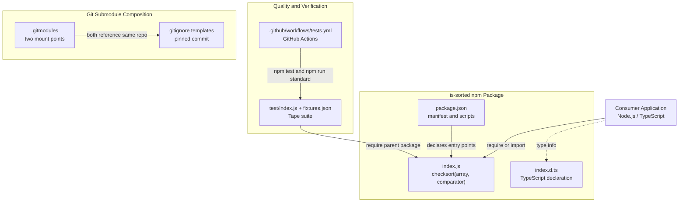
```mermaid
flowchart TB
    Consumer["Consumer Application<br/>Node.js / TypeScript"]
    subgraph Package["is-sorted npm Package"]
        Core["index.js<br/>checksort(array, comparator)"]
        Types["index.d.ts<br/>TypeScript declaration"]
        Manifest["package.json<br/>manifest and scripts"]
    end
    subgraph Quality["Quality and Verification"]
        Tests["test/index.js + fixtures.json<br/>Tape suite"]
        CI[".github/workflows/tests.yml<br/>GitHub Actions"]
    end
    subgraph Submodules["Git Submodule Composition"]
        GM[".gitmodules<br/>two mount points"]
        Templates["gitignore templates<br/>pinned commit"]
    end
    Consumer -->|require or import| Core
    Consumer -.->|type info| Types
    Manifest -->|declares entry points| Core
    Tests -->|require parent package| Core
    CI -->|npm test and npm run standard| Tests
    GM -->|both reference same repo| Templates
```

**Core Technical Approach.** The implementation is a dependency-free, pure CommonJS function. It abstracts ordering through a comparator function — defaulting to ascending numeric comparison — so that ordering semantics are the caller's concern rather than being hard-coded. Correctness is verified through data-driven testing: `test/index.js` iterates over the cases in `test/fixtures.json`, generating one Tape test per case, and adds a dedicated assertion that non-array input throws. Portability is enforced by running the suite across multiple Node.js versions in CI, and consistency is enforced through the JavaScript Standard Style linter.

### 1.2.3 Success Criteria

The repository does not define formal external service-level agreements or business KPIs. The criteria below are therefore expressed strictly as the **observable quality gates the repository itself enforces**, all of which are verifiable from its configuration and source.

**Measurable Objectives and Key Indicators.**

| Indicator | Target / Gate | Source |
|---|---|---|
| Functional correctness | All 12 fixture cases produce their expected boolean; each test plans exactly one assertion | `test/index.js`, `test/fixtures.json` |
| Error-handling behavior | Non-array input throws a `TypeError` matching `/Expected Array, got string/` | `test/index.js`, `index.js` |
| Cross-runtime compatibility | `unit` job passes on Node `14.x`, `16.x`, and `18.x` (fail-fast disabled) | `.github/workflows/tests.yml` |
| Style compliance | `npm run standard` passes JavaScript Standard Style | `package.json`, `.github/workflows/tests.yml` |
| Dependency minimalism | Zero runtime dependencies maintained | `package.json` |
| Submodule integrity | Both mount points resolve to one identical pinned commit | `.gitmodules` |

**Critical Success Factors.** The module's success depends on correct handling of ordering edge cases evidenced in `test/fixtures.json` — empty and singleton arrays (treated as sorted), duplicate and fractional values, ascending and descending sequences, and deliberately out-of-order inputs — together with robust input validation and reliable comparator delegation. Sustained success further depends on preserving the module's defining characteristics: a minimal, dependency-free footprint and green CI across the supported Node.js versions on every push to `main` and every pull request.

## 1.3 Scope

This section delineates what the system does and does not provide. Boundaries are drawn strictly from observed repository evidence — the `checksort` implementation in `index.js`, the declared interfaces in `index.d.ts` and `package.json`, the verification assets in `test/`, the CI definition in `.github/workflows/tests.yml`, and the submodule declaration in `.gitmodules`.

### 1.3.1 In-Scope

**Core Features and Functionalities.** The following elements constitute the delivered functionality, grouped by category:

| Category | In-Scope Element | Evidence |
|---|---|---|
| Must-have capability | Boolean sortedness check via `checksort(array[, comparator])` | `index.js` |
| Must-have capability | Default ascending numeric ordering (`a - b`) | `index.js` `defaultComparator` |
| Must-have capability | Custom ordering through an optional comparator | `index.js`, `test/index.js` |
| Must-have capability | Rejection of non-array input with a `TypeError` | `index.js` `Array.isArray` guard |
| Must-have capability | TypeScript type declaration for the API | `index.d.ts` |
| Primary workflow | Install and import the module (`require('is-sorted')`) | `README.md`, `package.json` |
| Primary workflow | Default-order check: `sorted(array)` | `README.md` |
| Primary workflow | Custom-order check: `sorted(array, comparator)` | `README.md`, `test/index.js` |
| Essential integration | npm distribution via `main`/`types` entry points | `package.json` |
| Essential integration | Tape test harness driven by JSON fixtures | `test/index.js`, `test/fixtures.json` |
| Essential integration | JavaScript Standard Style linting | `package.json`, `.github/workflows/tests.yml` |
| Essential integration | GitHub Actions CI across a Node.js matrix | `.github/workflows/tests.yml` |
| Essential integration | Git submodule references to a `.gitignore` templates repo | `.gitmodules` |
| Key technical requirement | Zero runtime dependencies | `package.json` |
| Key technical requirement | CommonJS module format | `index.js`, `package.json` |

**Implementation Boundaries.** The scope is bounded along the following dimensions:

| Boundary Dimension | Coverage |
|---|---|
| System boundary | The runtime surface is the single `checksort` function plus its TypeScript declaration; `test/`, CI, documentation, and submodules are development-time supports rather than shipped runtime code |
| User groups covered | JavaScript (CommonJS) consumers, TypeScript consumers, and project contributors/CI automation |
| Geographic / market coverage | Publicly and globally distributable through npm and GitHub, with no geographic or market gating present in the code |
| Data domains included | In-memory JavaScript arrays; numeric elements by default and any element type `T` when a comparator is supplied (`index.d.ts`); no persistence, network, or external data sources |

### 1.3.2 Out-of-Scope

The following capabilities and use cases are explicitly excluded, each substantiated by repository evidence:

| Out-of-Scope Item | Basis in Repository |
|---|---|
| Sorting or reordering an array | `index.js` only reads adjacent pairs and returns a boolean; it never reorders elements |
| Reporting which element (index or value) is out of order | `checksort` returns only `true`/`false`, with no positional detail |
| Accepting non-array inputs (typed arrays, `Set`, iterables, array-likes, strings) | The `Array.isArray` guard in `index.js` throws a `TypeError`; verified for a string in `test/index.js` |
| Native ES module (ESM) entry point | `package.json` declares only a CommonJS `main`; there is no `"type": "module"`, `"exports"` map, or `.mjs` build |
| Command-line interface or executable | `package.json` declares no `bin` field |
| Runtime configuration, persistence, network, or I/O | No such logic exists in `index.js` |
| Authoring or maintaining the `.gitignore` templates content | The templates are referenced through submodules at a pinned commit and are upstream-owned (CC0), not maintained in this repository |
| Guaranteed support for Node.js versions outside the CI matrix | CI validates only `14.x`, `16.x`, and `18.x`; `package.json` declares no `engines` constraint |

**Future Phase Considerations.** The repository contains no roadmap, backlog, `TODO`, or planning artifacts. Accordingly, no future-phase functionality is defined within the codebase, and none should be inferred from it.

**Integration Points Not Covered.** Beyond the CommonJS `require`/npm integration and the GitHub Actions and submodule wiring described above, the repository provides no native ESM consumption path, no browser- or CDN-specific build, no bundler configuration, and no test or lint toolchains other than `tape` and `standard`.

**Unsupported Use Cases.** The module does not support querying non-array collections, obtaining a stable-sort determination, streaming or asynchronous evaluation, or any behavior that depends on comparator semantics the caller does not itself define — the correctness of a supplied `comparator` (including handling of values such as `NaN` or `undefined`) is the caller's responsibility, as `index.js` delegates all ordering decisions to it.

## 1.4 References

The following repository artifacts were inspected as the evidentiary basis for this Introduction. No external web sources were used.

**Files**

- `package.json` — Established package identity (`is-sorted`, version `1.0.5`), description, CommonJS/TypeScript entry points (`main`, `types`), `standard`/`test` scripts, dev dependencies, absence of runtime dependencies and an `engines` field, keywords, author, license, and repository/homepage/bugs metadata.
- `index.js` — Established the core `checksort(array, comparator)` implementation: the ascending `defaultComparator`, the `Array.isArray` guard throwing `TypeError`, the single-pass adjacent-pair scan, and the non-mutating boolean result.
- `index.d.ts` — Established the TypeScript declaration `checksort<T = any>(array: T[], comparator?: (a: T, b: T) => number)` and the `export = checksort` assignment.
- `README.md` — Established the package title, badges, purpose statement, the `require('is-sorted')` usage example (default and custom-comparator calls), and the MIT license reference.
- `LICENSE` — Established MIT licensing, © 2015 Daniel Cousens.
- `.gitignore` — Established that `node_modules` is ignored.
- `.gitmodules` — Established the two submodule declarations, both pointing to the same upstream `.gitignore` templates repository.
- `test/index.js` — Established the Tape test runner, the `descending` comparator, the fixture-driven test generation, and the non-array `TypeError` assertion.
- `test/fixtures.json` — Established the 12 data-driven test cases and their expected boolean outcomes.
- `.github/workflows/tests.yml` — Established the `Tests` CI workflow: the `unit` job across Node.js `14.x`/`16.x`/`18.x` (fail-fast disabled) and the `standard` lint job, triggered on push to `main` and all pull requests.
- `Parent_repo_for_submodule/README.md` — Established that the submodule content is GitHub's collection of `.gitignore` templates.
- `Parent_repo_for_submodule/LICENSE` — Established that the referenced templates content is licensed CC0 1.0 Universal (distinct from the MIT parent package).

**Folders**

- `test/` — Contained the Tape test suite and JSON fixtures.
- `.github/workflows/` — Contained the GitHub Actions CI definition.
- `Parent_repo_for_submodule/` — Contained a pinned working tree of the `.gitignore` templates (163 root templates, `Global/`, `community/`, `CONTRIBUTING.md`, `README.md`, `LICENSE`, `.github/`).
- `submodule_for_Parent_repo_for_submodule-Public/` — Contained a pinned working tree identical to the other submodule mount, referencing the same upstream repository.

**Git Metadata**

- `git submodule status` — Confirmed both submodule mount points resolve to one identical pinned commit.

# 2. Product Requirements

## 2.1 Feature Catalog

This catalog decomposes the `is-sorted` product into discrete, individually testable features. Every feature, metadata value, dependency, and behavioral claim below is grounded directly in the repository's source (`index.js`, `index.d.ts`), manifest (`package.json`), verification assets (`test/index.js`, `test/fixtures.json`), CI definition (`.github/workflows/tests.yml`), documentation (`README.md`, `LICENSE`), and submodule declaration (`.gitmodules`). No behavior, service-level agreement, or relationship has been inferred beyond what the code demonstrates. This section builds on the system framing in **1.2 System Overview** and the boundaries drawn in **1.3 Scope**.

**Requirement Version Anchor.** All features and requirements in this section are anchored to package version **`1.0.5`** as declared in `package.json`. The repository contains no separate roadmap, backlog, or requirement-versioning artifact; the npm semantic version is therefore the sole authoritative version marker, and every feature's `Status` reflects the shipped state of that version.

### 2.1.1 Feature Inventory

The product comprises ten discrete features spanning four categories: the core ordering-check runtime API, package distribution, development-time quality assurance tooling, and the repository's Git submodule composition. The runtime-facing product surface is intentionally minimal — a single exported function, `checksort` (`index.js`), plus its TypeScript declaration (`index.d.ts`) — while the remaining features package, verify, and compose that surface.

| Feature ID | Feature Name | Category | Priority |
|---|---|---|---|
| F-001 | Array Sortedness Check | Core Ordering-Check API | Critical |
| F-002 | Default Ascending Ordering | Core Ordering-Check API | Critical |
| F-003 | Custom Comparator Support | Core Ordering-Check API | High |
| F-004 | Non-Array Input Validation | Core Ordering-Check API | High |
| F-005 | TypeScript Type Declaration | Core Ordering-Check API | Medium |
| F-006 | npm Package Distribution | Distribution & Packaging | Critical |
| F-007 | Data-Driven Test Suite | Quality Assurance & Tooling | High |
| F-008 | Continuous Integration | Quality Assurance & Tooling | High |
| F-009 | Code Style Enforcement | Quality Assurance & Tooling | Medium |
| F-010 | Git Submodule Composition | Repository Composition | Low |

All ten features carry `Status = Completed`: each is fully implemented and shipped in the stable `1.0.5` release, and each is exercised by the repository's tests, CI, or configuration as detailed in **2.2 Functional Requirements**.

**Assumptions and Constraints (product-wide).** The following assumptions, all substantiated by repository evidence, apply across the feature catalog:

| Assumption / Constraint | Basis in Repository |
|---|---|
| Elements are numeric by default; any element type `T` is supported when a comparator is supplied | `index.d.ts` generic `checksort<T = any>`; `defaultComparator` uses `a - b` in `index.js` |
| Correctness of a caller-supplied comparator (including handling of `NaN`/`undefined`) is the caller's responsibility | `index.js` delegates all ordering to the comparator (per **1.3.2 Out-of-Scope**) |
| The module is CommonJS-only — no native ESM entry, no CLI, no runtime configuration | `package.json` declares only `main`/`types`, no `exports`/`type`/`bin` fields |
| Runtime compatibility is validated only for Node.js `14.x`, `16.x`, `18.x` | `.github/workflows/tests.yml` matrix; `package.json` declares no `engines` field |
| The check reports only a boolean; it never reorders input or reports which element is out of order | `index.js` returns `true`/`false` and only reads adjacent pairs |

### 2.1.2 Core Ordering-Check API Features

The five features in this category are all realized within the single 14-line `checksort` function in `index.js` and its declaration in `index.d.ts`. They constitute the entire runtime product surface.

#### 2.1.2.1 F-001: Array Sortedness Check

| Attribute | Value |
|---|---|
| Feature ID | F-001 |
| Feature Name | Array Sortedness Check |
| Feature Category | Core Ordering-Check API |
| Priority Level | Critical |
| Status | Completed |

**Overview.** F-001 is the product's central capability: the exported `checksort(array, comparator)` function returns a boolean indicating whether every adjacent pair of the input array is in order. It performs a single left-to-right pass, returning `false` at the first out-of-order pair (`comparator(array[i - 1], array[i]) > 0`) and `true` if the scan completes (`index.js`).

**Business Value.** It fills a gap in the standard library — JavaScript provides `Array.prototype.sort` but no built-in predicate to test whether an array is already ordered — enabling consumers to short-circuit unnecessary re-sorts and validate ordering invariants cheaply (per **1.1 Executive Summary**).

**User Benefits.** Consumers get an inexpensive, allocation-free ordering check that leaves their input untouched, with an early-exit that avoids scanning past the first disorder.

**Technical Context.** The scan runs in linear time with constant additional state and never mutates or copies the input; equal adjacent values pass (a `0` comparator result is not `> 0`), and empty and singleton arrays return `true` because the loop starts at index 1.

| Dependency Type | Detail |
|---|---|
| Prerequisite Features | F-004 (input validation guard executes first); consumes an ordering strategy from F-002 or F-003 |
| System Dependencies | JavaScript runtime providing `Array.isArray` and array indexing (`index.js`) |
| External Dependencies | None — `index.js` has zero imports and zero runtime dependencies (`package.json`) |
| Integration Requirements | Exposed through the CommonJS `module.exports` boundary consumed via F-006 |

#### 2.1.2.2 F-002: Default Ascending Ordering

| Attribute | Value |
|---|---|
| Feature ID | F-002 |
| Feature Name | Default Ascending Ordering |
| Feature Category | Core Ordering-Check API |
| Priority Level | Critical |
| Status | Completed |

**Overview.** When no comparator argument is supplied, `checksort` applies a private `defaultComparator(a, b)` that returns `a - b`, establishing ascending numeric ordering (`index.js`, lines 1–3 and 7).

**Business Value.** It provides a zero-configuration default that satisfies the most common use case — checking that a numeric array is in ascending order — as demonstrated by the `README.md` examples.

**User Benefits.** Callers can invoke `sorted([1, 2, 3])` with a single argument and receive a correct result without writing any comparator.

**Technical Context.** Comparator selection uses `comparator = comparator || defaultComparator`, so an absent or falsy comparator falls back to the ascending default; the test fixtures with no `comparator` selector exercise exactly this path (`test/index.js`, `test/fixtures.json`).

| Dependency Type | Detail |
|---|---|
| Prerequisite Features | F-001 (the default comparator is consumed by the sortedness scan) |
| System Dependencies | Numeric subtraction semantics of the JavaScript runtime |
| External Dependencies | None |
| Integration Requirements | Activated implicitly whenever F-003's optional comparator is omitted |

#### 2.1.2.3 F-003: Custom Comparator Support

| Attribute | Value |
|---|---|
| Feature ID | F-003 |
| Feature Name | Custom Comparator Support |
| Feature Category | Core Ordering-Check API |
| Priority Level | High |
| Status | Completed |

**Overview.** F-003 accepts an optional second argument, `comparator(a, b)`, and delegates all ordering decisions to it, allowing descending or arbitrary caller-defined ordering to be validated (`index.js`; `README.md` custom-comparator example).

**Business Value.** It generalizes the check beyond ascending numeric order so the same primitive serves any ordering domain the caller defines, broadening reuse.

**User Benefits.** Callers can validate descending sequences or custom orderings — e.g., passing `function (a, b) { return b - a }` — without a different API.

**Technical Context.** The test suite defines a `descending` comparator (`b - a`) and drives it through fixtures; a comparator returning `> 0` for any adjacent pair yields `false` (`test/index.js`, `test/fixtures.json`). Comparator correctness is the caller's responsibility.

| Dependency Type | Detail |
|---|---|
| Prerequisite Features | F-001 (the supplied comparator is consumed by the sortedness scan) |
| System Dependencies | The caller-provided comparator function is executed as given by the runtime |
| External Dependencies | None |
| Integration Requirements | Comparator signature `(a: T, b: T) => number` is described by F-005 (`index.d.ts`) |

#### 2.1.2.4 F-004: Non-Array Input Validation

| Attribute | Value |
|---|---|
| Feature ID | F-004 |
| Feature Name | Non-Array Input Validation |
| Feature Category | Core Ordering-Check API |
| Priority Level | High |
| Status | Completed |

**Overview.** Before any scanning, `checksort` guards its input with `Array.isArray` and throws `TypeError('Expected Array, got ' + typeof array)` for any non-array input (`index.js`, line 6).

**Business Value.** Fail-fast validation surfaces misuse immediately with a descriptive error rather than producing a misleading result, improving robustness for consumers.

**User Benefits.** Callers receive a clear, typed error identifying the offending input type, aiding debugging.

**Technical Context.** The guard executes before the ordering loop, so invalid inputs never reach the scan; the behavior is verified by an assertion that `sorted('foobar')` throws a message matching `/Expected Array, got string/` (`test/index.js`, lines 17–22).

| Dependency Type | Detail |
|---|---|
| Prerequisite Features | None (executes as the first step of F-001) |
| System Dependencies | `Array.isArray` and the `typeof` operator from the JavaScript runtime |
| External Dependencies | None |
| Integration Requirements | Verified through the dedicated non-array assertion in F-007 |

#### 2.1.2.5 F-005: TypeScript Type Declaration

| Attribute | Value |
|---|---|
| Feature ID | F-005 |
| Feature Name | TypeScript Type Declaration |
| Feature Category | Core Ordering-Check API |
| Priority Level | Medium |
| Status | Completed |

**Overview.** The package ships an ambient TypeScript declaration, `checksort<T = any>(array: T[], comparator?: (a: T, b: T) => number)`, exported via `export = checksort` (`index.d.ts`), and referenced by the `types` field in `package.json`.

**Business Value.** First-class typing lets TypeScript codebases adopt the module without a separate `@types` package, lowering integration friction (per **1.1 Executive Summary**).

**User Benefits.** TypeScript consumers get static type checking of the array element type `T` and the optional comparator signature at compile time.

**Technical Context.** The declaration is generic over the element type `T` (defaulting to `any`) and marks the comparator optional; it declares no explicit return-type annotation, so the boolean result is implicit at the declaration level (`index.d.ts`).

| Dependency Type | Detail |
|---|---|
| Prerequisite Features | F-001 and F-003 (it types the runtime function and its optional comparator) |
| System Dependencies | A TypeScript-aware toolchain in the consumer project |
| External Dependencies | None — the declaration has no imports |
| Integration Requirements | Discovered via the `types` entry point declared in F-006 (`package.json`) |

### 2.1.3 Distribution & Packaging Features

#### 2.1.3.1 F-006: npm Package Distribution

| Attribute | Value |
|---|---|
| Feature ID | F-006 |
| Feature Name | npm Package Distribution |
| Feature Category | Distribution & Packaging |
| Priority Level | Critical |
| Status | Completed |

**Overview.** F-006 packages the runtime for consumption through npm: `package.json` declares the package identity (`name` `is-sorted`, `version` `1.0.5`), the CommonJS entry point (`main` → `index.js`), and the TypeScript declaration entry point (`types` → `index.d.ts`), with zero runtime dependencies.

**Business Value.** Distribution is what makes the code a consumable product; the zero-dependency manifest minimizes the supply-chain surface and install footprint for adopters (per **1.1 Executive Summary**).

**User Benefits.** Consumers install the module and load it with `require('is-sorted')`, receiving the callable function and — for TypeScript projects — the bundled type declaration.

**Technical Context.** The manifest declares only `standard` and `tape` as `devDependencies` and no `dependencies`, `engines`, or `bin` fields; the module is therefore CommonJS-only (`package.json`).

| Dependency Type | Detail |
|---|---|
| Prerequisite Features | F-001 (runtime) and F-005 (type declaration), which are the packaged artifacts |
| System Dependencies | Node.js module resolution and the npm registry/tooling |
| External Dependencies | None at runtime; `standard` and `tape` are dev-only (`package.json`) |
| Integration Requirements | CommonJS `require` and TypeScript `types` resolution boundaries |

### 2.1.4 Quality Assurance & Tooling Features

These development-time features verify and enforce the correctness and style of the runtime; they are not part of the shipped runtime surface (per **1.3.1 In-Scope**).

#### 2.1.4.1 F-007: Data-Driven Test Suite

| Attribute | Value |
|---|---|
| Feature ID | F-007 |
| Feature Name | Data-Driven Test Suite |
| Feature Category | Quality Assurance & Tooling |
| Priority Level | High |
| Status | Completed |

**Overview.** The Tape-based suite (`test/index.js`) loads the package root as `sorted` and iterates the 12 cases in `test/fixtures.json`, generating one test per case (each planning exactly one assertion) plus a dedicated assertion that non-array input throws.

**Business Value.** Data-driven testing verifies the core behavior across ordering edge cases and locks in correctness as a quality gate (per **1.2.3 Success Criteria**).

**User Benefits.** Contributors gain confidence that changes preserve documented behavior; new cases can be added by editing JSON rather than test code.

**Technical Context.** The runner is invoked by the `test` script (`tape test/*.js`) and defines a `descending` comparator; the fixture selector resolves to `undefined` for default-order cases, exercising F-002 (`test/index.js`, `package.json`).

| Dependency Type | Detail |
|---|---|
| Prerequisite Features | F-001–F-004 (the behaviors under test) and F-006 (`require('../')` loads the package) |
| System Dependencies | Node.js runtime to execute the suite |
| External Dependencies | `tape` `^5.0.0` dev dependency (`package.json`) |
| Integration Requirements | Executed by the `test` npm script and by F-008's `unit` job |

#### 2.1.4.2 F-008: Continuous Integration

| Attribute | Value |
|---|---|
| Feature ID | F-008 |
| Feature Name | Continuous Integration |
| Feature Category | Quality Assurance & Tooling |
| Priority Level | High |
| Status | Completed |

**Overview.** The `Tests` GitHub Actions workflow (`.github/workflows/tests.yml`) runs a `unit` job across a Node.js matrix (`14.x`, `16.x`, `18.x`, fail-fast disabled) and a separate `standard` lint job, triggered on pushes to `main` and on every pull request.

**Business Value.** CI enforces cross-runtime correctness and style on every change, sustaining the module's reliability guarantee across supported Node.js versions (per **1.2.3 Success Criteria**).

**User Benefits.** Maintainers and contributors get automated verification on each push and pull request without manual test execution.

**Technical Context.** Each matrix run checks out the repository, sets up Node.js, and executes `npm install` then `npm test`; the workflow declares no explicit permissions, caching, or job dependencies (`.github/workflows/tests.yml`).

| Dependency Type | Detail |
|---|---|
| Prerequisite Features | F-007 (executed by `npm test`) and F-009 (executed by `npm run standard`) |
| System Dependencies | GitHub Actions runners (`ubuntu-latest`) |
| External Dependencies | `actions/checkout@main`, `actions/setup-node@main` |
| Integration Requirements | Invokes the `test` and `standard` npm scripts declared in `package.json` |

#### 2.1.4.3 F-009: Code Style Enforcement

| Attribute | Value |
|---|---|
| Feature ID | F-009 |
| Feature Name | Code Style Enforcement |
| Feature Category | Quality Assurance & Tooling |
| Priority Level | Medium |
| Status | Completed |

**Overview.** The `standard` npm script runs the JavaScript Standard Style linter over the codebase, and a dedicated `standard` CI job runs it on Node.js `18.x` (`package.json`; `.github/workflows/tests.yml`).

**Business Value.** Automated style enforcement keeps the codebase consistent and reviewable, a quality gate advertised by the Standard Style badge in `README.md`.

**User Benefits.** Contributors receive consistent formatting/lint feedback locally (`npm run standard`) and in CI.

**Technical Context.** `standard` is declared as a floating (`*`) dev dependency; the CI `standard` job pins Node.js `18.x` with an inline comment noting it avoids `lts/*` to prevent hitting a rate limit (`package.json`, `.github/workflows/tests.yml`).

| Dependency Type | Detail |
|---|---|
| Prerequisite Features | None (operates directly on the source files) |
| System Dependencies | Node.js runtime |
| External Dependencies | `standard` (`*`) dev dependency (`package.json`) |
| Integration Requirements | Invoked by the `standard` npm script and F-008's `standard` job |

### 2.1.5 Repository Composition Features

#### 2.1.5.1 F-010: Git Submodule Composition

| Attribute | Value |
|---|---|
| Feature ID | F-010 |
| Feature Name | Git Submodule Composition |
| Feature Category | Repository Composition |
| Priority Level | Low |
| Status | Completed |

**Overview.** The repository declares two Git submodule mount points in `.gitmodules` — `Parent_repo_for_submodule` and `submodule_for_Parent_repo_for_submodule-Public` — that both reference the same public upstream repository and resolve to one identical pinned commit (per **1.1 Executive Summary** and **1.4 References**).

**Business Value.** This demonstrates a controlled, reproducible example of nested Git submodule wiring, giving the repository a dual nature as both a shippable utility and a submodule composition harness.

**User Benefits.** It provides a concrete reference for how two submodule mounts can pin the same upstream content at the same commit.

**Technical Context.** Both submodule working trees contain GitHub's collection of `.gitignore` templates, which is licensed CC0 1.0 Universal — distinct from the MIT license of the parent `is-sorted` package. This content is upstream-owned and referenced at a pinned commit, not maintained in this repository (per **1.3.2 Out-of-Scope**).

| Dependency Type | Detail |
|---|---|
| Prerequisite Features | None (independent of the runtime and tooling features) |
| System Dependencies | Git with submodule support |
| External Dependencies | The upstream `.gitignore` templates repository referenced in `.gitmodules` |
| Integration Requirements | `git submodule` initialization/update to populate the pinned working trees |

## 2.2 Functional Requirements

This section specifies testable functional requirements for each feature in **2.1 Feature Catalog**. Requirement identifiers follow the format `F-XXX-RQ-YYY`. Priority uses the Must-Have / Should-Have / Could-Have scale; Complexity reflects the observed implementation complexity in the repository (uniformly **Low**, consistent with the 14-line core module). Every acceptance criterion is drawn from concrete repository evidence — source lines in `index.js`/`index.d.ts`, the 12 fixtures in `test/fixtures.json`, the assertions in `test/index.js`, the jobs in `.github/workflows/tests.yml`, or the manifest fields in `package.json` — and is anchored to version `1.0.5`.

### 2.2.1 F-001: Array Sortedness Check

| Requirement ID | Description | Priority | Complexity |
|---|---|---|---|
| F-001-RQ-001 | Return `true` when every adjacent pair is in order; return `false` at the first pair where `comparator(array[i-1], array[i]) > 0` | Must-Have | Low |
| F-001-RQ-002 | Treat empty and singleton arrays as sorted and permit equal adjacent values | Must-Have | Low |
| F-001-RQ-003 | Perform a single, non-mutating left-to-right scan without sorting or copying the input | Must-Have | Low |

**Acceptance Criteria.**
- F-001-RQ-001: `[1, 2, 3, 4, 5]` → `true`, `[1, 2, 3, 4, 6]` → `true`, and `[1, 5, 2, 3, 4]` → `false` (verified by the fixture-driven assertions in `test/index.js`).
- F-001-RQ-002: `[]` → `true`, `[1]` → `true`, `[5]` → `true`, `[1, 1, 3, 4, 5]` → `true`, `[1, 1.5, 3, 4, 5]` → `true` (fixtures).
- F-001-RQ-003: The function reads only `array[i - 1]` and `array[i]`, returns a boolean, and performs no assignment to `array` (`index.js`); the input is unchanged after the call.

| Specification Aspect | Detail |
|---|---|
| Input Parameters | `array` (required); `comparator` (optional) — see F-003 |
| Output/Response | Boolean: `true` if ordered per the active comparator, otherwise `false` |
| Performance Criteria | Single pass, linear in array length, constant extra state, early return on first disorder |
| Data Requirements | In-memory JavaScript array; no persistence, network, or I/O |

| Rule Category | Rule |
|---|---|
| Business Rules | Empty/singleton arrays are sorted; equal adjacent values pass (only a comparator result `> 0` fails) |
| Data Validation | Input must satisfy `Array.isArray` (enforced by F-004 before the scan) |
| Security Requirements | Pure, non-mutating function; no network, filesystem, or `eval`; zero runtime dependencies |
| Compliance Requirements | None beyond MIT distribution terms (`LICENSE`) |

### 2.2.2 F-002: Default Ascending Ordering

| Requirement ID | Description | Priority | Complexity |
|---|---|---|---|
| F-002-RQ-001 | When no comparator (or a falsy comparator) is supplied, apply the ascending numeric comparator `a - b` | Must-Have | Low |

**Acceptance Criteria.**
- F-002-RQ-001: `sorted([1, 2, 3])` → `true` and `sorted([3, 1, 2])` → `false` (`README.md`); all eight default-order fixtures (no `comparator` selector) produce their expected boolean via the default path (`test/index.js`, `test/fixtures.json`).

| Specification Aspect | Detail |
|---|---|
| Input Parameters | Activated when `comparator` is omitted or falsy (`comparator = comparator || defaultComparator`) |
| Output/Response | Boolean derived from ascending numeric comparison (`a - b`) |
| Performance Criteria | Constant-time comparator invocation per adjacent pair within the F-001 scan |
| Data Requirements | Numeric elements for which subtraction yields meaningful ordering |

| Rule Category | Rule |
|---|---|
| Business Rules | Absent/falsy comparator resolves to the private `defaultComparator` returning `a - b` |
| Data Validation | Relies on the F-004 array guard; numeric subtraction semantics of the runtime |
| Security Requirements | Pure function with no side effects |
| Compliance Requirements | None beyond MIT distribution terms |

### 2.2.3 F-003: Custom Comparator Support

| Requirement ID | Description | Priority | Complexity |
|---|---|---|---|
| F-003-RQ-001 | Accept an optional `comparator(a, b)` and delegate all ordering decisions to it when truthy | Must-Have | Low |
| F-003-RQ-002 | Yield `false` when the supplied comparator returns `> 0` for any adjacent pair | Should-Have | Low |

**Acceptance Criteria.**
- F-003-RQ-001: With a `descending` comparator (`b - a`), `[5, 4, 3, 2, 1]` → `true` and `[5, 4, 3, 1, 1]` → `true` (`test/index.js`, `test/fixtures.json`).
- F-003-RQ-002: With the `descending` comparator, `[5, 4, 3, 1, 2]` → `false` (fixtures); `sorted([3, 2, 1], function (a, b) { return b - a })` → `true` (`README.md`).

| Specification Aspect | Detail |
|---|---|
| Input Parameters | `comparator` (optional): `(a, b) => number` returning a numeric ordering value |
| Output/Response | Boolean computed using the supplied comparator |
| Performance Criteria | O(n) scan; per-pair cost is the caller-defined comparator's cost |
| Data Requirements | Element type `T` must be comparable by the supplied comparator |

| Rule Category | Rule |
|---|---|
| Business Rules | All ordering decisions are delegated to the comparator; a `> 0` result marks disorder |
| Data Validation | Truthiness check selects the comparator; comparator correctness is the caller's responsibility |
| Security Requirements | Caller-provided comparator is executed as given (no sandboxing) — a caller trust boundary |
| Compliance Requirements | None beyond MIT distribution terms |

### 2.2.4 F-004: Non-Array Input Validation

| Requirement ID | Description | Priority | Complexity |
|---|---|---|---|
| F-004-RQ-001 | Throw `TypeError('Expected Array, got ' + typeof array)` for any non-array input before scanning | Must-Have | Low |

**Acceptance Criteria.**
- F-004-RQ-001: `sorted('foobar')` throws an error matching `/Expected Array, got string/` (asserted in `test/index.js`, lines 17–22); the guard is `if (!Array.isArray(array)) throw ...` at `index.js` line 6.

| Specification Aspect | Detail |
|---|---|
| Input Parameters | `array` — any value passed as the first argument |
| Output/Response | Throws `TypeError` with message `Expected Array, got <typeof>`; otherwise proceeds to F-001 |
| Performance Criteria | Constant-time `Array.isArray` guard executed before the scan |
| Data Requirements | Reads only the first argument and its `typeof` for the message |

| Rule Category | Rule |
|---|---|
| Business Rules | Non-array input is rejected before any ordering work is performed |
| Data Validation | `Array.isArray(array)` must return `true` to continue |
| Security Requirements | Fail-fast rejection prevents undefined behavior on invalid input |
| Compliance Requirements | None beyond MIT distribution terms |

### 2.2.5 F-005: TypeScript Type Declaration

| Requirement ID | Description | Priority | Complexity |
|---|---|---|---|
| F-005-RQ-001 | Provide an ambient generic declaration `checksort<T = any>(array: T[], comparator?: (a: T, b: T) => number)` exported via `export = checksort` | Should-Have | Low |

**Acceptance Criteria.**
- F-005-RQ-001: `index.d.ts` declares the generic callable and the `export = checksort` assignment; `package.json` references it through the `types` field so TypeScript consumers resolve the types automatically.

| Specification Aspect | Detail |
|---|---|
| Input Parameters (declared) | `array: T[]`; optional `comparator?: (a: T, b: T) => number` |
| Output/Response | Declared callable exported via `export = checksort`; no explicit return-type annotation |
| Performance Criteria | Compile-time only; no runtime cost |
| Data Requirements | Generic element type `T` (defaulting to `any`) |

| Rule Category | Rule |
|---|---|
| Business Rules | The declaration must match the runtime function signature |
| Data Validation | The TypeScript compiler enforces `T[]` and the comparator signature at compile time |
| Security Requirements | Type-only artifact with no imports and no runtime behavior |
| Compliance Requirements | Distributed under MIT with the package; discovered via the `types` entry point |

### 2.2.6 F-006: npm Package Distribution

| Requirement ID | Description | Priority | Complexity |
|---|---|---|---|
| F-006-RQ-001 | Declare package identity and entry points (`main` → `index.js`, `types` → `index.d.ts`) with zero runtime dependencies | Must-Have | Low |
| F-006-RQ-002 | Be consumable via `require('is-sorted')`, returning the callable function | Should-Have | Low |

**Acceptance Criteria.**
- F-006-RQ-001: `package.json` declares `name` `is-sorted`, `version` `1.0.5`, `main` `index.js`, `types` `index.d.ts`, and no `dependencies` block (only `standard` and `tape` under `devDependencies`).
- F-006-RQ-002: `test/index.js` loads the package with `require('../')` and calls it as a function; `README.md` documents `const sorted = require('is-sorted')`.

| Specification Aspect | Detail |
|---|---|
| Input Parameters | Not applicable — packaging/manifest concern |
| Output/Response | An installable npm package exposing the CommonJS callable and TypeScript `types` |
| Performance Criteria | Zero runtime dependencies → minimal install footprint and supply-chain surface |
| Data Requirements | Valid `package.json` manifest fields (`name`, `version`, `main`, `types`) |

| Rule Category | Rule |
|---|---|
| Business Rules | CommonJS-only distribution at semantic version `1.0.5`; no runtime dependencies |
| Data Validation | Manifest must be a valid `package.json` with the declared entry points |
| Security Requirements | Zero runtime dependencies minimize the dependency supply-chain surface |
| Compliance Requirements | MIT license (`LICENSE`, © 2015 Daniel Cousens); author/repository metadata declared |

### 2.2.7 F-007: Data-Driven Test Suite

| Requirement ID | Description | Priority | Complexity |
|---|---|---|---|
| F-007-RQ-001 | Execute one Tape test per fixture (12 cases), each planning exactly one assertion comparing `sorted(array, comparator)` to `expected`, via `tape test/*.js` | Must-Have | Low |
| F-007-RQ-002 | Include a dedicated assertion that non-array input throws the expected `TypeError` | Must-Have | Low |

**Acceptance Criteria.**
- F-007-RQ-001: The runner iterates `test/fixtures.json` (12 records) generating one `tape` test each with `t.plan(1)` and `t.equal(actual, f.expected)`; all cases produce their expected boolean (`test/index.js`).
- F-007-RQ-002: A separate `throws on non-Array inputs` test asserts `sorted('foobar')` throws matching `/Expected Array, got string/` (`test/index.js`).

| Specification Aspect | Detail |
|---|---|
| Input Parameters | Fixture records: `array`, optional `comparator` selector, and `expected` |
| Output/Response | One pass/fail assertion per test (12 fixture assertions + 1 non-array assertion) |
| Performance Criteria | Executed by the `test` npm script (`tape test/*.js`) |
| Data Requirements | `test/fixtures.json` (12 numeric-array cases); a `descending` comparator in the runner |

| Rule Category | Rule |
|---|---|
| Business Rules | Each generated test plans exactly one assertion; the fixture selector resolves to `undefined` for default cases |
| Data Validation | Fixtures are numeric arrays with expected booleans and an optional comparator selector |
| Security Requirements | Development-time only; not part of the shipped runtime |
| Compliance Requirements | None beyond MIT terms; style governed by F-009 |

### 2.2.8 F-008: Continuous Integration

| Requirement ID | Description | Priority | Complexity |
|---|---|---|---|
| F-008-RQ-001 | Run the `unit` job on Node.js `14.x`/`16.x`/`18.x` (fail-fast disabled), executing `npm install` then `npm test`, on push to `main` and all pull requests | Must-Have | Low |
| F-008-RQ-002 | Run a separate `standard` lint job on Node.js `18.x` executing `npm run standard` | Should-Have | Low |

**Acceptance Criteria.**
- F-008-RQ-001: `.github/workflows/tests.yml` declares the `unit` job on `ubuntu-latest` with `fail-fast: false`, matrix `node-version: [14.x, 16.x, 18.x]`, triggered on `push` to `main` and on `pull_request`, running checkout, setup-node, `npm install`, and `npm test`.
- F-008-RQ-002: The `standard` job runs on `ubuntu-latest` with Node.js `18.x` and executes `npm run standard`.

| Specification Aspect | Detail |
|---|---|
| Input Parameters | GitHub events: `push` to `main` and any `pull_request` |
| Output/Response | Per-job pass/fail status checks |
| Performance Criteria | Matrix entries run independently (fail-fast disabled, so all versions run) |
| Data Requirements | Node version matrix `[14.x, 16.x, 18.x]`; `standard` job pinned to `18.x` |

| Rule Category | Rule |
|---|---|
| Business Rules | Verify tests across the Node matrix and enforce style on every push to `main` and every pull request |
| Data Validation | Not applicable — orchestration workflow |
| Security Requirements | No explicit `permissions` declared; uses GitHub Actions defaults |
| Compliance Requirements | None beyond MIT terms |

### 2.2.9 F-009: Code Style Enforcement

| Requirement ID | Description | Priority | Complexity |
|---|---|---|---|
| F-009-RQ-001 | `npm run standard` passes JavaScript Standard Style across the codebase | Should-Have | Low |

**Acceptance Criteria.**
- F-009-RQ-001: `package.json` declares the `standard` script (`standard`); the CI `standard` job runs `npm run standard` on Node.js `18.x` and must pass (`.github/workflows/tests.yml`); the Standard Style badge is displayed in `README.md`.

| Specification Aspect | Detail |
|---|---|
| Input Parameters | The repository's JavaScript source files |
| Output/Response | Lint pass/fail result |
| Performance Criteria | Development-time / CI-time execution |
| Data Requirements | `standard` linter defaults (no custom style configuration declared in `package.json`) |

| Rule Category | Rule |
|---|---|
| Business Rules | Source must conform to JavaScript Standard Style |
| Data Validation | Not applicable — static style analysis |
| Security Requirements | Development-time only |
| Compliance Requirements | JavaScript Standard Style compliance (advertised by the `README.md` badge) |

### 2.2.10 F-010: Git Submodule Composition

| Requirement ID | Description | Priority | Complexity |
|---|---|---|---|
| F-010-RQ-001 | Declare two submodule mount points in `.gitmodules` that reference the same upstream repository and resolve to one identical pinned commit | Could-Have | Low |

**Acceptance Criteria.**
- F-010-RQ-001: `.gitmodules` declares the submodules `Parent_repo_for_submodule` and `submodule_for_Parent_repo_for_submodule-Public`, both with the same `url`; both mount points resolve to one identical pinned commit (per **1.4 References**).

| Specification Aspect | Detail |
|---|---|
| Input Parameters | `.gitmodules` submodule declarations (name, path, url) |
| Output/Response | Two populated submodule working trees pinned to the same upstream commit |
| Performance Criteria | Not applicable — repository composition concern |
| Data Requirements | Two submodule entries referencing one upstream `.gitignore` templates repository |

| Rule Category | Rule |
|---|---|
| Business Rules | Both mount points pin the same upstream repository at the same commit |
| Data Validation | `git submodule status` shows both mounts at one identical pinned commit |
| Security Requirements | References a public upstream repository declared in `.gitmodules` |
| Compliance Requirements | Upstream templates content is CC0 1.0 Universal, distinct from the MIT parent package |

## 2.3 Feature Relationships

This section documents only the relationships that are directly evident in the source, manifest, tests, CI configuration, and submodule declaration. Because the runtime product is a single 14-line function, most relationships are compositional (features realized within, or built upon, the same `index.js` module) rather than distributed service interactions.

### 2.3.1 Feature Dependency Map

The diagram below maps prerequisite relationships. An arrow points from a feature to the feature that consumes or builds upon it (i.e., `A --> B` means B depends on A). The layering runs from the runtime behaviors (F-001–F-005), through packaging (F-006), into verification (F-007–F-009). F-010 has no dependency edges — it is an independent repository-composition concern.

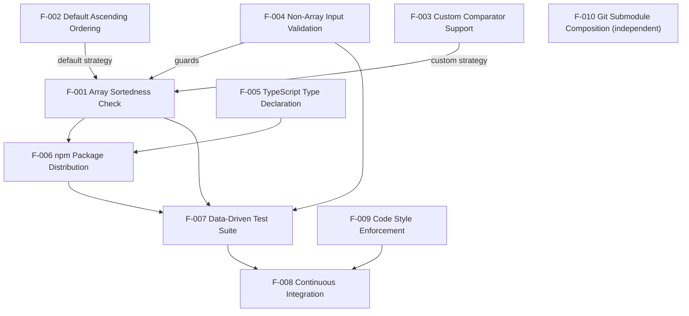
```mermaid
flowchart TD
    F004["F-004 Non-Array Input Validation"]
    F002["F-002 Default Ascending Ordering"]
    F003["F-003 Custom Comparator Support"]
    F001["F-001 Array Sortedness Check"]
    F005["F-005 TypeScript Type Declaration"]
    F006["F-006 npm Package Distribution"]
    F007["F-007 Data-Driven Test Suite"]
    F008["F-008 Continuous Integration"]
    F009["F-009 Code Style Enforcement"]
    F010["F-010 Git Submodule Composition (independent)"]

    F004 -->|guards| F001
    F002 -->|default strategy| F001
    F003 -->|custom strategy| F001
    F001 --> F006
    F005 --> F006
    F006 --> F007
    F001 --> F007
    F004 --> F007
    F007 --> F008
    F009 --> F008
```

F-001 is the hub of the runtime: F-004 guards it, and F-002 or F-003 supplies its ordering strategy. F-005 declares the type surface that mirrors the F-001/F-003 signature and is packaged alongside the runtime by F-006. F-006 makes the runtime loadable so that F-007 can `require` it; testing F-001 through the fixtures inherently exercises F-002 and F-003 as well. F-008 orchestrates F-007 and F-009. F-010 stands apart, wiring in external content through `.gitmodules`.

### 2.3.2 Runtime Evaluation Process Flow

The following flowchart traces the exact control flow of `checksort` in `index.js`, integrating F-004 (validation), F-002/F-003 (comparator selection), and F-001 (the scan). It complements the component/consumer diagram in **1.2.2 High-Level Description**.

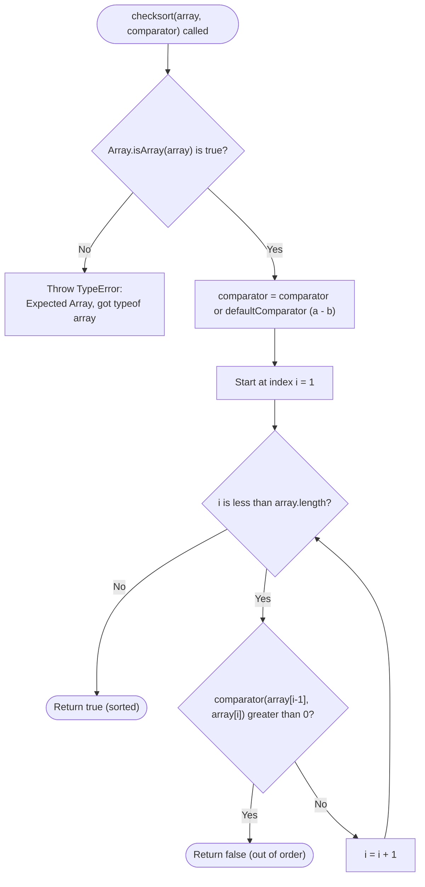
```mermaid
flowchart TD
    Start(["checksort(array, comparator) called"]) --> Guard{"Array.isArray(array) is true?"}
    Guard -->|"No"| Throw["Throw TypeError:<br/>Expected Array, got typeof array"]
    Guard -->|"Yes"| Select["comparator = comparator or defaultComparator (a - b)"]
    Select --> Init["Start at index i = 1"]
    Init --> Cond{"i is less than array.length?"}
    Cond -->|"No"| RetTrue(["Return true (sorted)"])
    Cond -->|"Yes"| Cmp{"comparator(array[i-1], array[i]) greater than 0?"}
    Cmp -->|"Yes"| RetFalse(["Return false (out of order)"])
    Cmp -->|"No"| Incr["i = i + 1"]
    Incr --> Cond
```

The guard (F-004) executes first; comparator selection (F-002 default or F-003 custom) occurs once; then the single-pass scan (F-001) either returns `false` at the first out-of-order pair or `true` after inspecting every adjacent pair. This is the process flow referenced by the functional requirements in **2.2 Functional Requirements**.

### 2.3.3 Integration Points

The repository exposes the following concrete integration points, each substantiated by evidence:

| Integration Point | Related Features | Mechanism | Evidence |
|---|---|---|---|
| CommonJS consumption boundary | F-006, F-001 | `module.exports` consumed via `require('is-sorted')` | `index.js`, `README.md`, `package.json` (`main`) |
| TypeScript type resolution | F-006, F-005 | `types` entry point resolving `export = checksort` | `package.json` (`types`), `index.d.ts` |
| npm registry distribution | F-006 | `main`/`types` entry points and package identity | `package.json` |
| Test harness ↔ package root | F-007, F-006 | `require('../')` executed by `tape test/*.js` | `test/index.js`, `package.json` (`test` script) |
| CI ↔ npm scripts | F-008, F-007, F-009 | Workflow steps invoke `npm test` and `npm run standard` | `.github/workflows/tests.yml`, `package.json` |
| Git submodule ↔ upstream repository | F-010 | `.gitmodules` `url` resolved by `git submodule` | `.gitmodules` |

### 2.3.4 Shared Components and Common Services

**Shared Components.** The most significant shared component is the single `checksort` function in `index.js`, within which four features co-reside and which two other features consume.

| Shared Component | Role | Features Sharing It |
|---|---|---|
| `index.js` (`checksort` function) | Realizes the runtime behaviors; consumed for packaging and testing | F-001, F-002, F-003, F-004 (realized); F-006, F-007 (consume) |
| `defaultComparator` (private helper in `index.js`) | Ascending `a - b` fallback used when no comparator is supplied | F-001, F-002 |
| `package.json` (manifest and scripts) | Declares identity/entry points and the `test`/`standard` scripts and dev dependencies | F-006, F-007, F-008, F-009 |
| `tape` (dev dependency / test harness) | Executes the assertion suite | F-007, F-008 |
| `standard` (dev dependency / linter) | Enforces JavaScript Standard Style | F-008, F-009 |

**Common Services.** The repository defines **no runtime services** — there is no network endpoint, persistence layer, or long-running process (consistent with **1.3.2 Out-of-Scope**). The only shared "services" are development-time orchestration facilities: the npm script runner (the `test` and `standard` scripts in `package.json`), the Tape test harness, the `standard` linter, and the GitHub Actions runner (`.github/workflows/tests.yml`). These are shared across the quality-assurance features (F-007, F-008, F-009) rather than by the runtime.

## 2.4 Implementation Considerations

The considerations below are derived strictly from observed configuration and code. The repository declares no service-level agreements, throughput targets, or capacity plans, so performance and scalability are described in terms of the algorithmic and configuration properties actually present. Where a consideration does not apply to a feature (for example, runtime performance for a packaging or type-only feature), that is stated plainly.

### 2.4.1 Technical Constraints

| Feature | Technical Constraint |
|---|---|
| F-001 Array Sortedness Check | Returns only a boolean — no index/value of the offending element; equal adjacent values are treated as sorted; all ordering is comparator-driven |
| F-002 Default Ascending Ordering | The `a - b` default assumes numeric elements; non-numeric input without a comparator produces meaningless comparisons the caller must avoid |
| F-003 Custom Comparator Support | The comparator must return a number; correctness (including `NaN`/`undefined` handling) is the caller's responsibility |
| F-004 Non-Array Input Validation | Only values passing `Array.isArray` are accepted; typed arrays, `Set`, iterables, array-likes, and strings are rejected |
| F-005 TypeScript Type Declaration | Uses the CommonJS `export = checksort` form and declares no explicit return-type annotation |
| F-006 npm Package Distribution | CommonJS-only — no ESM `exports`/`type`, no `bin`, and no `engines` field are declared |
| F-007 Data-Driven Test Suite | Bound to Tape and JSON fixtures; fixtures are numeric arrays; no coverage tooling is declared |
| F-008 Continuous Integration | Validates only Node.js `14.x`/`16.x`/`18.x`; uses `@main`-referenced actions; no explicit permissions or caching |
| F-009 Code Style Enforcement | Uses the `standard` default ruleset with no custom style configuration in `package.json` |
| F-010 Git Submodule Composition | Both mounts pin a single upstream commit; the referenced content is upstream-owned and not edited here |

### 2.4.2 Performance Requirements

| Feature | Performance Consideration |
|---|---|
| F-001 Array Sortedness Check | Single left-to-right pass: linear in array length, constant extra state, early return on the first out-of-order pair, no allocation or mutation |
| F-002 Default Ascending Ordering | Constant-time `a - b` comparison per adjacent pair |
| F-003 Custom Comparator Support | Overall cost is O(n × comparator cost); the per-pair cost is defined by the caller's comparator |
| F-004 Non-Array Input Validation | Constant-time `Array.isArray` guard executed once before scanning |
| F-005 TypeScript Type Declaration | Compile-time only; no runtime cost |
| F-006 npm Package Distribution | Zero runtime dependencies yield a minimal install and load footprint |
| F-007 Data-Driven Test Suite | Small, fast suite: 12 fixture assertions plus one non-array assertion |
| F-008 Continuous Integration | Matrix entries run independently; fail-fast disabled, so every Node version runs to completion |
| F-009 Code Style Enforcement | Static analysis executed at development/CI time |
| F-010 Git Submodule Composition | No runtime cost; affects only submodule checkout/update time |

### 2.4.3 Scalability Considerations

| Feature | Scalability Consideration |
|---|---|
| F-001 / F-002 Ordering scan and default | Scales linearly with array length; bounded by in-memory array size; synchronous with no streaming or asynchronous evaluation |
| F-003 Custom Comparator Support | Same linear element scaling, with the caller's comparator cost as a per-pair multiplier |
| F-004 Non-Array Input Validation | Constant regardless of input size |
| F-005 TypeScript Type Declaration | Not applicable — type-only artifact |
| F-006 npm Package Distribution | No server-side scaling; distribution scales through the npm registry/CDN |
| F-007 Data-Driven Test Suite | Test count scales by editing `test/fixtures.json`; no code change needed to add cases |
| F-008 Continuous Integration | CI cost scales with the matrix (currently three Node versions plus one lint job) |
| F-009 Code Style Enforcement | Scales with codebase size (currently minimal) |
| F-010 Git Submodule Composition | Checkout cost scales with the upstream template catalog size, not with any runtime workload |

### 2.4.4 Security Implications

| Feature | Security Implication |
|---|---|
| F-001 / F-002 Core scan and default | Pure, non-mutating functions with no network, filesystem, or `eval` usage |
| F-003 Custom Comparator Support | The caller-provided comparator is executed as given with no sandboxing — the trust boundary is the caller |
| F-004 Non-Array Input Validation | Fail-fast rejection of invalid input prevents undefined behavior |
| F-005 TypeScript Type Declaration | Type-only declaration with no imports and no runtime behavior |
| F-006 npm Package Distribution | Zero runtime dependencies minimize the supply-chain surface; distributed under MIT (`LICENSE`) |
| F-007 Data-Driven Test Suite | Adds only the dev-only `tape` (`^5.0.0`) dependency to the development supply chain |
| F-008 Continuous Integration | No explicit `permissions` block (defaults apply); actions are referenced at the mutable `@main` ref |
| F-009 Code Style Enforcement | The dev-only `standard` dependency is pinned to `*` (floating), resolving to the latest release |
| F-010 Git Submodule Composition | References a public upstream repository; the pinned commit provides reproducibility of the fetched content |

### 2.4.5 Maintenance Requirements

| Feature | Maintenance Consideration |
|---|---|
| F-001–F-004 Core API | Co-located in a single 14-line function in `index.js`, keeping the runtime easy to reason about and modify |
| F-005 TypeScript Type Declaration | Must be kept in sync with the runtime signature manually, since it is a hand-written declaration |
| F-006 npm Package Distribution | Releases require a `version` bump in `package.json` (currently `1.0.5`) |
| F-007 Data-Driven Test Suite | New behaviors are covered by adding records to `test/fixtures.json` — data-driven, no runner changes |
| F-008 Continuous Integration | The Node matrix must be revised as versions age (an inline comment already notes avoiding `lts/*` for rate limits) |
| F-009 Code Style Enforcement | The floating `standard` version may introduce new lint rules over time |
| F-010 Git Submodule Composition | Refreshing upstream templates requires advancing the pinned submodule commit |

## 2.5 Requirements Traceability Matrix

The matrix traces every functional requirement defined in **2.2 Functional Requirements** to its parent feature, the source artifact that implements it, and the mechanism that verifies it. All 16 requirements are anchored to package version `1.0.5`.

### 2.5.1 Requirement-to-Feature-to-Verification Matrix

| Requirement ID | Feature | Source Evidence | Verification |
|---|---|---|---|
| F-001-RQ-001 | F-001 | `index.js` scan (lines 9–13) | Tape fixtures `[1,2,3,4,5]`→true, `[1,5,2,3,4]`→false (`test/index.js`) |
| F-001-RQ-002 | F-001 | `index.js` loop starting at `i = 1` | Tape fixtures `[]`, `[1]`, `[1,1,3,4,5]`, `[1,1.5,3,4,5]`→true |
| F-001-RQ-003 | F-001 | `index.js` reads adjacent pairs; returns boolean, no mutation | Source inspection (no assignment to `array`) |
| F-002-RQ-001 | F-002 | `index.js` `defaultComparator` (lines 1–3, 7) | `README.md` examples; eight default-order fixtures |
| F-003-RQ-001 | F-003 | `index.js` comparator delegation (lines 7, 10) | `descending` fixtures `[5,4,3,2,1]`, `[5,4,3,1,1]`→true |
| F-003-RQ-002 | F-003 | `index.js` returns `false` when comparator `> 0` | `descending` fixture `[5,4,3,1,2]`→false; `README.md` |
| F-004-RQ-001 | F-004 | `index.js` `Array.isArray` guard (line 6) | `test/index.js` (lines 17–22) `/Expected Array, got string/` |
| F-005-RQ-001 | F-005 | `index.d.ts` generic declaration + `export = checksort` | `package.json` `types` field; declaration inspection |
| F-006-RQ-001 | F-006 | `package.json` `name`/`version`/`main`/`types`, no `dependencies` | Manifest inspection |
| F-006-RQ-002 | F-006 | `index.js` `module.exports`; `package.json` `main` | `test/index.js` `require('../')`; `README.md` usage |
| F-007-RQ-001 | F-007 | `test/index.js` fixture loop; `test/fixtures.json` (12) | `npm test` (`tape test/*.js`), one assertion per fixture |
| F-007-RQ-002 | F-007 | `test/index.js` non-array test (lines 17–22) | `npm test` non-array assertion |
| F-008-RQ-001 | F-008 | `.github/workflows/tests.yml` `unit` job | CI on push to `main` and all pull requests |
| F-008-RQ-002 | F-008 | `.github/workflows/tests.yml` `standard` job | CI lint job on Node.js `18.x` |
| F-009-RQ-001 | F-009 | `package.json` `standard` script | CI `standard` job; `README.md` Standard Style badge |
| F-010-RQ-001 | F-010 | `.gitmodules` two mounts sharing one `url` | `git submodule status` (one identical pinned commit) |

### 2.5.2 Coverage Summary

All 16 requirements trace to at least one source artifact and one verification mechanism. The following verification distribution holds:

| Verification Method | Requirements Covered |
|---|---|
| Automated Tape assertions (`npm test`) | F-001-RQ-001, F-001-RQ-002, F-002-RQ-001, F-003-RQ-001, F-003-RQ-002, F-004-RQ-001, F-006-RQ-002, F-007-RQ-001, F-007-RQ-002 |
| CI configuration (`.github/workflows/tests.yml`) | F-008-RQ-001, F-008-RQ-002, F-009-RQ-001 |
| Manifest / declaration inspection | F-005-RQ-001, F-006-RQ-001 |
| Source inspection (non-mutation property) | F-001-RQ-003 |
| Git submodule state | F-010-RQ-001 |

The runtime ordering behaviors (F-001 through F-004) and package consumability (F-006-RQ-002) are the most heavily verified, each exercised by the automated Tape suite that itself runs across the Node.js matrix in CI.

## 2.6 References

The following repository artifacts were inspected as the evidentiary basis for this Product Requirements section. No external web sources were used.

**Files**

- `index.js` — Established the `checksort(array, comparator)` implementation underpinning F-001–F-004: the `defaultComparator` (`a - b`), the `Array.isArray` guard throwing `TypeError`, the single-pass adjacent-pair scan, and the non-mutating boolean result.
- `index.d.ts` — Established F-005: the ambient generic declaration `checksort<T = any>(array: T[], comparator?: (a: T, b: T) => number)` and the `export = checksort` assignment.
- `package.json` — Established F-006 and F-009: package identity (`is-sorted`, version `1.0.5`), `main`/`types` entry points, the `test` and `standard` scripts, dev dependencies (`standard` `*`, `tape` `^5.0.0`), and the absence of runtime `dependencies`, `engines`, and `bin` fields.
- `test/index.js` — Established F-007: the Tape runner, the `descending` comparator, fixture-driven test generation with one planned assertion each, and the non-array `TypeError` assertion.
- `test/fixtures.json` — Established the 12 data-driven test cases and expected boolean outcomes cited throughout the acceptance criteria.
- `README.md` — Established the default and custom-comparator usage examples (`sorted([1,2,3])`, `sorted([3,1,2])`, `sorted([3,2,1], (a,b)=>b-a)`) and the Standard Style badge referenced by F-009.
- `LICENSE` — Established the MIT distribution terms (© 2015 Daniel Cousens) cited in the compliance requirements.
- `.github/workflows/tests.yml` — Established F-008: the `unit` job across Node.js `14.x`/`16.x`/`18.x` (fail-fast disabled) and the `standard` lint job on Node.js `18.x`, triggered on push to `main` and all pull requests.
- `.gitmodules` — Established F-010: the two submodule mount points (`Parent_repo_for_submodule`, `submodule_for_Parent_repo_for_submodule-Public`) referencing the same upstream repository.

**Folders**

- `test/` — Contained the Tape test suite and JSON fixtures verifying the runtime behaviors.
- `.github/workflows/` — Contained the GitHub Actions CI definition.
- `Parent_repo_for_submodule/` — Contained a pinned working tree of GitHub's `.gitignore` templates, confirming the submodule content and its CC0 1.0 Universal license (distinct from the MIT parent package).
- `submodule_for_Parent_repo_for_submodule-Public/` — The second submodule mount point declared in `.gitmodules`, referencing the same upstream repository at the same pinned commit.

**Related Technical Specification Sections**

- `1.1 Executive Summary` — Project overview, stakeholders, and the dual utility/submodule-composition nature referenced by the feature descriptions.
- `1.2 System Overview` (1.2.2 High-Level Description, 1.2.3 Success Criteria) — Component/consumer diagram and quality gates cross-referenced by the feature relationships and requirements.
- `1.3 Scope` (1.3.1 In-Scope, 1.3.2 Out-of-Scope) — Boundaries cited by the assumptions/constraints and by the "no runtime services" determination.
- `1.4 References` — Confirmation that both submodule mount points resolve to one identical pinned commit.

# 3. Technology Stack

## 3.1 Programming Languages

The `is-sorted` package (version `1.0.5`, declared in `package.json`) is a single-purpose JavaScript utility. Its language footprint is deliberately narrow: one implementation language (JavaScript), one companion type-declaration language (TypeScript), and two declarative languages used only for configuration and test data (YAML and JSON). No compiled or server-side languages from a general-purpose default stack — such as Python, Swift, Kotlin, or Objective-C — appear anywhere in the repository; the package is a pure Node.js/npm library.

The following table maps each language to the components that use it, based on the files verified in the repository.

| Language | Version / Standard | Component(s) | Evidence |
|----------|--------------------|--------------|----------|
| JavaScript (CommonJS, ES2015+) | No pinned language level; ES2015+ syntax observed | Runtime implementation, test suite | `index.js`, `test/index.js` |
| TypeScript (declaration file) | No compiler version declared | Consumer-facing type declarations | `index.d.ts` |
| YAML | GitHub Actions workflow schema | Continuous integration configuration | `.github/workflows/tests.yml` |
| JSON | JSON | Package manifest, test fixtures | `package.json`, `test/fixtures.json` |

### 3.1.1 JavaScript (Runtime Implementation Language)

JavaScript is the sole implementation language. The entire runtime library is contained in a single 14-line module, `index.js`, authored in the CommonJS module format. It exports one function through `module.exports` and takes no external imports:

```javascript
module.exports = function checksort (array, comparator) {
  if (!Array.isArray(array)) throw new TypeError('Expected Array, got ' + (typeof array))
  // ... single-pass comparison loop, returns boolean
}
```

The source uses ECMAScript 2015+ (ES6) syntax — `const`/`let` bindings, arrow functions, and `for...of` iteration are present in the test module (`test/index.js`), and block-scoped `let` is used in the comparison loop of `index.js`. No language level is pinned in `package.json` (there is no `engines` field), so the effective JavaScript version is bounded only by the Node.js runtimes the project targets in CI (see section 3.2.1). The implementation is intentionally free of language features that would require transpilation, which is consistent with the absence of any build step (see section 3.6.2).

### 3.1.2 TypeScript (Ambient Type Declarations)

TypeScript appears exclusively as an ambient declaration file, `index.d.ts`, which is referenced from the manifest via the `types` field (`package.json`). It contains no executable logic — only a type signature that provides static typing to TypeScript consumers of the package:

```typescript
declare function checksort<T = any> (array: T[], comparator?: (a: T, b: T) => number)
export = checksort
```

The declaration uses a generic type parameter (`<T = any>`) and the `export =` (CommonJS-style export assignment) form, which mirrors the runtime module's `module.exports` shape. No TypeScript compiler, `tsconfig.json`, or TypeScript devDependency is present in the repository, confirming that TypeScript is used only to publish type information for downstream consumers — not to author or compile the library itself.

### 3.1.3 Configuration and Data Serialization Languages

Two declarative languages support the project's tooling rather than its runtime behavior:

- **YAML** is used for the single GitHub Actions workflow, `.github/workflows/tests.yml`, which declares the continuous-integration jobs. This is the only YAML file in the package tree.
- **JSON** is used for the package manifest (`package.json`) and for the data-driven test fixtures (`test/fixtures.json`). The fixtures file encodes the 12 test cases (input arrays, comparator selector, and expected boolean result) consumed by the test suite, keeping test data separate from test logic.

### 3.1.4 Selection Rationale and Constraints

JavaScript is the natural and effectively mandated choice for this component: the deliverable is an npm-distributed library that plugs directly into the Node.js/JavaScript ecosystem, providing a sortedness predicate that complements the language's built-in `Array.prototype.sort`. Authoring the module in plain CommonJS JavaScript (rather than a language requiring compilation) maximizes consumer compatibility and eliminates a build toolchain.

The accompanying TypeScript declaration reflects the modern npm convention of shipping first-class type information; declaring `types` in the manifest allows TypeScript projects to consume `is-sorted` with full type safety without a separate `@types/` package.

The primary constraint arising from these language choices is that the package is **CommonJS-only**: the runtime uses `module.exports` and the declaration uses `export =`, with no ECMAScript Module (`import`/`export`) entry point, no `exports` map, and no `"type": "module"` field in the manifest. Consumers therefore integrate the package through `require()` semantics. Because no `engines` constraint is declared, language-feature availability is governed in practice by the Node.js versions exercised in CI (14.x, 16.x, 18.x), as documented in section 3.2.

## 3.2 Frameworks & Libraries

This system uses **no application framework**. The `is-sorted` runtime library has zero production dependencies (there is no `dependencies` block in `package.json`) and imports nothing — it is a self-contained function. Consequently, there are no web, UI, ORM, or server frameworks such as Flask, Express, or React anywhere in the codebase. The "frameworks and libraries" relevant to this project are therefore the JavaScript **runtime platform** on which the module executes and the **development-time tooling** that tests and lints it.

The following table summarizes each framework/library, its role, and the version reference declared in the repository.

| Component | Role | Declared Version / Reference | Effective Resolution | Evidence |
|-----------|------|------------------------------|----------------------|----------|
| Node.js | Runtime execution platform | `14.x`, `16.x`, `18.x` (CI matrix) | Latest patch of each line at CI run time | `.github/workflows/tests.yml` |
| tape | Test harness (TAP) | `^5.0.0` (devDependency) | Latest `5.x` (5.9.0) | `package.json` |
| standard | Code-style linter / formatter | `*` (devDependency) | Latest published release | `package.json`, `README.md` |
| actions/checkout | CI action — repo checkout | `@main` | Moving `main` branch tip | `.github/workflows/tests.yml` |
| actions/setup-node | CI action — Node.js provisioning | `@main` | Moving `main` branch tip | `.github/workflows/tests.yml` |

### 3.2.1 Runtime Platform — Node.js

Node.js is the execution platform for both the library and its test suite. The project does not pin a runtime through an `engines` field; instead, the supported runtime surface is expressed operationally through the CI test matrix in `.github/workflows/tests.yml`, which exercises the module against **Node.js 14.x, 16.x, and 18.x**. The `unit` job provisions each version with the `actions/setup-node` action and runs `npm install` followed by `npm test`. Because `fail-fast: false` is set on the matrix, a failure on one Node.js line does not cancel the others, so cross-version compatibility signal is preserved for every runtime independently.

### 3.2.2 Test Framework — tape

The test framework is **tape**, declared as a devDependency with the semantic-version range `^5.0.0` in `package.json` (the caret range resolves to the latest `5.x`, currently `5.9.0`). tape is a minimalist, TAP-producing (Test Anything Protocol) harness that requires no separate runner, assertion library, or configuration file. The test module `test/index.js` uses it directly:

```javascript
const tape = require('tape')
tape('returns ' + f.expected + ' for ' + f.array, function (t) { t.plan(1); /* ... */ })
```

Each test declares its assertion count with `t.plan(1)` and verifies behavior with `t.equal` (fixture-driven cases) and `t.throws` (the non-Array input case). The `test` script in `package.json` — `tape test/*.js` — invokes tape's CLI with a glob that discovers every test file in the `test/` directory. tape's philosophy of zero-configuration, dependency-light testing aligns with the package's own minimalism.

### 3.2.3 Code-Style Tooling — standard

Code style is enforced by **standard** ("JavaScript Standard Style"), declared as a devDependency with the unpinned specifier `*` in `package.json`, meaning it resolves to the latest published release at install time. `standard` is a zero-configuration linter and style checker (built on top of ESLint internally) that requires no `.eslintrc` or rule configuration in the repository — and indeed none exists. It is invoked through the `standard` npm script (`package.json`) and is surfaced to consumers by the `js-standard-style` badge in `README.md`, which links to the upstream `feross/standard` project. Enforcing a single opinionated style keeps the small codebase consistent without bespoke configuration.

### 3.2.4 Continuous Integration Building Blocks — GitHub Actions Reusable Actions

The CI workflow composes two first-party GitHub Actions from the GitHub Actions marketplace, both referenced at the moving `@main` ref in `.github/workflows/tests.yml`:

- **`actions/checkout@main`** — checks out the repository source into the runner.
- **`actions/setup-node@main`** — installs and configures the Node.js version supplied by the workflow (either the matrix value in the `unit` job or the fixed `18.x` in the `standard` job).

These are reusable building blocks rather than libraries linked into the product; they exist only in the CI environment and are not part of the published package.

### 3.2.5 Compatibility Requirements and Justification

Compatibility is governed by three observable facts in the repository:

1. **Runtime compatibility** is validated, not merely asserted: the `unit` job's three-version matrix (`14.x`/`16.x`/`18.x`) proves the module runs across those Node.js lines. The `standard` job pins Node.js `18.x` and carries an inline note — "don't use lts/* to prevent hitting rate-limit" — indicating a deliberate choice to fix a concrete version for the lint job rather than resolve an alias.
2. **Test-framework compatibility** is bounded by the `^5.0.0` range on tape, which permits any `5.x` release; tape `5.x` runs on the Node.js versions in the matrix.
3. **Toolchain currency**: pinning `standard` to `*` opts the project into whatever the latest style ruleset is at install time, trading reproducibility for always-current style enforcement.

The overarching justification for these choices is minimalism: a compact, single-function utility benefits from a zero-dependency runtime (no framework), a zero-configuration test harness (tape), and a zero-configuration style tool (standard), each of which keeps the maintenance surface small while still delivering automated correctness and consistency checks. The security implications of the moving `@main` action refs and the floating `standard` specifier are examined further in section 3.3.

## 3.3 Open Source Dependencies

Open-source dependencies in this repository fall into three distinct categories: (1) npm **devDependencies** used for testing and linting, (2) **CI marketplace actions** consumed by the GitHub Actions workflow, and (3) **vendored content** referenced through Git submodules. Critically, the `is-sorted` runtime has **zero production/runtime dependencies** — `package.json` declares no `dependencies`, `peerDependencies`, or `optionalDependencies` blocks, so a consumer installing the package pulls in no transitive third-party code at runtime.

### 3.3.1 Declared npm devDependencies

Exactly two development-time packages are declared in the `devDependencies` block of `package.json`. Both are sourced from the public npm registry.

| Package | Version Specifier | Resolved Version | Registry | Purpose | License |
|---------|-------------------|------------------|----------|---------|---------|
| `tape` | `^5.0.0` | Latest `5.x` (5.9.0) | npmjs.com | Test harness (TAP) | MIT |
| `standard` | `*` | Latest published | npmjs.com | Style linter / formatter | MIT (upstream `feross/standard`) |

The two specifiers use deliberately different resolution strategies. `tape: "^5.0.0"` is a caret range that admits any `5.x` release at or above `5.0.0` while excluding a future `6.0.0` — bounding the major version for stability while accepting minor and patch updates. `standard: "*"` is a wildcard that resolves to the single latest published release regardless of major version, meaning the linting ruleset floats forward automatically over time.

### 3.3.2 Dependency Resolution and Registry

All npm dependencies resolve from the **public npm registry** (`https://registry.npmjs.org`), the default for `npm install`. The repository does **not** commit a lockfile — there is no `package-lock.json` or `yarn.lock` — and the only entry in `.gitignore` is `node_modules`, which excludes the installed dependency tree from version control. The practical consequence is that dependency resolution is performed fresh at each `npm install` (including in CI): the `unit` and `standard` jobs both run `npm install` before executing, so they always resolve `tape` and `standard` to the newest versions permitted by their specifiers at run time. This favors currency (always-latest tooling) over bit-for-bit reproducibility.

### 3.3.3 CI Marketplace Actions

The GitHub Actions workflow (`.github/workflows/tests.yml`) depends on two open-source, first-party GitHub Actions, each referenced at the moving `@main` branch ref rather than a pinned tag or commit SHA:

- `actions/checkout@main`
- `actions/setup-node@main`

These actions run only inside the CI environment and are never bundled into the published npm artifact. Their licenses are governed by their respective upstream repositories.

### 3.3.4 Vendored Submodule Content (Git Submodules)

The repository composes external open-source content through Git submodules declared in `.gitmodules`. Two submodule mount points — `Parent_repo_for_submodule` and `submodule_for_Parent_repo_for_submodule-Public` — both reference the same public upstream repository URL (`https://github.com/lakshya-blitzy/submodule_for_Parent_repo_for_submodule-Public.git`) and are pinned to the same immutable commit, `dcc0fc7bc2b5ba480cf117ad1be31bafceeaff46`.

The vendored content is **GitHub's collection of `.gitignore` templates** — 163 top-level `*.gitignore` files (e.g., `Node.gitignore`, `C++.gitignore`), plus `Global/` and `community/` subfolders, `CONTRIBUTING.md`, `README.md`, and a `.github/` directory. This content is documentation/data, not executable dependencies of the `is-sorted` library; pinning to a fixed commit makes the vendored snapshot reproducible.

### 3.3.5 License Inventory

The repository spans two distinct license domains, which coexist within the composed working tree:

| Artifact | License | Source of Determination |
|----------|---------|-------------------------|
| `is-sorted` package (primary software) | MIT | `LICENSE` (Copyright © 2015 Daniel Cousens) |
| `tape` (devDependency) | MIT | npm registry metadata |
| `standard` (devDependency) | MIT | Upstream `feross/standard` referenced by `README.md` badge |
| Vendored `.gitignore` templates (submodule content) | CC0 1.0 Universal | `Parent_repo_for_submodule/LICENSE` header |

The primary package and its development tooling are MIT-licensed, while the submodule-referenced template collection is released under CC0 1.0 Universal (public-domain dedication). Because the two license regimes apply to disjoint parts of the tree — the shipped npm library versus the vendored template snapshot — they do not interact at the artifact level.

### 3.3.6 Supply-Chain Security Considerations

Several dependency decisions carry security implications that are observable directly from the manifests:

- **Minimal runtime attack surface.** With zero runtime dependencies, a consumer of `is-sorted` inherits no third-party runtime code, eliminating transitive supply-chain risk in production usage.
- **Floating and moving references.** The `standard: "*"` specifier and the `@main` action refs both resolve to moving targets. This maximizes freshness but means an upstream change (or compromise) is pulled in automatically on the next install/run without an intervening version bump — a trade-off toward currency over pinned reproducibility. The absence of a committed lockfile reinforces this behavior for the npm devDependencies.
- **Bounded test dependency.** `tape` is constrained to the `5.x` major line via the caret range, limiting unexpected major-version drift in the one non-trivial devDependency.
- **Reproducible vendored snapshot.** The submodules are pinned to a specific commit SHA, so the vendored template content is deterministic even though the submodule URL points to a mutable remote.

## 3.4 Third-Party Services

The `is-sorted` library performs pure in-memory computation and makes no network calls at runtime, so it consumes **no third-party runtime services**. The external services it does rely on are confined to the software's development lifecycle: source-code hosting and continuous integration on **GitHub**, and package distribution through the **npm registry**. The table below scopes each service and its role.

| Service | Category | Role in the Project | Evidence |
|---------|----------|---------------------|----------|
| GitHub | SCM hosting, issue tracking, CI | Repository home, bug tracker, GitHub Actions runner | `package.json`, `.github/workflows/tests.yml`, `.gitmodules` |
| npm registry | Package distribution / dependency source | Publishing target and devDependency source | `README.md`, `package.json` |

### 3.4.1 GitHub (Source Hosting, Issue Tracking, and CI)

GitHub is the platform of record for the project's source and automation. The manifest points every project URL at GitHub: the `repository.url` is `https://github.com/dcousens/is-sorted.git`, the `homepage` is `https://github.com/dcousens/is-sorted`, and the `bugs.url` is the corresponding GitHub Issues tracker (`package.json`). Continuous integration runs on **GitHub Actions** via `.github/workflows/tests.yml`, which is triggered on pushes to `main` and on all pull requests. Additionally, the Git submodule references in `.gitmodules` resolve to a public GitHub-hosted repository. GitHub therefore provides three services to the project: version-control hosting, issue tracking, and the hosted CI compute that executes the test and lint jobs.

### 3.4.2 npm Registry (Package Distribution)

The npm registry is both the distribution channel and the dependency source. The package's public identity on npm is `is-sorted`, as evidenced by the NPM version badge in `README.md` (linking to `https://www.npmjs.org/package/is-sorted`) and the manifest fields (`name`, `main`, `types`) that define what is published. The same registry supplies the two devDependencies (`tape`, `standard`) during `npm install`. Consumers obtain the package with a standard `npm install is-sorted` and load it via `require('is-sorted')`, as shown in the README example.

### 3.4.3 Service Categories Not Present

For completeness, the following third-party service categories that commonly appear in application stacks are **deliberately absent** from this project, consistent with its nature as a dependency-free, offline computation utility:

- **Authentication / identity services** — There is no Auth0, OAuth provider, SSO, or any authentication integration. The library exposes a single function and has no notion of users, sessions, or credentials.
- **Monitoring / observability tools** — There is no APM, error-tracking, logging, or metrics SaaS integration. The module emits no telemetry and includes no instrumentation.
- **Cloud services** — There is no AWS, Google Cloud, or Azure usage; no cloud SDKs, service clients, or credentials appear in the repository. No infrastructure is provisioned (see section 3.6.4).
- **External runtime APIs / integrations** — The module has no HTTP client, no outbound API calls, and no I/O; it operates entirely on arguments passed by the caller and returns a boolean.

The only credential-bearing surface in the ecosystem is GitHub's own access mechanism used to fetch submodule content during setup, which is an operational detail of the hosting environment and is not part of the package's declared configuration or runtime behavior.

## 3.5 Databases & Storage

**No databases or storage systems are applicable to this project.** The `is-sorted` package is a stateless, in-memory pure function; it neither persists nor retrieves data. This subsection documents that determination explicitly rather than omitting it, because the absence of a persistence layer is an intentional architectural characteristic of the component.

### 3.5.1 Stateless Execution Model

The library's single export, `checksort` in `index.js`, receives its entire input as function arguments (`array` and an optional `comparator`), computes a boolean result via a single left-to-right pass, and returns it. It holds no module-level mutable state, retains nothing between invocations, and does not mutate its input. There is consequently no data to store or recall, and no persistence abstraction of any kind is present in the code.

### 3.5.2 Absence of Databases, Caches, and Storage Services

The repository contains none of the following, and declares no dependencies or configuration that would introduce them:

- **Primary or secondary databases** — no relational (e.g., PostgreSQL/MySQL) or NoSQL (e.g., MongoDB) database, driver, ORM, or connection string.
- **Caching solutions** — no in-process or external cache (e.g., Redis/Memcached). Because the computation is a trivial O(n) scan with no expensive work to memoize, caching would serve no purpose.
- **Object / blob / file storage services** — no cloud object storage (e.g., S3) and no filesystem reads or writes at runtime. The module performs no I/O.

The zero-dependency manifest (`package.json`) corroborates this: there is no database or storage client among the (nonexistent) runtime dependencies.

### 3.5.3 Files at Rest Versus Runtime Storage

Two data files exist in the repository, but neither constitutes runtime storage:

- `test/fixtures.json` is **test input data** — a static, version-controlled table of 12 cases consumed only by the test suite during development, never by the shipped library at runtime.
- `package.json` and `index.d.ts` are **package metadata** describing the artifact, not persisted application state.

These files are read by tooling (npm, tape) at development time; the runtime library itself opens no files and touches no storage medium.

## 3.6 Development & Deployment

The development and deployment toolchain is intentionally lightweight, matching the package's scope. Work is driven through **npm scripts**, quality is gated by **GitHub Actions**, and the package is delivered to the **npm registry** with no intermediate build, container, or infrastructure layer.

### 3.6.1 Development Tooling and npm Scripts

The developer workflow is expressed entirely through the `scripts` block in `package.json`, executed via npm:

```json
"scripts": {
  "standard": "standard",
  "test": "tape test/*.js"
}
```

- `npm test` runs the tape harness over every file in `test/`, executing the 12 fixture-driven assertions plus the non-Array error case.
- `npm run standard` runs the `standard` style linter across the source.

npm itself is the package manager and task runner; there is no Make, Gulp, Grunt, or other task-orchestration tool. No editor/formatter configuration files (e.g., `.editorconfig`, `.prettierrc`) or lint-rule overrides are committed, since `standard` is zero-configuration by design.

### 3.6.2 Build System

There is **no build system**. The package is authored and published in the same CommonJS form it executes: `index.js` is declared directly as `main` in `package.json`, and `index.d.ts` is declared as `types`. The repository contains no transpiler or bundler configuration — no Babel, webpack, Rollup, esbuild, or TypeScript compiler — and no `build` script. Because the source uses only runtime-supported JavaScript and the TypeScript file is a hand-written declaration (not compiled output), the "build" step is effectively a no-op; what is committed is what is shipped.

### 3.6.3 Continuous Integration (GitHub Actions)

Continuous integration is implemented in a single workflow, `.github/workflows/tests.yml` (named "Tests"), triggered on pushes to the `main` branch and on all pull requests. It defines two independent jobs:

| Job | Runner | Node.js | Key Steps | Purpose |
|-----|--------|---------|-----------|---------|
| `unit` | `ubuntu-latest` | `14.x`, `16.x`, `18.x` (matrix, `fail-fast: false`) | checkout → setup-node → `npm install` → `npm test` | Validate correctness across Node.js versions |
| `standard` | `ubuntu-latest` | `18.x` (fixed) | checkout → setup-node → `npm install` → `npm run standard` | Enforce code style |

The `unit` job's matrix with `fail-fast: false` ensures each Node.js line is validated independently, so one runtime's failure does not mask results on the others. The `standard` job intentionally pins Node.js `18.x` — an inline comment records the rationale: "don't use lts/* to prevent hitting rate-limit". The workflow declares no explicit `permissions` block, no dependency caching, no artifact upload, and no `concurrency` or `timeout` settings, so GitHub Actions defaults apply throughout.

### 3.6.4 Containerization and Infrastructure as Code

Neither containerization nor infrastructure-as-code is used. The repository contains **no `Dockerfile`, no `docker-compose` file, and no container definitions**, and **no Terraform, CloudFormation, Pulumi, or other IaC** manifests. This is expected: the package is a library that runs inside a consumer's Node.js process rather than a deployable service, so there is no runtime environment to containerize or provision. The only "environment" is the ephemeral `ubuntu-latest` GitHub-hosted runner, which is supplied by GitHub Actions and requires no infrastructure definition in the repository.

### 3.6.5 Distribution and Deployment Model

"Deployment" for this project means publishing to the npm registry. The manifest's `name` (`is-sorted`), `version` (`1.0.5`), `main`, and `types` fields define the published artifact; the README's NPM badge confirms the package's public presence on npmjs.org. The repository contains **no publish automation** — there is no GitHub Actions job that runs `npm publish` — so releasing a new version is a manual operation (bump `version`, `npm publish`) performed outside the committed CI workflow, which is scoped to testing and linting only. Downstream consumption is a simple `npm install is-sorted` followed by `require('is-sorted')`.

The end-to-end flow from local development through CI to distribution and consumption is depicted below.

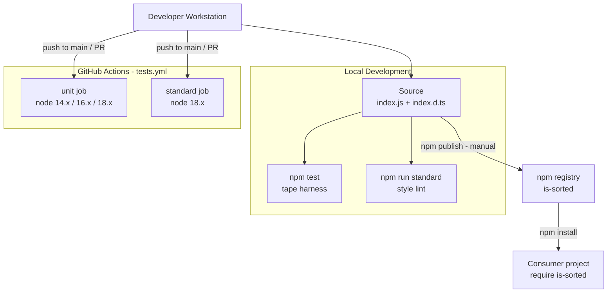
```mermaid
flowchart TB
    Dev["Developer Workstation"]
    subgraph Local["Local Development"]
        Src["Source<br/>index.js + index.d.ts"]
        TestCmd["npm test<br/>tape harness"]
        StdCmd["npm run standard<br/>style lint"]
    end
    subgraph CIPipe["GitHub Actions - tests.yml"]
        Unit["unit job<br/>node 14.x / 16.x / 18.x"]
        Std["standard job<br/>node 18.x"]
    end
    Registry["npm registry<br/>is-sorted"]
    Consumer["Consumer project<br/>require is-sorted"]

    Dev --> Src
    Src --> TestCmd
    Src --> StdCmd
    Dev -->|"push to main / PR"| Unit
    Dev -->|"push to main / PR"| Std
    Src -->|"npm publish - manual"| Registry
    Registry -->|"npm install"| Consumer
```

### 3.6.6 Runtime Currency and Security Note

The CI matrix targets Node.js `14.x`, `16.x`, and `18.x`. As of mid-2026, all three of these lines have reached end-of-life (Node.js 14 in April 2023, Node.js 16 in September 2023, and Node.js 18 in April 2025) and therefore no longer receive official security patches. The workflow's inline note about avoiding `lts/*` addresses CI rate-limiting rather than runtime currency. Because `is-sorted` is a dependency-free, I/O-free pure function, the practical runtime security exposure introduced by the library itself is minimal; nonetheless, the pinned matrix reflects the state of the workflow as committed and would need updating to validate against currently supported LTS lines (e.g., Node.js 22/24).

## 3.7 References

The following repository files, folders, and external sources were examined as evidence for this section.

**Repository files**

- `package.json` - Established the package identity (`is-sorted` v`1.0.5`), CommonJS entry (`main`→`index.js`), TypeScript entry (`types`→`index.d.ts`), npm scripts (`test`, `standard`), the two devDependencies (`tape: "^5.0.0"`, `standard: "*"`), MIT license, GitHub repository/homepage/bugs URLs, and the absence of any `dependencies`, `peerDependencies`, `engines`, or `bin` fields.
- `index.js` - Confirmed the JavaScript runtime implementation: a dependency-free CommonJS module exporting a single `checksort` function with a `TypeError` guard, default ascending comparator, and O(n) single-pass loop.
- `index.d.ts` - Confirmed the TypeScript ambient declaration (`declare function checksort<T = any>` with `export =`) and that no TypeScript compiler or `tsconfig.json` is present.
- `README.md` - Confirmed the NPM version badge (npmjs.org/package/is-sorted), the `js-standard-style` badge linking to `feross/standard`, the `require('is-sorted')` usage pattern, and the MIT license reference.
- `LICENSE` - Established the primary package license (MIT, Copyright © 2015 Daniel Cousens).
- `.gitignore` - Confirmed that `node_modules` is ignored and that no lockfile is committed.
- `.gitmodules` - Established the two Git submodule mount points referencing the same public upstream URL, used for the vendored-content analysis.
- `.github/workflows/tests.yml` - Established the GitHub Actions CI configuration: the `unit` job (Node.js `14.x`/`16.x`/`18.x` matrix, `fail-fast: false`) and the `standard` job (Node.js `18.x`), the `actions/checkout@main` and `actions/setup-node@main` actions, and the trigger events.
- `test/index.js` - Confirmed the tape-based test harness, its `require('tape')` usage, fixture iteration, and the `t.throws` error-path test.
- `test/fixtures.json` - Confirmed the data-driven JSON test fixtures (12 cases) consumed by the test suite.
- `Parent_repo_for_submodule/LICENSE` - Established the CC0 1.0 Universal license governing the vendored `.gitignore` template collection.

**Repository folders**

- `.github/workflows/` - Contained the single CI workflow file for the project.
- `test/` - Contained the test runner and JSON fixtures.
- `Parent_repo_for_submodule/` - Contained the vendored GitHub `.gitignore` template collection (submodule content), pinned to commit `dcc0fc7bc2b5ba480cf117ad1be31bafceeaff46`.

**Cross-referenced specification sections**

- Section 1.2 System Overview - Confirmed the CommonJS/TypeScript integration model and the component composition.
- Section 1.3 Scope - Confirmed in-scope (CommonJS distribution, zero runtime deps) and out-of-scope (no persistence, network, or ESM entry point) boundaries.
- Section 2.4 Implementation Considerations - Confirmed the per-feature security and maintenance characteristics (zero-dependency supply-chain posture, floating `standard` specifier, `@main` action refs).

**External sources**

- [web] endoflife.date / HeroDevs / endoflife.ai - Confirmed Node.js end-of-life dates: 14 (April 30, 2023), 16 (September 11, 2023), and 18 (April 30, 2025).
- [web] npmjs.com/package/tape - Confirmed tape's latest `5.x` release (5.9.0) and MIT license, informing the `^5.0.0` resolution.

# 4. Process Flowchart

## 4.1 System Workflows

The `is-sorted` system is a compact, dependency-free npm package whose runtime surface is a single exported function, `checksort(array, comparator)` in `index.js`. Consequently its workflows fall into two distinct planes: a **runtime plane**, where a consumer application invokes the ordering-check function synchronously and in-memory, and a **development/delivery plane**, where maintainers, the GitHub Actions CI workflow, the npm registry, and two Git submodule mount points collaborate to verify, distribute, and compose the package. There is no server, network endpoint, message queue, database, or long-running process anywhere in the repository, so every "system interaction" documented here is either a synchronous function call, a Node.js module-resolution event, a Git/GitHub event, or a CI process step. These workflows realize features F-001 through F-010 catalogued in **2.1 Feature Catalog**.

The following high-level diagram shows all actors and system boundaries at once. Each subgraph is a system boundary (swim lane): the consumer runtime, the packaged runtime artifacts, the development-time quality-and-delivery tooling, and the Git submodule composition. Solid arrows are direct invocations/data movement; dashed arrows are compile-time or install-time relationships.

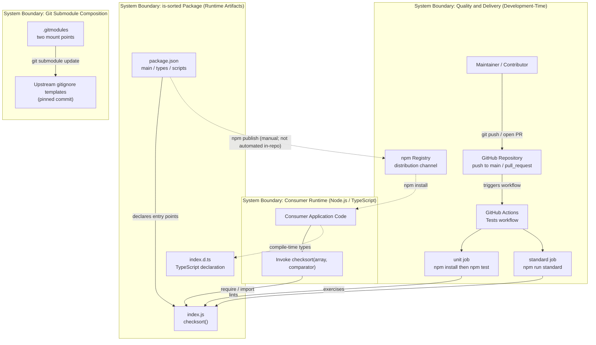
```mermaid
flowchart TB
    subgraph Consumers["System Boundary: Consumer Runtime (Node.js / TypeScript)"]
        direction TB
        App["Consumer Application Code"]
        ReqCall["Invoke checksort(array, comparator)"]
    end
    subgraph Pkg["System Boundary: is-sorted Package (Runtime Artifacts)"]
        direction TB
        Core["index.js<br/>checksort()"]
        Types["index.d.ts<br/>TypeScript declaration"]
        Manifest["package.json<br/>main / types / scripts"]
    end
    subgraph QA["System Boundary: Quality and Delivery (Development-Time)"]
        direction TB
        Dev["Maintainer / Contributor"]
        VCS["GitHub Repository<br/>push to main / pull_request"]
        CI["GitHub Actions<br/>Tests workflow"]
        UnitJob["unit job<br/>npm install then npm test"]
        StdJob["standard job<br/>npm run standard"]
        Registry["npm Registry<br/>distribution channel"]
    end
    subgraph Sub["System Boundary: Git Submodule Composition"]
        direction TB
        GM[".gitmodules<br/>two mount points"]
        Upstream["Upstream gitignore templates<br/>(pinned commit)"]
    end
    App --> ReqCall
    ReqCall -->|"require / import"| Core
    App -.->|"compile-time types"| Types
    Manifest -->|"declares entry points"| Core
    Dev -->|"git push / open PR"| VCS
    VCS -->|"triggers workflow"| CI
    CI --> UnitJob
    CI --> StdJob
    UnitJob -->|"exercises"| Core
    StdJob -->|"lints"| Core
    Manifest -.->|"npm publish (manual; not automated in-repo)"| Registry
    Registry -.->|"npm install"| App
    GM -->|"git submodule update"| Upstream
```

### 4.1.1 Core Business Processes

The single core business process is the **end-to-end array-sortedness evaluation** performed by `checksort` (F-001), guarded by input validation (F-004) and parameterized by an ordering strategy (F-002 default ascending or F-003 custom comparator). This is the complete user journey a consumer experiences at runtime, from deciding to verify an array's ordering through consuming the boolean result or handling a thrown error. The process is entirely synchronous and in-memory; there is no persistence, no external call, and no asynchronous step (per **2.3.4 Shared Components and Common Services**).

The swim-lane flowchart below separates the **Consumer Application** lane (user touchpoints: preparing input, invoking the function, and reacting to the outcome) from the **is-sorted Module** lane (the internal control flow of `index.js`). The module-boundary crossing is the sole system interaction.

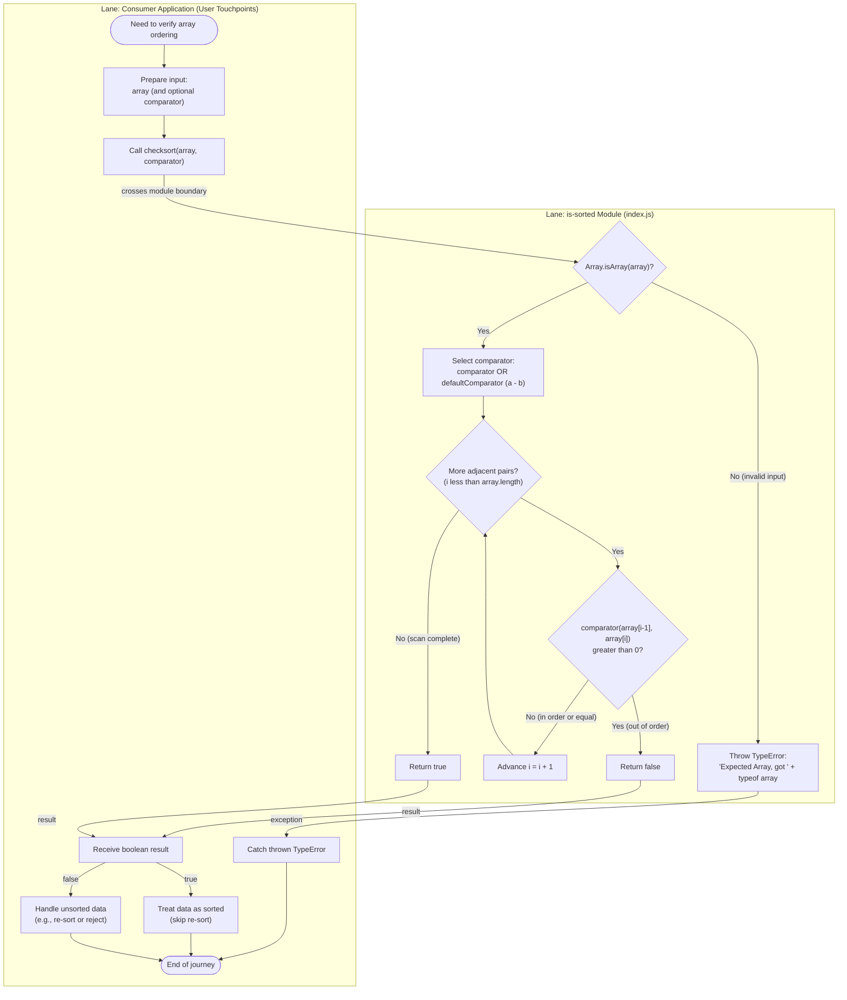
```mermaid
flowchart TB
    subgraph Caller["Lane: Consumer Application (User Touchpoints)"]
        direction TB
        Start([" Need to verify array ordering "])
        Prep["Prepare input:<br/>array (and optional comparator)"]
        Invoke["Call checksort(array, comparator)"]
        Handle["Receive boolean result"]
        Catch["Catch thrown TypeError"]
        UseTrue["Treat data as sorted<br/>(skip re-sort)"]
        UseFalse["Handle unsorted data<br/>(e.g., re-sort or reject)"]
        Done([" End of journey "])
    end
    subgraph Module["Lane: is-sorted Module (index.js)"]
        direction TB
        Guard{"Array.isArray(array)?"}
        Throw["Throw TypeError:<br/>'Expected Array, got ' + typeof array"]
        Select["Select comparator:<br/>comparator OR defaultComparator (a - b)"]
        LoopChk{"More adjacent pairs?<br/>(i less than array.length)"}
        Cmp{"comparator(array[i-1], array[i])<br/>greater than 0?"}
        Adv["Advance i = i + 1"]
        RetFalse["Return false"]
        RetTrue["Return true"]
    end
    Start --> Prep --> Invoke
    Invoke -->|"crosses module boundary"| Guard
    Guard -->|"No (invalid input)"| Throw
    Guard -->|"Yes"| Select
    Select --> LoopChk
    LoopChk -->|"Yes"| Cmp
    Cmp -->|"Yes (out of order)"| RetFalse
    Cmp -->|"No (in order or equal)"| Adv
    Adv --> LoopChk
    LoopChk -->|"No (scan complete)"| RetTrue
    Throw -->|"exception"| Catch
    RetFalse -->|"result"| Handle
    RetTrue -->|"result"| Handle
    Handle -->|"false"| UseFalse
    Handle -->|"true"| UseTrue
    Catch --> Done
    UseTrue --> Done
    UseFalse --> Done
```

**Decision points.** The process contains exactly three decision points, all located in `index.js`:

| Decision Point | Condition (Evidence) | Outcomes | Related Requirement |
|---|---|---|---|
| Input type guard | `Array.isArray(array)` (`index.js` line 6) | `false` → throw `TypeError`; `true` → continue | F-004-RQ-001 |
| Loop continuation | `i < array.length` (`index.js` line 9) | exhausted → `return true`; more pairs → compare | F-001-RQ-001 |
| Order comparison | `comparator(array[i-1], array[i]) > 0` (`index.js` line 10) | `> 0` → `return false` (short-circuit); otherwise advance | F-001-RQ-001, F-003-RQ-002 |

**Error handling path.** The only error state is a non-array first argument, which throws `TypeError('Expected Array, got ' + typeof array)` before any scanning occurs (F-004). The exception propagates synchronously across the module boundary to the caller, whose only recovery option is to catch it and correct the input; the module itself performs no recovery (detailed in **4.4.2 Error Handling**).

**Timing.** The scan is a single left-to-right pass that is linear in the array length with constant additional state and an early return at the first out-of-order pair; empty and singleton arrays complete immediately by returning `true` because the loop begins at index 1 (F-001-RQ-002, F-001-RQ-003). No timing depends on I/O because the process is purely in-memory.

### 4.1.2 Integration Workflows

Because there are no runtime services, the system's integrations are the concrete boundaries enumerated in **2.3.3 Integration Points**: the CommonJS/TypeScript consumption boundary, the test-harness-to-package boundary, the CI-to-npm-scripts boundary, and the Git-submodule-to-upstream boundary. The data that flows across these boundaries is summarized below.

| Integration Boundary | Data / Direction | Mechanism | Evidence |
|---|---|---|---|
| Consumer ↔ package (runtime) | array + optional comparator in; boolean out (or thrown `TypeError`) | CommonJS `module.exports` via `require('is-sorted')`; TypeScript `types` resolution | `index.js`, `package.json` (`main`, `types`), `README.md` |
| Test harness ↔ package | 12 fixtures + `descending` comparator in; assertion results out | `require('../')` executed by `tape test/*.js` | `test/index.js`, `test/fixtures.json`, `package.json` |
| CI ↔ npm scripts | GitHub events in; pass/fail status checks out | Workflow steps invoke `npm test` and `npm run standard` | `.github/workflows/tests.yml`, `package.json` |
| Git submodule ↔ upstream | pinned-commit reference in; `.gitignore` template working tree out | `.gitmodules` `url` resolved by `git submodule update` | `.gitmodules` |

#### 4.1.2.1 Module Consumption Interaction (API Boundary)

The runtime API interaction is a Node.js module resolution followed by a synchronous function call. TypeScript consumers additionally resolve the declaration file (F-005) at compile time. This realizes F-006 (distribution) and F-001–F-004 (behavior).

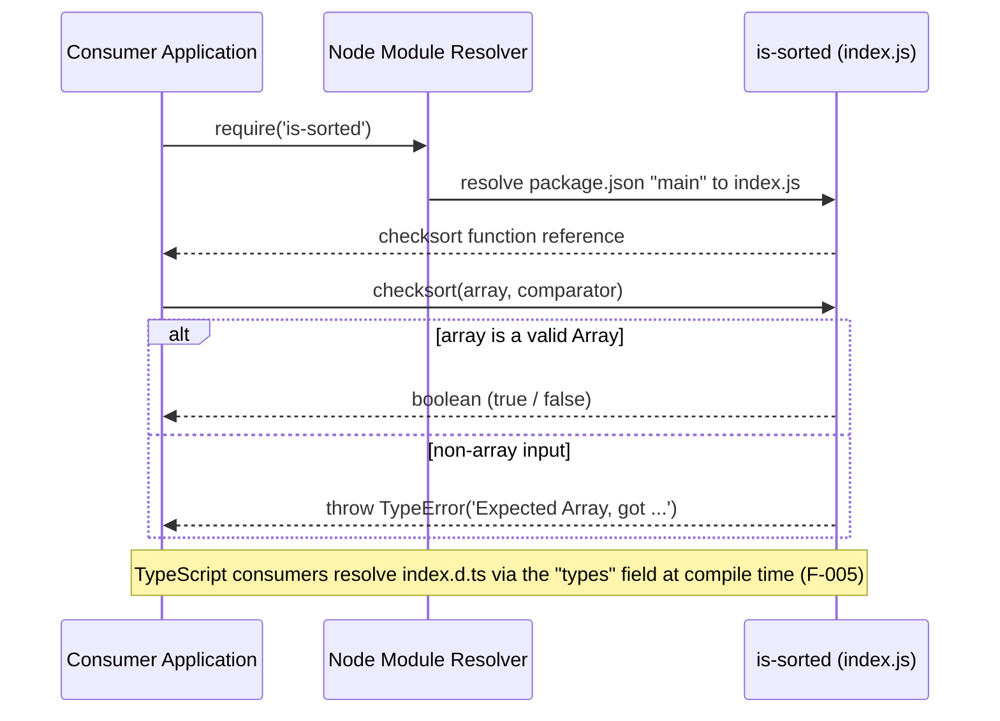
```mermaid
sequenceDiagram
    participant App as Consumer Application
    participant Resolver as Node Module Resolver
    participant Pkg as is-sorted (index.js)
    App->>Resolver: require('is-sorted')
    Resolver->>Pkg: resolve package.json "main" to index.js
    Pkg-->>App: checksort function reference
    App->>Pkg: checksort(array, comparator)
    alt array is a valid Array
        Pkg-->>App: boolean (true / false)
    else non-array input
        Pkg-->>App: throw TypeError('Expected Array, got ...')
    end
    Note over App,Pkg: TypeScript consumers resolve index.d.ts via the "types" field at compile time (F-005)
```

#### 4.1.2.2 Continuous Integration Event Processing

The CI integration is event-driven: a push to `main` or any pull request triggers the `Tests` workflow, which fans out into an independent Node.js version **batch** (the `14.x`/`16.x`/`18.x` matrix, with fail-fast disabled so every entry runs to completion) plus a parallel `standard` style job (F-008, F-009). Each job installs dependencies and runs an npm script, then reports a status check.

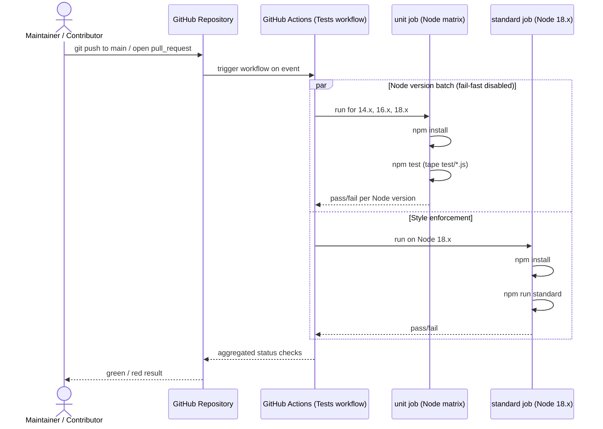
```mermaid
sequenceDiagram
    actor Dev as Maintainer / Contributor
    participant GH as GitHub Repository
    participant GA as GitHub Actions (Tests workflow)
    participant Unit as unit job (Node matrix)
    participant Std as standard job (Node 18.x)
    Dev->>GH: git push to main / open pull_request
    GH->>GA: trigger workflow on event
    par Node version batch (fail-fast disabled)
        GA->>Unit: run for 14.x, 16.x, 18.x
        Unit->>Unit: npm install
        Unit->>Unit: npm test (tape test/*.js)
        Unit-->>GA: pass/fail per Node version
    and Style enforcement
        GA->>Std: run on Node 18.x
        Std->>Std: npm install
        Std->>Std: npm run standard
        Std-->>GA: pass/fail
    end
    GA-->>GH: aggregated status checks
    GH-->>Dev: green / red result
```

#### 4.1.2.3 Git Submodule Composition Workflow

At checkout time, initializing/updating submodules reads the two mount points declared in `.gitmodules` and populates each working tree from the same upstream `.gitignore` templates repository at one identical pinned commit (F-010). This is a Git-level data flow with no runtime effect on the `checksort` function.

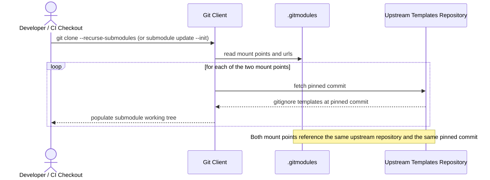
```mermaid
sequenceDiagram
    actor User as Developer / CI Checkout
    participant Git as Git Client
    participant Mods as .gitmodules
    participant Up as Upstream Templates Repository
    User->>Git: git clone --recurse-submodules (or submodule update --init)
    Git->>Mods: read mount points and urls
    loop for each of the two mount points
        Git->>Up: fetch pinned commit
        Up-->>Git: gitignore templates at pinned commit
        Git-->>User: populate submodule working tree
    end
    Note over Mods,Up: Both mount points reference the same upstream repository and the same pinned commit
```

## 4.2 Detailed Process Flows

This section provides a detailed, per-feature decomposition of the process flows introduced in **4.1 System Workflows**. It expands the single control-flow diagram in **2.3.2 Runtime Evaluation Process Flow** by breaking out comparator selection (F-002/F-003), annotating loop mechanics and timing, isolating the validation/error path (F-004), and adding the development-time verification batch (F-007). Every node below corresponds to a specific line of `index.js` or `test/index.js`.

### 4.2.1 Sortedness Evaluation Process (F-001, F-002, F-003)

The core evaluation combines three features in one function body: the input-validation guard hands off to a one-time **comparator-selection** decision (default ascending `a - b` for F-002, or the caller's comparator for F-003), after which the single-pass **scan** (F-001) inspects adjacent pairs until it either short-circuits on the first disorder or exhausts the array. The array length is read once into a loop-local `length` variable (`index.js` line 9), and the loop starts at index 1 so that empty and singleton arrays return `true` without any comparison.

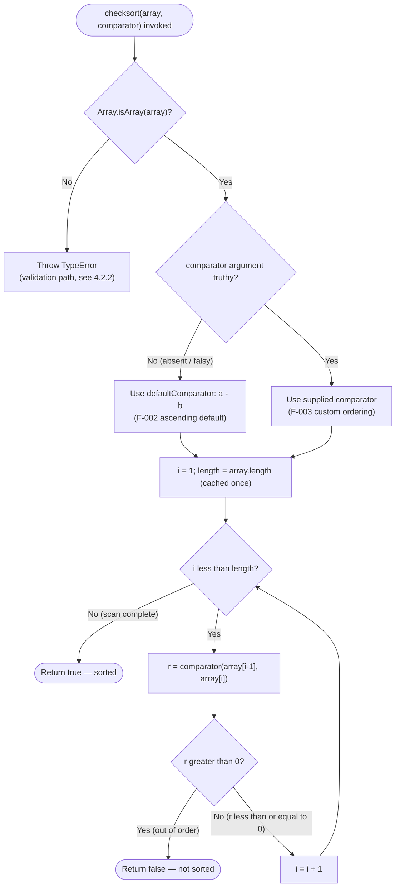
```mermaid
flowchart TD
    Start([" checksort(array, comparator) invoked "]) --> Guard{"Array.isArray(array)?"}
    Guard -->|"No"| Err["Throw TypeError<br/>(validation path, see 4.2.2)"]
    Guard -->|"Yes"| CompSel{"comparator argument truthy?"}
    CompSel -->|"No (absent / falsy)"| DefCmp["Use defaultComparator: a - b<br/>(F-002 ascending default)"]
    CompSel -->|"Yes"| CustCmp["Use supplied comparator<br/>(F-003 custom ordering)"]
    DefCmp --> InitI["i = 1; length = array.length (cached once)"]
    CustCmp --> InitI
    InitI --> Cond{"i less than length?"}
    Cond -->|"No (scan complete)"| RetTrue([" Return true — sorted "])
    Cond -->|"Yes"| Compare["r = comparator(array[i-1], array[i])"]
    Compare --> Disorder{"r greater than 0?"}
    Disorder -->|"Yes (out of order)"| RetFalse([" Return false — not sorted "])
    Disorder -->|"No (r less than or equal to 0)"| Incr["i = i + 1"]
    Incr --> Cond
```

**Grounding and requirements.** Comparator selection is `comparator = comparator || defaultComparator` at `index.js` line 7 (F-002-RQ-001, F-003-RQ-001); the scan and short-circuit are `index.js` lines 9–11 (F-001-RQ-001, F-003-RQ-002); the terminal `return true` is line 13 (F-001-RQ-002). Because equal adjacent values yield `r === 0` (not `> 0`), duplicates such as `[1, 1, 3, 4, 5]` pass (F-001-RQ-002). The scan is non-mutating — it only reads `array[i-1]` and `array[i]` (F-001-RQ-003).

### 4.2.2 Input Validation and Error Path (F-004)

Input validation is the first step of the function and the system's only error-producing branch. When `Array.isArray(array)` is `false`, the function constructs a message from `typeof array` and throws a `TypeError` before any comparator selection or scanning occurs (`index.js` line 6). The diagram traces both the internal decision and the downstream propagation options available to the caller.

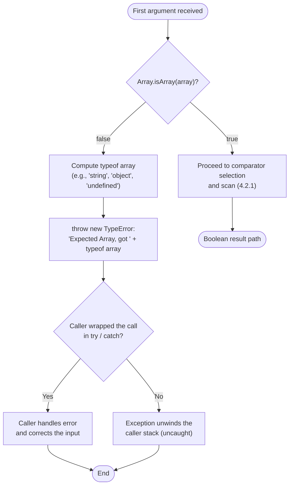
```mermaid
flowchart TD
    In([" First argument received "]) --> Check{"Array.isArray(array)?"}
    Check -->|"true"| Pass["Proceed to comparator selection<br/>and scan (4.2.1)"]
    Check -->|"false"| Build["Compute typeof array<br/>(e.g., 'string', 'object', 'undefined')"]
    Build --> Throw["throw new TypeError:<br/>'Expected Array, got ' + typeof array"]
    Throw --> Propagate{"Caller wrapped the call<br/>in try / catch?"}
    Propagate -->|"Yes"| Recover["Caller handles error<br/>and corrects the input"]
    Propagate -->|"No"| Unwind["Exception unwinds the<br/>caller stack (uncaught)"]
    Pass --> Ok([" Boolean result path "])
    Recover --> End([" End "])
    Unwind --> End
```

**Grounding and requirements.** The guard and message correspond exactly to `index.js` line 6 (F-004-RQ-001). The behavior is verified by the dedicated assertion `t.throws(() => sorted('foobar'), /Expected Array, got string/)` at `test/index.js` lines 17–22 (F-007-RQ-002). The module performs no internal recovery: throwing is fail-fast, and any recovery is the caller's responsibility (elaborated in **4.4.2 Error Handling**).

### 4.2.3 Data-Driven Test Execution (F-007)

The development-time verification flow is a **batch** that iterates the 12 records in `test/fixtures.json`, registering one Tape test per record (each planning exactly one assertion), then registers one additional non-array assertion. It is launched by the `test` npm script (`tape test/*.js`) and, in CI, by the `unit` job (F-008). For fixtures without a `comparator` selector, `comparators[f.comparator]` evaluates to `undefined`, which drives the F-002 default-order path inside `checksort`.

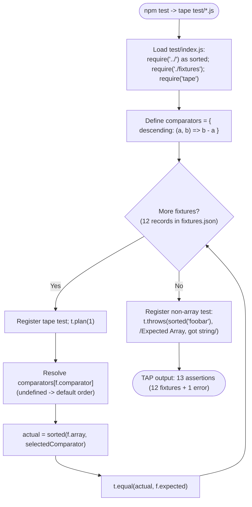
```mermaid
flowchart TD
    Start([" npm test -> tape test/*.js "]) --> Load["Load test/index.js:<br/>require('../') as sorted; require('./fixtures'); require('tape')"]
    Load --> Def["Define comparators = { descending: (a, b) => b - a }"]
    Def --> Iter{"More fixtures?<br/>(12 records in fixtures.json)"}
    Iter -->|"Yes"| Reg["Register tape test; t.plan(1)"]
    Reg --> Sel["Resolve comparators[f.comparator]<br/>(undefined -> default order)"]
    Sel --> Run["actual = sorted(f.array, selectedComparator)"]
    Run --> Assert["t.equal(actual, f.expected)"]
    Assert --> Iter
    Iter -->|"No"| Extra["Register non-array test:<br/>t.throws(sorted('foobar'), /Expected Array, got string/)"]
    Extra --> Report([" TAP output: 13 assertions (12 fixtures + 1 error) "])
```

**Grounding and requirements.** The fixture iteration and single-assertion plan correspond to `test/index.js` lines 8–15 (F-007-RQ-001); the non-array assertion to lines 17–22 (F-007-RQ-002). The 12 fixtures comprise eight default-order pass cases, two `descending` pass cases, and two deliberately failing cases (`test/fixtures.json`), collectively exercising F-001–F-004 and confirming the success criteria in **1.2.3 Success Criteria**.

## 4.3 Validation Rules and Timing Considerations

This section enumerates the business rules, data-validation requirements, authorization considerations, and compliance checks that govern the workflows in **4.1** and **4.2**, then documents the timing characteristics that apply. All rules are drawn directly from `index.js`, the manifest, the CI workflow, and the licensing files; none are inferred.

### 4.3.1 Validation Rules

**Runtime validation and business rules.** The `checksort` process applies the following rules in the order they are encountered, mirroring the decision points in **4.1.1** and **4.2.1**.

| Workflow Step | Rule Category | Rule (Evidence) | Requirement |
|---|---|---|---|
| Input guard | Data validation | Input must satisfy `Array.isArray(array)`; otherwise a `TypeError` is thrown before scanning (`index.js` line 6) | F-004-RQ-001 |
| Comparator selection | Business rule | An absent or falsy comparator resolves to the ascending default `a - b` (`index.js` line 7) | F-002-RQ-001 |
| Comparator selection | Trust boundary | A supplied comparator is executed as given with no sandboxing; its correctness — including `NaN`/`undefined` handling — is the caller's responsibility (per **2.2.3 F-003**) | F-003-RQ-001 |
| Scan comparison | Business rule | Only a comparator result `> 0` marks disorder; an equal pair (`=== 0`) passes (`index.js` line 10) | F-001-RQ-001 |
| Loop bounds | Business rule | Empty and singleton arrays are treated as sorted because the loop begins at index 1 (`index.js` line 9) | F-001-RQ-002 |
| Result | Business rule | The function returns a boolean only; it never reorders the input or reports which element is out of order (`index.js` line 13) | F-001-RQ-003 |

**Authorization checkpoints.** There are **none**. `checksort` is a pure, in-process library call with no authentication, session, role, permission, or access-control logic anywhere in the repository (consistent with **2.3.4 Shared Components and Common Services**). The single security-relevant boundary is that the caller-supplied comparator (F-003) runs with the caller's own privileges and is not sandboxed — a caller trust boundary rather than an authorization gate.

**Regulatory compliance checks.** There are **no** regulatory-compliance checks embedded in the runtime. The only compliance dimension present is licensing: the parent `is-sorted` package is distributed under MIT (`LICENSE`), while the vendored Git-submodule `.gitignore` templates are CC0 1.0 Universal (per **2.1.5.1 F-010**). Development-time code-style compliance (JavaScript Standard Style) is enforced separately by F-009.

**Development- and delivery-plane validation gates.** Outside the runtime, the repository enforces the following gates before a change is considered good:

| Gate | Rule (Evidence) | Requirement |
|---|---|---|
| `unit` CI job | All fixtures must pass on Node.js `14.x`, `16.x`, and `18.x`, with fail-fast disabled so every version is validated (`.github/workflows/tests.yml`) | F-008-RQ-001 |
| `standard` CI job | Source must pass JavaScript Standard Style via `npm run standard` (`.github/workflows/tests.yml`, `package.json`) | F-008-RQ-002, F-009-RQ-001 |
| Submodule integrity | Both `.gitmodules` mount points must resolve to one identical pinned commit (per **1.2.3 Success Criteria**) | F-010-RQ-001 |

### 4.3.2 Timing and SLA Considerations

Per **1.2.3 Success Criteria**, the repository defines **no formal external service-level agreements or business KPIs**. The only meaningful "timing constraints" are therefore the algorithmic characteristics of the synchronous, in-memory `checksort` scan, and the (implicit) execution behavior of the CI workflow.

| Aspect | Characteristic | Evidence |
|---|---|---|
| Best-case runtime | `O(1)` — empty/singleton array, or the first adjacent pair is out of order (early return) | `index.js` lines 9–10 |
| Worst-case runtime | `O(n)` — a fully in-order array is scanned end to end | `index.js` lines 9–13 |
| Additional space | `O(1)` — only a loop index and the cached `length` | `index.js` line 9 |
| Per-comparison cost | Constant for the default `a - b`; equal to the caller's comparator cost for F-003 | `index.js` lines 1–2, 10 |
| Concurrency / blocking | Fully synchronous; no I/O, network, timers, or async work | `index.js` (no imports; per **2.3.4**) |
| External SLA / KPI | None defined in the repository | **1.2.3** |
| CI timing | No explicit `timeout-minutes`, `concurrency`, or caching declared; matrix entries run independently | `.github/workflows/tests.yml` |

Because the runtime performs no I/O, its latency is bounded solely by array length and comparator cost — there is no network, disk, or lock contention to model. For the CI plane, the workflow declares no explicit timeout, so the GitHub Actions platform default applies; the practical wall-clock time is dominated by `npm install` and the fast, 13-assertion Tape run.

## 4.4 State Management and Error Handling

This section documents how the system manages state and handles errors across both the runtime plane (the `checksort` function) and the development/delivery plane (tests and CI). Because the runtime is a pure, dependency-free function, most enterprise state-management and error-handling concerns (persistence, distributed transactions, retry/backoff, circuit breakers) are simply **absent**; this section states that explicitly and documents the small set of mechanisms that do exist.

### 4.4.1 State Management

**State transitions.** Within a single `checksort` invocation, the only mutable state is the loop index `i` and the one-time cached `length` (`index.js` line 9). The evaluation moves through a small, deterministic sequence of internal states — validating → selecting the comparator → scanning → terminal (returned or thrown) — formalized in the state-transition diagram in **4.5 State Transition Diagrams**. No state survives beyond the call.

**Data persistence points.** There are **none** at runtime. The function reads the caller's in-memory array and produces a boolean; it writes nothing to disk, database, cache, or network (per **2.3.4 Shared Components and Common Services** and **3.5 Databases & Storage**). The only data at rest in the repository is static and read-only: the test inputs in `test/fixtures.json` and the vendored `.gitignore` templates in the two submodule working trees. The input array is never persisted or copied — it is inspected in place and left unchanged (F-001-RQ-003).

**Caching requirements.** The runtime uses exactly one micro-optimization that resembles caching: the array length is read once into a loop-local `length` variable so `array.length` is not re-evaluated each iteration (`index.js` line 9). There is no result memoization, no shared cache, and no external caching layer. On the CI plane, the workflow configures **no** dependency caching (there is no `actions/cache` step in `.github/workflows/tests.yml`), so every job performs a fresh `npm install`.

**Transaction boundaries.** There are no database or distributed transactions. The transactional unit is the single synchronous function call itself: it is effectively atomic and side-effect-free — it either returns a boolean or throws, and because it never mutates the input there is no partial state to roll back. Each Git submodule checkout is likewise an independent, idempotent update to a pinned commit (F-010).

### 4.4.2 Error Handling

**Retry mechanisms.** There are **no** runtime retries — an invalid input throws immediately and the call ends. On the CI plane, `fail-fast: false` in the `unit` matrix ensures that a failure on one Node.js version does not cancel the others, so every version runs to completion (`.github/workflows/tests.yml`); this is independent continuation, not automatic retry, and no backoff or retry policy exists anywhere in the repository.

**Fallback processes.** The single fallback is comparator resolution: when the `comparator` argument is absent or falsy, the function falls back to the private ascending `defaultComparator` (`comparator = comparator || defaultComparator`, `index.js` line 7; F-002). There is no fallback for invalid input — validation is fail-fast by design (F-004).

**Error notification flows.** At runtime, the error notification *is* the thrown `TypeError('Expected Array, got ' + typeof array)`, which propagates synchronously to the caller (F-004). At development time, this behavior is asserted by `t.throws(...)` in `test/index.js` (F-007-RQ-002); in CI, any failed assertion or lint violation surfaces as a red GitHub status check that notifies the maintainer on the push/PR (F-008).

**Recovery procedures.** Recovery is manual and plane-specific: a runtime caller recovers by catching the `TypeError` and correcting the input before calling again; a maintainer recovers from a red CI run by fixing the source or a fixture and pushing again, which re-triggers the workflow. The following flowchart shows both recovery loops.

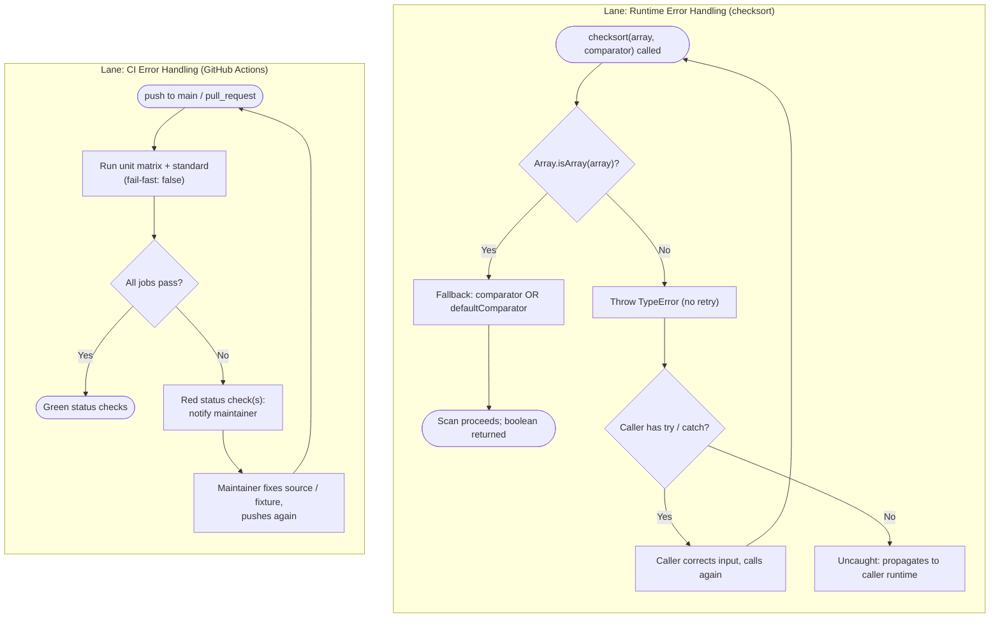
```mermaid
flowchart TB
    subgraph RT["Lane: Runtime Error Handling (checksort)"]
        direction TB
        Call([" checksort(array, comparator) called "])
        Valid{"Array.isArray(array)?"}
        Fb["Fallback: comparator OR defaultComparator"]
        Result([" Scan proceeds; boolean returned "])
        Throw["Throw TypeError (no retry)"]
        CallerCatch{"Caller has try / catch?"}
        CallerFix["Caller corrects input, calls again"]
        Crash["Uncaught: propagates to caller runtime"]
    end
    subgraph CI["Lane: CI Error Handling (GitHub Actions)"]
        direction TB
        Push([" push to main / pull_request "])
        RunJobs["Run unit matrix + standard<br/>(fail-fast: false)"]
        JobRes{"All jobs pass?"}
        Green([" Green status checks "])
        Red["Red status check(s):<br/>notify maintainer"]
        FixPush["Maintainer fixes source / fixture,<br/>pushes again"]
    end
    Call --> Valid
    Valid -->|"Yes"| Fb --> Result
    Valid -->|"No"| Throw --> CallerCatch
    CallerCatch -->|"Yes"| CallerFix --> Call
    CallerCatch -->|"No"| Crash
    Push --> RunJobs --> JobRes
    JobRes -->|"Yes"| Green
    JobRes -->|"No"| Red --> FixPush --> Push
```

## 4.5 State Transition Diagrams

Although `is-sorted` holds no long-lived state, each unit of work moves through a well-defined lifecycle of internal states. This section formalizes two such lifecycles as state-transition diagrams: the runtime evaluation performed by `checksort`, and a single CI job. Both are grounded in `index.js` and `.github/workflows/tests.yml` respectively.

### 4.5.1 checksort Evaluation Lifecycle

A single invocation transitions from validation, through a one-time comparator selection, into the scanning loop, and finally to exactly one of three terminal outcomes: `Rejected` (a thrown `TypeError`), `Sorted` (`return true`), or `Unsorted` (`return false`). The self-loop between `Scanning` and `Comparing` represents the adjacent-pair iteration.

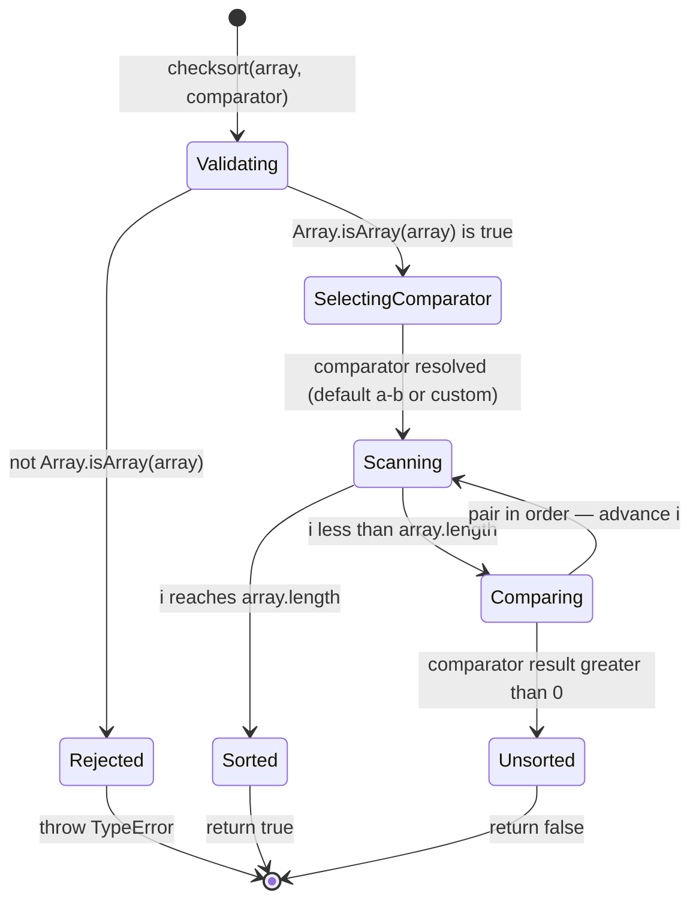
```mermaid
stateDiagram-v2
    [*] --> Validating: checksort(array, comparator)
    Validating --> Rejected: not Array.isArray(array)
    Validating --> SelectingComparator: Array.isArray(array) is true
    SelectingComparator --> Scanning: comparator resolved (default a-b or custom)
    Scanning --> Comparing: i less than array.length
    Comparing --> Scanning: pair in order — advance i
    Comparing --> Unsorted: comparator result greater than 0
    Scanning --> Sorted: i reaches array.length
    Rejected --> [*]: throw TypeError
    Sorted --> [*]: return true
    Unsorted --> [*]: return false
```

**Grounding.** `Validating` is the `Array.isArray` guard (`index.js` line 6, F-004); `SelectingComparator` is `comparator || defaultComparator` (line 7, F-002/F-003); `Scanning`/`Comparing` are the loop and comparison (lines 9–11, F-001); the three terminal transitions are lines 6, 13, and 10 respectively. Empty and singleton arrays transition directly from `Scanning` to `Sorted` because the loop condition is immediately false (F-001-RQ-002).

### 4.5.2 CI Job Lifecycle

Each CI job (both the `unit` matrix entries and the `standard` job) follows the lifecycle below, from being triggered by a GitHub event through installation and script execution to a terminal `Passed`/`Failed` status check. In the `unit` job this lifecycle runs independently once per Node.js version (`14.x`, `16.x`, `18.x`) because fail-fast is disabled.

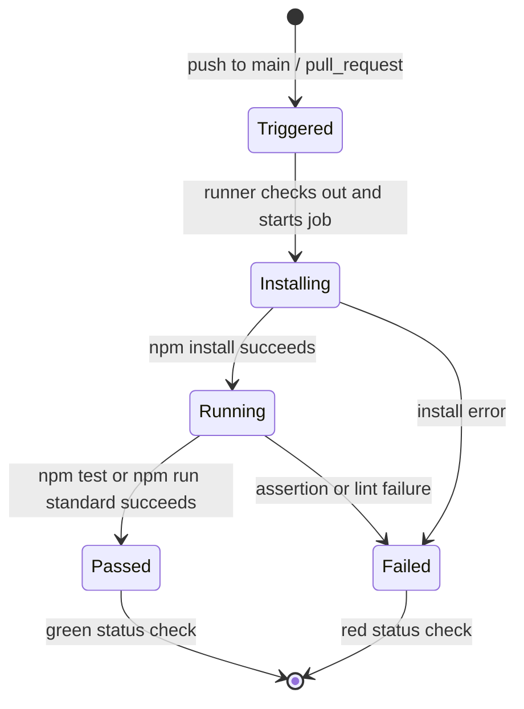
```mermaid
stateDiagram-v2
    [*] --> Triggered: push to main / pull_request
    Triggered --> Installing: runner checks out and starts job
    Installing --> Running: npm install succeeds
    Installing --> Failed: install error
    Running --> Passed: npm test or npm run standard succeeds
    Running --> Failed: assertion or lint failure
    Passed --> [*]: green status check
    Failed --> [*]: red status check
```

**Grounding.** The trigger events, checkout/setup, `npm install`, and the `npm test` / `npm run standard` steps are all declared in `.github/workflows/tests.yml` (F-008, F-009). The workflow declares no retry, so a `Failed` job is terminal until a new push re-triggers the lifecycle (per **4.4.2 Error Handling**).

## 4.6 References

The following repository files and folders were inspected directly and cited as evidence for the workflows, diagrams, rules, and lifecycles documented in this section.

**Repository files**
- `index.js` - Established the entire `checksort` control flow: the `Array.isArray` guard (line 6), comparator selection `comparator || defaultComparator` (line 7), the single-pass scan and `> 0` short-circuit (lines 9–11), the terminal `return true` (line 13), and the private `defaultComparator` (lines 1–3); source for all decision points, state transitions, timing, and the error path.
- `index.d.ts` - Established the TypeScript declaration (`checksort<T = any>`, `export = checksort`) resolved by consumers at compile time (F-005), used in the module-consumption sequence.
- `package.json` - Established the `main`/`types` entry points used during module resolution, the `test` (`tape test/*.js`) and `standard` npm scripts invoked by the test and CI flows, and the zero-runtime-dependency profile.
- `test/index.js` - Established the data-driven test-execution flow: `require('../')`, the `descending` comparator, per-fixture `t.plan(1)`/`t.equal` iteration, and the non-array `t.throws` assertion.
- `test/fixtures.json` - Established the 12 fixture records that drive the verification batch (eight default-order pass, two `descending` pass, two deliberately failing).
- `.github/workflows/tests.yml` - Established the CI event triggers (push to `main`, `pull_request`), the `unit` Node.js matrix (`14.x`/`16.x`/`18.x`, fail-fast disabled), the `standard` job (Node `18.x`), the job steps, and the absence of explicit timeout/cache/concurrency.
- `README.md` - Established the consumer usage examples (`require('is-sorted')`, `sorted([1, 2, 3])`, custom-comparator call) that inform the consumption workflow.
- `.gitmodules` - Established the two submodule mount points referencing the same upstream repository, used in the Git submodule composition workflow.
- `LICENSE` - Established the MIT distribution terms referenced in the compliance discussion.

**Repository folders**
- `test/` - Contained the Tape test suite (runner and fixtures) underlying the test-execution flow.
- `.github/workflows/` - Contained the GitHub Actions workflow definition underlying the CI event-processing and CI job lifecycle.
- `Parent_repo_for_submodule/` - Contained one pinned submodule working tree of GitHub's `.gitignore` templates (read-only data at rest).
- `submodule_for_Parent_repo_for_submodule-Public/` - Contained the second, byte-identical pinned submodule working tree of the same `.gitignore` templates.

**Cross-referenced Technical Specification sections**
- **1.2.2 High-Level Description** and **1.2.3 Success Criteria** - Component/consumer framing and the explicit statement that no formal SLAs/KPIs are defined.
- **2.1 Feature Catalog** (features F-001–F-010, including **2.1.5.1 F-010**) - Feature identifiers and categories referenced throughout the diagrams.
- **2.2 Functional Requirements** (requirement IDs `F-XXX-RQ-YYY`, including **2.2.3 F-003**) - Requirement anchors and the caller-comparator trust boundary.
- **2.3.2 Runtime Evaluation Process Flow**, **2.3.3 Integration Points**, and **2.3.4 Shared Components and Common Services** - The baseline control-flow diagram this section expands, the integration boundaries, and the "no runtime services" basis.
- **3.5 Databases & Storage** - The basis for the "no persistence layer" statements in state management.

# 5. System Architecture

## 5.1 High-Level Architecture

This section describes the architecture of the `is-sorted` system as it actually exists in the repository. Every claim is grounded in the manifest (`package.json`), the runtime source (`index.js`), the type declaration (`index.d.ts`), the test harness (`test/`), the CI configuration (`.github/workflows/tests.yml`), and the submodule declaration (`.gitmodules`). The architecture is intentionally minimal: the shipped runtime is a single 14-line function, and the surrounding structure exists to verify, package, and compose it.

### 5.1.1 System Overview

**Architecture Style and Rationale.** The system is a **single-module, zero-runtime-dependency, synchronous, in-process utility library** (a "micro-library" / focused-primitive style), packaged for the Node.js / npm ecosystem and consumed through a CommonJS `require()` call. The entire runtime product is one exported function — `checksort(array, comparator)` defined in `index.js` and published under the package identity `is-sorted` version `1.0.5` (`package.json`). There is deliberately no client-server topology, no service tier, no network listener, no message broker, and no long-running process: the library executes entirely inside the caller's process and returns a boolean (or throws). This style is a direct fit for the problem — JavaScript provides `Array.prototype.sort` but no predicate to test whether an array is *already* ordered, so the package fills exactly that gap with a compact primitive that consumers can adopt without importing a large general-purpose utility library.

Layered *around* the library is a distinct repository-composition concern. The parent repository declares two Git submodule mount points in `.gitmodules` (`Parent_repo_for_submodule/` and `submodule_for_Parent_repo_for_submodule-Public/`) that both reference the same upstream repository — a vendored copy of GitHub's `.gitignore` template collection — and both resolve to one identical pinned commit (`dcc0fc7bc2b5ba480cf117ad1be31bafceeaff46`). This is a **static-data composition pattern** (vendoring read-only reference content), not a runtime dependency of the library, and the architecture keeps the two concerns cleanly separated.

**Key Architectural Principles and Patterns.** The following principles are evidenced directly in the codebase:

- **Single Responsibility / single primitive** — the runtime is exactly one exported function that performs one job (sortedness evaluation); `index.js` has no classes, no top-level mutable state, and no auxiliary public API.
- **Zero-dependency minimalism** — `package.json` declares no `dependencies`, `peerDependencies`, or `optionalDependencies`; the only third-party packages are the dev-time `tape` (`^5.0.0`) and `standard` (`*`), which never ship to consumers.
- **Strategy via comparator injection (inversion of control)** — ordering semantics are delegated to a caller-supplied `comparator(a, b)`; when none is supplied, the private `defaultComparator` (`a - b`, ascending numeric) is used (`index.js`).
- **Fail-fast validation at the trust boundary** — a single `Array.isArray` guard throws `TypeError('Expected Array, got ' + typeof array)` before any element is inspected (`index.js`).
- **Pure, stateless, non-mutating computation** — the function reads the caller's array in place in a single left-to-right pass, allocates nothing, mutates nothing, and holds no state beyond the call (linear time, constant extra state).
- **Dual publication interface** — a CommonJS runtime entry point (`main` → `index.js`) and a TypeScript declaration entry point (`types` → `index.d.ts`) serve both plain-JavaScript and typed consumers from the same package.
- **Data-driven verification** — `test/index.js` generates one Tape assertion per case in `test/fixtures.json`, keeping test logic and test data separate.
- **Cross-runtime portability via a CI matrix** — the `unit` job runs the suite across Node.js `14.x`, `16.x`, and `18.x` with `fail-fast: false` (`.github/workflows/tests.yml`).
- **Vendored static-data composition** — Git submodules pin external reference content to an immutable commit rather than copying files into the tree or depending on it at runtime.

**System Boundaries and Major Interfaces.** The **package boundary** encloses what is published and executed: the runtime module (`index.js`), the type declaration (`index.d.ts`), and the manifest metadata (`package.json`). Everything else in the repository — the Tape suite (`test/`), the GitHub Actions workflow (`.github/workflows/tests.yml`), the documentation/legal files (`README.md`, `LICENSE`), and the two submodule working trees — supports development, verification, and composition but is **not** part of the shipped runtime. The system therefore operates on two planes, using terminology consistent with **4.4 State Management and Error Handling**:

- **Runtime plane** — a single synchronous `checksort` function call executing inside the consumer's host process.
- **Development / delivery plane** — npm scripts orchestrating `tape` and `standard`, executed locally and by the GitHub Actions runner.

The major interfaces that cross these boundaries are:

| Interface | Direction / Boundary | Contract (Evidence) |
|---|---|---|
| CommonJS module export | Consumer → runtime | `module.exports = checksort`, loaded via `require('is-sorted')` (`index.js`, `package.json` `main`) |
| TypeScript declaration | Typed consumer → types | `export = checksort`; generic `checksort<T = any>(...)` (`index.d.ts`, `package.json` `types`) |
| Comparator callback | Runtime → caller code | Optional `comparator(a, b)` returning a numeric ordering value (`index.js`) |
| npm distribution | Registry ↔ ecosystem | `name`/`main`/`types` define the published surface (`package.json`) |
| Test-harness linkage | Suite → package root | `require('../')` executed by `tape test/*.js` (`test/index.js`) |
| CI ↔ npm scripts | Runner → package | `npm test` and `npm run standard` (`.github/workflows/tests.yml`) |
| Git submodule gitlink | Repo → upstream | `.gitmodules` `url` resolved by `git submodule` to a pinned commit |

### 5.1.2 Core Components

The system decomposes into six architectural components plus documentation/legal artifacts. The table below (limited to four columns) summarizes each; per-component **critical considerations** follow as bullet points. This complements the component/consumer diagram in **1.2.2 High-Level Description** by focusing on responsibilities, dependencies, and integration surfaces.

| Component | Primary Responsibility | Key Dependencies | Integration Points |
|---|---|---|---|
| `checksort` Core Module (`index.js`) | Validate input and evaluate array sortedness via a single-pass adjacent-pair scan | None (dependency-free; uses built-in `Array.isArray`) | Exposed by `module.exports`; consumed via `require('is-sorted')` and by the test suite's `require('../')` |
| Type Declaration (`index.d.ts`) | Declare the ambient generic signature for typed consumers | None (mirrors the `checksort` signature) | Resolved via `package.json` `types`; `export = checksort` |
| Package Manifest (`package.json`) | Declare identity, entry points, scripts, and dev dependencies | Dev-only: `tape` `^5.0.0`, `standard` `*` | npm registry; `test`/`standard` scripts invoked by CI |
| Test Harness (`test/index.js`, `test/fixtures.json`) | Data-driven Tape assertions plus a non-array error assertion | `tape`; `fixtures.json`; package root via `require('../')` | `npm test` → `tape test/*.js`; executed by CI `unit` job |
| CI Workflow (`.github/workflows/tests.yml`) | Run the unit matrix and the style-lint job on push/PR | GitHub Actions runner; `actions/checkout@main`, `actions/setup-node@main`; npm | Invokes `npm test` and `npm run standard`; emits GitHub status checks |
| Git Submodule Collection (`.gitmodules` + two mount points) | Vendor a pinned copy of GitHub's `.gitignore` template catalog | `git`; upstream public repository | Gitlink resolved by `git submodule`; both mount points → one identical commit |

**Critical considerations (per component):**

- **`checksort` Core Module** — the caller-supplied comparator is executed **as-is with no sandboxing**, forming a caller trust boundary (consistent with **2.2 Functional Requirements**); ordering correctness depends on the comparator following the numeric convention (a result **greater than zero** marks a pair out of order); the CI-declared Node.js targets (`14.x`/`16.x`/`18.x`) are all past their official end-of-life, so validation covers only runtimes that no longer receive security patches.
- **Type Declaration** — the declaration omits an explicit return-type annotation, so the boolean result is implicit at the declaration level.
- **Package Manifest** — `standard` is pinned to the floating range `*` and `tape` to `^5.0.0`, and no lockfile is committed (`.gitignore` ignores `node_modules`), so development-time installs are **not byte-for-byte reproducible**.
- **Test Harness** — fixtures cover only numeric arrays; a fixture with no `comparator` selector intentionally resolves to `undefined`, exercising the default ascending path.
- **CI Workflow** — the reusable actions are referenced at the **mutable `@main` ref** rather than pinned SHAs; the workflow declares no explicit `permissions` block and **no dependency caching**, so every job performs a fresh `npm install`.
- **Git Submodule Collection** — the two mount points hold **byte-identical** content and are licensed **CC0-1.0** (distinct from the root package's **MIT** license); the vendored templates are read-only data and are not referenced by any runtime or test code.

### 5.1.3 Data Flow Description

**Primary data flows.** Three distinct flows exist, matching the two operating planes plus the composition concern:

- **Runtime plane (in-process).** The caller passes an in-memory array — and optionally a comparator function — across the CommonJS boundary into `checksort`. The function resolves the comparator, then iterates adjacent element pairs; for each pair the two elements flow *out* to the caller's comparator and a numeric result flows *back*. The function returns a boolean to the caller, or throws a `TypeError` if the input is not an array. No data leaves the host process, is serialized, or is written anywhere.
- **Development / delivery plane.** `test/fixtures.json` (static JSON) is loaded by `test/index.js`, which also loads the package root via `require('../')`; each fixture is transformed into a Tape assertion whose result is emitted as a TAP stream. In CI, a GitHub push/PR event triggers the runner, which checks out the repository, runs `npm install` (pulling `tape` and `standard` from the npm registry over HTTPS), and executes `npm test` / `npm run standard`; pass/fail results surface as GitHub status checks.
- **Composition plane.** `git submodule` reads the `url` and pinned commit recorded via `.gitmodules`, then fetches and checks out the `.gitignore` template working trees into both mount points.

**Integration patterns and protocols.** The runtime integration pattern is a **synchronous in-process function call** over CommonJS module linkage (no serialization, no network). Ordering is integrated through a **callback / strategy injection** pattern (the comparator). The test tier uses **file-based data loading** (JSON `require`) and **process/CLI invocation** through npm scripts (`tape`, `standard`). External, development-time protocols are **HTTPS** (Git submodule fetch and npm registry retrieval) and GitHub Actions' **event-driven trigger** model (`push` to `main`, `pull_request`).

**Data transformation points.** The transformations are few and well-bounded:

- Array + comparator **→** boolean verdict (the core transformation in `index.js`).
- `typeof array` **→** error-message string embedded in the thrown `TypeError` (the validation path).
- `fixtures.json` records **→** one generated Tape test per case (`test/index.js`).
- Test execution **→** TAP output **→** CI pass/fail **→** GitHub status check.

**Key data stores and caches.** There is **no runtime data store and no runtime cache**. Consistent with **4.4.1 State Management** and **3.5 Databases & Storage**, the only data at rest in the repository is static and read-only: the test inputs in `test/fixtures.json` and the vendored `.gitignore` templates in the two submodule working trees. The single caching-like optimization is a loop-local `length` variable read once per invocation (`index.js`); there is no result memoization, no shared cache, and no external caching layer. On the CI plane there is no dependency cache configured, so each job reinstalls dependencies from the npm registry.

### 5.1.4 External Integration Points

The library performs pure in-memory computation and consumes **no third-party runtime services** (consistent with **3.4 Third-Party Services**). All external integration is confined to the development/delivery and composition planes. The table below (limited to four columns) merges the "data exchange pattern" and "protocol/format" dimensions into a single column for concision.

| System | Integration Type | Exchange Pattern & Protocol / Format | SLA / Availability |
|---|---|---|---|
| GitHub (SCM + Actions CI) | Source hosting, issue tracking, hosted CI compute | Event-driven trigger on `push`/`pull_request`; Git and workflow dispatch over HTTPS; YAML workflow definition | No formal SLA defined in the repository; depends on GitHub platform availability |
| npm registry | Package distribution + devDependency source | On-demand pull/publish over HTTPS; tarball artifact + JSON metadata | No formal SLA defined; depends on npm registry availability |
| Git submodule upstream (`github/gitignore` fork) | Repository composition (vendored static data) | `git submodule` fetch/checkout over HTTPS to a pinned commit | No SLA; content is pinned/immutable at commit `dcc0fc7…` |
| GitHub Actions (`checkout`, `setup-node`; `stale` in submodule) | Reusable CI building blocks | Referenced by ref in YAML, fetched at workflow run | No SLA; `checkout`/`setup-node` pinned at the mutable `@main` ref |

**No runtime external integrations exist.** Consistent with **3.4.3**, the following categories are deliberately absent: authentication / identity providers, monitoring / observability (APM, error-tracking, metrics) services, cloud services (AWS, GCP, Azure), and external runtime APIs. The module has no HTTP client and performs no outbound I/O.

**No formal external SLAs or KPIs are defined.** As documented in **1.2.3 Success Criteria**, the repository defines no service-level agreements or business KPIs; its only enforceable targets are the observable quality gates (green tests across the Node matrix, passing `standard` lint, zero runtime dependencies, and both submodules resolving to one identical pinned commit). The "SLA / Availability" column above therefore records the absence of formal agreements rather than negotiated guarantees.


## 5.2 Component Details

This section details each major component: its purpose, the technologies it uses, its key interfaces, its data-persistence requirements, and its scaling characteristics. The diagram below shows how the components interact across the runtime, development/delivery, and composition planes, with each edge labeled by the *interface* it represents. It complements — rather than repeats — the responsibility-oriented component diagram in **1.2.2 High-Level Description**.

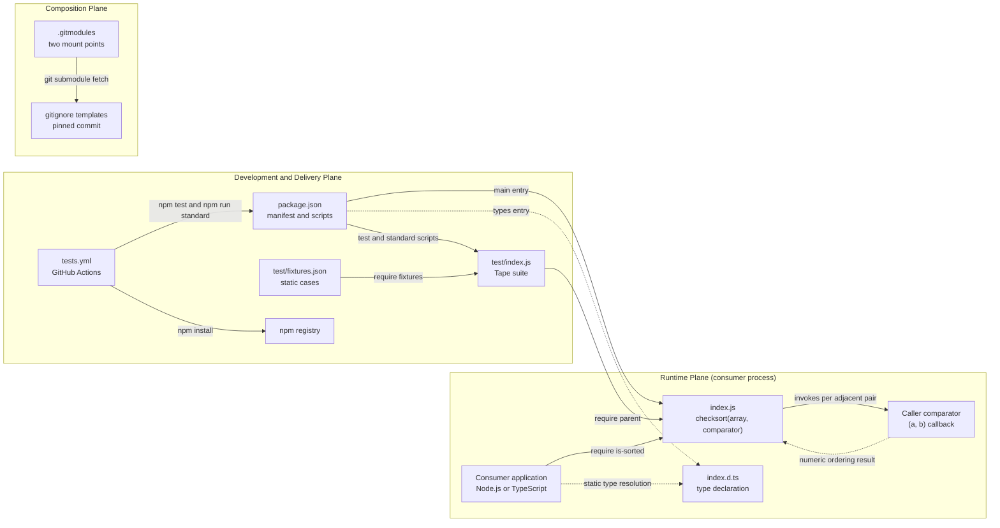
```mermaid
flowchart LR
    subgraph RT["Runtime Plane (consumer process)"]
        direction TB
        ConsumerApp["Consumer application<br/>Node.js or TypeScript"]
        Core["index.js<br/>checksort(array, comparator)"]
        Cmp["Caller comparator<br/>(a, b) callback"]
        Types["index.d.ts<br/>type declaration"]
    end
    subgraph DEV["Development and Delivery Plane"]
        direction TB
        Manifest["package.json<br/>manifest and scripts"]
        Tests["test/index.js<br/>Tape suite"]
        Fixtures["test/fixtures.json<br/>static cases"]
        CI["tests.yml<br/>GitHub Actions"]
        NPM["npm registry"]
    end
    subgraph COMP["Composition Plane"]
        direction TB
        GM[".gitmodules<br/>two mount points"]
        Tmpl["gitignore templates<br/>pinned commit"]
    end
    ConsumerApp -->|"require is-sorted"| Core
    ConsumerApp -.->|"static type resolution"| Types
    Core -->|"invokes per adjacent pair"| Cmp
    Cmp -.->|"numeric ordering result"| Core
    Manifest -->|"main entry"| Core
    Manifest -.->|"types entry"| Types
    Tests -->|"require parent"| Core
    Fixtures -->|"require fixtures"| Tests
    Manifest -->|"test and standard scripts"| Tests
    CI -->|"npm test and npm run standard"| Manifest
    CI -->|"npm install"| NPM
    GM -->|"git submodule fetch"| Tmpl
```

### 5.2.1 checksort Core Library (`index.js`)

**Purpose and responsibilities.** This is the sole runtime component and the realization of features **F-001** (array sortedness check), **F-002** (default ascending ordering), **F-003** (custom comparator support), and **F-004** (non-array input validation). It validates that its first argument is an array, selects an ordering comparator, and evaluates whether the array is sorted by scanning adjacent pairs, returning a boolean or throwing a `TypeError`.

**Technologies and frameworks.** Plain ECMAScript authored in the **CommonJS** module format, with no framework, no transpilation/build step, and no dependencies. It relies only on JavaScript built-ins (`Array.isArray`, arithmetic, a `for` loop) and therefore runs on any Node.js version supporting `let`/`const` — the CI validates `14.x`, `16.x`, and `18.x`.

**Key interfaces and APIs.** A single default export: `module.exports = checksort(array, comparator)`. Inputs are the array under test and an optional `comparator(a, b)` returning a numeric ordering value; the output is a `boolean`. On a non-array first argument it throws `TypeError('Expected Array, got ' + typeof array)`. The private `defaultComparator(a, b) => a - b` is not exported. The runtime interaction — including comparator delegation and the two terminal paths — is shown below:

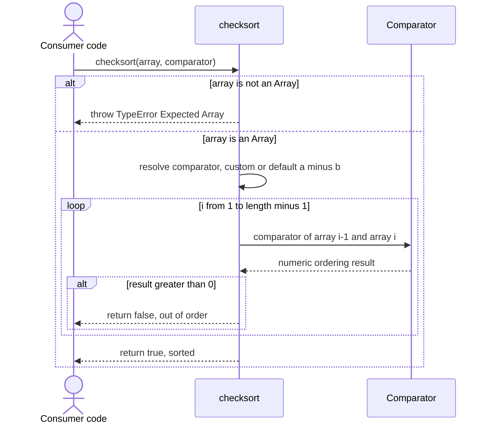
```mermaid
sequenceDiagram
    actor Caller as Consumer code
    participant CS as checksort
    participant Cmp as Comparator
    Caller->>CS: checksort(array, comparator)
    alt array is not an Array
        CS-->>Caller: throw TypeError Expected Array
    else array is an Array
        CS->>CS: resolve comparator, custom or default a minus b
        loop i from 1 to length minus 1
            CS->>Cmp: comparator of array i-1 and array i
            Cmp-->>CS: numeric ordering result
            alt result greater than 0
                CS-->>Caller: return false, out of order
            end
        end
        CS-->>Caller: return true, sorted
    end
```

**Data persistence requirements.** None. `checksort` is a pure function: it reads the caller's array in place, writes nothing to disk/database/cache/network, mutates neither the input nor any global state, and retains no state after returning.

**Scaling considerations.** Time is **O(n)** — a single left-to-right pass with an early exit at the first out-of-order pair — and additional memory is **O(1)** (a loop index plus a cached `length`). Because the function is synchronous and CPU-bound, evaluating a very large array blocks the caller's event loop for the duration of the scan; there is no internal batching, streaming, or asynchrony. The function is stateless and fully re-entrant, so any number of concurrent callers may invoke it independently — "scaling" is entirely the caller's concern, and per-call cost is dominated by the supplied comparator.

### 5.2.2 TypeScript Type Declaration (`index.d.ts`)

**Purpose and responsibilities.** Provides static type information to TypeScript consumers that mirrors the runtime signature (feature **F-005**).

**Technologies and frameworks.** A TypeScript **ambient declaration** file (`.d.ts`) using the CommonJS-interop form `export = checksort` and a generic type parameter `T`.

**Key interfaces and APIs.** `declare function checksort<T = any>(array: T[], comparator?: (a: T, b: T) => number)` and `export = checksort`. It is resolved by consumers through the `types` field in `package.json`. Notably, it declares no explicit return type, so the runtime boolean result is implicit at the declaration level.

**Data persistence requirements.** None — this is a compile-time-only artifact that is erased before execution.

**Scaling considerations.** Not applicable at runtime; the negligible type-checking cost is borne by the consumer's TypeScript compiler.

### 5.2.3 Package Manifest and Distribution (`package.json`)

**Purpose and responsibilities.** Declares the package identity and metadata, the published entry points, the npm scripts, and the development dependencies — defining both the distribution surface (feature **F-006**) and the development-time automation contract (the `standard` script supports feature **F-009**).

**Technologies and frameworks.** An npm package **manifest** (JSON) interpreted by the npm CLI and its script runner; dependency ranges use semver.

**Key interfaces and APIs.** `name` `is-sorted`, `version` `1.0.5`, `main` `index.js`, `types` `index.d.ts`; `scripts.test` = `tape test/*.js` and `scripts.standard` = `standard`; `devDependencies` `tape` `^5.0.0` and `standard` `*`. There are no `dependencies`, `engines`, or `bin` entries.

**Data persistence requirements.** None at runtime; the manifest is static configuration. The distributable artifact is a tarball published to the npm registry.

**Scaling considerations.** Distribution scales through the npm registry/CDN rather than through compute. A reproducibility caveat applies: because `standard` floats at `*` and no lockfile is committed (`.gitignore` ignores `node_modules`), the exact dev-dependency versions resolved at install time can drift over time.

### 5.2.4 Test Harness (`test/index.js`, `test/fixtures.json`)

**Purpose and responsibilities.** Verifies functional correctness and the error path in a data-driven manner (feature **F-007**), asserting the expected boolean for each fixture and that non-array input throws.

**Technologies and frameworks.** The **Tape** TAP-producing test harness (dev dependency), CommonJS module loading, and a JSON fixtures file.

**Key interfaces and APIs.** `require('../')` loads the package root as `sorted`; `require('./fixtures')` loads the cases; a local `comparators.descending = (a, b) => b - a` supplies the only custom comparator. The runner generates one `tape(...)` test per fixture — each with `t.plan(1)` and a single `t.equal(sorted(f.array, comparators[f.comparator]), f.expected)` — plus one `t.throws(() => sorted('foobar'), /Expected Array, got string/)` test. It is invoked via `npm test` → `tape test/*.js`.

**Data persistence requirements.** `test/fixtures.json` is static, read-only data at rest (12 numeric-array cases); test output is a transient TAP stream to stdout and is not persisted in the repository.

**Scaling considerations.** The suite comprises 13 assertions (12 fixtures plus one error test) and runs in milliseconds. It scales linearly with the number of fixtures, and new cases are added by editing `fixtures.json` alone — no test-logic change is required.

### 5.2.5 Continuous Integration Pipeline (`.github/workflows/tests.yml`)

**Purpose and responsibilities.** Enforces cross-runtime correctness and style compliance on every push to `main` and every pull request (features **F-008** and **F-009**), surfacing results as GitHub status checks.

**Technologies and frameworks.** **GitHub Actions** (YAML), `ubuntu-latest` runners, the `actions/checkout@main` and `actions/setup-node@main` reusable actions, and the npm CLI.

**Key interfaces and APIs.** Two independent jobs: `unit` runs a `fail-fast: false` matrix across Node.js `14.x`/`16.x`/`18.x`, executing `npm install` then `npm test`; `standard` runs once on Node.js `18.x`, executing `npm install` then `npm run standard`. Triggers are `push` to `main` and all `pull_request` events. The pipeline flow is:

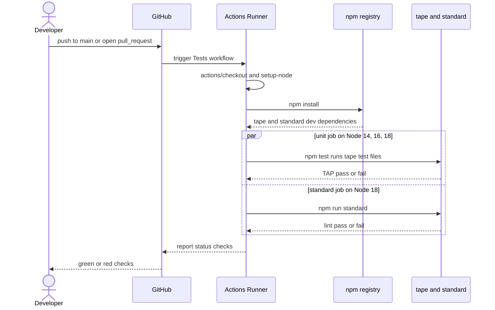
```mermaid
sequenceDiagram
    actor Dev as Developer
    participant GH as GitHub
    participant Run as Actions Runner
    participant NPM as npm registry
    participant Tools as tape and standard
    Dev->>GH: push to main or open pull_request
    GH->>Run: trigger Tests workflow
    Run->>Run: actions/checkout and setup-node
    Run->>NPM: npm install
    NPM-->>Run: tape and standard dev dependencies
    par unit job on Node 14, 16, 18
        Run->>Tools: npm test runs tape test files
        Tools-->>Run: TAP pass or fail
    and standard job on Node 18
        Run->>Tools: npm run standard
        Tools-->>Run: lint pass or fail
    end
    Run-->>GH: report status checks
    GH-->>Dev: green or red checks
```

**Data persistence requirements.** None. The workflow declares no artifacts and no dependency cache (there is no `actions/cache` step), so every job performs a fresh `npm install`.

**Scaling considerations.** Parallelism comes from the matrix — the three `unit` entries and the `standard` job run concurrently on separate GitHub-hosted runners — and runner capacity is provided by GitHub's infrastructure. The workflow declares no explicit concurrency limit, timeout, or `permissions` block, and pins its reusable actions at the mutable `@main` ref.

### 5.2.6 Git Submodule Template Collection (`.gitmodules` and mount points)

**Purpose and responsibilities.** Vendors a pinned, read-only copy of GitHub's `.gitignore` template collection under two mount points, demonstrating Git submodule composition (feature **F-010**). It is independent of the library runtime.

**Technologies and frameworks.** **Git submodules**. The vendored content is a fork of `github/gitignore` (**CC0-1.0** licensed) — a curated data collection of 312 `.gitignore` templates organized as root-level common templates, a `Global/` folder (editors/OS/tools), and a `community/` folder (specialized templates across 15 sub-folders). The submodule also carries its own governance files (`.github/CODEOWNERS`, `PULL_REQUEST_TEMPLATE.md`) and a single scheduled stale-PR workflow (`.github/workflows/stale.yml`, `actions/stale@v9.1.0`); it contains no build or test scripts.

**Key interfaces and APIs.** `.gitmodules` declares two `[submodule]` entries — paths `Parent_repo_for_submodule` and `submodule_for_Parent_repo_for_submodule-Public` — that share one `url`. `git submodule init`/`update` resolves both to commit `dcc0fc7bc2b5ba480cf117ad1be31bafceeaff46`, and each mount point's `.git` is a gitlink pointer into `.git/modules/<name>`. The composition lifecycle is:

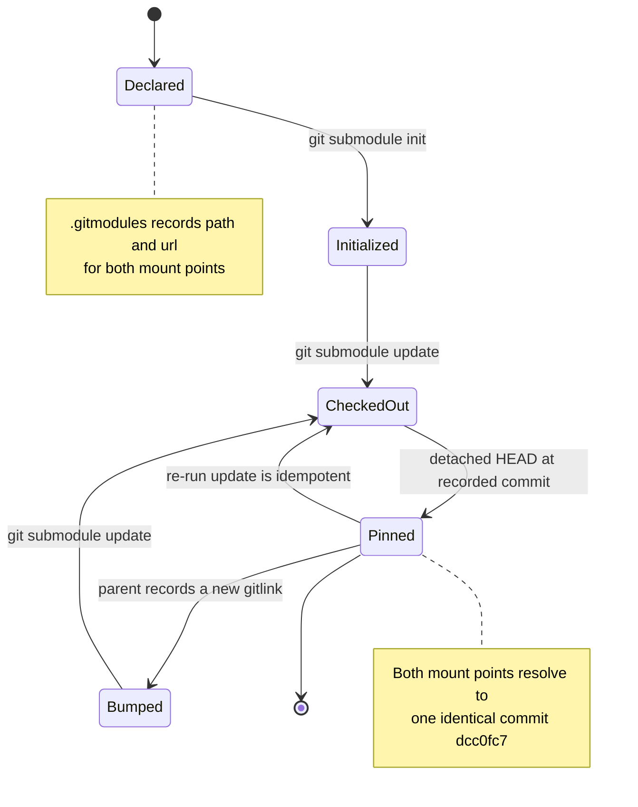
```mermaid
stateDiagram-v2
    [*] --> Declared
    Declared --> Initialized: git submodule init
    Initialized --> CheckedOut: git submodule update
    CheckedOut --> Pinned: detached HEAD at recorded commit
    Pinned --> CheckedOut: re-run update is idempotent
    Pinned --> Bumped: parent records a new gitlink
    Bumped --> CheckedOut: git submodule update
    Pinned --> [*]
    note right of Declared
        .gitmodules records path and url
        for both mount points
    end note
    note right of Pinned
        Both mount points resolve to
        one identical commit dcc0fc7
    end note
```

**Data persistence requirements.** The templates are static data at rest in the working tree, pinned at an immutable commit; there is no database or mutable store. The parent repository records the submodule commit as a gitlink.

**Scaling considerations.** Not applicable in the compute sense — the content is static. Composition "scales" through pinning: updates are explicit, deliberate commit bumps rather than automatic tracking. Note the duplication: the two mount points hold byte-identical content, so the composition carries the collection twice.


## 5.3 Technical Decisions

This section documents the significant technical decisions embodied by the repository and the rationale and tradeoffs behind each. Every decision below is inferred from concrete, observable evidence in the codebase — the source files, the manifest, the CI workflow, and the submodule configuration — rather than from documented design deliberation. Because this system is a dependency-free micro-library with no servers, datastores, or network surface, several conventional decision categories (message brokers, distributed data stores, cache tiers) resolve to a deliberate "not applicable," and that absence is itself treated as a decision with its own justification.

### 5.3.1 Architecture Style Decision and Tradeoffs

The overriding decision is to implement the capability as a **single-module, zero-runtime-dependency CommonJS utility library**. The entire runtime is one exported function in `index.js`; `package.json` declares no `dependencies` block, and the two entries in `devDependencies` (`tape`, `standard`) are used only for development and CI. There is no application server, no framework, no build/transpile step, and no configuration surface.

The rationale is fitness-for-purpose: checking whether an array is sorted is a small, pure, deterministic computation that needs no external services, so the simplest architecture that delivers it — a library function consumed in-process — is preferred. The following table summarizes the principal tradeoffs of this style (evidence in parentheses):

| Decision | Benefit | Tradeoff |
|---|---|---|
| Zero runtime dependencies (no `dependencies` in `package.json`) | No supply-chain attack surface, minimal install footprint, no version churn | Any capability beyond a single boolean check must be supplied by the caller |
| Single exported function (`index.js`) | Trivial to reason about, test, and audit; no internal wiring | No extensibility points, plugins, or configuration |
| No build/transpile step (source shipped as-is) | Nothing to compile or cache; source equals distributable | Runtime must natively support the syntax used (`let`/`const`) |
| In-process library, not a service | No deployment, networking, or availability concerns | Consumer owns all operational aspects (scaling, monitoring) |

### 5.3.2 Communication and Interaction Pattern Choices

All interaction is **synchronous, in-process function invocation**; there is no inter-process communication, network protocol, event bus, or message queue anywhere in the codebase. Two deliberate interaction patterns are observable:

- **Direct call / return.** Consumers `require('is-sorted')` and call `checksort(array, comparator)`, receiving a `boolean` synchronously or a thrown `TypeError`. The contract is a plain function signature, mirrored for typed consumers by `index.d.ts`.
- **Strategy via caller callback (inversion of control).** The ordering rule is not fixed in the library; the caller may pass a `comparator(a, b)` callback that `checksort` invokes for each adjacent pair (`comparator(array[i - 1], array[i])`). When omitted, the library substitutes its private `defaultComparator` (`a - b`, ascending) via `comparator = comparator || defaultComparator`.

| Interaction | Chosen Pattern | Rationale |
|---|---|---|
| Consumer to library | Synchronous call/return | Computation is fast, pure, and CPU-bound; async adds no value |
| Ordering rule | Strategy callback (inversion of control) | Lets callers define arbitrary orderings without changing the library |
| Default behavior | Null-coalescing fallback to `defaultComparator` | Keeps the common ascending-numeric case ergonomic (single argument) |
| Development orchestration | npm scripts invoking `tape` and `standard` | Standard, tool-agnostic entry points reused by developers and CI |

### 5.3.3 Data Storage and Caching Rationale

**There is no data storage solution and no caching layer, by design.** `checksort` is a pure function: it reads the caller's array in place and returns a boolean, persisting nothing and mutating neither its input nor any global state. Consequently there is no database, file store, key-value store, session store, or in-memory cache to select, and no cache-invalidation strategy to justify. The only persistent bytes in the repository are static assets: `test/fixtures.json` (read-only test data) and the vendored submodule templates (read-only, pinned data). The single micro-optimization present is loop-local caching of `array.length` in the `for` initializer, which is an intra-call implementation detail rather than an architectural cache. This absence is the correct decision for a stateless computation — introducing storage or caching would add failure modes and complexity with no functional benefit.

### 5.3.4 Security Mechanism Selection

The library's security posture is intentionally minimal and matches its trust model. Two observable mechanisms and one explicit boundary define it:

- **Fail-fast input validation.** The first statement guards the public contract: `if (!Array.isArray(array)) throw new TypeError('Expected Array, got ' + typeof array)`. This prevents silent misuse and surfaces caller errors immediately (feature **F-004**).
- **Caller trust boundary (no sandboxing).** The supplied comparator is executed as-is, in the caller's process, with the caller's privileges. The library does not sandbox, time-box, or otherwise constrain the callback. This is a deliberate, acceptable choice because the comparator is the *caller's own code*: the trust boundary sits at the library's public entry, and everything the function touches is already owned by the caller.
- **Licensing and distribution integrity.** The library is MIT-licensed (`LICENSE`), and the vendored submodule content is CC0-1.0; submodule integrity is anchored by pinning to an immutable commit rather than a mutable branch.

| Concern | Mechanism | Rationale |
|---|---|---|
| Malformed input | `TypeError` guard on non-array argument | Fail fast at the contract boundary; no undefined behavior |
| Untrusted ordering logic | None — comparator runs as-is | Comparator is the caller's own code; sandboxing would add cost without a threat to mitigate |
| Authentication / authorization | Not applicable (no protected resource) | A pure in-process function exposes no resource to guard |
| Content integrity (submodules) | Commit pinning in the parent gitlink | Guarantees a fixed, reproducible snapshot of vendored data |

### 5.3.5 Decision Flow

The following decision tree reconstructs the design logic that yields the observed architecture, tracing each question to the choice evidenced in the code:

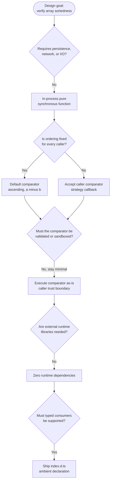
```mermaid
flowchart TD
    Start(["Design goal:<br/>verify array sortedness"])
    Q1{"Requires persistence,<br/>network, or I/O?"}
    Q2{"Is ordering fixed<br/>for every caller?"}
    Q3{"Must the comparator be<br/>validated or sandboxed?"}
    Q4{"Are external runtime<br/>libraries needed?"}
    Q5{"Must typed consumers<br/>be supported?"}
    D1["In-process pure<br/>synchronous function"]
    D2a["Default comparator<br/>ascending, a minus b"]
    D2b["Accept caller comparator<br/>strategy callback"]
    D3["Execute comparator as-is<br/>caller trust boundary"]
    D4["Zero runtime dependencies"]
    D5["Ship index.d.ts<br/>ambient declaration"]
    Start --> Q1
    Q1 -->|"No"| D1
    D1 --> Q2
    Q2 -->|"Yes"| D2a
    Q2 -->|"No"| D2b
    D2a --> Q3
    D2b --> Q3
    Q3 -->|"No, stay minimal"| D3
    D3 --> Q4
    Q4 -->|"No"| D4
    D4 --> Q5
    Q5 -->|"Yes"| D5
```

### 5.3.6 Architecture Decision Records (ADRs)

The decisions above are captured below as lightweight Architecture Decision Records. Every ADR has status **Accepted** because each is realized in the current codebase; the evidence file is named in each record. The index table lists all records, followed by the detailed entries.

| ADR | Decision | Status |
|---|---|---|
| ADR-01 | Zero-dependency single-module library | Accepted |
| ADR-02 | Synchronous in-process function API | Accepted |
| ADR-03 | Comparator supplied as caller callback with ascending default | Accepted |
| ADR-04 | No persistence and no caching (stateless pure function) | Accepted |
| ADR-05 | Fail-fast input validation; trust caller comparator | Accepted |
| ADR-06 | CommonJS format plus ambient TypeScript declaration | Accepted |
| ADR-07 | Cross-runtime verification via GitHub Actions Node matrix | Accepted |
| ADR-08 | Zero-config style enforcement via `standard` | Accepted |
| ADR-09 | Composition via pinned Git submodules of vendored data | Accepted |

**ADR-01 — Zero-dependency single-module library.**
*Context:* The capability is a small pure computation. *Decision:* Implement it as one CommonJS function in `index.js` with no runtime `dependencies`. *Consequences:* Minimal footprint and no supply-chain surface; conversely, no built-in extensibility, and any richer behavior must be provided by the caller.

**ADR-02 — Synchronous in-process function API.**
*Context:* Sortedness checking is fast and CPU-bound. *Decision:* Expose a synchronous call returning a `boolean`. *Consequences:* Simple, deterministic, and easy to test; however, evaluating a very large array blocks the caller's event loop for the duration of the O(n) scan, since there is no asynchrony or chunking.

**ADR-03 — Comparator as caller callback with ascending default.**
*Context:* Different callers need different orderings. *Decision:* Accept an optional `comparator(a, b)`; fall back to `defaultComparator` (`a - b`) when omitted (`comparator || defaultComparator`). *Consequences:* Maximum flexibility with an ergonomic single-argument default; the caller bears responsibility for comparator correctness and cost.

**ADR-04 — No persistence and no caching.**
*Context:* The function holds no state across calls. *Decision:* Persist nothing and cache nothing; keep the function pure. *Consequences:* No datastore/cache failure modes or invalidation logic; results are never memoized, so repeated calls recompute (an acceptable cost given O(n) and caller ownership).

**ADR-05 — Fail-fast input validation; trust caller comparator.**
*Context:* The public contract expects an array and an optional callback. *Decision:* Throw a `TypeError` on non-array input; execute the comparator without sandboxing. *Consequences:* Misuse surfaces immediately at the boundary; the comparator, being the caller's own code, runs with caller privileges — the trust boundary is the library's entry point.

**ADR-06 — CommonJS format plus ambient TypeScript declaration.**
*Context:* Consumers include both JavaScript and TypeScript projects. *Decision:* Ship CommonJS (`main: index.js`) and an ambient declaration (`types: index.d.ts`, `export = checksort`). *Consequences:* Broad compatibility and typed ergonomics; the declaration omits an explicit return type, and CommonJS interop requires the `export =` form.

**ADR-07 — Cross-runtime verification via GitHub Actions Node matrix.**
*Context:* The library must behave consistently across Node.js versions. *Decision:* Run the Tape suite under a `fail-fast: false` matrix of Node.js `14.x`/`16.x`/`18.x` in `.github/workflows/tests.yml`. *Consequences:* Confidence across runtimes and independent per-version results; however, the pinned matrix versions are now end-of-life, and reusable actions are referenced at the mutable `@main` ref rather than pinned tags.

**ADR-08 — Zero-config style enforcement via `standard`.**
*Context:* Consistent style is desired without bikeshedding configuration. *Decision:* Adopt `standard` as a dev dependency and a dedicated `standard` CI job on Node.js `18.x`. *Consequences:* Opinionated, config-free linting; because `standard` is version-ranged at `*` and no lockfile is committed, the exact linter version can drift between installs.

**ADR-09 — Composition via pinned Git submodules of vendored data.**
*Context:* The parent repository demonstrates composition with an external template collection. *Decision:* Declare two submodule mount points in `.gitmodules`, both pinned to the same immutable commit. *Consequences:* Reproducible, explicit, deliberate updates (no automatic branch tracking); the tradeoff is manual update overhead and byte-identical content duplicated across the two mount points.


## 5.4 Cross-Cutting Concerns

Cross-cutting concerns are documented here against the reality of the system: `is-sorted` is an in-process library, not a running service, so concerns that presuppose a long-lived deployable (monitoring dashboards, distributed tracing, authentication, failover) are either **deliberately absent at runtime** or are the **consumer's responsibility**. Where a concern does have a concrete realization, it lives in the *development and delivery plane* — the test harness and the GitHub Actions pipeline. Each subsection states plainly what exists and what does not, and never attributes an operational capability or service-level guarantee that the repository does not contain.

### 5.4.1 Monitoring and Observability

The library emits **no metrics, traces, health signals, or telemetry** of any kind at runtime; there is no instrumentation, no APM/monitoring integration, and no counters in `index.js`. Any visibility into a call is limited to its return value or thrown exception, observed by the caller. The only observability that exists is in the delivery plane: GitHub Actions publishes **status checks** for each job, and the Tape suite emits a machine-readable **TAP stream** to stdout during CI and local runs. The table contrasts the two planes:

| Observability Dimension | Runtime Plane | Development / Delivery Plane |
|---|---|---|
| Metrics / telemetry | None | None (no metrics collected) |
| Health / liveness | Not applicable (no process) | Job success/failure per workflow run |
| Human-visible signal | Return value or thrown error | GitHub status checks; TAP output to stdout |
| External APM integration | None | None |

### 5.4.2 Logging and Tracing

There is **no logging or tracing subsystem**. `checksort` does not write to `console`, stdout, stderr, files, or any log sink; it communicates exclusively through its return value and the `TypeError` it may throw. There are no correlation IDs, no span/trace propagation, and no distributed-tracing hooks — consistent with a single synchronous in-process function that never crosses a process or network boundary. In the development plane, transient textual output does exist but is not a runtime logging strategy: `tape` writes TAP results to stdout, `standard` prints style violations, and GitHub Actions retains per-step console logs for each run. None of this output is persisted in the repository.

### 5.4.3 Error Handling Patterns

Error handling follows a **fail-fast, propagate-to-caller** model at runtime and an **independent-continuation** model in CI. The two planes do not interact.

- **Runtime plane.** The only error the library raises itself is a `TypeError` for a non-array first argument, thrown synchronously at the contract boundary. The library uses **no** `try`/`catch`, retries, backoff, fallbacks, timeouts, or circuit breakers. If the caller-supplied comparator throws, that exception is **not caught** by `checksort` — it propagates uncaught up to the caller, which is the correct behavior for a pure function that treats the comparator as caller-owned code. A comparator returning a non-numeric value is not validated; it is simply used in the `> 0` comparison.
- **Development / delivery plane.** The `unit` matrix runs with `fail-fast: false`, so a failure on one Node.js version does not cancel the others — each version is verified independently (this is *independent continuation*, not automatic retry). Any failing step (`npm install`, `npm test`, or `npm run standard`) exits non-zero and surfaces as a red status check.

The following diagram traces where each class of error **originates**, how it **propagates**, and where it is **surfaced** — complementing the recovery-oriented view in **4.4.2**:

```mermaid
flowchart TD
    subgraph RT["Runtime Plane: origination and propagation"]
        direction TB
        InCall["checksort invoked"]
        ChkArr{"First argument<br/>is an Array?"}
        ThrowTE["Throw TypeError<br/>surfaced to caller"]
        RunCmp["Invoke caller comparator<br/>per adjacent pair"]
        CmpThrow{"Comparator throws?"}
        PropUp["Exception propagates<br/>uncaught to caller"]
        BoolOut["Return boolean<br/>to caller"]
    end
    subgraph DEV["Development and Delivery Plane: detection and surfacing"]
        direction TB
        Install{"npm install<br/>succeeds?"}
        FailInstall["Job fails,<br/>red status check"]
        TapRun{"Tape assertions<br/>all ok?"}
        FailTest["Non-zero exit,<br/>TAP not ok"]
        LintRun{"standard lint<br/>clean?"}
        FailLint["Non-zero exit,<br/>style violation"]
        GateOK["Green status checks"]
    end
    InCall --> ChkArr
    ChkArr -->|"No"| ThrowTE
    ThrowTE --> PropUp
    ChkArr -->|"Yes"| RunCmp
    RunCmp --> CmpThrow
    CmpThrow -->|"Yes"| PropUp
    CmpThrow -->|"No"| BoolOut
    Install -->|"No"| FailInstall
    Install -->|"Yes"| TapRun
    TapRun -->|"No"| FailTest
    TapRun -->|"Yes"| LintRun
    LintRun -->|"No"| FailLint
    LintRun -->|"Yes"| GateOK
```

### 5.4.4 Authentication and Authorization

**Not applicable.** The library exposes no protected resource, endpoint, or account — it is a pure in-process function — so there is no authentication or authorization framework, no identity provider, no tokens, and no access-control logic anywhere in the runtime code. The only trust-related boundary is the one described in **5.3.4**: the caller's comparator executes with the caller's own privileges (a *caller trust boundary*), which is appropriate because that code already belongs to the caller. In the delivery plane, access control is delegated entirely to the hosting platforms — GitHub repository permissions govern who can push or merge, and npm registry credentials govern publishing — but none of this is implemented within the repository.

### 5.4.5 Performance Characteristics and Service Levels

The repository defines **no formal service-level agreements, latency targets, throughput objectives, or business KPIs**; consistent with **1.2.3**, only observable quality gates and inherent algorithmic characteristics exist. What can be stated is grounded directly in the implementation:

| Characteristic | Observed Behavior | Evidence |
|---|---|---|
| Time complexity | O(n) — single left-to-right pass | `for` loop over adjacent pairs in `index.js` |
| Early termination | Returns `false` at the first out-of-order pair | `if (comparator(...) > 0) return false` |
| Extra memory | O(1) — a loop index and a cached `length` | Loop initializer in `index.js` |
| Execution model | Synchronous and CPU-bound; no async/streaming | Function body performs no I/O |

The practical performance implication is that per-call cost scales linearly with array length and is dominated by the caller's comparator, and that a very large array blocks the caller's event loop for the duration of the scan. The only performance-adjacent "budget" the project enforces is that the CI test suite must complete within GitHub Actions' default run limits — there is no explicit timeout, benchmark, or performance assertion in the codebase.

### 5.4.6 Disaster Recovery and Reproducibility

Because there is **no stateful, long-running deployment**, there is nothing to fail over and no live data to restore — traditional disaster-recovery procedures (backups, replicas, RTO/RPO targets) do not apply and are not defined in the repository. The relevant concern is instead **source and artifact reproducibility**, which is addressed by the version-control and packaging model:

- **Source recovery.** The complete source is preserved in Git history and mirrored by the published npm package (`is-sorted@1.0.5`); either can reconstitute the library.
- **Composition recovery.** Both submodule mount points are pinned to an immutable commit (`dcc0fc7bc2b5ba480cf117ad1be31bafceeaff46`); `git submodule update` deterministically restores the exact vendored template snapshot from that commit.
- **Environment reconstitution.** A working environment is recreated by cloning and running `npm install`; there is no persistent local state to rebuild. The caveat noted in **5.3.6** applies — the floating `standard` version and absent lockfile mean an install is functionally, but not bit-for-bit, reproducible over time.


## 5.5 References

The following repository files, folders, and previously authored specification sections were examined as evidence for Section 5. No external web sources were used.

**Repository files**

- `index.js` - Established the sole runtime component: the `checksort(array, comparator)` function, its `Array.isArray` guard and `TypeError`, comparator fallback, single-pass O(n) loop, and boolean result.
- `index.d.ts` - Established the ambient TypeScript declaration (generic `checksort<T>`, `export =` form, no explicit return type).
- `package.json` - Established package identity (`is-sorted` v1.0.5), entry points (`main`, `types`), the `test` and `standard` scripts, dev dependencies (`tape`, `standard`), and the absence of runtime dependencies and `engines`.
- `test/index.js` - Established the Tape-based, data-driven test harness, the descending comparator, and the error-path assertion.
- `test/fixtures.json` - Established the static, read-only test data set driving the suite.
- `.github/workflows/tests.yml` - Established the CI pipeline: the `unit` Node.js `14.x`/`16.x`/`18.x` matrix with `fail-fast: false`, the `standard` job on Node.js `18.x`, the `push`/`pull_request` triggers, and the `@main`-referenced actions.
- `.gitmodules` - Established the two submodule mount points sharing one upstream URL.
- `.gitignore` - Established that `node_modules` is untracked (no committed lockfile).
- `LICENSE` - Established the root project's MIT license.
- `README.md` - Established the documented consumption examples of `require('is-sorted')`.

**Repository folders**

- `test/` - Contained the test harness (`index.js`) and fixtures (`fixtures.json`).
- `.github/workflows/` - Contained the sole CI workflow definition for the root project.
- `Parent_repo_for_submodule/` - First submodule mount point; contained the vendored `.gitignore` template collection pinned at commit `dcc0fc7`, including its `LICENSE` (CC0-1.0), `README.md`, `CONTRIBUTING.md`, `.github/` governance files, and the single `workflows/stale.yml` automation.
- `submodule_for_Parent_repo_for_submodule-Public/` - Second submodule mount point; contained byte-identical vendored content pinned at the same commit.

**Cross-referenced Technical Specification sections**

- 1.2 System Overview - Confirmed the high-level component/consumer model, the responsibility-oriented component diagram (1.2.2), and that no formal SLAs or business KPIs exist (1.2.3).
- 2.3 Feature Relationships - Confirmed the integration-points inventory, the existing runtime control-flow diagram, and the "no runtime services" shared-components framing.
- 3.4 Third-Party Services - Confirmed the dev-lifecycle-only services (GitHub SCM/Actions, npm registry) and the deliberate absence of monitoring/observability/APM, cloud, auth, and external runtime APIs.
- 4.4 State Management and Error Handling - Established the runtime-plane vs. development/delivery-plane terminology and the recovery-oriented error-handling view that Section 5.4 complements.
- 4.5 State Transition Diagrams - Confirmed the existing `checksort` evaluation and CI job state diagrams that Section 5.2 complements without duplicating.


# 6. SYSTEM COMPONENTS DESIGN

## 6.1 Core Services Architecture

### 6.1.1 Applicability Assessment and Rationale

**Core Services Architecture is not applicable for this system.**

`is-sorted` (version `1.0.5`, per `package.json`) is a single, synchronous, zero-runtime-dependency, **in-process utility library**. Its entire shipped runtime is one exported function — `checksort(array, comparator)` defined in the 14-line `index.js` — which executes inside the consumer's own process and returns a boolean or throws a `TypeError`. The system does **not** decompose into independently deployable services, exposes **no** network endpoint, runs **no** long-lived process, and performs **no** inter-process or inter-service communication. Consequently, the microservices and distributed-systems concerns this section is designed to document — service boundaries, inter-service communication, service discovery, load balancing, circuit breakers, horizontal auto-scaling, failover, and service degradation — have **no corresponding implementation** anywhere in the repository.

This determination is consistent with **Section 5.1 High-Level Architecture**, which classifies the system as a "single-module, zero-runtime-dependency, synchronous, in-process utility library" with "no client-server topology, no service tier, no network listener, no message broker, and no long-running process," and with **Section 5.4 Cross-Cutting Concerns**, which records that runtime monitoring, retries, circuit breakers, and failover are deliberately absent. It is further reinforced by **Section 3.4 Third-Party Services** (no runtime external services) and **Section 3.5 Databases & Storage** (no persistence tier).

#### Evidence Establishing Non-Applicability

The following directly observable repository facts establish that no service-oriented architecture exists to document.

| Observed Attribute | Value in Repository | Evidence |
|---|---|---|
| Deployable units | One npm package; zero services | `package.json`; 12 tracked repo-scope entries |
| Runtime process model | In-process function call (no server/daemon) | `index.js` (no `listen`/`bind`/`socket`) |
| Network surface | None (no HTTP/TCP client or server) | `index.js` contains no network primitives |
| Runtime dependencies | Zero | `package.json` (no `dependencies`/`peer`/`optional`) |
| Orchestration/deployment artifacts | None (no Dockerfile/compose/K8s/IaC) | Only YAML is the CI workflow `tests.yml` |
| Inter-process/inter-service communication | None (single synchronous call/return) | `index.js`; Section 5.1.3 |
| Persistent runtime state / data store | None | Section 5.1.3; Section 3.5 |

#### Applicability by Required Area

Because a formal Technical Specification benefits from an explicit, per-area evaluation rather than a single blanket disclaimer, each required area group defined by this section's prompt is assessed below. The detailed justification for each — together with the three required (reframed) diagrams — follows in Sections 6.1.2 through 6.1.4.

| Required Area Group | Determination | Basis |
|---|---|---|
| Service Components (boundaries, communication, discovery, load balancing, circuit breakers, retry/fallback) | Not applicable | Single in-process function; no services, endpoints, or network calls (`index.js`; Section 5.1) |
| Scalability Design (scaling approach, auto-scaling, resource allocation, performance, capacity) | Consumer-owned; only intrinsic library properties apply | Stateless library embedded per consumer instance; `O(n)` time / `O(1)` extra memory, synchronous (Section 5.4.5) |
| Resilience Patterns (fault tolerance, disaster recovery, redundancy, failover, degradation) | Limited to fail-fast validation and source/artifact reproducibility | No stateful deployment; fail-fast `TypeError`; Git + npm + pinned-submodule redundancy (Section 5.4.6) |

The remaining sub-sections state precisely what exists in the codebase, what does not, and — where a concern legitimately applies to a *library* rather than a *service* (for example, scaling by embedding, or source/artifact reproducibility) — how the repository addresses it. The three required Mermaid diagrams are retained but **reframed** to depict the system's actual single-process reality instead of a service topology it does not possess.

### 6.1.2 Service Components Analysis

The prompt's **Service Components** group presupposes a system composed of multiple communicating services connected by network transport and mediated by discovery, load-balancing, and fault-isolation infrastructure. `is-sorted` has exactly **one** runtime unit — the `checksort` function in `index.js` — so there are no service boundaries to delineate, no service-to-service links to describe, and none of the routing or resilience middleware that such traffic would require.

Diagram 6.1.2-1 depicts the only interaction model that exists: a synchronous, in-process function call within the consumer's single operating-system process. The consumer application invokes the embedded `checksort` function directly (linked at load time through the CommonJS `require` mechanism), and `checksort` may invoke the caller's optional comparator once per adjacent element pair. No call crosses a process, container, or network boundary.

**Diagram 6.1.2-1 — In-Process Invocation Model (No Inter-Service Communication).**

```mermaid
flowchart LR
    subgraph HostProc["Consumer Host Process: single OS process"]
        direction TB
        AppCode["Consumer application code"]
        Lib["checksort function<br/>embedded library, index.js"]
        Cmp["Caller-supplied comparator<br/>optional callback"]
        AppCode -->|"in-process call to checksort"| Lib
        Lib -->|"synchronous callback per adjacent pair"| Cmp
        Cmp -->|"numeric ordering result returned"| Lib
        Lib -->|"boolean verdict or thrown TypeError"| AppCode
    end
    Registry["npm registry"] -. "install-time module resolution" .-> AppCode
    Absent["Absent by design:<br/>no network hop, no service discovery,<br/>no load balancer, no circuit breaker,<br/>no remote service endpoint"]
    AppCode -.-> Absent
```

#### Per-Concern Assessment

| Service-Oriented Concern | Present? | Rationale and Evidence |
|---|---|---|
| Service boundaries and responsibilities | No | Single exported function `checksort`; only in-process interface and trust boundaries exist (`index.js`; Section 5.1.1) |
| Inter-service communication patterns | No | Sole interaction is a synchronous in-process call/return plus a comparator callback; no HTTP/gRPC/messaging (`index.js`; Section 5.1.3) |
| Service discovery mechanisms | No | Static resolution via `require('is-sorted')` at load time; no registry, DNS, or runtime lookup (`package.json` `main`) |
| Load balancing strategy | No | No network endpoint and no replicated instances across which to distribute traffic (`index.js`) |
| Circuit breaker patterns | No | No remote dependency to protect; no breakers, timeouts, or bulkheads (Section 5.4.3) |
| Retry and fallback mechanisms | No — fail-fast | No retries, backoff, or fallbacks; invalid input throws and comparator errors propagate uncaught (`index.js`; Section 5.4.3) |

#### The Only Boundaries That Exist Are Interface Contracts

Two genuine boundaries are present in the code, and both are in-process rather than network service boundaries: (1) the **CommonJS module export** (`module.exports = checksort` in `index.js`, surfaced via `package.json` `main`), which is the API contract between the library and its consumer; and (2) the **caller trust boundary**, where the caller-supplied comparator executes with the caller's own privileges and without sandboxing (Sections 5.1.1 and 5.4.4). Neither is fronted by discovery, load balancing, or circuit breaking.

#### Communication, Discovery, and Balancing

The runtime "communication" is a synchronous call/return augmented by the comparator callback — an inversion-of-control (strategy) pattern in which ordering semantics flow from the caller into the library (Section 5.1.3). Consumers "discover" the library through **static package resolution** (`require('is-sorted')`) performed by the Node.js module loader at load time, not through any runtime registry, DNS, or lookup service. Because there is no network endpoint and no replicated instance, there is nothing to load-balance across.

#### Fault Isolation and Retry

Consistent with **Section 5.4.3**, the library implements **no** circuit breakers, timeouts, bulkheads, retries, backoff, or fallbacks. Its error posture is deliberately fail-fast: a non-array argument throws a `TypeError` immediately (`index.js` line 6), and an exception thrown by the caller's comparator propagates uncaught back to the caller. These are correct behaviors for a pure function whose only collaborator — the comparator — is in fact caller-owned, in-process code rather than a remote service.

### 6.1.3 Scalability Design Considerations

The **Scalability Design** group applies to deployable, resource-consuming services. `is-sorted` is not deployed and holds no state, so it defines no scaling infrastructure of its own. What can be documented accurately is (a) how the library behaves when the *consuming* application scales, and (b) the intrinsic algorithmic properties that determine per-call cost.

Diagram 6.1.3-1 shows the consumer-owned scaling model: when a consumer scales horizontally, each instance carries its own private, stateless copy of `checksort`. Because the function holds no state between calls and requires no coordination, the embedded copies are fully independent — there is no shared cache, no cross-instance communication, and no synchronization point that the library must manage.

**Diagram 6.1.3-1 — Consumer-Owned Scalability Model (Stateless Embedded Library).**

```mermaid
flowchart TB
    subgraph ConsumerPlatform["Consumer Deployment: owned and operated by the consumer"]
        direction TB
        LB["Consumer load balancer or scheduler<br/>optional, not part of is-sorted"]
        subgraph Inst1["Consumer instance 1"]
            App1["Application code"]
            Copy1["checksort copy<br/>stateless, in-process"]
            App1 --> Copy1
        end
        subgraph Inst2["Consumer instance 2"]
            App2["Application code"]
            Copy2["checksort copy<br/>stateless, in-process"]
            App2 --> Copy2
        end
        subgraph InstN["Consumer instance N"]
            AppN["Application code"]
            CopyN["checksort copy<br/>stateless, in-process"]
            AppN --> CopyN
        end
        LB --> App1
        LB --> App2
        LB --> AppN
    end
    Note["Each embedded copy is independent:<br/>no shared state, no coordination,<br/>no cross-instance communication"]
    Copy1 -.-> Note
```

#### Per-Concern Assessment

| Scalability Concern | Ownership | Approach and Evidence |
|---|---|---|
| Horizontal / vertical scaling approach | Consumer (deployment) | Library is embedded per instance and stateless, so it neither aids nor obstructs scaling; no scaling logic exists in the repo (`index.js`; Section 5.1.1) |
| Auto-scaling triggers and rules | Consumer (platform) | None defined — no deployment/orchestration artifacts exist to declare triggers or thresholds (Section 6.1.1) |
| Resource allocation strategy | Intrinsic / consumer | Function allocates nothing (`O(1)` extra memory) and consumes caller CPU only for the synchronous scan (Section 5.4.5) |
| Performance optimization techniques | Library (intrinsic) | Single-pass `O(n)` scan, early return on the first out-of-order pair, loop-local `length` cache, zero heap allocation (`index.js`; Section 5.4.5) |
| Capacity planning guidelines | Consumer / intrinsic | No formal plan; per-call cost is linear in array length and CPU-bound; large arrays block the event loop (Section 5.4.5) |

#### Scaling Is Consumer-Owned

The library ships as an embedded dependency. When a consumer scales **horizontally** (more instances or processes) or **vertically** (more CPU per instance), each instance carries its own private, stateless copy of `checksort`. Because the function holds no state between calls, maintains no shared cache, and requires no coordination (Sections 5.1.3 and 5.4.1), it introduces no cross-instance bottleneck and no synchronization point — it is effectively "scale-neutral," as illustrated in Diagram 6.1.3-1.

#### No Auto-Scaling in the Repository

There are no deployment or orchestration artifacts in the repository (no Dockerfile, compose file, Kubernetes manifest, or infrastructure-as-code — see the evidence table in **Section 6.1.1**), and therefore no auto-scaling triggers, thresholds, or rules are defined. Any such policy belongs to the consumer's platform and is outside the library's scope.

#### Resource Allocation and Performance Optimization

The runtime resource profile is minimal and fixed per call: `O(1)` extra memory (a loop index and a cached `length`) and `O(n)` CPU time in the worst case, with early termination at the first out-of-order pair (Section 5.4.5). The function performs no I/O and runs synchronously, so it consumes exactly one thread of the caller's execution for the duration of the scan. The optimization techniques present are **algorithmic, not infrastructural**: minimal work per element, short-circuit exit, a loop-local `length` cache, and zero heap allocation (`index.js`).

#### Capacity Planning Guidance

The repository defines no formal capacity targets or throughput SLAs (Sections 1.2.3 and 5.4.5). The only accurate capacity statement is derived from the algorithm: sustained throughput is bounded by the caller's available CPU and, under Node.js, by the single-threaded event loop, because a large input blocks that loop for the duration of the synchronous scan. Consumers checking very large arrays or very high call volumes should account for this at the application tier (for example, chunking work or offloading to worker threads) — a consumer-side concern the library neither performs nor prevents.

### 6.1.4 Resilience Patterns

The **Resilience Patterns** group targets long-running, stateful services that must tolerate infrastructure faults, recover from disasters, and degrade gracefully under stress. `is-sorted` has no such runtime surface, so most of these patterns do not apply. Two resilience concerns do, however, have concrete realizations in the repository: **runtime fault tolerance** through fail-fast contract enforcement, and **source/artifact redundancy** that guarantees the library can be reconstituted deterministically. Diagram 6.1.4-1 depicts both.

**Diagram 6.1.4-1 — Resilience Pattern Implementations (Fail-Fast Enforcement and Artifact Redundancy).**

```mermaid
flowchart TB
    subgraph FaultTol["Runtime Fault Tolerance: fail-fast contract enforcement"]
        direction TB
        Input["Input to checksort"]
        Guard{"First argument<br/>is an Array?"}
        Reject["Throw TypeError immediately<br/>no corrupt result produced"]
        Proceed["Proceed with single-pass scan"]
        Input --> Guard
        Guard -->|"No"| Reject
        Guard -->|"Yes"| Proceed
    end
    subgraph Redun["Source and Artifact Redundancy: reconstitution sources"]
        direction TB
        Git["Git history<br/>full source"]
        Npm["npm registry tarball<br/>is-sorted at 1.0.5"]
        Sub["Pinned submodule commit<br/>dcc0fc7 vendored data"]
        Recon["Deterministic reconstitution:<br/>clone plus npm install plus submodule update"]
        Git --> Recon
        Npm --> Recon
        Sub --> Recon
    end
    NoFO["No runtime failover and no degraded mode:<br/>outcome is a correct boolean or a thrown error"]
    Proceed -.-> NoFO
```

#### Per-Concern Assessment

| Resilience Concern | Present? | Mechanism and Evidence |
|---|---|---|
| Fault tolerance mechanisms | Yes — fail-fast only | `Array.isArray` guard throws `TypeError` before scanning; no wrong result on bad input (`index.js` line 6; Section 5.4.3) |
| Disaster recovery procedures | Not applicable — reframed | No stateful deployment to recover; source/artifact reproducibility applies instead (Section 5.4.6) |
| Data redundancy approach | Yes — for the immutable artifact | Source in Git history plus npm tarball; vendored data via commit-pinned submodule; two byte-identical mount points (`.gitmodules`; Section 5.4.6) |
| Failover configurations | No | No redundant runtime instance or process; a consumer-tier concern (`index.js`; Section 6.1.1) |
| Service degradation policies | No | Binary outcome — correct boolean or thrown error; no partial, degraded, or approximate mode (`index.js`; Section 5.4.3) |

#### Fault Tolerance

The single runtime fault-tolerance mechanism is **fail-fast contract enforcement**: `checksort` validates its first argument with `Array.isArray` and throws `TypeError('Expected Array, got ' + typeof array)` before inspecting any element (`index.js` line 6). This prevents the function from producing an incorrect or undefined result from malformed input — it fails loudly and immediately rather than degrading silently. There is no runtime redundancy, because there is no redundant runtime component to coordinate; the function is a single pure computation (Section 5.4.3).

#### Disaster Recovery

As established in **Section 5.4.6**, there is no stateful, long-running deployment, so traditional disaster-recovery procedures — backups, standby replicas, and RTO/RPO targets — do not apply and are not defined in the repository. The equivalent concern for a published library is **source and artifact reproducibility**: the complete source is preserved in Git history and mirrored by the published npm package (`is-sorted@1.0.5`), and the vendored composition data is restored deterministically from the pinned submodule commit `dcc0fc7bc2b5ba480cf117ad1be31bafceeaff46` via `git submodule update`. Diagram 6.1.4-1 depicts these reconstitution sources.

#### Data Redundancy

No runtime data exists to replicate. Redundancy therefore applies to the **immutable published artifact and its composition data**: the source is redundantly held in Git history and the npm registry tarball, and the vendored `.gitignore` templates are pinned to an immutable commit that both submodule mount points reference — with the two mount points holding byte-identical working trees (`.gitmodules`; Section 5.4.6). The floating `standard` devDependency and absent lockfile mean development installs are functionally, but not bit-for-bit, reproducible over time (Section 5.4.6) — a caveat that qualifies, but does not defeat, artifact recovery.

#### Failover

There is no failover configuration, because there is no redundant runtime instance or process to fail over to; the function executes entirely in the caller's process (`index.js`). Where a consumer runs multiple instances (Diagram 6.1.3-1), instance-level failover is the consumer's responsibility — and it is trivially satisfied because every embedded copy is stateless and identical, so any surviving instance serves requests exactly as any other.

#### Service Degradation

There is no service-degradation policy. The function's outcome is binary: it returns a correct boolean verdict or throws a `TypeError`; it never sheds load, returns approximate answers, or enters a partial or reduced-functionality mode (`index.js`; Section 5.4.3). Because it holds no resources and has no dependencies to lose, there is no degraded state to define.

### 6.1.5 References

The following repository artifacts and previously authored specification sections were examined and cited as evidence for the determinations in Section 6.1.

**Repository files**

- `index.js` - The complete 14-line runtime core; confirmed the single exported `checksort` function, the fail-fast `Array.isArray` guard (line 6), the synchronous single-pass `O(n)` scan, and the absence of any server, network, concurrency, or persistence primitives.
- `package.json` - Established package identity (`is-sorted` version `1.0.5`), the CommonJS `main` entry point, zero runtime/peer/optional dependencies, and the absence of `bin` and `engines` fields.
- `.gitmodules` - Established the two submodule mount points that both pin the same vendored composition data, underpinning the data-redundancy discussion.
- `.github/workflows/tests.yml` - The sole orchestration-adjacent YAML in the repository (a development-time CI workflow), confirming the absence of any Dockerfile, container, deployment, or auto-scaling artifacts.

**Repository folders**

- `Parent_repo_for_submodule/` and `submodule_for_Parent_repo_for_submodule-Public/` - The two byte-identical Git submodule working trees referenced for the artifact/composition redundancy discussion (commit-pinned, read-only vendored data).

**Cross-referenced specification sections**

- `1.2.3 Success Criteria` - Confirmed that no formal SLAs or business KPIs are defined in the repository.
- `3.4 Third-Party Services` - Confirmed no third-party runtime services are consumed.
- `3.5 Databases & Storage` - Confirmed the absence of a persistence tier.
- `5.1 High-Level Architecture` - Source for the architecture-style classification (single-module, in-process library), the runtime/development-delivery/composition plane terminology, data-flow description, and interface boundaries.
- `5.4 Cross-Cutting Concerns` - Source for runtime observability absence (5.4.1), the fail-fast/no-retry/no-circuit-breaker error-handling model (5.4.3), performance characteristics (5.4.5), and disaster-recovery/reproducibility framing (5.4.6).
- `6.1.1`, `6.1.2`, `6.1.3`, `6.1.4` (this section) - Internal cross-references used to avoid duplication across the applicability assessment, service-component, scalability, and resilience sub-sections.

**Web sources**

- None. All determinations in this section are grounded exclusively in repository evidence and previously authored specification sections.

## 6.2 Database Design

### 6.2.1 Applicability Determination

**Database Design is not applicable to this system.**

`is-sorted` (version `1.0.5`, per `package.json`) is a single, synchronous, zero-runtime-dependency, **in-process pure function**. Its entire shipped runtime is one exported function — `checksort(array, comparator)` defined in the 14-line `index.js` — which receives its complete input as function arguments, computes a boolean by a single left-to-right scan, and returns that boolean (or throws a `TypeError`). It **neither persists nor retrieves data**: there is no database, no object/blob/file store, no cache, no ORM or query builder, no database driver or connection string, no schema or migration tooling, and no data-access layer anywhere in the repository. Because no persistent store exists, the concerns this section is designed to document — entity/relational schema, indexing, partitioning, replication, backup, migrations, connection pooling, query optimization, and the like — have **no corresponding implementation** to describe.

This determination is consistent with the conclusions already recorded elsewhere in this specification: **Section 3.5 Databases & Storage** states that "No databases or storage systems are applicable to this project" and characterizes the library as a stateless in-memory pure function; **Section 4.4.1 State Management** records that runtime data-persistence points are "NONE"; and **Section 6.1 Core Services Architecture** independently confirms the absence of any persistence tier. The out-of-scope boundary in **Section 1.3 Scope** and the architecture-style classification in **Section 5.1 High-Level Architecture** (a "single-module, zero-runtime-dependency, synchronous, in-process utility library") corroborate the same finding.

Rather than omit the section, the remaining sub-sections make this determination explicit and auditable: Section 6.2.2 documents the transient, in-memory data model that exists *in place of* a persisted schema (with the required schema/ERD and data-flow diagrams reframed to that reality), and Section 6.2.3 evaluates every required Database Design concern area — Schema Design, Data Management, Compliance Considerations, and Performance Optimization — on a per-item basis so the absence is documented deliberately rather than by silence.

#### Evidence Establishing Non-Applicability

The following directly observable repository facts establish that no database or persistent store exists to design against. A comprehensive keyword search of the package source (excluding the vendored `.gitignore` template submodules and `.git`) for database, ORM, SQL, cache, and persistence terms returned **zero** matches.

| Database-Relevance Signal | Observation in Repository | Evidence |
|---|---|---|
| Runtime dependencies (DB driver, ORM, cache client) | Zero declared | `package.json` (no `dependencies`/`peer`/`optional`) |
| Data-access / persistence code | None — no imports, no I/O, no network, no module-level state | `index.js` (pure function, lines 1–14) |
| Schema, migration, or SQL files | None present | Repository tree; keyword search returned no matches |
| Caching layer | None — only a loop-local `length` variable | `index.js` line 9; Section 4.4.1 |
| On-disk data files | Static and version-controlled only (test fixtures, vendored templates) | `test/fixtures.json`; submodule working trees |
| Persistent runtime state | None — stateless; nothing retained between invocations | `index.js`; Section 3.5.1 |


### 6.2.2 Data Persistence and Transient Data Model

Because no database or persistent store exists (Section 6.2.1), there is no persisted schema to model. What can be documented accurately is the **transient, in-memory data model** the function operates on and the small set of **static, version-controlled files** that live in the repository but are never used as runtime storage. This sub-section reframes the two schema-oriented diagrams the section format calls for — an entity/ERD view and a data-flow view — onto that reality, and explicitly enumerates the (non-database) indexes and constraints that exist.

All runtime data is ephemeral. A single `checksort(array, comparator)` call reads the caller's in-memory array by reference, inspects adjacent elements in place, and returns a boolean; nothing is copied to durable media and nothing survives the call. Consistent with **Section 4.4.1**, the input array is inspected in place and left unchanged, and no state is retained between invocations.

#### Transient Runtime Data (Conceptual View)

The diagram below expresses the transient values a `checksort` call manipulates using entity-relationship notation. **These are not persisted entities:** there are no tables, no rows, no primary or foreign keys, and no storage backing. Every element shown exists only in memory for the duration of one synchronous call and is garbage-collected afterward. The ERD is provided to satisfy the section's schema-diagram requirement while making the absence of a real database schema unambiguous.

```mermaid
erDiagram
    INPUT_ARRAY ||--o{ ARRAY_ELEMENT : "contains in order"
    INPUT_ARRAY ||--o| COMPARATOR : "evaluated using"
    INPUT_ARRAY ||--|| RESULT : "produces"
    INPUT_ARRAY {
        number length "count of elements; read once into a loop-local variable"
        string lifetime "exists for one call only; never persisted"
    }
    ARRAY_ELEMENT {
        any value "inspected in place; never copied, indexed, or stored"
    }
    COMPARATOR {
        function ordering "optional caller callback; defaults to ascending a minus b"
    }
    RESULT {
        boolean verdict "true when sorted, false otherwise; returned then discarded"
    }
```

#### Runtime Data Flow (No Persistence Tier)

The data-flow diagram traces how data moves through a call. Data enters as function arguments, is scanned in place, and leaves as a return value or a thrown error. A conventional persistence tier (database, cache, file, or object store) is shown deliberately disconnected: the evaluation **never reads from and never writes to** any store, so no arrow crosses into it.

```mermaid
flowchart LR
    Caller["Caller scope:<br/>holds source array in memory"]
    subgraph Eval["checksort evaluation (in-process, transient)"]
        direction TB
        In["Input data:<br/>array plus optional comparator"]
        Scan["Adjacent-pair scan:<br/>reads elements in place"]
        Out["Output data:<br/>boolean verdict or thrown TypeError"]
        In --> Scan
        Scan --> Out
    end
    Store[("Persistence tier:<br/>database, cache, file, object store")]
    Caller -->|"array passed by reference"| In
    Out -->|"verdict returned to caller"| Caller
    Scan -. "never reads from" .-> Store
    Scan -. "never writes to" .-> Store
```

#### Data at Rest: Static, Version-Controlled Artifacts

Some data files exist on disk, but none is runtime storage — each is static content read only by development tooling, mirroring the distinction drawn in **Section 3.5.3**:

- `test/fixtures.json` — a static, version-controlled table of 12 test cases consumed only by the Tape test suite at development time, never by the shipped library at runtime.
- `package.json` and `index.d.ts` — package metadata (manifest and type declaration) describing the artifact, not persisted application state.
- The two submodule working trees (`Parent_repo_for_submodule/`, `submodule_for_Parent_repo_for_submodule-Public/`) — vendored, read-only `.gitignore` template files (CC0-1.0), pinned to an immutable commit. They are static reference data, not an application datastore.

#### Indexes and Constraints

The section format requires that all indexes and constraints be documented. There are **no database indexes and no database constraints**, because there is no database. The only enforcement that exists at runtime is an input precondition in `index.js`; it is a language-level type guard, not a schema constraint.

| Index / Constraint Concept | Present in System? | Detail and Evidence |
|---|---|---|
| Database indexes (primary, secondary, composite) | None | No database or table structures exist (`index.js`; Section 3.5.2) |
| Primary keys / foreign keys | None | No entities or rows to key (Section 6.2.1) |
| Unique / check / not-null constraints | None | No persisted columns to constrain |
| Input type precondition (not a DB constraint) | Yes | `Array.isArray(array)` guard throws `TypeError` on violation (`index.js` line 6) |
| Element comparability precondition (behavioral) | Yes | Elements must be mutually orderable by the active comparator; enforced by caller logic, not by any schema (`index.js` lines 1–3, 10) |


### 6.2.3 Assessment Against Database Design Concern Areas

Each concern area defined by the Database Design section format is evaluated below on a per-item basis. Because there is no database (Section 6.2.1), the determination for most items is "not applicable"; where an item has a legitimate analogue for a *published library* rather than a *stateful datastore* — such as artifact versioning or static-content redundancy — the analogue and its evidence are stated instead of a bare disclaimer. All tables use three columns; every determination is grounded in repository evidence or in the cross-referenced sections noted.

#### Schema Design

| Concern Area | Determination | Rationale and Evidence |
|---|---|---|
| Entity relationships | Not applicable | No entities or relations exist; only transient in-memory values (Section 6.2.2; `index.js`) |
| Data models and structures | Not applicable (transient only) | The sole structure is the caller's in-memory array, inspected in place and never modeled for storage (`index.js`) |
| Indexing strategy | Not applicable | No stored data to index and no index structures (Section 6.2.2) |
| Partitioning approach | Not applicable | No dataset or table to partition; one in-memory array is processed per call (`index.js`) |
| Replication configuration | Not applicable (static-asset only) | No database nodes to replicate; only static file/content replication exists (see the replication diagram below) |
| Backup architecture | Not applicable (reframed) | No runtime data to back up; source is recoverable from Git history and the npm tarball (Sections 6.1.4, 5.4.6) |

#### Data Management

| Concern Area | Determination | Rationale and Evidence |
|---|---|---|
| Migration procedures | Not applicable | No schema or data to migrate; no migration tooling declared (`package.json`) |
| Versioning strategy | Applies to code/artifact, not data | Semantic package version `1.0.5`, Git history, and a pinned submodule commit; there is no data versioning (`package.json`; `.gitmodules`) |
| Archival policies | Not applicable | No accumulating data to archive; nothing is retained between calls (Section 4.4.1) |
| Data storage and retrieval mechanisms | Not applicable | Input arrives as function arguments and the result is returned by value; no store is read or written (Section 6.2.2) |
| Caching policies | None (micro-optimization only) | No result memoization, shared cache, or external cache; only a loop-local `length` variable, and CI configures no dependency cache (`index.js` line 9; Section 4.4.1) |

#### Compliance Considerations

| Concern Area | Determination | Rationale and Evidence |
|---|---|---|
| Data retention rules | Not applicable | No data is stored, so nothing is retained or expired (Section 4.4.1) |
| Backup and fault tolerance policies | Reframed: fail-fast plus artifact redundancy | Fail-fast `TypeError` guard on bad input; immutable artifact held redundantly in Git, npm, and a pinned submodule (Section 6.1.4) |
| Privacy controls | Not applicable | No data at rest; no personal data is collected, stored, or transmitted; the function performs no I/O (`index.js`; Section 3.5.2) |
| Audit mechanisms | None at runtime | The function writes no logs or audit trail; provenance exists only at development time via Git history and CI status checks (Sections 4.4.2, 5.4.2) |
| Access controls | Platform-level, not data-level | No datastore to authorize against; repository and package access are governed by GitHub and npm, and the caller-supplied comparator runs unsandboxed within the caller's own trust boundary (Sections 6.1.2, 5.4.4) |

#### Performance Optimization

| Concern Area | Determination | Rationale and Evidence |
|---|---|---|
| Query optimization patterns | Not applicable | No query engine and no queries; the algorithm is a single left-to-right `O(n)` scan with early exit (`index.js`; Section 5.4.5) |
| Caching strategy | None by design | A trivial `O(n)` scan is not worth memoizing; only the loop-local `length` cache exists (Sections 3.5.2, 4.4.1) |
| Connection pooling | Not applicable | No database or network connections to pool (`package.json`; `index.js`) |
| Read/write splitting | Not applicable | No reads or writes to any store, and no primary/replica topology to split across (Section 6.2.2) |
| Batch processing approach | None at runtime; dev-time test batch only | The function processes one array per call; the 12-fixture loop is a development-time test batch, not runtime data batch processing (`test/index.js`; `test/fixtures.json`) |

#### Replication and Backup: Static-Asset Redundancy (In Lieu of Database Replication)

The section format asks for a replication architecture. No database replication exists — there are no primary or replica database nodes, no write-ahead-log streaming, and no read replicas or failover. The only replication-like phenomena in the repository concern **immutable, static content**: the vendored `.gitignore` template data is mirrored from a single pinned upstream commit into two byte-identical working-tree mount points, and the package source itself is held redundantly across Git history and the published npm tarball. The diagram depicts that static-asset replication topology and contrasts it explicitly with database replication.

```mermaid
flowchart TB
    Up["Upstream source of truth:<br/>github/gitignore fork<br/>pinned commit dcc0fc7"]
    subgraph Mounts["Working-tree replicas (byte-identical, read-only)"]
        direction TB
        M1["Mount point 1:<br/>Parent_repo_for_submodule/"]
        M2["Mount point 2:<br/>submodule_for_Parent_repo_for_submodule-Public/"]
    end
    Up -->|"git submodule update to pinned commit"| M1
    Up -->|"git submodule update to pinned commit"| M2
    Src["is-sorted package source"]
    subgraph Copies["Source distribution copies"]
        direction TB
        GH["Git history at origin"]
        NPM["npm registry tarball:<br/>is-sorted 1.0.5"]
    end
    Src -->|"version control"| GH
    Src -->|"npm publish"| NPM
    Note["Not database replication:<br/>no primary or replica DB nodes,<br/>no write-ahead-log streaming,<br/>no failover or read replicas"]
    M1 -. "contrast" .-> Note
```


### 6.2.4 References

The following repository artifacts and previously authored specification sections were examined and cited as evidence for the determinations in Section 6.2.

**Repository files**

- `index.js` — The complete 14-line runtime core; confirmed the single pure `checksort` function, the absence of any imports, I/O, network, database, cache, or module-level state, the `Array.isArray` input guard (line 6), the loop-local `length` micro-optimization (line 9), and the ascending `defaultComparator` (lines 1–3).
- `package.json` — Established package identity (`is-sorted` version `1.0.5`) and the total absence of runtime/peer/optional dependencies, database drivers, ORM/query libraries, cache clients, and migration tooling.
- `index.d.ts` — Confirmed the type declaration is package metadata, not persisted application state.
- `test/fixtures.json` — Confirmed the 12 static test cases are development-time test input (data at rest), not runtime storage.
- `test/index.js` — Confirmed the fixture-driven Tape suite is a development-time test batch, not runtime data batch processing.
- `.gitmodules` — Established the two submodule mount points that both pin the same upstream commit, underpinning the static-asset replication discussion.

**Repository folders**

- `Parent_repo_for_submodule/` and `submodule_for_Parent_repo_for_submodule-Public/` — The two byte-identical, read-only Git submodule working trees of vendored `.gitignore` templates (CC0-1.0), cited as static reference data (not an application datastore) and as the static-content replication example.
- `test/` — The Tape test area (`index.js` plus `fixtures.json`) consumed only at development time.

**Cross-referenced specification sections**

- `1.3 Scope` — The out-of-scope boundary confirming persistence is outside the system's scope.
- `3.5 Databases & Storage` — The authoritative determination that no databases, caches, or storage services apply; the stateless-execution-model and files-at-rest-versus-runtime-storage framing (3.5.1–3.5.3).
- `4.4 State Management and Error Handling` — Confirmed no runtime data-persistence points, the loop-local `length` variable as the only cache-like construct, the absence of database/distributed transactions, and no CI dependency caching (4.4.1).
- `5.1 High-Level Architecture` — The architecture-style classification as a single-module, zero-runtime-dependency, in-process utility library.
- `5.4 Cross-Cutting Concerns` — Source for the runtime logging/audit absence (5.4.2), the authorization/trust-boundary model (5.4.4), the performance characteristics (5.4.5), and the disaster-recovery/reproducibility framing (5.4.6).
- `6.1 Core Services Architecture` — Confirmed the absence of a persistence tier, the fail-fast plus artifact-redundancy resilience model (6.1.4), and the caller trust boundary (6.1.2).

**Web sources**

- None. All determinations in this section are grounded exclusively in repository evidence and previously authored specification sections.


## 6.3 Integration Architecture

### 6.3.1 Integration Architecture Applicability

**Integration Architecture is not applicable to this system in the conventional (runtime, external-system) sense.** This sub-section states precisely why, then substantiates that determination across every area required by this section's prompt (API Design, Message Processing, and External Systems), documenting what exists, what is absent, and — where a concern legitimately applies to a *library* rather than a *service* — how the repository realizes it.

`is-sorted` (version `1.0.5`, per `package.json`) is a **single-module, zero-runtime-dependency, synchronous, in-process utility library**. Its entire shipped runtime is one exported function — `checksort(array, comparator)` defined in the 14-line `index.js` — which executes inside the consumer's own process and returns a boolean or throws a `TypeError`. The module opens **no** network socket, exposes **no** HTTP/RPC endpoint, consumes **no** third-party runtime service, and connects to **no** message broker or database. Consequently, the classic integration concerns this section documents — networked service APIs, authentication/authorization, rate limiting, message queues, event/stream/batch pipelines, API gateways, and external service contracts — have **no corresponding runtime implementation** anywhere in the repository.

This determination is consistent with the previously authored specification. **Section 5.1 High-Level Architecture** classifies the system as having "no client-server topology, no service tier, no network listener, no message broker, and no long-running process." **Section 6.1 Core Services Architecture** independently concludes that no services, endpoints, or inter-process communication exist. **Section 3.4 Third-Party Services** records that no third-party runtime services are consumed, and **Section 4.4 State Management and Error Handling** confirms the runtime is a pure, side-effect-free call.

#### The Only "Integration" Is In-Process Embedding

The single integration mechanism that genuinely exists is **static, in-process embedding**: a consumer application adds `is-sorted` as a package and links it at load time through the CommonJS `require('is-sorted')` mechanism (`index.js` `module.exports`; `package.json` `main`). This is a language-level programmatic contract between the library and the code that embeds it — not a system-to-system integration across a process, container, or network boundary. Every other external touchpoint the repository has is confined to the **development/delivery** and **composition** planes and occurs only at development, CI, or version-control time. The three operating planes (terminology consistent with Section 5.1) and their integration character are summarized below.

| Plane | Integration Character | External Touchpoints |
|---|---|---|
| Runtime | In-process function embedding only | None (no network, no external service) |
| Development / Delivery | Dev-time toolchain and CI | npm registry (devDependencies); GitHub Actions |
| Composition (VCS) | Vendored static data | Git submodule upstream (pinned commit) |

#### Applicability by Required Area

Because a formal specification benefits from an explicit per-area evaluation rather than a single blanket disclaimer, each area group required by this section's prompt is assessed below; the detailed justification and the reframed diagrams follow in Sections 6.3.2 through 6.3.4.

| Required Area (per prompt) | Determination | Basis (Evidence) |
|---|---|---|
| API Design | Reframed to the in-process library API surface; no networked/service API exists | `index.js`, `index.d.ts` (no listener/endpoint) |
| Message Processing | Not applicable; one synchronous call with no messaging, queue, stream, or batch infrastructure | `index.js` (no async, no broker) |
| External Systems | No runtime external systems; only dev/CI/VCS touchpoints exist | `package.json`, `.github/workflows/tests.yml`, `.gitmodules` |

The three required Mermaid diagrams are retained throughout this section but **reframed** to depict the system's actual single-process reality (and its dev-time toolchain) rather than a service topology it does not possess. Diagram 6.3.1-1 establishes the overall integration context.

**Diagram 6.3.1-1 — Integration Context (In-Process Runtime plus Development/CI/VCS Touchpoints).**

```mermaid
flowchart TB
    subgraph RT["Runtime Plane - consumer's single OS process"]
        direction TB
        App["Consumer application code"]
        Lib["checksort() embedded library<br/>index.js (module.exports)"]
        Cmp["Optional caller comparator<br/>(a, b) returns number"]
        App -->|"in-process call"| Lib
        Lib -->|"callback per adjacent pair"| Cmp
        Cmp -->|"numeric ordering result"| Lib
        Lib -->|"boolean verdict / TypeError"| App
    end
    subgraph DEV["Development / Delivery Plane - not shipped to consumers"]
        direction TB
        Runner["GitHub Actions runner<br/>tests.yml"]
        NPM["npm registry<br/>devDeps: tape, standard"]
        Runner -->|"npm install over HTTPS"| NPM
    end
    subgraph COMP["Composition Plane - VCS-time"]
        direction TB
        Upstream["Git submodule upstream<br/>pinned commit dcc0fc7"]
    end
    Absent["ABSENT BY DESIGN at runtime:<br/>no HTTP/RPC endpoint, no message broker,<br/>no external service, no API gateway,<br/>no auth / identity provider"]
    App -. "install-time module resolution" .-> NPM
    App -. "no runtime integration" .-> Absent
    WT["Repository working tree"] -. "git submodule update over HTTPS" .-> Upstream
```


### 6.3.2 API Design

The API-design concerns enumerated by this section's prompt — protocol specifications, authentication, authorization, rate limiting, versioning, and documentation — are defined for **networked service APIs**. `is-sorted` exposes no such API: `index.js` contains no HTTP/TCP listener and no RPC surface (consistent with Sections 5.1.4 and 6.1.2). Its sole API is a **programmatic, in-process function contract** surfaced through a CommonJS runtime entry point and a TypeScript declaration. This sub-section documents that contract in full and then reframes each required concern against it.

The public API surface is intentionally minimal — one exported function reachable through two entry points:

| API Element | Definition | Evidence |
|---|---|---|
| Runtime export | `module.exports = checksort` (single function) | `index.js` |
| Consumption | `require('is-sorted')` returns the callable | `README.md`; `package.json` `main` |
| Type declaration | `export = checksort`; generic `checksort<T = any>(array, comparator?)` | `index.d.ts` |
| Default ordering | private `defaultComparator (a, b) => a - b` (ascending numeric) | `index.js` |

The function contract — its inputs, output, and error signal — is fully specified by the 14-line implementation:

| Element | Type | Required | Semantics |
|---|---|---|---|
| `array` (argument 1) | `T[]` | Yes | Inspected in place; a non-array argument throws `TypeError` before any scan |
| `comparator` (argument 2) | `(a: T, b: T) => number` | No | Ordering predicate; a result greater than zero marks the adjacent pair out of order |
| return value | `boolean` | n/a | `true` if no adjacent pair is out of order (empty and singleton arrays included); otherwise `false` |
| error | `TypeError` | n/a | Thrown synchronously for non-array input, with message `Expected Array, got <type>` |

A minimal consumer uses the function directly, optionally supplying a comparator to override the ascending-numeric default:

```javascript
const sorted = require('is-sorted')
sorted([1, 2, 3])                    // => true
sorted([3, 2, 1], (a, b) => b - a)   // => true (custom comparator)
```

Diagram 6.3.2-1 depicts the package boundary and the in-process API surface: the two published entry points, the single exported function, the default-comparator fallback, and the consumer's optional comparator injected across the boundary.

**Diagram 6.3.2-1 — API Architecture (Package Boundary and In-Process Surface).**

```mermaid
flowchart TB
    subgraph PKG["is-sorted package boundary - published to npm"]
        direction TB
        Main["CommonJS entry: index.js<br/>module.exports = checksort"]
        Types["Type entry: index.d.ts<br/>export = checksort"]
        Fn["checksort(array, comparator)<br/>returns boolean or throws TypeError"]
        Def["defaultComparator (a, b) returns a minus b"]
        Main --> Fn
        Fn -->|"comparator omitted"| Def
    end
    subgraph CONS["Consumer application"]
        direction TB
        ReqJS["require('is-sorted') - JavaScript"]
        ImpTS["typed import - TypeScript"]
        UserCmp["optional comparator(a, b)"]
    end
    ReqJS -->|"resolves package main"| Main
    ImpTS -. "resolves package types" .-> Types
    ReqJS -->|"call with array plus optional comparator"| Fn
    Fn -->|"invoke per adjacent pair"| UserCmp
    UserCmp -->|"numeric ordering"| Fn
    Fn -->|"boolean verdict or TypeError"| ReqJS
```

#### 6.3.2.1 Protocol Specifications

No wire protocol exists. The "protocol" is the JavaScript **in-process function-call convention** over CommonJS module linkage (`module.exports` / `require`); there is no HTTP, REST, gRPC, GraphQL, WebSocket, or TCP surface (`index.js`). Arguments and results are exchanged as **live in-memory JavaScript values** — the caller's array and comparator are passed by reference and nothing is serialized, framed, or transmitted (consistent with Section 5.1.3). The package presents a **dual interface**: a CommonJS runtime entry point (`main` → `index.js`) and a TypeScript declaration entry point (`types` → `index.d.ts`), serving plain-JavaScript and typed consumers from one artifact (Section 5.1.1).

| Aspect | Specification | Evidence |
|---|---|---|
| Transport | In-process function call (no network) | `index.js` |
| Module linkage | CommonJS `module.exports` / `require` | `index.js`; `package.json` `main` |
| Type contract | TypeScript ambient declaration `export = checksort` | `index.d.ts`; `package.json` `types` |
| Data format | Live in-memory JavaScript values (no serialization) | `index.js`; Section 5.1.3 |

#### 6.3.2.2 Authentication Methods

**None.** `checksort` has no concept of identity, credentials, tokens, sessions, or API keys, and no authentication is performed or required to invoke it — any code that can load the module may call the function. This is consistent with Section 3.4.3, which records the deliberate absence of authentication/identity services (no Auth0, OAuth, or SSO). The only credential-bearing surface anywhere in the ecosystem is the GitHub access mechanism used at development time to fetch submodule content; per Section 3.4.3 that is an operational detail of the hosting environment, not part of the package's runtime behavior or declared configuration.

#### 6.3.2.3 Authorization Framework

**None.** There is no access control, role, scope, or permission check of any kind. A meaningful nuance exists, however: the caller-supplied comparator is executed **as-is, with the caller's own privileges and without sandboxing**, which forms a *caller trust boundary* rather than an authorization mechanism (Sections 5.1.1, 5.4.4, and 6.1.2). The single guard in the code — `Array.isArray(array)` at `index.js` line 6 — is **type-contract validation**, not authorization: it protects correctness by rejecting non-array input rather than gating access to a protected resource.

#### 6.3.2.4 Rate Limiting Strategy

**None.** There is no throttling, quota, concurrency limit, or backpressure. `checksort` executes **synchronously and immediately** on every call and completes in `O(n)` time with `O(1)` extra memory (Section 5.4.5); because Node.js is single-threaded, a very large input array blocks the event loop for the duration of the scan (Section 6.1.3). Any rate limiting, batching, or concurrency governance is a consumer-tier concern that the library neither performs nor prevents.

#### 6.3.2.5 Versioning Approach

Versioning is **package-level Semantic Versioning through npm**, not endpoint or URI versioning (there is no network API to version). The published contract is versioned as a whole under the npm identity `is-sorted` at version `1.0.5` (`package.json`), and consumers pin or range-match it with standard npm semantics (Section 3.3). The CommonJS runtime entry (`main`) and the TypeScript declaration entry (`types`) are versioned and released together as one artifact. One documentation-completeness caveat noted in Section 5.1.2 applies: the TypeScript declaration omits an explicit return-type annotation, so the boolean result is implicit at the declaration level — a stylistic gap, not a versioned breaking change.

| Versioning Dimension | Approach | Evidence |
|---|---|---|
| Package version | Semantic Versioning `1.0.5` | `package.json` |
| Distribution identity | npm registry package `is-sorted` | `package.json`; `README.md` |
| Entry points | `main` and `types` versioned together | `package.json` |
| Endpoint / URI versioning | Not applicable (no network API) | `index.js` |

#### 6.3.2.6 Documentation Standards

API documentation is provided through three complementary artifacts rather than an API-description standard such as OpenAPI/Swagger (which would require an HTTP API to describe, and none exists). `README.md` gives human-readable usage — a `require('is-sorted')` example, the default ascending behavior, and a custom-comparator example — alongside npm-version and JavaScript Standard Style badges. `index.d.ts` doubles as the machine-readable interface contract for typed consumers. `package.json` `keywords` (`is-sorted`, `sorting`, `sort`, `sorted`, `array`, `list`, `comparison`) provide npm discoverability metadata. There is no JSDoc in `index.js`. Code style is standardized and enforced: the `standard` (JavaScript Standard Style) tool runs via `npm run standard` locally and in the CI `standard` job (`package.json`; `.github/workflows/tests.yml`).

| Artifact | Documentation Role | Evidence |
|---|---|---|
| `README.md` | Human usage examples and badges | `README.md` |
| `index.d.ts` | Machine-readable type contract | `index.d.ts` |
| `package.json` keywords | npm discoverability metadata | `package.json` |
| JavaScript Standard Style | Enforced code style (no OpenAPI/JSDoc) | `package.json`; `.github/workflows/tests.yml` |

Diagram 6.3.2-2 traces the single key runtime flow of the API — a `checksort` invocation — including the fail-fast validation branch, the comparator fallback, the per-pair callback loop, and the early-exit and full-scan return paths.

**Diagram 6.3.2-2 — Sequence of a Key Runtime Invocation (`checksort` call).**

```mermaid
sequenceDiagram
    autonumber
    participant Consumer as Consumer application
    participant Sorted as checksort (index.js)
    participant Cmp as Comparator (default or caller-supplied)
    Consumer->>Sorted: checksort(array, optional comparator)
    alt array is not an Array
        Sorted-->>Consumer: throw TypeError - Expected Array, got type
    else array is an Array
        Sorted->>Sorted: comparator = comparator OR defaultComparator
        loop for each adjacent pair
            Sorted->>Cmp: comparator(previous element, current element)
            Cmp-->>Sorted: numeric ordering result
            alt result greater than zero
                Sorted-->>Consumer: return false (early exit)
            end
        end
        Sorted-->>Consumer: return true
    end
```


### 6.3.3 Message Processing

The message-processing concerns in this section's prompt — event processing, message queues, stream processing, batch processing, and messaging error handling — presuppose asynchronous or decoupled message-passing infrastructure. `is-sorted` has none: it is a single **synchronous** function with no event emitter, no broker, no stream, and no scheduler (`index.js`; consistent with Sections 5.1 and 6.1). The only message-like flow that exists is the in-process call → comparator-callback → return/throw sequence within a single invocation, plus the fail-fast error signal. Each required concern is assessed below.

| Area | Determination | Evidence |
|---|---|---|
| Event processing | None at runtime; CI push/PR triggers are development-plane | `index.js`; `.github/workflows/tests.yml` |
| Message queue | None (no broker, no producer/consumer) | `package.json` (zero deps); `index.js` |
| Stream processing | None (whole array processed in one in-memory pass) | `index.js`; Section 5.1.3 |
| Batch processing | None at runtime; data-driven tests are development-plane | `test/index.js`; `test/fixtures.json` |

#### 6.3.3.1 Event Processing Patterns

No runtime event processing exists. `checksort` registers no listeners, emits no events, and uses no `EventEmitter`, publish/subscribe, or event-bus mechanism; it runs to completion synchronously in the caller's stack (`index.js`). The only event-driven mechanism anywhere in the repository is on the **development plane**: the GitHub Actions workflow is triggered by repository events — `push` to `main` and `pull_request` — to orchestrate test and lint runs (`.github/workflows/tests.yml`; Section 5.1.3). That is CI orchestration, not runtime message processing.

#### 6.3.3.2 Message Queue Architecture

No message queue or broker exists. There is no RabbitMQ, Kafka, SQS, Redis, AMQP, or any producer/consumer/topic/partition construct, and none could be present given that the package declares **zero runtime dependencies** (`package.json`) and `index.js` contains no network primitives (Section 6.1.2). Invocation is a direct synchronous call, not an enqueue/dequeue operation, so there is no queue depth, acknowledgement, ordering guarantee, or delivery semantic to document.

#### 6.3.3.3 Stream Processing Design

No stream processing exists. The library uses neither Node.js Streams (`Readable`/`Writable`/`Transform`) nor any reactive/observable stream, and implements no backpressure. The input array is treated as a **single, fully materialized in-memory value** and evaluated in one left-to-right pass with early termination at the first out-of-order pair (`index.js` lines 9-11; Sections 5.1.3 and 5.4.5) — the antithesis of incremental, chunked stream consumption.

#### 6.3.3.4 Batch Processing Flows

No runtime batch processing exists: there is no scheduler, cron, job queue, or bulk ETL, and each call processes exactly one array synchronously. The closest batch-like pattern lives on the **development plane** — the data-driven test harness generates one Tape assertion per record in `test/fixtures.json` (12 cases), and the CI `unit` job repeats the suite across a Node.js `14.x`/`16.x`/`18.x` matrix (`test/index.js`; `.github/workflows/tests.yml`). These are verification batches, not runtime data-processing pipelines.

#### 6.3.3.5 Error Handling Strategy

This is the one message/control-flow concern with a concrete runtime realization, and it is deliberately **fail-fast** (consistent with Sections 4.4.2, 5.4.3, and 6.1.2):

- **Input validation (fail-fast).** A non-array first argument causes `checksort` to throw `TypeError('Expected Array, got ' + typeof array)` before any element is inspected (`index.js` line 6; requirement F-004).
- **Comparator fallback.** When the `comparator` argument is absent or falsy, the function falls back to the private ascending `defaultComparator` via `comparator = comparator || defaultComparator` (`index.js` line 7; requirement F-002). There is no fallback for invalid input — validation is fail-fast by design.
- **Comparator error propagation.** An exception thrown by the caller's comparator is **not** caught; it propagates synchronously back to the caller (`index.js`; Section 4.4.2).
- **No resilience middleware.** There are no retries, backoff, dead-letter queues, circuit breakers, or compensating transactions (Sections 5.4.3, 6.1.2). Recovery is caller-driven: catch the `TypeError` and correct the input before calling again (Section 4.4.2).
- **Atomic, non-mutating call.** Because the call never mutates its input and either returns a boolean or throws, there is no partial state to roll back (Section 4.4.1; requirement F-001-RQ-003).

| Concern | Mechanism / Status | Evidence |
|---|---|---|
| Input validation | Fail-fast `TypeError` before the scan | `index.js` line 6 |
| Comparator resolution | Fallback to `defaultComparator` when falsy | `index.js` line 7 |
| Comparator exceptions | Propagate uncaught to the caller | `index.js`; Section 4.4.2 |
| Retry / DLQ / circuit breaker | None (absent by design) | Sections 5.4.3, 6.1.2 |

Diagram 6.3.3-1 depicts the only "message flow" the system has: the control-and-data flow within a single `checksort` invocation, from the fail-fast validation gate through the comparator callback loop to the early-exit and full-scan terminal states.

**Diagram 6.3.3-1 — Message/Control Flow Within a Single `checksort` Invocation.**

```mermaid
flowchart TB
    Start([" checksort(array, comparator) invoked "])
    Guard{"Array.isArray(array)?"}
    ThrowT["Throw TypeError<br/>(synchronous error signal)"]
    Resolve["Resolve comparator:<br/>comparator OR defaultComparator"]
    Loop{"More adjacent pairs remain?"}
    Compare["Call comparator on the previous and current elements"]
    OOO{"result greater than zero?"}
    RetFalse([" return false - early exit "])
    RetTrue([" return true "])
    Start --> Guard
    Guard -->|"No"| ThrowT
    Guard -->|"Yes"| Resolve
    Resolve --> Loop
    Loop -->|"Yes"| Compare
    Compare --> OOO
    OOO -->|"Yes"| RetFalse
    OOO -->|"No"| Loop
    Loop -->|"No"| RetTrue
```


### 6.3.4 External Systems

The External Systems concerns in this section's prompt — third-party integration patterns, legacy system interfaces, API gateway configuration, and external service contracts — target systems that a running application calls out to or is fronted by. `is-sorted` has **no runtime external systems**: it performs pure in-memory computation with no outbound I/O and consumes no third-party runtime service (Sections 3.4 and 5.1.4). The external systems the *project* does interact with all live on the **development/delivery** and **composition** planes and are engaged only at development, CI, or version-control time. This sub-section documents them fully — satisfying the prompt's requirement to document all external dependencies — while making clear that none is a runtime integration.

The external systems the project touches, and the interface/protocol used for each, are:

| External System | Plane / Role | Interface and Protocol | Evidence |
|---|---|---|---|
| GitHub (SCM + Actions CI) | Dev: hosting, issue tracking, CI compute | Event-driven `push`/`pull_request` triggers; Git and workflow dispatch over HTTPS | `.github/workflows/tests.yml`; `package.json`; `.gitmodules` |
| npm registry | Dev: devDependency source and distribution channel | On-demand pull/publish over HTTPS (tarball + JSON metadata) | `package.json`; `README.md` |
| GitHub Actions (`checkout`, `setup-node`) | Dev: reusable CI building blocks | Referenced by ref in YAML, fetched at workflow run | `.github/workflows/tests.yml` |
| Git submodule upstream | Composition: vendored `.gitignore` template data | `git submodule` fetch/checkout over HTTPS to a pinned commit | `.gitmodules` |

The discrete external dependencies (with the exact version or reference each is bound to) are:

| Dependency | Type | Version / Reference | Source |
|---|---|---|---|
| `tape` | Dev dependency (test harness) | `^5.0.0` | npm registry |
| `standard` | Dev dependency (style linter) | `*` (floating) | npm registry |
| `actions/checkout` | CI marketplace action | `@main` (mutable ref) | GitHub |
| `actions/setup-node` | CI marketplace action | `@main` (mutable ref) | GitHub |
| Vendored `.gitignore` templates | Git submodule (static data) | commit `dcc0fc7` (pinned) | GitHub |

#### 6.3.4.1 Third-Party Integration Patterns

At **runtime there are none** — no third-party service is called, consistent with Section 3.4.3 (no cloud services, no external runtime APIs, no HTTP client). The project integrates third-party systems only at development, CI, and composition time, using three distinct patterns:

- **Reusable CI actions (event-driven).** The GitHub Actions workflow composes two first-party marketplace actions, `actions/checkout@main` and `actions/setup-node@main`, fetched at workflow-run time and referenced at the mutable `@main` ref (`.github/workflows/tests.yml`; Section 3.3.3).
- **Registry dependency pull (on-demand HTTPS).** The two devDependencies `tape` (`^5.0.0`) and `standard` (`*`) are pulled from the public npm registry during `npm install` (`package.json`; Sections 3.3.1-3.3.2). Because no lockfile is committed, resolution happens fresh on each install.
- **Vendored static-data composition (VCS gitlink).** Two Git submodule mount points reference an upstream GitHub repository at a single pinned commit, vendoring GitHub's `.gitignore` template catalog as read-only reference data (`.gitmodules`; Section 5.1.1). This is a composition pattern, not a runtime dependency.

#### 6.3.4.2 Legacy System Interfaces

**None.** There are no legacy-system adapters, mainframe connectors, SOAP/XML-RPC endpoints, FTP or file-drop exchanges, or database bridges. The runtime is a self-contained, greenfield pure function (`index.js`) with no notion of an upstream or downstream legacy system, so no anti-corruption layer, protocol translation, or compatibility shim exists or is required.

#### 6.3.4.3 API Gateway Configuration

**None.** There is no API gateway (for example Kong, Apigee, AWS API Gateway, or an nginx/Express front door), because there is no network API surface to route, secure, throttle, or terminate TLS for (`index.js` has no listener; Sections 5.1.4 and 6.1.2). The nearest analog to "routing" is **static module resolution**: the Node.js loader resolves `require('is-sorted')` to the package `main` entry at load time (Section 6.1.2). That is package resolution performed by the runtime, not a configurable gateway, and it involves no routing rules, policies, or middleware.

#### 6.3.4.4 External Service Contracts

There are **no runtime service contracts** — no API is consumed or exposed at runtime and, as recorded in Sections 5.1.4 and 1.2.3, the repository defines no formal SLAs or KPIs. The only external "contracts" are development-/composition-plane and are informal:

- **npm package contract.** The `name`, `main`, and `types` fields define the published surface consumers depend on, and devDependencies are matched by SemVer ranges (`package.json`; Section 3.3).
- **CI action contract.** `actions/checkout` and `actions/setup-node` are consumed at the mutable `@main` ref rather than a pinned SHA — a currency-over-stability trade-off with supply-chain implications noted in Sections 3.3.3 and 3.3.6.
- **Git submodule contract.** The gitlink is pinned to the immutable commit `dcc0fc7bc2b5ba480cf117ad1be31bafceeaff46`, making the vendored snapshot reproducible even though the submodule URL points to a mutable remote (`.gitmodules`; Sections 3.3.4 and 5.1.4).

Availability of these external systems depends on the GitHub and npm platforms; the repository negotiates and guarantees no service levels of its own (Section 5.1.4).

Diagram 6.3.4-1 shows the development/CI/VCS integration flow — the only place external systems participate — and Diagram 6.3.4-2 sequences the key CI verification flow.

**Diagram 6.3.4-1 — Development/CI/VCS Integration Flow (No Runtime External Integration).**

```mermaid
flowchart LR
    Dev["Maintainer / Contributor"]
    subgraph GH["GitHub - SCM plus Actions"]
        direction TB
        Repo["is-sorted repository"]
        Runner["Actions runner<br/>tests.yml (push / PR)"]
        Acts["actions/checkout@main<br/>actions/setup-node@main"]
        Runner -->|"uses"| Acts
    end
    NPM["npm registry<br/>devDeps: tape, standard"]
    subgraph SUB["Composition - VCS-time"]
        direction TB
        Upstream["gitignore template fork<br/>pinned commit dcc0fc7"]
    end
    Dev -->|"push / pull_request over HTTPS"| Repo
    Repo -->|"triggers workflow"| Runner
    Runner -->|"npm install over HTTPS"| NPM
    Runner -->|"npm test / npm run standard"| Repo
    Repo -. "git submodule update over HTTPS" .-> Upstream
```

**Diagram 6.3.4-2 — Sequence of the CI Verification Flow (Development Plane).**

```mermaid
sequenceDiagram
    autonumber
    participant Dev as Maintainer
    participant GH as GitHub repository
    participant CI as Actions runner
    participant NPM as npm registry
    Dev->>GH: push to main / open pull_request
    GH->>CI: trigger Tests workflow (tests.yml)
    CI->>GH: actions/checkout@main fetches source
    CI->>NPM: npm install (tape, standard) over HTTPS
    NPM-->>CI: devDependency tarballs
    CI->>CI: npm test (tape matrix) and npm run standard
    CI-->>GH: report status check (green or red)
    GH-->>Dev: notify pass / fail
```


### 6.3.5 References

The following repository artifacts and previously authored specification sections were examined and cited as evidence for the determinations in Section 6.3.

**Repository files**

- `index.js` - The complete 14-line runtime core; confirmed the single exported `checksort(array, comparator)` function, the fail-fast `Array.isArray` guard and `TypeError` (line 6), the comparator fallback (line 7), the synchronous single-pass scan (lines 9-11), and the total absence of any network, listener, message-broker, stream, or persistence primitive.
- `index.d.ts` - Established the TypeScript declaration (`export = checksort`; generic `checksort<T = any>(array, comparator?)`) that serves as the machine-readable type contract, and the omitted explicit return-type annotation.
- `package.json` - Established package identity (`is-sorted` version `1.0.5`), the CommonJS `main` and TypeScript `types` entry points, zero runtime/peer/optional dependencies, the `tape`/`standard` devDependencies, the npm scripts, and the `keywords` used for discoverability.
- `README.md` - Confirmed the consumption pattern (`require('is-sorted')`), the default and custom-comparator usage examples, and the npm-version/Standard-Style documentation badges.
- `.gitmodules` - Established the two Git submodule mount points, their single upstream URL, and (with cross-referenced sections) the pinned commit that fixes the vendored snapshot.
- `.github/workflows/tests.yml` - Confirmed the development-plane CI: the `push`/`pull_request` event triggers, the `unit` matrix (Node.js `14.x`/`16.x`/`18.x`, `fail-fast: false`) and `standard` jobs, and the `actions/checkout@main` / `actions/setup-node@main` marketplace actions.
- `test/index.js` - Established the data-driven Tape harness (one assertion per fixture plus the non-array `throws` assertion) cited as the closest batch-like verification pattern.
- `test/fixtures.json` - Established the 12-case fixture matrix referenced in the batch-processing discussion.

**Repository folders**

- `Parent_repo_for_submodule/` and `submodule_for_Parent_repo_for_submodule-Public/` - The two Git submodule working trees holding the vendored GitHub `.gitignore` template catalog (read-only static data), referenced as the composition-plane external dependency.

**Cross-referenced specification sections**

- `1.2.3 Success Criteria` - Confirmed that no formal external SLAs or business KPIs are defined in the repository.
- `3.3 Open Source Dependencies` - Source for the devDependency specifiers, the public npm registry, the absence of a lockfile, the `@main` action refs, and the pinned-submodule/supply-chain framing.
- `3.4 Third-Party Services` - Confirmed no third-party runtime services and the explicitly absent categories (authentication/identity, monitoring/observability, cloud, external runtime APIs).
- `4.4 State Management and Error Handling` - Source for the fail-fast error posture, the comparator fallback (F-002), synchronous uncaught propagation, and the atomic, non-mutating call model (F-001-RQ-003, F-004).
- `5.1 High-Level Architecture` - Source for the runtime/development-delivery/composition plane model, the "synchronous in-process function call" integration pattern, the interface contracts, and the External Integration Points table.
- `5.4 Cross-Cutting Concerns` - Source for the no-retry/no-circuit-breaker error model (5.4.3), the caller trust boundary (5.4.4), and the `O(n)`/`O(1)` performance characteristics (5.4.5).
- `6.1 Core Services Architecture` - Source for the established non-applicability determination, the in-process invocation model, and the consumer-owned scaling framing this section aligns with.

**Web sources**

- None. All determinations in this section are grounded exclusively in repository evidence and previously authored specification sections.

## 6.4 Security Architecture

### 6.4.1 Security Architecture Applicability Assessment

`is-sorted` (version `1.0.5`, per `package.json`) is a single-module, zero-runtime-dependency, synchronous, **in-process utility library — not a running service**. Its entire shipped runtime is one exported function, `checksort(array, comparator)`, defined in the 14-line `index.js`; it executes inside the consumer's own process and returns a `boolean` or throws a `TypeError`. Direct inspection of the tracked working tree confirms it opens no network socket, exposes no HTTP/RPC endpoint, persists and transmits no data, manages no user accounts or sessions, and reads no secrets or environment configuration.

Accordingly, and in the sense intended by this section's prompt:

> **Detailed Security Architecture is not applicable for this system.**

A dedicated authentication framework, authorization system, and data-protection subsystem all presuppose a running service that holds protected resources, principal identities, sessions, or persistent/transmitted data. This repository contains none of these. There is consequently no login flow to harden, no access-control decision to enforce, no data at rest or in transit to encrypt, and no key material to manage.

This determination is consistent with the previously authored specification: **Section 5.4.4** classifies authentication and authorization as "Not applicable," **Section 5.3.4** documents an intentionally minimal security posture, **Section 3.4.3** records the deliberate absence of authentication/identity, monitoring, cloud, and external-API services, and **Sections 6.3.2.2–6.3.2.3** confirm there are no authentication methods and no authorization framework.

**Table — Security-Relevant Surface of `is-sorted`**

| Security-Relevant Characteristic | Presence | Evidence |
|---|---|---|
| Network listener / exposed endpoint | None | `index.js` (no server or socket); Section 5.1.4 |
| Data persisted at rest or transmitted | None | `index.js` pure in-memory scan; Section 6.2 |
| User accounts, identities, or sessions | None | No identity or session model anywhere in the repository |
| Secrets, keys, or credentials in code | None | Working-tree scan; no `.env`/secret/key/certificate files |
| Runtime third-party services | None | Section 3.4.3 (no cloud, APM, identity, or external API) |
| Runtime dependencies (supply-chain intake) | Zero | `package.json` declares no `dependencies` block |
| Active defensive control | Input type validation | `index.js` line 6 (`Array.isArray` guard → `TypeError`) |

**Standard practices followed instead.** Rather than a bespoke security architecture, the project relies on a small set of standard software-engineering safeguards appropriate to a micro-library: minimizing the supply-chain surface (zero runtime dependencies), fail-fast input validation, function purity and least functionality (no I/O, no dynamic code execution, no global state), automated cross-runtime verification in CI, and clear license/provenance discipline. These practices are enumerated with their implementing evidence — and their residual risks — in **Section 6.4.5**.

**Shared-responsibility model.** Because the library runs inside the consumer's process, the controls a complete application requires are divided as shown below. `is-sorted` owns only the obligations intrinsic to a library; every other control is the responsibility of the consuming application and the hosting platforms.

| Security Responsibility | Owner | Basis |
|---|---|---|
| Avoiding new attack surface (no I/O, no deps, no dynamic eval) | `is-sorted` library | `index.js`; `package.json` (zero dependencies) |
| Input-contract validation | `is-sorted` library | `index.js` line 6 |
| Authentication, authorization, session/token handling | Consuming application | No such surface in the library (Section 5.4.4) |
| Encryption, key management, secret storage | Consuming application / platform | Library handles no data at rest or in transit |
| Source, CI, and publish access control | GitHub and npm platforms | Section 3.4.3 (delegated, not implemented) |

Sections 6.4.2 through 6.4.4 assess each area required by this section's prompt — Authentication Framework, Authorization System, and Data Protection — explicitly and individually, and Sections 6.4.5 and 6.4.6 document the standard controls, the security control matrix, the trust zones, and the compliance requirements that do apply.

### 6.4.2 Authentication Framework

The authentication concerns enumerated by this section's prompt — identity management, multi-factor authentication, session management, token handling, and password policies — apply to systems that establish and verify a principal's identity before granting access. `is-sorted` establishes no identity and verifies no credential: any code that can load the module may invoke `checksort`, exactly as any code may call a built-in array method. There is therefore **no authentication framework in the runtime, and none is required**, consistent with **Section 6.3.2.2** ("Authentication Methods: None") and **Section 3.4.3**.

Each required authentication concern is assessed below against the actual implementation.

**Table — Authentication Framework Assessment**

| Authentication Concern | Status | Basis / Standard Practice |
|---|---|---|
| Identity management | Not applicable | No principals or accounts; `checksort` is invoked directly (`index.js`) |
| Multi-factor authentication | Not applicable | No login or authentication surface exists to protect |
| Session management | Not applicable | Stateless pure function; no session, cookie, or connection state (Sections 5.3.3, 5.4.2) |
| Token handling | Not applicable | No tokens issued, parsed, or stored; no secret material in code (working-tree scan) |
| Password policies | Not applicable | No credentials are stored, hashed, transmitted, or validated |

**Where authentication does occur.** The only authentication anywhere in the software lifecycle is **platform-managed and external to the package's runtime**: a maintainer authenticates to **GitHub** to push or merge changes, and a publisher authenticates to the **npm registry** to publish a release. Both are governed entirely by those platforms — including any multi-factor authentication the platforms provide — and neither is implemented, configured, or influenced by code in this repository. As recorded in **Section 3.4.3**, the sole credential-bearing surface in the ecosystem is GitHub's own access mechanism used to fetch submodule content during setup, which is an operational detail of the hosting environment rather than part of the package's declared configuration or runtime behavior.

Diagram 6.4.2-1 depicts this delegation: the runtime plane has no authentication gate, while the development and distribution planes rely entirely on platform-managed identity verification.

**Diagram 6.4.2-1 — Authentication Responsibility and Delegation Flow.**

```mermaid
flowchart TB
    subgraph RTZ["Runtime plane - consumer process"]
        direction TB
        Caller["Code that has loaded is-sorted"]
        Gate{"Authentication required<br/>to call checksort?"}
        NoAuth["No gate - any caller may invoke;<br/>no identity, credential, or token"]
        Caller --> Gate
        Gate -->|"No authentication layer exists"| NoAuth
    end
    subgraph DEVZ["Development plane - platform-managed"]
        direction TB
        Dev["Maintainer or contributor"]
        GHAuth["GitHub verifies identity<br/>(optional platform MFA)"]
        PushDec{"Authorized to push<br/>or merge?"}
        Dev -->|"sign in"| GHAuth
        GHAuth --> PushDec
    end
    subgraph DISTZ["Distribution plane - platform-managed"]
        direction TB
        Pub["Package publisher"]
        NPMAuth["npm registry verifies credentials"]
        PubDec{"Authorized to publish<br/>is-sorted?"}
        Pub -->|"npm login"| NPMAuth
        NPMAuth --> PubDec
    end
    NoAuth -. "authentication delegated to platforms;<br/>none implemented in the package" .-> GHAuth
```

**Consumer guidance.** An application that must authenticate end users implements that in its own layers; embedding `is-sorted` neither provides nor weakens authentication, because the function neither sees nor needs any identity to perform its computation.

### 6.4.3 Authorization System

The authorization concerns enumerated by this section's prompt — role-based access control, permission management, resource authorization, policy enforcement points, and audit logging — apply to systems that gate access to protected resources according to a principal's rights. `is-sorted` exposes no protected resource: it is a single public function with no roles, scopes, or permissions, and it makes no access-control decision. There is therefore **no authorization system in the runtime**, consistent with **Section 6.3.2.3** ("Authorization Framework: None") and **Section 5.4.4**.

One nuance is worth stating precisely. The only guard in the code — `Array.isArray(array)` at `index.js` line 6 — is **type-contract validation, not authorization**: it rejects malformed input to protect correctness rather than gating access to a protected resource. Separately, the caller-supplied comparator executes **as-is, with the caller's own privileges and without sandboxing** — a *caller trust boundary* (Sections 5.3.4 and 5.4.4), not an authorization mechanism, and appropriate because the comparator is already the caller's own code.

Each required authorization concern is assessed below.

**Table — Authorization System Assessment**

| Authorization Concern | Status | Basis / Standard Practice |
|---|---|---|
| Role-based access control | Not applicable | No roles or scopes; a single public function (`index.js`) |
| Permission management | Not applicable | No permission model; no protected operations to grant or deny |
| Resource authorization | Not applicable | No protected resource; the function operates only on caller-passed arguments |
| Policy enforcement points | Not applicable | No enforcement/decision point; the sole guard is type-contract validation, not an authorization gate (`index.js` line 6) |
| Audit logging | Not applicable | The function writes no logs and emits no audit events; no logging subsystem exists (Section 5.4.2) |

**Where authorization does occur.** The nearest analog to authorization is **platform- and composition-plane delegated access control**, none of which is implemented in the `is-sorted` package itself: **GitHub repository permissions** decide who may push or merge; **npm package-owner and maintainer rights** decide who may publish a release (Sections 3.4.3, 5.4.4); and within the vendored submodule's upstream, a `.github/CODEOWNERS` file (`* @github/gitignore-maintainers`) governs review ownership of that external `.gitignore` template collection — a control of the upstream project, not of this package.

**On audit trails.** There is no runtime security audit log. The closest records that exist are development-plane artifacts owned by the platforms — the Git commit history and the retained GitHub Actions run logs (Section 5.4.1) — which document changes and CI outcomes rather than runtime access to a protected resource.

Diagram 6.4.3-1 traces the authorization decision: the runtime invocation encounters no authorization gate, while the platform and composition planes carry the only delegated authorization decisions in the lifecycle.

**Diagram 6.4.3-1 — Authorization Decision Flow (Runtime versus Delegated Planes).**

```mermaid
flowchart TB
    subgraph RT["Runtime plane - checksort invocation"]
        direction TB
        Inv["checksort(array, comparator) invoked"]
        Az{"Authorization or<br/>permission check?"}
        NoGate["None - no roles, scopes,<br/>or protected resource"]
        Guard["Array.isArray guard:<br/>type-contract validation,<br/>not authorization"]
        Trust["Caller comparator runs with<br/>caller privileges<br/>(caller trust boundary, no sandbox)"]
        Inv --> Az
        Az -->|"No authorization gate"| NoGate
        NoGate --> Guard
        NoGate --> Trust
    end
    subgraph PLT["Platform and composition planes - delegated authorization"]
        direction TB
        PushQ{"Push or merge<br/>to repository?"}
        GHPerm["GitHub repository<br/>permissions decide"]
        PubQ{"Publish package<br/>to npm?"}
        NpmOwner["npm owner or maintainer<br/>rights decide"]
        ReviewQ{"Change to vendored<br/>templates upstream?"}
        Codeowners["Upstream CODEOWNERS<br/>governs review"]
        PushQ --> GHPerm
        PubQ --> NpmOwner
        ReviewQ --> Codeowners
    end
```

**Consumer guidance.** An application that must authorize actions on protected resources implements that in its own layers; `is-sorted` neither enforces nor bypasses any authorization policy, because it guards no resource.

### 6.4.4 Data Protection

The data-protection concerns enumerated by this section's prompt — encryption standards, key management, data masking rules, secure communication, and compliance controls — apply to systems that store, transmit, or process sensitive data. `is-sorted` neither stores nor transmits any data: `checksort` reads the caller's array in place, in memory, and returns a `boolean` without persisting, logging, transmitting, or mutating it (Sections 5.3.3, 5.4.2, and 6.2). It therefore holds **no data at rest** and moves **no data across a process or network boundary**, so encryption and key management have nothing to protect at the library layer.

Each required data-protection concern is assessed below.

**Table — Data Protection Assessment**

| Data Protection Concern | Status | Basis / Standard Practice |
|---|---|---|
| Encryption standards (at rest / in transit) | Not applicable at library layer | No data at rest or in transit; pure in-memory computation (`index.js`) |
| Key management | Not applicable | No cryptographic keys, secrets, or certificates exist in the repository (working-tree scan) |
| Data masking rules | Not applicable | No sensitive data is collected, stored, logged, or displayed; input is inspected, never persisted or emitted |
| Secure communication | Provided by platforms | Library performs no communication; dev/CI/VCS transport uses HTTPS/TLS via GitHub and npm (Sections 3.4, 6.3.4) |
| Compliance controls | Licensing / provenance only | MIT (`LICENSE`) plus CC0-1.0 vendored content; commit pinning; no regulatory data obligations |

**Data handling.** Because the function never copies its input into persistent storage, never writes it to a log or console (Section 5.4.2), never sends it over a network, and never mutates it (requirement F-001-RQ-003), the caller's data never leaves the caller's control. Data protection for that data — classification, encryption, masking, and retention — remains the consuming application's responsibility, exactly as for any in-process function call.

**Secure communication.** The library itself opens no connection. The only network transport in the project's lifecycle occurs on the development/delivery and composition planes and is platform-provided over HTTPS/TLS: `npm install` pulls the `tape` and `standard` devDependencies from the npm registry, GitHub Actions checks out source, and `git submodule update` fetches the pinned upstream commit — all over HTTPS (Sections 3.4, 6.3.4). These channels are managed by GitHub and npm, not configured within the repository.

**Key and secret management.** No cryptographic keys, API keys, tokens, or certificates exist anywhere in the tracked repository, and the CI workflow references no `secrets.*` values and declares no `env:` block (`.github/workflows/tests.yml`). The one operational credential in the ecosystem — the access mechanism used to fetch submodule content during setup — is managed outside the tracked repository by the hosting environment (Section 3.4.3) and is deliberately excluded from this documentation.

**Compliance controls.** The applicable controls are limited to software licensing and provenance: the package is MIT-licensed (`LICENSE`), the vendored template content is CC0-1.0, and the vendored snapshot's integrity is anchored by pinning to the immutable commit `dcc0fc7bc2b5ba480cf117ad1be31bafceeaff46` (Sections 5.3.4, 5.4.6). Because the library processes no personal, financial, or health data, external data-protection regimes (for example GDPR, HIPAA, or PCI-DSS) impose no obligations on the library itself; any such obligation attaches to the consuming application that decides what data to pass in. The consolidated compliance-requirements matrix is presented in **Section 6.4.6**.

### 6.4.5 Standard Security Practices and Control Matrix

Because a bespoke security architecture is not applicable (Section 6.4.1), the project's security posture rests on a small set of **standard software-engineering practices** whose purpose is to keep a micro-library trustworthy — minimizing what can go wrong rather than defending assets the library does not hold. This sub-section enumerates the controls that are actually present, each grounded in a repository artifact, as a security control matrix, and then documents the residual supply-chain and CI considerations honestly, since a formal specification must neither overstate nor understate the posture.

**Security Control Matrix**

| Control | Implementation | Evidence |
|---|---|---|
| Supply-chain minimization | Zero runtime dependencies; only two dev-time dependencies (`tape`, `standard`) | `package.json` (no `dependencies` block) |
| Input validation (fail-fast) | `Array.isArray` guard throws `TypeError` before any processing | `index.js` line 6 |
| Least functionality / purity | No I/O, network, filesystem, dynamic code (`eval`/`Function`), or global state | `index.js`; working-tree scan |
| Non-mutation of caller data | Input array is scanned in place and never modified | `index.js` (requirement F-001-RQ-003) |
| Automated verification | Unit tests and lint run on every push to `main` and every pull request | `.github/workflows/tests.yml` |
| Cross-runtime assurance | `fail-fast: false` matrix verifies each Node.js version independently | `.github/workflows/tests.yml` (`unit` job) |
| Style/consistency enforcement | JavaScript Standard Style gate (`npm run standard`) | `package.json`; `.github/workflows/tests.yml` (`standard` job) |
| Distribution integrity | Published to the npm registry over HTTPS; MIT-licensed; source mirrored in Git | `package.json`; `README.md`; `LICENSE` |
| Composition integrity | Submodules pinned to an immutable commit rather than a mutable branch | `.gitmodules` with pinned gitlink (Section 5.4.6) |

**Residual security considerations.** The practices above are appropriate for the library's footprint, but a complete account records where the posture depends on external currency or leaves a hardening opportunity. None of these affects the published runtime, which remains dependency-free.

| Consideration | Description | Note |
|---|---|---|
| Floating dev-dependency version | `standard` is ranged at `*` with no committed lockfile, so the exact linter version can drift between installs | Development/CI-only; the published runtime has zero dependencies (Sections 3.3, 5.3.6 ADR-08) |
| Mutable CI action references | `actions/checkout` and `actions/setup-node` are referenced at `@main` rather than a pinned SHA or tag | Currency-over-stability trade-off; exposure is confined to the CI runner (Sections 5.3.6 ADR-07, 6.3.4.4) |
| End-of-life Node.js matrix | CI verifies Node.js `14.x`/`16.x`/`18.x`, all of which are past their official end-of-life dates as of 2026 | Reflects the runtimes actually tested; the function uses only widely supported syntax (Section 5.3.6 ADR-07) |
| Default CI token scope | `tests.yml` declares no `permissions:` block, so the workflow runs with the runner's default `GITHUB_TOKEN` scope | The workflow uses no secrets and only installs/tests; no least-privilege restriction is declared |
| Unsandboxed comparator | The caller comparator executes with the caller's privileges (caller trust boundary) | Deliberate and acceptable — the comparator is the caller's own code (Sections 5.3.4, 5.4.4) |

Taken together, these controls make the library's trust story simple to audit: there is very little code, no dependency graph to vet, a single validated entry point, and an automated gate that re-verifies behavior across runtimes on every change. The trust zones these controls operate within, and the compliance requirements that apply, are mapped in **Section 6.4.6**.

### 6.4.6 Security Zones and Trust Boundaries

Although the library defines no security perimeter of its own, mapping the **trust zones** its code and artifacts pass through across the lifecycle — and the boundaries between them — clarifies where trust is established and by whom. Three zones are relevant, listed here from the consumer's runtime outward to the public supply chain.

- **Zone 1 — Consumer trust domain (runtime, in-process).** `is-sorted` is embedded in and executes within the consumer's own process, with the consumer's privileges. The single internal trust boundary here is the **caller-supplied comparator**, which `checksort` invokes without sandboxing; because the comparator is the caller's own code, this boundary sits at the library's public entry and everything inside the zone is already caller-owned (Sections 5.3.4, 5.4.4). The library moves no data out of this zone.
- **Zone 2 — Build and CI domain (ephemeral).** GitHub Actions runners execute the test and lint jobs on demand. The runner is ephemeral, uses the default `GITHUB_TOKEN` with no repository secrets and no `env:` block, and installs only dev-time tooling (`.github/workflows/tests.yml`). Nothing produced in this zone is shipped to consumers.
- **Zone 3 — Supply-chain and distribution domain (public network).** The public, untrusted network over which artifacts move using HTTPS/TLS: GitHub source hosting, the npm registry (both the distribution channel and the devDependency source), and the submodule upstream. Trust in artifacts crossing from Zone 3 is established by the platforms' transport security and, for the vendored template data, by pinning to an immutable commit (Sections 3.4, 5.4.6, 6.3.4).

Diagram 6.4.6-1 shows the three zones, the artifact flows that cross between them, and the one internal runtime trust boundary.

**Diagram 6.4.6-1 — Security Zones and Trust Boundaries.**

```mermaid
flowchart TB
    subgraph Z3["Zone 3: Supply-chain and distribution (public network, HTTPS/TLS)"]
        direction TB
        SCM["GitHub source hosting"]
        Registry["npm registry"]
        Upstream["Submodule upstream<br/>pinned commit dcc0fc7"]
    end
    subgraph Z2["Zone 2: Build and CI (ephemeral runner)"]
        direction TB
        Runner["GitHub Actions runner<br/>default token, no repo secrets"]
        Tools["tape and standard<br/>dev-time verification only"]
        Runner --> Tools
    end
    subgraph Z1["Zone 1: Consumer trust domain (runtime, in-process)"]
        direction TB
        AppCode["Consumer application code<br/>trusted, caller-owned"]
        Lib["Embedded checksort<br/>runs with caller privileges"]
        Cmp["Caller comparator<br/>no sandbox, no isolation"]
        AppCode -->|"in-process call"| Lib
        Lib -->|"callback per adjacent pair"| Cmp
    end
    SCM -->|"checkout over HTTPS/TLS"| Runner
    Registry -->|"npm install over HTTPS/TLS"| Runner
    Upstream -. "git submodule update over HTTPS/TLS" .-> SCM
    Registry ==>|"published package installed into"| AppCode
```

**Boundary summary.** Only two kinds of boundary crossing matter: (1) artifacts descending from Zone 3 into Zone 2 or into the consumer, whose integrity rests on platform transport security and commit pinning; and (2) the internal Zone 1 comparator boundary, which is caller-owned by design. There is no runtime boundary between the library and any external system, because the library never leaves the consumer's process.

**Compliance requirements.** The obligations that apply to this repository are limited to software licensing, provenance, and the explicit absence of formal service commitments. The matrix below records each requirement and its applicability.

| Compliance Requirement | Applicability | Basis |
|---|---|---|
| MIT license terms (retain copyright and permission notice) | Applies to the `is-sorted` package | `LICENSE` |
| CC0-1.0 public-domain dedication | Applies to the vendored `.gitignore` template content | Submodule license (Section 5.3.4) |
| npm distribution terms | Applies to publication and consumption via the registry | `package.json`; `README.md` |
| Regulatory data protection (GDPR, HIPAA, PCI-DSS) | Not applicable to the library | Processes no personal, financial, or health data (Section 6.4.4) |
| Formal SLAs / security KPIs | None defined | Sections 1.2.3 and 5.4.5 (no formal SLAs or KPIs) |

The determinations in this section confirm that the library's security requirements are satisfied by disciplined minimalism and platform-delegated controls rather than by a dedicated security subsystem, consistent with its nature as a zero-dependency, in-process utility.

### 6.4.7 References

The following repository artifacts and previously authored specification sections were examined and cited as evidence for the determinations in Section 6.4.

**Repository files**

- `index.js` — Established the entire 14-line runtime: the sole defensive control (the `Array.isArray` guard throwing `TypeError` at line 6), the caller-supplied comparator executed without sandboxing, function purity, and the total absence of any I/O, network, cryptographic, persistence, or state primitive.
- `package.json` — Established package identity (`is-sorted` version `1.0.5`), zero runtime/peer/optional dependencies, the `tape`/`standard` devDependencies, and the npm scripts underpinning the supply-chain-minimization and distribution-integrity controls.
- `.github/workflows/tests.yml` — Confirmed the CI security posture: automated tests and lint on push/pull_request, the `fail-fast: false` Node.js `14.x`/`16.x`/`18.x` matrix, the `standard` job, the `@main` action references, and the absence of any `permissions:` block, `secrets.*` reference, or `env:` block.
- `.gitmodules` — Established the two submodule mount points and their single public upstream URL (with no embedded credential), supporting the composition-integrity and delegated-authorization discussion.
- `LICENSE` — Established the MIT license of the `is-sorted` package, cited for compliance and distribution integrity.
- `README.md` — Confirmed the `require('is-sorted')` consumption model and the npm distribution identity referenced in the control and compliance matrices.

**Repository folders**

- `Parent_repo_for_submodule/` and `submodule_for_Parent_repo_for_submodule-Public/` — The two Git submodule working trees holding the vendored, CC0-1.0 licensed GitHub `.gitignore` template catalog; source of the upstream `.github/CODEOWNERS` (`* @github/gitignore-maintainers`) cited for composition-plane review ownership.
- `.github/workflows/` — Location of the CI workflow definition analyzed for the build/CI trust zone.

**Cross-referenced specification sections**

- `1.2.3 Success Criteria` — Confirmed that the repository defines no formal external SLAs or business KPIs.
- `3.3 Open Source Dependencies` — Source for the floating `standard` specifier, absent lockfile, and `@main` action-reference supply-chain framing.
- `3.4 Third-Party Services` — Source for the deliberately absent authentication/identity, monitoring, cloud, and external-API categories, and the single operational credential-bearing surface (submodule fetch).
- `5.1 High-Level Architecture` — Source for the in-process/no-network classification and the External Integration Points framing.
- `5.3 Technical Decisions` — Source for the security mechanism selection (fail-fast validation, caller trust boundary, licensing/commit-pinning) and ADR-07/ADR-08 supply-chain consequences.
- `5.4 Cross-Cutting Concerns` — Source for the "Not applicable" authentication/authorization determination (5.4.4), the no-logging posture (5.4.2), observability (5.4.1), performance/no-SLA (5.4.5), and reproducibility/commit-pinning (5.4.6).
- `6.2 Database Design` — Source confirming no data at rest anywhere in the system.
- `6.3 Integration Architecture` — Source for the "Authentication Methods: None" and "Authorization Framework: None" determinations (6.3.2.2, 6.3.2.3) and the external-dependency/`@main` service-contract framing (6.3.4.4).

**Web sources**

- [web] Node.js release schedule (`nodejs.org`) — Confirmed that Node.js `14.x`, `16.x`, and `18.x` are all past their official end-of-life dates as of 2026, informing the end-of-life-matrix residual consideration in Section 6.4.5.

## 6.5 Monitoring and Observability

### 6.5.1 Monitoring and Observability Applicability Assessment

`is-sorted` (version `1.0.5`, per `package.json`) is a single-module, zero-runtime-dependency, synchronous, **in-process utility library — not a running service**. Its entire shipped runtime is one exported function, `checksort(array, comparator)`, defined in the 14-line `index.js`; it executes inside the consumer's own process and returns a `boolean` or throws a `TypeError`. A direct scan of the tracked working tree finds no metrics client, no logging framework, no tracing/APM integration, no health-check endpoint, no alerting configuration, and no dashboard definition anywhere in the repository — the only telemetry-adjacent artifacts are the development-plane CI status checks emitted by `.github/workflows/tests.yml`.

Accordingly, and in the sense intended by this section's prompt:

> **Detailed Monitoring Architecture is not applicable for this system.**

Runtime monitoring infrastructure — metrics collection, log aggregation, distributed tracing, alert management, and operational dashboards — presupposes a long-lived, deployable process that serves traffic, holds state, or consumes resources over time. This repository contains none of these: there is no process to probe for liveness, no request stream to meter, no latency to trace across service hops, and no fleet to alert on. Consistent with **Section 5.4.1**, the library emits no metrics, traces, health signals, or telemetry of any kind at runtime, and consistent with **Section 5.4.2** there is no logging or tracing subsystem.

This determination aligns with previously authored sections: **Section 5.4.1 (Monitoring and Observability)** and **Section 5.4.2 (Logging and Tracing)** record the deliberate absence of runtime telemetry; **Section 5.4.5** and **Section 1.2.3** confirm that no formal SLAs or business KPIs are defined; **Section 6.1.1** classifies the system as an in-process library with no service topology; and **Section 3.4** records that no monitoring or APM third-party services are consumed.

**Table — Observability-Relevant Surface of `is-sorted`**

| Observability Capability | Presence | Evidence |
|---|---|---|
| Runtime metrics / telemetry client | None | `index.js` (no counters, timers, or emitters); §5.4.1 |
| Logging framework / log sink | None | `index.js` writes to no console, file, or stream; §5.4.2 |
| Distributed tracing / spans | None | Single in-process call; no trace propagation (§5.4.2) |
| Health-check / liveness endpoint | None | No server or process to probe (`index.js`; §6.1.1) |
| Alerting / on-call configuration | None | No alerting configuration file in the repository |
| Operational dashboard definition | None | No dashboard, Grafana, or JSON-panel definitions present |
| Development-plane signal | CI status checks + TAP stream | `.github/workflows/tests.yml`; §5.4.1 |

**Two operating planes (plus distribution).** The document-wide plane model (Sections 5.1.1 and 5.4) explains where any observability can exist at all:

- **Runtime plane** — a single synchronous `checksort` call inside the consumer's process. The only signals it produces are its **return value** or a **thrown `TypeError`**, both observed directly by the caller. Nothing is metered, logged, traced, or exported.
- **Development / delivery plane** — the `npm test` and `npm run standard` scripts executed locally and by the GitHub Actions runner. This plane produces the project's only machine- and human-visible operational signals: per-job **GitHub status checks** and a **TAP stream** to stdout.
- **Distribution plane** — the npm registry and the `README.md` status badges (npm version and JavaScript Standard Style), which provide passive, at-a-glance visibility into release identity and build health.

**Basic monitoring practices followed instead.** Rather than a monitoring stack, the project relies on a small set of standard practices appropriate to a micro-library, all of which live in the development/delivery and distribution planes:

- **Automated build-health monitoring** via GitHub Actions on every push to `main` and every pull request (`.github/workflows/tests.yml`).
- **Cross-runtime verification** through the `fail-fast: false` Node.js `14.x`/`16.x`/`18.x` matrix, so each runtime's health is observed independently.
- **Style and consistency monitoring** through the `standard` lint job.
- **Passive release/health visibility** through the README npm-version and standard-style badges.
- **Human-reported defect intake** through GitHub Issues (the `bugs` URL declared in `package.json`).

These practices, the (reframed) required diagrams, and the applicable metric, threshold, and SLA tables are documented in Sections 6.5.2 through 6.5.4.

**Shared-responsibility model.** Because the library runs inside the consumer's process, any operational monitoring a complete application needs is the consumer's responsibility; `is-sorted` owns only the development-time quality signals intrinsic to publishing a library.

| Monitoring Responsibility | Owner | Basis |
|---|---|---|
| Runtime metrics, logs, traces, health, alerting, dashboards | Consuming application / platform | No runtime telemetry surface in the library (§5.4.1, §5.4.2) |
| Build and test health signal for the library | `is-sorted` project (GitHub Actions) | `.github/workflows/tests.yml` |
| Release / version visibility | npm registry + README badges | `package.json`; `README.md` |
| Defect intake and triage | GitHub Issues (maintainer) | `package.json` `bugs` URL |

Sections 6.5.2 through 6.5.4 assess each area required by this section's prompt — monitoring infrastructure, observability patterns, and incident response — explicitly and individually, retaining the three required Mermaid diagrams but **reframed** to depict the system's actual observable surface rather than a monitoring topology it does not possess.

### 6.5.2 Monitoring Infrastructure

The prompt's **Monitoring Infrastructure** group — metrics collection, log aggregation, distributed tracing, alert management, and dashboard design — presupposes a deployed, long-lived service whose behavior must be instrumented, gathered, correlated, and visualized. `is-sorted` deploys no such service: `checksort` runs in-process and returns synchronously, so there is nothing at runtime to scrape, ship, span, or chart. The only monitoring "infrastructure" that exists is the **GitHub Actions CI pipeline** (`.github/workflows/tests.yml`) together with the **npm registry** and the **README status badges** — all in the development/delivery and distribution planes. This sub-section assesses each required capability against the actual implementation and depicts the observability surface that does exist.

**Diagram 6.5.2-1 — Monitoring Architecture (Actual Observable Surface).**

```mermaid
flowchart TB
    subgraph RT["Runtime plane: consumer process (no telemetry emitted)"]
        direction TB
        App["Consumer application code"]
        Lib["Embedded checksort<br/>index.js"]
        Sig["Only observable signal:<br/>boolean return or thrown TypeError"]
        App -->|"in-process call"| Lib
        Lib -->|"verdict or error"| Sig
        Sig --> App
    end
    subgraph DEV["Development / delivery plane: CI observability"]
        direction TB
        Evt["push to main or pull_request"]
        Run["GitHub Actions runner<br/>workflow tests.yml"]
        UJ["unit job<br/>node 14.x / 16.x / 18.x"]
        SJ["standard job<br/>node 18.x"]
        Tap["TAP stream + per-step console logs<br/>stdout, retained per run by GitHub"]
        Chk["GitHub status checks<br/>Actions / Checks tab"]
        Evt --> Run
        Run --> UJ
        Run --> SJ
        UJ --> Tap
        SJ --> Tap
        UJ --> Chk
        SJ --> Chk
    end
    subgraph DIST["Distribution plane: passive visibility"]
        direction TB
        Reg["npm registry<br/>is-sorted 1.0.5"]
        Bdg["README badges<br/>npm version, standard style"]
        Reg --> Bdg
    end
    Absent["Absent by design:<br/>metrics collection, log aggregation,<br/>distributed tracing, APM,<br/>alert manager, metrics dashboards"]
    Lib -.->|"no exporter"| Absent
```

**Per-capability assessment.** Each infrastructure capability required by the prompt is evaluated below; the "Closest Actual Realization" column names the nearest existing mechanism, which in every case lives outside the runtime.

| Infrastructure Capability | Runtime Plane | Closest Actual Realization |
|---|---|---|
| Metrics collection | None (no counters/timers) | Binary CI job pass/fail per Node.js version (`tests.yml`) |
| Log aggregation | None (`checksort` writes nothing) | Transient TAP + step logs retained per CI run, not aggregated (§5.4.2) |
| Distributed tracing | None (single in-process call, no hops) | Not applicable; no cross-process or cross-service span exists (§5.4.2) |
| Alert management | None | Red GitHub status check + GitHub default failure notification (`tests.yml`) |
| Dashboard design | None | GitHub Actions run view, PR checks, README badges (`README.md`) |

**Metrics collection.** The library defines and exports no runtime metrics — there are no request counters, latency histograms, error rates, or gauges in `index.js`, and no metrics client (e.g., Prometheus, StatsD, OpenTelemetry) is declared in `package.json`. The only quantitative indicators the project produces are **build-time booleans**: the pass/fail outcome of each CI job and the count of passing Tape assertions (12 fixtures plus the non-array error case, per `test/fixtures.json` and `test/index.js`). These delivery-plane signals are defined below.

**Table — Delivery-Plane Signal Definitions (the only measurable indicators)**

| Signal | Definition | Source |
|---|---|---|
| `unit` job result | Pass/fail of `npm test` on one Node.js version | `tests.yml` (`unit` matrix) |
| `standard` job result | Pass/fail of `npm run standard` style lint | `tests.yml` (`standard` job) |
| Test assertion count | Number of Tape assertions that pass in a run | `test/index.js`, `test/fixtures.json` |
| Published version | Current package version visible on the registry | `package.json`; README npm badge |

**Log aggregation.** There is no logging subsystem to aggregate (Section 5.4.2). `checksort` writes to no `console`, file, or stream; the only textual output in the project is transient and confined to the development plane — `tape` emits a TAP stream to stdout and `standard` prints style violations, both captured as per-step console logs by the GitHub Actions runner. GitHub retains these logs per workflow run, but they are neither shipped to a central store nor persisted in the repository, so no aggregation, indexing, or retention policy exists or is required.

**Distributed tracing.** Tracing is inherently **not applicable**: a distributed trace correlates a request as it crosses process, service, or network boundaries, and `checksort` crosses none — it is one synchronous function call whose only nested "hop" is the in-process comparator callback (Sections 5.1.3 and 5.4.2). There are no correlation IDs, no span context propagation, and no tracing exporter anywhere in the code.

**Alert management.** The project's sole automated "alert" mechanism is the **GitHub status check**: any failing step (`npm install`, `npm test`, or `npm run standard`) exits non-zero, turning that job's check red on the commit or pull request (Section 5.4.1). On a red result, GitHub's platform-default notification behavior surfaces the failure to the commit author (email/web); this is platform behavior, not something configured in the repository — `tests.yml` declares no notification, `secrets.*`, or third-party alerting integration. The conditions that raise each signal are enumerated as a threshold matrix. Because there are no numeric runtime metrics, these are **binary build-time quality gates**, not tunable numeric thresholds.

**Table — CI Quality-Gate Alert Threshold Matrix**

| Monitored Signal | Trigger Condition (Threshold) | Resulting Action |
|---|---|---|
| Unit test outcome | Any Tape assertion fails on any Node.js version | Job exits non-zero; red check; author notified |
| Style lint outcome | `standard` reports any violation | `standard` job red; PR merge gate blocks |
| Dependency install | `npm install` fails on the runner | Job red before tests execute |
| Cross-runtime health | One matrix leg fails (`fail-fast: false`) | Only that leg reported red; others still run |

**Dashboard design.** No dashboard is authored in the repository — there is no Grafana/Kibana definition or JSON panel file. The "dashboards" that operators actually consult are **platform-provided views**: the GitHub Actions run view (matrix job statuses and expandable logs), the pull-request merge-gate check list, and the passive README badges. Diagram 6.5.2-2 depicts their layout as the closest analog to a monitoring dashboard.

**Diagram 6.5.2-2 — Dashboard Layout (Platform-Provided Status Surfaces).**

```mermaid
flowchart TB
    subgraph GA["Panel A - GitHub Actions run view (per commit / PR)"]
        direction TB
        WF["Workflow: Tests - latest run result"]
        R1["unit / node 14.x : pass or fail"]
        R2["unit / node 16.x : pass or fail"]
        R3["unit / node 18.x : pass or fail"]
        RS["standard (lint) : pass or fail"]
        LG["Expandable per-step logs + TAP output"]
        WF --> R1
        WF --> R2
        WF --> R3
        WF --> RS
        R1 --> LG
    end
    subgraph PRV["Panel B - Pull request merge gate"]
        direction TB
        MG["Merge blocked while any<br/>required status check is red"]
    end
    subgraph RB["Panel C - README landing badges"]
        direction TB
        BV["npm version badge<br/>shields.io/npm/v/is-sorted"]
        BS["js-standard-style badge"]
    end
```

In summary, the monitoring infrastructure required for a deployed service is absent by design; what stands in its place is a lightweight, platform-hosted build-health surface that is sufficient for a zero-dependency, in-process library whose runtime correctness is fully verified before release.

### 6.5.3 Observability Patterns and Service-Level Requirements

The prompt's **Observability Patterns** group — health checks, performance metrics, business metrics, SLA monitoring, and capacity tracking — describes patterns for continuously observing a running service against operational and business targets. `is-sorted` runs no service and, per **Sections 1.2.3 and 5.4.5**, defines **no formal SLAs, latency targets, throughput objectives, or business KPIs**. What can be documented accurately is (a) the intrinsic, code-derived performance characteristics of a single call, and (b) the explicit absence of service-level commitments together with the internal quality objectives that stand in their place.

**Per-pattern assessment.** Each required pattern is evaluated against the actual implementation; the "Basis / Closest Analog" column names the nearest existing signal where one exists.

| Observability Pattern | Status | Basis / Closest Analog |
|---|---|---|
| Health checks | Not applicable (no process) | Runtime "health" = correct boolean or fail-fast `TypeError`; build health = green CI (`tests.yml`) |
| Performance metrics | Not monitored; intrinsic only | Algorithmic properties from `index.js` (see table below); no runtime meter |
| Business metrics | None defined | No KPIs in repo (§1.2.3); download/star counts live on external platforms, not collected |
| SLA monitoring | None (no SLA to monitor) | MIT "AS IS" (`LICENSE`); no formal SLA (§1.2.3, §5.4.5) |
| Capacity tracking | Consumer-owned | Per-call cost `O(n)` / `O(1)`; large inputs block caller event loop (§5.4.5, §6.1.3) |

**Health checks.** There is no long-lived process, port, or endpoint to probe, so liveness/readiness health checks do not apply. The runtime analog of "health" for a single invocation is its **fail-fast contract**: a non-array argument throws `TypeError` immediately (`index.js` line 6), and a valid call returns a correct boolean — the outcome is binary, with no degraded or partial state (Section 5.4.3). The delivery-plane analog of a health check is the **CI job result**: a green `unit`/`standard` run signals that the library is healthy across the tested Node.js versions, and a red run signals the opposite.

**Performance metrics.** No performance counters are collected at runtime; the meaningful figures are the **intrinsic algorithmic properties** established by direct inspection of `index.js` and recorded in **Section 5.4.5**. They are properties of the code, not sampled telemetry.

| Characteristic | Observed Behavior | Evidence |
|---|---|---|
| Time complexity | `O(n)` — single left-to-right pass | `for` loop over adjacent pairs, `index.js` |
| Early termination | Returns `false` at the first out-of-order pair | `if (comparator(...) > 0) return false` |
| Extra memory | `O(1)` — a loop index and a cached `length` | Loop initializer, `index.js` |
| Execution model | Synchronous, CPU-bound; no async/streaming/I/O | Function body performs no I/O |

The practical implication (Section 5.4.5) is that per-call cost scales linearly with array length, is dominated by the caller-supplied comparator, and blocks the caller's event loop for the duration of the scan. The only performance-adjacent budget the project enforces is that the CI test suite must complete within GitHub Actions' default run limits; there is **no explicit timeout, benchmark, or performance assertion** in the codebase.

**Business metrics.** The repository defines and instruments **no business metrics** — there is no analytics client, event tracker, or usage counter, and **Section 1.2.3** confirms no business KPIs are defined. External platforms expose passive popularity proxies (npm download counts, GitHub stars/forks), but these are neither collected, defined, nor referenced by the project and are not a designed observability capability of the system.

**SLA monitoring and SLA requirements.** Because no service is operated, there is **no SLA to monitor and none is defined**. The `LICENSE` (MIT) provides the software **"AS IS", WITHOUT WARRANTY OF ANY KIND**, which is the controlling statement on service commitments for the published artifact. The table below documents the SLA position across the dimensions a service specification would normally quantify; each is recorded as "None defined" with its basis, so the specification neither overstates nor invents a guarantee.

**Table — Service-Level Requirements (Documented Position)**

| Service-Level Dimension | Formal Commitment | Basis |
|---|---|---|
| Availability / uptime | None defined | Library, not a service; MIT "AS IS" (`LICENSE`) |
| Latency / response time | None defined | No latency target (§5.4.5); cost is `O(n)`, consumer-bound |
| Throughput | None defined | No throughput objective (§1.2.3, §5.4.5) |
| Support / defect response | None defined | Best-effort via GitHub Issues (`package.json` `bugs`) |

The only enforceable, observable objectives the project actually commits to are **internal quality gates**, not externally negotiated SLAs: the unit suite must pass on Node.js `14.x`/`16.x`/`18.x`, `standard` lint must pass, and the published runtime must remain dependency-free (Sections 1.2.3 and 5.4.5, consistent with the quality gates in `tests.yml` and `package.json`).

**Capacity tracking.** No capacity is provisioned or tracked, because the library holds no resources and runs inside the consumer's process. As established in **Sections 5.4.5 and 6.1.3**, per-call cost is linear in array length with `O(1)` extra memory, and a very large array blocks the caller's single-threaded event loop for the duration of the scan. Capacity planning — sizing CPU, chunking very large inputs, or offloading to worker threads — is therefore a **consumer-side concern** that the library neither performs nor obstructs; the repository defines no capacity targets, autoscaling triggers, or resource quotas of its own.

### 6.5.4 Incident Response

The prompt's **Incident Response** group — alert routing, escalation procedures, runbooks, post-mortem processes, and improvement tracking — describes an on-call operation for a production service. `is-sorted` operates no production service, so there is no on-call rotation, no paging integration, and no runbook or post-mortem artifact committed to the repository. The realistic analog is the lightweight **open-source maintenance loop**: an issue is detected either automatically (a red CI check) or by a human (a GitHub Issue), the maintainer triages and fixes it, and a corrected version is republished. Diagram 6.5.4-1 traces both detection paths and their routing.

**Diagram 6.5.4-1 — Alert Flow and Incident Routing.**

```mermaid
flowchart TD
    subgraph DET["Detection sources"]
        direction TB
        Push["push to main / pull_request"]
        Bug["Consumer encounters a defect"]
    end
    subgraph CIP["Automated CI signal path"]
        direction TB
        Run["GitHub Actions runs tests.yml"]
        Gate{"All jobs green?"}
        Green["Green checks:<br/>no alert raised"]
        Red["Red status check<br/>(non-zero exit)"]
        Notify["GitHub default notification<br/>to commit author"]
        Block["PR merge gate blocks"]
    end
    subgraph HUM["Human defect path"]
        direction TB
        Issue["GitHub Issue opened<br/>via package.json bugs URL"]
        Triage["Maintainer triage<br/>(reproduce with a fixture)"]
        Fix["Fix + add fixture;<br/>semver patch; manual npm publish"]
    end
    Push --> Run
    Run --> Gate
    Gate -->|"Yes"| Green
    Gate -->|"No"| Red
    Red --> Notify
    Red --> Block
    Bug --> Issue
    Issue --> Triage
    Triage --> Fix
    Fix --> Push
```

**Per-concern assessment.** Each required incident-response concern is evaluated against what the repository actually provides.

| Incident-Response Concern | Status | Actual Mechanism / Basis |
|---|---|---|
| Alert routing | Platform-default only | Red CI check → author notification + PR gate; defects → GitHub Issues (`package.json` `bugs`) |
| Escalation procedures | None formalized | Best-effort maintainer model; MIT "AS IS" implies no response guarantee (`LICENSE`) |
| Runbooks | None in repo; dev workflow analog | `npm test`, `npm run standard`, manual `npm publish` (§3.6) |
| Post-mortem processes | None formalized | Git history, PR discussion, retained CI run logs serve as the record |
| Improvement tracking | Lightweight | GitHub Issues/PRs, `semver` version increments, CI regression prevention |

**Alert routing.** Automated alerts route through GitHub's platform defaults, not a dedicated router: a failing job produces a red status check that notifies the **commit author** and blocks the **pull-request merge gate** (Section 5.4.1). Human-reported incidents route to **GitHub Issues** via the `bugs` URL declared in `package.json` (`https://github.com/dcousens/is-sorted/issues`). There is no PagerDuty/Opsgenie/Slack integration, no on-call schedule, and no `secrets.*` or notification block in `tests.yml`. Review-ownership routing for *this* package is governed by GitHub repository permissions; note that the `CODEOWNERS` file (`* @github/gitignore-maintainers`) and pull-request template observed in the repository belong to the **vendored `github/gitignore` submodule upstream**, not to `is-sorted`, and govern review of that external `.gitignore` template collection only.

**Escalation procedures.** No formal escalation ladder exists. The project follows a **best-effort, single-maintainer open-source model**, and the MIT `LICENSE` explicitly disclaims warranty, so there is no committed response or resolution time to escalate against (consistent with the "no SLA" position in Section 6.5.3). In practice, escalation is implicit and community-driven: commenting on an issue or pull request, or opening a new one.

**Runbooks.** The repository contains no operational runbook, because there is no deployed system to operate. The closest equivalent is the **documented development-and-release procedure** (Section 3.6), which is the maintainer's checklist for validating and shipping a fix.

**Table — Operational Procedures (Runbook Analog)**

| Operational Procedure | Command / Action | Source |
|---|---|---|
| Verify correctness | `npm test` (Tape over `test/*.js`) | `package.json`; `tests.yml` |
| Verify style | `npm run standard` | `package.json`; `tests.yml` |
| Reproduce a defect | Add a failing case to `test/fixtures.json` | `test/index.js` |
| Release a fix | Bump `version`; `npm publish` (manual) | `package.json`; §3.6.5 |

**Post-mortem processes.** No formal post-mortem template or process is defined for `is-sorted`. The retrospective record that does exist is the combination of **Git commit history**, **pull-request discussion**, and the **retained GitHub Actions run logs** (Section 5.4.1), which together document what changed, why, and whether verification passed. For a fault, the durable prevention artifact is a **regression fixture**: adding the triggering input to `test/fixtures.json` ensures the CI matrix guards against recurrence on every subsequent run.

**Improvement tracking.** Improvements are tracked with the same lightweight tooling: **GitHub Issues and pull requests** capture proposed changes, **semantic-version increments** (the package is currently at `1.0.5`, per `package.json`) record shipped fixes and enhancements, and the **CI matrix** prevents regressions by re-verifying behavior across the Node.js versions on every push and pull request. There is no dedicated backlog, metrics-driven improvement dashboard, or error-budget process — none of which is warranted for a stable, single-function utility whose correctness surface is fully covered by 12 fixtures plus a validation assertion (`test/fixtures.json`, `test/index.js`).

### 6.5.5 References

The following repository artifacts and previously authored specification sections were examined and cited as evidence for the determinations in Section 6.5.

**Repository files**

- `index.js` — Established the entire 14-line runtime: a single synchronous `checksort` function whose only observable signals are its boolean return or a fail-fast `TypeError` (line 6), with no counter, timer, logger, tracer, or telemetry exporter — the basis for the "no runtime monitoring" determination and the intrinsic performance characteristics.
- `package.json` — Established package identity (`is-sorted` version `1.0.5`), the `test`/`standard` npm scripts, the `tape`/`standard` devDependencies, the absence of any metrics/logging/tracing client, and the `bugs` GitHub Issues URL cited as the defect-intake channel.
- `.github/workflows/tests.yml` — The sole monitoring-adjacent infrastructure: the CI pipeline whose `unit` (Node.js `14.x`/`16.x`/`18.x`, `fail-fast: false`) and `standard` jobs emit the GitHub status checks that constitute the project's only automated alert signal; confirmed the absence of any notification, `secrets.*`, or `permissions:` block.
- `README.md` — Confirmed the npm-version and JavaScript Standard Style badges that serve as the passive "dashboard" / status surface, and the `require('is-sorted')` consumption model.
- `LICENSE` — Established the MIT "AS IS", no-warranty disclaimer, the controlling basis for the documented absence of service-level commitments.
- `test/index.js` and `test/fixtures.json` — Established the assertion count (12 fixtures plus the non-array error assertion) underpinning the delivery-plane signal definitions and the regression-fixture prevention mechanism.
- `.gitmodules` — Established that the vendored submodule content is external `github/gitignore` template data, supporting the precise attribution of the submodule's `CODEOWNERS` and pull-request template (not part of `is-sorted`).

**Repository folders**

- `.github/workflows/` — Location of the CI workflow analyzed as the monitoring/alerting infrastructure.
- `Parent_repo_for_submodule/` and `submodule_for_Parent_repo_for_submodule-Public/` — The two vendored `github/gitignore` submodule working trees whose `.github/CODEOWNERS` (`* @github/gitignore-maintainers`), `.github/workflows/stale.yml`, and pull-request template were confirmed to belong to the upstream template collection rather than to `is-sorted`.

**Cross-referenced specification sections**

- `1.2.3 Success Criteria` — Confirmed no formal external SLAs or business KPIs are defined.
- `3.4 Third-Party Services` — Confirmed no monitoring, APM, or error-tracking services are consumed.
- `3.6 Development & Deployment` — Source for the CI job definitions, the npm scripts, and the manual `npm publish` release model underpinning the runbook analog.
- `5.1 High-Level Architecture` — Source for the in-process/no-network classification and the runtime/delivery/distribution plane terminology.
- `5.4 Cross-Cutting Concerns` — Source for the runtime observability absence (5.4.1), the no-logging/no-tracing posture (5.4.2), the fail-fast error model (5.4.3), and the performance/no-SLA characteristics (5.4.5).
- `6.1 Core Services Architecture` — Source for the applicability-assessment pattern (6.1.1) and the consumer-owned capacity/scaling framing (6.1.3).

**Web sources**

- None. All determinations in this section are grounded exclusively in repository evidence and previously authored specification sections.

## 6.6 Testing Strategy

### 6.6.1 Testing Strategy Applicability Assessment

`is-sorted` (version `1.0.5`, per `package.json`) is a single-function, zero-runtime-dependency, synchronous, in-process utility library. Its entire shipped runtime is one exported function — `checksort(array, comparator)` in the 14-line `index.js` — which returns a `boolean` or throws a `TypeError`. In the sense intended by this section's prompt:

> **Detailed Testing Strategy is not applicable for this system.**

A comprehensive, multi-layered testing strategy — spanning service-integration suites, end-to-end user-journey automation, UI and cross-browser testing, and load/performance testing — presupposes a deployable application composed of services, a user interface, a persistence tier, and external integrations. This repository has none of those: there is no server or network endpoint (`index.js` contains no listener), no database or persistence tier (Section 3.5), no third-party runtime services (Section 3.4), and no user interface (the only source files are `index.js` and its `index.d.ts` declaration). This determination is consistent with Section 6.1.1, which classifies the system as an in-process library with no service topology, and with Section 6.5.1, which records the deliberate absence of runtime telemetry.

What the project *does* implement, fully and automatically, is **unit testing of the pure function**: a data-driven [tape](https://www.npmjs.com/package/tape) suite (`test/index.js` + `test/fixtures.json`) executed by `npm test` and gated in continuous integration (`.github/workflows/tests.yml`). Accordingly, the remainder of this section documents (a) the unit-testing approach that exists, in complete detail, and (b) an explicit, per-layer determination for every testing layer the prompt enumerates — so the specification neither overstates the system's testing surface nor omits the substantial verification that is present. Because a formal specification benefits from an explicit per-area evaluation rather than a single blanket disclaimer, the three required diagrams (test execution flow, test environment architecture, and test data flow) are retained but scoped to the system's actual test reality.

**Table — Testing Scope Determination by Layer**

| Testing Layer | Determination | Basis (Evidence) |
|---|---|---|
| Unit testing | Implemented — primary and only active layer | `test/index.js` + `test/fixtures.json` (tape harness) |
| Integration testing | Reframed / minimal | No services; only module-consumption + cross-runtime CI (`.github/workflows/tests.yml`) |
| End-to-end testing | Not applicable | No UI, deployed service, or user journey (`index.js`; §6.1.1) |
| Performance / load testing | Not applicable | No benchmark, timeout, or assertion; intrinsic `O(n)`/`O(1)` only (§5.4.5) |
| Cross-browser testing | Not applicable | Node.js library; no browser build or target (`package.json`) |
| Security testing | Reframed / minimal | No runtime attack surface; input-validation + supply-chain posture (§6.4) |

The full toolchain that participates in verification is compact and shared with the development toolchain documented in Sections 3.2 and 3.6.

**Table — Testing Tools and Frameworks**

| Tool | Version / Specifier | Role in Testing | Evidence |
|---|---|---|---|
| tape | `^5.0.0` (devDependency; resolves to latest `5.x`, `5.9.0`) | TAP-producing unit-test harness and assertion API | `package.json` L32; `test/index.js` L3 |
| standard | `*` (devDependency; latest published) | Static style / lint quality gate (not a test runner) | `package.json` L31; `tests.yml` L36 |
| npm | Bundled with Node.js | Task runner: `npm test`, `npm run standard` | `package.json` L7-10 |
| GitHub Actions | `actions/checkout@main`, `actions/setup-node@main` | CI test execution and Node.js provisioning | `tests.yml` L19-24 |

No other testing tools exist in the repository: there is **no** coverage instrumentation (`nyc`, `c8`, `istanbul`), **no** alternate runner (`jest`, `mocha`, `ava`, `vitest`, `karma`), **no** end-to-end/browser tooling (`cypress`, `playwright`, `selenium`, `wdio`), and **no** mocking library (`sinon`) — verified by direct inspection of `package.json` and the working tree.

### 6.6.2 Testing Approach

The project's testing approach is a single, cohesive layer: **data-driven unit testing** of the `checksort` function, executed identically by developers locally (`npm test`) and by continuous integration (`.github/workflows/tests.yml`). The three conventional layers — unit, integration, and end-to-end — are documented individually below; only unit testing carries active, executable tests, while the integration and end-to-end layers are recorded with explicit, evidence-based determinations.

#### 6.6.2.1 Unit Testing

**Testing framework and tools.** Unit tests are written for **tape** (declared as the `^5.0.0` devDependency in `package.json` L32). tape is a minimalist, TAP-producing (Test Anything Protocol) harness that needs no separate test runner, external assertion library, or configuration file — `test/index.js` requires it directly (`const tape = require('tape')`, L3) and uses its built-in assertion API (`t.plan`, `t.equal`, `t.throws`). The suite is invoked through the `test` npm script — `tape test/*.js` (`package.json` L9) — whose glob discovers every test module in the `test/` directory.

**Test organization structure.** The test area is a single flat directory containing exactly two files, with no nested suites, `describe`/`it` blocks, or per-feature folders (tape is intentionally flat).

| Path | Type | Purpose |
|---|---|---|
| `test/index.js` | Test module (22 lines) | Loads fixtures, generates one Tape test per case, and adds the non-array error test |
| `test/fixtures.json` | Test data (12 records) | Declarative `{ array, comparator?, expected }` cases |
| `package.json` `test` script | Entry point | `tape test/*.js` — glob discovery of all `test/` modules |

**Mocking strategy.** No mocking framework is present or required. `checksort` is a pure function with zero dependencies, no I/O, no network, no clock, and no persistence (Section 6.1.2), so there is nothing to stub, spy on, or fake. The function's single collaborator is the optional `comparator` callback, which the suite supplies as a **real** descending comparator (`comparators = { descending: function (a, b) { return b - a } }`, `test/index.js` L4-6) — this is dependency injection (the strategy pattern), not mocking. No test doubles (`sinon`, jest mocks, etc.) are used or needed.

**Code coverage requirements.** No coverage instrumentation tool (`nyc`, `c8`, `istanbul`) is installed, and **no numeric coverage threshold is configured or enforced** anywhere in the repository. Coverage is instead **complete by construction**: the 14-line `index.js` has a small, finite set of branches, and every branch is exercised by the fixture set plus the error test. The matrix below traces each code path to the input that covers it.

| Code Path in `index.js` | Exercising Input(s) | Evidence |
|---|---|---|
| Default ascending scan returns `true` (L1-3, 7, 9-13) | `[1,2,3,4,5]`, `[1,2,3,4,6]` | `test/fixtures.json` |
| Early `return false` at first inversion (L10) | `[1,5,2,3,4]` (default); `[5,4,3,1,2]` (descending) | `test/fixtures.json` |
| Custom-comparator branch taken (L7 truthy, L10) | `[5,4,3,2,1]`, `[5,4,3,1,1]` with `descending` | fixtures + `comparators` map |
| `TypeError` guard on non-array (L6) | `sorted('foobar')` | `test/index.js` L17-22 |
| Loop body skipped — empty/singleton (L9, L13) | `[]`, `[1]`, `[5]` | `test/fixtures.json` |
| Equal adjacent permitted (`== 0`, not `> 0`, L10) | `[1,1,3,4,5]`, `[1,1.5,3,4,5]` | `test/fixtures.json` |

**Test naming conventions.** Two conventions are observed, both expressed as the descriptive first argument to `tape(...)`:

- **Data-driven cases** are named dynamically as `'returns ' + f.expected + ' for ' + f.array` (`test/index.js` L9) — e.g., `returns true for 1,2,3,4,5` — encoding both the expected verdict and the input in each TAP test description.
- The **validation case** carries a fixed behavioral name, `'throws on non-Array inputs'` (L17).

Every test declares its assertion count with `t.plan(1)`; tape enforces this plan, failing the test if the actual number of assertions differs from the planned one.

**Test data management.** Test data is fully **externalized** into `test/fixtures.json` — 12 declarative records, each with an `array`, an optional `comparator` string key, and an `expected` boolean (`test/fixtures.json` L1-53). The runner maps the string key to a function via the `comparators` object; a record with **no** `comparator` key resolves `comparators[undefined]` to `undefined`, so `checksort` falls back to its default ascending comparator (`index.js` L7). This design makes the suite purely additive: covering a new case or guarding against a regression requires only appending one object to `fixtures.json`, with no change to test code (the durable regression mechanism noted in Section 6.5.4). The data set is small, static, in-repository JSON — there are no database seeds, external fixture files, or data factories.

The full data flow from the declarative fixtures through the runner into the unit under test and out to the TAP stream is depicted below.

```mermaid
flowchart TD
    Fix["test/fixtures.json<br/>12 cases: array, comparator?, expected"]
    Cmp["comparators map in test/index.js<br/>descending returns b minus a"]
    subgraph Runner["test/index.js (Tape runner)"]
        direction TB
        Load["Load: require('../') as sorted;<br/>require('./fixtures')"]
        Loop["for (const f of fixtures)"]
        Mk["tape(name, fn); t.plan(1)"]
        Call["actual = sorted(f.array, selected comparator)"]
        Assert["t.equal(actual, f.expected)"]
        ThrowT["tape('throws on non-Array inputs');<br/>t.throws(call, /Expected Array, got string/)"]
        Load --> Loop
        Loop --> Mk
        Mk --> Call
        Call --> Assert
    end
    SUT["checksort(array, comparator)<br/>index.js (unit under test)"]
    Tap["TAP stream to stdout<br/>13 assertions, all passing"]
    Fix --> Load
    Cmp --> Call
    Call --> SUT
    SUT -->|"boolean verdict"| Assert
    SUT -->|"throws TypeError"| ThrowT
    Assert --> Tap
    ThrowT --> Tap
```

**Example test patterns.** The two patterns present in `test/index.js` are the data-driven equality assertion and the exception assertion:

```javascript
tape('returns ' + f.expected + ' for ' + f.array, function (t) {
  t.plan(1)
  t.equal(sorted(f.array, comparators[f.comparator]), f.expected)
})
```

```javascript
tape('throws on non-Array inputs', function (t) {
  t.plan(1)
  t.throws(function () { sorted('foobar') }, /Expected Array, got string/)
})
```

Executing the suite yields **13 assertions** in total — one per fixture (12) plus the single non-array assertion — all of which pass (independently verified against `index.js`).

#### 6.6.2.2 Integration Testing

There is no service-to-service integration to test, because the system is a single in-process function with no services, no inter-process communication, and no network surface (Section 6.1.2). Two genuine — but library-appropriate — integration concerns are nonetheless verified, and every other concern the prompt lists is recorded as not applicable.

| Integration Concern | Determination | Basis (Evidence) |
|---|---|---|
| Service integration approach | Not applicable | No services or IPC; one in-process function (§6.1.2) |
| API testing strategy | Reframed — public function API | `checksort` invoked via `require('../')` (`test/index.js` L1) |
| Database integration testing | Not applicable | No database or persistence tier (§3.5) |
| External service mocking | Not applicable | No external runtime services consumed (§3.4) |
| Test environment management | `npm install` on ephemeral runner | `tests.yml` L23; see §6.6.5 |

**Module-consumption integration.** The suite loads the package exactly as a downstream consumer would — `const sorted = require('../')` (`test/index.js` L1) — so the CommonJS resolution path (`package.json` `main` → `index.js`) and the public `module.exports` contract (mirrored by the `index.d.ts` type declaration) are exercised end to end on every run. This is the closest analog to "API testing": the sole exported function is tested through its published interface, not through internal handles.

**Cross-runtime integration.** The CI `unit` job re-runs the identical suite against **Node.js 14.x, 16.x, and 18.x** (`tests.yml` L16) with `fail-fast: false` (L13), verifying that the package integrates correctly with each runtime line independently. Database, external-service, and mocking concerns are moot: the library consumes none of these at runtime (Sections 3.4 and 3.5).

#### 6.6.2.3 End-to-End Testing

End-to-end testing is not applicable: the system exposes no user-facing workflow, no deployed service, and no user interface to drive.

| End-to-End Concern | Determination | Basis (Evidence) |
|---|---|---|
| E2E test scenarios | Not applicable | No deployed system or user journey (§6.1.1) |
| UI automation approach | Not applicable | No UI or frontend in the repository (`index.js`) |
| Test data setup / teardown | Trivial — none required | Pure, non-mutating function; read-only fixtures loaded once |
| Performance testing requirements | None defined | No benchmark/timeout; intrinsic `O(n)`/`O(1)` (§5.4.5) |
| Cross-browser testing strategy | Not applicable | Node.js library; no browser build or target (`package.json`) |

**Setup and teardown.** Because `checksort` is pure and does not mutate its input (`index.js` reads only `array[i - 1]` and `array[i]`, L10), every Tape test is fully isolated and requires **no** setup or teardown hooks; the fixtures are read-only data loaded once at module load (`test/index.js` L2). **Performance testing** is not present — there is no benchmark, no explicit timeout, and no performance assertion anywhere in the codebase; the only implicit budget is that the suite complete within GitHub Actions' default run limits (consistent with Section 6.5.3), and the function's cost is characterized analytically rather than measured (`O(n)` time, `O(1)` extra memory). **Cross-browser testing** does not apply: although tape is capable of running in browsers, the project configures no browser build, bundler, or browser matrix, and its consumption model is `require('is-sorted')` inside a Node.js process (`README.md`).

### 6.6.3 Test Automation

Test automation is realized entirely through a single GitHub Actions workflow, `.github/workflows/tests.yml` (named "Tests"), which runs the same `npm test` command that developers run locally. The workflow defines two independent jobs — `unit` (correctness across Node.js versions) and `standard` (style lint) — and is scoped to testing and linting only; there is no deployment ("CD") stage, because releasing is a manual `npm publish` performed outside CI (Section 3.6.5).

| Automation Facet | Implementation | Evidence |
|---|---|---|
| CI platform / workflow | GitHub Actions — `.github/workflows/tests.yml` ("Tests") | `tests.yml` L1 |
| Triggers | `push` to `main`; every `pull_request` | `tests.yml` L3-7 |
| Jobs | `unit` (Node matrix) and `standard` (lint), independent | `tests.yml` L9-36 |
| Test command | `npm test` → `tape test/*.js` | `package.json` L9; `tests.yml` L24 |
| Reporting | TAP to stdout + GitHub status checks (pass/fail) | `tests.yml`; §6.5.2 |
| Retries / flaky handling | None configured (deterministic suite) | `tests.yml` (no retry step) |

**CI/CD integration.** Both jobs run on GitHub-hosted `ubuntu-latest` runners and share the same shape: `actions/checkout@main` checks out the source, `actions/setup-node@main` provisions Node.js, `npm install` installs the `tape`/`standard` devDependencies, and the job's verification command runs (`npm test` for `unit`, `npm run standard` for `standard`). The workflow declares no explicit `permissions`, dependency caching, artifact upload, `concurrency`, `timeout`, or inter-job `needs`, so GitHub Actions defaults apply throughout (consistent with Section 3.6.3).

**Automated test triggers.** The suite runs automatically on two events: a **push to the `main` branch** (`tests.yml` L4-6) and **every pull request** (`tests.yml` L7). There is no scheduled (`cron`) trigger, no manual `workflow_dispatch`, and no tag/release trigger — automation is bound to ongoing integration activity on `main` and to proposed changes.

**Parallel test execution.** Parallelism exists at the CI orchestration level, in three forms; within a single `tape` run, tests and assertions execute sequentially, and no intra-suite parallel runner is configured.

| Parallelism Dimension | Behavior | Basis (Evidence) |
|---|---|---|
| Node.js matrix legs | Three legs (`14.x`, `16.x`, `18.x`) run in parallel | `tests.yml` L12-16 |
| Job level | `unit` and `standard` run concurrently (no `needs`) | `tests.yml` L9-36 |
| Matrix isolation | `fail-fast: false` — one leg's failure does not cancel the others | `tests.yml` L13 |
| Intra-suite | Sequential; `tape` runs tests/assertions in order | `test/index.js`; tape model |

**Test reporting requirements.** Reporting is deliberately lightweight: `tape` emits a **TAP stream to stdout** and `standard` prints any style violations, both captured as per-step console logs and retained per run by GitHub. Each job's overall pass/fail becomes a **GitHub status check** visible on the commit and pull request (Section 6.5.2). No JUnit/XML report, coverage report, test-report artifact, or third-party reporting-service integration is produced or configured.

**Failed test handling.** Failure handling relies on process exit codes. A failing assertion causes `tape` to exit non-zero, which fails the `npm test` step and turns that job's status check **red**; on a pull request this blocks the merge gate, and GitHub's platform-default notification surfaces the failure to the commit author (Section 6.5.4). Because `fail-fast: false` is set, a failure on one Node.js leg does not cancel the others, so failures are attributed to a specific runtime version. An `npm install` failure fails the job before tests execute.

**Flaky test management.** No flaky-test tooling is present — there is no automatic test-retry step, rerun action, or quarantine mechanism in `tests.yml`. None is warranted, because the suite is **deterministic**: `checksort` is a pure function, the inputs are static JSON fixtures, and the only injected collaborator is a fixed comparator, so every run produces identical results with no time, randomness, concurrency, network, or shared-state source of nondeterminism. Repeated execution confirms a stable 13-of-13 passing result.

The end-to-end automated execution flow, from trigger through the two jobs to the merge-gate outcome, is shown below.

```mermaid
flowchart TD
    Trig["Trigger: push to main<br/>or pull_request (any)"]
    WF["GitHub Actions workflow 'Tests'<br/>.github/workflows/tests.yml"]
    subgraph UnitJob["unit job (ubuntu-latest, fail-fast: false)"]
        direction TB
        M14["node 14.x: checkout, setup-node,<br/>npm install, npm test"]
        M16["node 16.x: checkout, setup-node,<br/>npm install, npm test"]
        M18["node 18.x: checkout, setup-node,<br/>npm install, npm test"]
    end
    subgraph StdJob["standard job (ubuntu-latest, node 18.x)"]
        direction TB
        SSteps["checkout, setup-node,<br/>npm install, npm run standard"]
    end
    Gate{"All jobs exit zero?"}
    Green["Green status checks<br/>PR merge gate satisfied"]
    Red["Red status check<br/>merge blocked; author notified"]
    Trig --> WF
    WF --> M14
    WF --> M16
    WF --> M18
    WF --> SSteps
    M14 --> Gate
    M16 --> Gate
    M18 --> Gate
    SSteps --> Gate
    Gate -->|"Yes"| Green
    Gate -->|"No"| Red
```

### 6.6.4 Quality Metrics

The repository defines **no formal SLAs, latency targets, throughput objectives, or numeric business KPIs** (Sections 1.2.3 and 5.4.5). Quality is therefore governed by a small set of **binary, build-time quality gates** rather than tunable numeric thresholds — the same framing established for CI signals in Sections 6.5.2 and 6.5.3. The enforceable gates are summarized below and then examined per required metric.

| Quality Gate | Requirement | Enforcement |
|---|---|---|
| Unit tests (per Node.js version) | All Tape assertions pass on `14.x`/`16.x`/`18.x` | `unit` job; non-zero exit fails the check (`tests.yml`) |
| Style lint | `standard` reports zero violations | `standard` job — `npm run standard` (`tests.yml` L36) |
| Assertion plan integrity | Actual assertions equal `t.plan(1)` per test | tape plan enforcement (`test/index.js` L10, L18) |
| Zero runtime dependencies | No `dependencies` block is introduced | `package.json`; supply-chain posture (§6.4) |

**Code coverage targets.** No coverage instrumentation tool is installed and **no numeric coverage percentage is targeted or enforced**. The de-facto quality target is functional completeness: as the traceability matrix in Section 6.6.2.1 demonstrates, every branch of the 14-line `index.js` — the default and custom-comparator paths, the early-`false` inversion exit, the `TypeError` guard, the loop-skipped empty/singleton case, and the equal-adjacent case — is exercised by the fixtures plus the error test. Effective branch coverage is thus **complete by construction**, even though no tool measures or reports a percentage.

**Test success-rate requirements.** The implicit requirement is a **100% pass rate**: any single failing assertion turns the affected CI check red and blocks pull-request merges (Section 6.6.3). The suite contains no skipped, `todo`, or known-failing tests and no tolerance for partial success, so the required and observed outcome is **13 of 13 assertions passing** on each Node.js version in the matrix.

**Performance test thresholds.** No performance thresholds are defined — there is no benchmark, no latency or throughput target, and no timeout assertion anywhere in the codebase. The only performance characterization is **analytical**: `checksort` runs in `O(n)` time with `O(1)` extra memory and terminates early at the first out-of-order pair (Section 5.4.5). The sole implicit budget is that the CI suite complete within GitHub Actions' default job limits.

**Quality gates.** For a change to be releasable, all committed gates must be green: the `unit` job must pass on Node.js `14.x`, `16.x`, and `18.x`; the `standard` lint job must pass; and the zero-runtime-dependency invariant must be preserved. On a pull request, these status checks constitute the merge gate (Sections 6.5.2 and 6.6.3). There is no separate coverage or performance gate, consistent with the absence of those metrics.

**Documentation requirements.** The package's shipped documentation is intentionally minimal and lives in two artifacts: `README.md` (purpose statement, npm-version and JavaScript Standard Style badges, and a `require('is-sorted')` usage example) and `index.d.ts` (the TypeScript type declaration that documents the callable contract, surfaced through the `types` field in `package.json`). The test suite itself doubles as **executable documentation** — `test/fixtures.json` records the expected verdict for each representative input. `index.js` carries no JSDoc or inline comments, and the repository maintains no dedicated test-plan or coverage document. Any `CONTRIBUTING.md` or `CODEOWNERS` present in the working tree belongs to the vendored `github/gitignore` submodule, not to `is-sorted` (Section 6.5.4).

| Quality Metric | Target / Threshold | Status in Repository |
|---|---|---|
| Code coverage | No numeric target; branch-complete by construction | No coverage tool installed |
| Unit test success rate | 100% (13 of 13) per Node.js version | Enforced via red/green CI checks |
| Performance thresholds | None defined | Analytical `O(n)` / `O(1)` only |
| Documentation | `README.md` + `index.d.ts` types | No JSDoc; tests as executable docs |

### 6.6.5 Test Environment and Resource Requirements

Testing runs in two functionally identical, **ephemeral, on-demand environments** — the developer's local machine and the GitHub-hosted CI runner — each provisioned by the same `npm install` step. There is no shared, long-lived, or stateful test environment to manage, and no external service, database, or container to stand up.

| Environment | Provisioning | Contents |
|---|---|---|
| Local developer | Manual `npm install`, then `npm test` / `npm run standard` | Developer's Node.js + `tape` + `standard` in local `node_modules` |
| CI `unit` runner | `actions/setup-node@main` + `npm install` | Ephemeral `ubuntu-latest`; Node.js `14.x`/`16.x`/`18.x` matrix |
| CI `standard` runner | `actions/setup-node@main` + `npm install` | Ephemeral `ubuntu-latest`; Node.js `18.x` |

**Test environment management.** Each environment is created fresh and then discarded. The GitHub runner is a clean `ubuntu-latest` VM per job, and the `tape`/`standard` dependencies are installed on demand via `npm install`; there is **no committed lockfile** (`node_modules` is gitignored), no CI dependency cache, no database/service/container to seed or tear down, and no environment-specific configuration, `secrets.*`, or `env:` block (Section 6.4). Test data is static in-repository JSON that requires no seeding. Consequently the environments are **behaviorally reproducible but not bit-for-bit**, because the floating `standard` specifier and the absent lockfile allow the dev-tool versions to drift between installs (Sections 5.4.6 and 6.4.5).

**Resource requirements.** The test workload is trivially small — a single short-lived Node.js process executing 13 assertions over arrays of at most five elements — so its CPU and memory demands are negligible and no specialized hardware is needed.

| Resource | Requirement | Basis (Evidence) |
|---|---|---|
| Compute | One short-lived Node.js process; negligible CPU/memory | 13 assertions over small arrays (`test/`) |
| Storage | Source checkout + `node_modules` (dev deps only) | `.gitignore` = `node_modules` |
| Network | Only at install time (`npm install` fetches `tape`/`standard`) | `tests.yml` L23, L35 |
| Services / infrastructure | None (no database, container, or external service) | §3.4, §3.5, §6.1.1 |

At test runtime there is no network I/O; the only network activity is the install-time fetch of the two dev dependencies from the npm registry. A standard GitHub-hosted `ubuntu-latest` runner satisfies every requirement with wide margin.

**Security testing requirements.** The library's single runtime defensive control — the `Array.isArray` type guard (`index.js` L6) — is **directly covered by a test**: the `throws on non-Array inputs` assertion (`test/index.js` L17-22) verifies the fail-fast input-validation contract on every CI run, exercising the input-validation control catalogued in Section 6.4.5. Beyond that, no dedicated security testing is configured — the `.github/` directory contains only `tests.yml`, with **no** dependency-audit (`npm audit`) step, **no** Dependabot configuration, and **no** static or dynamic application security testing (SAST/DAST) or CodeQL scanning. This is acceptable for a zero-runtime-dependency, in-process pure function that opens no socket, reads no secrets, and executes no dynamic code (Section 6.4.1). The residual, development-plane supply-chain items a security review would flag — the mutable `@main` action references, the floating `standard` specifier, and the absent lockfile — are documented in Section 6.4.5; they affect only the dev/CI environment, not the published runtime, which remains dependency-free.

| Security Testing Concern | Determination | Basis (Evidence) |
|---|---|---|
| Input-validation testing | Present | `throws on non-Array inputs` (`test/index.js` L17-22) |
| Dependency vulnerability scanning | Not configured | No `npm audit`/Dependabot/CodeQL (only `tests.yml` in `.github/`) |
| SAST / DAST | Not configured / not applicable | No scanner; no running service to scan (§6.4.1) |
| Supply-chain hardening | Partial — residual items | Zero-dep runtime enforced; `@main` refs, floating `standard`, no lockfile (§6.4.5) |

The two environments and their shared dependency source are depicted below.

```mermaid
flowchart TB
    Reg["npm registry<br/>tape ^5.0.0, standard *"]
    Src["Source checkout<br/>index.js, test/index.js, test/fixtures.json"]
    subgraph Local["Local developer environment"]
        direction TB
        LNode["Developer Node.js + npm"]
        LInstall["npm install: node_modules<br/>(tape, standard)"]
        LRun["npm test (tape);<br/>npm run standard"]
        LNode --> LInstall
        LInstall --> LRun
    end
    subgraph CI["GitHub Actions - ephemeral ubuntu-latest runners"]
        direction TB
        U["unit job: setup-node 14.x/16.x/18.x;<br/>npm install; npm test"]
        S["standard job: setup-node 18.x;<br/>npm install; npm run standard"]
    end
    Reg -->|"install-time fetch"| LInstall
    Reg -->|"install-time fetch"| U
    Reg -->|"install-time fetch"| S
    Src --> LRun
    Src --> U
    Src --> S
```

### 6.6.6 References

The following repository artifacts, previously authored specification sections, and external sources were examined and cited as evidence for the determinations in Section 6.6.

**Repository files**

- `package.json` — Established the `test` script (`tape test/*.js`, L9) and `standard` script (L8), the `tape` (`^5.0.0`, L32) and `standard` (`*`, L31) devDependencies, the absence of any runtime dependency or coverage/mocking tooling, and the `main`/`types` entry points.
- `index.js` — The 14-line unit under test; established the code branches traced in the coverage matrix, the fail-fast `Array.isArray` guard throwing `TypeError` (L6), the non-mutating single-pass scan, and the `O(n)`/`O(1)` performance characterization.
- `index.d.ts` — Established the TypeScript type declaration that documents the callable contract (surfaced via `package.json` `types`).
- `test/index.js` — Established the tape runner: the `require('../')` consumption path (L1), the data-driven fixture loop and dynamic test naming (L8-9), `t.plan(1)` assertion-plan enforcement (L10, L18), the injected descending comparator (L4-6), and the `throws on non-Array inputs` validation test (L17-22).
- `test/fixtures.json` — Established the 12 declarative `{ array, comparator?, expected }` test cases and their default-vs-descending distribution underpinning the data-driven suite and coverage matrix.
- `.github/workflows/tests.yml` — Established the "Tests" CI workflow: triggers (`push` to `main`, all `pull_request`; L3-7), the `unit` matrix job (Node.js `14.x`/`16.x`/`18.x`, `fail-fast: false`; L10-24), the `standard` lint job (Node.js `18.x`; L26-36), and the absence of any coverage, caching, artifact, `permissions`, or retry configuration.
- `README.md` — Established the `require('is-sorted')` consumption model, the usage example, and the npm-version / JavaScript Standard Style badges cited as documentation artifacts.
- `.gitignore` — Established that `node_modules` is ignored, confirming that no lockfile or installed dependency tree is committed and that dependencies are installed fresh per environment.

**Repository folders**

- `test/` — The flat test area containing exactly the runner (`index.js`) and the data fixtures (`fixtures.json`); confirmed the absence of nested suites or additional test modules.
- `.github/workflows/` — Location of the sole CI workflow (`tests.yml`); confirmed it is the only file under `.github/`, establishing that no Dependabot, CodeQL, or security-scanning configuration exists.

**Cross-referenced specification sections**

- `1.2.3 Success Criteria` — Confirmed that the repository defines no formal external SLAs or business KPIs, underpinning the binary-quality-gate framing of Section 6.6.4.
- `3.2 Frameworks & Libraries` — Source for the `tape`/`standard` roles and version resolutions and the Node.js CI matrix.
- `3.3 Open Source Dependencies` — Source for the floating `standard` specifier, absent lockfile, and `@main` action-reference supply-chain framing.
- `3.4 Third-Party Services` — Confirmed no external runtime services are consumed (basis for the integration/environment "not applicable" determinations).
- `3.5 Databases & Storage` — Confirmed the absence of a persistence tier (basis for "no database integration testing").
- `3.6 Development & Deployment` — Source for the npm-script developer workflow, the CI job definitions, and the manual `npm publish` release model.
- `5.4 Cross-Cutting Concerns` — Source for the performance characteristics (5.4.5) and the behavioral-not-bit-for-bit reproducibility framing (5.4.6).
- `6.1 Core Services Architecture` — Source for the in-process, single-function classification (6.1.1, 6.1.2) that drives the applicability determinations.
- `6.4 Security Architecture` — Source for the input-validation control, the security control matrix and residual supply-chain considerations (6.4.5), and the security applicability assessment (6.4.1).
- `6.5 Monitoring and Observability` — Source for the CI quality-gate / status-check framing and the TAP-stream reporting model reused in Sections 6.6.3 and 6.6.4.

**Web sources**

- [web] Node.js release schedule (`nodejs.org`) — Confirmed that Node.js `14.x`, `16.x`, and `18.x` are all past their official end-of-life dates as of mid-2026, informing the runtime-currency note.
- [web] tape (npm registry) — Confirmed that the latest `5.x` release is `5.9.0`, to which the `^5.0.0` devDependency range resolves.

# 7. User Interface Design

## 7.1 User Interface Applicability

> **No user interface required.**

The `is-sorted` repository does not define, implement, or ship any user interface. It is a headless, single-purpose JavaScript utility library published to the npm registry (`is-sorted` version `1.0.5`, per `package.json`) whose entire runtime surface is one exported function — `checksort(array, comparator)` in `index.js` — invoked programmatically from other code. There is no web front end, graphical (GUI), mobile, desktop, terminal (TUI), or command-line (CLI) interface anywhere in the codebase.

This determination is grounded in an exhaustive inventory of the repository. The following checks establish the absence of every category of user-interface artifact:

| Evidence check | Result | Interpretation |
|---|---|---|
| Frontend markup/styling (`.html`, `.css`, `.scss`, `.less`) | None found | No rendered pages or stylesheets |
| Component/view files (`.jsx`, `.tsx`, `.vue`, `.svelte`, template engines) | None found | No component or view layer |
| Static assets (images, icons, fonts) | None found | No visual assets |
| `package.json` `bin` field | Absent | No command-line executable exposed |
| `package.json` `browser` / `unpkg` / `jsdelivr` fields | Absent | No browser bundle intended |
| UI-framework dependencies (React/Vue/Angular/Svelte, bundlers, Electron) | None declared | No UI runtime or tooling |
| Interactive/console APIs in shipped JS (`process.stdin`/`stdout`, `console.*`, `readline`, `prompt`) | None used | No console or interactive I/O |

The only "interface" the package exposes is a programmatic API, consumed by developer code rather than by an end user through a screen. The `README.md` usage example illustrates that the sole point of contact is a function call, not a UI interaction:

```javascript
const sorted = require('is-sorted')
sorted([1, 2, 3]) // => true  (a function call, not a UI interaction)
```

This is consistent with the architecture documented in **5.1 High-Level Architecture**, which characterizes the system as a single-module, zero-runtime-dependency, synchronous, in-process utility library with no client-server topology, no service tier, and no network listener; and with **1.2 System Overview**, which describes consumption exclusively through `require('is-sorted')` and an accompanying TypeScript declaration (`index.d.ts`). The two Git submodule directories (`Parent_repo_for_submodule/` and `submodule_for_Parent_repo_for_submodule-Public/`) contain only GitHub `.gitignore` template text files and repository metadata — static reference data, not a user interface.

**Disposition of required UI design aspects.** Because no user interface exists, each aspect that a User Interface Design section would normally document is Not Applicable. The table records the disposition and the supporting evidence for each aspect enumerated in the section scope:

| UI design aspect | Status | Evidence / rationale |
|---|---|---|
| Core UI technologies | Not Applicable | No UI frameworks, rendering libraries, markup, or styling present (`package.json`, file census) |
| UI use cases | Not Applicable | No end-user-facing flows; the library is invoked programmatically by other code (`index.js`, `README.md`) |
| UI / backend interaction boundaries | Not Applicable | No UI tier exists; the only boundary is the in-process CommonJS module export documented in **5.1.1 System Overview** |
| UI schemas | Not Applicable | No forms, view models, or client-side data schemas; the sole input is an in-memory array argument (`index.js`) |
| Screens required | Not Applicable | No pages, screens, or views exist in the repository (file census) |
| User interactions | Not Applicable | No interactive elements; the only "interaction" is a synchronous function call returning a boolean or throwing a `TypeError` (`index.js`) |
| Visual design considerations | Not Applicable | No styling, design system, layout, theming, or assets (file census) |

The developer-facing touchpoints that do exist — the `README.md` usage example and the npm version / JavaScript Standard Style badges it renders — are documentation artifacts intended for developers, not an end-user interface, and are covered under **1.2 System Overview** and **2.1 Feature Catalog**. Should a graphical or command-line interface ever be introduced (for example, a CLI wrapper declared through a `package.json` `bin` entry), this section would need to be revised to document its technologies, screens, interactions, and visual design; no such interface exists in the current codebase.

## 7.2 References

The following repository artifacts were examined to determine that no user interface exists and to substantiate this section:

- `package.json` - Confirmed the package identity (`is-sorted` v1.0.5) and the absence of a `bin` field (no CLI), `browser`/`unpkg`/`jsdelivr` fields (no browser bundle), and any UI-framework/bundler dependencies
- `index.js` - Established that the sole runtime interface is the programmatic `checksort(array, comparator)` function, with no console, interactive, or network I/O
- `index.d.ts` - Confirmed the TypeScript declaration entry point is a programmatic type contract, not a UI
- `README.md` - Confirmed consumption is purely programmatic via `require('is-sorted')`; the badges it renders are developer documentation, not an end-user interface
- `test/index.js`, `test/fixtures.json` - Confirmed the test harness exercises the function programmatically with no UI
- `.github/workflows/tests.yml` - Confirmed automation is CI only, with no UI build or asset pipeline
- `Parent_repo_for_submodule/` - Confirmed the submodule working tree holds only GitHub `.gitignore` template text files and metadata, not a user interface
- `submodule_for_Parent_repo_for_submodule-Public/` - Confirmed the second submodule mount point holds the same `.gitignore` template content, not a user interface

Cross-referenced Technical Specification sections:

- **1.2 System Overview** - Corroborated that the module is consumed programmatically through `require('is-sorted')` and a TypeScript declaration
- **2.1 Feature Catalog** - Confirmed the feature set contains no user-interface feature
- **5.1 High-Level Architecture** - Corroborated the single-module, in-process library architecture with no client-server topology, service tier, or network listener

No external web sources were required for this section; the determination rests entirely on direct repository evidence.

# 8. Infrastructure

## 8.1 Infrastructure Applicability Assessment

**Detailed Infrastructure Architecture is not applicable for this system.**

`is-sorted` is a standalone, zero-runtime-dependency, synchronous, in-process CommonJS utility library — not a deployable service, a hosted application, or a networked system. It has no server process, no runtime host owned by the project, and nothing to provision, deploy, or operate as running infrastructure. The software executes only when a consuming Node.js application calls its single exported function inside that consumer's own process.

This determination is grounded in the following repository evidence:

- **Single in-process function, no service entrypoint.** The entire published behavior is one synchronous function exported through `module.exports` (`index.js`, lines 5–14) that iterates an array and returns a boolean; it opens no socket, starts no listener, and performs no I/O.
- **No executable or runtime host.** `package.json` declares `main` (`index.js`) and `types` (`index.d.ts`) but defines no `bin` entry, no `engines` constraint, and no runtime `dependencies` block (lines 2–33) — there is nothing to launch as a long-running process.
- **No infrastructure or deployment artifacts.** A full inspection of the tracked repository found no `Dockerfile`, `docker-compose`, Terraform/CloudFormation/Pulumi templates, Kubernetes/Helm manifests, serverless definitions, or platform configuration (`vercel.json`, `netlify.toml`, `Procfile`). The only operational configuration file in the repository is the CI workflow `.github/workflows/tests.yml`.
- **No committed build output or state.** `.gitignore` excludes only `node_modules` (line 1); there is no `dist/`, `build/`, lockfile, or database. The repository ships source, not compiled artifacts.

The following table classifies each infrastructure concern against the repository evidence.

| Infrastructure Concern | Status | Basis in Repository |
| --- | --- | --- |
| Compute / hosting (servers, VMs, functions) | Not applicable | No `bin`/service entrypoint; executes in consumer process (`index.js` L5–14) |
| Cloud services | Not applicable | No cloud SDK or config; zero runtime dependencies (`package.json` L30–33) |
| Containerization | Not applicable | No `Dockerfile` / `docker-compose` in repository |
| Orchestration | Not applicable | No Kubernetes / Helm / Compose manifests |
| Infrastructure as Code | Not applicable | No Terraform / CloudFormation / Pulumi / Ansible |
| Network architecture | Not applicable | No listener or socket; synchronous in-process call (`index.js`) |
| Data storage / persistence | Not applicable | Stateless pure function; no database or filesystem writes |
| Build / compile infrastructure | None required | Source shipped as-is; no build script (`package.json` L7–10) |
| Source control & CI | Applicable (minimal) | GitHub repository + Actions (`.github/workflows/tests.yml`) |
| Distribution | Applicable (minimal) | Public npm registry via `main`/`types` (`package.json` L5–6) |

**Deployment model.** Because the library has no project-operated runtime, "deployment" reduces to two consumer-facing acts: (1) the maintainer publishes a versioned source tarball to the public npm registry, and (2) a downstream developer installs it with `npm install is-sorted` and loads it with `require('is-sorted')`, at which point it executes inside the consumer's runtime. All hosting, scaling, and operational responsibility for the running code belongs to the consumer — consistent with the shared-responsibility model described in Section 6.5 and the architecture style described in Section 5.1.

**Scope of the remainder of this section.** Rather than a deployment-infrastructure architecture, Section 8 documents only what genuinely applies to this library:

- **Section 8.2** — the minimal build and distribution environment (no build step, npm-registry delivery, resource sizing, and cost estimates).
- **Section 8.3** — the CI/CD pipeline that exists in `.github/workflows/tests.yml` plus the manual release process.
- **Section 8.4** — the explicit not-applicable determinations for Cloud Services, Containerization, Orchestration, and Network Architecture, each with its evidentiary basis.
- **Section 8.5** — monitoring of the delivery pipeline, the only automated infrastructure the project operates.

**Note on submodules.** The repository declares two Git submodule mount points (`.gitmodules`) that reference a static collection of `.gitignore` templates. These are an ancillary source-composition concern (see Section 5.1); they are neither part of the published npm artifact nor a runtime or infrastructure dependency, and they are therefore excluded from all infrastructure sizing, cost, and topology discussion below.

## 8.2 Deployment Environment (Build and Distribution)

Although `is-sorted` operates no deployment infrastructure (Section 8.1), it does have a well-defined build-and-distribution environment: a maintainer workstation, a GitHub-hosted continuous-integration plane, and the public npm registry that delivers the package to consumers. This subsection documents that minimal environment. The diagram below shows the end-to-end supply-chain topology across the development, source-control/CI, distribution, and consumer planes.

```mermaid
flowchart TB
    subgraph DEV["Development Plane - Maintainer Owned"]
        WS["Developer workstation: Node.js + npm"]
        SRC["Source: index.js + index.d.ts"]
        LT["npm test: tape harness"]
        LL["npm run standard: lint"]
    end
    subgraph SCM["Source Control and CI Plane - GitHub"]
        REPO["Git repo: dcousens/is-sorted"]
        WF["Actions workflow: tests.yml"]
        UNIT["unit job: Node 14.x / 16.x / 18.x"]
        STD["standard job: Node 18.x"]
    end
    subgraph DIST["Distribution Plane - Public Registry"]
        NPM["Public npm registry: is-sorted at 1.0.5"]
    end
    subgraph CONS["Consumer Plane - Out of Project Scope"]
        APP["Consumer Node.js process: require is-sorted"]
    end

    WS --> SRC
    SRC --> LT
    SRC --> LL
    WS -->|git push to main / PR| REPO
    REPO --> WF
    WF --> UNIT
    WF --> STD
    WS -->|npm publish - manual| NPM
    NPM -->|npm install| APP
```

### 8.2.1 Target Environment Assessment

**Environment type.** The project owns no on-premises, cloud, hybrid, or multi-cloud runtime. Only two externally hosted, SaaS-style environments participate in delivery, and neither is provisioned or managed by the project as infrastructure:

- The **CI environment** is an ephemeral, GitHub-hosted `ubuntu-latest` runner declared in `.github/workflows/tests.yml` (lines 11, 27). It is created per job and destroyed on completion.
- The **distribution environment** is the public npm registry, targeted implicitly through the `main` and `types` fields of `package.json` (lines 5–6).

The environment in which the library actually executes is the **consumer's own Node.js runtime**, which is out of project scope.

**Geographic distribution.** There are no geographic distribution requirements, region pinning, or market gating. As established in Section 1.3, the package is globally distributable through the public npm registry and GitHub; both providers front their content with their own global CDNs, so no region strategy is defined or required by the repository.

**Resource requirements.** The intrinsic footprint is negligible. The published unit is source-only — `index.js` is 14 lines and `index.d.ts` is 3 lines — with zero runtime dependencies (`package.json` lines 30–33). At execution time the library performs a single linear pass with constant additional memory (`index.js` lines 9–13), so it imposes no compute, storage, or network provisioning burden on the project or the consumer.

**Compliance and regulatory requirements.** The repository encodes no compliance controls, and none are applicable to the library itself: it handles no user data, opens no network connection, and persists nothing (`index.js`). The code is licensed MIT (`package.json` line 29; `LICENSE`) and, per that license, is provided "as is." The `.gitignore`-template content reachable through the submodules is licensed separately (CC0) and is not part of the published package (Section 5.1).

### 8.2.2 Build Requirements

**No build step.** There is no compilation, transpilation, or bundling stage. `package.json` designates `index.js` as `main` and `index.d.ts` as `types` (lines 5–6) and defines only `standard` and `test` scripts (lines 7–10) — there is no `build`, `prepublish`, `prepare`, or `prepack` script, and no Babel, webpack, Rollup, esbuild, or `tsc` configuration anywhere in the repository. `index.js` is plain CommonJS that runs directly on Node.js, and `index.d.ts` is a hand-authored TypeScript declaration. What is committed is exactly what is shipped (consistent with Section 3.6).

**Package composition.** The manifest declares no `files` allowlist, and the repository contains no `.npmignore`, so the contents of the published tarball are governed by npm's default packing behavior, which honors `.gitignore` (where only `node_modules` is excluded — `.gitignore` line 1) while always including `package.json`, `README.md`, and `LICENSE`. Regardless of the full tarball contents, consumers resolve the package exclusively through the declared `main` and `types` entry points.

**Dependency management.** The package has **zero runtime dependencies** (there is no `dependencies` block in `package.json`), so a consumer install pulls no transitive code. Development uses two `devDependencies` — `tape` pinned to `^5.0.0` and `standard` left unpinned as `*` (`package.json` lines 30–33) — installed on demand via `npm install` (`.github/workflows/tests.yml` lines 23, 35). No lockfile (`package-lock.json`) is committed; consequently development installs are not byte-for-byte reproducible (the floating `standard: "*"` in particular can resolve to different versions over time), whereas the runtime install is trivially reproducible precisely because there is nothing to resolve.

### 8.2.3 Distribution Channel

Distribution is publication to the public npm registry. The package identity is fixed by the manifest: name `is-sorted` and version `1.0.5` (`package.json` lines 2–3), with the repository, bug tracker, and homepage all pointing at `github.com/dcousens/is-sorted` (`package.json` lines 11–18). The `README.md` badge links to the registry listing at `npmjs.org/package/is-sorted`.

Key properties of the distribution channel, all evidence-based:

- **Access and target registry.** `package.json` defines no `publishConfig`, so publication targets the default public registry with default (public) access.
- **Versioning.** The package follows semantic versioning through the manifest `version` field. The repository contains **no Git tags**, so releases are not tagged in source control; the version history lives only in the `version` field's commit history. Image/artifact versioning therefore equals the npm semver string, with no separate build identifiers.
- **Consumption.** Downstream projects install with `npm install is-sorted` and load the module with `require('is-sorted')` (as shown in `README.md`), receiving the source directly.

### 8.2.4 External Dependencies

The build-and-distribution pipeline depends on the following external systems and packages. The library has no runtime external dependencies; every entry below is a development- or delivery-time dependency.

| Dependency | Role in Build / Distribution | Version / Reference |
| --- | --- | --- |
| GitHub (git hosting) | Source control, PR review, issue tracking | `dcousens/is-sorted` (`package.json` L11–18) |
| GitHub Actions runners | Ephemeral CI compute (`ubuntu-latest`) | `tests.yml` L11, L27 |
| `actions/checkout` | CI step: clone repository | pinned at mutable `@main` (`tests.yml` L19, L30) |
| `actions/setup-node` | CI step: install Node.js | pinned at mutable `@main` (`tests.yml` L20, L31) |
| Node.js runtime | Runs tests in CI; hosts library in consumer | matrix 14.x/16.x/18.x (`tests.yml` L16) |
| npm CLI + public registry | Dependency install + package distribution | `npm install` / `npm publish` (`tests.yml` L23, L35) |
| `tape` (dev only) | Unit-test harness | `^5.0.0` (`package.json` L32) |
| `standard` (dev only) | Style linter | `*` unpinned (`package.json` L31) |

Two supply-chain observations follow directly from this evidence: the reusable actions are pinned to the **mutable `@main` ref** rather than an immutable SHA or version tag, so CI is not deterministic across runs; and the absence of a committed lockfile means the exact resolved dependency tree can drift between installs.

### 8.2.5 Environment Management

**Infrastructure as Code (IaC).** No IaC tooling is present — there are no Terraform, CloudFormation, Pulumi, or Ansible definitions. The single declarative "environment-as-code" artifact is `.github/workflows/tests.yml`, which describes the CI environment (operating system `ubuntu-latest` and the Node.js versions to provision). No other environment is declaratively defined because no other environment exists.

**Configuration management.** The library consumes no runtime configuration or environment variables (`index.js` contains none). The only configuration under management is the CI workflow itself (`tests.yml`); development tooling is deliberately zero-config, as `standard` requires neither an `.editorconfig` nor a `.prettierrc` (Section 3.6).

**Environment promotion strategy.** There are no `dev`/`staging`/`prod` infrastructure tiers to promote across. The functional analog of promotion is a linear code-to-registry progression: local development on the workstation → automated validation in CI on every push to `main` and every pull request (`tests.yml` lines 3–7) → a manual `npm publish` to the registry. This flow is detailed in Section 8.3.

**Backup and disaster recovery.** The project holds no stateful infrastructure to back up. Durability rests on two intrinsically resilient mechanisms: the **distributed Git history** (every clone and the GitHub remote are full copies of the source), and the **immutability of published npm versions** (a given version cannot be overwritten once published, so each release is a durable, retrievable artifact). Disaster recovery therefore reduces to re-cloning from GitHub and, if ever required, re-publishing — there is nothing to restore from backup.

### 8.2.6 Resource Sizing Guidelines

The repository pins no hardware requirements; it declares only `runs-on: ubuntu-latest` for CI. The guidelines below combine repository evidence with the standard specifications GitHub provisions for that label.

| Environment | Resource Profile | Basis |
| --- | --- | --- |
| Maintainer / consumer workstation | Any Node.js-capable host; sub-megabyte source footprint; no special CPU/memory/disk | `index.js` (14 LOC), `index.d.ts` (3 LOC); zero runtime deps |
| CI runner (per job) | GitHub-hosted `ubuntu-latest` ephemeral VM; standard public-repo Linux spec is roughly 2–4 vCPU, 7–16 GB RAM, 14 GB SSD | `tests.yml` L11/L27; GitHub-provided default, not pinned by repo |
| Library runtime cost | O(n) time (single pass), O(1) additional memory | `index.js` L9–13 |

Because both CI jobs run a trivial install-plus-test on a tiny codebase, they are comfortably served by the smallest standard runner and far below the per-job time limits of GitHub-hosted runners; no larger-runner class is warranted.

### 8.2.7 Cost Estimates

All delivery paths for this public, open-source library are cost-free, so the project's recurring infrastructure cost is effectively zero. The following estimates reflect the repository's current public-repository, GitHub-plus-npm setup.

| Cost Item | Estimated Cost | Basis |
| --- | --- | --- |
| Project-owned servers / cloud / containers | $0 / month | None provisioned (Section 8.1) |
| GitHub source hosting (public repo) | $0 / month | Public repository |
| GitHub Actions CI (standard runners) | $0 / month | Free and unlimited on public repos (GitHub billing docs) |
| npm publishing + hosting (public package) | $0 / month | Public packages hosted at no charge |
| **Total recurring infrastructure** | **$0 / month** | — |

The only meaningful cost is maintainer time. As a contingency note grounded in current provider pricing: were this repository ever made **private**, CI would draw from the account's monthly free Linux-minute allotment (2,000 minutes on the GitHub Free plan) and then bill on the order of $0.006 per additional Linux 2-core minute (the all-in rate effective January 2026, per GitHub's published pricing); given two short jobs per push, practical cost would still be negligible.

## 8.3 CI/CD Pipeline

The project's automation is limited to **continuous integration (validation)**; there is no continuous deployment. A single workflow, `.github/workflows/tests.yml`, gates every change, and releases are cut manually. This subsection documents the build (validation) pipeline and the manual release pipeline exactly as they exist in the repository.

### 8.3.1 Build Pipeline

Because the package has no build step (Section 8.2.2), the "build pipeline" is a validation pipeline that installs dependencies and runs the test and lint gates.

**Source control triggers.** The workflow runs on every `push` to the `main` branch and on every `pull_request` (`.github/workflows/tests.yml` lines 3–7). There are no path filters, schedule triggers, or manual `workflow_dispatch` entries — every change to `main` and every PR is validated.

**Build environment requirements.** Both jobs run on GitHub-hosted `ubuntu-latest` runners (lines 11, 27). Node.js is provisioned by `actions/setup-node`. The `unit` job uses a build matrix of Node `14.x`, `16.x`, and `18.x` with `fail-fast: false`, so all three legs run to completion independently even if one fails (lines 12–16). The `standard` job fixes Node at `18.x`, with an inline comment explaining that `lts/*` is intentionally avoided to prevent hitting a rate limit (lines 32–34).

**Dependency management.** Each job runs `npm install` before its gate (lines 23, 35). Because no lockfile is committed, `npm ci` is not used and dependencies are resolved fresh on each run (Section 8.2.2).

**Artifact generation and storage.** The pipeline generates and stores **no artifacts**. There is no `actions/upload-artifact` step, no coverage report, no build output, and no package tarball produced in CI; the workflow emits only pass/fail status checks and run logs.

**Quality gates.** Two independent gates must pass:

- **Correctness gate (`unit`).** `npm test` executes `tape test/*.js` (`package.json` line 9), running `test/index.js`. The suite iterates the twelve cases in `test/fixtures.json` — one assertion each — and adds a thirteenth assertion verifying that a non-array input throws `TypeError` matching `/Expected Array, got string/` (`test/index.js` lines 8–22). The fixtures cover default ascending ordering, a custom descending comparator, and both passing and failing arrays, and the gate runs the full set on each Node version in the matrix.
- **Style gate (`standard`).** `npm run standard` executes the `standard` linter (`package.json` line 8), enforcing JavaScript Standard Style and failing on any violation.

The two jobs and their configuration are summarized below.

| Attribute | `unit` job | `standard` job |
| --- | --- | --- |
| Triggers | push to `main`; pull_request | push to `main`; pull_request |
| Runner | `ubuntu-latest` | `ubuntu-latest` |
| Node version(s) | 14.x, 16.x, 18.x (matrix, `fail-fast: false`) | 18.x (fixed) |
| Steps | checkout → setup-node → npm install → npm test | checkout → setup-node → npm install → npm run standard |
| Gate enforced | Correctness (tape, 13 assertions per version) | Style (standard linter) |

The workflow declares no explicit `permissions`, dependency `cache`, `concurrency` group, `timeout-minutes`, `services`, or environment variables; these are absent from `tests.yml` and therefore default to GitHub's standard behavior (consistent with Section 3.6).

### 8.3.2 Deployment (Release) Pipeline

**Deployment strategy.** Progressive deployment patterns — blue-green, canary, and rolling — are **not applicable**, because there is no running service to shift traffic between. A "release" is the publication of a new immutable version to the npm registry, which becomes globally resolvable the moment `npm publish` completes. Adoption is a **pull model**: downstream projects upgrade on their own schedule according to their declared semver ranges, so the project itself performs no staged rollout.

**Release automation.** There is **none**. No CI job runs `npm publish`, there is no release or tag-triggered workflow, and the repository contains no Git tags (Section 8.2.3). Publishing is a manual maintainer action: update the `version` field in `package.json`, then run `npm publish`.

The end-to-end pipeline — automated validation followed by a manual publish — is shown below.

```mermaid
flowchart TB
    PUSH["Push to main or open PR"]
    WF["GitHub Actions: tests.yml"]
    subgraph JOBS["Automated CI Jobs - parallel"]
        U14["unit at Node 14.x"]
        U16["unit at Node 16.x"]
        U18["unit at Node 18.x"]
        STD["standard at Node 18.x"]
    end
    CHECK{"All status checks green?"}
    RED["Red check: fix and re-push"]
    MERGE["Merge to main"]
    BUMP["Manual: bump version in package.json"]
    PUB["Manual: npm publish"]
    REG["Public npm registry"]

    PUSH --> WF
    WF --> U14
    WF --> U16
    WF --> U18
    WF --> STD
    U14 --> CHECK
    U16 --> CHECK
    U18 --> CHECK
    STD --> CHECK
    CHECK -->|no| RED
    RED --> PUSH
    CHECK -->|yes| MERGE
    MERGE --> BUMP
    BUMP --> PUB
    PUB --> REG
```

**Environment promotion workflow.** With no infrastructure tiers, promotion is a linear code-to-registry progression: local development, then automated CI validation on push/PR, then merge to `main`, then a manual publish that makes the version available to consumers. This flow is shown below.

```mermaid
flowchart LR
    LOCAL["Local dev: edit, npm test, npm run standard"]
    CI["CI validation: ubuntu-latest, Node 14/16/18"]
    MAIN["main branch: merged and green"]
    REG["npm registry: published version"]
    CONS["Consumer runtime: npm install, require"]

    LOCAL -->|git push / PR| CI
    CI -->|checks pass, merge| MAIN
    MAIN -->|manual npm publish| REG
    REG -->|npm install| CONS
```

**Rollback procedures.** Rollback is **forward-only**. Because published npm versions are immutable and cannot be silently overwritten, a defective release is remediated by publishing a corrected patch version and, where appropriate, running `npm deprecate` to warn anyone installing the bad version. Consumers on semver ranges then pick up the fix on their next install. There is no infrastructure state to revert.

**Post-deployment validation.** The repository defines no automated post-publish smoke test; validation is provided by the pre-merge CI gates plus any manual verification the maintainer performs (for example, installing the published version). The npm version badge in `README.md` reflects the currently published release.

**Release management process.** Releases follow semantic versioning through the manifest `version` field (`package.json` line 3). Changes reach `main` only through the CI-gated push/PR flow, and there is no committed `CHANGELOG` and no tagging convention in the repository, so release cadence is entirely maintainer-driven and issue-tracker-informed (`package.json` lines 15–17).

## 8.4 Cloud, Containerization, and Orchestration Assessment

Each of the following infrastructure classes was evaluated against the repository and found not applicable. The evidentiary basis for every determination is recorded so the assessment is auditable.

### 8.4.1 Cloud Services

**The system does not use cloud services.** The repository contains no cloud-provider SDK, credentials, or configuration for AWS, Google Cloud, Azure, or any other provider, and the library carries zero runtime dependencies (`package.json` lines 30–33) while executing entirely in-process. The two externally hosted systems the project touches — GitHub (source control and Actions) and the public npm registry (distribution) — are consumed as turnkey SaaS at the development and delivery layer; they are not provisioned, configured, or managed by the project as cloud infrastructure. Consequently, cloud-provider selection and justification, core-service versioning, high-availability design, and a cloud cost-optimization strategy are all not applicable. High availability of the delivery surface is inherited from GitHub's and npm's own platforms rather than engineered by this project.

### 8.4.2 Containerization

**The system does not use containers.** There is no `Dockerfile`, `.dockerignore`, `docker-compose` file, or any other image definition anywhere in the repository (the only file under `.github/` is `workflows/tests.yml`). The library ships as source to the npm registry and runs directly inside the consumer's Node.js process, so there is nothing to package as a container image. Container-platform selection, base-image strategy, image versioning, build optimization, and image security scanning are therefore not applicable. The GitHub-hosted CI runner uses a GitHub-managed VM image, but that image is provided and maintained by GitHub and is not a project-defined container.

### 8.4.3 Orchestration

**The system does not require orchestration.** It has no long-running service, no replicated processes, and no multi-service topology to schedule, so the repository contains no Kubernetes manifests, Helm charts, Compose files, or Nomad/ECS task definitions. Cluster architecture, service-deployment strategy, auto-scaling configuration, and resource-allocation policies are all not applicable. Any "scaling" of the software is handled outside the project entirely: the registry and its CDN scale distribution, and the consumer's own runtime scales execution.

### 8.4.4 Network Architecture

**Network architecture is not applicable.** The library performs no network I/O — `index.js` defines a single synchronous function (lines 5–14) that opens no socket, starts no server, and makes no outbound call. It binds no ports and exposes no endpoints. The only network activity in the project's lifecycle is developer and CI traffic to GitHub and the npm registry over HTTPS (Git operations, `npm install`, and `npm publish`), which uses those providers' standard transport and requires no load balancer, firewall rule, DNS record, subnet, or VPC owned by the project. Because there is no applicable network topology to depict, no network architecture diagram is provided.

## 8.5 Infrastructure Monitoring

The only infrastructure the project operates is its CI and delivery pipeline on GitHub; runtime observability of the executing library belongs to the consumer under the shared-responsibility model detailed in Section 6.5. This subsection covers monitoring of that pipeline and the delivery surface from an infrastructure-operations perspective, and records where each conventional monitoring capability is absent by design (rather than repeating the runtime-observability analysis of Section 6.5).

### 8.5.1 Resource Monitoring Approach

The project owns no servers or persistent hosts, so there is no infrastructure resource monitoring (CPU, memory, disk, or network utilization) to perform; the GitHub-hosted runners are ephemeral and fully managed by GitHub. The one monitorable infrastructure signal is the CI pipeline state: GitHub Actions records a pass/fail status check for each job on every push to `main` and every pull request (`.github/workflows/tests.yml` lines 3–7), and the Actions run-history interface retains per-run logs and outcomes. These status checks are the sole automated infrastructure-health signal, and the `README.md` badges surface the aggregate delivery state on the project's landing page.

| Monitoring Capability | Mechanism | Basis |
| --- | --- | --- |
| Pipeline health | GitHub Actions status checks per job/run | `tests.yml` triggers L3–7 |
| Host / resource metrics | None owned by project (runners are GitHub-managed, ephemeral) | No project infrastructure (Section 8.1) |
| Delivery-surface state | `README.md` npm + style badges | `README.md` |

### 8.5.2 Performance Metrics Collection

The library emits no runtime performance telemetry — `index.js` contains no timers, counters, or metric instrumentation. Its intrinsic performance characteristics (linear time, constant additional memory) are documented analytically in Section 6.5, not measured in production. The only performance data the project's infrastructure produces is CI job duration and pass/fail outcome, visible in the Actions run history. There is no benchmark suite, no code-coverage metric, and no performance-regression gate configured in the repository.

### 8.5.3 Cost Monitoring and Optimization

Recurring infrastructure cost is $0 for the current public-repository configuration (Section 8.2.7): standard GitHub Actions runners are free and unlimited on public repositories, and public npm hosting is free of charge, so there is no spend to monitor. For accounts that do incur Actions spend — for example, if the repository were private — GitHub exposes account-level Actions usage and billing dashboards, but `is-sorted`'s current public setup keeps usage entirely outside any billable quota. The workload is already minimal (two short jobs over a tiny dependency tree); a latent optimization — dependency caching via `actions/cache` — is not configured (it is absent from `tests.yml`) but is immaterial at this scale.

### 8.5.4 Security Monitoring

No automated dependency or code-security scanning is configured: repository inspection found no Dependabot configuration (`.github/dependabot.yml`), no CodeQL workflow, and no Snyk, Renovate, or SonarQube integration. The attack surface is nonetheless small: with zero runtime dependencies (`package.json` lines 30–33), the package ships no transitive-dependency vulnerability surface to consumers, and the only third-party code (`tape`, `standard`) runs solely in development and CI. Two residual, evidence-based security considerations apply to the pipeline itself:

- **Mutable action refs.** `actions/checkout` and `actions/setup-node` are pinned to the mutable `@main` ref rather than an immutable commit SHA or version tag (`tests.yml` lines 19–20, 30–31), so a compromised upstream tag would flow directly into CI runs.
- **Consumer-side auditing.** Downstream users can run `npm audit` against the installed package; because the package declares no runtime dependencies, no transitive advisories originate from `is-sorted` itself.

The workflow references no secrets and requires none — there is no publish token or credential used in CI — which narrows the pipeline's credential surface.

### 8.5.5 Compliance Auditing

The repository contains no formal compliance-audit tooling: there is no policy-as-code, no audit-log pipeline, and no SBOM generation configured. The available audit trail is the Git history together with the pull-request and CI record on GitHub — every change to `main` is attributable through commit history and gated by the tests workflow (`tests.yml` lines 3–7), and defects are tracked at the manifest's declared bug tracker (`package.json` lines 15–17). Licensing compliance is declared statically rather than enforced automatically: the package is MIT-licensed (`package.json` line 29; `LICENSE`), while the ancillary `.gitignore`-template content reached through the submodules is CC0 (Section 5.1). No automated license-compliance check runs against these declarations.

## 8.6 References

**Repository files examined for this section**

- `package.json` - Established package identity (name `is-sorted`, version `1.0.5`), the `main`/`types` entry points, the `standard` and `test` scripts, the absence of `bin`/`engines`/`files`/`publishConfig`/build scripts and of any runtime `dependencies`, the `tape`/`standard` devDependencies, and the repository/bugs/homepage/license metadata.
- `index.js` - Confirmed the single synchronous exported `checksort` function with no I/O, no network, and O(n) time / O(1) memory — the basis for the "in-process library, no runtime host" determination.
- `index.d.ts` - Confirmed the hand-authored TypeScript declaration shipped as `types` with no build step.
- `.gitignore` - Confirmed only `node_modules` is excluded, establishing that no build output or state is committed and governing npm default packing.
- `.gitmodules` - Documented the two ancillary Git submodule mount points excluded from published-package infrastructure.
- `README.md` - Confirmed the npm version and Standard-style badges (delivery-surface state) and the `require('is-sorted')` consumption pattern.
- `LICENSE` - Confirmed MIT licensing for compliance-auditing evidence.
- `.github/workflows/tests.yml` - The sole operational infrastructure artifact; established CI triggers (push to `main`, pull_request), the `unit` job (Node 14/16/18 matrix, `fail-fast: false`) and `standard` job (Node 18.x), `ubuntu-latest` runners, `checkout`/`setup-node` actions pinned at `@main`, `npm install`/`npm test`/`npm run standard` steps, and the absence of artifact upload, caching, permissions, concurrency, and timeouts.
- `test/index.js` - Established the tape test harness and the 13 assertions (12 fixtures + one type-guard) run per Node version — the CI correctness gate.
- `test/fixtures.json` - Confirmed the twelve fixture cases (ascending, descending comparator, passing and failing arrays).

**Repository folders examined**

- `.github/` (and `.github/workflows/`) - Contained only the single CI workflow `tests.yml`; no Dependabot, CodeQL, or other security/automation configuration.
- `test/` - Contained the test runner and JSON fixtures that constitute the CI correctness gate.

**Cross-referenced Technical Specification sections**

- Section 1.3 Scope - Global npm/GitHub distribution with no geographic gating and no `engines` constraint.
- Section 3.6 Development & Deployment - No build system, npm-registry distribution, and the CI job structure — the primary consistency anchor for this section.
- Section 5.1 High-Level Architecture - The "single-module, zero-runtime-dependency, synchronous, in-process utility library" style, submodule composition framing, and external integration points.
- Section 6.5 Monitoring and Observability - The three-plane model, the shared-responsibility framing for runtime observability, and the analytical performance characteristics referenced in Section 8.5.

**External sources**

- [web] GitHub Docs — GitHub Actions billing and usage - Confirmed that standard GitHub-hosted runners are free and unlimited on public repositories, and that private repositories draw from a monthly free-minute allotment (2,000 Linux minutes on the Free plan) before per-minute billing.
- [web] GitHub Actions runner pricing (effective January 2026) - Confirmed the approximate post-cut Linux 2-core overage rate ($0.006/minute) used in the private-repository cost contingency note.
- [web] GitHub Docs — GitHub-hosted runners reference - Confirmed the standard `ubuntu-latest` Linux runner hardware profile (approximately 2–4 vCPU, 7–16 GB RAM, 14 GB SSD) used in the resource-sizing guidelines.

# 9. Appendices

## 9.1 Additional Technical Information

Sections 1 through 8 document the `is-sorted` runtime function, its language and tooling stack, its data-driven test suite, its continuous-integration workflow, and its Git-submodule composition in depth. This appendix collects the residual, fine-grained technical facts that those sections reference but do not fully enumerate: a single consolidated inventory of the repository's own tracked artifacts (9.1.1), a quantified accounting of the vendored `.gitignore` template catalog (9.1.2), the governance and automation assets carried inside the submodule trees (9.1.3), and the exact documentation-badge and package-identifier values declared in the manifest and README (9.1.4). Every value below was verified by direct inspection of the working tree. No new runtime behavior is introduced here; the material is supplementary to, and consistent with, the technology and framework choices established earlier in this document (JavaScript/CommonJS, TypeScript declarations, Node.js, npm, tape, standard, and GitHub Actions).

### 9.1.1 Consolidated Repository Artifact Inventory

The table below is a single-glance map of every artifact tracked directly by the `is-sorted` repository, excluding the many files inside the two vendored submodule trees (quantified separately in 9.1.2). It consolidates, in one place, the file-level facts otherwise distributed across Sections 3, 6, and 8.

| Path | Type | Role |
|---|---|---|
| `package.json` | JSON manifest | Package metadata, `main`/`types` entry points, `standard`/`test` scripts, and the two devDependencies |
| `index.js` | CommonJS source | The 14-line `checksort` implementation (sole shipped runtime code) |
| `index.d.ts` | TypeScript declaration | Ambient generic signature `checksort<T = any>` exposed via `export =` |
| `README.md` | Markdown documentation | Purpose statement, two status badges, and a `require('is-sorted')` usage example |
| `LICENSE` | Plain text | MIT license text, © 2015 Daniel Cousens |
| `.gitignore` | Git configuration | Single entry, `node_modules` |
| `.gitmodules` | Git configuration | Declares the two submodule mount points (both referencing one upstream URL) |
| `test/index.js` | Test module | The tape runner (fixture loop plus the non-array error test) |
| `test/fixtures.json` | JSON test data | The 12 declarative `{ array, comparator?, expected }` cases |
| `.github/workflows/tests.yml` | YAML workflow | The "Tests" CI workflow (`unit` matrix job and `standard` lint job) |
| `Parent_repo_for_submodule/` | Git submodule tree | Pinned checkout of GitHub's `.gitignore` template collection |
| `submodule_for_Parent_repo_for_submodule-Public/` | Git submodule tree | Byte-identical second checkout of the same upstream commit |

The `.github/` directory of the `is-sorted` repository contains exactly one file — `workflows/tests.yml`. There is no `CODEOWNERS`, `CONTRIBUTING.md`, `PULL_REQUEST_TEMPLATE.md`, Dependabot, or CodeQL configuration at the package level; any such files a reader encounters while browsing the working tree belong to the submodules (see 9.1.3).

### 9.1.2 Vendored `.gitignore` Template Catalog — Extended Inventory

Section 3.3 records that both submodule mount points reference GitHub's collection of `.gitignore` templates, pinned to commit `dcc0fc7bc2b5ba480cf117ad1be31bafceeaff46`. This appendix quantifies the catalog that commit contains. Each of the two submodule working trees is byte-for-byte identical to the other (a recursive comparison reports no differences other than the internal `.git` pointer) and holds **309 regular `.gitignore` template files**, distributed as follows.

| Location | Regular Template Files | Notes |
|---|---|---|
| Top level | 161 | Language/tooling templates (e.g., `Node.gitignore`, `C++.gitignore`, `Python.gitignore`) |
| `Global/` | 75 | Editor, OS, and tool templates (e.g., `VisualStudioCode`, `macOS`, `Vim`) |
| `community/` | 73 | Organized across the `community/` root plus 14 nested category subfolders |
| **Total per tree** | **309** | Identical in both submodule mounts |

Two further facts about the catalog are worth recording because they are not captured elsewhere:

- **Symbolic-link aliases.** The 161 top-level regular files are accompanied by two symbolic links, bringing the top-level entry count to 163: `Clojure.gitignore` links to `Leiningen.gitignore`, and `Fortran.gitignore` links to `C++.gitignore`. Those languages therefore share a single canonical template rather than duplicating its content.
- **`community/` category structure.** The `community/` directory groups its templates into 14 nested subfolders: `AWS`, `BoxLang`, `CFML`, `DotNet`, `Elixir`, `GNOME`, `Golang`, `Java`, `JavaScript`, `Linux`, `Obsidian`, `PHP`, `Python`, and `embedded`.

This content is upstream-owned reference data licensed CC0 1.0 Universal — it is not executable code and plays no part in the `is-sorted` runtime, build, or test paths.

### 9.1.3 Submodule Governance and Automation Assets

Beyond template data, each vendored submodule tree carries its own repository-governance and automation assets. They are documented here to disambiguate them from the primary package: they are upstream `github/gitignore` artifacts (CC0), entirely independent of the `is-sorted` package's own single-workflow `.github/` directory.

| Asset (within each submodule) | Type | Purpose |
|---|---|---|
| `CONTRIBUTING.md` | Markdown | Contribution guidance for the template collection |
| `.github/CODEOWNERS` | Ownership rule | Single catch-all assigning all paths to `@github/gitignore-maintainers` |
| `.github/PULL_REQUEST_TEMPLATE.md` | Markdown template | Structured PR checklist for template submissions |
| `.github/workflows/stale.yml` | YAML workflow | Scheduled "Stale" workflow that auto-ages and closes inactive PRs |

The `stale.yml` workflow is notable for a supply-chain practice that contrasts with the primary package's own CI. It runs on a daily schedule (`cron: '20 16 * * *'`), requests write permissions on issues and pull requests, marks a pull request stale after 90 days of inactivity, and closes it after 365. Critically, it pins its third-party action to a full 40-character commit SHA (`actions/stale` at `5bef64f…`, annotated `# v9.1.0`), whereas the `is-sorted` workflow references `actions/checkout@main` and `actions/setup-node@main` at a moving branch tip (Section 3.3). The two workflows thus sit at opposite ends of the action-pinning spectrum within a single composed working tree — immutable-SHA pinning versus floating `@main` references — a useful reference point for any future hardening of the package's own CI.

### 9.1.4 Documentation Badges and Package Identifiers

The `README.md` renders two status badges whose exact image and link targets were not enumerated earlier. Both are recorded here for completeness.

| Badge | Image Source | Link Target |
|---|---|---|
| npm version (`NPM`) | `https://img.shields.io/npm/v/is-sorted.svg` | `https://www.npmjs.org/package/is-sorted` |
| JavaScript Standard Style | `https://cdn.rawgit.com/feross/standard/master/badge.svg` | `https://github.com/feross/standard` |

The style badge's image is served from the RawGit CDN (`cdn.rawgit.com`). RawGit entered its sunset phase in October 2018 and ceased serving repositories after October 2019, so this badge image is not expected to resolve today. The observation is cosmetic: it affects only the rendered README and has no bearing on the published package, its dependencies, or its behavior. The npm version badge (served by Shields.io) remains functional and reflects the currently published release.

For discovery and registry purposes, `package.json` declares the following identifiers, consolidated here.

| Identifier | Value |
|---|---|
| Package name / version | `is-sorted` / `1.0.5` |
| Keywords | `is-sorted`, `sorting`, `sort`, `sorted`, `array`, `list`, `comparison` |
| Repository | `https://github.com/dcousens/is-sorted.git` |
| Homepage / issues | `https://github.com/dcousens/is-sorted` (issues at the `/issues` path) |

These identifiers govern how the package is found on the npm registry and how consumers navigate to its source, issue tracker, and homepage; they carry no runtime effect.

## 9.2 Glossary

The following terms appear throughout this Technical Specification and in the `is-sorted` source, manifest, tests, and CI configuration. Definitions reflect how each term is used within the context of this repository rather than in the abstract. Short-form abbreviations are expanded separately in Section 9.3.

| Term | Definition |
|---|---|
| Ambient declaration | A TypeScript declaration that describes the shape of existing JavaScript without providing an implementation; `is-sorted` ships one in `index.d.ts` to type its runtime `checksort` function. |
| Ascending order | The ordering the package treats as "sorted" by default, in which each element is greater than or equal to the one before it; produced by the built-in comparator returning `a - b`. |
| Caret range | An npm semantic-version specifier (e.g., `^5.0.0`) that permits any compatible release below the next major version; used for the `tape` devDependency. |
| Comparator | A two-argument function returning a negative, zero, or positive number to signal the relative order of its arguments; `checksort` accepts one optionally and otherwise applies an ascending default. |
| CommonJS | The Node.js module format that exports and imports via `module.exports`/`require`; the format `index.js` is authored in. |
| Data-driven testing | A testing style in which cases are declared as data (here, `test/fixtures.json`) and executed by a generic loop rather than being hand-written individually. |
| Default comparator | The built-in comparison (`a - b`) `checksort` applies when the caller supplies none, yielding an ascending-order check. |
| DevDependency | A package required only for development or testing, never at runtime; `is-sorted` declares `standard` and `tape` as its only devDependencies. |
| Export assignment | The TypeScript `export =` construct in `index.d.ts` that models a module whose entire export is a single value, matching the CommonJS `module.exports = checksort`. |
| Fail-fast | A CI matrix option that, when disabled (`fail-fast: false`), lets every matrix leg finish even if one fails; the `unit` job sets it to `false`. |
| Fixture | A predefined input/expected-output record used to drive a test; the suite's fixtures live in `test/fixtures.json`. |
| Generic type parameter | A type placeholder (here `T`) that lets `checksort<T = any>` describe arrays of any element type while preserving type relationships. |
| Glob | A wildcard file-matching pattern; the `test` script selects test files with `test/*.js`. |
| Linter | A static-analysis tool that flags style and correctness issues; `standard` fills this role here. |
| Lockfile | A file (e.g., `package-lock.json`) recording an exact resolved dependency tree; `is-sorted` does not commit one. |
| Matrix build | A CI job expanded into multiple parallel runs across parameter combinations; the `unit` job runs across Node.js 14.x, 16.x, and 18.x. |
| Non-mutating | A property of `checksort`: it reads the input array but never reorders or otherwise alters it. |
| Pinned commit | A specific, immutable commit hash to which a submodule is fixed; both submodules are pinned to commit `dcc0fc7…`. |
| Predicate | A function that returns a boolean; `checksort` is a predicate over an array, returning `true` when the array is sorted. |
| Pure function | A function whose result depends only on its inputs and which produces no side effects; `checksort` is pure apart from its type-guard throw on non-array input. |
| Quality gate | An automated check that must pass before code is accepted; the `standard` lint job and the `unit` tests act as gates in CI. |
| Semantic Versioning | The `MAJOR.MINOR.PATCH` version convention; the package is at `1.0.5`, and its dependency ranges follow this convention. |
| Sortedness | The property the package evaluates — whether adjacent elements are in the order defined by the active comparator. |
| Submodule | A Git mechanism that embeds one repository inside another at a pinned commit; `is-sorted` mounts two, both referencing GitHub's `.gitignore` collection. |
| Symbolic link | A filesystem alias pointing to another path; the template catalog uses two (`Clojure`→`Leiningen`, `Fortran`→`C++`). |
| Transitive dependency | A dependency pulled in indirectly through another package; `is-sorted` has none at runtime because it declares no runtime dependencies. |
| Vendoring | Embedding external content directly within a repository (here via Git submodules) rather than resolving it from a registry at install time. |
| Wildcard specifier | The `*` version range (used for the `standard` devDependency) that accepts any published version. |

## 9.3 Acronyms

The acronyms and initialisms below appear across this Technical Specification. Expansions are given in their generally accepted form, and the third column notes the sense in which each is used in this document. Two entries carry deliberate annotations: `npm` is styled in lowercase and is not officially an acronym according to its maintainers, and `YAML` is a self-referential (recursive) acronym.

| Acronym | Expanded Form | Usage in This Document |
|---|---|---|
| API | Application Programming Interface | The package's public surface — the single exported `checksort` function |
| CC0 | Creative Commons Zero | The public-domain dedication covering the vendored `.gitignore` templates |
| CD | Continuous Delivery / Deployment | The "CD" half of CI/CD; assessed as not implemented (no publish automation) |
| CDN | Content Delivery Network | The RawGit and Shields.io hosts serving the README badge images |
| CI | Continuous Integration | The GitHub Actions "Tests" workflow that validates each push and pull request |
| CJS | CommonJS | The module format in which `index.js` is authored |
| CLI | Command-Line Interface | Assessed as not applicable — the package ships no executable/`bin` entry |
| CodeQL | Code Query Language | GitHub's code-scanning engine; noted as not configured for this package |
| DAST | Dynamic Application Security Testing | Security-testing category assessed as not applicable to a pure library |
| E2E | End-to-End | Test category not present; the suite is unit-level only |
| EOL | End of Life | Applied to Node.js version support status (e.g., older release lines) |
| ES2015 (ES6) | ECMAScript 2015 | The JavaScript language edition underpinning modern-syntax discussion |
| ESM | ECMAScript Modules | The `import`/`export` module system; this package uses CommonJS instead |
| IaC | Infrastructure as Code | Assessed as not applicable — no provisioning artifacts exist |
| I/O | Input / Output | Cited when noting `checksort` performs no I/O |
| JS | JavaScript | The implementation language of `index.js` |
| JSDoc | JavaScript documentation (comments) | Documentation-comment convention; not used in the source |
| JSON | JavaScript Object Notation | The format of `package.json` and `test/fixtures.json` |
| KPI | Key Performance Indicator | Referenced generically; none are defined in the repository |
| LTS | Long-Term Support | A Node.js release channel; CI deliberately avoids `lts/*` to limit rate-limiting |
| MIT | Massachusetts Institute of Technology | The origin of the MIT License under which the package is released |
| npm | (not an official acronym) | The registry and client used to publish and install the package |
| ORM | Object-Relational Mapping | Data-layer category assessed as not applicable (no database) |
| PR | Pull Request | The change unit gated by the CI status checks |
| SAST | Static Application Security Testing | Security-testing category assessed as not applicable |
| SemVer | Semantic Versioning | The versioning scheme governing `1.0.5` and the dependency ranges |
| SHA | Secure Hash Algorithm | The commit-hash form used to pin submodules and the upstream `stale` action |
| SLA | Service-Level Agreement | Referenced generically; none are defined for a client-side library |
| TAP | Test Anything Protocol | The output format emitted by the `tape` test runner |
| TS | TypeScript | The language of the `index.d.ts` declaration file |
| UI | User Interface | Assessed as not applicable — the package has no user interface |
| VM | Virtual Machine | Referenced in infrastructure discussion; none is used |
| YAML | YAML Ain't Markup Language | The format of the `.github/workflows/*.yml` files |

## 9.4 References

The following repository artifacts, submodule assets, cross-referenced specification sections, and external sources were examined as evidence for this Appendices section.

**Files inspected in the `is-sorted` package**

- `package.json` - Established package identifiers (name `is-sorted`, version `1.0.5`), `main`/`types` entry points, the `standard`/`test` scripts, the `standard` and `tape` devDependencies, keywords, and the repository/homepage URLs cited in 9.1.1 and 9.1.4.
- `index.js` - Confirmed the dependency-free `checksort` implementation, the ascending `a - b` default comparator, the non-array type guard, and the non-mutating single-pass scan referenced across 9.1 and 9.2.
- `index.d.ts` - Established the ambient generic signature `checksort<T = any>` and the `export =` export assignment.
- `README.md` - Source of the two documentation badges (npm version and JavaScript Standard Style) with their exact image and link targets in 9.1.4.
- `LICENSE` - Confirmed the MIT license and the 2015 Daniel Cousens copyright.
- `.gitignore` - Confirmed the single `node_modules` entry.
- `.gitmodules` - Established the two submodule mount points and their shared upstream URL.
- `test/index.js` - Confirmed the tape runner structure (fixture loop plus non-array error assertion).
- `test/fixtures.json` - Confirmed the 12 declarative test cases.
- `.github/workflows/tests.yml` - Established the package's own "Tests" workflow (`unit` matrix and `standard` lint jobs) and its floating `@main` action references.

**Submodule folders and governance assets (vendored `github/gitignore`, CC0)**

- `Parent_repo_for_submodule/` and `submodule_for_Parent_repo_for_submodule-Public/` - The two byte-identical submodule working trees pinned to commit `dcc0fc7…`, containing 309 regular `.gitignore` templates each (9.1.2).
- `Global/` (within each submodule) - The 75 editor/OS/tool templates.
- `community/` (within each submodule) - The 73 community templates and 14 nested category subfolders.
- `CONTRIBUTING.md`, `.github/CODEOWNERS`, `.github/PULL_REQUEST_TEMPLATE.md`, `.github/workflows/stale.yml` (within each submodule) - The upstream governance and "Stale" automation assets, including the SHA-pinned `actions/stale` reference documented in 9.1.3.
- Submodule `LICENSE` - Confirmed the CC0 1.0 Universal dedication covering the template catalog.

**Cross-referenced Technical Specification sections**

- Sections 1.1, 1.2, 1.3 - Package identity, system overview, and scope vocabulary used to align the glossary and acronyms.
- Sections 3.1, 3.2, 3.3, 3.6 - Programming language, framework/library, open-source-dependency, and development/deployment terminology, including the submodule commit pin and action-reference facts.
- Section 6.6 - Testing-strategy terminology (data-driven testing, fixtures, TAP, quality gates).
- Section 8.3 - CI/CD pipeline terminology (matrix build, fail-fast, status checks).

**External sources**

- [web] RawGit sunset announcements (as reported on Drupal.org, Webflow, and Packt Hub) - Confirmed that RawGit entered its sunset phase in October 2018 and ceased serving repositories after October 2019, supporting the badge-currency note in 9.1.4.

