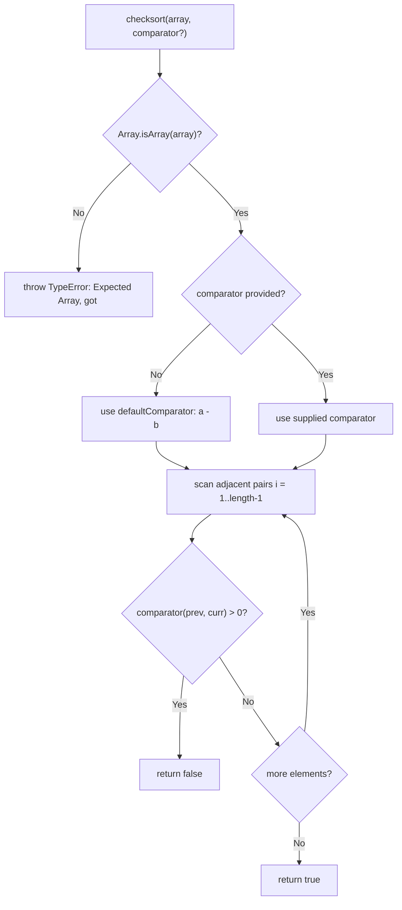

# API Reference — checksort

`checksort` checks whether a JavaScript `Array` is `sorted` and returns a `boolean`. It is the sole export of the package. `Source: index.js:5,9-13`

## Signature

```javascript
checksort(array, comparator?) => boolean
```

`Source: index.js:5`

## Parameters

| Parameter | Type | Required | Description |
|---|---|---|---|
| `array` | `any[]` | yes | The array to test for sortedness. `Source: index.js:5-6` |
| `comparator` | `(a, b) => number` | no | Optional ordering function; defaults to ascending `a - b`. `Source: index.js:1-3,7` |

The `comparator` contract matches `Array.prototype.sort`: return `< 0` if `a` should come before `b`, `0` if they are equal, and `> 0` if `a` should come after `b`. `checksort` reports the array as **not** `sorted` as soon as `comparator(prev, curr) > 0`. `Source: index.js:10`

## Default comparator

When no `comparator` is supplied, `checksort` uses the built-in `defaultComparator`, which returns `a - b` — i.e. ascending numeric order. `Source: index.js:1-3,7`

## Custom comparator

Pass a `comparator` to test for any ordering. For descending order use `(a, b) => b - a` — exactly the `descending` comparator used by the test suite. `Source: index.js:7,10`, `Source: test/index.js:5`

```javascript
const sorted = require('is-sorted')

sorted([3, 2, 1], (a, b) => b - a)
// => true
```

## Return value

`boolean` — `true` if the `array` is `sorted` per the `comparator`, otherwise `false`. The empty array `[]` and single-element arrays are vacuously `sorted` and return `true`, because the scan loop (which starts at `i = 1`) never executes its body. `Source: index.js:9-13`

## Errors

`checksort` throws a `TypeError` for non-array input. The message is `Expected Array, got <type>`, where `<type>` is the JavaScript `typeof` of the supplied argument. `Source: index.js:6`

```javascript
const sorted = require('is-sorted')

sorted('foobar')
// throws TypeError: Expected Array, got string
```

`Source: test/index.js:17-22`

## Complexity

- **Time:** `O(n)` — a single left-to-right pass over adjacent pairs. `Source: index.js:9-13`
- **Space:** `O(1)` — no extra allocation. `Source: index.js:9-13`

## TypeScript

The package ships a generic declaration `checksort<T = any>(array: T[], comparator?: (a: T, b: T) => number)` and publishes it with the CommonJS export-assignment form `export = checksort`. `Source: index.d.ts:1-3`

```typescript
import sorted = require('is-sorted')

sorted([1, 2, 3])                    // => true
sorted([3, 2, 1], (a, b) => b - a)   // => true
```

With `esModuleInterop` enabled in `tsconfig.json`, you may instead write `import sorted from 'is-sorted'`. The call is generic over the element type `T`. `Source: index.d.ts:1`

## Behavior

| Array | Comparator | Expected | Fixture |
|---|---|---|---|
| `[]` | default | `true` | `Source: test/fixtures.json:3-4` |
| `[1]` | default | `true` | `Source: test/fixtures.json:7-8` |
| `[5]` | default | `true` | `Source: test/fixtures.json:11-12` |
| `[1, 5]` | default | `true` | `Source: test/fixtures.json:15-16` |
| `[1, 2, 3, 4, 5]` | default | `true` | `Source: test/fixtures.json:19-20` |
| `[1, 1, 3, 4, 5]` | default | `true` | `Source: test/fixtures.json:23-24` |
| `[1, 1.5, 3, 4, 5]` | default | `true` | `Source: test/fixtures.json:27-28` |
| `[1, 2, 3, 4, 6]` | default | `true` | `Source: test/fixtures.json:31-32` |
| `[5, 4, 3, 1, 1]` | descending | `true` | `Source: test/fixtures.json:35-37` |
| `[5, 4, 3, 2, 1]` | descending | `true` | `Source: test/fixtures.json:40-42` |
| `[1, 5, 2, 3, 4]` | default | `false` | `Source: test/fixtures.json:45-46` |
| `[5, 4, 3, 1, 2]` | descending | `false` | `Source: test/fixtures.json:49-51` |

`default` is the built-in `a - b` comparator (`Source: index.js:1-3,7`); `descending` is `(a, b) => b - a` (`Source: test/index.js:5`).

## How it works

The complete implementation is 14 lines. It is reproduced here for explanation only — the source file is **not** modified:

```javascript
function defaultComparator (a, b) {
  return a - b
}

module.exports = function checksort (array, comparator) {
  if (!Array.isArray(array)) throw new TypeError('Expected Array, got ' + (typeof array))
  comparator = comparator || defaultComparator

  for (let i = 1, length = array.length; i < length; ++i) {
    if (comparator(array[i - 1], array[i]) > 0) return false
  }

  return true
}
```

`Source: index.js:1-14`

- **Input guard** — non-array input throws `TypeError: Expected Array, got <type>`. `Source: index.js:6`
- **Comparator defaulting** — when no `comparator` is passed, `defaultComparator` (`a - b`) is used. `Source: index.js:7`
- **Single-pass scan** — the loop walks adjacent pairs starting at `i = 1`, so empty and single-element arrays skip the body entirely. `Source: index.js:9`
- **Early exit** — the first out-of-order pair, where `comparator(array[i - 1], array[i]) > 0`, returns `false` immediately. `Source: index.js:10`
- **Sorted result** — if no out-of-order pair is found, the function returns `true`. `Source: index.js:13`

> This is an inline Markdown explanation of the algorithm; the source file is not edited.

## Control flow



`Source: index.js:5-13`

## Examples

**Default ascending** — `Source: index.js:7`, `Source: test/fixtures.json:19-20,45-46`

```javascript
const sorted = require('is-sorted')

sorted([1, 2, 3, 4, 5])  // => true
sorted([1, 5, 2, 3, 4])  // => false
```

**Custom comparator (descending)** — `Source: index.js:10`, `Source: test/index.js:5`, `Source: test/fixtures.json:40-42`

```javascript
const sorted = require('is-sorted')

sorted([5, 4, 3, 2, 1], (a, b) => b - a)  // => true
```

**TypeScript** — `Source: index.d.ts:1-3`

```typescript
import sorted = require('is-sorted')

sorted([1, 2, 3])                    // => true
sorted([3, 2, 1], (a, b) => b - a)   // => true
```

**`TypeError` on non-array input** — `Source: index.js:6`, `Source: test/index.js:17-22`

```javascript
const sorted = require('is-sorted')

sorted('foobar')  // throws TypeError: Expected Array, got string
```

---

[← Back to README](../README.md)
